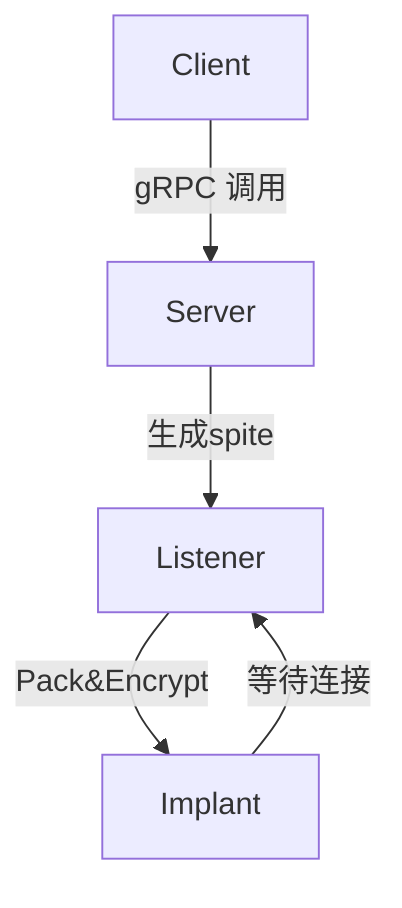

IoM中需要知道的概念

## 通讯

Spite是整个IoM通讯的最小单元



Spite 是在server/listener <--> implant 之间进行数据交换的载体. 所有的需要与交互implant的操作都需要构造Spite结构体.

Spite基于protobuf实现, 具体定义请见: [proto仓库](https://github.com/chainreactors/proto) 下的 [implant.proto](https://github.com/chainreactors/proto/blob/master/implant/implantpb/implant.proto)

```protobuf
message Spite {
  string name = 1;  // 用来寻找implant中的module
  uint32 task_id = 2; // task_id
  bool  async = 3;    // deprecated
  uint64 timeout = 4; // deprecated
  uint32 error = 5;   // malefic本体错误码
  Status status = 6;  // task状态

  oneof body {        // module需要的部分
    Empty empty = 10;  
    Block block = 11;
    AsyncACK async_ack = 13;
    SysInfo sysinfo = 20;
    Register register = 21;
    Ping ping = 22;
    Suicide suicide = 23;
    Request request = 24;
    Response response = 25;
    LoadModule  load_module = 31;
    Modules  modules = 32;
    LoadAddon load_addon = 35;
    Addons addons = 36;
    ExecuteAddon execute_addon = 37;
    ExecuteBinary execute_binary = 42;
    LsResponse ls_response = 101;
	...
  }
}
```

所有与module交互的协议都在这里定义. 并且预留了一些通用的`message` 用来解决新增module时需要频繁修改proto的问题. 

## Listener

IoM中的Listener与其他C2中的概念略有不同. Listener是独立于Server的, 可以部署在任意的服务器上, 通过grpc提供的stream与server进行全双工实时通讯. 

Listener与Server的彻底解耦是IoM的核心设计理念之一, Listener可以是多种形态的,任意伪装的, 位于任意位置的. 这是下一代C2的进化方向之一.


listener有四个主要组件 

- listener , 管理pipeline以及与server交互.
- pipeline, 与implant交互的管道,   每个listener可以有任意个websilte或者pipeline
- forworder, 每个pipeline都会创建一个forworder, 通过forwarder将数据转发至server
- parser/generator, 将来自implant/webshell的数据解析为Spite; 将Spite解析为implant/webshell能识别的二进制数据
- cryptor 流式加密解密器

### pipeline

数据管道

pipeline 是listener与外部implant/webshell交互的数据管道. 

pipleline的形态有很多, 例如:

* tcp/tls  , 监听tcp端口, 接受来自implant的数据, 当前的默认配置
* bind,  主动发起请求的管道, 用来与bind模式的implant交互
* pulse, 专门为pulse实现的pipeline, 因为pulse尽可能减少体积, 无法实现完整的tcp/tls功能.
* website , 类似CS的host功能
* http/https (🛠️), 监听http服务
* rem (🛠️) ,流量服务, 预计会在v0.0.4 上线
* payload generator (🛠️), 用来与webshell主动交互的pipeline

### cryptor (unstable)

v0.0.3 初步支持了自定义加密算法. 

```go
type Cryptor interface {  
    Encrypt(reader io.Reader, writer io.Writer) error  
    Decrypt(reader io.Reader, writer io.Writer) error  
    Reset() error  
}
```

这个Cryptor将直接作用于Conn(与rem相同的设计), 会对全包进行加密解密.  因此只支持流式加密算法. 

目前实现了两种常见的流式加密算法:

* XOR
* AES-CFB

!!! danger "密码学不安全"
	这两种算法都是对称的, 且没有前向后向密码学安全的特性. 


### parser (unstable)

v0.0.3 初步实现了自定义 Parser

parser用来控制最终生成的数据包格式.

server/listener/client之间的交互都通过spite实现, 但在最终发送到目标的数据包可以是任意格式的. 

接口如下:

```go
type PacketParser interface {  
    PeekHeader(conn *peek.Conn) (uint32, uint32, error)  
    ReadHeader(conn *peek.Conn) (uint32, uint32, error)  
    Parse([]byte) (*implantpb.Spites, error)  
    Marshal(*implantpb.Spites, uint32) ([]byte, error)  
}
```

Parse 用来实现二进制数据到Spites的映射.
Marshal实现Spites到二进制数据的映射.
ReadHeader与PeekHeader 尝试用作协议识别, 通过先解密一定长度的header数据， 来自动判定协议类型.

!!! important 
**parser, pipeline, cryptor 是相互解耦的, 可以任意两者之间互相组装的.** 


## Server

https://github.com/chainreactors/malice-network/tree/master/server

!!! tip "server与listener在v0.0.2后合并了二进制文件"
	为了减少在安装与使用上的步骤, 从v0.0.2开始, 使用同一个二进制文件发布. 只需要使用不同的配置文件, 就能开启server或listener, 或同时开启server与listener

server是数据处理的核心, client/listener 都会通过grpc与server进行交互, implant则是通过 listener上的pipeline间接与server进行交互.

所有的数据都在server中维护, 在client/listener中只会保留只读副本.  

server维护了一组状态集合(内存中只会保留当前存活的, 历史数据保存于数据库中):

* clients , 正在连接的所有的用户
* listeners, 正在连接的所有listener
* jobs, 所有的pipeline, 包括(tcp, website等)
* event, 将会轮询所有用户, 将event广播至每个用户
* sessions, 存活的implant, session还为每个implant维护了一些子状态集

并且通过server上的grpc实现对这些状态的增删改查, 事件通知, listener交互等等

### session

session是其中较为复杂的结构, 保存了implant的所有信息. 

session内部还维护了多个子状态集

* 基本信息, 例如操作系统, 进程信息等
* task, 所有正在执行的任务
* connection, 逻辑上的连接状态
* cache, 数据缓存, 通用保存一定大小的历史数据
* module, implant可用的模块
* addon, implant中已加载的组件

### rootrpc

为了方便管理, 我们添加了一个仅server安装程序本地(127.0.0.1)可使用的rpc. 

这个rpc可以用来添加删除用户, 生成新的证书. 

可以在[rootrpc手册](manual/deploy#ROOTRPC) 中查看使用教程

## Implant

目前只提供了一个implant, 即[malefic](https://github.com/chainreactors/malefic), [malefic详细文档](implant/index)
- malefic, 主程序, 包含了beacon/bind两种模式的完整功能
- mutant,  用来实现自动化配置malefic的各种条件编译与特性, 以及生成shellcode, srdi等
- pulse, 最小化的shellcode模板, 对应CS的artifact, 能编译出只有4kb的上线马, 非常适合被各种loader加载
- prelude, 多段上线的中间阶段, 可以在这里按需配置权限维持, 反沙箱, 反调试等功能. 

IoM计划提供一整套互相解耦的implant解决方案, 实现各个阶段各种需求不同的二进制文件生成. 

在设计目标中, implant实际上还有更多的内容, 但受限于精力, 我们暂时只将已实现的, 或短期内将实现的功能进行简单的介绍. 后续将随着开发进度逐步补全. 


## Client

在v0.0.2 IoM彻底重构了client, 现在client有了一些独特的新特性.

在implant中, 已经能动态加载 dll, exe, clr, powershell, bof, shellcode, module七种类型的格式. 对应到client中. 我们通过多个维度的动态拓展的能力将其组合起来. 

client现在支持的动态执行二进制程序(fileless)的命令有:

- execute-assembly, 执行CLR程序, 例如C#,VB编译出来的二进制程序, 支持bypass ASMI,ETW
- execute-exe, 通过牺牲进程反射执行任意语言编译出来的exe程序, 支持参数欺骗, 进程注入, sideload
- inline-exe, 在当前进程内执行exe
- execute-dll, 类似execute-exe, 通过牺牲进程反射执行dll程序, 同样支持参数欺骗, 进程注入, sideload
- inline-dll 类似inline-exe
- execute-shellcode, 类似execute-exe
- inline-shellcode, 类似inline-exe
- powershell, unmanaged powershell, 
- bof, 执行`.o`程序
- load-module , 动态加载模块
- execute-addon, 执行已经加载到implant内存中的程序

与之对应的是一系列管理这些执行能力的插件:

- mal, IoM支持的插件语言带来的拓展能力, 当前支持lua, 能动态注册命令, 或添加新的能力
- addon, 用来防止执行较大体积的二进制文件中反复从服务器发送的问题, 可以在内存中保存二进制程序, 下次使用只需要直接发送参数即可. 
- module, 动态加载的implant module. 
- alias sliver中的alias, 主要用来管理CLR与UDRL的DLL程序
- extension, sliver中的extension, 主要用来管理BOF与sliver特定格式的dll
- armory, sliver的插件包管理工具

现在的client像是一个发射架, 可以支持几乎能找到全部的拓展格式的fileless执行.  并通过多种方式去自定义自己的军火库.

## OPSEC模型

红队视角的OPSEC模型

通过四个维度的评判， 参考CVSS的分级标准。

**评分越高越安全** 分为：

* 低(0-3.9)操作极其容易被检测, 明显痕迹, 造成恶性(失去立足点, 系统崩溃等)后果
* 中(4.0-6.9) 操作可能被检测,痕迹可控, 后果可控
* 高(7.0-8.9) 操作基本不可能不检测, 痕迹较小或无痕迹, 被检测也不会有明显后果
* OPSEC(9.0-10)分, 这个级别的操作被称为OPSEC. 几乎不可能被检测, 没有痕迹, 不会造成后果.

### 暴露度

被EDR/NDR或任意设备检测到的暴露程度

- 是否有新进程创建
- 是否有新线程创建
- 是否有新文件创建
- 是否有新网络连接创建
- 是否需要调用系统api

### 痕迹

被追踪还原操作痕迹的成功率

* 是否可以删除相关操作日志
* 是否可以删除相关文件

### 检测可能性

- 现有检测机制是否有可能追踪
- 在操作系统内部是否有可能被追踪
- 实现相关检测手段复杂性

### 后果

- 操作失败可能带来的后果
- 是否影响长期潜伏
- 是否影响驻留时间

