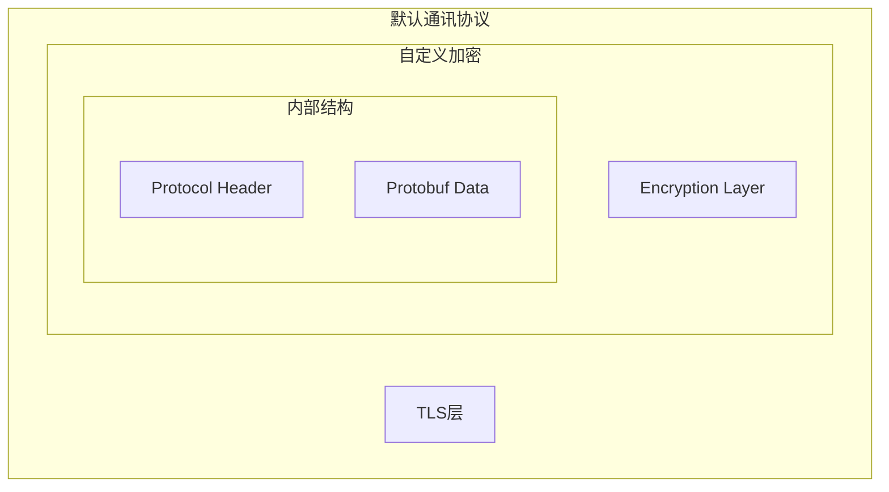

# IoM 核心概念

IoM采用高度解耦的分布式架构，本文档介绍各个核心组件的概念和作用。

!!! tip "与开发者指南的关系"
    本文档介绍概念和架构，具体开发实践请参考[开发者贡献指南](/IoM/guideline/develop/index/)

## Server

数据处理和状态管理的核心组件。

**核心职责**:
- 所有数据的中央管理和持久化
- 提供gRPC服务供Client和Listener调用
- 状态集合管理和事件分发
- 任务调度和结果处理

**架构特点**:
- Client/Listener中只保留只读副本
- 内存中保留当前存活的数据
- 历史数据保存在数据库中

**状态管理**:

| 状态集合 | 用途 | 说明 |
|----------|------|------|
| **clients** | 用户连接管理 | 正在连接的所有用户 |
| **listeners** | 监听器管理 | 所有Listener实例 |
| **jobs** | 任务管道管理 | Pipeline实例(TCP、Website等) |
| **events** | 事件系统 | 轮询用户并广播事件 |
| **sessions** | 会话管理 | 存活的Implant会话 |

**RPC服务**:
通过gRPC实现对状态的CRUD操作、事件通知、Listener交互等功能。

!!! info "二进制文件"
    v0.0.2后Server与Listener使用同一个二进制文件，通过不同配置启动不同模式。

!!! tip "开发指南"
    Server开发详见[Server开发指南](/IoM/guideline/develop/server/)

### Session

Implant会话的状态管理结构，保存单个Implant的完整信息。

**核心功能**:
Session是Server中最复杂的数据结构，负责管理单个Implant的完整生命周期。

**子状态集合**:

| 子状态      | 内容            | 用途         |
| -------- | ------------- | ---------- |
| **基本信息** | 操作系统、进程信息、权限等 | 环境识别和决策    |
| **任务管理** | 正在执行的Task列表   | 任务状态跟踪     |
| **连接状态** | 网络连接的逻辑状态     | 连接管理和故障恢复  |
| **数据缓存** | 历史数据缓存        | 性能优化和数据持久化 |
| **模块信息** | 可用Module列表    | 功能能力管理     |
| **组件管理** | 已加载的Addon     | 内存管理和资源控制  |
| ...      |               |            |

并且还有复杂的同步机制，将在client与listener上维护session的备份。 
## Implant

植入物，在目标系统中执行的核心组件。

https://github.com/chainreactors/malefic/

**主要类型**:
- **Malefic**: 功能完整的主Implant，支持Beacon/Bind模式
- **Pulse**: 轻量级上线马，仅4KB大小，类似CS的artifact  
- **Prelude**: 多段上线的中间阶段，支持权限维持等

**核心特性**:
- 基于Rust实现，跨平台支持
- 模块化设计，动态加载功能
- 多种通讯模式(Beacon/Bind)
- OPSEC友好的设计

**模块系统**:
Implant通过Module系统实现功能扩展，支持编译时静态链接和运行时动态加载。

IoM支持多种格式的无文件执行：

| 类型 | 描述 | 特性 |
|------|------|------|
| **execute-assembly** | CLR程序执行 | 支持bypass AMSI/ETW |
| **execute-exe** | PE程序反射执行 | 参数欺骗、进程注入 |
| **inline-exe** | 当前进程内执行 | 无新进程创建 |
| **execute-dll** | DLL反射执行 | 支持sideload |
| **execute-shellcode** | Shellcode执行 | 灵活的注入方式 |
| **powershell** | Unmanaged PowerShell | 绕过PowerShell限制 |
| **bof** | Beacon Object File | 轻量级功能扩展 |
上诉拓展能力能满足绝大部分场景。

!!! tip "开发指南"
    Implant开发详见[Implant开发指南](/IoM/guideline/develop/implant/)

## Client

用户交互界面，负责命令输入和结果展示。

**架构特性**:
- 通过gRPC与Server通讯
- 支持CLI和GUI两种模式
- 高度可扩展的插件系统

### **插件生态**

| 插件类型          | 用途         | 兼容性      |
| ------------- | ---------- | -------- |
| **Mal插件**     | Lua脚本扩展    | IoM原生    |
| **Module**    | 动态模块加载     | IoM原生    |
| **Addon**     | 二进制程序缓存    | IoM原生    |
| **Alias**     | CLR/UDRL管理 | Sliver兼容 |
| **Extension** | BOF管理      | Sliver兼容 |
| **Armory**    | 插件包管理      | Sliver兼容 |


!!! tip "开发指南"
    Client开发详见[Client开发指南](/IoM/guideline/develop/client/)


## 通讯

C2的本质就是安全的通讯与命令下发。我们需要将Client/Server/Listener/Implant 四端打通， 因此通讯设计是其中核心。 
### Spite

Spite是整个IoM通讯的最小单元，是server/listener <--> implant之间进行数据交换的载体。

**核心特性**:
- 基于Protobuf实现，高效序列化
- 统一的数据交换格式
- 支持任务状态管理
- 模块化的body设计

**结构定义**:
```protobuf
message Spite {
  string name = 1;      // 目标module名称  
  uint32 task_id = 2;   // 任务ID
  uint32 error = 5;     // 错误码
  Status status = 6;    // 任务状态
  
  oneof body {          // 具体数据载体
    Request request = 24;     // 通用请求
    Response response = 25;   // 通用响应  
    LoadModule load_module = 31;
    ExecuteBinary execute_binary = 42;
    // ... 更多模块特定的消息类型
  }
}
```

**使用场景**:
- Client通过RPC调用生成Spite
- Server将Spite转发给对应Listener  
- Listener通过Parser和Cryptor处理Spite
- Implant接收Spite并路由到对应Module执行

!!! info "协议定义"
    完整定义请参考[proto仓库](https://github.com/chainreactors/proto)的[implant.proto](https://github.com/chainreactors/proto/blob/master/implant/implantpb/implant.proto) 

### Listener

分布式监听服务，负责与Implant的实际通讯。

**设计理念**:
IoM的Listener与传统C2框架最大的不同是完全独立于Server，可以部署在任意服务器上，通过gRPC Stream与Server进行全双工通讯。


**核心特性**:
- **分布式部署**: 可在任意服务器上部署
- **完全解耦**: 与Server独立，故障隔离
- **多形态支持**: 支持各种伪装和隐蔽形式
- **实时通讯**: 通过gRPC Stream与Server双向通讯

**内部架构**:
- **Listener核心**: 管理Pipeline和与Server交互
- **Pipeline**: 具体的数据管道实现
- **Forwarder**: 数据转发组件
- **Parser**: 协议解析器
- **Cryptor**: 加密解密器

!!! tip "开发指南"
    Listener开发详见[Server开发指南](/IoM/guideline/develop/server/#listener开发)

### Pipeline

数据管道，Listener与Implant/WebShell交互的具体实现。

**概念说明**:
Pipeline相当于传统C2框架中的Listener概念，但IoM进一步细分了其实现。每个Listener可以运行多个Pipeline，Pipeline负责与Implant的具体交互。

**主要类型**:

| 类型 | 用途 | 状态 |
|------|------|------|
| **TCP/TLS** | 监听TCP端口，默认配置 | ✅ 稳定 |
| **HTTP/HTTPS** | HTTP协议通讯 | 🛠️ 开发中 |
| **Bind** | 主动连接bind模式Implant | ✅ 稳定 |
| **Pulse** | 轻量级Pulse专用管道 | ✅ 稳定 |
| **Website** | 静态文件托管(类似CS的host) | ✅ 稳定 |
| **REM** | 流量代理和转发服务 | 🛠️ 计划中 |

**交互模式**:
- **Beacon模式**: 解析心跳包并返回任务数据
- **Bind模式**: 主动向目标发起连接  
- **Website模式**: 提供HTTP服务分发文件
- **代理模式**: 提供端口转发和流量中转

**可扩展性**:
通过实现Pipeline的基本RPC控制接口，可以接入各种形式的Pipeline，如云函数、代理、[LOLC2](https://lolc2.github.io/)等。

!!! important "设计特点"
    Pipeline比传统Listener设计更加灵活，支持更丰富的功能，并且与Parser、Cryptor完全解耦。

### Parser

协议解析器，控制最终数据包格式的组件。

**设计目的**:
Parser提供了协议实现的抽象层。虽然内部组件间通过Spite通讯，但最终发送到目标的数据包可以是任意格式。

**接口定义**:
```go
type PacketParser interface {  
    PeekHeader(conn *peek.Conn) (uint32, uint32, error)  
    ReadHeader(conn *peek.Conn) (uint32, uint32, error)  
    Parse([]byte) (*implantpb.Spites, error)  
    Marshal(*implantpb.Spites, uint32) ([]byte, error)  
}
```

**核心功能**:
- **Parse**: 二进制数据 → Spites映射
- **Marshal**: Spites → 二进制数据映射  
- **ReadHeader/PeekHeader**: 协议识别和header解析

**默认协议栈**:


**扩展能力**:
- 自定义传输协议格式
- 接入第三方C2框架
- 作为其他C2的external listener
- 适配不同的implant协议

### Cryptor

流式加密解密器，负责数据流的加密处理。

**接口设计**:
```go
type Cryptor interface {  
    Encrypt(reader io.Reader, writer io.Writer) error  
    Decrypt(reader io.Reader, writer io.Writer) error  
    Reset() error  
}
```

**特性**:
- 直接作用于连接流(与REM相同设计)
- 支持流式加密算法
- 对全包进行加密解密

**当前实现**:
- **XOR**: 简单异或加密
- **AES-CFB**: AES CFB模式


!!! important "组件解耦"
    Parser、Pipeline、Cryptor三者完全解耦，可以任意组合使用，提供极大的灵活性。 


## OPSEC模型

IoM设计了基于四个维度的OPSEC评估模型，参考CVSS评分标准。

### 评分体系

**评分范围**: 0-10分，分越高越安全

| 等级 | 分数 | 描述 |
|------|------|------|
| **低** | 0-3.9 | 极易被检测，明显痕迹，可能造成严重后果 |
| **中** | 4.0-6.9 | 可能被检测，痕迹可控，后果可控 |
| **高** | 7.0-8.9 | 基本不被检测，痕迹较小，后果轻微 |
| **OPSEC** | 9.0-10 | 几乎不可能被检测，无痕迹，无后果 |

### 评估维度

**1. 暴露度** - EDR/NDR检测风险
- 进程创建活动
- 线程创建活动  
- 文件系统操作
- 网络连接建立
- 系统API调用

**2. 痕迹** - 操作可追溯性
- 日志删除能力
- 文件清理能力
- 注册表痕迹
- 内存痕迹

**3. 检测可能性** - 被发现的概率
- 现有检测机制覆盖
- 系统级追踪可能性
- 检测实现复杂度

**4. 后果** - 被发现后的影响
- 立足点丢失风险
- 长期潜伏影响
- 整体行动暴露
