IoM中需要知道的概念

## Spite

Spite 是在client 与implant 之间进行数据交换的载体. 所有的需要与交互implant的操作都需要构造Spite结构体.

Spite的定义位于使用protobuf的[通讯协议仓库](https://github.com/chainreactors/proto) 下的 [implant.proto](https://github.com/chainreactors/proto/blob/master/implant/implantpb/implant.proto)

```protobuf
message Spite {
  string name = 1;  // 用来寻找implant中的module
  uint32 task_id = 2; // task_id
  bool  async = 3;    // deprecated
  uint64 timeout = 4; // deprecated
  uint32 error = 5;   // malefic本体错误码
  Status status = 6;  // task状态

  oneof body {        // module需要的部分
    Empty empty = 10;  
    Block block = 11;
    AsyncACK async_ack = 13;
    SysInfo sysinfo = 20;
    Register register = 21;
    Ping ping = 22;
    Suicide suicide = 23;
    Request request = 24;
    Response response = 25;
    LoadModule  load_module = 31;
    Modules  modules = 32;
    LoadAddon load_addon = 35;
    Addons addons = 36;
    ExecuteAddon execute_addon = 37;
    ExecuteBinary execute_binary = 42;
    LsResponse ls_response = 101;
	...
  }
}
```

所有与module交互的协议都在这里定义. 并且预留了一些通用的`message` 用来防止新增module时需要频繁修改proto的问题. 

## Listener

IoM中的Listener与其他C2中的概念略有不同. Listener是独立于Server的, 可以部署在任意的服务器上, 通过grpc提供的stream与server进行全双工实时通讯. 

Listener与Server的彻底解耦是IoM的核心设计理念之一, Listener可以是多种形态的,任意伪装的, 位于任意位置的. 这是下一代C2的进化方向之一.

```mermaid
graph LR
	MSF["MSF\n监听在本机"] --> Cobaltstrike["Cobaltstrike\n监听在Server"] --> IoM["IoM\n可以在任意服务器上监听"]
```



listener由三个部分组成. 

- pipeline listener上执行监听端口的部分.  每个listener可以有任意个websilte或者pipeline
- forworder 每个pipeline都会通过forworder将数据转发至server
- parser 将来自implant/webshell的数据解析为Spite
- generator 将Spite解析为implant/webshell能识别的二进制数据
### pipeline

数据管道

pipeline 是listener与外部implant/webshell交互的数据管道. 

pipleline的形态有很多, 例如:

* tcp/tls  , 监听tcp端口, 接受来自implant的数据, 当前的默认配置
* http/https (🛠️), 监听http服务
* website , 类似CS的host功能
* rem (🛠️) ,流量服务, 预计会在v0.0.4 上线
* payload generator (🛠️), 用来与webshell主动交互的pipeline

### parser (🛠️)

数据包解析器. 

### generator (🛠️)

Spite生成器

## Server

https://github.com/chainreactors/malice-network/tree/master/server

!!! tip "server与listener在v0.0.2后合并了二进制文件"
	为了减少在安装与使用上的步骤, 从v0.0.2开始, 使用同一个二进制文件发布. 只需要使用不同的配置文件, 就能开启server或listener, 或同时开启server与listener

server是数据处理的核心, client/listener 都会通过grpc与server进行交互, implant则是通过 listener上的pipeline间接与server进行交互.

所有的数据都在server中维护, 再client/listener中只会保留只读副本.  


server维护了一下状态集合(内存中只会保留存活的, 所有的数据保存于数据库中):

* client , 正在连接的所有的用户
* listener, 正在连接的所有listener
* job, 所有的pipeline, 包括(tcp, website等)
* event, 将会轮询所有用户, 将event广播至每个用户
* session, 存活的implant, session还为每个implant维护了一些子状态集

### session

session是其中较为复杂的结构, 保存了implant的所有信息. 

session内部还维护了多个子状态集

* 基本信息, 例如操作系统, 进程信息等
* task, 所有正在执行的任务
* connection, 逻辑上的连接状态
* cache, 数据缓存, 通用保存一定大小的历史数据
* module, implant可用的模块
* addon, implant中已加载的组件

### rootrpc

为了方便管理, 我们添加了一个仅server安装程序本地(127.0.0.1)可使用的rpc. 

这个rpc可以用来添加删除用户, 生成新的证书. 

可以在[rootrpc手册](manual/deploy#ROOTRPC) 中查看使用教程

## Implant

目前只提供了一个implant, 即[malefic](https://github.com/chainreactors/malefic)

rust的crate的结构就是malefic的组成部分, 打开[malefic](https://github.com/chainreactors/malefic)就能看到:

- [core](https://github.com/chainreactors/malefic/tree/master/malefic), malefic主程序, 提供了一个跨平台的任务调度器, 本身不包含网络功能, 也没有任何有威胁的系统调用. 这个调度器理论上可以使用任意语言编写的类似功能代替. 
- config, 用来自动管理malefic条件编译的配置工具
- modules, malefic可用的模块
- trait, 过程宏, 通过宏简化模块编写.
- helper 辅助函数, 以及暴露kit中的函数, 简化依赖关系.  
- kits 各种操作系统的高级特性工具包, (二进制开源)
	- [win-kit](https://chainreactors.github.io/wiki/IoM/manual/implant_win_kit/) , 提供了bof, loadpe, sleepmask等等一系列高级特性的工具包
- prelude(🛠️) stage 0 生成器, 包含了反沙箱, 反调试, 反ETW, 反Hook等一系列在主程序加载前的loader. 
- loader (🛠️), 预计在v0.0.3上线, stage 1生成器, 提供了启动时的autorun(自动按照预配置执行一系列module), 用来权限维持,信息收集或者分阶段上线. 通过低代码模板快速编排(通过config的yaml自动生成代码)

IoM计划提供一整套互相解耦的implant解决方案, 用来实现各个阶段各种需求的任务. 


在设计目标中, implant实际上还有更多的内容, 但受限于精力, 我们暂时只将已实现的, 或短期内将实现的功能进行简单的介绍. 后续将随着开发进度逐步补全. 


## Client

在v0.0.2 IoM彻底重构了client, 现在client有了一些独特的新特性.

在implant中, 已经能动态加载 dll, exe, clr, powershell, bof, shellcode, module七种类型的格式. 对应到client中. 我们通过多个维度的动态拓展的能力将其组合起来. 

client现在支持的动态执行二进制程序(fileless)的命令有:

- execute-assembly, 执行CLR程序, 例如C#,VB编译出来的二进制程序, 支持bypass ASMI,ETW
- execute-exe, 通过牺牲进程反射执行任意语言编译出来的exe程序, 支持参数欺骗, 进程注入, sideload
- inline-exe, 在当前进程内执行exe
- execute-dll, 类似execute-exe, 通过牺牲进程反射执行dll程序, 同样支持参数欺骗, 进程注入, sideload
- inline-dll 类似inline-exe
- execute-shellcode, 类似execute-exe
- inline-shellcode, 类似inline-exe
- powershell, unmanaged powershell, 
- bof, 执行`.o`程序
- load-module , 动态加载模块
- execute-addon, 执行已经加载到implant内存中的程序

与之对应的是一系列管理这些执行能力的插件:

- mal, IoM支持的插件语言带来的拓展能力, 当前支持lua, 能动态注册命令, 或添加新的能力
- addon, 用来防止执行较大体积的二进制文件中反复从服务器发送的问题, 可以在内存中保存二进制程序, 下次使用只需要直接发送参数即可. 
- module, 动态加载的implant module. 
- alias sliver中的alias, 主要用来管理CLR与UDRL的DLL程序
- extension, sliver中的extension, 主要用来管理BOF与sliver特定格式的dll
- armory, sliver的插件包管理工具

现在的client像是一个发射架, 可以支持几乎能找到全部的拓展格式的fileless执行.  并通过多种方式去自定义自己的军火库.


