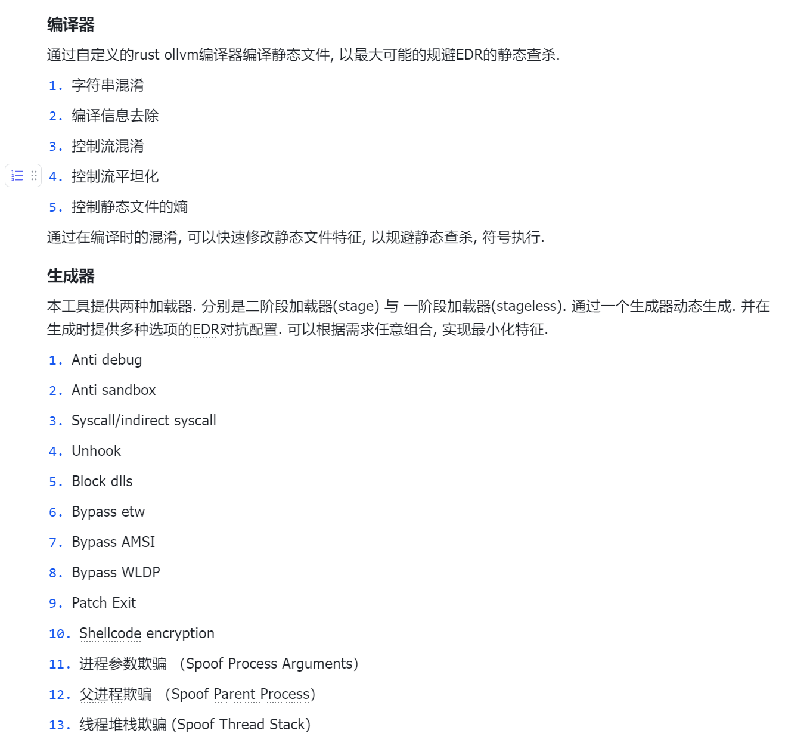
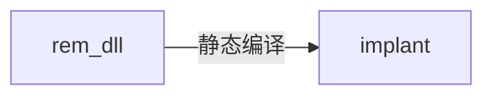
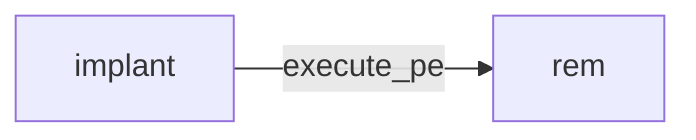

*IoM的设计比其他工具更为复杂, 每个功能的设计都会编写独立的设计细节问题, 本文只提供设计目标与设计理念说明.*

## 背景

近年来开展的大量攻防活动将网络安全行业推向了实网对抗(Real World), 而不再是模拟环境(CTF), 理论环境(传统网络安全建设)的对抗. 在实网对抗中, 攻击方延申出了三个主要的细分领域:

1. pre-exploit 通过各种方式的信息收集, 找到可以 exploit 的目标, 这个方向发展出了 ASM(攻击面管理), Cyberspace-Mapping(网络空间测绘), VM(漏洞管理)等细分领域的产品.
2. exploit 这个方向有传统的 Scanner(自动化扫描器), 今年来也出现了新兴领域 BAS(入侵模拟), Exploit-Framework(漏洞利用框架), Exploit-Platform(漏洞知识库/漏洞交易平台)等等
3. post-exploit 后利用, 这个领域的防守方的防护手段越来越成熟, 有大量 `*DR/HIDS`(端上防护), SOAR(自动化响应), CTI(威胁情报) 设备等等, 但在攻击方视角中, 全部的对抗都凝缩在 AS(攻击模拟, 可以理解为 C2/Webshell)上.

上面每个提到的每个偏向防守的细分领域在近些年来都出现了对应的创业公司, 有不少已经成长为庞然大物.

但对于偏向攻击模拟方向, 一般是由乙方组建的攻击队实施, 其中基建是他们最核心的能力, 需要让这块能力维持黑盒状态以保持对友商的领先. 甲方只能通过购买服务的方式, 至多也只能挖几个经验丰富的红队. 尽管这两年出现了一个新概念 BAS(入侵和攻击模拟), 通过使用 playbook 的方式自动化重放攻击过程, 实现了一定程度上对防护能力的检验, 但因 playbook 的强度远远小于红蓝对抗的强度, BAS 至多成为红蓝对抗的下位替代, 而非 SRC 之于漏扫这样的补充.

而在国外出现了不少这个领域(offensive security 领域)的创业公司. 国内暂时很难复现他们的路线, 但是至少应该进行一些实验.

几乎所有企业的绝大部分安全预算都用在对 C2(以及相关衍生技术)的防护上, 但在国内却缺少对应的模拟能力. 不论是甲方建设内部蓝军, 亦或是为了红蓝对抗需求的乙方红队或独立红队都需要一套基础设施来模拟或检测. 红蓝对抗的效果是远远优于依赖僵硬的 playbook 的 BAS 的.

近年来大型企业都建立了自己的蓝军, 但安全行业只提供防护类产品, 蓝军面临着光有人, 其他的一切都得自己搭建的困难

## 生态

https://howto.thec2matrix.com/ 调研了较为主流的 C2 框架.

基于自身的经验, 也对我使用过的框架简单总结优缺点.

### 国外商业化产品

- [CobaltStrike](https://www.cobaltstrike.com/) 开发商 outfrank, 近些年最流行的 C2 框架, 凭借着方便的 GUI, 极高的拓展性, 社区以及二开便利优势拿下了最高的市场占有率. 并有一系列的相关领域的工具链, https://www.outflank.nl/products/outflank-security-tooling/ . 随着 4.5 版本的源码泄露, 有越来越多的基于其源码二开的框架.
- [Metasploit](https://www.metasploit.com/) 开发商 rapid7, 拥有最全面的 exploit 与 post-exploit 框架, 市面上能见到的绝大部分自研 C2 不是基于 CS 二开就是基于 MSF 二开. 但也因为过于笨重以及在 teamserver 方面的劣势, 在实战中并不常见. 有一个基于 MSF 的 teamserver 与 gui 化的开源项目 https://github.com/FunnyWolf/Viper
- [nighthawk](https://www.mdsec.co.uk/nighthawk/) 来自英国的商业化 C2 框架, 专注 opsec, 但因为无公开流出版本, 没有深度体验.
- [bruteratel](https://bruteratel.com/) 来自美国商业 C2 框架, 近期有流出版本, 有被 apt,勒索组织使用案例.

### 开源生态

- [sliver](https://sliver.sh/) 开发商 bishopfox. 一个新兴的开源 C2. 拥有许多独特的功能, 例如 cursed, 密码学安全的流量特性等, 以及自己的生态 armory.
- [havoc](https://github.com/HavocFramework/Havoc) implant 基于 C 开发, 通过兼容 BOF 获得了不少 CS 的能力.
- [mythic](https://github.com/its-a-feature/Mythic) 本质上是一套通讯协议， 实现了这个通讯协议的 agent 可以与这个框架交互.

### 小结

从基础功能上来说, 基本功能之间大同小异, 稳定运行的 implant, 适合团队协作的 teamserver, 便利的客户端. 商业化工具与开源工具最大的区别是在 OPSEC 上, 其中做得比较好的是 nighthawk 与 cobaltstrike, 他们拥有大量未公开的 EDR 对抗技术, 并有良好的工程化与自定义方案。

而在国内并不缺少单独的 EDR 对抗技术, 有大量公开或未公开的技术在开源世界或者私下流传, 但缺少一个可以高度定制化的框架将这些独立的技术工程化, 使其变成一个统一的基础设施.

nighthawk 与 cobaltstrike 都是闭源的工具, 他们虽然提供了各种接口以供用户客制化, 但在最核心的部分, 因为缺少代码, 只能依赖其官方迭代. 并且 nighthawk 与 cobaltstrike 都有严格的对中国出口限制.

**最重要的是, 国内的环境诞生了一系列强大的 webshell 管理工具, 他们实际上也是某种意义上的 C2, 从工程上来看, 理论上能完全复用 C2 的后渗透基建.**

可以想象一个能调用 cobaltstrike 的 cna 脚本的冰鞋/哥斯拉有多么强大!

## 架构/architecture

**进攻是最好的防御.**

Internal of Malice(恶联网) 力图实现一套 post-exploit 基础设施, 在兼容 CS,MSF,Sliver 生态的同时, 提供更高的拓展性与隐蔽性, 并提供一套工程化的解决方案.

组件(WIP 为目前尚未实现的部分):

- server 数据处理与交互服务
- 监听器(listener), 与 server 解耦, 可以独立于 server 单独部署
  - 反向连接器, 用来接收反连数据
  - 正向连接器, 用来连接 webshell 或者正向连接的 implant (WIP)
  - 开放接口, 支持第三方implant/webshell
- 植入物(implant), 并能接受任意语言编写的插件
  - 基于 rust 的全平台反向植入物
  - 基于 webshell 的正向植入物 webshell (WIP)
  - loader generator (WIP)
  - ollvm 编译器 (WIP)
  - webshell/bind , 基于 web/其他协议的正向的 implant (WIP)
- client
  - cli
  - gui (WIP)
- 插件生态

  - implant 端插件

    - armory, sliver 的插件生态
    - BOF, cobaltstrike 的 bof 插件生态
    - dynamic module, IoM 自身的插件生态
    - UDRL, DLL loader
    - HeadlessPE, PEloader
    - CRL(C# loader)
    - Unmanaged powershell
    - ......

  - server 端插件

安全的对抗几乎都集中在 post-exploit 上, 在 pre-exploit 上, 防守方能做的只有收敛攻击面， 在 exploit 对抗上只能做好 VM(漏洞管理) 解决 1day/nday 问题。 这两者加起来, 都对 0day 无能为力, WAF 这类流量设备进行的抵抗不足为惧, 真正能解决这个问题的是在 post-exploit 过程中的对抗. post-exploit 对抗过程中出现了纵深防护, 态势感知, 零信任等等方法, 出现了长长的一系列产品, 全都是用来与 C2 对抗. 所以 C2 是红蓝双方争夺最激烈最重要的高地.

## 设计

当我们真正开始着手去实现时, 遇到的困难比想象多得多.

我调研了开源世界中大部分知名 C2 的架构与实现, 80%以上 C2 实际上只实现了命令执行, 上传下载. 说实话很难称得上是 C2.

但也发现了有几个实现非常成熟的, 从架构与设计上都非常优雅的框架. 也就是在背景中提到过的 sliver, havoc, mythic. 这三个框架的架构完全不同, 各有各的优缺点. 其中 sliver 是最年轻的框架, 其架构也是最符合现代设计理念的 C2 框架.

### 通讯设计

sliver 的 implant/client/server 都通过 go 实现, 并使用 grpc 作为其通讯协议.

client 与 server 通过 protobuf 提供的 rpc 通讯, server 与 implant 通讯则是将数据包封装为统一的`Envelope` message, 然后对`Envelope`的 Data 和 Type 字段进行二次的序列化/反序列化操作, 获得真正的数据. 再在各端之间加上 mtls, 对流量进行加密.

implant 端则通过一个`handler`去分发数据到各个模块, 模块的执行结果同样通过`Envelope`返回到 server 中.

sliver 的多信道支持基于 go 非常优雅的 conn 相关的抽象, 服务端只需要实现`listener`和`accept`, 在 implant 实现`dialer`. 就能让实际的通讯协议隐藏在`conn`下, 大部分 go 的代理工具也是都是这样设计. 可以很快拓展出各种各样的通讯信道. 这一点 go 对比其他语言的优势非常大. 现在的 sliver 不支持 icmp 信道, 但是如果想要拓展, 几乎不需要什么修改, 两三行的修改即可运作.

sliver 默认提供的是正向链接, 并通过 mtls 加密. 它的 beacon(反向连接)并不如正向稳定.

而 sliver 最优雅的设计就是这一套通讯设计. 我们沿用其部分设计, 例如 implant/client/server 之间的通讯通过 protobuf 定义. 但我们没有使用`Envelope`这种需要两次反序列化的设计. 而是采用了 protobuf3 提供的`oneof`实现了类似的功能. 就像这样:

```
message Spite {
  string name = 1;
  uint32 task_id = 2;
  bool  async = 3;
  uint64 timeout = 4;
  uint32 error = 5;
  Status status = 6;

  oneof body {
    Empty empty = 10;
    Block block = 11;
    AsyncACK async_ack = 13;
    Register register = 21;
    Ping ping = 22;
    Suicide suicide = 23;
    Request request = 24;
    Response response = 25;
    LoadModule  load_module = 31;
    Modules  modules = 32;
    Extensions extensions = 40;
    LoadExtension load_extension = 41;
    ExecuteExtension execute_extension = 42;
    ...
  }
}
```

#### 解耦 Listener

把 server 和 listener 放在一起是很危险的行为. 现代化的 C2 设计中, 很常见的选择是添加一个`redirector`, 用来转发数据来实现回连的分布式. 但可能会面临这样一个问题, `redirector`只能转发原样的数据, 既然已经被发现了, 原本的流量特征很有可能已经被识别了, 就算通过`redirector`自动切换备用线路或者域前置, 也逃不过再次应急. `redirector`的作用就只是隐藏真实的 server 地址, 能不能做得更多呢?

只需要换个思路, 既然转发器不适合, 那就直接部署 Listener, 是一个有完整数据解析处理能力的边缘节点. 既可以实现隐藏主服务器, 也可能做得更多. 例如, 当一个`redirector` 发生断联时, implant 会尝试使用完全不同的协议连接到备用的 listener 中. 这个完全不同的协议可以是协议特征不同, 也可以协议的传输层都不同.

解耦出来的 Listener 还可以做得更多, 在 IoM 的整体设计中包含了 webshell 相关的功能, Listener 还可以作为流量的出口节点实现与 webshell 交互的相关功能.

### 插件生态

经过多年的发展，MSF、CobaltStrike、Sliver 这些工具都积累了庞大的插件生态与社区支持。IoM 尝试了最大可能的兼容已有的插件生态。

#### implant 端插件

已兼容的插件生态:

- ReflectiveDLL
- CRL 生态，兼容能运行在 CRL 运行时中的二进制文件
- CobaltStrike 的 BOF 生态
- Powershell 生态
- PE 生态, 兼容绝大多数的 PE 文件
- sliver Armory生态

这些生态如此繁杂, 如CS提供了`agressor script`将这些拓展能力变成CNA脚本, 集成到用户端. 可以在下文中看到关于IoM的插件语言的设计.

##### malice module

在兼容已有的插件生态的同时， 我们也推出了自己插件格式。

能够反射加载采用本工具指定结构的模块，默认使用 rust 编写；同时支持实现了 FFI 接口的其他语言的二进制文件，实现跨语言的模块热加载。

通过 malice module 编写的插件能在编译时被自由的组装，根据不同的场景按需生成不同的 implant

##### 自定义Listener Parser

现在的listener提供了与malefic通讯协议交互的parser. 目前存在一定的耦合.

但在IoM的设计中, server/client/listener是通用基础设施, malefic并不是IoM implant的唯一实现, 可以在不修改implant/webshell代码的情况下接入IoM的通用基础设施. 只需要在Listener的Parser中提供对应写的解析支持, 即可实现. 

我们计划提供对listener的二次开发接口与文档, 让listener能支持任意的第三方implant/webshell. 并且我们也会提供冰蝎/哥斯拉 以及CS的beacon作为兼容示范. 

#### 用户侧插件

CobaltStrike 提供了 Aggressive Script 作为用户侧的插件编写语言, [xiebroC2](https://github.com/INotGreen/XiebroC2) 则使用 lua 作为插件编写的语言. sliver 中则使用了 SDK 实现这个需求，protobuf+grpc 几乎天然得实现了多语言的 SDK. 暂未发布的 sliver1.6 还通过非交互式的命令行能实现通过 sh/cmd 脚本调用 client 实现类似能力.

IoM 采用了与 sliver 类似的通讯设计, 因此也自然而然能导出一个基于 protobuf+grpc 的多语言 SDK, 通过 protobuf 生成的 SDK 能覆盖大多数语言(来自 google 的顶级跨语言支持).

##### 兼容 Armory

从上文也能看得出来, 因为 IoM 和 sliver 采用了相似的通讯设计(实际上也复用了 sliver 大量 server/client 的代码), 兼容 Armory 生态也变得顺其自然了.

Armory 生态分为`alias`和`extension`两大类, 通过 https://github.com/sliverarmory/armory/blob/master/armory.json 作为插件索引.

可以从索引中找到对应的仓库, 然后下载并动态加载到 client/implant 中.

其中`alias`实际上是命令的别名, 将一些较为复杂的用法封装为固定的预设.

`extension` 则会在 implant 内存中驻留. 例如大量的 BOF 插件都是通过 extension 实现的, 首先会注册`coff-loader`到 implant 的 extension 标中. 然后后续执行的 extension 如果`extension.json`中存在`"depends_on": "coff-loader"` 则会使用 implant 中对应的 extension 去加载这个 extension.

我们只需要在 IoM 中实现类似的操作, 并将其对接即可完美兼容 armory.

##### 兼容 CNA

其中拥有最大社区生态的 CobaltStrike 的 CNA 插件如果能被迁移到 IoM 中， 可以省去很多迁移与重复开发时间. 这个目前来看还有很有挑战性.

`Aggressive Script` 基于[`Sleep`语言](http://sleep.dashnine.org/)实现, 目前这个语言只有 java 的实现. 如果要兼容 CNA 脚本, 首先需要能解析这个语言的前端, 然后在其中注册与 CobaltStrike 中的每个 API. 将每个 API 与 IoM 中的 rpc 实现同等功能的对接. 这里面的工作量非常大, 因此暂时我们还见不到这个功能.

##### Mal

Mal插件生态将提供

* lua与TCL的嵌入式脚本语言支持, 可以在client加载对应的插件包. 
* 在server提供多语言SDK. 提供任意语言的rpc调用

通过将rpc注册到client端的lua/TCL中函数实现类似CS的agressor_script支持.

并通过mals仓库索引社区中的插件仓库. 

**Mal插件生态的实现将会是接下来的第一优先级.**

### 端上对抗

现代 C2 框架最重要的是如何设计 opsec 相关功能. 在 IoM 中, 我们实现了 cobaltstrike 能提供的绝大部分用于 opsec 的对抗. 并加入了更多的我们自己的想法.

现代 EDR（端上检测与响应系统）已经能查杀绝大多数的恶意行为, 从静态查杀、符号执行、HOOK、沙箱等等手段全方位的防护恶意软件. 公开的手段很难躲避现代 EDR 的查杀. 而后渗透使用到了大量敏感危险的操作, 使得行动很容易暴露在安全设备中.

部分 C2 为了防止被 EDR 查杀, 选择采用只有执行命令、上传、下载的先锋马进行操作, 放弃了绝大多数能力, 但不一定是所有场景的最佳选择, 为了与现代化的 EDR 对抗，更应该采用现代化的武器架构与能力，尽可能的在保留功能的情况下规避 EDR 的查杀。提高操作者的效率与能力。

端上对抗的效果很大程度上依赖于闭源, IoM 的 implant 不涉及底层 api 部分的代码将会开源, 可能存在与 EDR 对抗的部分则会使用有限开源的方式, 将编译好的 lib 文件. implant 主体在编译时将 lib 静态编译.

端上对抗演变至今已经有非常多的对抗维度, 这带来最直观的困难就是工程规模, 有无数的组件需要重新实现一遍. 包括但不限于:

- 静态特征
- 符号执行
- 内存特征
- 行为特征
- 反 HOOK 反分析
- ...

将这些维度落地到工程中, 就变成了庞大的需求表, 这里是冰山一角.



### 流量对抗

现代 NDR（网络检测与响应系统）, 同样在多年的对抗中变得强大无比。从最开始的特征检测，到现在的 TLS 探针、大数据检测、威胁情报等等手段， 从各方面对恶意软件的通讯过程进行检测与打击。不同于端上对抗， 可以采用自缚双手式的先锋马，流量上的对抗避无可避。

真正使用过的 sliver 的人应该都对他的流量相关(代理,端口转发等)的功能有无限的吐槽, 崩溃, 卡顿, 挂死等等问题层出不穷. 一部分原因来自 sliver 的开发者对这一块的实现有些粗糙有许多会导致 implant panic 的 bug; 最关键的还是设计上的问题, sliver 的代理相关功能与其他命令一样. 是通过`Envelope`实现的, 这个设计在分发命令没有什么问题, 在代理这种多路的流式数据中就显得捉襟见肘了.

要解决这个问题, 只需要把流量相关的功能都拎出来, 与 implant 彻底解耦, implant 端保留了最基本的 tcp 与 tls 信道, 更多的拓展功能将通过`Read`与`Write`接口从第三方工具中获取. 正巧, 原本的工具链中就有一个全能的流量代理工具, 现在它又多了一个用途, 当作 implant 的前置 stage.

IoM 的代理与流量隧道的高级功能均通过[rem](/wiki/rem/index)实现.

我们将 rem 打包成 dll, 并暴露出 Read 与 Write 接口. 这样上线的不只是 implant, 还能直接打通 implant 端的网络

stage 模式:


stageless 模式:



如果不需要 rem 提供的流量功能, 也可以直接使用 implant 自带的 tcp+tls. 可以在上线再后`execute_pe`加载 rem 建立代理信道



IoM 默认采用了 TCP 的方式进行通讯。 并支持 TLS 与 MTLS 对通讯流量进行加密. 如果使用了 rem 作为前置加载器, 则所有的通讯都将被 rem 接管

更多协议的信道支持与高级的流量对抗的能力, 将通过 rem 拓展这方面的能力. 请见[rem 设计文档](/wiki/rem/design)
