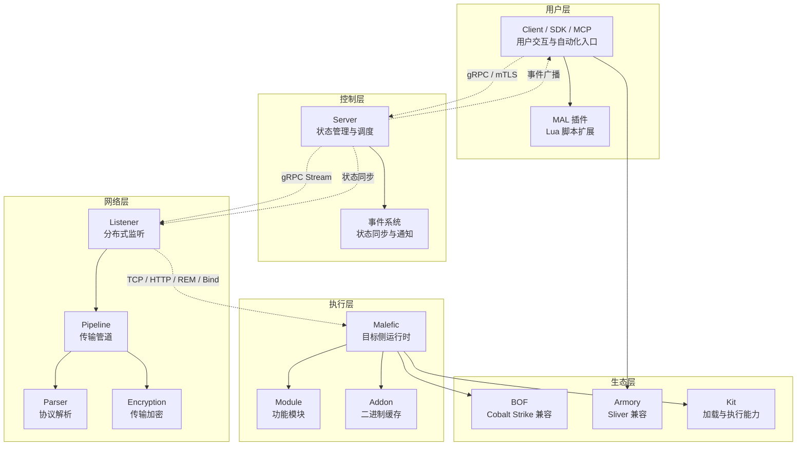
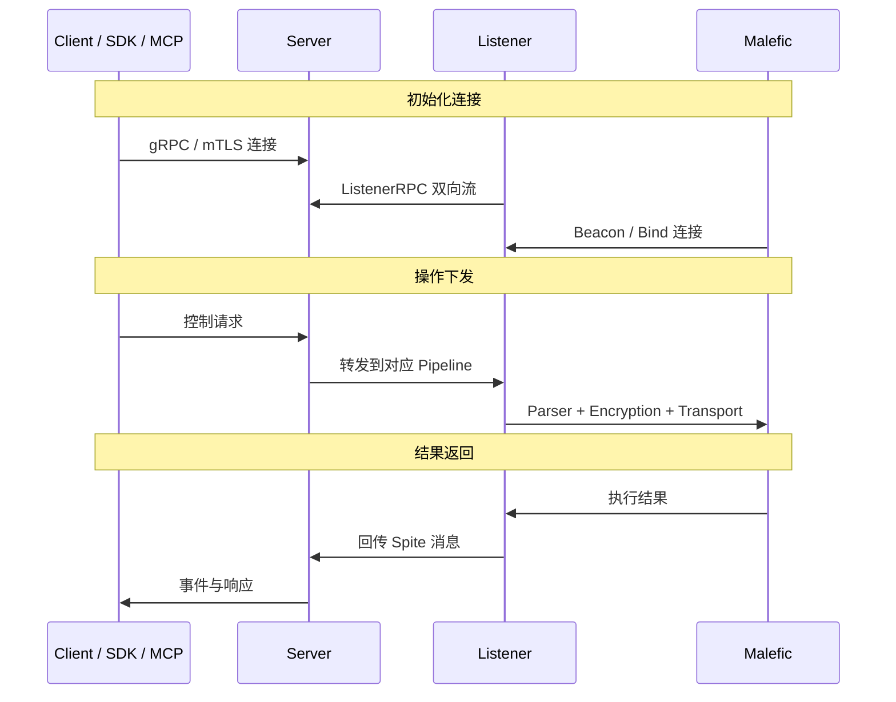
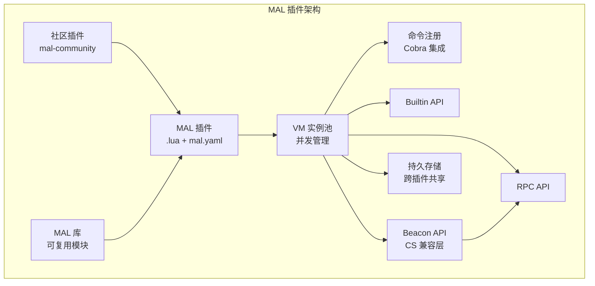

# IoM 核心概念

IoM 采用高度解耦的分布式架构，由 Client、Server、Listener、Malefic 和 MAL 插件体系协同组成。本文保留系统层面的概念、边界和阅读路径；命令用法、RPC 方法、协议字段和任务状态等实现细节放在对应的用户手册或开发文档中。

!!! tip "与开发文档的关系"
    本文档介绍概念和架构。具体开发实践请参考 [开发文档](/IoM/development/)。

## 相关项目

IoM 作为完整的进攻性基础设施，由多个相互协作的项目组成。

### 核心项目

- **malice-network** ：Server、Client、Listener、构建服务和 IoM 文档迁移脚本。
- **malefic** ：Rust 实现的跨平台 Implant、构建工具和模块体系。
- **IoM-go** ：Proto 定义和 gRPC client，位于 `external/IoM-go` 子模块。

### 插件生态

- **mals** ：Client 侧插件生态和自动化脚本。
- **mal-community** ：社区插件合集和可复用 MAL 脚本。

## IoM 核心组件

IoM 的核心设计是把用户交互、状态管理、网络入口和目标侧执行分离，让每个部分可以独立扩展和部署。



| 层级 | 组件 | 职责 |
| --- | --- | --- |
| 用户层 | Client / SDK / MCP | 操作者入口、脚本化控制和 AI Agent 集成 |
| 控制层 | Server | 全局状态、认证、事件分发、操作调度 |
| 网络层 | Listener / Pipeline | 独立网络入口、协议解析、传输加密 |
| 执行层 | Malefic | 目标侧运行时、模块执行、加载器能力 |
| 生态层 | MAL / Module / BOF / Armory | 自动化脚本、模块扩展和生态兼容 |

## 通信流程

IoM 的数据流转遵循固定路径：Client 不直接连接 Implant，Listener 不承担全局状态管理，Server 负责统一调度和事件分发。



这种拆分让 Listener 可以独立部署、替换和横向扩展，也让 Client、SDK、MCP 共享同一套 Server 能力。

## Server

Server 是数据处理、状态管理和协议边界的核心组件。代码入口集中在 `server/rpc/`、`server/internal/core/`、`server/internal/db/` 和 `server/internal/parser/`。

**核心职责** ：

- 管理 Operator、Listener、Pipeline、Session 和事件。
- 提供 gRPC 服务供 Client、SDK、MCP 和 Listener 调用。
- 维护当前存活状态，并将 Session、Task、Context、Artifact 等历史数据持久化到数据库。
- 将 Client 操作转化为 Spite 消息，分发到对应 Listener，并把结果转化为 Task 内容和事件。

**架构特点** ：

- `server/rpc/grpc.go` 在同一个 gRPC server 上注册 `MaliceRPC`、`RootRPC` 和 `ListenerRPC`。
- `server/rpc/generic.go` 创建 Task、构造 Spite、查找 Pipeline 的 `SpiteStream`，并把响应写回 Task。
- `server/rpc/rpc-listener.go` 维护 Listener 注册、`JobStream` 控制流和 `SpiteStream` 数据回传。
- `server/internal/core/` 维护运行时的 Session、Task、Listener、Job、Connection 和 EventBroker。
- Server 与 Listener 可以使用同一二进制，以不同配置启动不同模式。

!!! tip "开发入口"
    Server 开发详见 [Server 开发](/IoM/development/server/) 和 [Server Internals](/IoM/development/server/internals/)。

### Server 协议边界

IoM 的协议边界主要落在 Server 侧：Client、SDK、MCP 通过 `MaliceRPC` 进入控制面；Listener 通过 `ListenerRPC` 与 Server 保持控制流和数据流；Implant 数据最终以 Spite protobuf 消息进入 Server 的任务和事件系统。

```text
Client / SDK / MCP
└─ MaliceRPC / gRPC / mTLS
   └─ Server: Session / Task / Event / Build / Listener state
      └─ ListenerRPC
         ├─ JobStream: Server -> Listener 控制 Pipeline / Website / REM
         └─ SpiteStream: Listener <-> Server 转发 Spite
            └─ Listener Pipeline / Parser / Encryption / Transport
               └─ Malefic / Pulse
```

Server 对外暴露三类 gRPC 服务：

| 服务 | 调用方 | 代码与 proto | 作用 |
| --- | --- | --- | --- |
| `MaliceRPC` | Client / SDK / MCP | `server/rpc/*`，`services/clientrpc/service.proto` | Session、Task、Build、Module、Listener、事件和后渗透操作 |
| `RootRPC` | 本地管理入口 | `server/rpc/rpc-root.go`，`client/rootpb/root.proto` | Operator 和 Listener 管理 |
| `ListenerRPC` | Listener | `server/rpc/rpc-listener.go`，`services/listenerrpc/service.proto` | Listener 注册、Pipeline 控制、JobStream、SpiteStream、Build/Website/REM 代理 |

Proto 定义位于 `external/IoM-go/generate/proto/`：

| Proto 文件 | 用途 |
| --- | --- |
| `client/clientpb/client.proto` | Client、Session、Task、Pipeline、Event 等消息 |
| `client/rootpb/root.proto` | Root 管理消息 |
| `implant/implantpb/implant.proto` | Implant 通信消息 |
| `services/clientrpc/service.proto` | Client RPC 服务 |
| `services/listenerrpc/service.proto` | Listener RPC 服务 |

!!! warning "Proto 修改规范"
    Proto 变更在 `external/IoM-go` 子模块内进行，不要手动编辑生成的 Go 代码。变更后需更新子模块引用并执行 `go mod tidy`。

## Client

Client 是操作者的交互界面，也是 SDK、MCP 和 MAL 插件体系共享的控制入口。

**架构特性** ：

- 通过 gRPC/mTLS 与 Server 通信。
- 支持 CLI、TUI、脚本和 GUI 等多种交互形态。
- 通过 MAL 插件系统扩展命令、资源和工作流。
- 可以把命令树暴露给 MCP，供外部 AI Agent 调用。

!!! tip "使用与开发"
    Client 使用见 [Client](/IoM/user-guide/)；开发见 [Client 开发](/IoM/development/client/)；MAL 插件见 [MAL 开发](/IoM/development/mals/)。

## Listener

Listener 是分布式网络入口，负责运行 Pipeline 并与 Implant 实际通信。它和传统 C2 中固定绑定在 Server 上的 listener 不同，可以独立部署在任意网络位置，并通过 `ListenerRPC` 与 Server 进行全双工通信。


**核心特性** ：

- **分布式部署** ：Listener 可以部署在独立服务器、边界节点或代理链路中。
- **故障隔离** ：Listener 故障不会直接破坏 Server 状态。
- **多形态支持** ：不同 Pipeline 可以承载 TCP、HTTP、Bind、REM 等传输形态。
- **实时同步** ：Listener 通过 `JobStream` 接收 Server 控制，通过 `SpiteStream` 回传 Implant 结果。

**内部组件** ：

| 组件 | 职责 |
| --- | --- |
| Listener Core | 管理本地 Pipeline，并向 Server 注册 Listener 状态 |
| Pipeline | 具体传输通道，当前代码中包含 TCP、HTTP、Bind、Website、REM 和 Custom |
| Parser | 识别 Malefic / Pulse，并将网络字节流与 Spite 消息互转 |
| Encryption | 在 Implant 传输上叠加 AES、XOR 等加密策略 |
| Forwarder | 在连接和 Server 流之间转发数据 |

!!! tip "配置入口"
    Listener 使用和 Pipeline 配置见 [Listener](/IoM/user-guide/listener/)。

## Malefic

Malefic 是目标侧 Implant 框架，负责运行模块、接收指令和返回执行结果。它已经作为独立顶级文档呈现，IoM 这里只保留系统关系。

**主要形态** ：

| 形态 | 说明 |
| --- | --- |
| Malefic | 功能完整的主 Implant，支持 Beacon / Bind 等模式 |
| Pulse | 轻量级上线组件，用于更小的投递场景 |
| Prelude | 多阶段加载和中间阶段组件 |
| Proxydll / SRDI / Loader | 不同加载、注入和投递形态 |

**与 IoM 的关系** ：

- Server 只调度目标操作，不直接处理目标网络连接。
- Listener 将网络字节流转换为 Spite 消息。
- Malefic 模块根据消息执行对应能力，并把结果按同一路径返回。

!!! tip "Malefic 文档"
    Malefic 架构、构建、模块和 Mutant 见 [Malefic](/malefic/)。

## REM 网络工具包

REM 是 IoM 相关的网络工具包，提供流量代理、隧道和转发能力。它可以作为独立服务使用，也可以与 Listener 和 Pipeline 组合部署。

**核心功能** ：

- 正反向代理：HTTP、HTTPS、SOCKS 等代理形态。
- 端口转发：TCP / UDP 端口转发和映射。
- 流量隧道：基于多种协议的隧道通信。
- 级联部署：配合 Listener 形成更复杂的网络拓扑。

!!! tip "详细文档"
    REM 的完整功能参考 [REM 文档](/rem/) 和 [代理配置](/IoM/user-guide/advanced/proxy/)。

## 插件生态与兼容性

IoM 的扩展能力分布在 Client、Server、Listener 和 Malefic 多个层面。

| 扩展维度 | 扩展类型 | 描述 | 文档入口 |
| --- | --- | --- | --- |
| Client | Command 开发 | 添加自定义客户端命令 | [Client 开发](/IoM/development/client/) |
| Client | MAL 插件 | Lua 脚本扩展和工作流编排 | [MAL 开发](/IoM/development/mals/) |
| Client | 多语言 SDK | Go、Python、TypeScript 客户端开发 | [SDK](/IoM/development/sdk/) |
| Client | MCP / LocalRPC | 将命令树暴露给 AI Agent 或本地自动化调用 | [AI 集成](/IoM/development/ai/) |
| Server | RPC / Proto 扩展 | 添加或调整 Server 侧能力和协议定义 | [Server 开发](/IoM/development/server/) |
| Listener | Parser / Pipeline 扩展 | 自定义协议解析和传输通道 | [Listener](/IoM/user-guide/listener/) |
| Malefic | Module 系统 | Rust FFI、动态模块和第三方模块 | [Malefic Modules](/malefic/develop/modules/) |
| Malefic | Loader / Kit | 不同加载、注入和投递形态 | [Malefic](/malefic/) |
| 生态兼容 | BOF / Assembly / PowerShell / Sliver | 兼容主流 C2 生态能力 | [MAL 开发](/IoM/development/mals/) |

## MAL 插件系统

MAL 是 IoM 的 Client 侧插件系统，基于 Lua 5.1 和 gopher-lua，为 IoM 提供脚本化扩展、命令注册和 API 集成。



!!! tip "插件开发"
    插件开发参考 [MAL 快速开始](/IoM/development/mals/quickstart/) 和 [Lua API 参考](/IoM/reference/lua-api/builtin/)。

## 文档导航

| 目标 | 入口 |
| --- | --- |
| 安装、登录和首次使用 | [快速开始](/IoM/getting-started/) |
| 系统背景与设计目标 | [设计目标](/IoM/getting-started/design/) |
| 架构与 Server 协议边界 | [核心概念](/IoM/getting-started/concepts/) |
| 部署 Server、Listener 和 GUI | [部署](/IoM/user-guide/deployment/) |
| Client 命令和控制台 | [Client](/IoM/user-guide/) |
| Listener 和 Pipeline | [Listener](/IoM/user-guide/listener/) |
| Payload 构建流程 | [Build](/IoM/user-guide/build/) |
| 后渗透操作 | [Session](/IoM/user-guide/session-management/) |
| MAL 插件开发 | [MAL 开发](/IoM/development/mals/) |
| SDK 集成 | [SDK](/IoM/development/sdk/) |
| AI / MCP 集成 | [AI](/IoM/development/ai/) |
| Server / Client 开发 | [开发文档](/IoM/development/) |
| Malefic Implant | [Malefic](/malefic/) |
