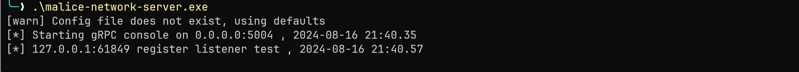

# 用户手册

## 安装

按照以下说明安装 Malice-Network：

1. 为支持的操作系统下载 Malice-Network 服务器版本和客户端版本。

Malice-Network 服务器支持 `Linux`、 `Windows` 和 `MacOS`，但是我们建议在 Linux 主机上运行服务器，因为在 Windows 上，服务器运行某些特性可能更加困难。Malice-Network 客户端在从 Windows 访问 Linux/MacOS 服务器时能正常工作。

1. 运行服务器版本二进制文件。

## 部署

### Server Config

`config.yaml` 是 Malice-Network 服务器的配置文件，其中包含了一些服务器以及 `listener` 可选的配置。


```bash
server:  
  enable: true        # server 是否启用
  grpc_port: 5004     # 监听的端口
  grpc_host: 0.0.0.0  # 监听的host
  ip: 127.0.0.1       # 服务外部ip
  audit: 1            # 日志审计等级 0 close , 1 basic , 2 detail  
  config:  
    packet_length: 1048576 # 与implant交互单个包上限, 默认1M
    certificate:           # grpc证书配置, 留空则自动生成
    certificate_key:       # grpc证书配置, 留空则自动生成
  
listeners:  
  enable: true            # listener 是否启用
  name: listener          # listener名字
  auth: listener.auth     # 认证文件路径
  tcp:                    # tcp协议的pipeline
    - name: tcp_default   # pipeline 名字
      port: 5001          # pipeline 监听的端口
      host: 0.0.0.0       # pipeline 监听的host
      protocol: tcp       # 协议
      enable: true        # pipeline是否开启
      tls:                # tls配置项,留空则自动生成
        enable: false  
        name: default  
        CN: "test"  
        O: "Sharp Depth"  
        C: "US"  
        L: "Houston"  
        OU: "Persistent Housework, Limited"  
        ST: "State of Texas"  
        validity: "365"  
        cert: ""  
        key: ""  
      encryption:      # 加密配置项, 当前未生效
        enable: false  
        type: aes-cfb  
        key: maliceofinternal
```

### 启动 Server

**Malice-Network** 服务器是能与控制 `Implant` 并与 **Malice-Network** 客户端交互的主机。服务器还存储了部分 **Malice-Network** 收集的数据，并管理日志记录。

需要提前获取对应的配置文件: https://github.com/chainreactors/malice-network/blob/master/server/listener.yaml ,并放到`malice-network`所在目录下

最简启动

```
./malice-network
```

如果配置文件非默认的 `config.yaml`, 可以通过 `-c path/any.yaml` 指定

启动后服务器会输出以下信息, 并生成两个配置文件, 分别为`listener.auth` 和`admin_[server_ip].auth`, 这两个配置文件后续还有用处


需要注意的是, server中的ip字段需要在启动时设置为listener与client能访问到的地址, 所以可以手动修改`config.yaml`

```
...
ip: 123.123.123.123
...
```

也可以使用`-i` 重载这个参数

```
./malice-network -i 123.123.123.123
```

!!! tips "同时启动server与listener"
	在设计上, server和listener是独立的, 但我们也提供了便捷的用法, 仓库中提供的默认`config.yaml`同时配置了server与listener.  所以会同时启动多个服务.


### 启动 Listener

从v0.0.2开始, 将只提供一个服务端配置文件, 会根据配置自动解析需要开启的服务. 可以通过enable字段进行简单控制

刚才提到Server 的 `config.yaml` 中已经包含了 listener 配置。 是对 server 与 listener 在同一台机器上部署时的简化。但在交互逻辑上, 同时启动的listener与server依旧通过rpc通讯, 与独立部署的listener没有任何区别. 

可以在这里获取到[独立的`listener.yaml` 配置文件](https://github.com/chainreactors/malice-network/blob/master/server/listener.yaml), `listener.yaml` 的配置格式与 `config.yaml` 中的 listener 部分完全一致.

如果配置文件非默认的 `listener.yaml`, 可以通过 `-c path/any.yaml` 指定.

配置样例:

```bash
listeners:
  enable: true
  name: default
  auth: listener.auth
  tcp:
    - name: tcp_default
      port: 5001
      host: 0.0.0.0
      protocol: tcp
      enable: true
      tls:
        enable: false
        CN: "test"
        O: "Sharp Depth"
        C: "US"
        L: "Houston"
        OU: "Persistent Housework, Limited"
        ST: "State of Texas"
        validity: "365"
      encryption:
        enable: false
        type: aes-cfb
        key: maliceofinternal
```


!!! important "请检查listener.auth"
	如果换了一台服务部署listener, 请检查目录下是否存在`listener.yaml`与`listener.auth`

listener成功启动后，listener终端会输出以下信息：


**Malice-Network** 服务器也会输出listener登录信息：




### 启动客户端

将生成的用户配置文件, 默认为 `admin_[server_ip].auth` 复制到 `Malice-Network` 客户端的所在位置。使用新的用户配置文件时，可以使用以下指令启动客户端：

```powershell
.\iom admin_[server_ip].auth
```

执行命令后，客户端会自动使用新的客户配置文件与服务器连接，并将用户配置文件移动至客户端的用户配置文件夹 (Windows 下为 `C:\Users\user\.config\malice\configs`,MacOS X 为 `/home/username/.config/malice/configs`，Linux 为 `/Users/username/.config/malice/configs`）

客户端登录成功后会输出以下信息：


下次登录后，客户端会自动显示在用户配置文件夹下所有的用户配置，根据需求，选择对应的用户进行选择。
```
./iom 
```


## ROOTRPC

`malice-network` 实际上还存在一个高权限的管理组件.  需要根证书配置才可实现. 这个证书不会生成`.auth`文件, 直接保存在服务端配置和数据库中. 

只允许已经启动了`malice-network`的机器上, 继续通过`malice-network user` 或 `malice-network listener`  进行用户管理.

### 认证文件

**Malice-Network** 客户端需要使用用户配置文件才能与服务端进行交互。用户配置文件中包含由服务端生成的证书信息。每次客户端尝试连接服务端时，服务端都会校验该证书信息，以确保用户的合法性。这一过程保证了只有经过认证的用户才能访问和使用 **Malice-Network** 服务，从而提升了系统的安全性和可靠性。

所有的远程rpc交互都需要`auth`文件打开mtls认证. 

```
operator: listener # 操作者名字
host: 127.0.0.1    # server grpc ip
port: 5004         # server grpc port
type: listener     # 操作者类型, 如果不匹配则会认证失败, 默认生成的即可
ca: |
   ...
private_key: |
   ...
certificate: |
   ...

```


### 添加client

默认情况下, 会生成一个`admin_[server_ip].auth`的配置. 大部分情况下, 使用这个auth即可. 

目前所有用户都是平级的, 但可以在服务端添加或吊销指定用户的证书实现简单的管理

在确保 **Malice-Network** 服务器已经运行后，在终端输入以下指令：

```
.\malice-network user add [username]
```

执行命令成功后，服务端会输出以下信息并在所处文件夹下生成对应用户配置文件：


也可以删除用户, 吊销证书, 使其无法登录server

```
.\malice-network user del [username]
```

列出所有可用的用户配置

```
.\malice-network user list
```

### 添加listener

在确保 **Malice-Network** 服务器已经运行后，在终端输入以下指令：

```powershell
.\malice-network listener add [listener_name]
```

执行命令成功后，服务端会输出以下信息并在所处文件夹下生成对应auth配置文件：

也可以删除用户, 使其无法登录server

```
.\malice-network listener del [listener_name]
```

列出所有可用的用户配置

```
.\malice-network listener list
```


## 编译

自行编译说明

clone项目到本地

```
git clone --recurse-submodules https://github.com/chainreactors/malice-network
```

### 编译client

```
go generate ./client
go mod tidy
go build ./client/
```

### 编译server

```
go generate ./client
go mod tidy
go build ./server/cmd/server
```


### 编译 Implant

请参阅 [Implant](implant.md) 中 compile 部分