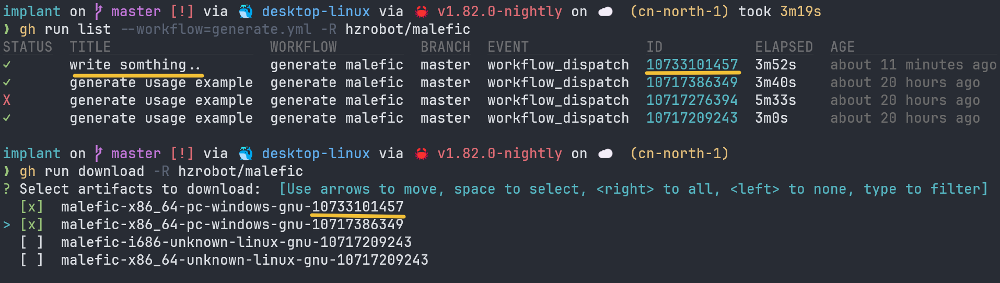

# Implant

考虑到红队人员的使用习惯， 本 `Implant` 所支持的命令将大量沿用 `CS` 工具的命令及使用习惯.

欢迎各位对想要的功能和使用中遇到的问题提 `issues` 🙋

## Build
rust很复杂，不通过交叉编译的方式几乎无法实现所有架构的适配，所以我们参考了[cross-rs/cross](https://github.com/cross-rs/cross)的方案，但它并不完美的符合我们的需求：

1. cross需要宿主机存在一个rust开发环境，编译环境不够干净，虽然这可以通过虚拟机、github action等方式解决
2. cross对很多操作进行了封装，不够灵活，比如一些动态的变量引入、一些复杂的操作无法方便的实现

因此，我们参考了cross创建了用于维护malefic(即implant)编译的仓库[chainreactors/cross-rust](https://github.com/chainreactors/cross-rust).
这个项目提供了一些主流架构的编译环境。同时考虑到灵活性我们放弃了Makefile改用了具有强大功能的[cargo-make](https://github.com/sagiegurari/cargo-make)来管理编译任务.

### 目前支持的架构
malefic理论上支持rust能编译的几乎所有平台, 包括各种冷门架构的IoT设备, Android系统, iOS系统等等 (有相关需求可以联系我们定制化适配), 当前支持的架构可参考[cross-rust](https://github.com/chainreactors/cross-rust)

### 环境准备
环境安装需要cargo-make、和docker 
#### cargo-make
有两种安装方式，一种是通过cargo安装，另一种是下载release版本的二进制文件

1. cargo环境
```
cargo install --force cargo-make
```
2. 二进制文件

release链接: https://github.com/sagiegurari/cargo-make/releases
使用此方式的话，你需要把`makers.exe`和`cargo-make.exe`添加到PATH环境变量中，编译时的`cargo make`替换为等价的`makers`即可解析

#### 安装docker

此处省略，可参考[官网介绍](https://www.docker.com/)

### 编译准备
克隆[malefic](https://github.com/chainreactors/malefic)

```
git clone --recurse-submodules https://github.com/chainreactors/malefic
```

!!! tips "注意clone子项目"
	需要添加`--recurse-submodules`递归克隆子项目. 如果已经clone也不必担心,`git submodule update --init` 即可

为了方便build，我们做了短名称映射完整映射如下：
```
"windows-x64-msvc" = "x86_64-pc-windows-msvc"
"windows-x32-msvc" = "i686-pc-windows-msvc"
"windows-x64-gnu" = "x86_64-pc-windows-gnu"
"windows-x32-gnu" = "i686-pc-windows-gnu"
"linux-x64-gnu" = "x86_64-unknown-linux-gnu"
"linux-x32-gnu" = "i686-unknown-linux-gnu"
"darwin-x64" = "x86_64-apple-darwin"
"darwin-arm" = "aarch64-apple-darwin"
```

### 本地编译
安装好上述环境后，你即可通过`cargo-make`来编译impalnt，所有编译流程通过Makefile.toml进行了定义。
由于本地环境的限制，所以任务里只提供单个target的编译任务，如果需要多平台交叉请使用`docker`编译.

以`x86_64-pc-windows-gnu/msvc`为例，
cargo make可以通过如下命令来编译。
```bash
# 任务名称做了兼容既可以用短名称也可使用target原值，所以如下两个命令等价
cargo make local windows-x64-gnu # 短名称
cargo make local x86_64-pc-windows-gnu # target名称
# 同理，如下两个命令等价
cargo make local windows-x64-msvc
cargo make local x86_64-pc-windows-msvc
```
makers同理
```bash
makers local windows-x64-gnu
makers local x86_64-pc-windows-gnu
```

### Docker编译
在docker中编译环境更加干净，编译使用了volume挂载源码，所以编译完成后依然会在`target`目录下生成对应的可执行文件。

#### 编译单个target
cargo make
```bash
cargo make docker windows-x64-gnu
cargo make docker x86_64-pc-windows-gnu
```
makers同理
```bash
makers docker windows-x64-gnu
makers docker x86_64-pc-windows-gnu
```
#### 编译多个target
参考如下命令, 通过空格分隔多个target，你可按照自己习惯使用短名称或者target原值
```bash
cargo make docker windows-x64-gnu windows-x64-msvc windows-x32-gnu linux-x64-gnu linux-x32-gnu
```

#### 一键编译所有支持的target
```bash
cargo make docker all
```

### Github Action编译环境
#### 准备
安装参考: https://docs.github.com/zh/github-cli/github-cli/quickstart
#### 编译
我们提供了github action编译环境，你可以通过gh来运行编译工作流，参考命令如下:

首先使用gh登录github
```shell
# 交互式登录 github
gh auth login
# 或者使用token
windows: $ENV:GH_TOKEN="your_authentication"
linux: export GH_TOKEN="your_authentication"
```
配置完所需要的config.yaml配置后, 你可以通过gh来运行编译工作流，参考命令如下
```bash
gh workflow run generate.yml -f malefic_config=$(base64 </path/to/config.yaml>) -f remark="write somthing.." -f targets="x86_64-pc-windows-gnu,i686-pc-windows-gnu," -R <username/malefic>
```
查看编译进度
```bash
gh run list -R <username/malefic>
```
根据填写的remark和run_id，你可以很方便的找到对应的artifact下载(artifact默认保留时间为3天,可自行更改[retention-days](https://github.com/chainreactors/malefic/blob/master/.github/workflows/generate.yml#L90))
```bash
gh run download -R <username/malefic>
```


注意windows可能没有`base64`, 你可以通过`notepad $PROFILE`自定义一条函数
```powershell
function base64 {
    [CmdletBinding()]
    param(
        [Parameter(Mandatory, ValueFromPipeline, ValueFromPipelineByPropertyName)]
        [string] $s,
        [switch] $decode,
        [switch] $binary
    )
    process {
        Set-StrictMode -Version Latest
        $ErrorActionPreference = 'Stop'

        if ($decode) {
            if ($s.Length -le 320 -and (Test-Path $s -PathType Leaf)) {
                $encodedContent = Get-Content $s -Raw
            }
            else {
                $encodedContent = $s
            }
            if ($binary) {
                [System.Convert]::FromBase64String($encodedContent)
            }
            else {
                [System.Text.Encoding]::utf8.GetString([System.Convert]::FromBase64String($encodedContent))
            }
        }
        else {
            if ($s.Length -le 320 -and (Test-Path $s -PathType Leaf)) {
                $str = Get-Content $s -AsByteStream
                $code = [System.Convert]::ToBase64String($str)
            }
            else {
                $code = [System.Convert]::ToBase64String([System.Text.Encoding]::utf8.GetBytes($s))
            }
            $code
        }
    }
}
```


!!! danger "保护敏感信息"
    我们对config进行[add-mask](https://github.com/chainreactors/malefic/blob/master/.github/workflows/generate.yml#L58)处理,保护config.yaml的敏感数据，但是github action输出的artifact或release仍会暴露, 使用时建议创建一份malefic到自己的仓库中设置为private再使用。

### 手动编译malefic

项目的配置(config.toml、cargo.toml、makefile.toml..)中提供了一些预设和编译优化选项. 熟悉rust的使用者也可以手动编译

添加对应的目标编译架构,以`x86_64-pc-windows-gnu`为例
```bash
rustup target add x86_64-pc-windows-gnu
```
指定target编译
```bash
# mg 64
cargo build --release -p malefic --target x86_64-pc-windows-gnu
# mg 32
cargo build --release -p malefic --target i686-pc-windows-gnu
```

### 其他
#### 手动编译注意
本地手动编译时，我们推荐windows用户使用[msys2](https://www.msys2.org/)管理GNU工具链环境, 可通过官网二进制文件直接安装。

在msys2的terminal下执行如下安装可以保证64、32位GNU工具链的正常编译
```
pacman -Syy # 更新包列表
pacman -S --needed mingw-w64-x86_64-gcc
pacman -S --needed mingw-w64-i686-gcc
```

你可自行把msys64添加到环境变量中， 也可通过`notepad $PROFILE`将如下内容添加到powershell配置中，实现在powershell中快速切换`mingw64/32`.
```powershell
function mg {
    param (
        [ValidateSet("32", "64")]
        [string]$arch = "64"
    )
    
    $basePath = "D:\msys64\mingw" # 此处是你的msys2安装路径
    $env:PATH = "${basePath}${arch}\bin;" + $env:PATH
    Write-Host "Switched to mingw${arch} (bit) toolchain"
}
mg 64
```
切换用法参考下图:


#### 编译独立modules

malefic的windows平台目前支持动态加载module, 因此可以编译单个或者一组module, 然后通过`load_module`给已上线的implant添加新的功能. 

[load_module使用文档](IoM/manual/help/#load_module)
[load_module相关介绍](#dynamic-module)

makefile指令如下

```bash
cargo make --env MOUDLES_FEATURES="execute_powershell execute_assembly" module
```
也可手动使用cargo编译

```bash
cargo build --release --features "execute_powershell execute_assembly" -p malefic-modules --target x86_64-pc-windows-gnu
```

??? info "所有支持的feautres"
	请见 https://github.com/chainreactors/malefic/blob/master/malefic-modules/Cargo.toml
	
	fs_ls = ["fs"]  
	fs_cd = ["fs"]  
	fs_rm = ["fs"]  
	fs_cp = ["fs"]  
	fs_mv = ["fs"]  
	fs_pwd = ["fs"]  
	fs_mem = ["fs"]  
	fs_mkdir = ["fs"]  
	fs_chmod = ["fs"]  
	fs_cat = ["fs"]  
	  
	sys_info = ["sys"]  
	sys_ps = ["sys"]  
	sys_id = ["sys"]  
	sys_env = ["sys"]  
	sys_whoami = ["sys"]  
	sys_exec = ["sys"]  
	sys_kill = ["sys"]  
	sys_execute_shellcode = ["sys"]  
	sys_execute_assembly = ["sys"]  
	sys_execute_bof = ["sys"]  
	sys_execute_pe = ["sys"]  
	sys_execute_powershell = ["sys"]  
	sys_netstat = ["sys"]  
	  
	net_upload = ["net"]  
	net_download = ["net"]


编译结果为`target\[arch]\release\modules.dll`

可以使用`load_module`热加载这个dll 

!!! important "module动态加载目前只支持windows"
	linux与mac在理论上也可以实现

常见的使用场景:

1.  编译一个不带任何modules的malefic, 保持静态文件最小特征与最小体积. 通过`load_module modules.dll` 动态加载模块
2. 根据场景快速开发module, 然后动态加载到malefic中. 
3. 长时间保持静默的场景可以卸载所有的modules, 并进入到sleepmask的堆加密状态.  等需要操作时重新加载modules

## Config

`Implant` 拥有 `config.yaml` 以对生成的 `implant` 进行配置：

会在编译时通过`malefic-config` 自动解析各种feature与参数配置. 

### Server

与server通讯相关的配置. 

* `Server` 字段包含了以下连接配置:

	* `urls`: `implant` 所需要建立连接的目标 `ip:port` 或 `url:port` 列表
	
	* `protocol` : `implant` 所使用的传输协议
	
	* `tls` : `implant` 是否需要使用 `tls`
	
	* `interval` :  每次建立连接的时间间隔(单位为 `milliseconds`)
	
	* `jitter`: 每次建立连接时的时间间隔抖动(单位为 `milliseconds`)
	
	* `ca` : 所使用的证书路径

### implants

implant端各种opsec与高级特性的配置.  在community中带🔒表示配置不生效. 

`Implant` 字段包含以下可选生成物配置：

* `modules`: 生成物所需要包含的功能模块， 如默认提供的 `base` 基础模块及 `full` 全功能模块， 或自行组装所需功能模块, 详见章节 `Extension` 部分

#### metadata
* `metadata`: 生成物元特征：
    * `remap_path`: 编译绝对路径信息
    * `icon`
    * `file_version` 
    * `product_version`
    * `company_name`
    * `product_name`
    * `original_filename`
    * `file_description`
    * `internal_name`

#### apis 🔒

在 `EDR` 的对抗分析中， 我们支持在组装 `Implant` 时由用户自行选择使用各级别的 `API`， 如直接调用系统 `API`, 动态获取并调用， 通过 `sysall` 调用，这可以有效减少程序 `Import` 表所引入的的特征

在 `syscall` 调用中， 我们支持使用各类门技术来调用系统调用而非直接调用用户层 `API`， 以防止 `EDR` 对常用红队使用的 `API` 进行监控， 如何配置可见 `Implant Config File` 对应 `apis` 部分

* apis: 
    * `level` : 使用上层api还是nt api, `"sys_apis"` , `"nt_apis`
    * `priority`:
        * `normal` : 直接调用 
        * `dynamic` : 动态调用
            * `type`: 如自定义获取函数地址方法 `user_defined_dynamic`, 系统方法`sys_dynamic` (`LoadLibraryA/GetProcAddress`)
        * `syscall`: 通过 `syscall`调用
            * `type`: 生成方式, 函数式 `func_syscall`, inline 调用 `inline_syscall


#### alloctor 🔒
* allactor: 
    * `inprocess`: 进程内分配函数, `VirtualAlloc`, `VirtualAllocEx`, `HeapAlloc`, `NtAllocateVirtualMemory`, `VirtualAllocExNuma`, `NtMapViewOfSection`
    * `crossprocess`: 进程间分配函数, `VirtualAllocEx`, `NtAllocateVirtualMemory`,
    `VirtualAllocExNuma`, `NtMapViewOfSection`

#### advance feautres 🔒

`sleep_mask`: 睡眠混淆是否开启 👤

`sacriface_process`: 是否需要牺牲进程功能

`fork_and_run`: 是否需要使用 `fork and run` 机制

`hook_exit`: 是否需要对退出函数进行 `hook` 以防止误操作导致的退出

`thread_task_spoofer`: 是否需要自定义线程调用堆栈 👤

## Module

module是implant中功能的基本单元, 各种拓展能力(bof,pe,dll)的执行也依赖于module实现. 

### 已实现modules

不同操作系统与架构支持的module不同. 具体支持下表:

| 功能                | windows-x86 | windows-x86_64 | windows-arm* | linux-x86_64 | linux-arm | linux-aarch64 | macOS-intel | macOS-arm |
| ----------------- | ----------- | -------------- | ------------ | ------------ | --------- | ------------- | ----------- | --------- |
| ls                | ✓           | ✓              | ✓            | ✓            | ✓         | ✓             | ✓           | ✓         |
| cd                | ✓           | ✓              | ✓            | ✓            | ✓         | ✓             | ✓           | ✓         |
| mv                | ✓           | ✓              | ✓            | ✓            | ✓         | ✓             | ✓           | ✓         |
| pwd               | ✓           | ✓              | ✓            | ✓            | ✓         | ✓             | ✓           | ✓         |
| mem               | ✓           | ✓              | ✓            | ✓            | ✓         | ✓             | ✓           | ✓         |
| mkdir             | ✓           | ✓              | ✓            | ✓            | ✓         | ✓             | ✓           | ✓         |
| chomd             | ✗           | ✗              | ✗            | ✓            | ✓         | ✓             | ✓           | ✓         |
| chown             | ✗           | ✗              | ✗            | ✓            | ✓         | ✓             | ✓           | ✓         |
| cat               | ✓           | ✓              | ✓            | ✓            | ✓         | ✓             | ✓           | ✓         |
| upload            | ✓           | ✓              | ✓            | ✓            | ✓         | ✓             | ✓           | ✓         |
| download          | ✓           | ✓              | ✓            | ✓            | ✓         | ✓             | ✓           | ✓         |
| env               | ✓           | ✓              | ✓            | ✓            | ✓         | ✓             | ✓           | ✓         |
| kill              | ✓           | ✓              | ✓            | ✓            | ✓         | ✓             | ✓           | ✓         |
| whoami            | ✓           | ✓              | ✓            | ✓            | ✓         | ✓             | ✓           | ✓         |
| ps                | ✓           | ✓              | ✓            | ✓            | ✓         | ✓             | ✓           | ✓         |
| netstat           | ✓           | ✓              | ✓            | ✓            | ✓         | ✓             | ✓           | ✓         |
| exec              | ✓           | ✓              | ✓            | ✓            | ✓         | ✓             | ✓           | ✓         |
| command           | ✓           | ✓              | ✓            | ✓            | ✓         | ✓             | ✓           | ✓         |
| execute_shellcode | ✓           | ✓              | ✓            | ✓            | ✓         | ✓             | ✓           | ✓         |
| execute_assembly  | ✓           | ✓              | ✓            | ✗            | ✗         | ✗             | ✗           | ✗         |
| powershell        | ✓           | ✓              | ✓            | ✗            | ✗         | ✗             | ✗           | ✗         |
| execute_pe        | ✓           | ✓              | ✓            | ✗            | ✗         | ✗             | ✗           | ✗         |
| execute_bof       | ✓           | ✓              | ✓            | ✗            | ✗         | ✗             | ✗           | ✗         |
| hot_module_load   | ✓           | ✓              | ✓            | ✗            | ✗         | ✗             | ✗           | ✗         |


### Professional Features 🔒

部分module需要依赖各类kits中的高级特性, 在community中只提供了默认特征的版本.

| 目标系统 | 目标架构    | sleep_mask | obfstr | fork&run | thread_stack_spoof | syscall | dynamic_api |
| -------- | ----------- | ---------- | ------ | -------- | ------------------ | ------- | ----------- |
| windows  | x86         | ✗         | ✓     | ✓       | ✓                 | ✓      | ✓          |
|          | x86_64      | ✓         | ✓     | ✓       | ✓                 | ✓      | ✓          |
|          | arm/aarch64 | ✗         | ✓     | ✓       | ✓                 | ✗      | ✓          |
| linux    | intel       | ✗         | ✓     | ✗       | ✗                 | ✗      | ✗          |
|          | arm         | ✗         | ✓     | ✗       | ✗                 | ✗      | ✗          |
|          | mips        | ✗         | ✓     | ✗       | ✗                 | ✗      | ✗          |
| macOS    | intel       | ✗         | ✓     | ✗       | ✗                 | ✗      | ✗          |
|          | arm         | ✗         | ✓     | ✗       | ✗                 | ✗      | ✗          |

### Dynamic Module

malefic的设计理念之一就是模块化, 自由组装. modules部分的设计也提现了这个理念. 

通过rust自带的`features`相关功能, 可以控制编译过程中的模块组装.  目前提供了三种预设

??? info "modules预设"
```
full = [  
    "fs_ls",  
    "fs_cd",  
    "fs_rm",  
    "fs_cp",  
    "fs_mv",  
    "fs_pwd",  
    "fs_mem",  
    "fs_mkdir",  
    "fs_chmod",  
    "fs_cat",  
    "net_upload",  
    "net_download",  
    "sys_info",  
    "sys_exec",  
    "sys_execute_shellcode",  
    "sys_execute_assembly",  
    "sys_execute_powershell",  
    "sys_execute_bof",  
    "sys_execute_pe",  
    "sys_env",  
    "sys_kill",  
    "sys_whoami",  
    "sys_ps",  
    "sys_netstat",  
]  
  
base = [  
    "fs_ls",  
    "fs_cd",  
    "fs_rm",  
    "fs_cp",  
    "fs_mv",  
    "fs_pwd",  
    "fs_cat",  
    "net_upload",  
    "net_download",  
    "sys_exec",  
    "sys_env",  
]  
  
extend = [  
    "sys_kill",  
    "sys_whoami",  
    "sys_ps",  
    "sys_netstat",  
    "sys_execute_bof",  
    "sys_execute_shellcode",  
    "sys_execute_assembly",  
    "fs_mkdir",  
    "fs_chmod",  
]
```


当然也可以根据喜好自行组装功能模块， 当然， 我们也提供了动态加载及卸载模块的功能， 可以随时添加新模块.


!!! danger "编译时组装的模块无法被卸载" 
	这里有一个好消息与一个坏消息.
	坏消息是编译时组装的模块无法被卸载, 因此请根据自己的使用场景选择合适的预设.
	好消息是虽然无法卸载, 但加载新模块时如选用了同样名称的模块, 新模块将覆盖本体的模块.(在内存中原本的模块依旧会存在)

#### module定义

模块的开发者绝大多数场景下不需要关注除了`run`之外的方法. [开发自定义模块请见文档](IoM/manual/develop/#module)

```rust
#[async_trait]
pub trait Module {
    fn name() -> &'static str where Self: Sized;
    fn new() -> Self where Self: Sized;
    fn new_instance(&self) -> Box<MaleficModule>;
	async fn run(&mut self, 
				id: u32, 
				receiver: &mut crate::Input, 
				sender: &mut crate::Output) -> Result
```

#### module管理

就像开始所说的那样， `malefic` 支持编译时组装所需功能模块， 同时也支持启动后动态的加载和卸载所需的功能模块. 我们提供了一组api用来管理模块.  具体的使用请见[使用文档module部分](IoM/manual/help/#_2)

- `list_modules` 命令允许列举当前 `Implant` 所持有的模块
- `load_modules` 命令则支持动态加载本地新组装的模块， 只需要 `load_modules --name xxx --path module.dll` 即可动态加载新的模块， 请注意， 如本体已经含有的模块（生成时组装的模块）， 再次加载将会覆盖该模块的功能， 是的， `load_modules` 允许覆盖本体功能
- `unload_modules` 🛠️ 命令则会卸载使用 `load_modules` 命令所加载的对应 `name` 的模块， 请注意， 生成时确定的模块是无法卸载的， 但这些模块可以被加载的新模块所覆盖
- `refresh_modules` 🛠️ 命令将会卸载所有动态加载的模块， 包括覆盖掉的本体模块， 一切模块将恢复成编译时的初始状态

## Windows Kit

关于 `Windows` 平台特有功能， 可以查阅 [win_kit](implant_win_kit.md)