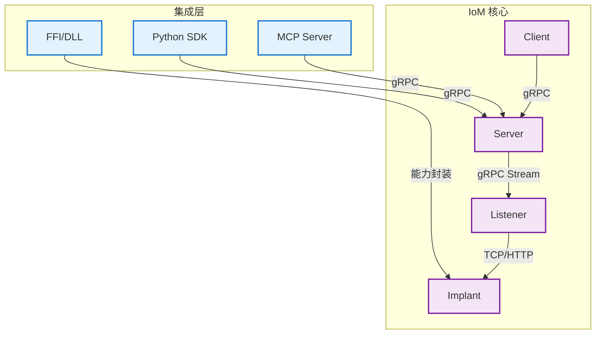

# IoM 集成指南

IoM 提供了多种集成方式，支持将 C2 能力嵌入到各种应用场景中。

## 集成方式

### SDK

IoM 提供多种语言的 SDK，将 RPC 能力封装为对应语言的 API，实现自动化脚本和工具开发。

**适用场景：**
- 自动化渗透测试脚本
- 红队工具开发
- CI/CD 集成
- 自定义客户端开发

**支持的语言：**
- **Python**: 现代异步 API，完整类型提示 [查看文档 →](sdk/python.md)
- **TypeScript**: 规划中
- **Go**: 规划中

**特性：**
- 与 IoM 架构概念一一对应
- 自动转发所有 gRPC 方法
- 完整的类型安全
- 异步执行支持

### FFI (Foreign Function Interface)

Malefic-Win-Kit 通过 FFI 将 Windows 攻击能力封装为 DLL，支持任意语言调用。

**适用场景：**
- 使用任意语言编写 Implant
- 集成到现有工具链
- 快速原型开发
- 跨语言能力复用

**特性：**
- 支持 C/Go/Rust/Python/C# 等多种语言
- 标准 C ABI 接口
- PE 加载、反射注入、BOF 执行等完整能力
- 一次编写，随处使用

[查看 FFI 文档 →](ffi.md)

### AI 集成

IoM 提供了与 AI 深度集成的能力，支持通过 MCP 协议和 SDK 将 C2 能力暴露给 AI Agent。

**适用场景：**
- AI 驱动的自动化渗透测试
- 智能红队工具
- 自然语言控制 C2
- AI 辅助安全研究

**集成方式：**
- **Client MCP**: 通过 `./client --mcp` 启动 MCP 服务器
- **Python SDK**: 封装为 LangChain Tool、OpenAI Function 等
- **TypeScript SDK**: 规划中

[查看 AI 集成文档 →](ai.md)

## 架构对应

所有集成方式都基于 IoM 的核心架构设计：

详细架构说明请参考 [IoM 核心概念](/IoM/concept/)。

## 选择指南

| 需求 | 推荐方式 | 说明 |
|------|---------|------|
| 自动化脚本开发 | SDK | 完整的语言 API，易于开发 |
| 自定义 Implant | FFI | 使用任意语言编写 Implant |
| AI 集成 | MCP + SDK | 支持多种 AI 框架 |
| 工具链集成 | SDK | 通过 RPC 调用 IoM 能力 |
| 快速原型 | FFI | 快速调用底层能力 |

## 相关资源

- [IoM 核心概念](/IoM/concept/) - 理解 IoM 架构
- [开发者指南](/IoM/guideline/develop/) - 深入开发文档
- [GitHub 仓库](https://github.com/chainreactors/malice-network) - 源码和示例
- [Proto 定义](https://github.com/chainreactors/proto) - gRPC 协议定义
