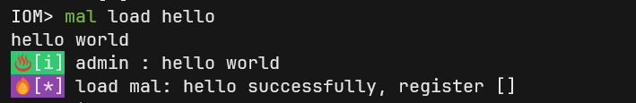

## Intro

IoM 基于[lua5.1](https://www.lua.org/manual/5.1/)以及[gopher-lua](https://github.com/yuin/gopher-lua)实现了一套复杂但强大的插件系统 [mals](/IoM/manual/mal/)

* 一组类似AggressiveScript的简化api
* 一组全量功能的原始grpc api
* 一系列方便的内置lua库

lua 是一门非常简单的脚本语言, 阅读几个示例后读者应该就可以直接上手使用, 几乎不需要看lua的相关文档, 如果你准备从零开始编写插件, 推荐使用[vscode](https://code.visualstudio.com/)+[sumneko插件](https://marketplace.visualstudio.com/items?itemName=sumneko.lua)

## 基础使用
### Hello World

编写hello.lua

```lua
print("hello world") -- 在client的标准输出中打印hello world

broadcast("hello world") -- 在所有的client中打印hello world

notify("hello world") -- 在所有client中打印, 并且如果配置了第三方通知接口(飞书,tg,微信) 则同时会在向第三方发送通知
```

为了让这个插件能被正确加载, 我们还需要编写 mal.yaml 让IoM可以识别.

```yaml
name: hello
type: lua
author: M09Ic
version: v0.0.1
entry: hello.lua
```

将这两个文件都放在插件的默认保存目录下即可

windows: `%USERPROFILE%/.config/malice/mals/hello/`
linux: `~/.config/malice/mals/hello`

```
mal load hello
```



!!! important "分发插件"
	[社区仓库](https://github.com/chainreactors/mal-community) 中的插件都通过zip包分发. 

	 也可以将刚刚的`hello.lua` 和 `mal.yaml` 打包成zip, 然后命令安装
	 
	 ```
	 mal install hello.zip 
	```


## 注册命令

通过command函数， 可以将lua的函数注册到IoM client的命令中。

如下将举一些常见的例子:

### 基本语法
```lua
command(name, function, help, ttp)
```

- name: 命令名称，支持多级命令（用:分隔）
- function: 执行的lua函数
- help: 命令帮助信息
- ttp: MITRE ATT&CK TTP编号

详细文档请见：https://wiki.chainreactors.red/IoM/manual/mal/builtin/#command

### 基础用法

#### 简单命令注册
```lua
-- print hello world
local function hello()
	print("hello world")
end

command("hello", hello, "print hello world", "T1000")
```
在客户端执行hello命令时，将调用hello函数并输出"hello world"。

#### 多级命令注册

在复杂场景中， 例如mimikatz 拥有多个常见用法 logonpasswords  tickets   。 我们需要其注册为mimikatz的子命令。 

```lua
local function logonpasswords()
	...
end

local function tickets()
	...
end

command("mimikatz:logonpasswords", logonpasswords, "logonpasswords", "T1000")
command("mimikatz:tickets", logonpasswords, "logonpasswords", "T1000")
```

`:` 表示子命令的分隔符， 可以添加任意层级的子命令

```lua
command("mimikatz:common:hello", hello, "print hello world", "T1000")
```
### 参数处理

在命令行程序中，通常将命令行的输入分为:

- args, `hello arg1 arg2`, 
- flags, POSIX中分为 long|short flag . `hello -s` 和`hello --long`
- cmdline, 表示完整的命令行字符串

在IoM中还有一类特殊的用法。 我们可以直接传入[cobra](https://cobra.dev/)(一个被广泛使用的命令行库)的cmd 对象对象。 用来手动解析flag和arg。

通过这些方式，IoM mal提供了接近golang原生的命令行控制能力， 包括注册、解析甚至自动补全的能力。 
#### args 

```lua
local function print_args(args)
	print(args[1])
	print(args[2])
end

command("hello", print_args, "print args", "T1000")
```
执行`hello arg1 arg2`时，将调用print_args函数，输出arg1和arg2。注意Lua数组索引从1开始。 

**`arg_<number>`**

```lua
local function print_args(arg_1, arg_2, arg_3)
	print(arg_1)
	print(arg_2)
	print(arg_3)
end

command("hello", print_args, "print args", "T1000")
```
执行hello arg1 arg2 arg3时，将调用print_args函数，分别输出三个参数。此方式适用于参数数量固定且较少的场景。

#### flags

```lua
local function print_flags(cmd)
	local name = cmd:Flags():GetString("name")
	print(name)
end

local cmd = command("hello", print_flags, "print flags", "T1000")
cmd:Flags():String("name", "", "the name to print")
```
执行hello --name flag1时，将调用print_flags函数，输出flag1。此方式适用于参数较多或需要精确控制的场景。

 **`flag_<name>`自动注册**

```
local function print_flags(flag_name)
    local name = flag_name
    print(name)
end

local cmd = command("hello", print_flags, "print flags", "T1000")
```
使用`flag_<name>`格式的参数会自动注册为标志参数。执行hello --name flag1时，将调用print_flags函数，输出flag1。此方式代码更简洁，适用于参数较少的场景。

#### cmdline

```lua
local function print_cmdline(cmdline)
	print(cmdline)
end

command("hello", print_cmdline, "print cmdline", "T1000")
```
cmdline参数会将所有命令行参数以空格分隔拼接为字符串。执行hello arg1 arg2 arg3时，将输出arg1 arg2 arg3。

#### cmd

#### 辅助函数

当然你也可以让这个命令更加丰富。

- [help](/IoM/manual/mal/builtin/#help), `help("hello", "a description for this command")` , 添加long helper
- [example](/IoM/manual/mal/builtin/#example), `example("hello", "a example for this command")` 添加命令行exmaple
- [opsec](/IoM/manual/mal/builtin/#opsec), `opsec("hello", 9.8)` , 添加OPSEC 评分


添加compleler 自动补全,  我们提供了多组场景的自动补全参数

示例:

```lua

local rem_socks_cmd = command("rem_community:socks5", run_socks5, "serving socks5 with rem", "T1090")

bind_args_completer(rem_socks_cmd, { rem_completer() })
```

## 标准&内置库

#### mal package

目前mal已经实现了数百个api, 为了更好的管理与分类这些api. 我们将这些api分到三个package中.

* [builtin](/IoM/manual/mal/builtin/), 直接在当前上下文可用, mal相关核心api
* [rpc](/IoM/manual/mal/rpc/), grpc相关api的lua实现
* [beacon](/IoM/manual/mal/builtin/), 对CobaltStrike的兼容层api. 实现了大量与aggressive scirpt中`b`开头函数等价的api

#### lua 标准库

mal lua中同样支持lua标准库, 相关文档可以查阅 lua5.1文档.
关于异步/并发的文档可以查阅 https://github.com/yuin/gopher-lua 与 http://godoc.org/github.com/yuin/gopher-lua

* package
* table
* io
* os
* string
* math
* debug
* channel
* coroutine

#### lua 拓展库

为了更方便的使用，我们已经导入了许多常用工具包。

当前添加的拓展库: 

- [argparse](https://github.com/vadv/gopher-lua-libs/tree/master/argparse/) argparse CLI parsing [https://github.com/luarocks/argparse](https://github.com/luarocks/argparse)
- [base64](https://github.com/vadv/gopher-lua-libs/tree/master/base64/) [encoding/base64](https://pkg.go.dev/encoding/base64) api
- [cmd](https://github.com/vadv/gopher-lua-libs/tree/master/cmd/) cmd port
- [db](https://github.com/vadv/gopher-lua-libs/tree/master/db/) access to databases
- [filepath](https://github.com/vadv/gopher-lua-libs/tree/master/filepath/) path.filepath port
- [goos](https://github.com/vadv/gopher-lua-libs/tree/master/goos/) os port
- [humanize](https://github.com/vadv/gopher-lua-libs/tree/master/humanize/) humanize [github.com/dustin/go-humanize](https://github.com/dustin/go-humanize) port
- [inspect](https://github.com/vadv/gopher-lua-libs/tree/master/inspect/) pretty print [github.com/kikito/inspect.lua](https://github.com/kikito/inspect.lua)
- [ioutil](https://github.com/vadv/gopher-lua-libs/tree/master/ioutil/) io/ioutil port
- [json](https://github.com/vadv/gopher-lua-libs/tree/master/json/) json implementation
- [log](https://github.com/vadv/gopher-lua-libs/tree/master/log/) log port
- [plugin](https://github.com/vadv/gopher-lua-libs/tree/master/plugin/) run lua code in lua code
- [regexp](https://github.com/vadv/gopher-lua-libs/tree/master/regexp/) regexp port
- [shellescape](https://github.com/vadv/gopher-lua-libs/tree/master/shellescape/) shellescape [https://github.com/alessio/shellescape](https://github.com/alessio/shellescape) port
- [stats](https://github.com/vadv/gopher-lua-libs/tree/master/stats/) stats [https://github.com/montanaflynn/stats](https://github.com/montanaflynn/stats) port
- [storage](https://github.com/vadv/gopher-lua-libs/tree/master/storage/) package for store persist data and share values between lua states
- [strings](https://github.com/vadv/gopher-lua-libs/tree/master/strings/) strings port (utf supported)
- [tcp](https://github.com/vadv/gopher-lua-libs/tree/master/tcp/) raw tcp client lib
- [template](https://github.com/vadv/gopher-lua-libs/tree/master/template/) template engines
- [time](https://github.com/vadv/gopher-lua-libs/tree/master/time/) time port
- [yaml](https://github.com/vadv/gopher-lua-libs/tree/master/yaml/) [gopkg.in/yaml.v2](https://gopkg.in/yaml.v2) port
- [http](https://github.com/cjoudrey/gluahttp) http
- [crypto](https://github.com/tengattack/gluacrypto)  hash(md5, sha1,sha256, HMAC...), base64, aes

你可以通过 require 引入对应的依赖，每个仓库的README中都有较为详细的使用说明

```
local crypto = require("crypto")
```

## 插件架构

### 插件组成

每个Mal插件由以下部分组成：

| 组件 | 说明 | 必需 |
|------|------|------|
| **mal.yaml** | 插件元数据配置 | ✅ |
| **entry脚本** | Lua入口文件 | ✅ |
| **资源文件** | 二进制/配置文件 | ❌ |
| **依赖库** | 其他Mal库 | ❌ |

### 插件目录结构

mal-community仓库中的插件遵循统一的目录结构，以community-elevate和community-domain为例：

```
community-elevate/          # 提权工具包
├── mal.yaml               # 插件配置文件
├── main.lua              # 入口脚本
├── resources/            # 资源文件目录
│   ├── windows/         # Windows平台资源
│   │   ├── x64/        # 64位程序
│   │   └── x86/        # 32位程序
│   └── linux/          # Linux平台资源
└── lib/                 # 依赖库文件
    └── utils.lua       # 工具函数

community-domain/          # 域渗透工具包
├── mal.yaml              # 插件配置文件
├── main.lua             # 入口脚本
├── modules/             # 功能模块
│   ├── kerberos.lua    # Kerberos相关
│   ├── ldap.lua        # LDAP查询
│   └── dcsync.lua      # DCSync功能
├── resources/           # 资源文件
│   └── tools/          # 工具二进制
└── config/             # 配置文件
    └── targets.yaml    # 目标配置
```

典型的mal.yaml配置示例：

```yaml
name: community-elevate
type: lua
author: chainreactors
version: v1.0.0
entry: main.lua
description: Windows/Linux提权工具集合
depend_module:
  - lib
  - common
resources:
  - resources/
tags:
  - elevate
  - privilege
  - windows
  - linux
```

### API分层

Mal提供三层API体系，满足不同复杂度的需求：

| API层 | 用途 | 特点 | 适用场景 |
|-------|------|------|----------|
| **Builtin** | 核心功能 | 简单直观 | 常规操作 |
| **Beacon** | CS兼容 | AggressorScript风格 | CS迁移 |
| **RPC** | 完整功能 | 原始gRPC | 高级操作 |

## 高级用法

### beacon package

beacon package 是否按照CobaltStrike的aggressive script的api签名封装的一套接口， 用来提供类似aggressive script 编写的体验。 

```lua
local beacon = require("beacon")

beacon.bexecute(active(), "whoami")
```

目前支持的所有aggressive script 风格的api文档请见: https://chainreactors.github.io/wiki/IoM/manual/mal/beacon/

### new protobuf message

在builtin和beacon 包中, 绝大多数api都是高度封装的, 并不需要过多关注底层的GRPC接口调用。

但如果要调用 rpc 包中的接口，就需要手动创建对应的protobuf message.

mals已经将所有的protobuf message都注册到了lua中, 并添加了必要的接口.


```lua
local bin = ExecuteBinary.New()
bin.Name = "execute_assembly"
bin.Args = {"whoami"}
bin.Bin = read_resource("example.exe")
```

或

```lua
local bin = ExecuteBinary.New({
    Name = "execute_assembly",
    Bin = read_resource("example.exe"),
    Type = "example_type",
    Args = {"whoami"}
})
```

### 动态new protobuf message

mals添加了ProtobufMessage 作为通用的反射获取package name的
```lua
local msg = ProtobufMessage.New("modulepb.ExecuteBinary", {
    Name = "execute_assembly",
    Bin = read_resource("example.exe"),
    Type = "example_type",
    Args = {"whoami"}
})
```

### 调用rpc命令
	
```lua
function load_rem()
	 local rpc = require("rpc")

	 local task = rpc.LoadRem(active():Context(), ProtobufMessage.New("modulepb.Request", {
	 	 Name = "load_rem",
	 	 Bin = read_resource("chainreactors/rem.dll"),
	 }))
	 wait(task)
end
```

### 注册为库

mals允许用户自行实现的插件作为类库，成为其他库的依赖。 

首先, 需要将lib设置为ture
```yaml
name: community-lib
type: lua
author: M09Ic
version: v0.0.1
entry: main.lua
lib: true
depend_module: 
```

你的lib需参考如下写法
```lua
-- community-lib/main.lua

local lib = {}

function lib.demo()
    print("this is a lib demo")
end

return lib
```

当你需要在其他插件中使用这个库时, 需要通过require等调用
```lua
-- community-other/main.lua

local clib = require("common-lib")
clib.demo()
```


