## 编译配置
###  使用SaaS编译

**v0.1.1 加入了SaaS编译 这是IoM实现"开箱即用"目标的重要一步。SaaS编译服务托管在我们的服务器上，为用户提供最基础的自动化编译服务，极大简化了IoM的使用门槛。**


- **零环境配置**：无需安装Docker、GitHub Action或其他编译环境
- **自动注册**：如果token为null，会自动向服务器注册获取token，对用户完全无感
- **即时可用**：运行server后等待几分钟即可自动生成对应的implant
- **安全可控**：如有安全顾虑，可手动关闭此功能，使用私有化编译方案


**默认启用**：v0.1.1版本开始，默认情况下server会使用云编译服务生成implant。

**关闭SaaS编译**：如需使用私有化编译方案，可在配置中关闭：

```yaml
saas:  
  enable: false  
```


!!! danger "安全警告"
	使用默认提供的云编译服务视为同意用户协议
	用户协议全文: https://wiki.chainreactors.red/IoM/#用户协议
	
	如有安全顾虑，建议：
	1. 关闭SaaS编译功能
	2. 使用Docker或GitHub Action进行私有化编译
	3. 自行搭建编译环境

SaaS编译极大简化了原本复杂的编译流程，无需配置docker/githuba acticon即可进行编译。为了简化clinet编译流程，我们将原先的docker、github action编译命令与SaaS编译统一到了build命令中，通过 `--source` 控制使用不同的编译方式。


```bash
build beacon --profile tcp_default --target x86_64-pc-windows-gnu --source saas
```

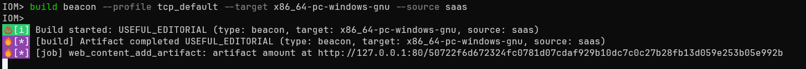

!!! tips "如果不指定 `--source` 将自动寻找可用编译方式"


### 使用github action

**v0.0.4 开始推荐更加轻量的github action编译， 对服务器的配置无要求，也不需要安装docker**

新建github token: https://github.com/settings/tokens/new 

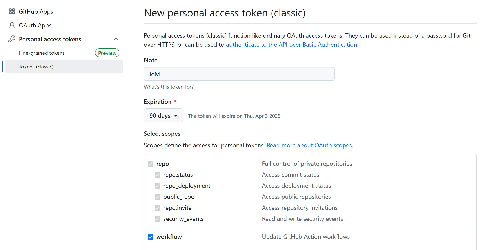


fork 或者push到自己的malefic仓库

修改 /opt/IoM/malice-network/config.yaml(即服务端config.yaml)

```yaml
github:  
  repo: malefic  
  workflow: generate.yaml  
  owner: your_name
  token: your_token
```

修改 config 后重启服务

```bash
service malice-network restart
```

或重启malice-network

```bash
./malice-network
```

在 v0.0.4 下，我们引入了 github action 来编译 implant，避免因为 rust 复杂的编译方案而需要准备 docker 环境来编译。现在你只需准备好 malefic 仓库和对应的 token（需要 workflow 和 package 权限），并且在 sever 或者 client 端配置（[详见配置说明](deploy.md)），即可使用命令行进行 github action 编译。

使用 client 自动编译:


**编译beacon**

基于github action
```bash
build beacon --profile tcp_default --target x86_64-unknown-linux-musl --source action
```


!!! tips "多按 Tab, 大部分输入都可以通过 tab 自动补全"


??? info "(非必要)其他编译方式"
	我们提供了如下几种方式进行编译：

    1. [本地编译](/IoM/manual/implant/build/#23-本机编译)
    2. [Docker 编译(纯本地更安全)](/IoM/manual/implant/build/#21-docker-编译推荐)
    3. [Github Action编译环境(0环境配置, 推荐)](/IoM/manual/implant/build/#22-github-action编译)
    
    编译完整说明手册[implant 手册](/IoM/manual/implant/build)

### 使用docker (对服务器性能有要求)

如果已经配置了github action, 可以忽略docker相关。

!!! important "服务器性能要求"
	自动化编译服务用到了 docker, 且 rust 生成的中间文件体积较大, 对 CPU 消耗较高.
	
	因此 IoM 要搭建自动化编译的服务端对性能有一定要求.
	
	我们推荐在至少2核4G或以上的机器运行, 并保留至少 20G 的空间.
	
	如果只是作为 server/listener 用途, 对性能没有任何要求.
	
	可以专门找一台服务器当做编译服务器. 后续也会提供这方面的优化.

如果要使用docker作为编译环境，需要准备一台性能还不错的机器， 并在install.sh 的交互式安装引导中选择docker.

安装脚本中已经自动化配置了IoM必备的所有环境，可以在client直接操作

若没有使用安装脚本，则需要手动安装镜像  `ghcr.io/chainreactors/malefic-builder:latest` ，这个镜像包含了win/linux/mac常用target。

??? "基于docker的手动编译(非必要)"
	docker 手动编译操作可见: https://chainreactors.github.io/wiki/IoM/manual/implant/build/#%21-docker-%E7%BC%96%E8%AF%91%E6%8E%A8%E8%8D%90

	
	相比IoM目前提供的参数选项， 手动编译具有更高的细粒度，但只推荐对rust开发熟悉的使用


``` bash
build beacon --profile tcp_default --target x86_64-pc-windows-gnu --source docker
```

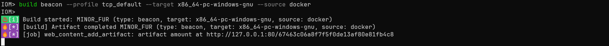


## 编译

目前我们精简了build命令，并支持三种编译方式，分别为docker、action和SaaS编译。本文将主要举例如何在IoM环境下进行编译。

### 准备profile

编译Implant需要通过profile来控制编译选项，所以在编译之前首先要确保是否有对应的编译profile。目前在默认的server配置下，我们会生成默认的pipeline profile，负责编译与对应pipeline通信的Implant。

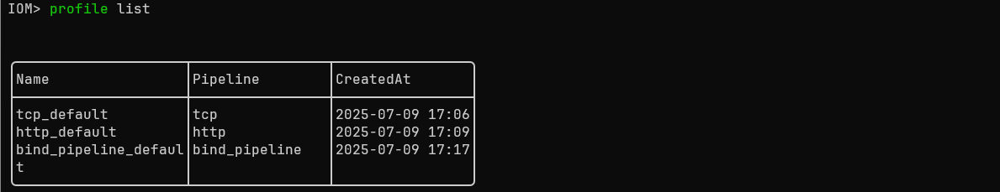

在gui上，可以在artifact页面查看profile列表:
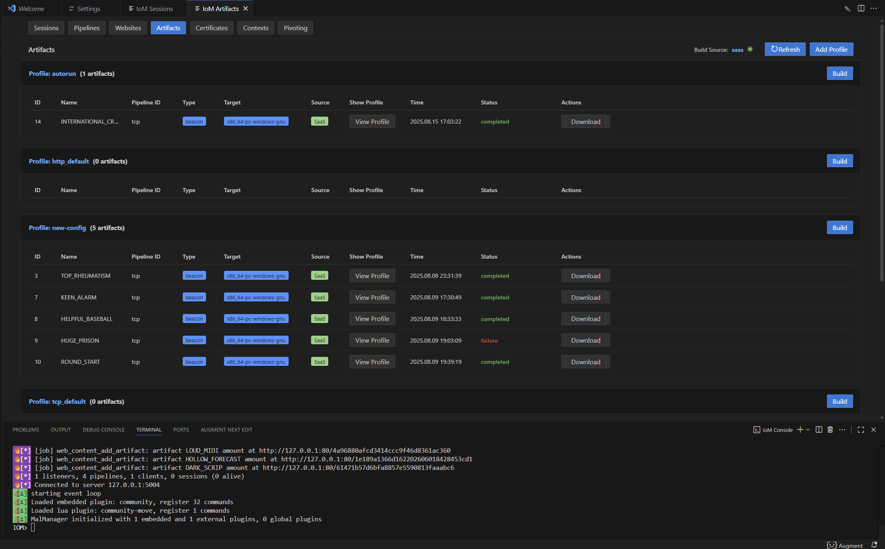

也可以点击profile的name，查看profile内容：
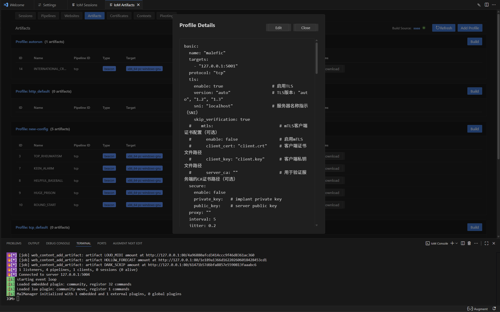
如果需要建立新的profile，可以使用以下命令:

```bash
profile new --name test --pipeline tcp
```

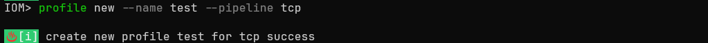
也可以load一个已有的profile文件:
```bash
profile load path/to/config.yaml --name test --pipeline tcp
```

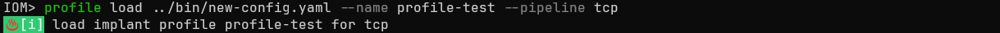

在 gui 中添加 profile 时，用户若未选择文件则创建新的 profile；若选择了已有的 profile 文件，则加载该 profile:
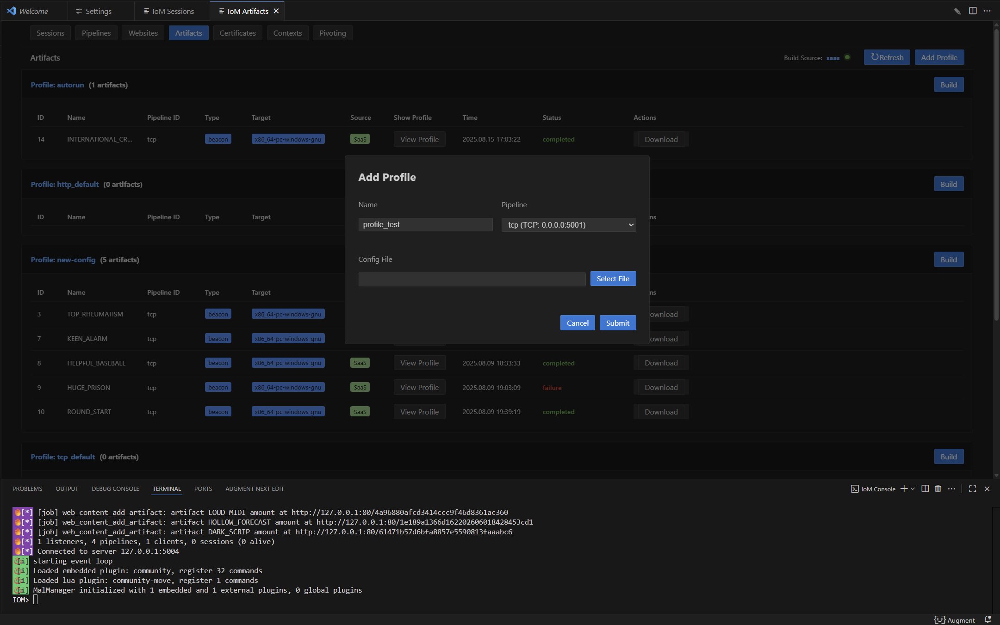

### 编译beacon

除了使用profile，还可以通过 `--addresses` 直接指定目标地址进行编译，支持多种协议前缀：

``` bash
# 使用profile编译
build beacon --profile tcp_default --target x86_64-unknown-linux-musl

# 直接指定地址编译（支持 tcp://, http://, https://, tcp+tls:// 前缀）
build beacon --addresses "https://127.0.0.1:443" --target x86_64-pc-windows-gnu

# 多地址编译（逗号分隔）
build beacon --addresses "https://127.0.0.1:443,https://10.0.0.1:443" --target x86_64-pc-windows-gnu
```

所有build子命令都支持 `--wizard` 交互式向导模式：

```bash
build beacon --wizard
```

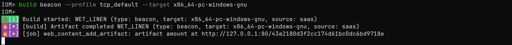

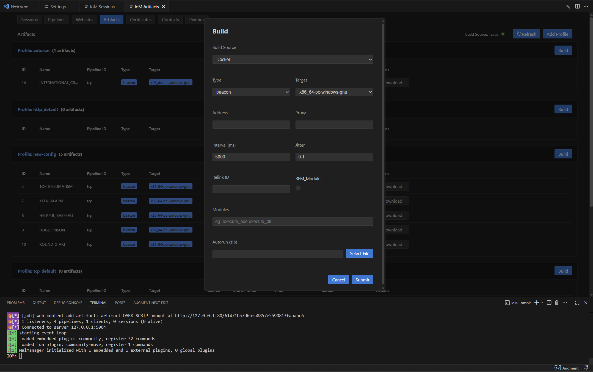
也可以使用 `--rem` ，将beacon静态链接至rem。需要传入rem link地址：

```bash
build beacon --addresses "tcp://127.0.0.1:5001" --rem "tcp://nonenonenonenone:@127.0.0.1:12345?wrapper=xxx" --target x86_64-unknown-linux-musl
```

或者基于profile编译：

```bash
build beacon --profile tcp_default --target x86_64-unknown-linux-musl --rem "tcp://nonenonenonenone:@127.0.0.1:12345?wrapper=xxx"
```

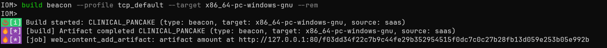

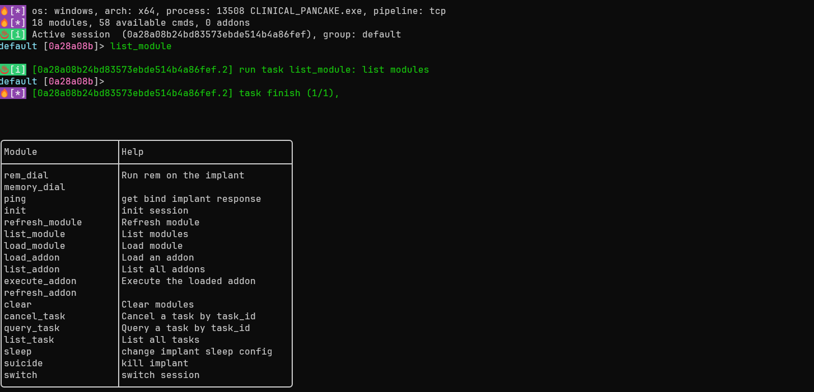

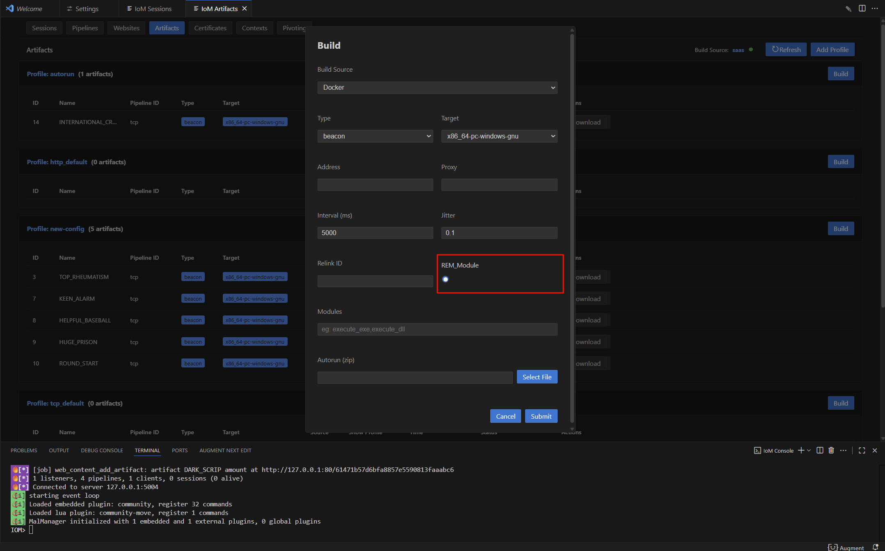

### 编译module

目前我们支持编译IoM的插件和第三方插件，使用时必须带上 `--modules` 或 `--3rd` ，来确认所需要编译的插件，否则将无法编译。在gui中，3rd和modules只可以在一个文本框填入module。用法如下：


```bash
build modules --modules execute_exe,execute_dll --profile tcp_default --target x86_64-pc-windows-gnu 
```

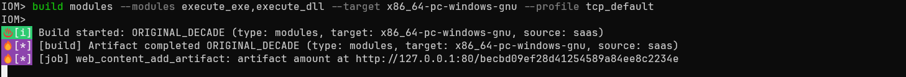

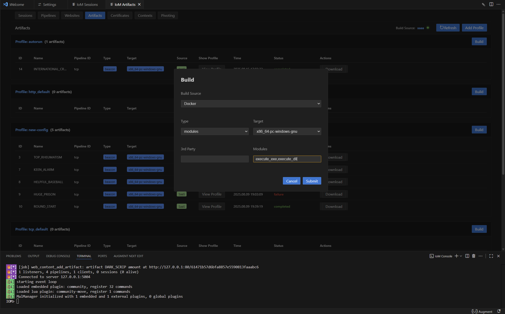

通过artifact name加载modules（name可通过tab补全）。

```bash
load_module --artifact artifact-name
```

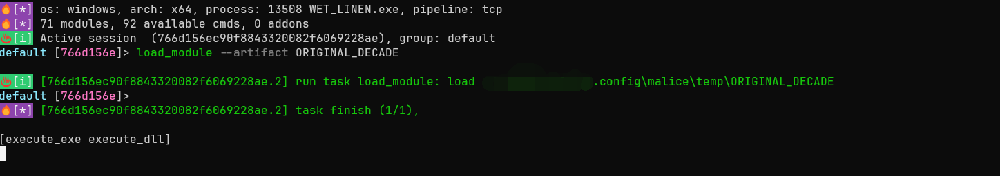

#### 编译 3rd module

目前仅支持rem和curl。

```bash
build modules --3rd rem --profile tcp_default --target x86_64-pc-windows-gnu
```

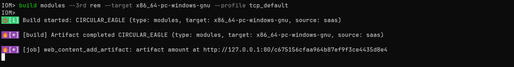

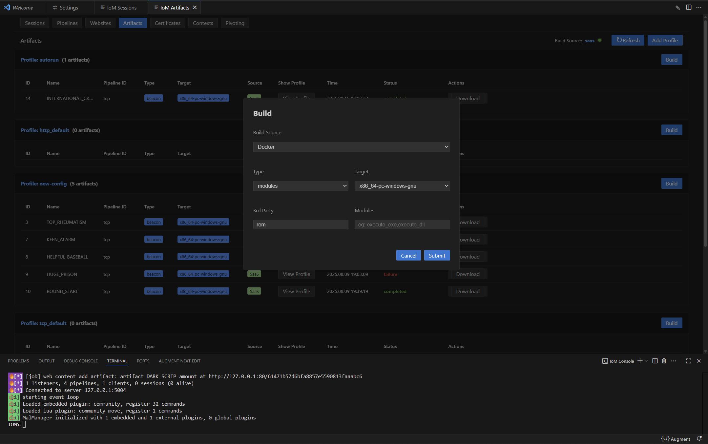
同上，通过artifact name加载modules。

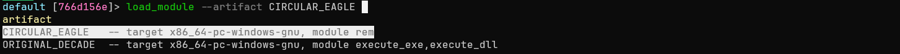

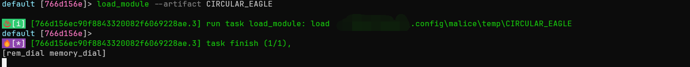

### 编译pulse

```bash
build pulse --profile tcp_default --target x86_64-pc-windows-gnu 
```

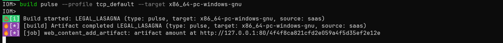

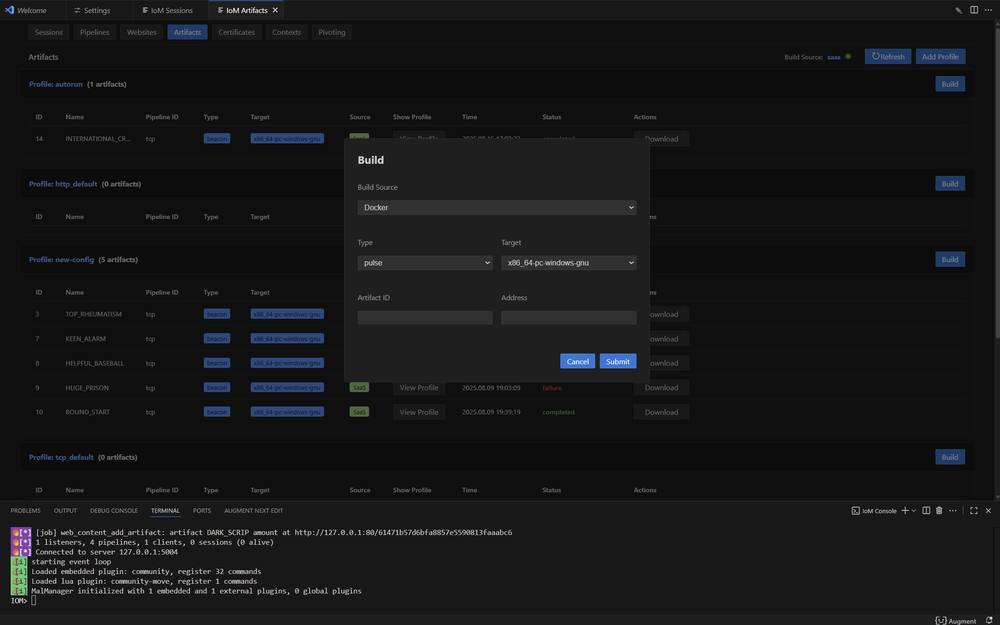

指定pulse artifact id进行编译，也可以通过 `--beacon-artifact-id` 指定关联的beacon artifact用于relink：

```bash
build pulse --profile tcp_default --target x86_64-pc-windows-gnu --artifact-id 5

# 指定beacon artifact进行relink
build pulse --profile tcp_default --target x86_64-pc-windows-gnu --artifact-id 5 --beacon-artifact-id 42
```


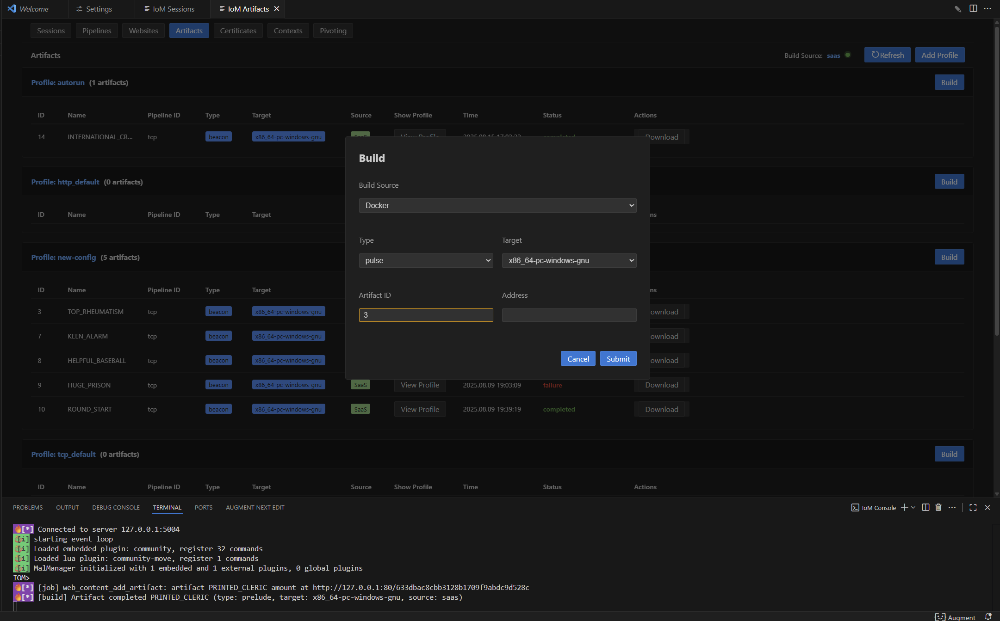

### 编译bind

bind payload 用于反向连接场景，客户端主动连接到 implant：

```bash
build bind --target x86_64-pc-windows-gnu --profile tcp_default

# 指定额外模块
build bind --target x86_64-pc-windows-gnu --profile tcp_default --modules base,sys_full

# 编译为共享库（DLL）
build bind --target x86_64-pc-windows-gnu --profile tcp_default --lib
```

### 编译prelude
prelude目前需要配置autorun.yaml来使用，profile中implants下的autorun需要指定为autorun.yaml：

```yaml
implants:  
  runtime: tokio           
  mod: beacon             
  register_info: false      
  hot_load: true          
  modules:               
    - "full"  
  enable_3rd: false       
  3rd_modules:             
  
  autorun: "autorun.yaml"             # autorun config filename  
  pack: 
  flags:  
    start: 0x41  
    end: 0x42  
    magic: "beautiful"  
    artifact_id: 0x1
```

autorun.yaml的示例config为：
```yaml
-
  name: execute_bof          # 需要执行的命令名称
  body: !ExecuteBinary       # 指定命令proto类型
    name: dir                # 命令标识
    bin: !File "dir.o"       # 要执行的二进制文件
```

在编译prelude时，需要将autorun.zip（包含 `prelude.yaml` 和 `resources/` 目录）上传至服务器。autorun.zip的文件目录如下：

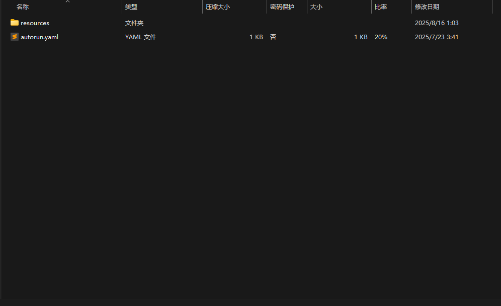

resources文件夹中需要包含autorun.yaml中所列到的所有文件。

编译prelude支持以下几种输入方式：

```bash
# 方式1: 通过archive-path上传zip包（推荐）
build prelude --target x86_64-pc-windows-gnu --archive-path path/to/build.zip

# 方式2: 分别指定prelude配置和resources目录
build prelude --target x86_64-pc-windows-gnu --prelude-path path/to/prelude.yaml --resources-path path/to/resources/

# 方式3: 使用已有的profile
build prelude --target x86_64-pc-windows-gnu --profile prelude-profile
```

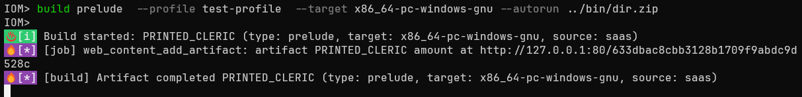

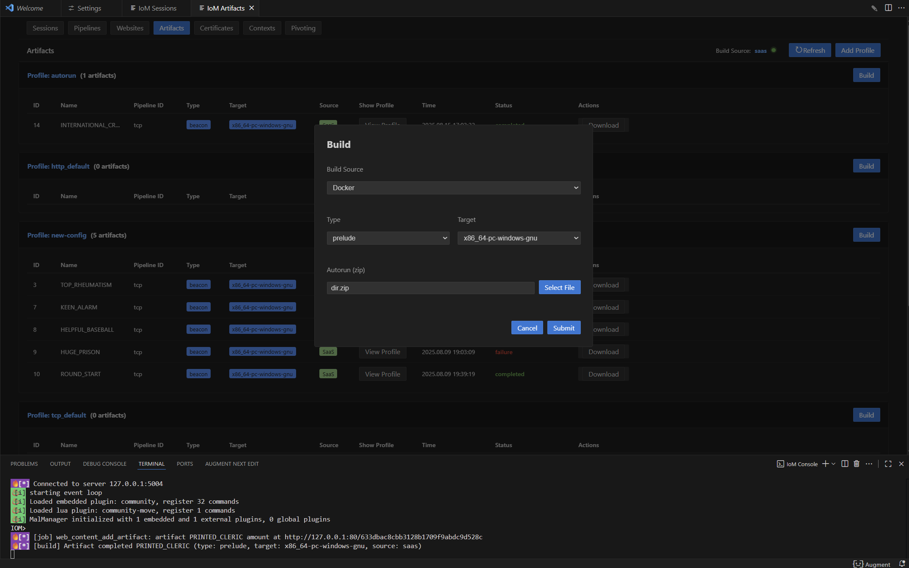

### 查看build log

如果出现编译失败，可以通过以下命令来查看build log(目前支持查看docker，后续会加上saas）：

```bash
build log artifact_name

# 指定显示行数（默认50行）
build log artifact_name --limit 100
```

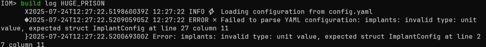

在gui中，可以右击对应artifact行，点击Show Artifact Log, 可以查看log。

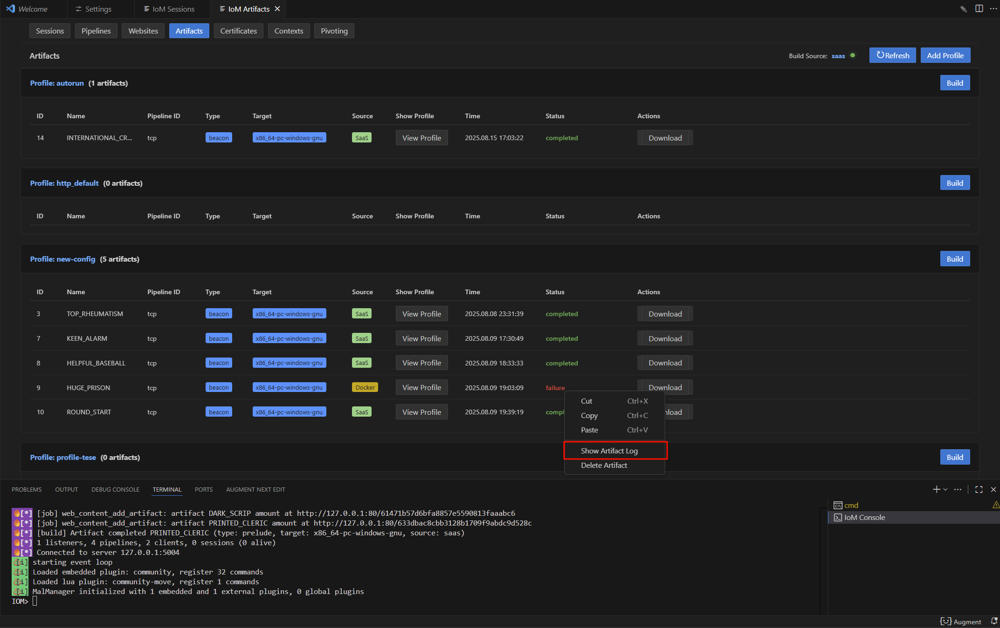

## artifact

在artifact build 完毕后会有如下日志
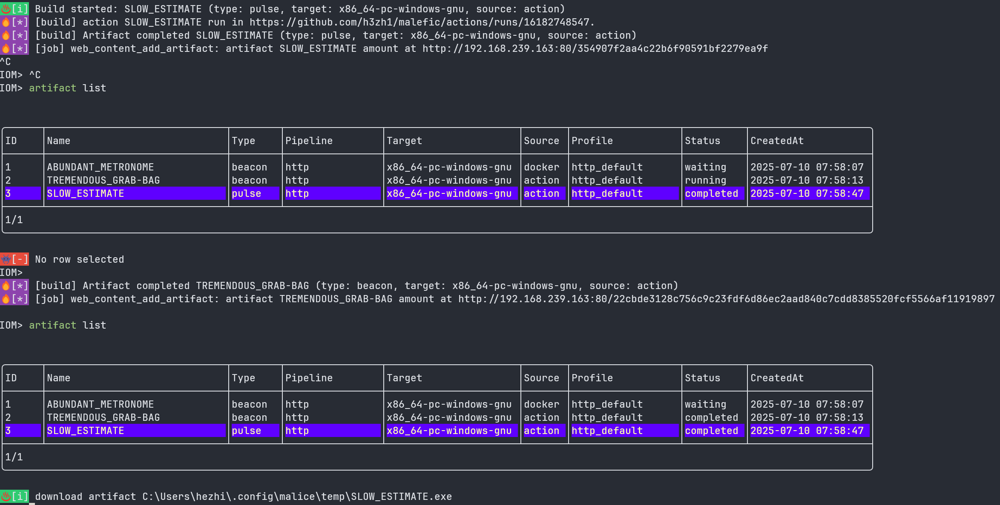

现在你可以通过`artifact download`命令获取shellcode,
`artifact download <ArtifactName> --format <format>`

format格式目前有:

```angular2html
executable
raw
c
csharp
java
golang
python
perl
ruby
bash
powershell
hex-oneline
hex-multiline
num
dword
js_be
js_le
vbscript
vbapplication
powershell-remote *
curl-remote *
```

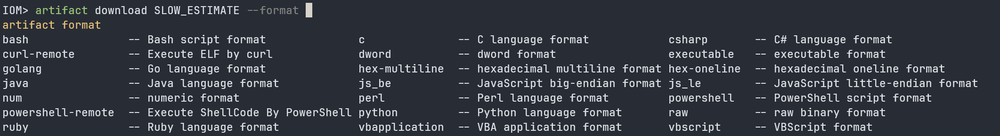

因此，你可以调用`artifact download SLOW_ESTIMATE --format raw`来获得一个shellcode, 直接用于执行
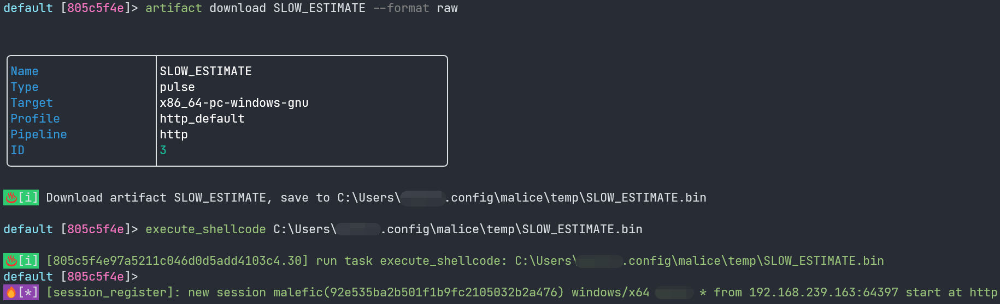

另外, 目前我们支持了powershell-remote和curl-remote两种新格式的用法,方便一键上线等操作,通过前文日志读者可以观察到我们将artifact及其对应的format映射到了website端:
当你调用powershell-remote时, 会输出对应的一键上线命令。

```
artifact download <ArtifactName> --format powershell-remote`
```

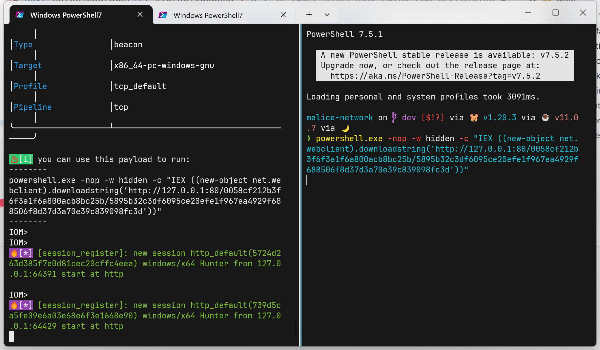

读者也可以通过以下命令来浏览以往的artifact记录，并且在artifact表格中选中后，即可将artifact源文件下载到client端。
```bash
artifact list
```

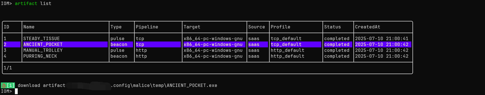

gui则是在artifact页面上点击对应的artifact行上的download按钮，即可下载artifact源文件到指定路径。
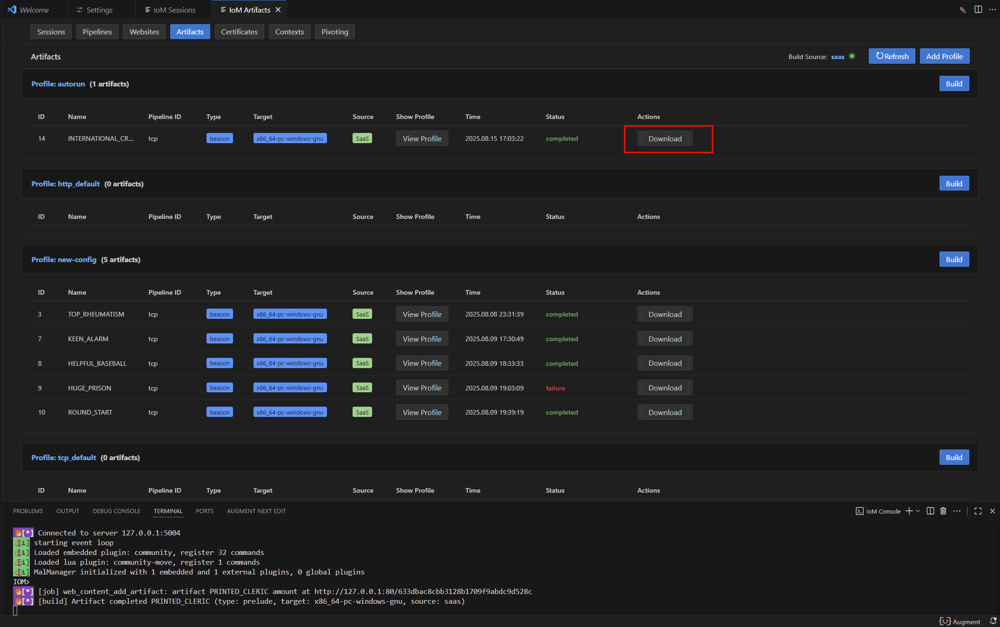


## build 命令标志参考

### 通用标志（所有build子命令共享）

| 标志 | 类型 | 说明 |
|------|------|------|
| `--profile` | string | profile名称 |
| `--target` | string | 编译目标平台，如 `x86_64-pc-windows-gnu`（必填） |
| `--source` | string | 编译源：`docker`, `action`, `saas`（不指定则自动选择） |
| `--lib` | bool | 编译为共享库（DLL）而非可执行文件 |
| `--comment` | string | 编译备注 |
| `--wizard` | bool | 启用交互式向导模式 |

### beacon/bind 专用标志

| 标志 | 类型 | 说明 |
|------|------|------|
| `--addresses` | string | 目标地址（逗号分隔），支持 `tcp://`, `http://`, `https://`, `tcp+tls://` 前缀 |
| `--rem` | string | REM 静态链接地址 |
| `--cron` | string | cron 表达式，如 `*/5 * * * * * *` |
| `--jitter` | float | 抖动比例（0.0-1.0） |
| `--init-retry` | int | 初始连接重试次数 |
| `--server-retry` | int | 服务器重试次数 |
| `--global-retry` | int | 全局重试次数 |
| `--encryption` | string | 加密类型（aes, xor 等） |
| `--key` | string | 加密密钥 |
| `--secure` | bool | 启用安全通信 |
| `--modules` | string | 模块列表（逗号分隔），如 `full,execute_exe` |
| `--3rd` | string | 第三方模块，如 `rem,curl` |

### 文件输入标志（beacon/bind/prelude）

| 标志 | 类型 | 说明 |
|------|------|------|
| `--archive-path` | string | build archive (zip) 路径，包含 implant.yaml、prelude.yaml 和 resources/ |
| `--implant-path` | string | implant.yaml 文件路径（覆盖 archive 中的同名文件） |
| `--prelude-path` | string | prelude.yaml 文件路径（覆盖 archive 中的同名文件） |
| `--resources-path` | string | resources 目录路径（覆盖 archive 中的同名目录） |

### 代理标志

| 标志 | 类型 | 说明 |
|------|------|------|
| `--proxy-use-env` | bool | 使用环境变量中的代理设置 |
| `--proxy-url` | string | 代理 URL |

### Guardrail 标志（执行环境白名单）

| 标志 | 类型 | 说明 |
|------|------|------|
| `--guardrail-ip-addresses` | string | IP 地址白名单（逗号分隔，支持通配符） |
| `--guardrail-usernames` | string | 用户名白名单（逗号分隔，支持通配符） |
| `--guardrail-server-names` | string | 服务器名白名单（逗号分隔，支持通配符） |
| `--guardrail-domains` | string | 域名白名单（逗号分隔，支持通配符） |

### 其他高级标志

| 标志 | 类型 | 说明 |
|------|------|------|
| `--ollvm` | bool | 启用 OLLVM 混淆 |
| `--anti-sandbox` | bool | 启用反沙箱检测 |

### pulse 专用标志

| 标志 | 类型 | 说明 |
|------|------|------|
| `--address` | string | 单个目标地址 |
| `--artifact-id` | uint32 | pulse artifact ID |
| `--beacon-artifact-id` | uint32 | 关联的 beacon artifact ID（用于 relink） |
| `--user-agent` | string | HTTP User-Agent |

### GitHub Action 标志

| 标志 | 类型 | 说明 |
|------|------|------|
| `--github-owner` | string | GitHub 仓库所有者 |
| `--github-repo` | string | GitHub 仓库名 |
| `--github-token` | string | GitHub Token |
| `--github-workflowFile` | string | workflow 文件名 |
| `--github-remove` | bool | 编译后删除 workflow |
