!!! tips "在v0.1.1开始，TLS 成为implant的默认选项， 将于cert管理功能深度联动"
	在v0.1.1我们添加了证书管理功能，能够通过命令行显示证书列表，生成证书，删除证书，更新证书。你也可以给pipeline指定证书，重新启动pipeline，使用tls功能。目前我们支持自签名证书和用户自行导入证书。

# listener config配置
目前listener需要通过IoM的Server的同级目录下的config.yaml来控制, 以下是listener的config示例配置
```yaml
listeners:                  # listener 配置, 可独立生效
  name: listener  
  auth: listener.auth  
  enable: true  
  ip: 127.0.0.1   
  auto_build:
    enable: true
    build_pulse: true
    target:
      - x86_64-pc-windows-gnu
    pipeline:
      - tcp
      - http
  tcp:	                    # tcp example            
    - name: tcp             # tcp pipeline
      port: 5001  
      host: 0.0.0.0  
      protocol: tcp  
      parser: malefic       # auto/malefic/pulse
      enable: true  
      tls:                  # tls配置, 按照配置生成证书或者使用已有的证书文件
        enable: true  
        # 自签名证书
        CN: "test"  
        O: "Sharp Depth"  
        C: "US"  
        L: "Houston"  
        OU: "Persistent Housework, Limited"  
        ST: "State of Texas"  
        # 自定义证书  
        cert_file: ""  
        key_file: ""  
        ca_file: ""   
      encryption:           # 加密配置, 需要与implant对应
        - enable: true
          type: aes
          key: maliceofinternal
        - enable: true
          type: xor
          key: maliceofinternal        
  http:	# http example
    - name: http  
      enable: true  
      host: 0.0.0.0  
      port: 8080  
      parser: malefic       # auto/malefic/pulse
      tls:  
        enable: true  
        CN: "test"  
        O: "Sharp Depth"  
        C: "US"  
        L: "Houston"  
        OU: "Persistent Housework, Limited"  
        ST: "State of Texas"   
        cert_file: ""  
        key_file: ""  
        ca_file: ""  
      encryption:
        - enable: true
          type: aes
          key: maliceofinternal
        - enable: true
          type: xor
          key: maliceofinternal 
      error_page: ""  
      
    - name: http-pulse  
      enable: true  
      host: 0.0.0.0  
      port: 8081  
      parser: pulse  
      encryption:  
        enable: true  
        type: xor  
        key: maliceofinternal  
      error_page: ""  
    
  bind:                    # bind 启动配置     
    - name: bind_pipeline  
      enable: true  
      encryption:  
        enable: true  
        type: aes  
        key: maliceofinternal 
        
  website:                 # website 启动配置
    - name: default-website  
      port: 80  
      root: "/"  
      enable: true  
  
  rem:                     # rem 启动配置
    - name: rem_default  
      enable: true  
      console: tcp://0.0.0.0:12345
```

## 基础参数配置
```yaml
listeners:                 
  name: listener           # listener名称
  auth: listener.auth      # listener证书信息路径
  enable: true     
  ip: 127.0.0.1            # listener外网ip
```
## autobuild 配置
目前启动一个listener时，可以通过autobuild的配置，来控制是否编译与当前listener通信的implant。以下是autobuild配置示例。
```yaml
  auto_build:
    enable: true
    build_pulse: true
    target:
      - x86_64-pc-windows-gnu
      - x86_64-unknown-linux-musl
    pipeline:
      - tcp
      - http
```

`enable` 控制是否进行autobuild。
`build_pulse` 控制是否编译对应pipeline的pulse artifact。
`target` 控制自动编译的implant的系统架构，支持多个系统架构一起编译。
`pipeline` 控制自动编译的implant对应的通信pipeline，选择了几个pipeline就会生成对应数量的beacon implant。
autobuild的编译平台优先级为docker > github action > saas，若使用saas编译，需确保服务端的config.yaml配置了saas，并且服务端未启动docker，也没有在config.yaml中配置github仓库信息。
## pipeline config配置
pipeline 负责与implant的通讯，可以与server分离部署， 也可以同时部署。

当前支持多种信道， 以及基于rem实现的拓展信道。 
- 基本信道
	- tcp
	- http
- rem: 支持rem支持的所有信道 https://wiki.chainreactors.red/rem/ 
	- udp
	- http
	- tcp
	- tls
	- smb
	- unix
	- websocket
	- icmp
	- ...
- bind, 用于正向连接
- website, 用于分发artifact与挂载文件
### tcp

最常用的 pipeline, 适用于主体程序交互的 pipeline。

tcp 是目前支持了最多特性的 pipeline。

单个 tcp pipeline 配置:

```yaml
  tcp:
  - name: tcp_default       # tcp 名字
        port: 5001          # tcp 监听的端口
        host: 0.0.0.0       # tcp 监听的host
        parser: malefic 	# implant协议
        enable: true        # tcp 是否开启
        tls:                # tls配置项,留空则自动生成
          enable: false
          CN: "test"
          O: "Sharp Depth"
          C: "US"
          L: "Houston"
          OU: "Persistent Housework, Limited"
          ST: "State of Texas"
	 	  cert_file: ""
		  key_file: ""
		  ca_file: ""
        encryption:
          enable: true
          type: aes
          key: maliceofinternal
```

### http

http是支持http协议通信的pipeline，和tcp一样支持最多特性。

单个http pipeline配置:

```yaml
  http:	
    - name: http          # http 名字
      enable: true        # http 是否开启
      host: 0.0.0.0       # http 监听的host
      port: 8080          # http 监听的端口
      parser: malefic     # implant协议
      tls:                # tls配置项,留空则自动生成
        enable: true  
        CN: "test"  
        O: "Sharp Depth"  
        C: "US"  
        L: "Houston"  
        OU: "Persistent Housework, Limited"  
        ST: "State of Texas"   
        cert_file: ""  
        key_file: ""  
        ca_file: ""  
      encryption:
        - enable: true
          type: aes
          key: maliceofinternal
        - enable: true
          type: xor
          key: maliceofinternal  
```
### website

IoM 允许将一些文件挂载 web 服务上

```yaml
  websites:             
    - name: test		             # website 名字
      port: 10049		             # website 端口
      root: "/test"		             # website route根目录
      enable: false                  # website 是否开启
      content:			             # website 映射内容
        - path: '\images\1.png'      # 文件在website的映射路径
          file: 'path\to\file'       # 文件的实际路径
          type: raw                  # 文件类型
        - path: '\images\2.png'
          file: 'path\to\file'
          type: raw
```

### bind (Unstable)

主动发送数据的 pipeline, 不同于 tcp 监听端口. bind 会主动向目标发送对应协议序列化后的数据.

```yaml
  bind:
    -
      name: bind_default            # bind 名字
      enable: true                  # bind 是否开启
      encryption:
        enable: true
        type: aes
        key: maliceofinternal
```

### rem (Unstable)

rem在 IoM 中一类扩展型 pipeline，它和 `tcp`、`http` 不同，是一个 **通用通信框架**，它把 IoM 的 implant 通信能力对接到了 [rem 项目](https://wiki.chainreactors.red/rem/)，因此可以复用 rem 提供的多种隧道和代理功能。

```yaml
  rem:                     
    - name: rem_default              # rem 名字
      enable: true                   # rem 是否开启
      console: tcp://0.0.0.0:12345   # rem 控制台监听地址和连接协议
```

## listener 命令管理

在确保 **Malice-Network** 服务器已经运行后，在终端输入以下指令：

```powershell
.\malice-network listener add [listener_name]
```

执行命令成功后，服务端会输出以下信息并在所处文件夹下生成对应 auth 配置文件：

也可以删除用户, 使其无法登录 server

```
.\malice-network listener del [listener_name]
```

列出所有可用的用户配置

```
.\malice-network listener list
```

## pipeline 命令管理

## 基本用法
### 新建tcp

```bash
tcp --listener listener --host 127.0.0.1 --port 5015
```

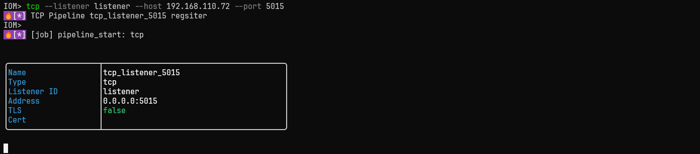

gui:
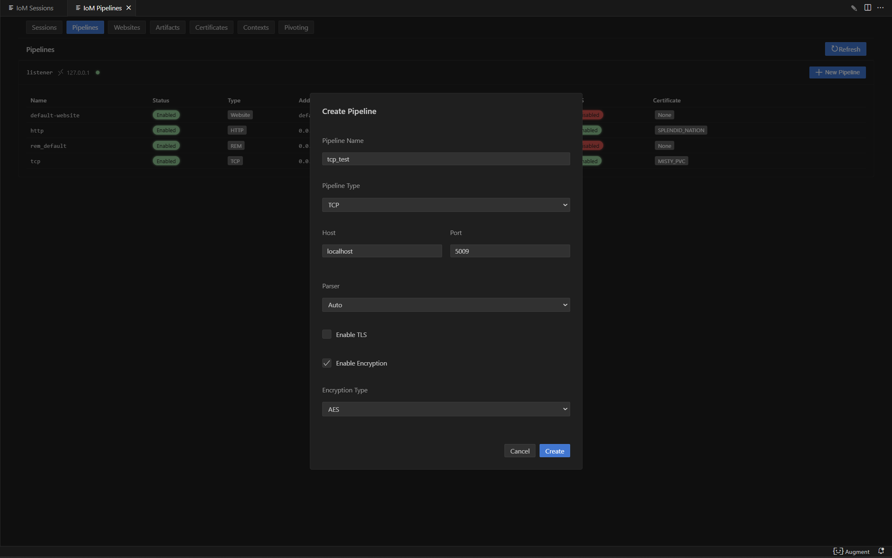
#### 新建tcp并开启tls

!!! tips "其他pipeline打开tls方式相同"

```bash
tcp --listener listener --host 127.0.0.1 --port 5015 --tls --cert-name cert-name
```

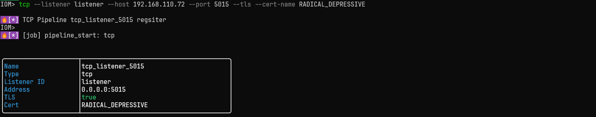

gui:
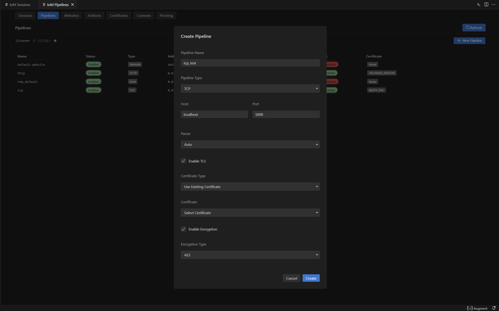
### 新建http
```bash
http --listener listener --host 127.0.0.1 --port 8083
```

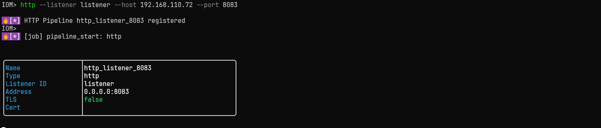

gui:
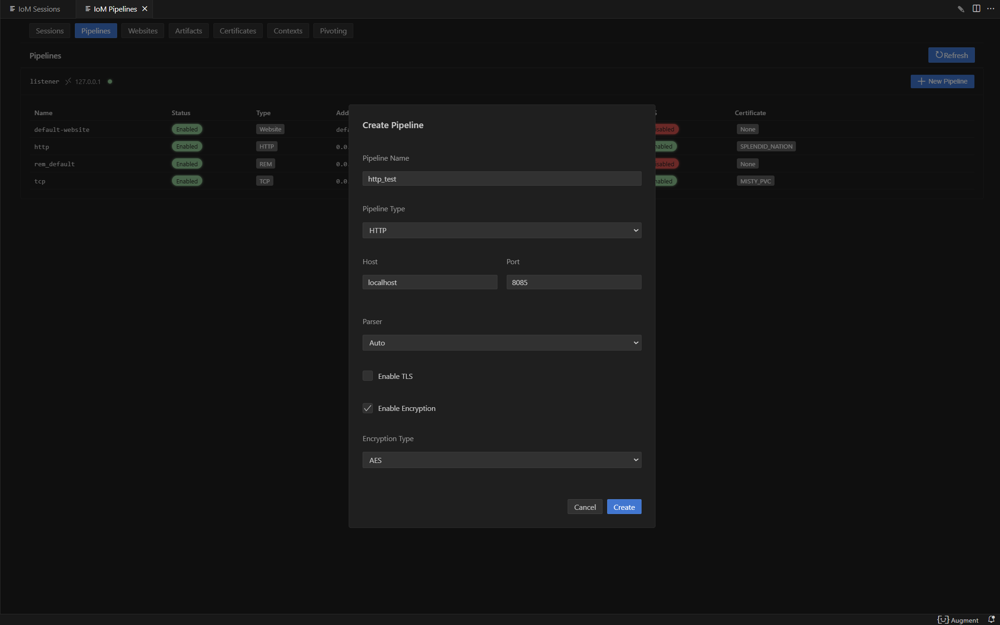
#### 新建http并开启tls
```bash
http --listener listener --host 192.168.110.72 --port 8083 --tls --cert-name DETERMINED_NIECE
```

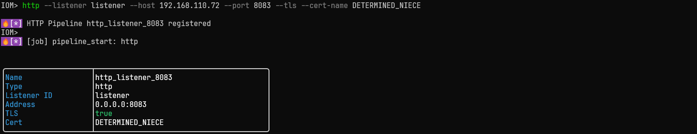
gui:
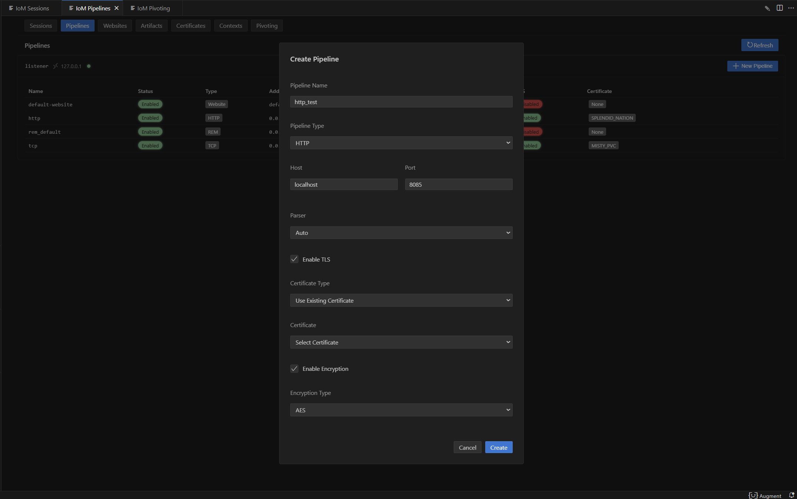

### 新建rem
```bash
rem new rem_test --listener listener  -c tcp://127.0.0.1:19966
```


### 新建website
```bash
website web-test --listener listener --port 5080 --root /web
```

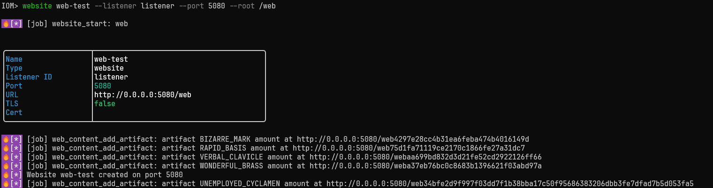
gui:
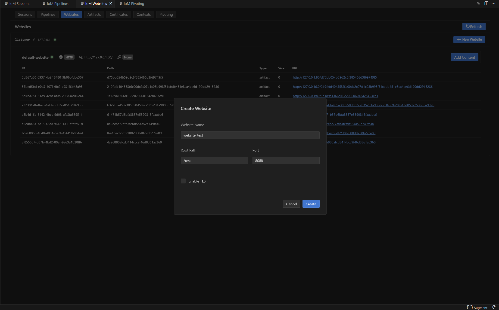
###  新建website并开启tls
```bash
website web-test --listener listener --port 5080 --root /web --tls --cert-name GOOD_BEETLE
```

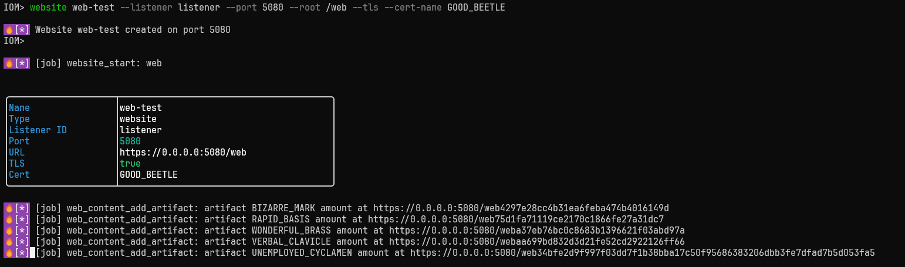
gui:
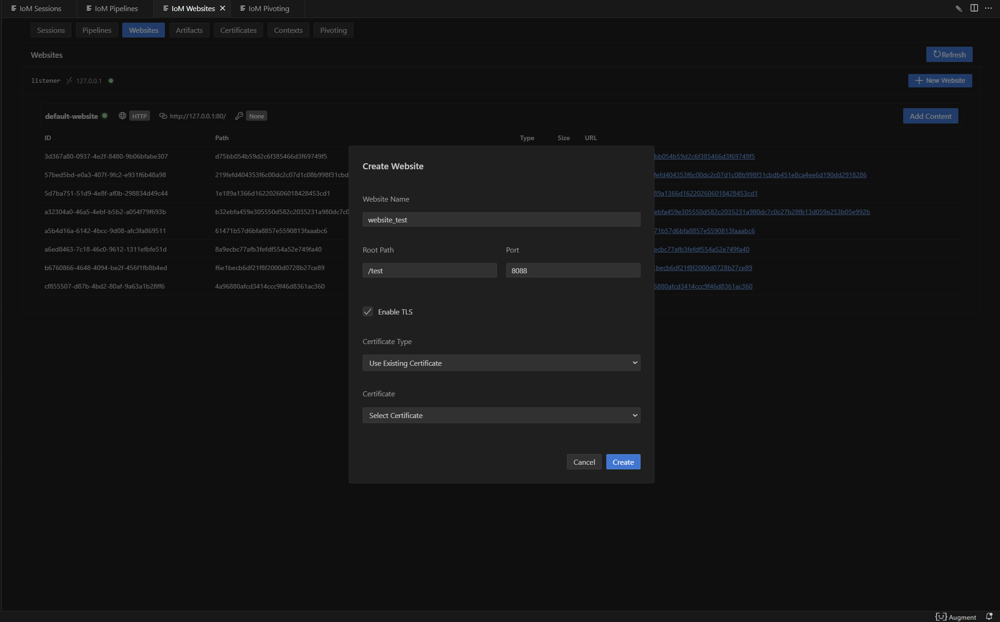
### 在对应website上传文件
```bash
website add /path/to/file --website web-test --path /path
```

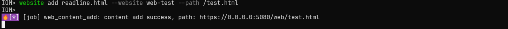
gui:
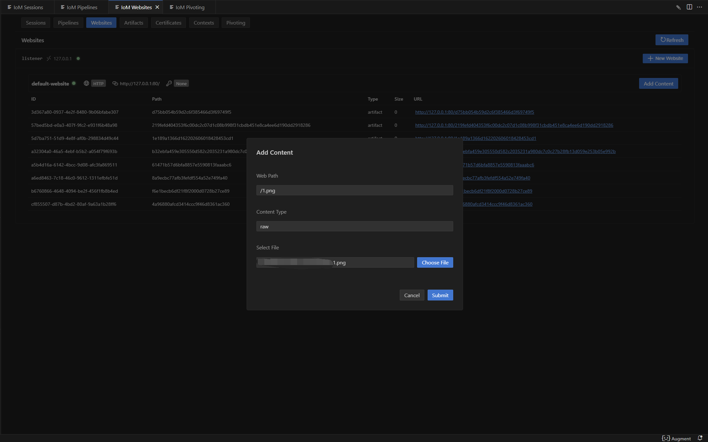
## 高级功能
### 证书管理
当前证书管理支持通过多种方式配置证书。

- 随机生成自签名证书
- 指定参数生成自签名证书
- 导入已有证书
#### 通过config配置证书
目前config.yaml主要由TLS的相关配置来控制证书。具体TLS配置如下:
```yaml
tls:  
  enable: true                    # 启用TLS加密传输
  # 自签名证书配置
  CN: "test"                      # 证书通用名称(Common Name)，通常为域名或IP地址
  O: "Sharp Depth"                # 证书组织名称(Organization)
  C: "US"                         # 证书国家代码(Country)，使用ISO 3166-1标准
  L: "Houston"                    # 证书地区/城市名称(Locality)
  OU: "Persistent Housework, Limited"  # 证书组织单位名称(Organizational Unit)
  ST: "State of Texas"            # 证书州/省名称(State/Province)

  # 导入证书配置
  cert_file: path\to\cert         # 证书文件路径，支持PEM格式的证书文件
  key_file: path\to\key           # 私钥文件路径，支持PEM格式的私钥文件
  ca_file: path\to\ca             # CA证书文件路径(可选)，用于验证客户端证书的CA证书
```

#### 自签名证书：

自签名证书配置如下，只需要将config.yaml中需要对应pipeline的tls的 `enable` 设为true。

```yaml
tcp:  
  - name: tcp  
    enable: true  
    port: 5001  
    host: 0.0.0.0  
    protocol: tcp  
    parser: auto  
    tls:  
      enable: true  
    encryption:  
      - enable: true  
        type: aes  
        key: maliceofinternal  
      - enable: true  
        type: xor  
        key: maliceofinternal
```

如果有自己的证书生成信息，可按以下配置填写:
```yaml
tcp:  
  - name: tcp  
    enable: true  
    port: 5001  
    host: 0.0.0.0  
    protocol: tcp  
    parser: auto  
    tls:  
	  enable: true
      CN: "test"
      O: "Sharp Depth"
      C: "US"
      L: "Houston"
      OU: "Persistent Housework, Limited"
      ST: "State of Texas"  
    encryption:  
      - enable: true  
        type: aes  
        key: maliceofinternal  
      - enable: true 
	    type: xor
		key: maliceofinternal
```
#### 导入已有证书

导入证书配置如下：
```yaml
tcp:  
  - name: tcp  
    enable: true  
    port: 5001  
    host: 0.0.0.0  
    protocol: tcp  
    parser: auto  
    tls:  
      enable: true  
      cert_file: path\to\cert  
      key_file: path\to\key  
      ca_file: path\to\ca    (非必须填写)
    encryption:  
      - enable: true  
        type: aes  
        key: maliceofinternal  
      - enable: true  
        type: xor  
        key: maliceofinternal
```

#### client配置证书
启动listener之后，可以给已有的pipeline使用新的证书，使用新的证书前，需要保证服务器已经存储了需要的证书。

**添加自签名证书**

```bash
cert self_signed
```


gui:
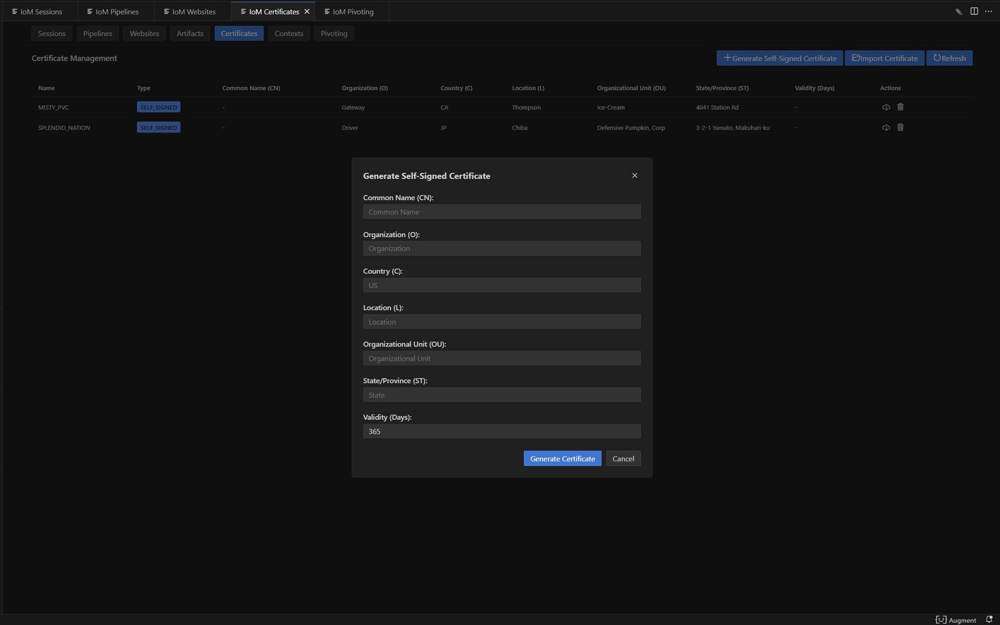
**添加导入证书**
```bash
cert import --cert /path/to/cert --key /path/to/key --ca-cert /path/to/ca
```

 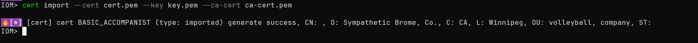
 gui:
 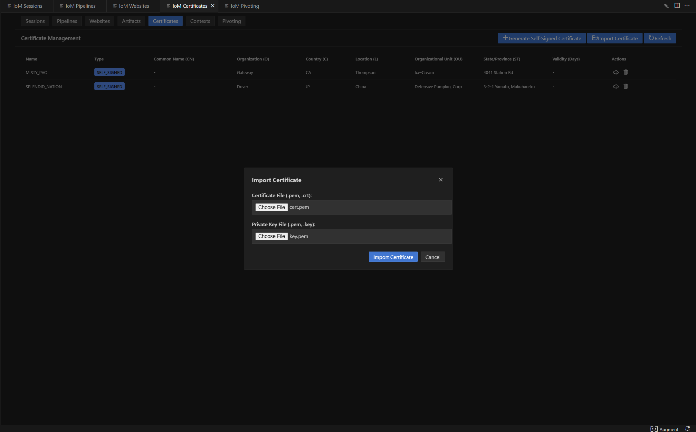
 如果不确认证书信息，可以list证书，来确认是否是需要的证书。

```bash
cert
```


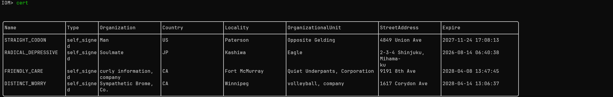
gui:
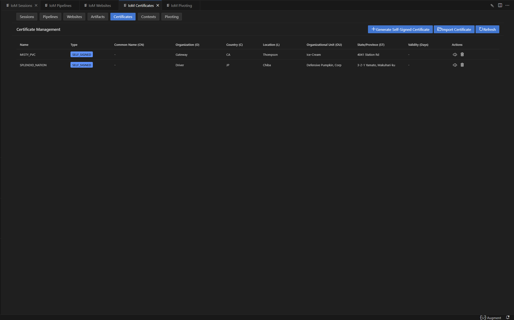
#### 使用指定证书启动pipeline
当服务器已存储所需证书后，可以通过以下命令，将pipeline使用新的证书配置启动。

```bash
pipeline start tcp --cert-name cert-name
```

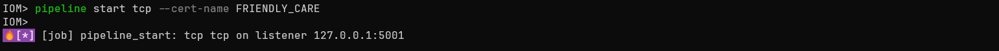

### Parser
parser 协议用来区分对应的 implant 类型，pulse 与 malefic 目前的传输协议略有不同，所以parser当前可设置值为auto/malefic/pulse，如果为auto，则会自动区分pulse和malefic的传输协议。当需要配置一个 pulse 时，需要单独的 parser 配置。以下是pulse配置示例:

```yaml
    - name: shellcode
      port: 5002
      host: 0.0.0.0
      parser: pulse    # 对应malefic-pulse上线
      enable: true
      encryption:
        enable: true
        type: xor
        key: maliceofinternal
```
### Encryption
encryption用于配置 /pipeline 与 implant 之间的通信加密协议。  
其作用是对 完整数据包进行加密/解密，从而避免明文传输被检测或篡改。
目前支持的加密算法：XOR和AES-CFB。

```yaml
      encryption:
        - enable: true               # 是否启用该加密方式
          type: aes                  # 加密类型 (支持: aes / xor)
          key: maliceofinternal      # 密钥 (implant 需一致)
        - enable: true
          type: xor
          key: maliceofinternal  
```

### http自定义响应内容

http pipeline可以自定义配置对应的响应内容,可以在config.yaml中配置。
```yaml
 http:	
    - name: http          # http 名字
      enable: true        # http 是否开启
      host: 0.0.0.0       # http 监听的host
      port: 8080          # http 监听的端口
      parser: malefic     # implant协议
      tls:                # tls配置项,留空则自动生成
        enable: true  
        CN: "test"  
        O: "Sharp Depth"  
        C: "US"  
        L: "Houston"  
        OU: "Persistent Housework, Limited"  
        ST: "State of Texas"   
        cert_file: ""  
        key_file: ""  
        ca_file: ""  
      encryption:
        - enable: true
          type: aes
          key: maliceofinternal
        - enable: true
          type: xor
          key: maliceofinternal
      headers:                               # 自定义响应头 (map[string][]string)
        Server: ["nginx/1.22.0"]
        Content-Type: ["text/html; charset=utf-8"]
        Cache-Control: ["no-cache"]
      error_page: "/var/www/error.html"       # 404/500 错误页面路径
      body_prefix: "<!-- prefix marker -->"   # 每个 HTTP 响应 body 前缀内容 
      body_suffix: "<!-- suffix marker -->"   # 每个 HTTP 响应 body 后缀内容
```
- **`headers`**：  
    可以定义多个 HTTP 响应头，例如伪装成 Nginx/Apache，或者返回自定义的 Content-Type。
- **`error_page`**：  
    指定一个文件路径作为错误页面，返回时可替代默认的错误内容。
- **`body_prefix` / `body_suffix`**：  
    在 HTTP 响应体的最前/最后拼接额外内容，用于混淆流量或伪装网页。
### 独立部署listener

从项目设计开始，我们就将listener和server解耦，可以通过启动命令独立部署listener。
```bash
./malice-network --listener-only
```

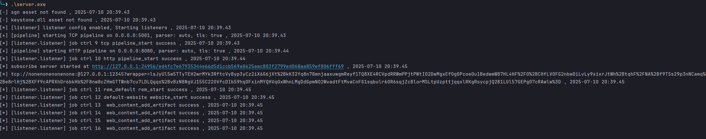
