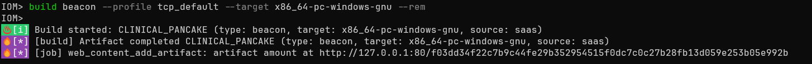
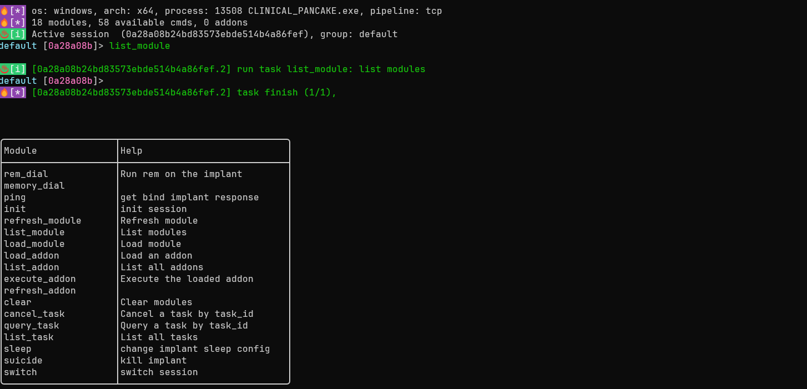
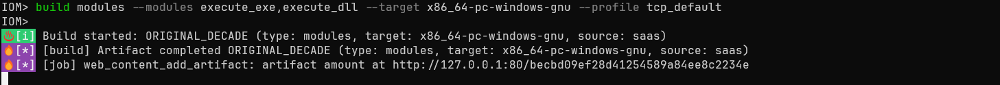
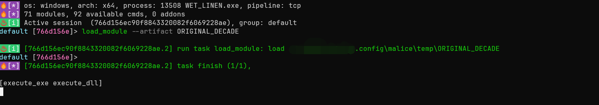
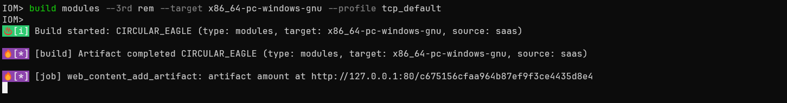
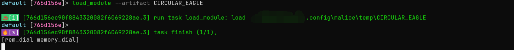
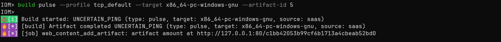
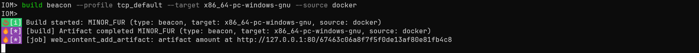
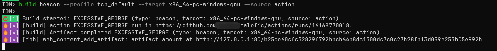
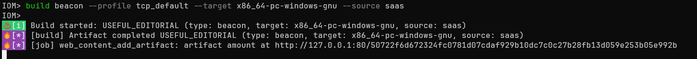

# IoM 用法: Build

目前我们精简了build命令，并支持三种编译方式，分别为docker、action和SaaS编译。本文将主要举例如何在IoM环境下进行编译。

## 编译beacon

``` bash
build beacon --profile beacon_profile --target x86_64-unknown-linux-musl
```


也可以使用 `--rem` ，将beacon静态链接至rem。

```bash
build beacon --profile beacon_profile --target x86_64-unknown-linux-musl --rem
```






## 编译module

目前我们支持编译IoM的插件和第三方插件，使用时必须带上 `--modules` 或 `--3rd` ，来确认所需要编译的插件，否则将无法编译。用法如下：

### 编译IoM插件

```bash
build modules --modules execute_exe,execute_dll --profile module_profile --target x86_64-pc-windows-gnu 
```



通过artifact name加载modules（name可通过tab补全）。

```bash
load_module --artifact artifact-name
```



### 编译第三方插件

目前仅支持ren和curl。

```bash
build modules --3rd rem --profile module_profile --target x86_64-pc-windows-gnu
```



同上，通过artifact name加载modules。





## 编译pulse

```bash
build pulse --profile pulse_profile --target x86_64-pc-windows-gnu 
```


指定beacon进行编译。

```bash
build pulse --profile pulse_profile --target x86_64-pc-windows-gnu --artifact-id 5
```




## docker 编译

``` bash
build beacon --profile beacon_profile --target x86_64-pc-windows-gnu --source docker
```




## github action编译

```
build beacon --profile beacon_profilet --target x86_64-pc-windows-gnu --source action
```




## SaaS 编译

```bash
build beacon --profile beacon_profile --target x86_64-pc-windows-gnu --source saas
```


