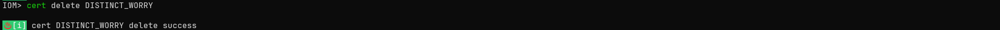

# IoM 用法: Cert

在v0.1.1我们添加了证书管理功能，能够通过命令行显示证书列表，生成证书，删除证书，更新证书。你也可以给pipeline指定证书，重新启动pipeline，使用tls功能。目前我们支持自签名证书和用户自行导入证书。用法如下：

并且在v0.1.1开始，TLS 成为implant的默认选项， 将于cert管理功能深度联动


## config配置证书

### 自签名证书：

自签名证书配置如下，只需要将config.yaml中需要对应pipeline的tls的 `enable` 设为true。


如果有自己的证书生成信息，可按以下配置填写:


### 导入证书

导入证书配置如下：


## 命令行管理证书

### 显示证书

```
cert
```


### 添加证书

```bash
cert self_signed
```


```bash
cert import --cert /path/to/cert --key /path/to/key --ca-cert /path/to/ca
```


### 下载证书

```bash
cert download cert-name —o file-path
```


### 删除证书

```
cert delete cert-name
```



### 更新证书

```bash
cert update cert-name  --cert /path/to/cert --key /path/to/key --ca-cert /path/to/ca
```


## 使用指定证书启动pipeline

```bash
pipeline start pipeline-name --cert-name cert-name
```


