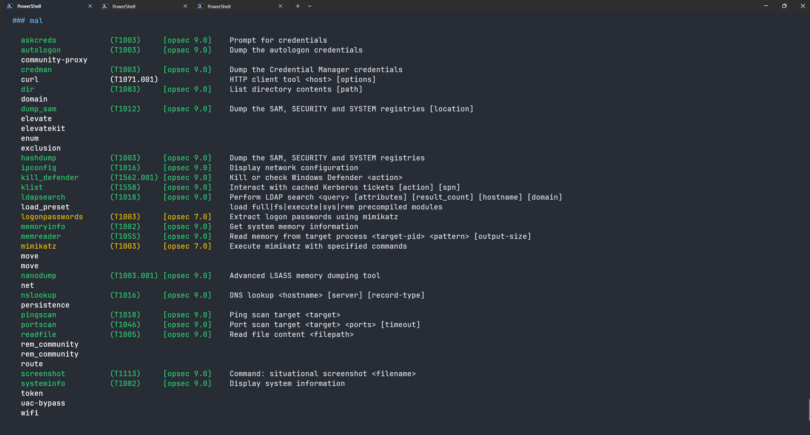
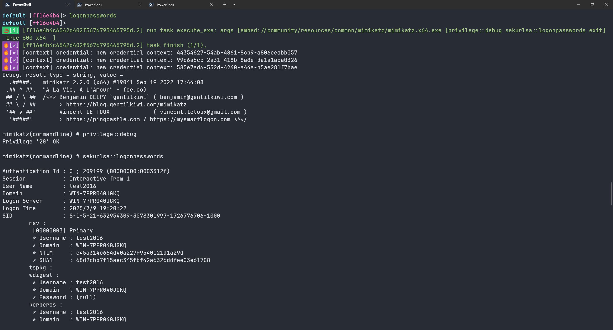
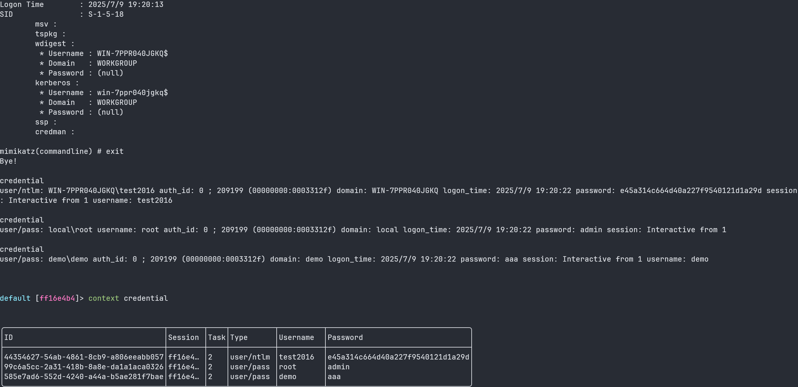
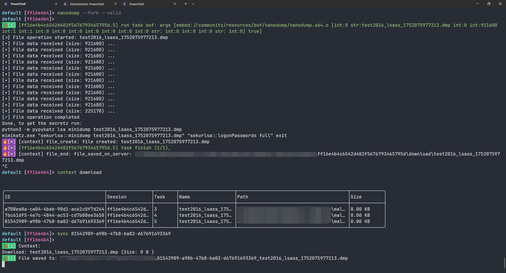
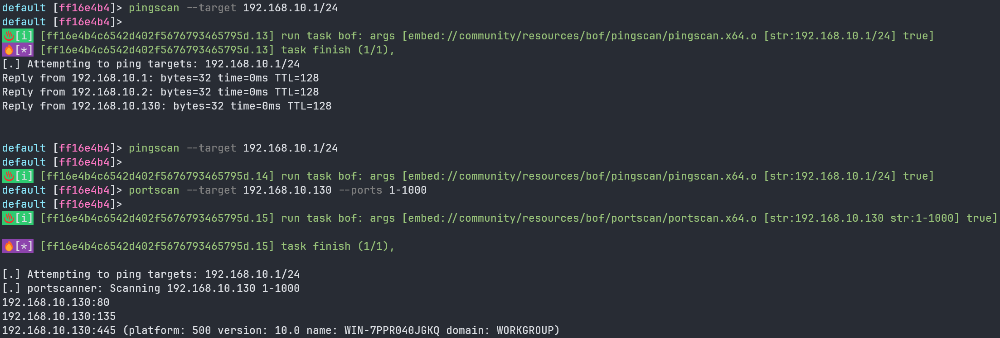
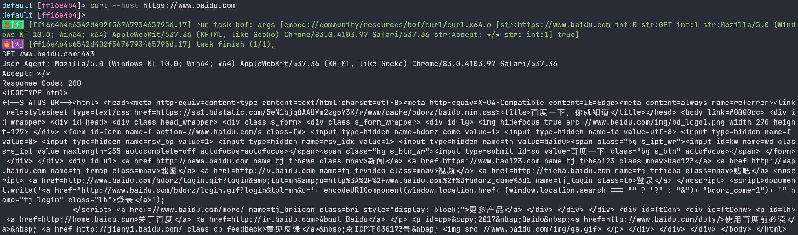
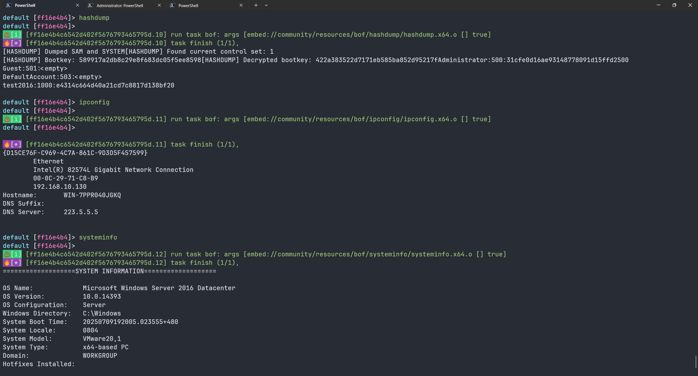
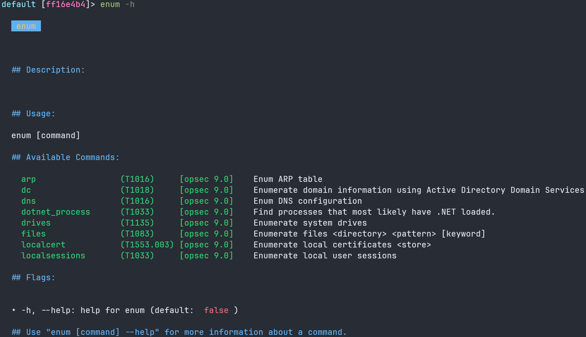

# embed mal

在IoM的v0.1.1中集成了一系列内置的embed功能:


## 用法示例

我们目前包含了一些常见功能：

- **凭据获取**
  - logonpasswords - 提取登录密码
  - hashdump - 转储系统哈希

- **网络工具**
  - curl - HTTP请求工具

- **系统信息**
  - ipconfig - 网络配置信息
  - systeminfo - 系统详细信息


### logonpassowrds
embed通过内置mimikatz实现了logonpassowrds


同时对该命令添加了解析，会在抓取的同时存储到context/credential中


如果你需要一个opsec更高的办法,可以尝试nanodump




### ping/port scan


### curl


### 本地信息收集
如hashdump、ipconfig、route print、systeminfo等


### 分组相关
我们也对功能进行了分组，比如用于枚举信息的enum,用于横向的move,netuser操作,token相关操作等


### 代理功能使用
REM代理工具提供了完整的代理服务管理功能：

#### 基本使用流程
1. **连接代理服务**
   ```
   rem_community connect
   ```

2. **启动代理服务**
   ```
   rem_community run
   ```

3. **启用SOCKS5代理**
   ```
   rem_community socks5
   ```
   - 支持SOCKS5协议代理
   - 符合MITRE ATT&CK T1090技术

4. **查看代理日志**
   ```
   rem_community log
   ```

5. **停止代理服务**
   ```
   rem_community stop
   ```

#### 高级功能
- **fork** - 创建代理进程分叉，提高稳定性
- **load** - 通过rem.dll动态加载代理功能

### 目前实现的功能如下

#### 基础功能

- **凭据相关**
  - askcreds - 请求凭据
  - autologon - 自动登录
  - credman - 凭据管理器
  - logonpasswords - 登录密码提取
  - mimikatz - Mimikatz工具集
  - klist - Kerberos票据列表

- **系统信息收集**
  - hashdump - 哈希转储
  - ipconfig - IP配置信息
  - memoryinfo - 内存信息
  - memreader - 内存读取
  - screenshot - 屏幕截图
  - dump_sam - SAM数据库转储

- **网络工具**
  - curl - HTTP请求工具
  - nslookup - DNS查询
  - ldapsearch - LDAP搜索

- **系统操作**
  - kill_defender - 致盲Defender
  - readfile - 文件读取

#### 分组功能

- **enum（枚举信息）**
  - enum/arp - ARP表枚举
  - enum/dc - 域控制器枚举
  - enum/dns - DNS信息枚举
  - enum/dotnet_process - .NET进程枚举
  - enum/drives - 驱动器枚举
  - enum/files - 文件枚举
  - enum/localcert - 本地证书枚举
  - enum/localsessions - 本地会话枚举

- **exclusion（排除规则）**
  - exclusion/add - 添加排除规则
  - exclusion/delete - 删除排除规则
  - exclusion/enum - 枚举排除规则

- **net/user（网络用户操作）**
  - net/user/add - 添加用户
  - net/user/enum - 枚举用户
  - net/user/query - 查询用户信息

- **token（令牌操作）**
  - token/make - 创建令牌
  - token/steal - 窃取令牌

- **move（横向移动）**
  - move/psexec - PSExec横向移动


- **代理工具**
  - rem_community - REM社区版代理工具
    - connect - 连接到REM代理
    - fork - 分叉REM进程
    - load - 使用rem.dll加载REM
    - log - 获取REM日志信息
    - run - 运行REM代理
    - socks5 - 提供SOCKS5代理服务（T1090）
    - stop - 停止REM代理服务
