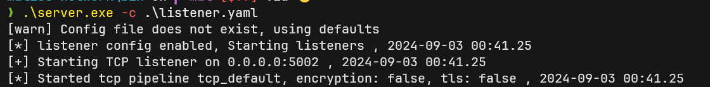
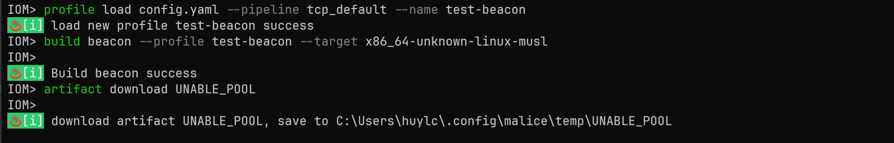
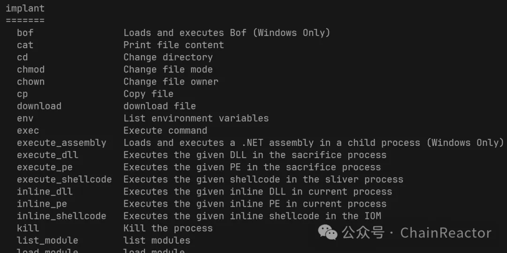

IoM是包含了一组仓库的复杂工具链, 对于用户来说可能会有使用上的挑战. 

**quickstart中将会提供最小使用说明与文档导航**

## 基本使用

### 安装部署

IoM的server与client都是通过golang编写的, 打包成二进制文件后不需要任何的依赖环境, 直接运行即可. 

如果你的服务器于国外部署, 访问github畅通无阻的话可使用如下命令安装
```
curl -L "https://raw.githubusercontent.com/chainreactors/malice-network/master/install.sh" -o install.sh
sudo bash install.sh
```
如果你的服务器位于国内, 我们尽可能的提供了一些加速的配置：docker安装、镜像拉取等, 可以使用如下脚本一键安装
```
curl -L "https://raw.githubusercontent.com/chainreactors/malice-network/master/install-cn.sh" -o install.sh
sudo bash install.sh
```

!!! important "网络问题"
	iom项目releases中的文件仍然需要从github下载, 国内服务器访问 github 容易超时, 建议配置环境变量中的 proxy, 再执行上述操作
	
	可以映射本机的代理端口到vps: ssh -R 1080:127.0.0.1:1080 root@vps.ip

	export http_proxy="http://127.0.0.1:1080"
	
	export https_proxy="http://127.0.0.1:1080"

	如果你的当前用户不是root, 可以使用sudo -E bash install.sh, 以保持环境变量生效
	

!!! important "服务器性能要求"
	自动化编译服务用到了docker, 且rust生成的中间文件体积较大, 对CPU消耗较高. 
	

	因此IoM要搭建自动化编译的服务端对性能有一定要求.
	
	我们推荐在2C4G内存以上的机器运行, 并保留至少30G的空间.
	
	如果只是作为server/listener用途, 对性能没有任何要求.
	
	可以专门找一台服务器当做编译服务器. 后续也会提供这方面的优化.


??? info "(非必要) 自行编译client与server"
	如需自定编译可参照: ([自行编译说明](IoM/deploy/#_6))


安装完成后会自动添加到服务. 

安装脚本自动使用的config为: https://github.com/chainreactors/malice-network/blob/master/server/config.yaml 

如需自定义可以修改config后重启服务

```bash
service malice-network restart
```

!!! important "分离部署listener"
	**在默认配置下, listener和server同时部署, 但IoM更推荐分布式部署listener**
	
	[完整的配置文件说明](/wiki/IoM/manual/deploy/#config)
	
	可以根据自己的需要修改. 


??? info "(非必要)独立运行listener"
	[listener文档](/wiki/IoM/manual/deploy/#listener)
	
	从v0.0.2开始, 我们合并了listener与server两个二进制文件到`malice-network`
	
	需要在[这里获取`listener.yaml`配置文件](https://github.com/chainreactors/malice-network/blob/master/server/listener.yaml)示例
	
	假设是在一台独立的服务器上, 我们需要将上一步骤中会自动生成的`listener.auth`复制到当前目录. 然后执行:
	
	```
	./malice-network -c listener.yaml
	```
	
	
	
	可以看到, 启动了独立的listener, 并与server建立了连接. 


### 运行client

从 https://github.com/chainreactors/malice-network/releases/latest 中获取client相关预编译文件.

**其中`iom_[os]_[arch]`开头的即为client端.**

在上一步操作中, 我们已经运行了server, 并且会发现在当前目录中自动生成了一个新的配置文件, `admin_[ip].auth`. 这个文件是IoM的认证凭证, **请你保护好这个文件.** 

!!! danger "可能需要检查server host"
	如果非本机登录, 需要将其中的 `host: 127.0.0.1` 修改为你的远程服务器地址(后续将会优化这一点)

`./iom admin_[server_ip].auth` 即可使用这个配置文件登录到server.

运行成功会进入到交互式命令, 这里将是操作整个IoM的地方. 


### 编译implant

如果你是通过安装脚本安装的,  那么已经自动安装了完整的编译环境(基于docker).

在本机准备一个malefic的config.yaml, 你可以通过如下方式下载

```
curl https://raw.githubusercontent.com/chainreactors/malefic/master/config.yaml -o malefic.yaml
```

使用client 自动编译:

```bash
# 将config.yaml加载到server
profile load malefic.yaml --pipeline tcp_default --name beacon_profile_name_1 # tcp_default是默认的pipeline
# 开始一个基于beacon_profile_name_1的server端编译
build beacon --profile beacon_profile_name_1 --target x86_64-unknown-linux-musl
# list编译好的二进制文件，可通过tui左、右键和回车下载
artifact list
# 或可执行下载命令
artifact download UNABLE_POOl
```

??? info "自定义malefic的config" 
	在使用client自动编译时,  会自动指定pipeline的address, 如果需要自定义, 可以通过--address修改.
	malefic的config.yaml [详细配置说明](/wiki/implant/mutant)


!!! tips "多按Tab, 大部分输入都可以通过tab自动补全"

图一参考：

图二参考:


??? info "(非必要)其他编译方式"
	我们提供了如下几种方式进行编译：
	
	1. [本地编译](/wiki/IoM/implant/build/#_4)
	2. [Docker 编译(推荐)](/wiki/IoM/implant/build/#docker)	
	3. [Github Action编译环境(暂未做适配)](/wiki/IoM/implant/build/#github-action)
	

编译完整说明手册[implant手册](/wiki/IoM/manual/implant/)

### 操作implant

目标上线后选择合适的session进行操作
```
sessions
```


这个时候输入`help` 将能看到这个session上下文完整可用的命令.

[implant命令手册](/wiki/IoM/manual/implant/)



**Enjoy IoM**


