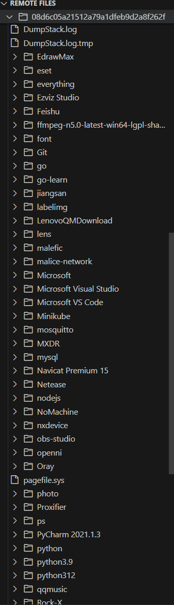

## 文件操作
### 基础文件操作
对目标系统的文件与目录进行管理。

#### 列出目录
```bash
ls [path]
```
列出指定路径的目录内容，包括文件与子目录。

**示例:**
```bash
ls /tmp
```

#### 切换目录
```bash
cd
```
更改当前工作目录，影响后续文件操作的默认路径。

#### 显示当前目录
```bash
pwd
```
显示当前工作目录的绝对路径。

#### 创建目录
```bash
mkdir [path]
```
在指定路径创建新目录。

**示例:**
```bash
mkdir /tmp
```

#### 复制文件
```bash
cp [source] [target]
```
复制文件或目录到目标路径。

**示例:**
```bash
cp /tmp/file.txt /tmp/file2.txt
```

#### 移动文件
```bash
mv [source] [target]
```
移动文件或目录到目标路径（可用于重命名）。

**示例:**
```bash
mv /tmp/file.txt /tmp/file2.txt
```

#### 删除文件
```bash
rm [file]
```
删除指定文件或目录。

**示例:**
```bash
rm /tmp/file.txt
```

#### 查看文件内容
```bash
cat [implant_file]
```
显示指定文件的内容。

**示例:**
```bash
cat file.txt
```

#### 修改文件权限
```bash
chmod [file] [mode]
```
修改文件或目录的权限（适用于类Unix系统）。

**示例:**
```bash
chmod ./file.txt 644
```

#### 修改文件所有者
```bash
chown [file] [user] [flags]
```
修改文件或目录的所有者（适用于类Unix系统）。

**选项:**

- `-g, --gid string`: 组ID
    
- `-r, --recursive`: 递归修改子目录与文件

**示例:**
```bash
chown user ./file.txt
```

### 文件传输
在本地与目标系统之间传输文件。

#### 上传文件
```bash
upload [local] [remote] [flags]
```
将本地文件上传到目标系统的指定路径。

**选项:**

- `--hidden`: 上传后将文件设置为隐藏属性
    
- `--priv string`: 文件权限（默认0644，适用于类Unix系统）

**示例:**
```bash
upload ./file.txt /tmp/file.txt
```

#### 下载文件
```bash
download [implant_file]
```
从目标系统下载指定文件到本地。

**示例:**
```bash
download ./file.txt
```

在gui中，左侧显示栏显示了Remote Files，是当前会话上的远程文件夹和远程文件显示。




你可以右击一个文件夹，上传文件或者刷新文件。


也可以右击一个文件，删除文件或下载该文件。


### 命名管道管理
`pipe` 命令用于管理 Windows 系统的命名管道（Named Pipes），支持从管道读取数据、向管道上传文件内容等操作，可用于进程间通信（IPC）或隐蔽数据传输。

```bash
pipe [子命令]
```
支持的子命令包括：

- `pipe read`：从指定命名管道读取数据
    
- `pipe upload`：将文件内容上传到指定命名管道
#### pipe read
从目标系统的指定命名管道中读取数据，获取管道内传输的内容（如进程间交互数据、日志信息等）。
**命令格式** ：
```bash
pipe read [管道名称]
```

**示例** ：  
读取系统中名为 `\\.\pipe\test_pipe` 的命名管道数据：
```bash
pipe read \\.\pipe\test_pipe
```
执行后，Implant 会持续监听该管道，将读取到的数据实时回显到控制台；若管道无数据传输，会等待直至管道关闭或超时。
#### pipe upload
将目标系统中指定文件的内容，上传到命名管道中，供监听该管道的进程读取（如实现隐蔽数据共享、进程间数据投喂等场景）。
```bash
pipe upload [管道名称] [文件路径]
```

**示例** ：  
将 `C:\Temp\data.bin` 文件的内容上传到 `\\.\pipe\test_pipe` 命名管道：
```bash
pipe upload \\.\pipe\test_pipe C:\\Temp\\data.bin
```
执行后，Implant 会读取文件内容并写入管道，传输完成后返回“上传成功”或“传输失败”的状态提示。

