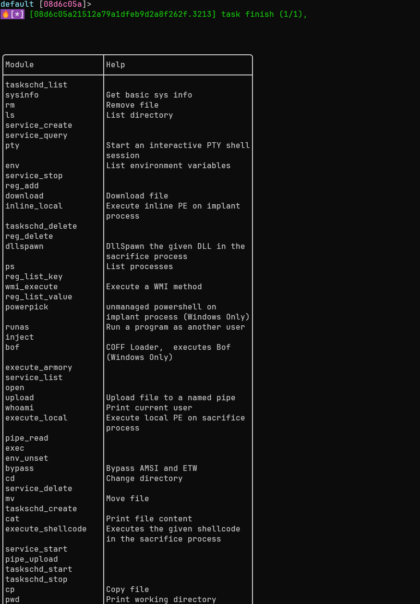

## 模块管理
### 模块操作
通过加载模块扩展Implant的功能，按需启用特定后渗透能力。

#### 列出模块
```bash
list_module
```
显示当前已加载的所有功能模块，包括模块名称、功能描述等信息。

#### 加载模块
```bash
load_module [module_file] [flags]
```
加载新的功能模块，扩展Implant的操作能力。


- 以下选项中至少需要指定一个。
    
- `--artifact`、`--modules`、`--3rd` 三类选项均通过服务端获取模块，其中：
    
    - `--artifact` 直接使用服务端已编译好的产物；
        
    - `--modules` 与 `--3rd` 会在请求时由服务端即时编译并下载到客户端加载。
        
- `--path`  提供了额外的本地打包加载方式。


**选项:**

- `--path string`: 模块文件的本地路径
- `--artifact string`: 使用服务端已有的artifact module 加载
- `--bundle string`: 加载指定名称的模块捆绑包
- `--modules string`: 指定模块列表（如 basic,extend）
- `--3rd string`: 加载第三方开发的模块

**示例:**
```bash
# 从指定路径加载模块
load_module --path sys.dll

# 基于服务端已编译好的 artifact 进行加载
load_module --artifact <artifact_name>

# 加载指定模块
load_module --modules execute_dll,sys_full

# 加载第三方插件(目前支持rem和curl)
load_modules --3rd rem

# 查看加载的模块
list_module
```
#### 刷新模块
```bash
refresh_module
```
刷新当前模块列表，同步最新的模块状态（如模块更新或配置变更）。

#### 清除模块
```bash
clear
```
卸载所有已加载的模块，释放资源并恢复Implant的基础功能状态。

### 插件管理
加载可执行文件作为插件，实现重复调用与功能扩展。

#### 加载插件
```bash
load_addon [flags]
```
将可执行文件加载到Implant内存中，供后续重复调用，避免多次传输文件。

**选项:**

- `-n, --name string`: 插件的别名（便于后续调用）
    
- `-m, --module string`: 插件所属的模块类型

**示例:**
```bash
# 使用默认名称加载插件
load_addon gogo.exe
# 指定别名和模块类型
load_addon gogo.exe -n gogo -m execute_exe
```

#### 列出插件
```bash
list_addon [addon]
```
显示所有已加载的插件，包括插件名称、路径、模块类型等信息；指定插件名称时，显示该插件的详细信息。

#### 执行插件
```bash
execute_addon [flags]
```
执行已加载的插件，支持多种安全与隐蔽性配置。

**选项:**

- `-a, --argue string`: 欺骗进程参数（隐藏真实操作意图）
    
- `-b, --block_dll`: 阻止非微软签名的DLL注入到进程中
    
- `--etw`: 禁用ETW（Event Tracing for Windows）跟踪
    
- `-p, --ppid uint32`: 伪造父进程ID（提升隐蔽性）
    
- `-n, --process string`: 自定义执行插件的进程路径
    
- `-q, --quiet`: 禁用输出信息（减少操作痕迹）
    
- `-t, --timeout uint32`: 执行超时时间（单位：秒）

**示例:**
```bash
# 执行不带参数的插件
execute_addon httpx 1.1.1.1
# 执行带参数的插件
execute_addon gogo.exe -- -i 127.0.0.1 -p http
```

!!! danger "执行带参数命令"
    当插件参数以短横线（`-`）开头时，**必须用 `--` 分隔**，否则控制台会误判参数归属，导致插件执行失败或功能异常。

