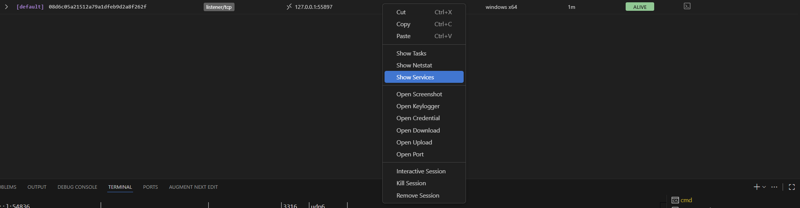
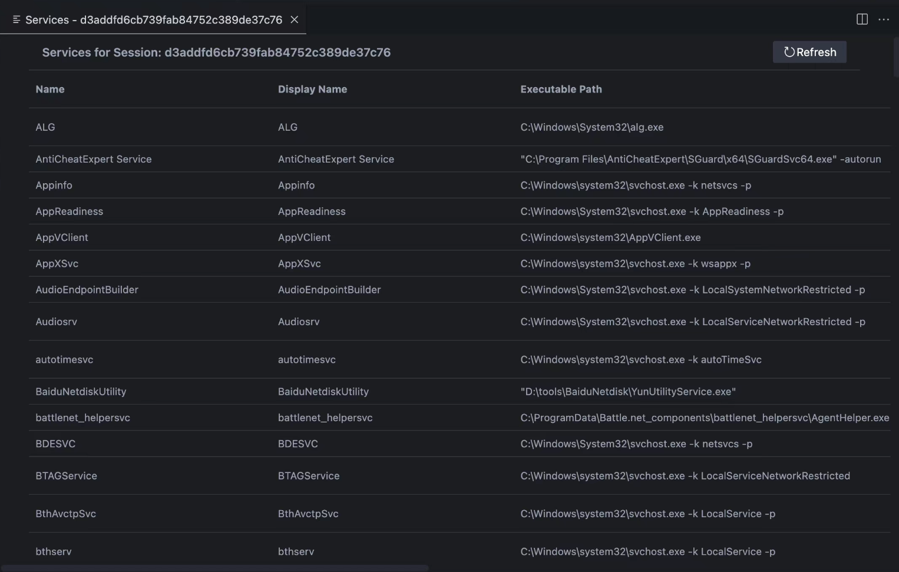

## 服务管理
### 服务操作
`service` 命令用于对目标系统服务进行全生命周期管理，支持创建、查询、启动、停止及删除等操作，适用于 Windows 系统的服务持久化与状态控制。

```bash
service [子命令]
```

支持的子命令包括：

- `service create`：创建新服务
    
- `service delete`：删除指定服务
    
- `service list`：列出所有服务
    
- `service query`：查询服务状态
    
- `service start`：启动服务
    
- `service stop`：停止服务
#### service create

创建新系统服务，可指定服务名称、显示名称、执行路径、启动类型等参数。

```bash
service create [flags]
```

**示例** ：  
创建一个名为 `updater_service` 的自动启动服务，关联至系统更新程序：
```bash
service create --name updater_service --display "System Auto Updater" --path "C:\Windows\system32\svchost.exe -k netsvcs" --start_type AutoStart --error Normal --account "NT AUTHORITY\SYSTEM"
```

**选项说明** ：  

- `--name string`：服务名称（必填），取值为自定义名称（如 `updater_service`）
    
- `--display string`：服务显示名称，取值为描述性名称（如 "System Auto Updater"）
    
- `--path string`：可执行文件路径（必填），取值为服务关联的程序路径（如 `C:\path\to\service.exe`）
    
- `--start_type string`：启动类型（默认 `AutoStart`），取值范围包括 `BootStart`（引导启动）、`SystemStart`（系统启动）、`AutoStart`（自动启动）、`DemandStart`（手动启动）、`Disabled`（禁用）
    
- `--error string`：错误控制级别（默认 `Normal`），取值范围包括 `Ignore`（忽略错误）、`Normal`（记录错误）、`Severe`（严重错误）、`Critical`（致命错误）
    
- `--account string`：运行账户（默认 `LocalSystem`），取值包括 `LocalSystem`（本地系统）、`NetworkService`（网络服务）、`NT AUTHORITY\SYSTEM` 等。
#### service delete
永久删除指定服务，从系统中移除服务配置。
```bash
service delete [服务名称]
```
**示例** ：  
删除名为 `updater_service` 的服务：
```bash
service delete updater_service
```
#### service list
列出系统中所有服务的详细信息，包括名称、显示名称、启动类型、当前状态等。
```bash
service list
```
#### service query
查询指定服务的配置与状态（如启动类型、运行状态、执行路径等）。
```bash
service query [服务名称]
```

**示例** ：  
查询 Windows 更新服务（`wuauserv`）的状态：
```bash
service query wuauserv
```
#### service start
启动指定服务，使其进入运行状态。
```bash
service start [服务名称]
```
**示例** ：  
启动远程桌面服务（`TermService`）：
```bash
service start TermService
```
#### service stop
停止指定的运行中服务，暂停其功能。

```bash
service stop [服务名称]
```

**示例** ：  
停止文件共享服务（`lanmanserver`）：
```bash
service stop lanmanserver
```

您可以在gui中，您可以右击对应session，点击Show Services按钮。点击后，在右侧会显示目标系统的服务信息。




### 计划任务管理
`taskschd` 命令用于管理 Windows 系统的计划任务，支持创建、查询、启动、停止、删除及立即执行等操作，是实现持久化渗透的重要手段。

```bash
taskschd [子命令]
```
支持的子命令包括：

- `taskschd create`：创建新计划任务
    
- `taskschd delete`：删除指定计划任务
    
- `taskschd list`：列出所有计划任务
    
- `taskschd query`：查询计划任务配置
    
- `taskschd run`：立即执行计划任务
    
- `taskschd start`：启动计划任务
    
- `taskschd stop`：停止运行中的计划任务
#### taskschd create
创建新计划任务，可指定任务名称、执行路径、触发类型及启动时间等参数。
```bash
taskschd create [flags]
```
**示例** ：  
创建一个每日 9 点执行系统检查的计划任务：
```bash
taskschd create --name "DailySystemCheck" --path "C:\Windows\system32\check.exe" --trigger_type Daily --start_boundary "2023-10-10T09:00:00"
```

**选项说明** ：  

- `--name string`：计划任务名称（必填），取值为自定义名称（如 "DailySystemCheck"）
    
- `--path string`：可执行文件路径（必填），取值为任务关联的程序路径（如 `C:\path\to\script.exe`）
    
- `--trigger_type string`：触发类型，取值包括 `Daily`（每日）、`Weekly`（每周）、`Monthly`（每月）等
    
- `--start_boundary string`：启动时间点，格式为 `YYYY-MM-DDTHH:MM:SS`（如 "2023-10-10T09:00:00"）

#### taskschd delete
删除指定的计划任务，从系统中移除任务配置。
```bash
taskschd delete [任务名称]
```

**示例** ：  
删除名为 "DailySystemCheck" 的计划任务：
```bash
taskschd delete DailySystemCheck
```

#### taskschd list
列出系统中所有计划任务的基本信息，包括任务名称、状态、触发方式等。
```bash
taskschd list
```

**示例** ：  
查看所有计划任务（包含系统默认任务如 "WindowsUpdate" 等）：
```bash
taskschd list
```
#### taskschd query
查询指定计划任务的详细配置，包括执行路径、触发条件、运行状态等。
```bash
taskschd query [任务名称]
```

**示例** ：  
查询 "WindowsUpdate" 计划任务的配置：
```bash
taskschd query WindowsUpdate
```

#### taskschd run
立即执行指定的计划任务，无需等待触发时间。

```bash
taskschd run [任务名称]
```

**示例** ：  
立即执行 "DailySystemCheck" 计划任务：
```bash
taskschd run DailySystemCheck
```

#### taskschd start
启动计划任务，使其按配置的触发条件运行。
```bash
taskschd start [任务名称]
```

**示例** ：  
启动 "WeeklyBackup" 计划任务：
```bash
taskschd start WeeklyBackup
```

#### taskschd stop
停止正在运行的计划任务，终止其当前执行过程。
```bash
taskschd stop [任务名称]
```

**示例** ：  
停止正在运行的 "DailySystemCheck" 计划任务：
```bash
taskschd stop DailySystemCheck
```

