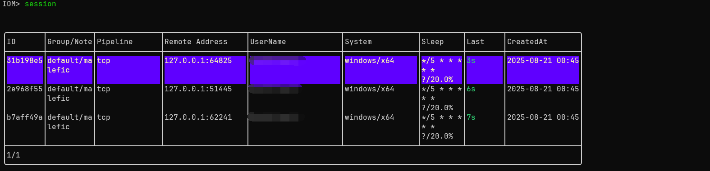
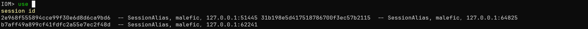
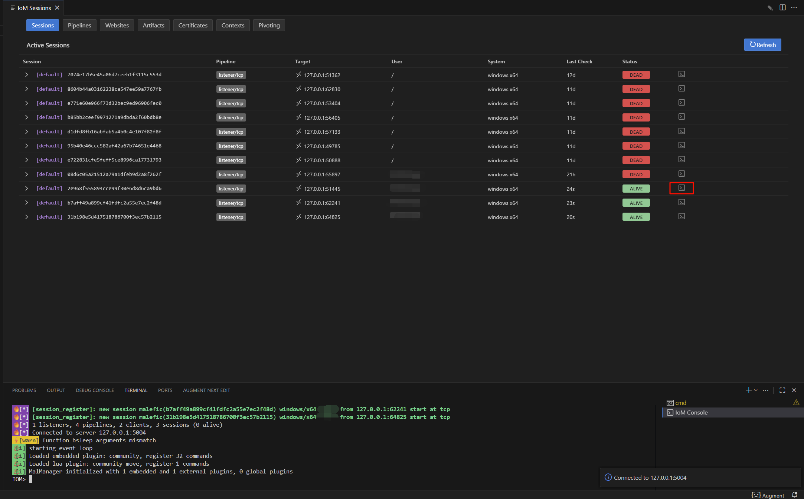
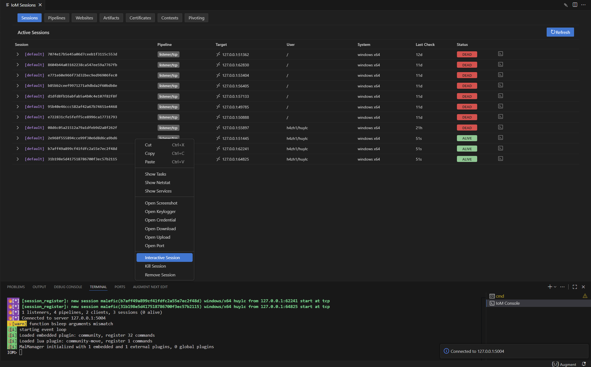
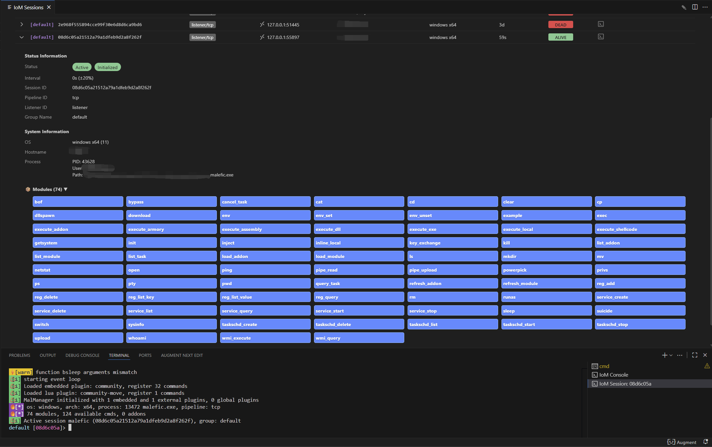
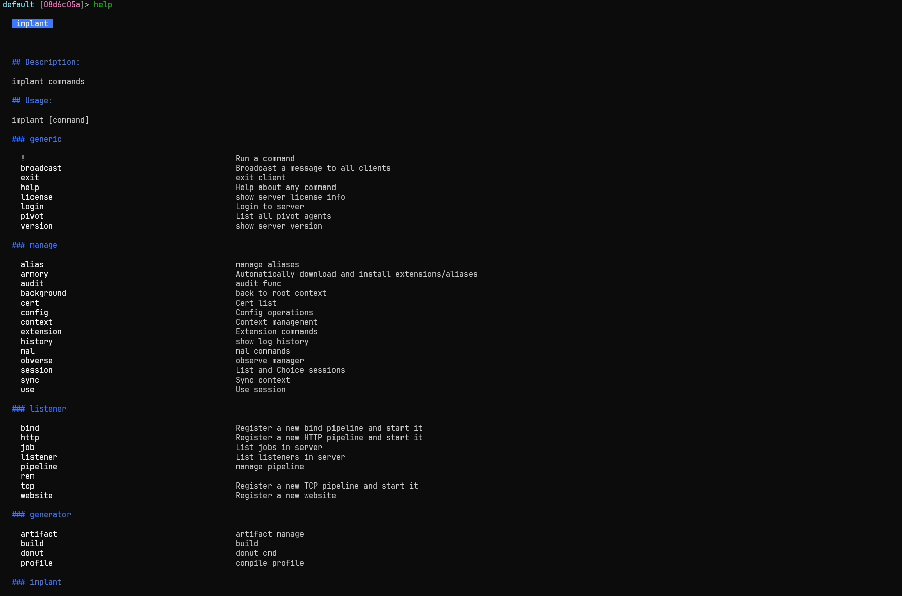
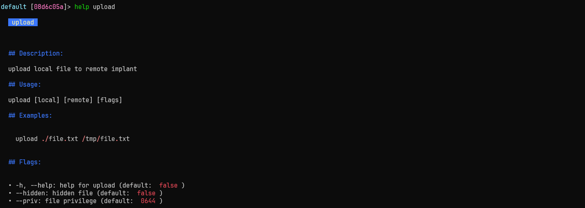

### implant console

Implant 控制台是后渗透阶段与目标会话交互的核心界面，用于下发指令、查看任务状态与接收执行结果，是操作 Implant 的主要入口。

进行后渗透操作之前，首先需要使用 `session` 命令查看需要连接的会话信息，然后选择对应的会话进行连接。

```bash
session
```



也可以使用 `use` 命令连接对应的会话，使用tab键补全时，也可以查看会话信息。

```bash
use [session-id]
```



在gui上，您需要在sessions界面点击对应session的命令行按钮，连接对应的session。也可以右击对应session，点击Interactive Session按钮连接。






控制台会完整呈现会话交互过程：已下发任务及下载时间清晰可查，系统信息、文件列表、权限操作反馈等命令输出实时展示，操作日志与状态信息（如模块加载、进程启动等）也会同步呈现，帮你全面掌握会话动态。  
#### sessions
在 Implant 控制台的输入区与输出区之间，设有状态栏，实时显示当前会话关键信息。结合界面示例，默认包含：  

- **系统基础信息** ：OS（如 `windows x64` ）、Hostname（目标主机名，界面中可对应查看）、Process（进程名与 PID，如 `malfic.exe` 及 `PID:43628` 样式 ）、User（当前会话用户名 ）。  
- **会话核心参数** ：Session ID（会话唯一标识，如 `08d6c05a2152a79a3bde9d3b2a8f26f` ）、Pipeline ID（通信管道标识，如 `tcp` ）、Listener Name（监听器名称，如 `listener` ）、Group Name（分组，如 `default` ）。  
- **连通性状态** ：Implant 与服务端的 check-in 状态（如界面中 `ALIVE` `DEAD` 标识，反映会话活跃度与连通性 ）。  
- **模块列表** ：显示Implant当前已加载的所有功能模块。
#### 控制台命令记录
**命令记录规则** ：无论通过图形界面（点击模块按钮）还是控制台输入下发的命令，都会在控制台窗口留存记录，方便追溯操作历史、排查执行问题（如命令是否下发成功、参数是否正确 ）。  

  

### 查看基础命令列表  
在 IoM 客户端或 GUI 控制台中，您将主要通过命令与 IoM 交互。建议先熟悉常用命令。在控制台中输入 `help` 可查看全部可用命令。
```bash
help
```  
命令执行后，会按功能分类（如文件操作、权限管理、模块加载等 ），结构化列出所有可用命令（类似界面中展示的 `bof` `bypass` `cancel_task` 等模块/命令按钮对应的功能 ），帮你快速定位所需操作。  

### 查看命令详细帮助  
想了解特定命令用法（参数、场景、示例 ），输入：  
```bash
help [命令名称]
```
  


比如，查看 `upload` 命令帮助：  
```bash
help upload
```  
执行后，会展示 `upload` 功能描述、参数要求（本地文件路径、目标路径 ）、使用示例（如 `upload local_file.txt /remote/path/`)。  



## 基础操作

### 会话管理
会话管理是Implant后渗透操作的基础，用于维护与目标系统的连接及切换会话上下文。

#### 查看会话信息
```bash
info
```
显示当前会话的详细信息，包括会话ID、目标主机信息、插件信息等核心数据。

#### 初始化会话
```bash
init
```
初始化当前会话，建立与IoM pipeline的稳定通信链路，确保后续操作的指令能正常下发与回传。

#### 切换会话
```bash
switch
```
在多个活跃的Implant会话间进行切换，切换后所有操作将作用于选中的会话。

#### 恢复会话
```bash
recover
```
尝试恢复因网络波动或目标系统临时故障导致断开的会话连接，减少重新植入的操作成本。

### 心跳与通信
Implant与IoM pipeline的通信机制设计，支持灵活的任务交互与状态同步。

#### 测试连接
```bash
ping
```
测试与bind implant的网络连接状态，验证链路的可达性。

#### 轮询任务状态
```bash
polling [flags]
```
定期检查已下发任务的执行进度与结果，默认间隔为1秒。

**选项:**

- `--interval int`: 自定义轮询间隔（单位：秒）

#### 等待任务完成
```bash
wait [task_id1] [task_id2] [flags]
```
阻塞等待指定task ID的任务执行完成，适用于需要依赖前序任务结果的操作场景。

**选项:**

- `--interval int`: 检查任务状态的间隔（默认1秒）

### 配置管理
通过配置调整Implant的运行参数，优化隐蔽性与稳定性。

#### 修改睡眠配置
```bash
sleep [interval/second] [flags]
```
调整Implant的睡眠间隔（单位：秒），控制与C2服务器的通信频率，平衡隐蔽性与响应速度。

**选项:**

- `--jitter float`: 抖动值（百分比），使睡眠间隔随机化，避免固定周期的流量特征

#### 自毁
```bash
suicide
```
终止当前Implant进程。

