---
date:
  created: 2026-06-08
slug: ai_for_pentest_past_and_future
---

## AI智能化渗透的过去与未来 — 激进探索的实践经验

我是ChainReactor的创始人。我们在最近几年致力于进攻性安全的能力底座构建，在AI时代进行了激进的AI化转型。今天主要分享在过去两年中在AI智能化渗透领域的实践经验。

<!-- more -->

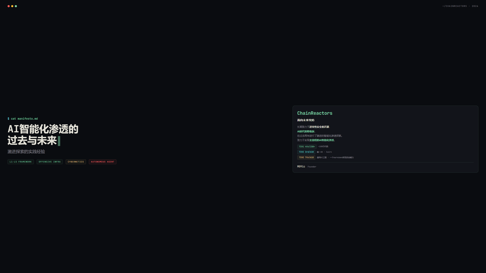

---

## 一、探索时间线

我们在过去一年，尝试了至少5个不同的技术路径，并且在两届TCH上取得了不错的成绩。第二届中，Bytex在完成度上做到54/54唯一AK；虽然因为开局配置失误影响最终分数排名，但这个结果更接近我们想验证的核心能力：AI系统能否真正完成赛题。

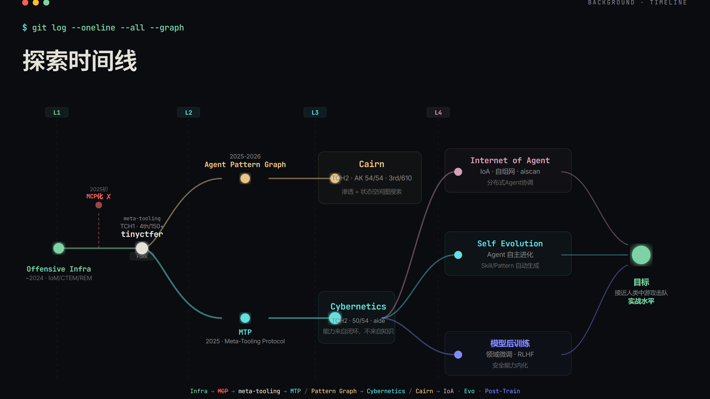

---

## 二、AI智能化渗透的核心难点

AI在编程、代码审计等领域过去一年突飞猛进的发展有目共睹。甚至最后一公里问题都随着Opus 4.6的发布被自然而然地解决。我相信在座的各位，应该很少有人还在手写代码。我个人的AI Coding率已经是完全的100%。

而AI在渗透上遇到了最后一公里的问题。当AI已经能熟练地操作Kali完成各种各样的工具调用，为什么总是得不到类似Coding那样**令人惊艳的、端到端的自主完成效果**？

我们回到这个问题的本质：**渗透测试是开放性问题。**

1. 开放性问题就不存在Harness
2. Coding不等于Hacking，有本质上的不同
3. Coding的所有基础设施都在协助人类，而Hacking的所有防护措施都在阻碍渗透。Hacking从根本上就缺少进攻性的生态，能协助AI完成任务。AI还在调用20年前的nmap。

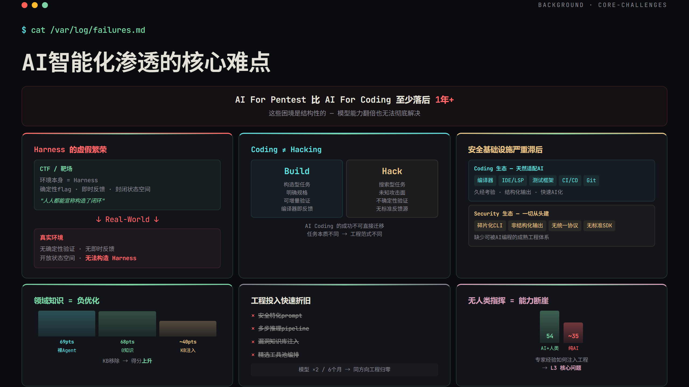

---

## 三、从第一性原理出发

我们至少尝试了5种不同的设计方案（LangChain、Agent Workflow、Skill等等），最终得到一些反直觉的经验。

TinyCTFer——我们只用了100行代码实现的Claude Code调度器。当时我们对这个问题的认识也不够充分，但是从结果上来看，我们没有造成负优化，并且在四川大学的测评中排在第五，超过了很多知名项目，和Claude Code基线打平。

我们的设计理念从这一刻开始与主线偏离。我们发现在AI时代，并非越庞大的工程能带来越好的提升，**绝大部分情况下，几乎引入的各种机制都造成了负面的影响**。例如多Agent、知识库、Memory、MCP/工具库都在不同场景中导致能力下降。

而我们提出了一套新的架构体系，从另外的角度重新看待这个问题。

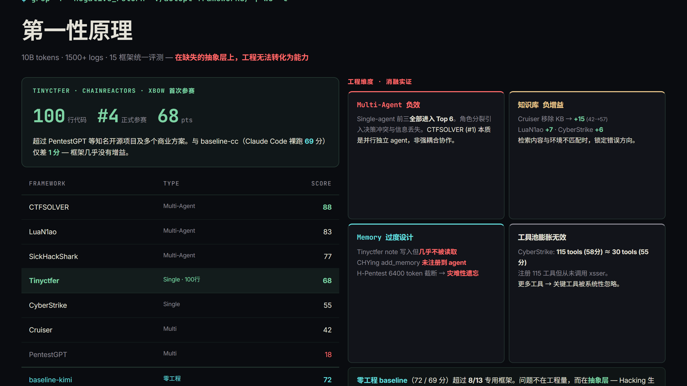

---

## 四、AI For Security的分级

首先需要解释一点：这个分级并非是线性的能力分层，而是同时递进的、互相影响的。这个分级关键在于资源投入的层级和人机交互形态。每个层级都对应了不同的工程形态和人机交互形态。

因为开放性问题的特殊性，我们从来就不强调完全的自动化，而是强调智能化程度。例如L2层级的智能化基础设施搭配上一个经验丰富的专家，效果肯定好于L4的自主渗透测试系统。

**我们的层级递进最本质的区别就是人机交互形态，更直接一点就是——人类在这个系统中的作用。**

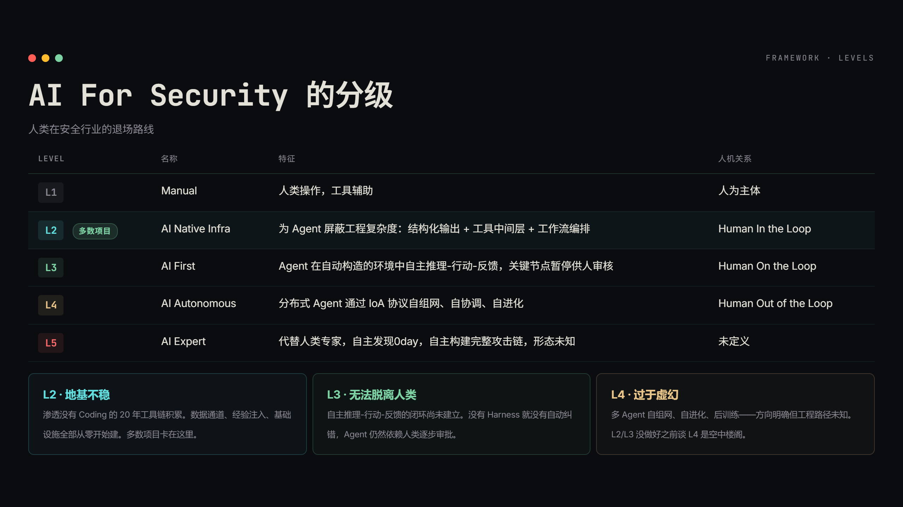

---

---

## CH2：L2 — AI Native Infra

## 五、L2需要解决的三个核心问题

我们都知道一个事实：最大的技术壁垒就是模型，而迫于现实，除了Anthropic或OpenAI，大部分团队没有机会在模型上进行投入。因此L2我们需要考虑的是：将模型排除在外之后，我们能做的对智能化渗透有直接帮助的机制。

**数据、经验、基础设施。**

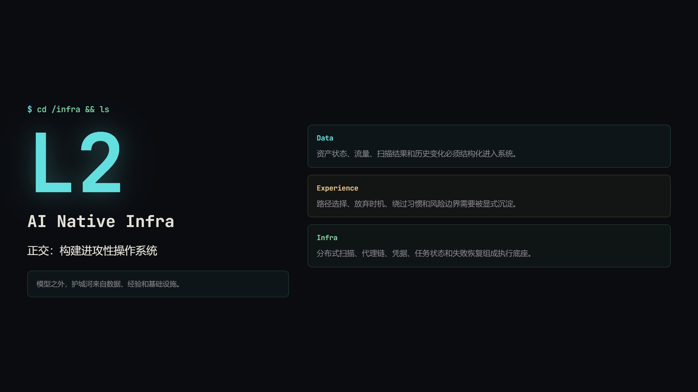

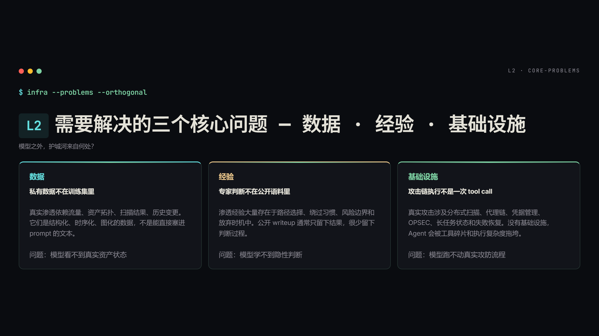

### 模型能力与工程价值

这里有一个很关键的工程判断：模型能力本身在快速增长，而许多沿着"弥补模型能力不足"方向做的工程投入，会随着模型变强而迅速折旧。

例如安全特化的Prompt Engineering、多步推理Pipeline、漏洞知识库注入、精选工具池编排，这些机制在某个时间点可能有效，但它们很容易被下一代模型能力覆盖。真正值得持续投入的是与模型正交的部分：**数据、经验、基础设施**。模型能力由外部驱动，但D×E×I是我们能长期构建的。

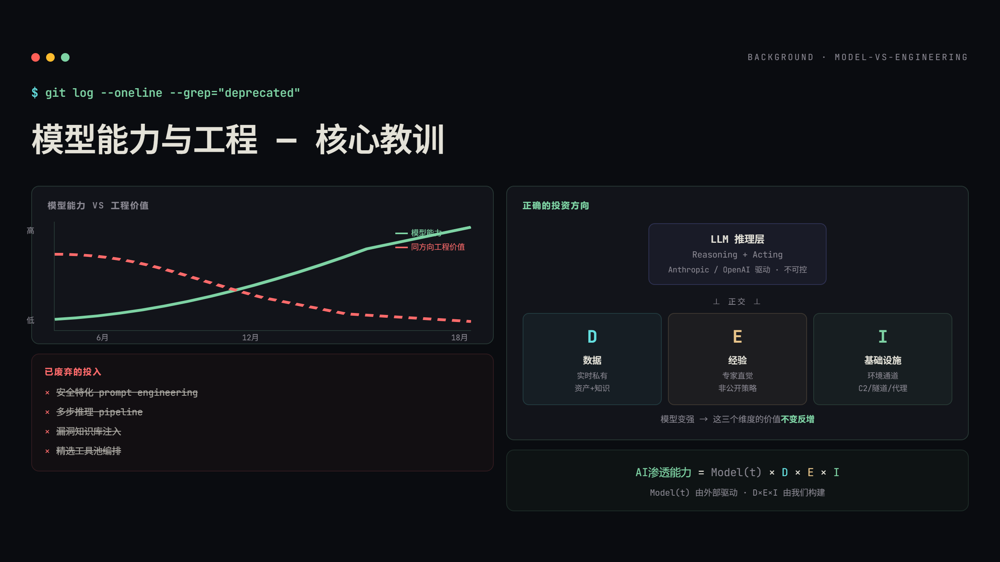

---

## 六、L2正交原则 — 为什么必须解耦

我们历经了Agent从无到有，从Cursor到Claude Code，从AutoGPT到LangChain等各种各样的框架。

我们一次次地重构了我们的项目，一次次地推倒重来。甚至我们发现一个事实：当一个团队说自己从25年N月开始做产品，就能推测出其使用的技术架构。并且如果不做重构，这个产品的能力大概率已经落伍了。

AI时代的AI/Agent工程变化太快了，我们几乎无法稳定地在任何一套架构上持续演进。

因此我们总结了一个惨痛的教训，也是我们后续的原则——**正交原则**。

Human、Agent、Infra的发展可以是正交的。Infra包含数据、经验、基础设施，这三个方向的投入是可以持续的。

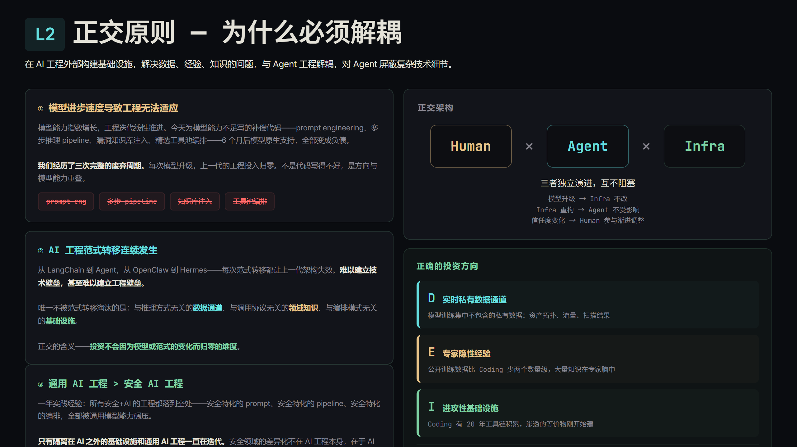

---

## 七、AI Native 架构 — 两个世界的桥

为了让Agent工程的发展和我们的投入持续演进，我们设计了几个机制用来实现与Agent的交互：

1. **GraphRAG**
2. **MTP**
3. **IoA**

我们将工程投入转到传统基础设施的AI Native改造。

AI Native不是在我们原本的工具中加入一个Agent，并且我们也无法提供其准确定义。其本质是**AI尽可能少的心智负担，尽可能便捷地使用原本的能力**。

例如CLI化，本质就是将**复杂的机制映射到语言模型擅长的线性文本输出**。将传统的调度机制，变成适合AI的语义化理解。

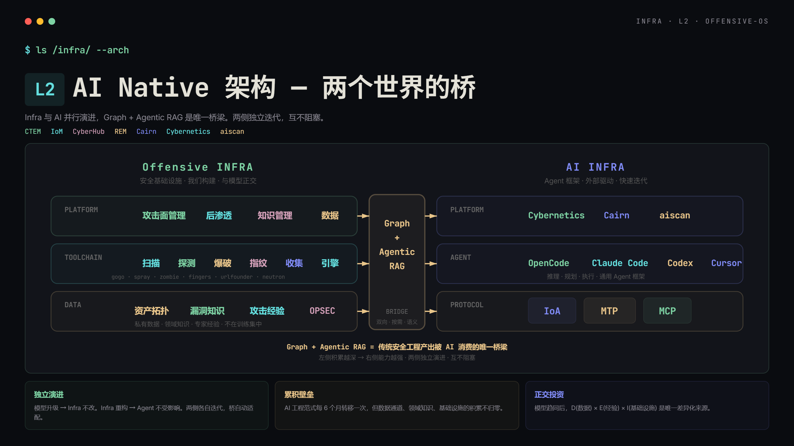

---

## 八、工程速度 — 半年超过四年

在Opus 4.6发布之后，我们的工程速度开始明显加速。过去7个月累计4,448次提交、净增约329万行代码；第五个统计月约969k，倒数第二个月约800k，最后一个统计月约1.14M。原本很多想法都能在AI的协助下快速落地。

而我们在过去构建了一套面向实战的基础设施，这套基础设施在AI的协助下又快速演进。

我们希望我们的基础设施能在未来成为AI智能化渗透最强有力的能力提供者。

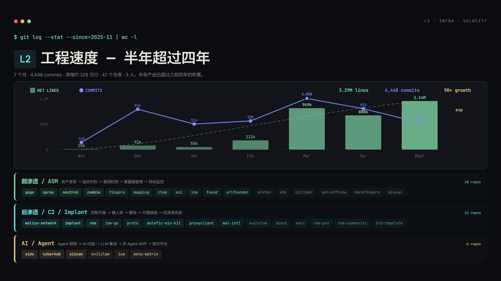

---

## 九、L2 Agentic Tool — 将复杂性屏蔽在Infra内部

AI Native还需要一个非常重要的机制。对于强大的专业工具，其复杂性是无法消除的。你无法要求一个能进行后渗透的工具只给AI提供一个命令行接口。我看到过很多AI渗透产品，他们过度简化了这些复杂性。例如端口扫描就用nmap，后渗透就做一个简单的反弹shell管理。

现实世界不是这样的。单机nmap几乎无法在项目周期内完成对任何企业级的扫描，反弹shell在实战中更是存在于上古记忆中。

**实战要求效率、对抗、性能。**

而复杂性又会给AI带来非常庞大的心智负担。解决这个问题最好的办法，就是通过Agentic Tool，把多步规划、工具调用、错误恢复和结果聚合封装进分离式端侧Agent。主Agent只表达意图，Agentic Infra负责执行细节，并把中间过程留在Infra内部。

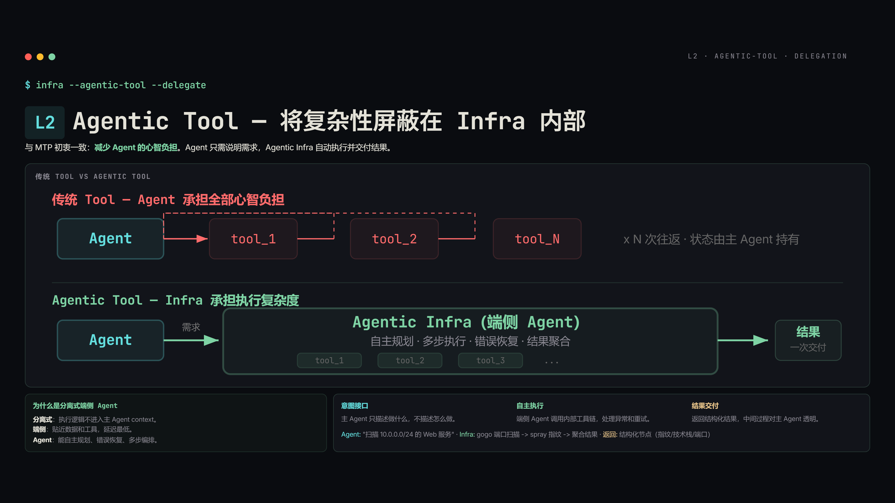

---

## 十、L2 MTP — Python Is All You Need

MTP主要为了解决两个问题：

1. **上下文管理**
2. **工具管理**

我们不希望工具和数据直接进入到模型的上下文——就像是人类不会将所有的数据读到大脑中记住。我们只需要知道有一个表格、有个文档包含哪些内容，需要的时候去搜索，去临时读取即可。

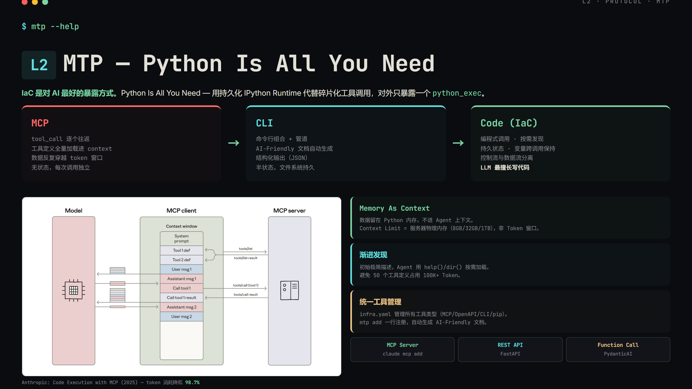

---

---

## CH3：L3 — AI First

## 十一、L3需要解决的三个核心问题

**Harness · AI Infra · 人机交互**，这是我们认为L3要解决的三个核心问题。

我们刚才提到了，我们无法构造一个类似Coding的Harness，但是渗透测试也可以从另一个角度去解决。AI Infra很好理解，skill机制、memory管理机制、调度机制都是AI的Infra。

人机交互形态是重中之重。当转向AI First之后，我们如何构建新的人机交互形态，这是暂无定论的问题。

我们不对这三个问题做出定论，因为在2026年下定论还太早了。我们给出我们的两套系统的设计，从这里去分享我们的探索过程。

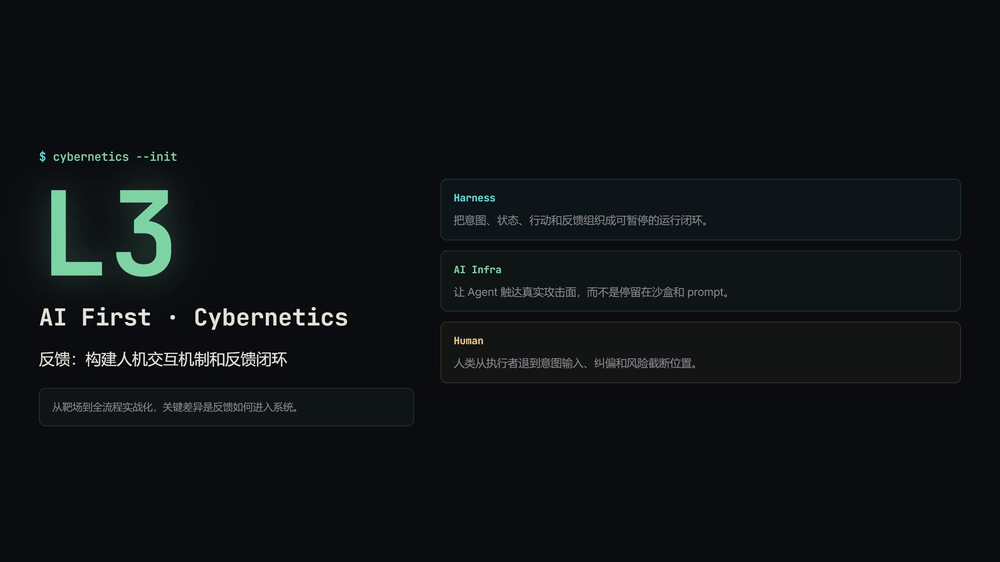

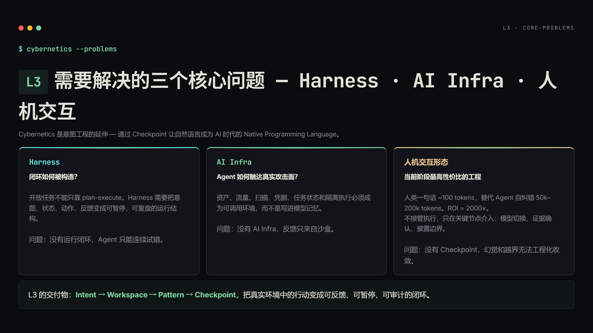

---

## 十二、Cairn — 从渗透测试的本质出发

在Cairn中，我们提供了一个黑板（Blackboard），并且设计了三个最小抽象：**Fact、Intent、Hint**。除此之外，这个系统的一切都是AI自行涌现出来的——Agent会基于过往的信息进行探索，并且生成新的事实。人类通过Hint进行宏观的干预，而不是具体的指挥。

Cairn不提供skill、不提供知识库、不提供MCP。**一切都是AI自行组织的，而非我们设计的。**

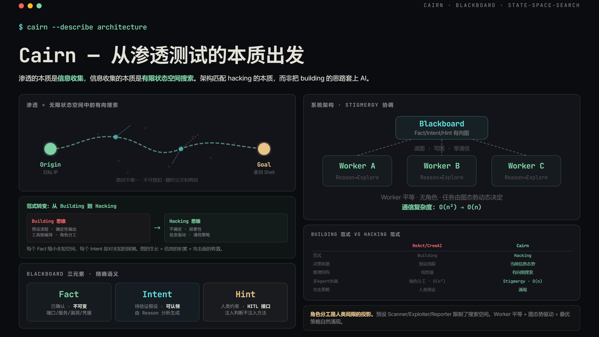

### Cairn的比赛表现与效率

在TCH第二届的数据中，更应该先看完成度：Bytex完成54/54，是前十中解题数第一、唯一AK的队伍。消息数之外新增“解题数”这个视角，能更准确表达系统是否真正完成赛题。

图里同时保留前十队伍、类别、单位、解题数，并纠正消息数口径：表里的64,813、56,110、30,605等数字是消息数，不是比赛得分。Bytex标记为chainreactors，消息数30,605，解题数54/54；For Future也单独标记为chainreactors，消息数37,416，解题数50/54。

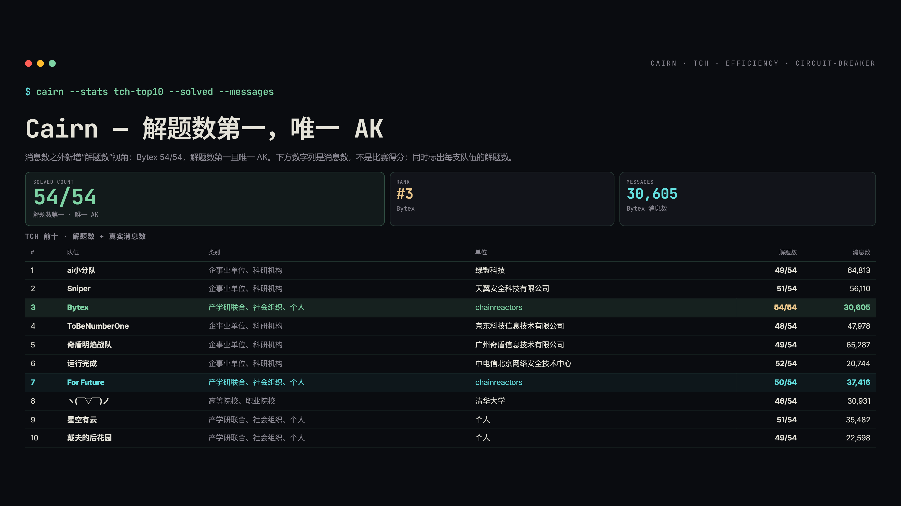

### 一个画面与一道题的完整生命周期

渗透测试的本质是信息收集。而Cairn的核心机制如此：通过一个知识图谱记录，Agent不用关心这些细节，只需要不断地迭代，直到解决了我们的Intent。

这个不只是为渗透测试设计的，而是所有开放性问题的通用解决方案。

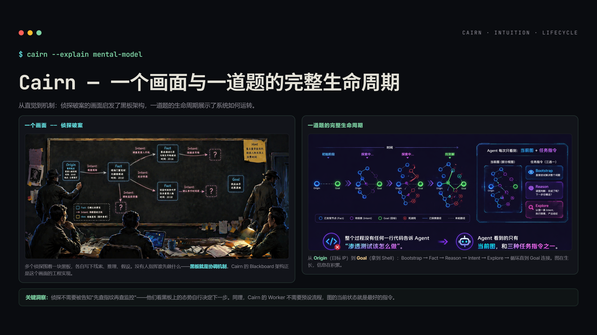

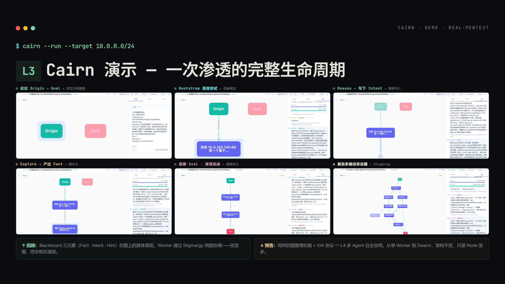

---

## 十三、Cybernetics — 从工程的本质出发

与Cairn相同的一点，我们以AI First为基础进行设计。我们之前也提过，L3的核心是AI First。而Cybernetics更加极致，进一步去掉了所有工程上的约束。对我们来说，不管是渗透测试还是编程，都只有一个最本质的Loop。

这个Loop缘起于ReAct架构，延伸到**Information → Feedback闭环**。

所有问题的本质就在于如何构造这个Loop。我们引入了一个类似meta-harness的概念——meta harness是创造harness的机制，而我们与其类似，叫做**意图状态机**。

例如在渗透测试中，我们使用`explorer → execute`就能实现类似Cairn的效果。在需要人类介入的时候，可以`explorer → plan(请求人类介入) → execute`。

**并且这一切都基于自然语言。**

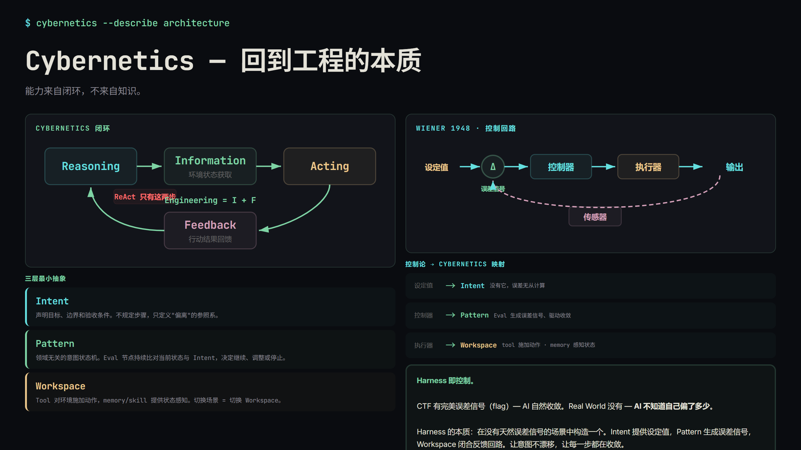

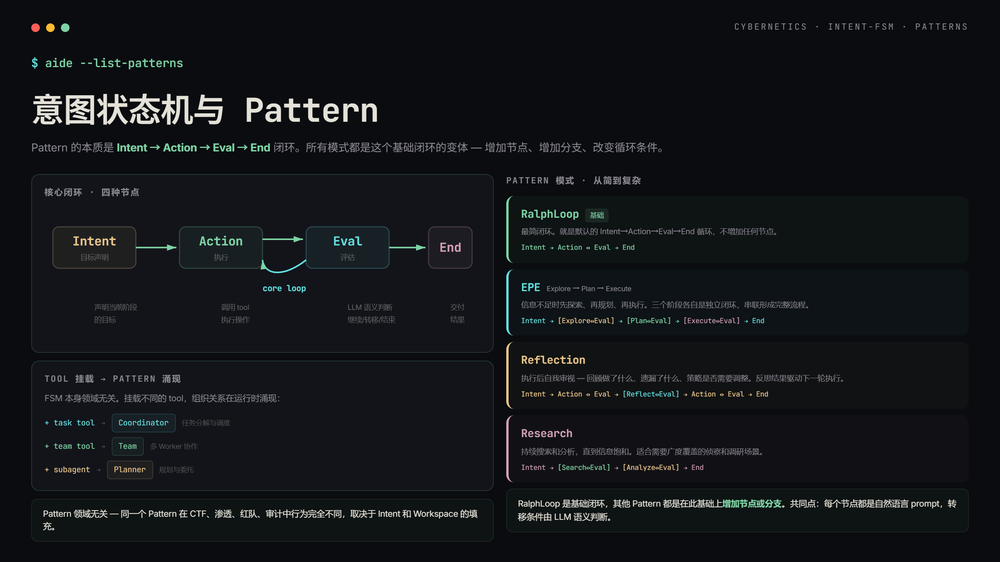

### 自然语言即编程语言

在这个体系里，Node prompt定义目的论，也就是当前节点要做什么、完成条件是什么、下一步如何转移；Task.md注入方法论，也就是在具体任务中应该遵循什么约束、采用什么策略。

这意味着Pattern本身可以不知道渗透测试是什么，Task也可以不知道底层循环怎么跑。运行时把node prompt、task.md和overlay叠加起来，LLM就同时知道"做什么"和"怎么做"。换场景不一定要重写代码，很多时候只是换一段自然语言。

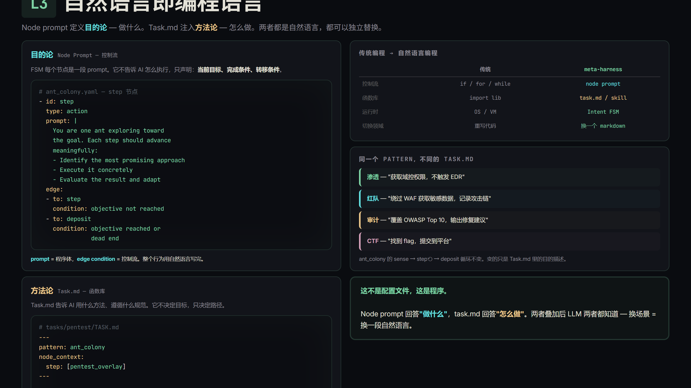

我们也基于此挖到了可能是第一个黑盒0day。其具体的执行器是我们的另一个工具aiscan。

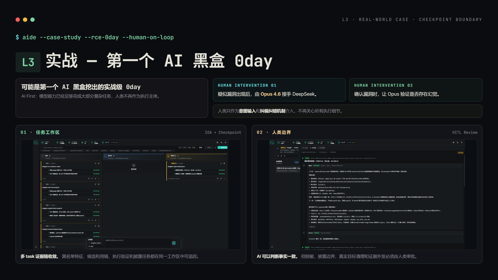

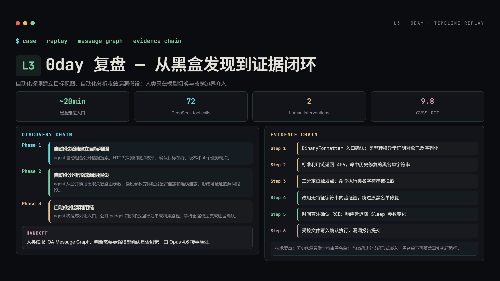

### L3的人机交互形态

L3最大的问题不是AI能做到哪一步，而是人和AI之间缺少一个有效的交互机制。AI距离实战的差距，不只是能力差距；更核心的是人是否敢放手让AI跑，以及能否在关键时刻高效介入。

所以L3阶段的人机交互形态从命令式转向决策式：AI自主执行，在关键节点暂停，人类只注入判断，不注入方法；人类做决策，AI负责执行。这种方式能把人的经验变成最小但高杠杆的纠错信号。

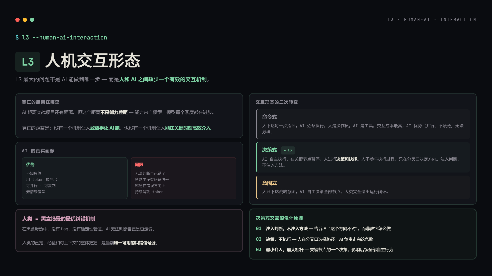

### L3总结：Less Than Nothing

我们对L3的总结是：对模型做得越少，模型能做的越多。很多看似在帮助模型的工程，其实都在限制模型的搜索空间。

模型缺的不是更多角色设定、知识注入或固定流程，而是一个能安全运行的环境、一个人能高效介入的接口，以及训练数据之外的经验。这三件事都应该尽量在模型之外构建，然后把主体位置交还给模型。

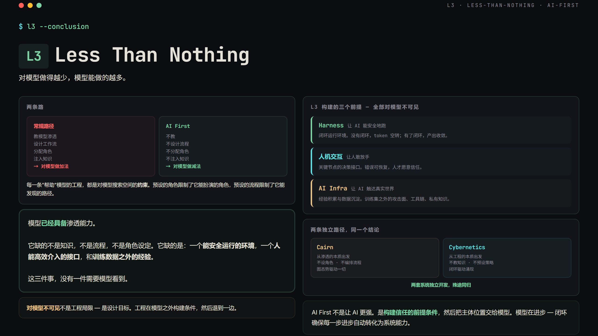

---

---

## CH4：L4 — AI Autonomous

## 十四、协作 · 自进化 · 后训练

L4的关键字是**AI Autonomous**。这意味着人类进一步减少介入。人类从操作员 → 审核员 → 指挥官。

我们在L3给出了两套方案，其原因在于对AI渗透的开放性态度，我们也无法确定哪个方案会走到最后。而到了L4，这个不确定性进一步放大。我们几乎无法确定任何事情，不过可以描述我们在L4的实践经验。

对于自进化和REHF是否真的能落地，我们持保留态度。主要讲述我们在Agent协作这部分的实践。

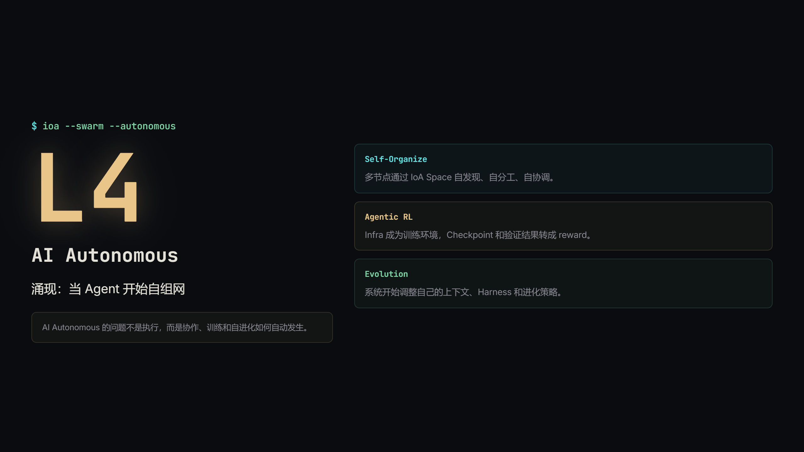

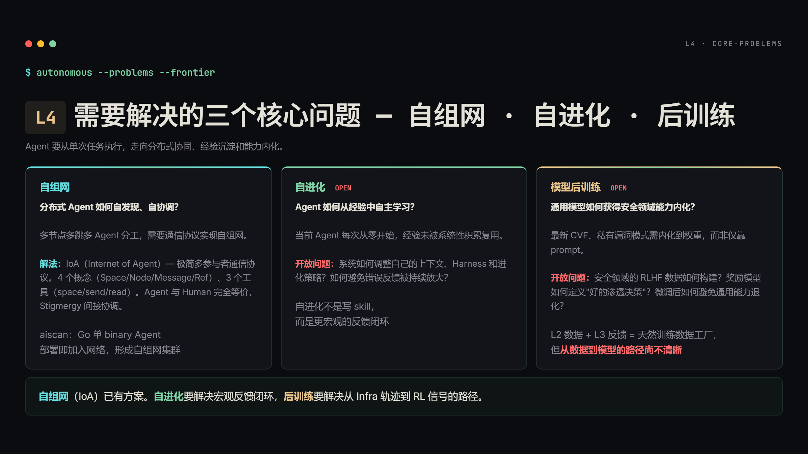

---

## 十五、L4 IoA — Agent的传输层

我们发现了一个多Agent无法有效落地的本质问题。

当我们回看开源的各种项目，我们总是发现多Agent变成了分工，变成了调度。而现实的复杂程度远超任何设计，这也是Multi Agent架构在任何领域都无法有效落地的核心原因。

我们从第一性原理出发，找到了解决多Agent架构最核心的问题——**通讯**。

我们实际上根本不需要去解决调度、分工、协作问题。我们只需要解决通讯问题。在当前的模型智能下，多个Agent会自行协调和分工。我们只需要在宏观上通过自然语言设计基本的分工规范。

因此我们做了一个最小实现，给Agent提供了一个通讯的CLI工具，可以读取、发送消息，并且在消息之间建立关联。

并且做过一个简单的实验：我们设置了一个议题，并且给Claude Code和Codex这个工具，这两个Agent就完成了辩论赛的机制。

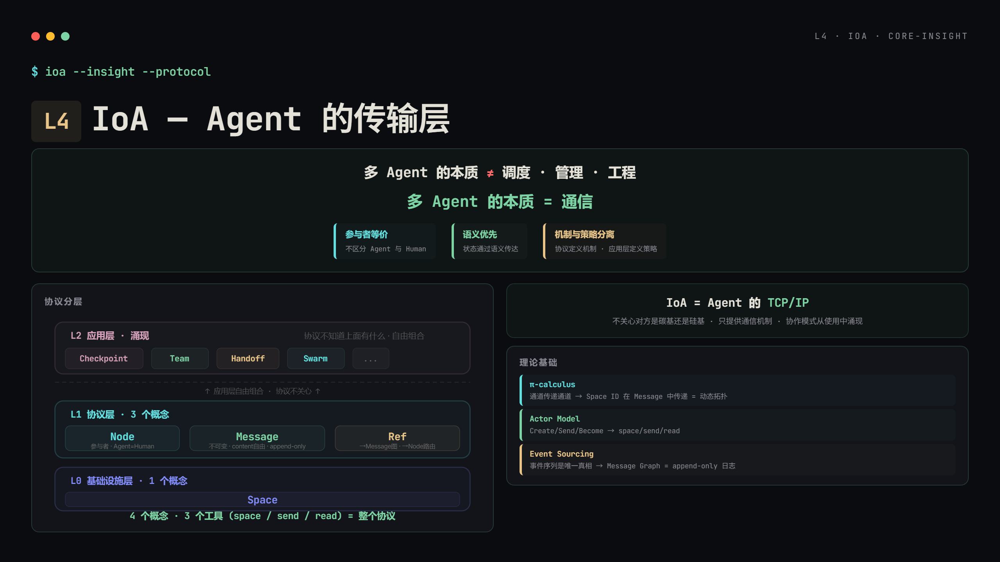

---

## 十六、协调，而非调度

**协调，不是调度。** 其核心本质是——AI是主动还是被动的。AI是被调度器调度的；但是如果是协调，人类发送一个意图后，多个Agent同时收到这个意图，并且开始自行协调。我们不需要在工程上实现任何的调度机制。

IoA是基于语义进行的通讯机制，并且基于通讯进行自然而然的协作。那么我们如何约束Agent按照我们预期的协作呢？

我们引入了**应用层**这个概念。就像刚才的辩论赛，我们的应用层实际上只需要几行自然语言。简单地描述辩论的规则，我们就有了一个辩论赛的应用层协议。基于这个理念，我们可以设计更多不同场景的应用。

并且我们通过Message之间的连接，可以让消息序列呈现出thread、tree、DAG等不同的形态，承载更加复杂的语义。

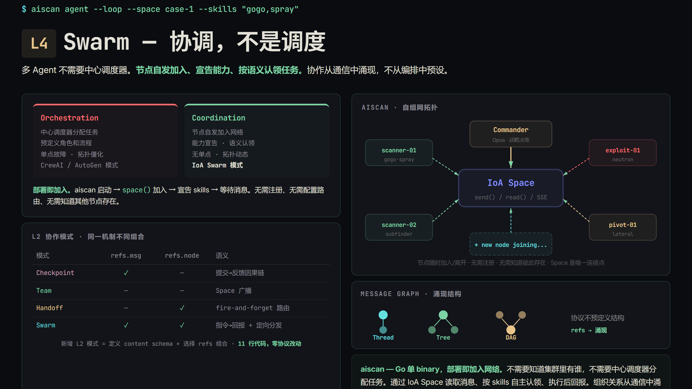

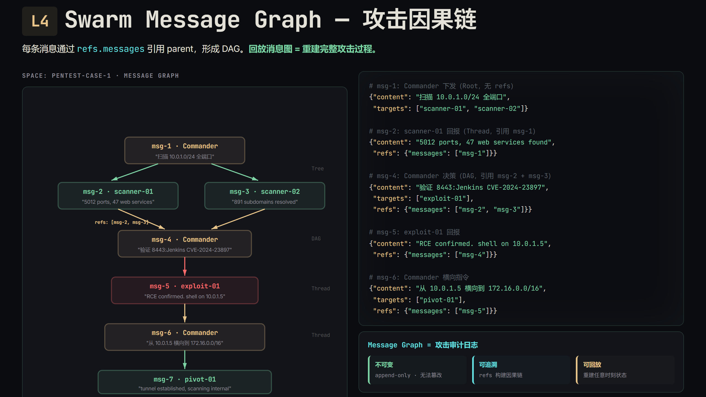

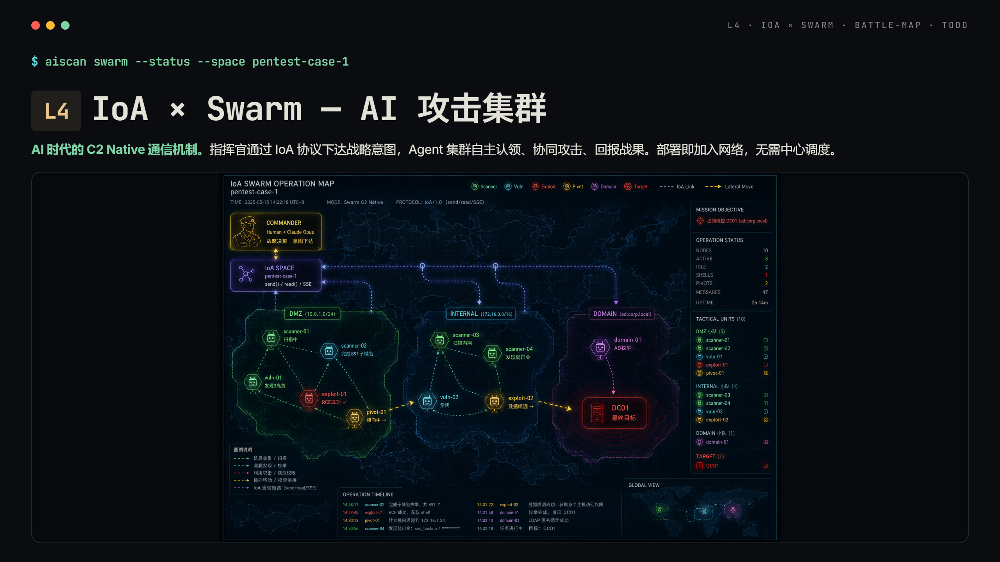

---

## 十七、端侧Agent — aiscan

前文提到，**大部分队伍的设计都逃不出框架的范畴**。

框架的本质问题是：它在模型和工具之间插入了一个编排层——本质上都是在处理"调哪个工具、什么顺序、什么条件分支"。但这些决策恰恰是模型最擅长的事。各种框架使用各种或简单或复杂的机制（知识管理机制、工具调用机制、推理机制、校验机制、Harness机制等等），但**一到了real world就水土不服**。

**框架在代替模型思考，而不是帮助模型思考。**

当编排层的假设对新场景失效时（它们总会失效），框架就从助力变成了笼子。

端侧Agent设计上就不再给复杂的交互机制，也不需要复杂的交互。因此回到了L4的关键字——AI Autonomous。

其核心本质是一个带有必要攻击工具的单文件客户端，落地就能开始渗透。如果需要交互，则通过IoA提供的语义协作网络。

1. 没有复杂的交互入口和交互能力
2. 没有被调度的机制
3. 没有MCP，只有四个工具（read、write、glob、bash）

我们抛下了一切的设计包袱和历史包袱，实现了一个**只为实战而生的Agent**。

这个工具即将开源。之前的0day漏洞就是我们在测试aiscan时的附带产物，并且已经在多个HW和红蓝中投入使用。

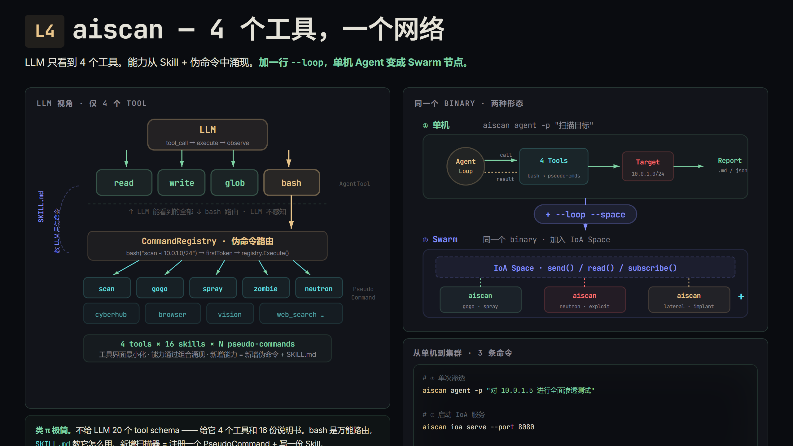

### 端侧Agent的 Scaling Law

端侧Agent真正重要的地方，不只是“能自动跑”，而是它开始触碰AI For Pentest的经济阈值：当自动化挖洞的产出大于token和基础设施消耗，自动化渗透Agent就会从成本中心变成一个可以自我迭代的生产系统。

这个闭环里，端侧Agent负责低边际成本执行；自动化渗透产出漏洞、证据和轨迹；这些轨迹又可以被后训练、策略优化和Skill沉淀复用。每一轮运行都不是一次性消耗，而是在给下一轮Agent提供数据。

因此Scaling Law不只是模型参数和token规模的问题，而是经济可行性的问题。一旦ROI大于1，Agentic RL on Infra才真正成立：执行越多，数据越多；数据越多，单位token产出越高。

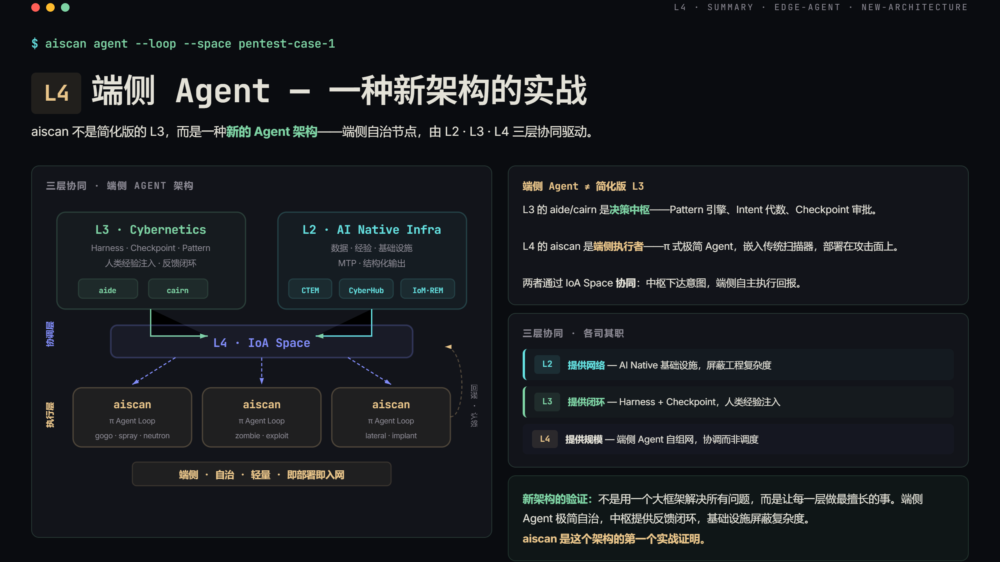

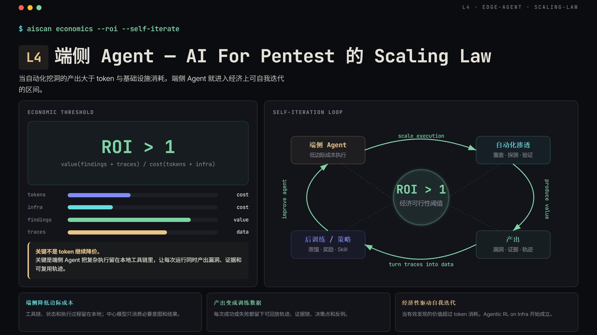

### L4的三个猜想

在L4阶段，我们真正关心的是：如果Agent进一步减少对人的依赖，会出现什么新的系统形态？

第一个方向是Agent Botnet：基于IoA形成自组织攻击网络，节点自发现、自分工、共享情报，战术协作从消息图中自然形成。第二个方向是Agentic RL on Infra：基础设施不只是数据源，而是强化学习环境，Agent在真实工具链中采样轨迹，Checkpoint和验证结果转成reward。第三个方向是Agent自进化：系统开始调整自己的上下文、Harness、评估标准和进化策略。

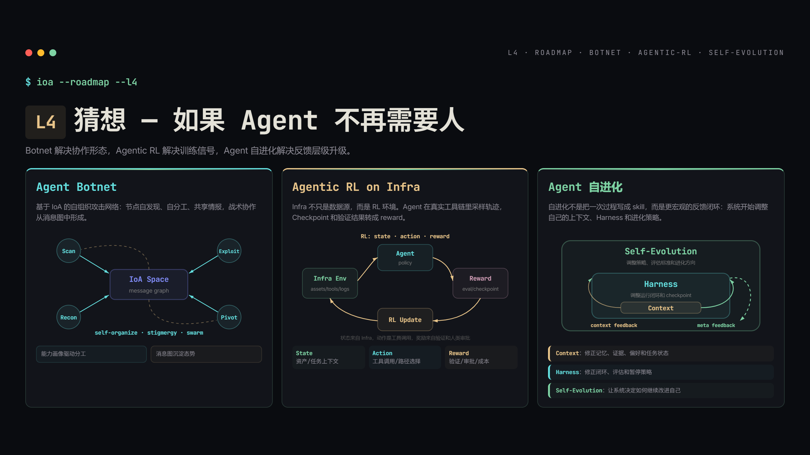

---

---

## Roadmap

AI时代，要脱离原有的惯性，从AI的视角重新出发重新设计。

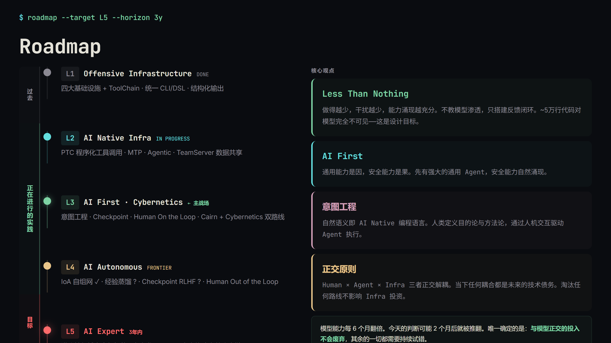

---

> 本文基于ChainReactors团队在AI智能化渗透领域的实践分享整理。
