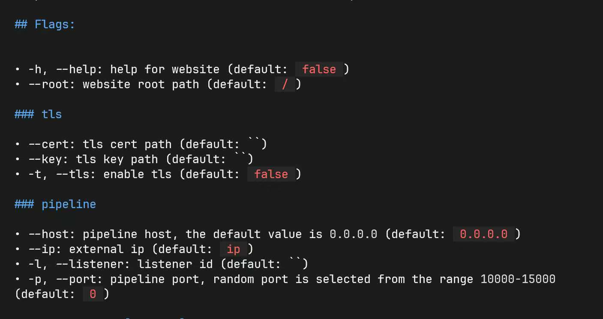

---
date:
  created: 2025-04-14
slug: IoM_v0.1.0
---

 经过几个月的时间，带来了四大全新组件, 以及十几个较大的功能性更新与数百个修复与优化。

**与之前一样，在更新公告中的内容都将会在community版本中提供**

四大新组件: 

- 基于vscode extension的GUI客户端
- 基于lua脚本语言的插件系统以及迁移了数百个插件的基础插件生态
- 基于rem实现的代理/隧道功能组
- 类似BeaconGate的动态函数调用和Ollvm

当然目前与CobaltStrike对比不免有些不自量力(因缺少大量实战测试修复各种bug)。但这也代表IoM主体功能的阶段性成果。IoM不再是一个实验室中的demo， 而是能初步用于实战的工具。 

CobaltStrike最大的护城河是丝滑的GUI客户端， 稳定的beacon，以及丰富的插件生态。以至于抹平其OPSEC上的劣势。 而现在CobaltStrike的二开止步4.6， 破解版本停滞在4.10， 主流的CobaltStrike的使用者逐渐远离了其最新版本。 这让IoM有机会成为CS的备选品(我们承认距离代替CS还有不小的距离)。

<!-- more -->
## 新组件

### GUI 客户端

https://github.com/chainreactors/IoM-gui

一些简单的图示


### Mals 插件生态

https://github.com/chainreactors/mal-community

在v0.0.3中， 我们第一次提供了mal-community。 现在回看， 当时的实现较为粗糙， 有非常多的bug与设计缺陷， 经过两个版本的打磨。 我们可以发布mals 1.0版本了。  


**快速入门mals** :  https://chainreactors.github.io/wiki/IoM/manual/mal/quickstart/ 


已经实现/迁移的插件包: 

- lib
	- noconsolation, https://github.com/fortra/No-Consolation
	- SharpBlock, https://github.com/CCob/SharpBlock
- common (基础工具)
	- operatorskit, https://github.com/REDMED-X/OperatorsKit
	- remoteopsbof, https://github.com/trustedsec/CS-Remote-OPs-BOF
	- situationalbof, https://github.com/trustedsec/CS-Situational-Awareness-BOF
	- chainreactor, gogo/zombie/spray 等 chainreactor 的工具
	- 大量其他独立工具
- elevate (提权)
	- https://github.com/icyguider/UAC-BOF-Bonanza
	- postexpkit中的部分
	- https://github.com/rsmudge/ElevateKit
- persistence (权限维持)
	-  https://github.com/0xthirteen/StayKit
- proxy (网络/代理)
	- https://github.com/go-gost/gost
	- https://github.com/chainreactors/rem-community
- domain (域渗透)
	- https://github.com/wavvs/nanorobeus
	- 常用域渗透工具
- move (横向移动)
	- https://github.com/0xthirteen/MoveKit

我们迁移了数百个CobaltStrike的插件功能， 完成了mals社区的起步阶段的基础设施建设， 这些功能覆盖绝大多数常用的CobaltStrike的使用场景。

也是对IoM基础能力的一次完整的测试。这些插件大部分经过我们的简单测试， 确保其至少能运行在implant中不panic以及基本功能正常。

**这意味着mals与malefic功能上能完全代替CobaltStrike的aggresive script， 并且提供了细粒度更高的API。**

我们期待mals能在C2社区中有一席之地
#### mals中间层

通过 https://github.com/chainreactors/mals 实现了一个grpc与golang的中间层，可以通过中间层将各种内部函数/grpc等对外暴露给lua， yaegi等脚本语言。 目前以lua为主， 实现了一套高细粒度的api，以及自动文档生成。


### REM

https://github.com/chainreactors/rem-community

rem是全场景代理/隧道工具. 提供了全访问的网络侧功能。 例如正反向代理，端口转发，多传输层信道， 级联等等功能。

v0.1.0 全面接入了rem 它会在listener，client， implant发挥不同的作用。 我将分别介绍
#### rem for pipeline

新增rem配置项， 监听rem console 服务


这个服务可以给普通的rem二进制文件直接使用， 也可以让client与implant连接。

不再需要下载独立的rem程序， IoM的server就可以当作rem的服务端， 并提供了更多的管理功能。
#### rem for implant

提供了3种加载rem的方式。 

1. 通过.a 文件静态编译(不支持windows msvc)
2. 通过 dll/so 反射动态加载
3. 通过 pe loader 加载exe/elf。(pe to shellcode也算作此列)

这三种方式覆盖了绝大多数使用场景， rem虽然是golang编写的， 但是可以在编译时静态连接/反射动态加载到implant中。 可以作为独立的工具， 和其他二进制程序一样被pe loader加载。 在OPSEC上有略微的不同， 可以参照对应的命令的helper理解其实现原理。 

##### 常用的tunnel/proxy功能

常见的正反向端口转发, 正反向代理都可以，以及类似CS的rportfwd_local以及CS都没有的portfwd_local都可以基于rem实现。完成常见proxy/tunnel 的全覆盖


##### implant rem transport
除了运行rem模块搭建隧道，还支持重载implant的信道，实现 rem over implant。 让rem在网络侧对抗发光发热， rust在网络相关的玩法上略逊于golang。 

通过rem静态链接库的FFI接口在implant编译时链接， 实现重载传输层，复用rem能够实现的一切流量层特性。

这也是IoM在之前的版本中都没有提供除了tls之外的任何传输层的原因，所有网络侧的对抗都可以交给rem实现


#### rem for client/mals

rem本身只需要通过单行命令实现所有功能， 而IoM的client上的rem相关命令组一定程度上提供了rem的交互式命令行管理工具。 可以在client上管理已有的连接，新建隧道， 修改配置等。 

最常见的用法已经封装在命令行中， 但是还有一些rem特有的高级用法，通过mal-community中的[community-proxy](https://github.com/chainreactors/mal-community/tree/master/community-proxy "community-proxy")动态注册。 


而client本身也支持接入 listener <--> implant 构建的网络， 实现网络测的三端打通。 

#### 小结

总的来说， 我们可以在client中通过一组命令操控server管理rem的console， 也可以直接基于rem在implant实现各种 proxy/tunnel的功能。 

### implant OPSEC

关于OPSEC的部分我们会保持闭源， 通过提供静态链接库公开基础可用版本。

CobaltStrike有三个大的OPSEC定制切面， 分别是UDRL，sleepmask 以及最新的BeaconGate。我们正在逐步实现CS的这些OPSEC功能， 以及更多的CS没有的OPSEC选项。 
#### Beacon Gate

在设计初期， `IoM` 对各类 `API` 的调用都是为一切可配置可调控而设计的， 虽然并未以开源形式公开， 但我们发现其与 `Beacon Gate` 的设计不谋而合， 这也意味着我们在内部可以做到同样的操作， 用内置各类动态可调控 `API` 为 `BOF` 和 `Beacon` 进行武装

在v0.1.0版本中， BeaconGate得到了全面升级或许我们得给这个功能起一个新的名字。 

**该功能暂时仅提供给Professional版本。**  后续将会从中切割一个与CobaltStrike的beacongate类似的功能提供给community。 

#### Ollvm

ollvm是rust静态免杀的通用解决方案之一。 面对目前某些杀软基于特征的静态文件识别方案， 如何快速改变内部结构是一个非常有趣的话题， `ollvm` 便是一种非常有效而有力的手段， 通过添加 `pass`， 在增加逆向成本的同时， 我们也可以快速增加程序的信息熵， 以进行静态特征上的规避。

v0.1.0 中， 我们提供了集成了ollvm的docker镜像( `ollvm16 + rust1.74.0` toolchain,  此外还提供了 `ollvm17 + rust1.74.0` 的 `Dockerfile`)以及malefic-mutant编译工具。带来了基础版本的ollvm。 community中的ollvm为开源版本的工程化实现, 特征与特性与开源版本一致， 但是大大简化了环境配置的复杂性。  

- 感谢@https://github.com/joaovarelas/Obfuscator-LLVM-16.0 提供的 `Dockerfile`及 `ollvm16 patch`
- 感谢@https://github.com/DreamSoule/ollvm17 对 `ollvm17` 的支持
- 感谢@https://github.com/61bcdefg/Hikari-LLVM15-Core/ 对平坦化的支持

```yaml
build:  
  zigbuild: false  
  ollvm:  
    enable: true  
    bcfobf: true  
    splitobf: false  
    subobf: false  
    fco: false  
    constenc: false
```

```sh
malefic-mutant build malefic
```

### IoM for AI (Preview)

*这是隐藏的第五个新组件，但是功能暂时还没有稳定，所以不算是正式发布。* 

AI给IoM的开发提供了非常巨大的帮助， 有不少模块的原型都是AI实现的。

并且在设计早期， 我们就幻想过如何将AI应用到C2中， 之前一直没有特别好的方案， 而现在我们有了全新的工具和思路。

刚才提到过我们的GUI基于vscode插件实现，而AI编程也很难离得开vscode， 如cursot、cline，trae，windsurf 等工具都离不开vscode。可以说vscode 大概率是未来AI编程的试验中心。 **IoM GUI在这个AI 驱动的自动化渗透领域中有先天的优势。** 

而这段时间内，出现了MCP协议， 作为AI与传统工具的桥梁， 让我们可以更快的打通其间的壁垒， 让我们不再需要自行实现一个agent框架，直接将知识和能力都暴露给AI， 让AI根据需求自行调用。 

**该功能还处于于早期测试阶段，会在nightly release中发布** 


## 更新日志

#### (server) Context 重构

为了管理可复用的数据，提供了一组api保存渗透过程中需要重复使用的常见数据。


#### (server) donut 重构

之前我们尝试自行实现了 https://github.com/chainreactors/malefic-srdi ， 但是RDI的功能并不止PE to shellcode， 还有大量各种各样的功能, 最后我们选择了妥协。 后续将采用二开的donut实现。 
这里
- 感谢@howmp 的 https://github.com/howmp/donut_ollvm 
- 感谢@howmp 将malefic-srdi中TLS的解决方案移植到了zig。 
- 感谢@zema1 将TLS的解决方案从zig移植到了donut
- 感谢@wabzsy的 https://github.com/wabzsy/gonut 基于donut 1.1实现了golang版本的donut前端

又进行了大量的改造：

- 自动化 ollvm 编译
- 修复多个gonut的错误
- 将gonut升级到适配donut 1.1
- 注册到IoM的client与server的各个使用场景中

最终成功呈现在 https://github.com/chainreactors/malice-network/tree/dev/external/gonut 中
#### (server) http pipeline

实现了http pipeline的基础功能,  能自定义基本的特征。 并且将原本pulse http协议上线的相关功能从website迁移到http pipeline中。

现在http pipeline负责pulse和malefic beacon的http协议交互，website现在只负责挂载文件。 

#### (client) 命令行UI美化

flag分组展示


OPSEC标记，颜色标记，ATT&CK标记


命令行help细节


#### (implant) 支持打包与释放文件

implant添加了pack相关配置， 可以指定打包文件的路径与释放路径， 并在释放后自动打开文件。 


#### (implant) 重构资源文件

通过 embed-resource 库(仅编译时引入)实现更多的资源文件功能。 并支持gnu+msvc(原先只支持msvc)

例如在启动时申请管理员权限或者UAC权限


#### (implant) 支持win11 24H2及以后的RunPE

不知道是不是微软安全团队发力， 在 `win11 24H2` 版本中， 如果各位使用 `Process Hollowing`， 将会得到这样的报错 `0xc0000141`

如果各位感兴趣，可以查看[hasherezade](https://hshrzd.wordpress.com/2025/01/27/process-hollowing-on-windows-11-24h2/) 的精彩分析

我将在这里简要介绍原因及解决方案

为避免部分读者对 `Process Hollowing` 有些陌生， 因此我会简单介绍一下该技术

`Process Hollowing` 顾名思义就是镂空一个正常进程， 披着该进程的外皮执行我们的代码， 因此我们需要 `stop` 住原本的进程启动逻辑， 释放掉系统原本分配的原进程内存， 将我们的进程装载进该进程中， 修改进程上下文以替换入口点。 当然， 也可以不释放内存， 直接分配一块新内存， 再修改对应上下文信息

但这也引发了另一个问题， 我们所分配的内存皆是 `private` 的内存，而非正常加载时的 `image` 内存， 因此微软在这次更新中新增了对该段内存的 `check`， 其使用 `zwqueryvirtualmemory` 以及一个新参数 [MemoryImageExtensionInformation ](https://ntdoc.m417z.com/memory_information_class) 来检测是否是合法内存， 从而阻止我们原本的攻击链条

因此，解决方案也呼之欲出了，我们可以简要将其分为两种
* 让我们分配出 `MEM_IMAGE` 的内存
* 对函数进行 `hook` 来绕过

首先是第一类方法， 在对抗中， 早已出现了大量的`Process Hollowing` 变体， 比如

* [process_doppelganging](https://github.com/hasherezade/process_doppelganging)
* [process_ghosting](https://github.com/hasherezade/process_ghosting)
* [herpaderping](https://github.com/jxy-s/herpaderping)
* [process_overwriting](https://github.com/hasherezade/process_overwriting)

当然， 也有更加简单粗暴的方案： `hook`， 由于该防御方案位于 `r3` 层， 因此进攻和防守方显得十分公平， 解决起来也异常简单

当然， 除了这里还有一处 `NtManageHotPatch` 函数需要处理， 如果各位感兴趣可以参考和阅读我上面贴出的文章一窥究竟 :)


#### (implant) 去除外部依赖库

在早期版本中， 为了快速实现功能， 引入了大量第三方库， 这些库会引入更多不必要的库和特征， 并且会导致我们无法定制每个细节的OPSEC。 

所以在此次更新中， 尽可能去掉了所有不必要的库。目前仅剩下wmi依赖了@lz520520 修改后的库。 不过在后续更新中应该也会去除， 完全本地化。 并且将会实现一套类似BeaconGate的机制增强这些基本功能的OPSEC

#### (implant) 运行时解耦

在早期版本中， malefic 异步运行时基于tokio实现， 后来为了尽可能缩减依赖库， 替换为了async-std。 但因为async-std的停止更新以及3rd插件的引入。 我们对异步运行时做了解耦。 现在可以在三种异步运行时中任意选择一个， 用来适配不同的插件场景. 

当前支持的异步运行时：

- tokio
- async-std
- smol

可以在 implant的config.yaml 中修改

```yaml
implants:
  runtime: tokio
```

#### (implant) implant autorun

在v0.0.3中就引入了malefic-prelude.

这个功能是基于 yaml 2 protobuf实现的自动化命令预编排。 可以实现在启动时不进行任何交互就完成权限维持，反HOOK， 反DEBUG，杀软检查等功能。

现在我们给beacon也加入了这个功能， 不再必须分阶段实现。 

可以在编译时编译到beacon中， 在beacon启动时自动执行预编排的任务。 

```yaml
implants:  
  autorun: "persistence.yaml"
```

persistence.yaml:
```yaml
-
  name: bof
  body: !ExecuteBinary
    name: addservice
    bin: !File "addservice.o"

```

#### (implant) 新增3rd module crate

为了实现内置的rem， 我们引入了[3rd module](https://github.com/chainreactors/malefic/tree/master/malefic-3rd)。 

在这个module集合中， 不再限制外部依赖库的使用， 后续的rustdest, keylogger或者各种需要依赖外部rust库的功能都会放到这里。 

3rd module 默认不会编译到beacon中， 通常作为hot load module使用。 如果想要直接编译时打包可以修改config.yaml

```yaml
implants:  
  modules:  
    - "full"  
  enable_3rd: false  
  3rd_modules:  
    - "full"
```

当然我们不建议这么做， 因为光引入了简单的http client。 体积就增加了数百K。 可以根据自己的需求修改

### Fixs & Optimizations


- [ci] github action 因为某些库的自动依赖更新导致不适配1.74 编译失败
- [ci] 添加了nightly release， 每天自动发布最新版
- [server] event乱序bug
- [server] 数据库结构大量改动，需要重建数据库， **从这个版本开始，后续将会实现自动化数据库迁移， 就算版本更新也不用担心数据丢失**
- [client] 更新底层readline与console 
- [client] 添加ClientGroup mals函数组, 添加了一组与cli交互的辅助函数，例如各种命令行补全
- [client] event format 重构， 现在将会在server format后再发送到各端
- [implant] 特定情况下implant 发送header中断导致的挂死
- [implant] 重构pipe
- [implant] 去除绝大部分的async_std 依赖， 使用futures代替
- [implant] mutant log 格式美化
- ......


## End


原本计划从v0.0.4直接跳跃到商业化版本, 但现实遇到的困难比预期多得多，我们不得不先发布一个中间版本 v0.1.0。而这个版本也将作为可预见未来内的最后一个大版本，后续会有一些小的改动和修复。 等待从社区中获取足够的使用反馈， 才会进行下一步的开发。 **可以尝试将IoM v0.1.0作为一个稳定版本投入生产， 期待你们的反馈！**


也有一个相对遗憾的消息， 受限于资源和精力， v0.1.0 可能将是未来一段时间内的稳定版本。 因为实现roadmap中v0.1.0需要消耗的资源比预计的更多，也因为各种其他原因，我们无法按照预期实现v0.1.0的所有计划内的功能。

如果您认可我们的产品， 欢迎联系我们咨询关于IoM Professional的相关信息。 联系方式: m09ician@gmail.com

