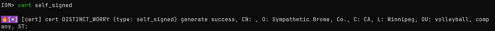

---
date:
  created: 2025-07-09
slug: IoM_v0.1.1
---

# IoM v0.1.1 Out of the Box 开箱即用
## 前言

距离上次大版本的更新已经过去了三个月， 我们大概每个月会发布一个patch， 修复已知bug、对功能进行小的改动。  积累了足够发布一个大版本的更新内容，决定将v0.1.1提前搬上来。 


我们在v0.1.0 之前就在implant侧积累了足够多的底层技术， 但受限于精力，这些内容都需要熟悉rust的编译才能被很好的管理与使用。底层的功能实际上已经远远超越任何一家开源的C2， 普通使用者却无法很好的感知。 因此v0.1.1主要为了提升用户体验、简化复杂操作， 将之前较为复杂的TLS、REM、HotLoad等等功能简化到所有用户都能轻易使用的程度。

**本次更新的主要内容是 开箱即用， 让不具备专业知识的用户也能轻松使用**

从v0.1.1开始， IoM的implant编译部分不再具有任何门槛， 只需要允许单个二进制文件即可使用， 不再需要依赖docker或者安装脚本。 client和server都只需要单个二进制文件**开箱即用**

<!-- more -->

!!! tips "GUI 将会在1-2周后适配v0.1.1"


## 新特性

### build 开箱即用

我们也进行了大量的测试和实战， 接收到了一定的反馈。目前IoM最大的上手难度还是rust编译部分。即使我们提供了一行命令即可试用的docker自动化编译以及github action自动化编译， 比起Cobaltstrike这样的通过patch生成beacon还是不够直接。

因此将给**所有用户提供最基础版本的自动化编译**， 这个编译服务托管在服务器上， **如果有安全上顾虑， 可以手动关闭这个功能。** 

!!! danger "使用自动化编译服务即视为同意[用户协议](https://wiki.chainreactors.red/IoM/#用户协议)"

!!! danger "在提供自动化编译的同时, 也添加了malefic.yar"
	任何防护设备的厂家可以通过我们的malefic.yar 检测通过自动化服务编译的二进制文件

```yaml
saas:  
  enable: true  
  url: http://build.chainreactors.red  
  token: **** # community用户会自动注册生成license
```


如果token为null， 则会自动注册， 向服务器获得一个token， **对于用户来说是无感的**。 

listener新增了autobuild配置块,  将会使用自动化编译服务生成最基本的implant 二进制文件。 以达到接近CobaltStrike的用户体验

```yaml
listeners:  
  enable: true  
  auto_build:  
    enable: true  
    build_pulse: true  
    target:  
      - x86_64-pc-windows-gnu  
    pipeline:  
      - tcp  
      - http
  ......
```


我们极大的简化了原本`安装docker/github action -> new profile -> build` 的流程， 现在只需要运行server的二进制文件， 即可直接使用

### mal 开箱即用


我们发现了mal-community因为实现的过于匆忙， 导致bug较多，用户体验极差，实际使用者也寥寥无几。 并且需要通过mal install进行手动安装。 而v0.1.1 中， 我们将最常用的插件嵌入到client中，实现**开箱即用**。


 我们在client中维护一个内置的mal 插件工具集， 这个工具集将被良好的维护以及持久更新， 但只会添加必要的功能，已防止client二进制文件体积过度膨胀。 


### rem 开箱即用

原本的rem相关功能有很大一部分位于 mal-community的community-proxy下, 造成了极强的割裂感。 而现在我们将rem也移动到了embed mal中。

原本的rem需要通过编译、插件等等方式进行加载。 而现在完全内置， 并提供了预编译的版本。

**用法1 动态加载rem module**

```sh
# 加载rem dll
rem_community load 

# 选择对应的rem pipeline, 搭建了反向代理隧道
rem_community socks5 rem_pipeline
```

**用法2 通过静态链接.a 编译implant**

```
build beacon --profile tcp_deafult --target x86_64-pc-windows-gnu --rem
```
### profile/build/artifact 命令组重构

- artifact download 支持--format, 支持十数种不同的格式
- artifact自动挂载到website, 通过自定义密钥映射目录
- 新增artifact show 命令， 展示artifact 基本信息
- 简化client build 命令组
- build module 新增--3rd， 允许编译3rd modules
- build beacon 新增 --rem， 静态链接rem
- build beacon 实装 --proxy命令
- build beacon 新增 --tls 命令， 开启tls
- ......

profile/build/artifact 经过多次优化用户体验，并结合自动化编译， 现在已经能让完全不懂的用户也能做到开箱即用。 

### 证书管理

目前IoM的tls相关功能被使用较少， 主要原因是tls使用较为复杂， 需要手动申请证书，通过多个flag进行配置。 为此， 我们优化了这个流程， 大大简化了证书自动申请， 证书配置，自签名证书相关操作。

如果不指定特定的字段， 自签名证书将通过随机值填充， 尽可能减少特殊相关特征。 




### 重构transport/pipeline

implant上的transport进行了完全的重构， 从接口到实现都与之前完全不同

- 支持socks5/http代理
- 修复与重构tls支持， 可以配置tls1.2，tls1.3
- 优化transport性能
- 优化rem的支持
- 通过泛型实现， 能接收所有基于 `pub trait TransportImpl: AsyncRead + AsyncWrite + Unpin + Send  {} ` 的实现
- 修复了一系列边界条件下implant假死的bug
- 修复默认tokio最大线程数为2的bug， 导致多个任务时会阻塞
- 新增swtich internal module, 允许动态切换pipeline
- ..... 

我们调整了transport的代码结构、具体实现、性能以及大量bug修复。 

现在的implant的transport可以适配多异步运行时，smol/async-std/tokio。 并且完全基于futures库的trait实现， 后续将能更自由的接入各种信道。 

同样的， 在server/listener 上， 我们也完全重构了pipeline。  最大的改动来自于pipeline的 encryption/cryptor/tls可以复用在一个端口上。 

在此之前，一个端口只支持一种加密方式，一种协议，tls开/关。 而新增， 可以同时配置多种协议， 多种加密方式，TLS自动识别。 

也就是说， **之前需要6个端口实现的工作， 现在通过多路复用在一个端口中实现。**

配置对比， 左边是新版的， 配置参数已经极大简化


并且artifact与website有了类似CobaltStrike的web delivery 的联动


### implant anti sandbox

我们实现一组简单的反沙箱的检测机制，技术来自 https://github.com/ayoubfaouzi/al-khaser 。 我们使用rust进行了简单的修改与实现。 这个检测机制非常简单， 实际上也不具备对抗效果。 目的是提供反沙箱的相关接口， 以供后续定制化开发


### 其他更新


- exec module支持实时回显
- 修复darwin 编译报错
- 特定操作系统下，随即数生成器失效的bug
- fix XOR cryptor not work
- 实现runas、rev2self、privs模块
- BOF多个buf修复， 适配windows server2012
- 大量的用户体验调整与细节bug修复不一一列举
- ...


## End

从v0.1.1 开始， 我们可以丢掉安装脚本， 丢掉编译环境， 只需要server和client两个二进制文件， 即可在任意位置使用IoM，不再有复杂的环境安装，rust编译操作。 对绝大多数轻度用户不会带来任何的负担， **能做到接近CobaltStrike/vshell级别的开箱即用**。 

