---
date:
  created: 2026-04-20
slug: IoM_v0.3.0
---

## 前言

距离上次更新过去了接近一年。 实际上我们的进度一直在快速迭代， 不过因为几个大的重构对老版本彻底失去了兼容， 因此等待所有的重构基本尘埃落地。

v0.3.0 是 IoM 历史上改动最大的一个版本。 我们对 Implant 进行了彻底的重构， 完全推倒重来了。 从架构和机制， 从底层实现到 OPSEC 设计。 这次重构的目标是把 malefic 从一个**面向人类 operator 的 C2 框架**，重新设计为一个 **AI Native Offensive Infrastructure**——一个从底层架构起就为 AI 与人协作而生的红队基础设施。"AI Native" 究竟意味着什么？这是 v0.3.0 给出的答案，留到第七章揭晓。

本地更新也正式引入了Professional 和Community版本的区别， Community版本保留了pro的相关接口和架构， 但是去掉的了具体实现，**专业用户可以凭借AI自行实现。**  有需要 Professional  可以联系我们。 

<!-- more -->

!!! info "⭐ Pro / Community 标记说明"
    带有 ⭐ 标记的功能仅在 Professional 版本中提供。未标记的功能均在 Community 版本中可用。

v0.3.0 之后，malefic 变成了一套可以按需组装的基础设施：

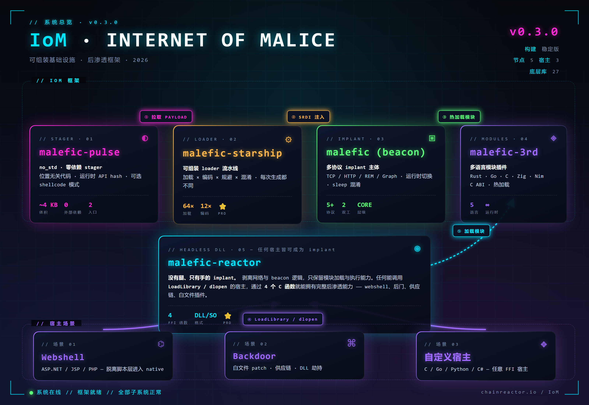

---

## 一、Starship —— 可组装的 Loader 框架 ⭐ Pro

在实际对抗中，loader 阶段往往是最容易被检测的环节。 如果 loader 是固定的，一旦被特征化就会全面失效。 `malefic-starship` 的设计理念是**一切可组装**——提供一条完整的流水线，上百种技术互相任意组合，让每次生成的 loader 都独一无二。

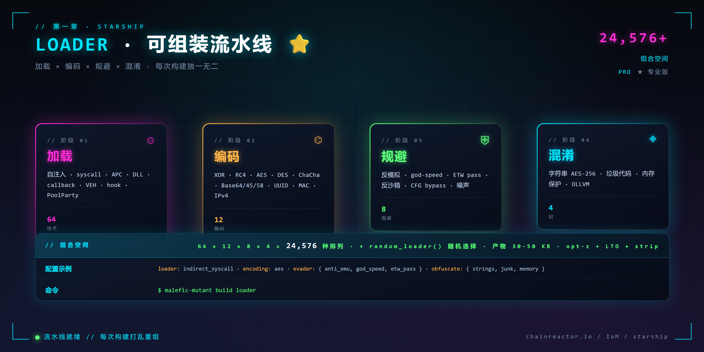

### 完整技术矩阵

**64 加载技术 × 12 编码 × 8 规避 × 4 混淆** 共 24,576 种排列，加上 `random_loader()` 随机抽签，每次构建的 loader 都完全不同。

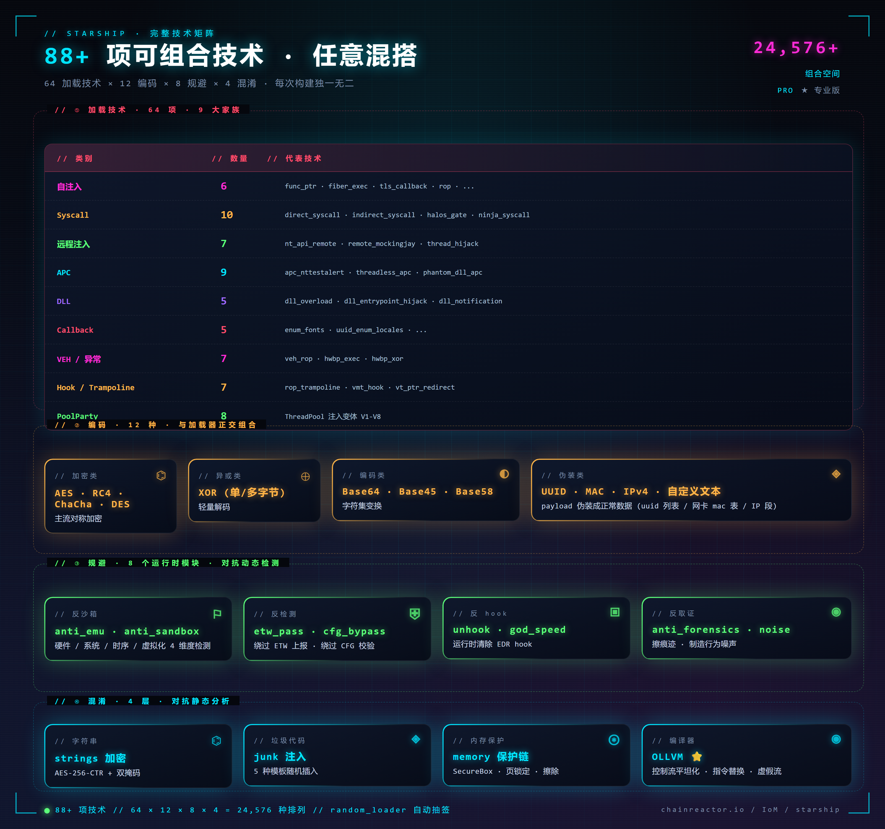

### 使用示例

```yaml
loader:
  loader: indirect_syscall
  encoding: aes
  evader:
    anti_emu: true
    god_speed: true
    etw_pass: true
  obfuscate:
    strings: true
    junk: true
    memory: true
```

```bash
malefic-mutant build loader
```

编译产物经 `opt-level = "z"` + LTO + strip 优化后仅 30-50KB。

<!-- TODO: 截图 - starship 编译输出 + 生成的 loader 体积 -->

---

## 二、Reactor —— Headless Malefic & Native Webshell ⭐ Pro

如果说 malefic 是一个"有腿的 implant"（自带网络、心跳、调度），那么 **reactor 就是一个"没有腿但有手的 implant"**——剥离所有网络和 beacon 逻辑，只保留纯粹的模块加载与执行能力，编译为标准动态库（DLL/SO）。

reactor 的核心价值在于：**任何能加载 DLL 的宿主都能获得 malefic 的全部后渗透能力**。webshell、backdoor、供应链植入、合法软件插件——只要能调用 4 个 C 函数，就是一个完整的 implant。

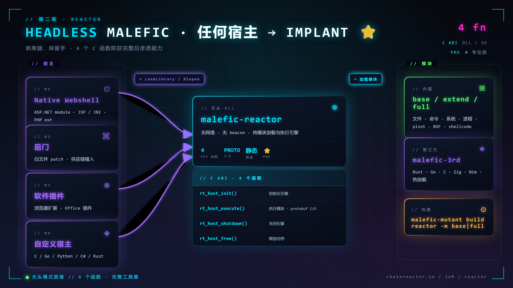

外部程序只需调用 4 个 C 函数：

```
rt_host_init()      → 初始化引擎
rt_host_execute()   → 执行任意模块（protobuf I/O）
rt_host_shutdown()  → 关闭引擎
rt_host_free()      → 释放内存
```

### Native Webshell —— 脱离脚本层的 Webshell

传统 webshell（PHP/JSP/ASPX）运行在脚本层，容易被 RASP/WAF 检测。reactor 作为标准 DLL，可以被 ASP.NET native module、Java JNI、PHP extension 加载到 Web 服务器进程的 **native 层**——脱离脚本引擎的监控范围。

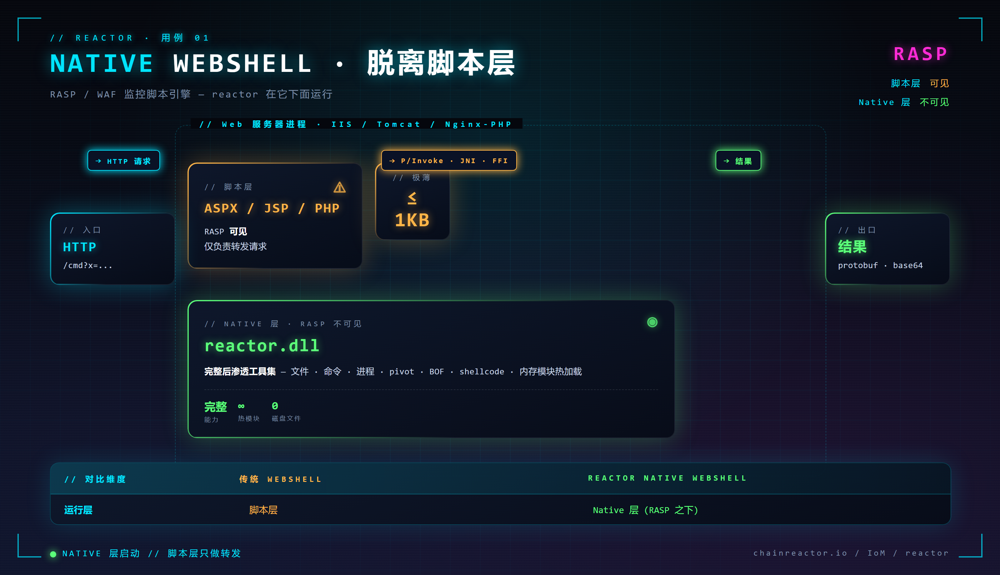

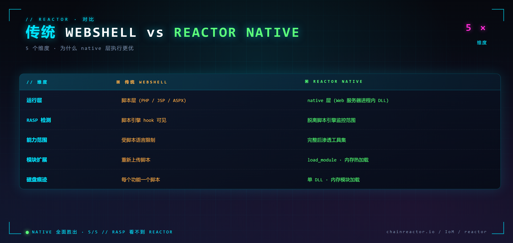

支持按需编译——`base`（文件管理+命令执行）、`extend`（+提权/横向/注册表等）、`full`（全量），也可以空壳 DLL + 运行时热加载。

```bash
malefic-mutant build reactor -m base
malefic-mutant build reactor -m full
```

<!-- TODO: 截图 - reactor 被 C# webshell 调用的演示 -->

---

## 三、核心架构重构

v0.3.0 对 implant 的几乎所有核心组件进行了彻底重构。

### Transport

之前的 transport 层强依赖 tokio、协议与实现耦合、不支持运行时切换。 v0.3.0 彻底重做：

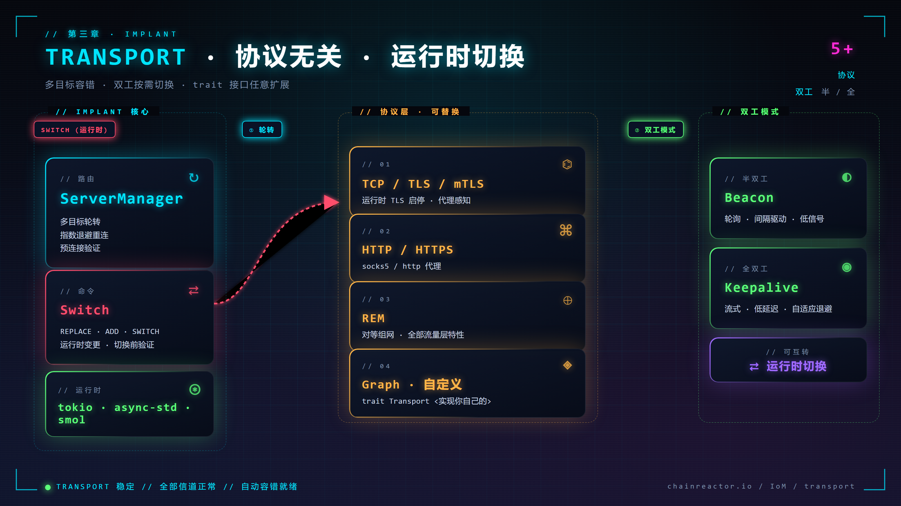

- **协议无关**：只要实现标准 trait 接口就能接入任何信道
- **双工支持**：半双工 / 全双工，运行时可互转
- **运行时切换**：`switch` 命令支持 REPLACE / ADD / SWITCH 三种模式，切换前自动预连接检查
- **多目标容错**：`ServerManager` 多目标轮转 + 指数退避重连
- **多运行时**：tokio / async-std / smol
- **REM transport**：复用 rem 的全部流量层特性

其他改进：socks5/http 代理、TLS 运行时动态启用/禁用、修复大量假死 bug。

<!-- TODO: 截图 - switch 命令演示 -->

### Module Runtime —— 多语言模块生态

之前 `load_module` 要求模块 DLL 与 implant 使用完全相同的 Rust 版本，否则崩溃。 v0.3.0 采用纯 C ABI 协议彻底解决：

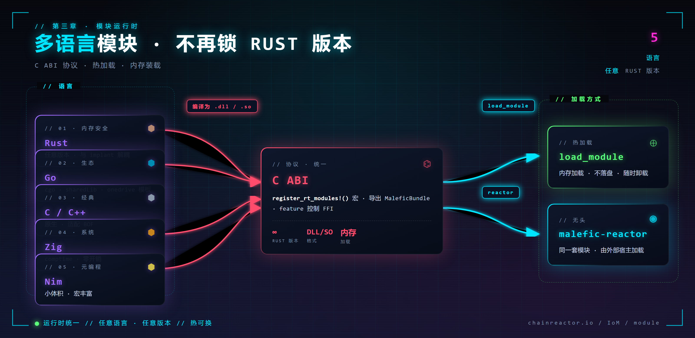

模块可以用任意 Rust 版本甚至 Go/C/Zig/Nim 编写。DLL 通过内存加载不落盘，支持动态加载和卸载。 `malefic-3rd-template` 提供五种语言的开发模板。

```bash
load_module --path module.dll
list_module
unload_module
```

<!-- TODO: 截图 - load_module + list_module 命令输出 -->

### Pulse —— 极简 stager · 三种产物 · 任意宿主

`malefic-pulse` 是体积最小的入口模块，定位是**把 implant 拉起来**。v0.3.0 把它从依赖外部 win-kit 的空壳 crate **重写为完全自包含的 `no_std` 框架**，并新增 EXE / DLL / Shellcode 三种构建模式与 HTTPS 通信。

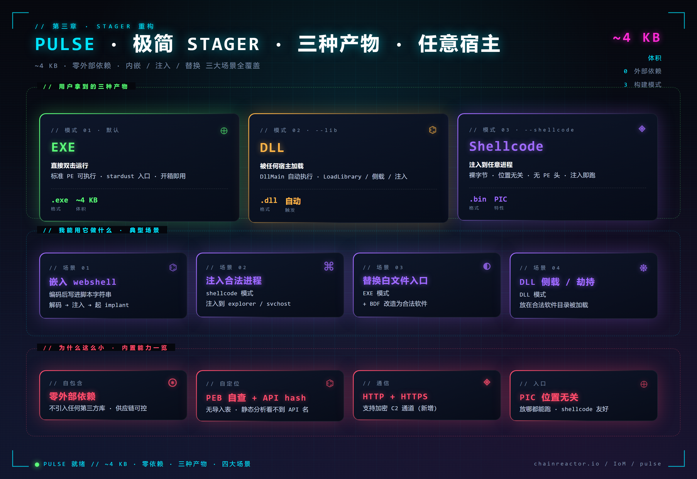

**用户视角的能力**：

- **三种产物模式** —— `EXE` 直接运行；`DLL` 被任何宿主 LoadLibrary / 侧载；`Shellcode` 注入到任意进程，注入即跑
- **典型场景** —— 嵌入 webshell、注入合法进程、替换白文件入口、DLL 侧载劫持，~4 KB 的体积可以塞进任何角落
- **零外部依赖** —— 不引入第三方库，供应链可控；自带 PEB 自查 + API hash，无导入表，静态分析看不到一个 API 名
- **HTTPS 通信新增** —— 即使在 stager 阶段也能走加密 C2 通道

定位不变：**极简 stager，体积优先**，最终产物 ~4 KB。

### Mutant —— 全栈构建 + PE 加工套件 ⭐ Pro

`malefic-mutant` 不只是构建工具,而是**从配置生成、二进制构建,到 PE 后处理、载荷加工、源码混淆的一站式 CLI**。25+ 个子命令分布在 5 大类:


- **generate** —— beacon / bind / prelude / modules / loader / pulse 6 类配置生成
- **build** —— malefic / modules / 3rd / pulse / prelude / proxy-dll / reactor 7 种产物
- **loader 三种生成模式** —— `template`(64 模板 × 12 编码) / `proxydll`(DLL 劫持) / `patch`(BDF · code cave + 8 种执行技术 + 多态 stub)
- **PE 加工** —— `sigforge`(签名提取 / 复制 / 注入 / carbon-copy 克隆 TLS 证书) · `watermark`(4 种水印方法) · `binder`(PE 内嵌) · `icon`(图标替换) · `patch`(改 NAME/KEY/服务器地址) · `patch-config`(运行时 config blob 热修)
- **载荷与源码工具** —— `SRDI`(反射加载) · `encode`(T1132,12 种编码) · `entropy`(熵测量与降熵 · 3 种策略) · `strip`(路径剥离) · `objcopy`(裸字节提取) · `obf`(源码级宏注入 + 变量重命名)

<!-- TODO: 截图 - mutant build 命令输出 -->

### 代码架构重组 —— malefic-crates 统一底层

之前的代码结构是单体式的：`malefic-core`、`malefic-helper`、`malefic-trait` 三个大杂烩 crate 承担了所有底层职责，职责混杂、依赖纠缠。

v0.3.0 将它们彻底拆解为 **27 个职责单一的底层库**，统一收归 `malefic-crates/` 目录：

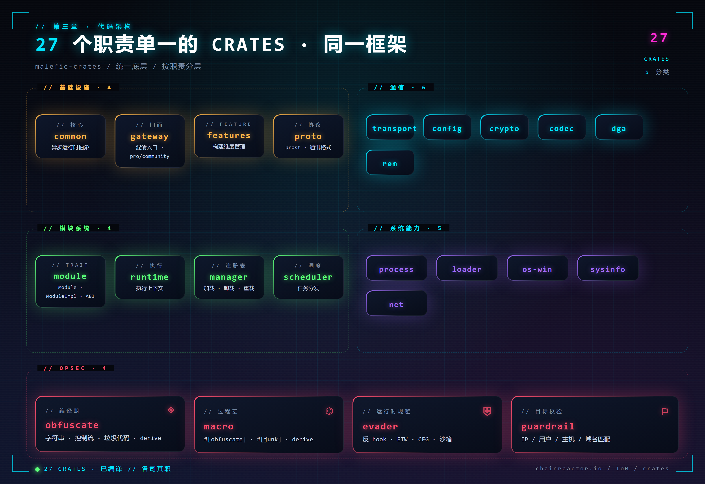

**核心设计原则**：

- **职责单一**：每个 crate 只做一件事（transport、crypto、loader、evader...）
- **运行时解耦**：`malefic-common` 抽象异步运行时，tokio/async-std/smol 一键切换
- **混淆门面**：`malefic-gateway` 统一 API，community (no-op) / professional 编译时透明切换
- **Feature 集中管理**：`malefic-features` 管理 source/prebuild × community/professional 两个正交维度
- **FFI 隔离**：`malefic-module/ffi` feature gate，C ABI 导出不会污染正常构建

```bash
cargo build -p malefic --release                              # community + source
cargo build -p malefic -F professional,prebuild --release      # professional + prebuild
```

### 其他改动

- wmi 内化，不再依赖外部库
- 适配任意 Rust 版本
- 修复近 **200 个 bug**，测试覆盖大幅提升（transport 32 + session 10 + beacon 11 + runtime 44 + 其他）
- PE loader IFT 边界检查修复、超大任务分片传输、指数退避重连

> 完整技术变更日志详见 [IoM Changelog](../../IoM/changelog.md)

---

## 四、OPSEC —— 纵深防御链 ⭐ Pro

传统的 OPSEC 思路是"在某个点加固"——加密字符串、patch API、反沙箱。但任何一个单点被突破，整条防线就暴露了。

v0.3.0 的 OPSEC 设计遵循**彻底模块化**原则：所有 OPSEC 能力被拆解为独立模块——feature-gated 编译、按需加载、模块间零耦合。这不是一条预设的固定防护链，而是一个**可编程的防护体系**：每个模块只负责一件事，按场景选择、任意组合、跨阶段复用。

这种可编程性本质上就是**AI 时代的 OPSEC 方案**。传统 OPSEC 依赖 operator 经验手动配置——哪些模块开、哪些关、怎么组合。当 OPSEC 被彻底模块化后，AI Agent 可以读取每个模块的 OPSEC 评分和 ATT&CK TTP 标签，根据目标环境动态决策：高风险环境自动启用全部防护，低风险场景精简模块以减少开销。**OPSEC 从人工经验判断进化为可编程、可度量、可自动化的工程体系**。

模块化使得**纵深防御**成为可能：不在某个单点堆叠所有防护，而是将数十个独立模块层层组装为完整的防护链。任意一个模块被突破，其他模块仍然生效。攻击者需要同时突破整条链路上的所有环节才能达成检测。

每个防护手段从三个视角发挥作用：**静态**（让分析者看不到）、**内存**（让扫描器扫不到）、**动态**（让检测器抓不到）。这三个视角贯穿整条链路的每个阶段：

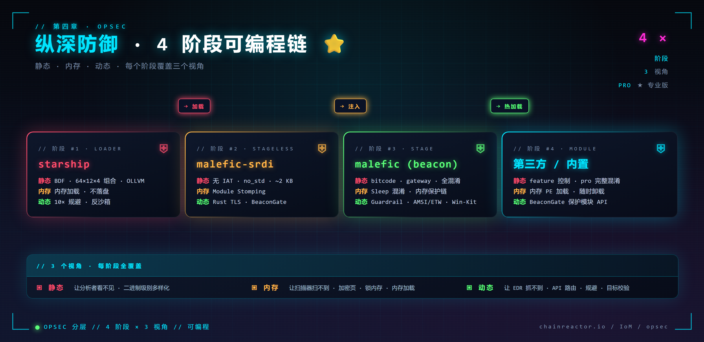

### 基础层：编译期混淆引擎

所有阶段共享同一套编译期混淆引擎。无论是 loader、SRDI、beacon 还是 module，任意阶段的代码都可以使用以下完整混淆能力：

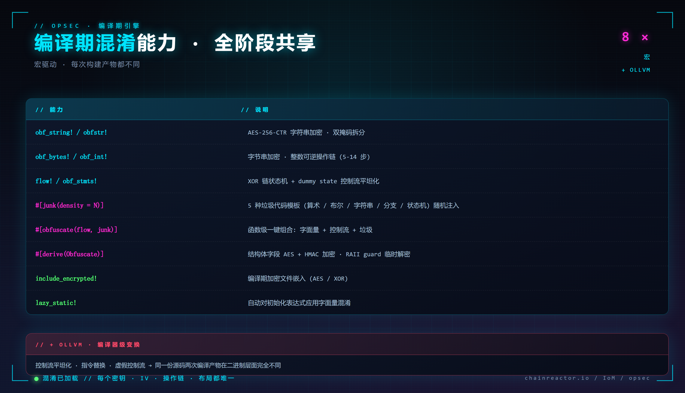

配合 **OLLVM**（编译器级控制流平坦化 / 指令替换 / 虚假控制流），形成应用层 + 编译器层双重混淆。

**每次编译生成完全不同的密钥、IV、操作链、状态机布局、垃圾代码分布——同一份源码的两次编译产物在二进制层面完全不同。**

### 通用防护手段

以下防护手段跨多个阶段复用：

- **BeaconGate** — 敏感 API 调用通过 Win-Kit 动态路由保护，避免直接系统调用被 hook 或监控
- **内存加载** — PE loader 从内存加载，不落盘，不产生文件系统痕迹

### 4 阶段防护明细

每个阶段的静态 / 内存 / 动态三视角防护能力一览：

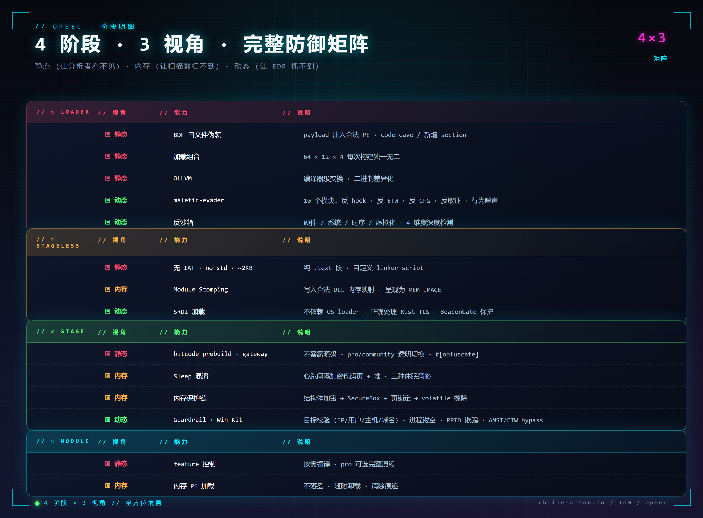

### OLLVM-Rust —— 编译器层混淆 · 一键启用 ⭐ Pro

OLLVM 是把混淆做到**编译器层**——控制流平坦化、指令替换、虚假控制流，让二进制层面每次构建都不同。`ollvm-rust` 在 v0.3.0 把启用门槛从"专家任务"压到了"`cargo build` 即可"。

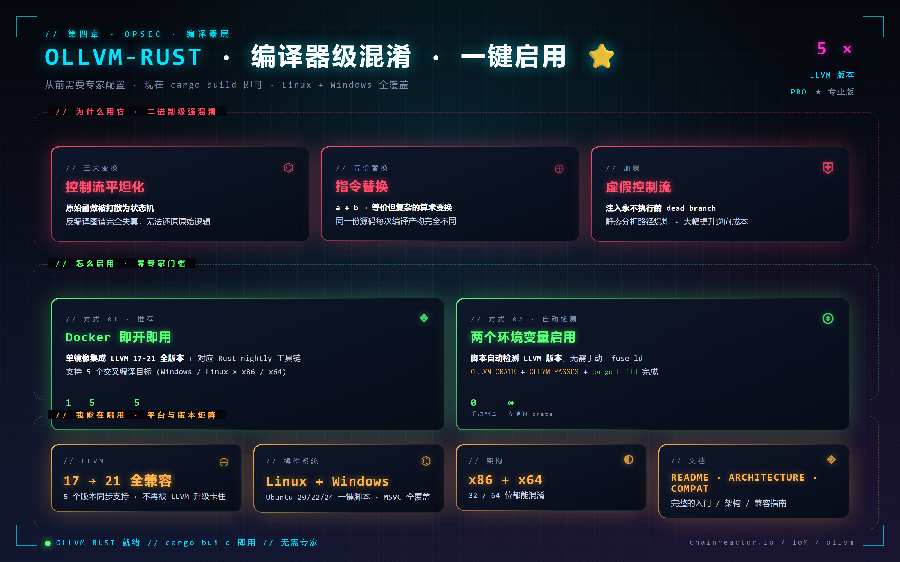

**用户视角的能力**：

- **三大变换** —— 控制流平坦化(把函数打散成状态机)、指令替换(算术等价变换)、虚假控制流(注入 dead branch)，反编译图谱完全失真
- **零专家门槛** —— 推荐 Docker 即开即用(单镜像内置 LLVM 17-21 + Rust nightly)；或设置 `OLLVM_CRATE` + `OLLVM_PASSES` 两个环境变量后 `cargo build`，脚本自动检测 LLVM 版本注入 linker
- **平台与版本全覆盖** —— LLVM 17/18/19/20/21 同步支持，Linux + Windows × x86 + x64 共 5 个交叉编译目标
- **完整文档** —— `README` 入门、`ARCHITECTURE` 架构、`LLVM_COMPAT` 各版本兼容指南

<!-- TODO: 截图 - 开启/关闭混淆后的二进制对比（strings 输出 或 IDA 控制流） -->

!!! tip "Community vs ⭐ Professional"
    **Community** 通过 `malefic-gateway` 提供透传 (no-op) 版本——所有混淆宏退化为直接内联，功能完全正确，只是不做混淆变换。**Professional** 透明接入完整引擎。两个版本的 implant 源码完全相同，仅编译时行为不同。

---

## 五、IoM for AI —— 可被 AI 驱动的控制面

这是 v0.3.0 最具前瞻性的新方向。 IoM 的 client 不再只是一个人类操作的 CLI，而是一个**可以被 AI/自动化系统调用的控制面**。

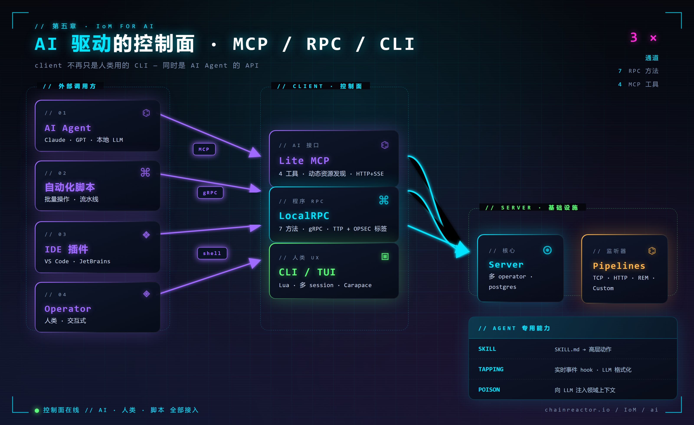

### LocalRPC

client 内置 gRPC `CommandService`，提供 7 个方法最小，外部程序可以像操作cli一样驱动 IoM：

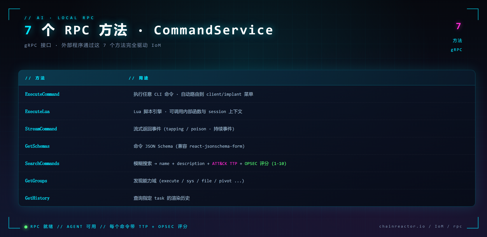

每个命令自带 **ATT&CK TTP 标签**和 **OPSEC 安全评分**（1-10），AI Agent 可以据此做安全决策。通过 `session_id` 字段指定目标 session，实现 agent-id 路由。

### Lite MCP

MCP 是 LocalRPC 的协议适配层，AI Agent 无需硬编码命令列表，运行时动态发现 IoM 的全部能力：

- 4 个核心工具：`execute_command`、`execute_lua`、`search_commands`、`get_history`
- 动态资源发现：Cobra 命令自动注册为 MCP resource（`uri://<command_path>`）
- HTTP + SSE 双传输
- 内置 prompt："greeting"（IoM 功能介绍）、"c2_command_execution"（操作指南）

### Skills / Tapping / Poison

- **Skill** — 基于 SKILL.md 格式（YAML frontmatter + Markdown body），将命令组封装为高层语义动作（如"横向移动到目标 X"）。三级发现：本地 `./skills/` → 全局 `~/.config/malice/skills/` → 内嵌社区 skills。支持 `$ARGUMENTS[N]` 参数替换
- **Tapping** — 实时监听 implant 事件流。注册 EventHook → 执行命令 → 按 task_id 过滤 → 流式输出。LLM 事件格式化：Request/Response 指示器、工具调用参数、结果元数据（exit code、wall time）
- **Poison** — 向 AI 上下文注入领域知识（网络拓扑、凭据、目标环境信息），减少不必要的工具调用，提升决策准确度

IoM 预置了丰富的编程用 Skill，覆盖从模块开发到 implant 配置到 OPSEC 策略编排的完整二开流程。AI Agent 加载对应 Skill 后，即刻掌握 IoM 的架构约定、API 用法和最佳实践，无需 operator 花大量时间学习框架细节——**Skill 就是给 Agent 的上手文档，加载即用，零学习成本**。

### AI Agent Module

AI Agent 不是一个外部服务，而是作为**标准 malefic module 运行在 implant 内部**：

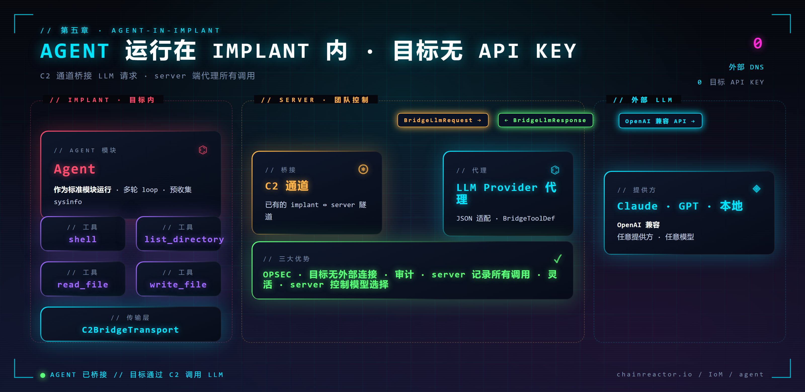

- **C2BridgeTransport**：LLM 请求通过 C2 通道桥接到 server，implant 无需 API key、无需直连互联网
- **内置工具**：shell（命令执行）、list_directory（目录列表）、read_file（文件读取，支持 offset/length）、write_file（文件写入，支持 append）
- **DynamicTool**：server 端通过 proto `BridgeToolDef` 动态注册工具，schema 自动注入给 LLM
- **多轮 agent loop**：max_turns 可配置，支持持续交互直到任务完成
- **预收集优化**：sysinfo 等基础信息预收集后注入 prompt，减少工具调用轮次

Server 端 LLM Provider 代理所有 API 调用，优势：OPSEC（无外部连接）、审计（server 记录所有调用）、灵活（server 控制模型选择和切换）。

---

## 六、Server/Client —— 可编程控制面

与 implant 的 OPSEC 模块化一脉相承，Server 和 Client 同样遵循**可编程**设计。Client 通过 Lua 脚本引擎提供动态编排能力，Server 通过丰富的扩展接口（Pipeline、Plugin、Builder、RPC）提供可定制的基础设施。整个 IoM 从 implant 到 server 到 client 形成统一的可编程体系——operator、脚本、AI Agent 都能通过各自适合的接口驱动。

### CLI / TUI 重构

**Lua 脚本引擎**：Client 内置 Lua 运行时，可以直接编写脚本编排复杂操作流程。Lua 脚本可访问 session 上下文、调用所有内部函数、控制命令执行流程——从简单的批量操作到复杂的多阶段攻击链编排，不再依赖手动逐条输入。LocalRPC 的 `ExecuteLua` 方法让外部程序也能驱动 Lua 脚本执行。

**双模式 CLI**：Client 模式（服务器管理）+ Implant 模式（session 交互），根据活跃 session 自动切换，各自独立的命令历史。

**Quickstart 向导**：首次运行自动进入交互式初始化。

**Prompt**：状态行 + `session-id ❯` 格式，动态显示 listener/session、连接状态、任务队列、OPSEC 评分。30+ 命令组（basic/agent/file/sys/pivot/execute 等），Carapace 自动补全，命令别名。

**Terminal Multiplexer**：多窗口支持，同时查看多个 session 输出，类似 tmux 分屏。

其他：异步日志不阻塞输入、inline suggestion、bracketed paste、usage hint、表格自适应、profile show、daemon mode。

### v0.3.0 新增的扩展接口 —— gRPC / LocalRPC / MCP / Lua

v0.3.0 把 client 从"只能人类用的 CLI"扩展为**面向 AI / 脚本 / IDE / Operator 四类调用方的可编程控制面**。Listener / Pipeline 这一套老的 server 管理能力依旧通过 gRPC `ListenerRPC` 暴露(Pipeline 生命周期 Register → Start → Stop → Delete + `SyncPipeline` 热更新),但**真正新增的能力是下面这四个扩展接口**:

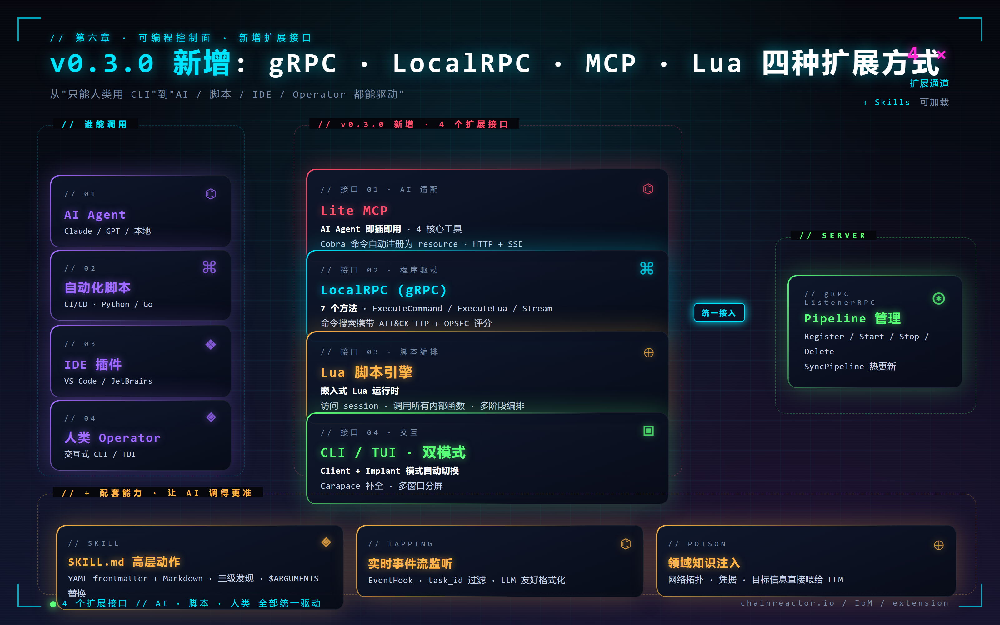

- **Lite MCP** — AI Agent 即插即用,4 个核心工具,Cobra 命令自动注册为 MCP resource,HTTP + SSE 双传输
- **LocalRPC (gRPC)** — 7 个方法驱动 client(`ExecuteCommand` / `ExecuteLua` / `StreamCommand` / `GetSchemas` / `SearchCommands` / `GetGroups` / `GetHistory`),命令搜索携带 ATT&CK TTP + OPSEC 评分(1-10)
- **Lua 脚本引擎** — Client 内置 Lua 运行时,可访问 session 上下文,调用所有内部函数,实现批量与多阶段攻击链编排
- **CLI / TUI 双模式** — Client 模式(server 管理) + Implant 模式(session 交互)自动切换,Carapace 补全,多窗口分屏

**配套能力**(让 AI 调得更准):

- **Skill** — `SKILL.md` 高层动作封装,三级发现(本地 / 全局 / 内嵌),`$ARGUMENTS` 参数替换
- **Tapping** — 实时 implant 事件流监听,EventHook + task_id 过滤 + LLM 友好格式化
- **Poison** — 向 LLM 注入领域知识(网络拓扑 / 凭据 / 目标信息)

**Server 配套**:

- **Certificate 管理** — `GenerateSelfCert`(自签名一键生成)/ `GenerateAcmeCert`(Let's Encrypt ACME DNS-01 自动申请)
- **在线构建** — `Build` / `SyncBuild` RPC,server 端直接编译 implant 并分发

### Build / Profile / Plugin

Server 提供多种 Builder 扩展接口，支持从模板到部署的自动化流水线：

- **PatchBuilder**：加载 config → 检测 transport → 匹配模板 → patch 二进制，快速生成变体
- 多种 Builder：ActionBuilder（GitHub Actions）、DockerBuilder、SaasBuilder、SRDIBuilder
- 跨平台模板：Windows / Linux / macOS × TCP / HTTP / DNS / REM
- **Profile 持久化** / 可配置 Malefic Root / 模块命令整合
- **Plugin 生态**：多 embedded plugin、MAL zip 安装、EvilClaw 集成

### 测试与稳定性

大量新增 unit / integration / E2E / race test，覆盖 Server 并发、Listener 边界、下载恢复、Runtime 异常、命令解析。CI 持续回归。

---

## 七、AI Native Offensive Infrastructure

现有 C2 框架的所有设计决策都默认了一个前提：**最终用户是人类 operator**。CLI 是给人看的菜单，README 是给人读的文档，OPSEC 配置依赖 operator 的脑内模型。这一代 IoM 转向**面向 AI 与人协作**——不是给 AI 加一个外挂接口，而是从架构底层把 AI 当作一等公民。

!!! note "AI Native 的本质是构建 AI First 的 Harness Engineering"
    AI Native 不是引入新技术，而是把所有原本"留在人类脑子里"的**隐性知识**——文档、经验、决策、边界——**显式翻译为机器可处理的工程对象**。

!!! note "可观测 + 可度量 + 可组合，是 AI 决策的三个前提"
    这三件事本来就是好软件工程的通用原则。所以 "AI Native" 真正改变的不是"AI 能不能用"，而是**系统的不变量是什么**——从隐式的人类经验，变成显式的工程对象。这种显性化首先服务 AI，但同时让人类受益（新人上手更快、跨场景复用更容易）。

!!! note "「Agent 在哪里需要决策，就跑在哪里」"
    传统 AI 应用：server 远程决策 → implant 远程执行（决策延迟 = C2 往返时间）。IoM 的设计：**Agent 作为标准 module 跑在 implant 内**，把 LLM 决策推到目标边界。"AI 一等公民" 在系统拓扑层面的体现——不是外挂，是**架构内置的一类用户**。

前六章看似零散的重构，本质上都是这场 **Harness Engineering** 的不同侧面。我们也无法在当下定义 AI Native 的进攻性基础设施是什么样的，因此在各个方向上都进行了激进的探索。

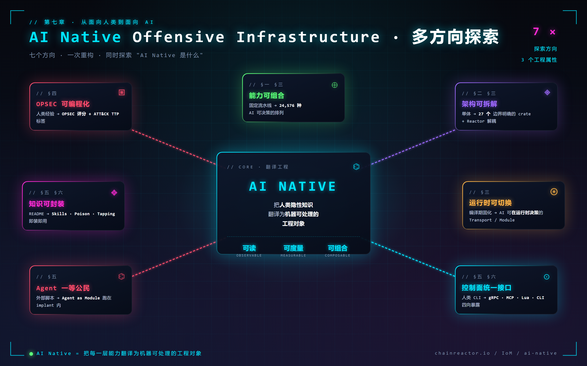

### 结语 —— 基础设施的意义是打破壁垒

本质上，我们前面所有的基础设施改进，都是为了**打破各种各样的屏障和壁垒**——跨语言的 module 编写、跨生态的混淆编译、跨平台的编译能力、跨运行时的 transport、跨阶段复用的 OPSEC、跨调用方的控制面……每一项重构都在拆掉一堵墙。

**我们不会通过基础设施限制 AI 的能力，而是通过基础设施打破原本的壁垒。**

壁垒消失之后，AI 能做什么、operator 能做什么、二者如何协作——这些问题的答案不在框架里，**而在使用者手中**。v0.3.0的IoM只有熟练运用AI的使用者才能发挥最大的能力。**期待你的想象**。
