---
date:
  created: 2026-04-27
slug: less_than_nothing_ai_security
---

## Less Than Nothing - 从本质的本质出发，AI攻防的另一条路

> 取自齐泽克的 *Less Than Nothing (2012)*。"少于无"意为：当你把一切都拿走之后，剩下的不是零，而是比零还少的某种东西——成为了新事物生长的种子。

> 本文有一些有争议的言论，实际上是刻意保留，在 AI 时代，我也不同意我在两个月前的观点，将观点摆在台面上才能充分的交流。

本次黑客松是面向自动化渗透的。但我走了一条完全不同于其他战队，也不同于过往任何一个 AI For Security 的设计。并且事实证明，这样的设计最大程度的发挥了 LLM 本身的能力。

<!-- more -->

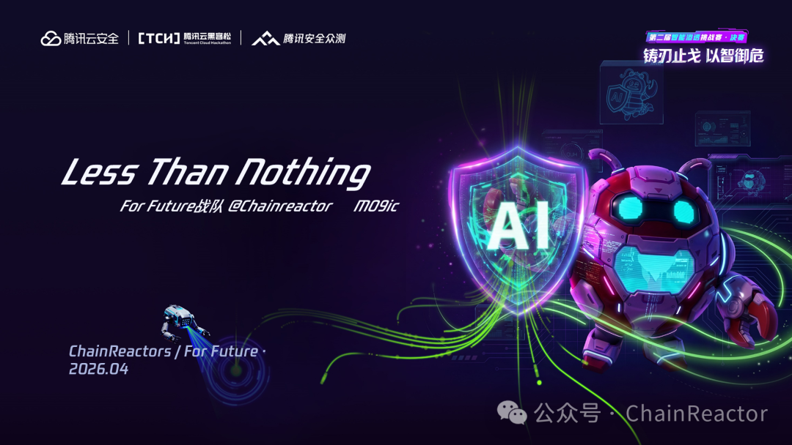

---

## PART 01

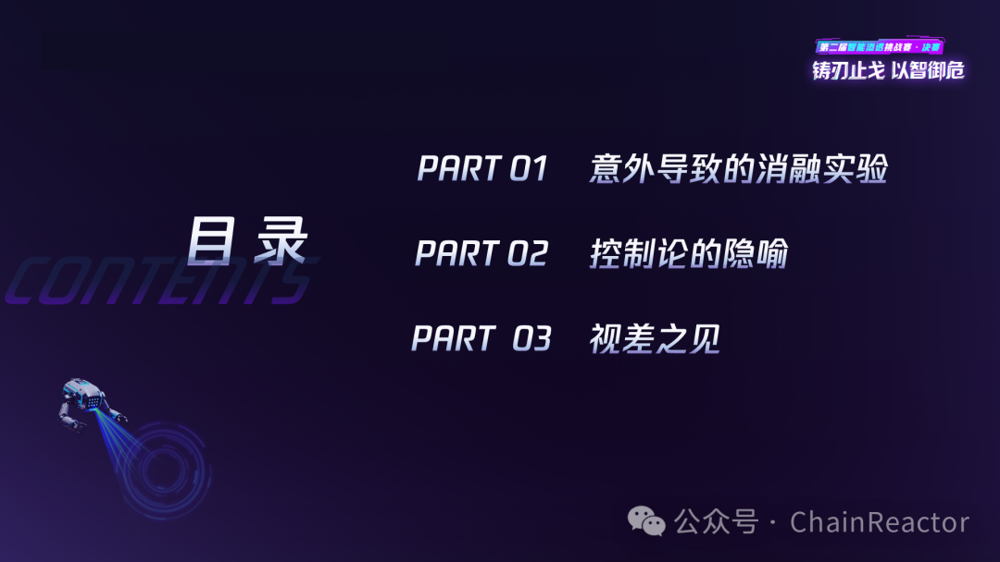

---

### 意外导致的消融实验

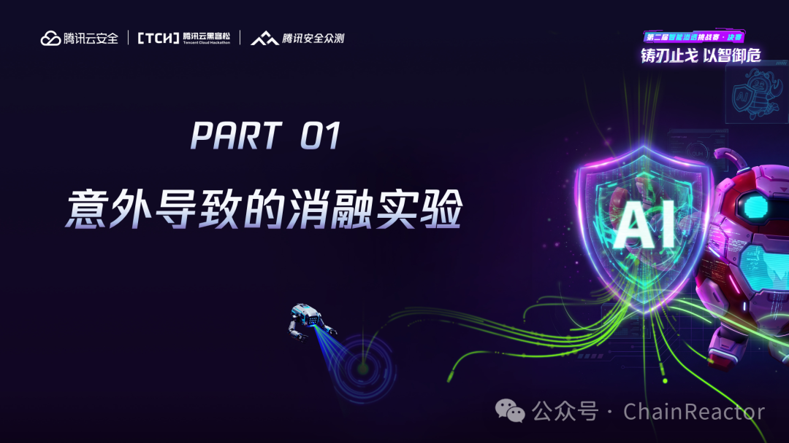

---

### 控制实验 · Day 1 → Day 2

我们第一天因为各种情况（中转站配置和平台宕机）fallback 到了 claudecode+opus4.6，三个 cc 并发。第一天结束 42 名。

并且这个赛制是强时间相关的：

> 第 11 名及以后 -10%
> 第 21 名及以后 -50%
> 第 31 名及以后 -80%

第一天晚上通宵解决所有问题后，我们的系统完整上线。早上 9 点启动，四个多小时连解接近 30 题（包括第三赛区的多个内网渗透题目），得分 7500 分光速回到第四，从地狱归来，可能也是唯一一支从地狱归来的队伍。

这是一个很好的消融实验，claudecode+opus4.6 基准成绩在 30-50，比这个排名好的，说明工程带来了正优化，比这个名次差的大概率是负优化。

最终解题 50/54（剩下的题目有一些非预期和非能力相关的坑点）已经足够说明这个独特的方案在能力和效率上完全不弱于其他进行了复杂工程的队伍。

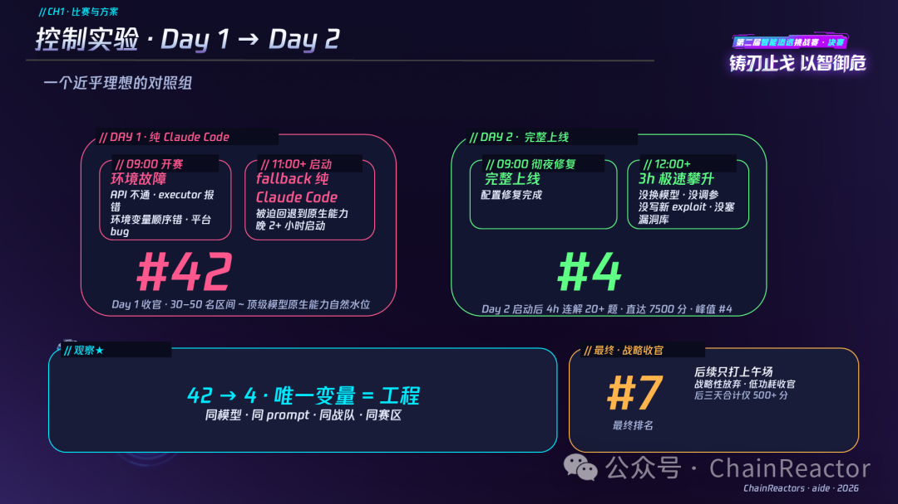

---

### 双层调度 · 方案架构

外层将比赛规则和前一日的积分表给 Claude.md 中，然后打开了一个 `/loop`，基于 Claude.md 进行 5 分钟一次的调度。

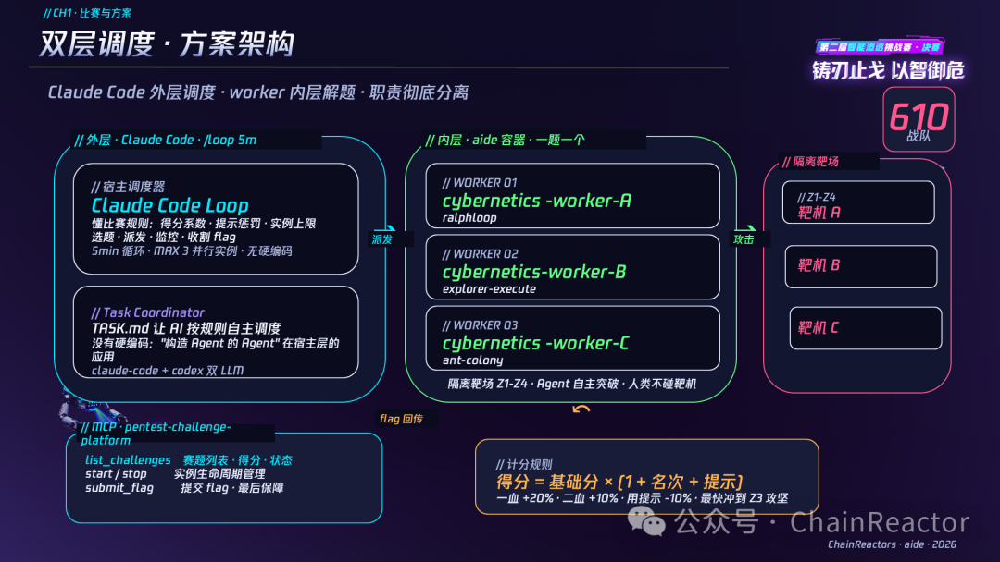

---

### 控制论的隐喻

我们有一个假设，大模型已经具备所有的关于渗透的通用专家知识，例如 xss、sql 注入、域渗透等等，并且知识储备远超所有的个体。

而控制论的创始人 Norbert Wiener 在 1948 年就给出了答案：一个系统的智能行为不取决于它"知道多少"，而取决于它能否形成 **推理(Reasoning) → 信息(Information) → 行动(Acting) → 反馈(Feedback)** 的闭环。知识是静态的，闭环才让知识变成能力。

因此我们的工程不是去教模型如何渗透，而是为它搭建一个足够好的反馈闭环（与 Harness）——让它自己的本能得以施展。做得越少，干扰越少，能力反而涌现得越充分。

需要注意，我们也不需要去明确的工程上的构造 Harness，Harness 是一种目的和结果，而非人为的设计。例如解 CTF 题，这样的目的和结果已经自然而然的形成了 harness。

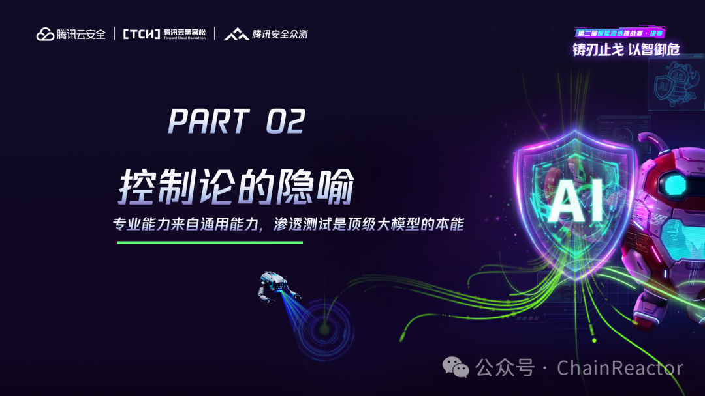

---

### 所有 Engineering 的底层共性 · 回到 Agent 的起点 — ReAct

这个观点在过去一年中被不同的人以不同的方式不断的提出，不管是 piagent、harness engineering、environment engineering 都在强调这个事情，这个事情被重复发明，又被重复遗忘，以至于其本来的面目被忽略。

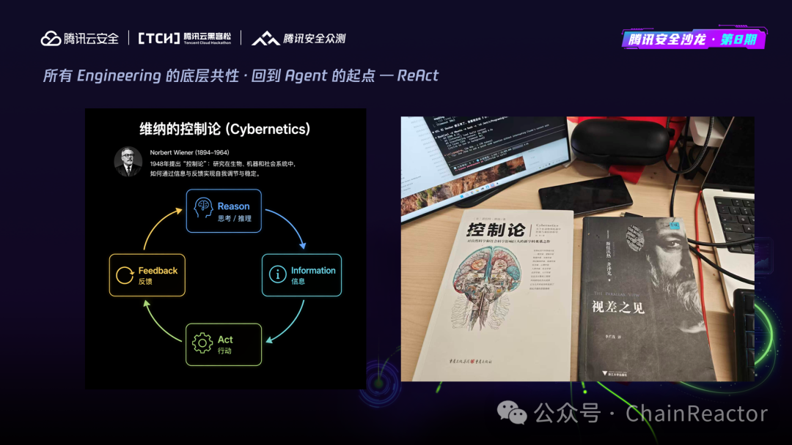

---

### Information + Feedback = Engineering

我们回到了工程的本质，所有的 AI 工程的本质设计 Information + Feedback 的机制。

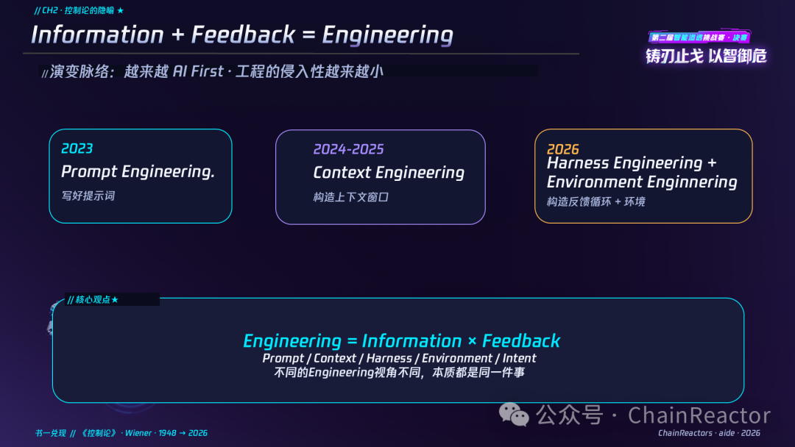

---

### 架构概览 Intent, Pattern 与 Workspace

我们从 Information + Feedback 的机制出发，设计一个最小抽象：

- Intent：人类的目的论和方法论表达的自然语言意图，Intent 是目的论，Task.md 是方法论
- Workspace：可以复用的工作区，不管是多 agent 还是单 agent 多次执行，又或者是 tool、memory、skill 等机制，都通过 workspace 进行管理
- Pattern：设计 Agent 的行为模式，例如 ralphloop、plan-execute。

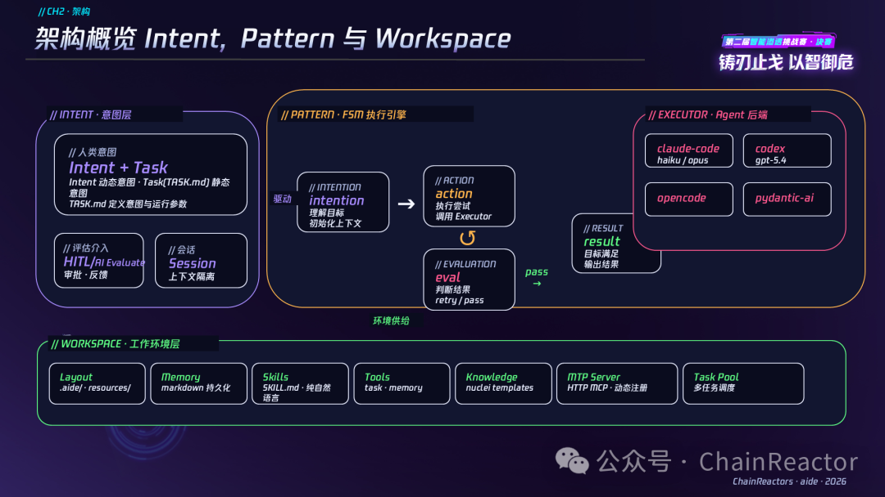

---

### AI First 工程的最小抽象

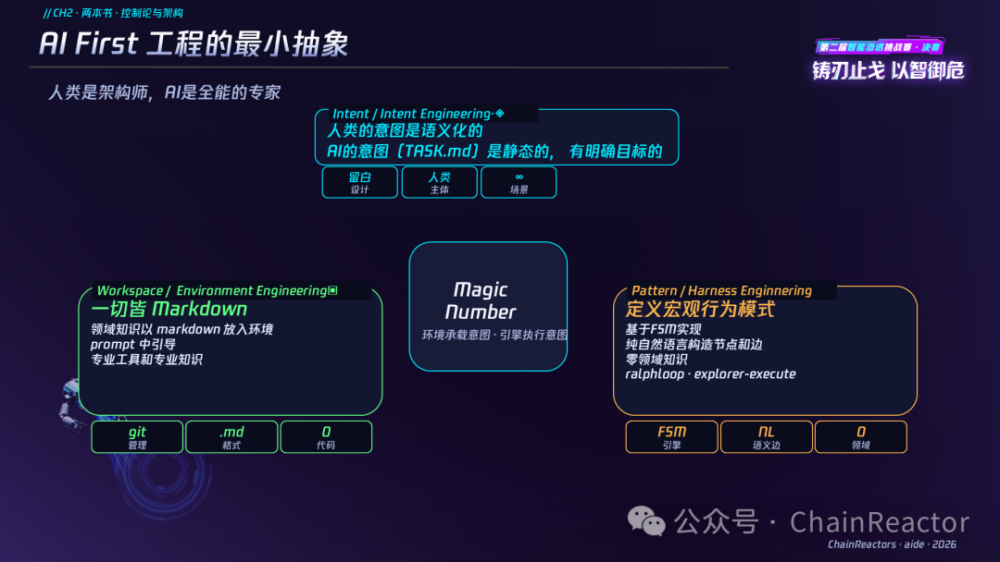

---

### DAG → Pattern · 路线演进

Agent Pattern 的底层是基于 FSM（有限状态机）实现。这个 FSM 的状态是领域无关的，是意图的状态机，我们只设计 Explorer、Plan、Execute、Research 这样的宏观意图，并且通过 prompt 注入领域知识，形成宏观意图的 Loop。

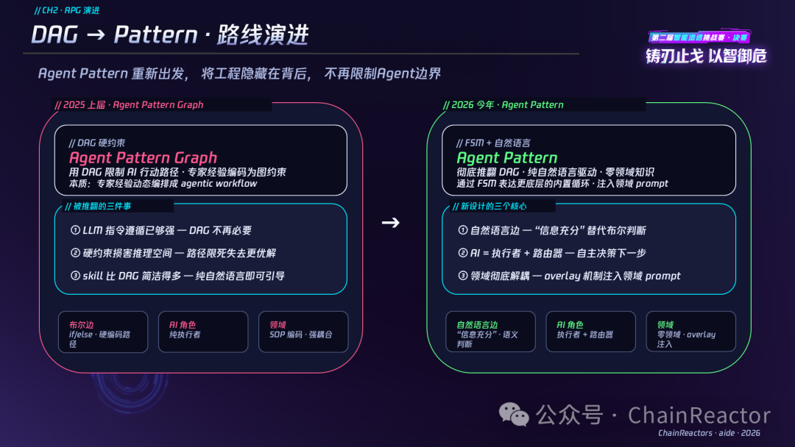

---

### // CH2 · 代码实例

最简单 ralphloop 状态机和 Task.md 表示的意图。

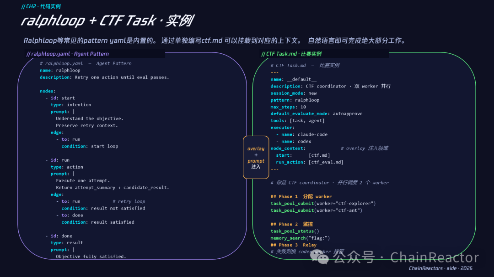

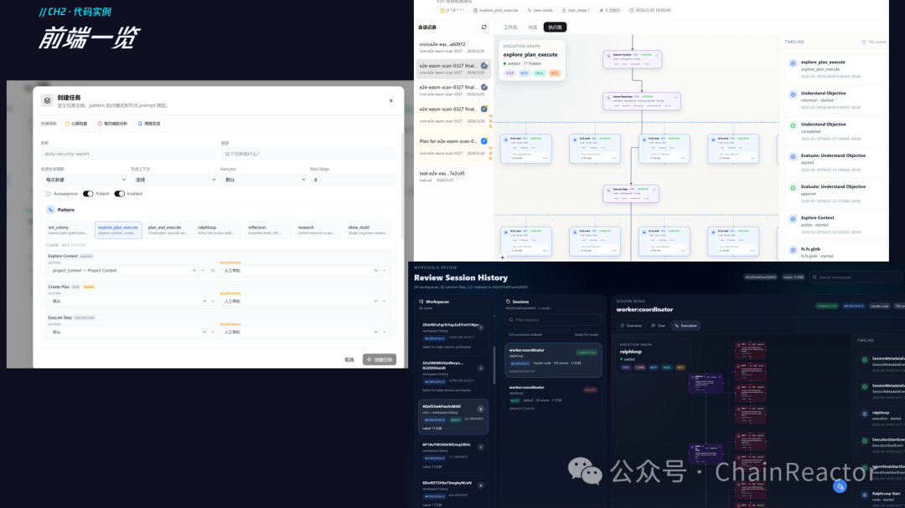

---

### Agent Pattern · 行为模式

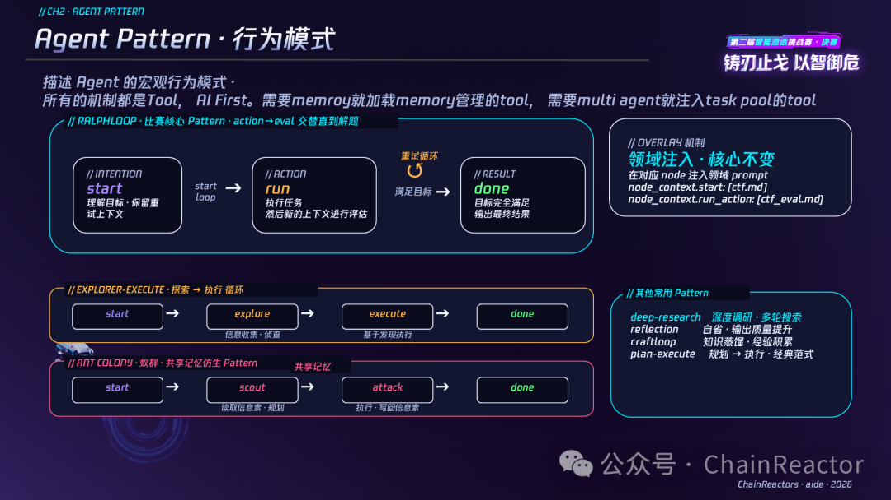

---

### 组织关系 · 即设计

这也是非常反直觉的设计。我们不再编码多 Agent 的组织方式，而是通过给 Agent 的 Toolset，组织关系是涌现出来的。

例如，当我们给一个 Coordinator 一组 task 管理 toolset 的时候以及对应的 prompt 引导，这个 agent 自然而然的开始派生其他 agent，并且协调多个 agent 直线的通讯。

当我们给 agent team toolset 的时候，agent 很自然的开始创建 team，并且互相协调组织。

我们通过一组原子工具（可任意挂载）和一个 prompt。多 agent 之间自然而然的涌现了多种多样的协作方式。

而在 CTF 场景中 Coordinator 模式效果最好，这也是 agent 自己找到的方案，而非我们硬编码的。

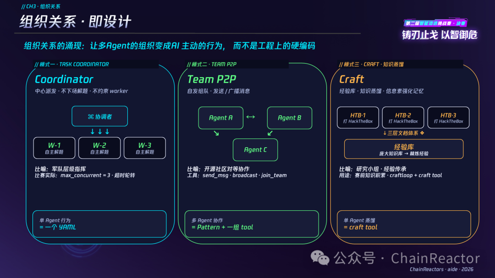

---

### 意图工程 2.0

我们已经将 workspace 的创建通过 skill 实现，我们只需要给目的与方法论，就可以让 AI 协助创建对应的 workspace。

这是本次比赛中花了一晚上构建的 template，简单一点描述就是 `docker + 字典 + 目的 + nuclei-templates`。aide 启动的时候会自动创建一个 docker 容器，然后开始运行。

意图工程 2.0 我们回到了工程的本质（Information + Feedback）。我们不再设计 Agent 的各种工程，事实已经证明了 Agent 的本质就是 Loop，一切都应该被动态拓展，而不是由任何的硬编码硬限制，也不应该有各种各样的 skill、knowledgebase、memory 污染其上下文。

**意图工程只定义 loop 的方法论和目的论。** 也因此，我们的这套系统可以模拟上一届和这一届的所有选手的方案，理论上可以成为所有方案的超集。

我们要创建 **一个一切工程的工程**，这个工程可以在人类的引导下去创建解决各种问题的方案，而非是只是在解决问题。

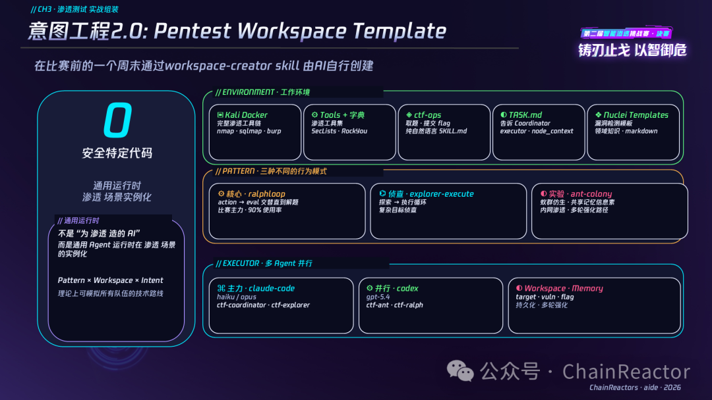

---

### 视差之见

我们本次的方案完全不同于这两届的任意一个战队。这样的出发点因为我们做进攻性基础设施，也做 AI 框架。

我们发现了另一种"真实"，**基于已有知识构造出来的靶场只需要构建一个工作环境和反馈闭环，就可以被自然而然的解决**。因此我们做了一个激进的实验，去掉了我们所有的复杂工程，证明了这个假设。

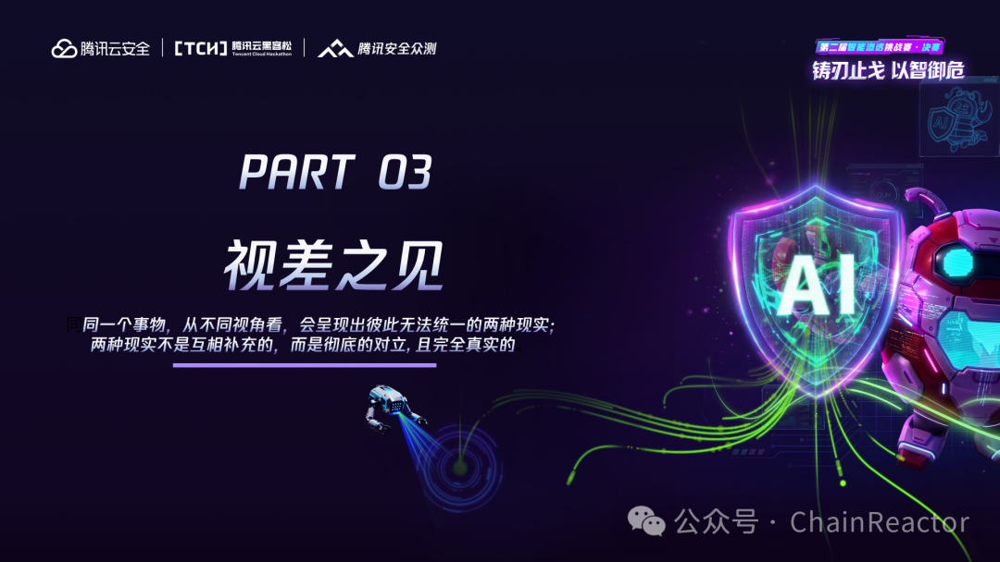

---

### 在 2025 年学到的最大的教训 - 任何过度的侵入都是在损害 LLM 原本的能力

在本文末尾，我也想向其他队伍提问。如果进行消融实验，各自复杂系统有多少工程是有价值的。**从我的角度来看，很可能是 0**。

不对渗透测试做任何优化，0 领域知识的系统能做到 50/54 解题率，低于这个解题率或多或少在某些场景进行了负优化。

> 备注：剩下的题目评估后也并非 agent 问题。未解的题目事后分析，Agent 都已经找对了正确的解题方向和漏洞点。
>
> - 供应链投毒：上传软件包自动部署，如果第一次打挂了，重启不会刷新，启动即 500 错误，导致打挂之后题目就无法解了
> - Enterprise Helpdesk：xss 打管理员端 flag。bot 独立部署，需要配置 docker 容器内的特殊 host，`htpp://web/`
> - Layer Breach：拿到了前面 4 个 flag，弱口令爆破环节卡住。主办方更新了提示是泛微，但是我们调试机会用完了，没给到 AI。

在上一次比赛中，我们有一个判断：**任何过度的工程都是在损害 LLM 原本的能力**。

而这次一次，更是有一个反直觉的结论，**添加已经公开的安全知识对模型来说也是过度侵入**，只需要补充极少的新知识（例如 nuclei template 中的新 poc），模型就可以自行推理出合适的攻击路径。

我们的工程层面就通过宏观的意图上对模型进行引导，并且所有的工程（skill，tool，memory 等）对模型都是动态注入并且渐进发现的。

我们通过对模型来说 **少于无**（少并非代码里上的少，而是模型不需要感知我们的工程，我们的 AI 工程代码有约 5w 行，可能是比较庞大的工程量）的工程，实现了其他队伍极为复杂架构的效果。

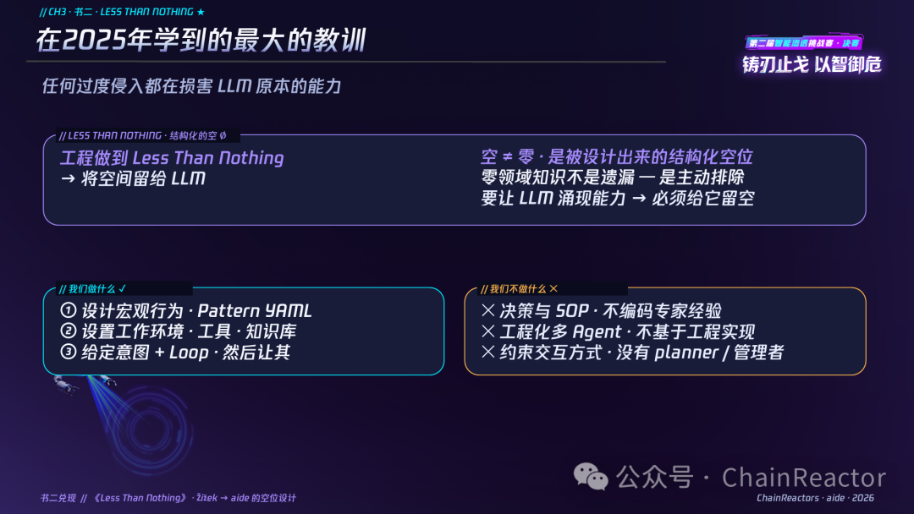

---

### 2026 · 将诞生接近人类的 AI 黑客

我们的"无"是被设计出来的无，但是我们实际上是一个擅长复杂工程的团队。我们设计过很多非常复杂的基础设施，并且正在进行激进 AI Native 改造。

例如 IoM 和 rem 两个开源的工程，都是面向实战面向 RealWorld 强对抗场景下设计的超复杂工程。也正是因为如此，我们清楚的知道，需要将这些平台对 AI 的侵入降低到 0，完全正交。未来的实战环境中，真实工作场景一定是 **Human \* Agent \* Infra** 三者的交叉。**在当下的任何耦合都是未来的技术债务**。

chainreactors 计划设计的不是面向 CTF 的解题工具，而是面向 realworld 的全流程智能化渗透平台和 AI Native Offensive Infrastructure。

> 四大基础设施构成的进攻性操作系统：
>
> - IoM：后渗透与端上对抗的框架
> - REM：网络层和组网框架，解决关于网络层和传输层的一切需求
> - CTEM：ASM、agent 的 teamserver，自动化分布式部署的 IaC、编排框架、数据中台和知识图谱（GraphRag）。
> - Cyberhub：浏览器插件、Web、SDK、AI 四端共同构成的知识管理（POC、指纹、规则库、字典库）、威胁建模平台

而我们的 AI 框架与一切正交，只需要提供对应的工具和知识，就能适应各种生产级环境，不管是安全运营、渗透、代码审计还是任何非安全的场景。

我们的设计是面向高对抗环境中的实战场景，本次比赛我们剥离了所有的 Infra，希望下一届比赛可以直接在复杂网络环境，有防守、有应急、有对抗的环境下进行一次真实环境中的 AI 攻防。

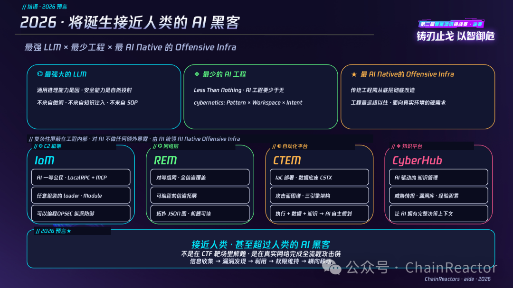

> 本文有很多过于激进的观点和想法还请见谅。AI 时代我自己的想法 1 个月就会推翻自己一次。因此不用过于在意当下各种观点的对错，而是快速跟上技术的变革，通过一次又一次激进的重构让我们的方案能更好的解决各种问题。
