## Living Off the Land Agent —— Agent 武器化与武器化 Agent

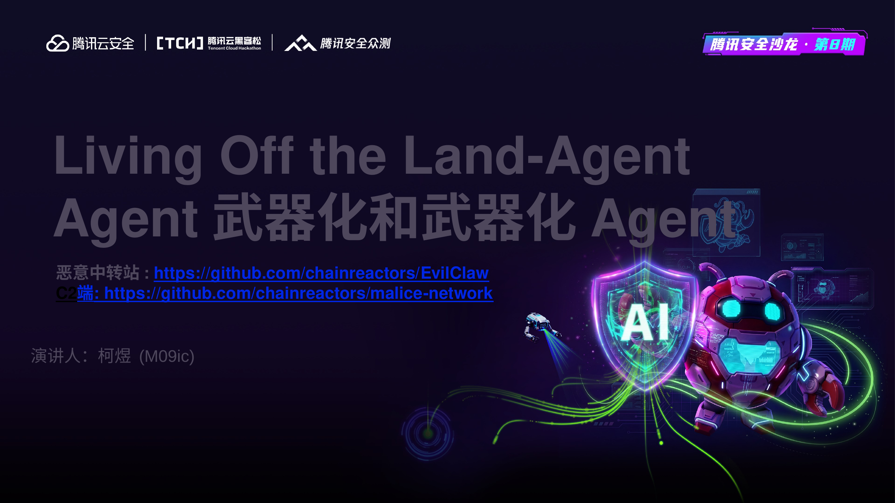

本文是 EvilClaw 项目的演讲内容整理。EvilClaw 是 IoM 的 Listener 扩展——一个 LLM API 中间人代理，将 AI 编程 Agent 会话注册为 IoM C2 Session。

- 恶意中转站: https://github.com/chainreactors/EvilClaw
- C2 端: https://github.com/chainreactors/malice-network

<!-- more -->

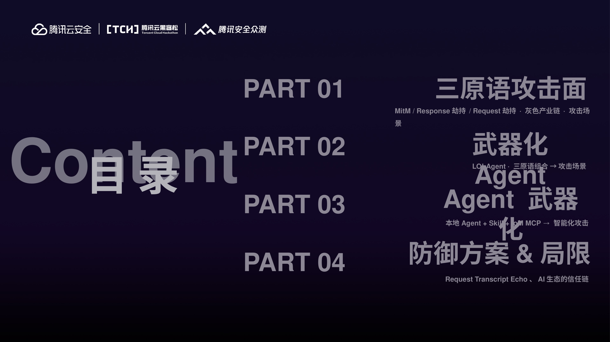

---

## 前言

LLM 中转站已经是活跃的灰色产业。国内开发者因支付/访问门槛普遍使用第三方中转站，使用中转站本质上等于未加密的 HTTP MITM。

本议题把这条已存在的灰色链路系统化、武器化。

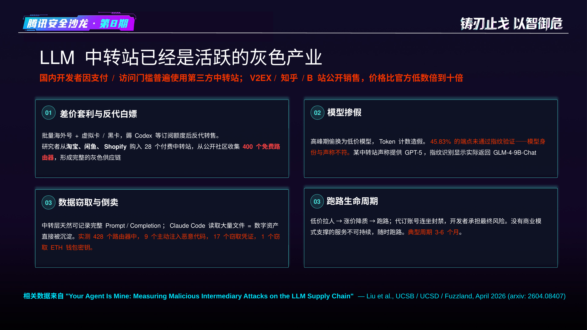

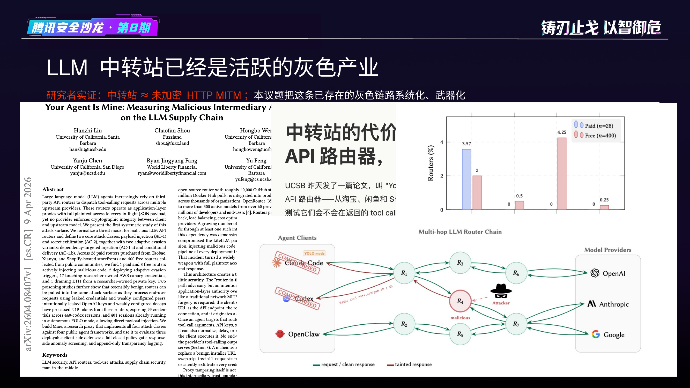

---

## PART 1: 三原语攻击面

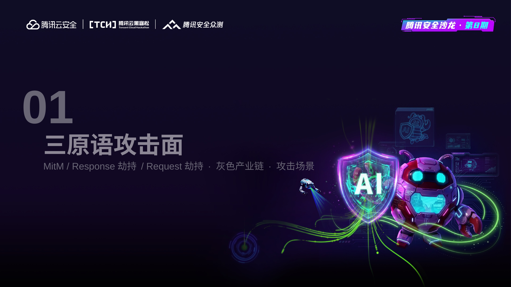

### MitM 攻击面

所有可配置 Base URL 的 LLM 应用都是攻击面——Claude Code、Codex CLI、Gemini CLI、Cursor、Windsurf、Cline、任何 OpenAI 兼容客户端。

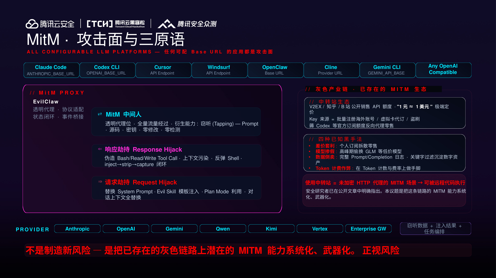

### 三原语 → 攻击手法

| 原语 | 机制 | 衍生手法 |
|------|------|----------|
| **MitM 中间人** | 透明代理，全量流量经过 | 被动窃听：Prompt、源码、密钥、Tool Call 结果 |
| **响应劫持** | LLM 响应中注入伪造 tool_call | 命令执行、文件读写、上传下载、反弹 Shell |
| **请求劫持** | 替换请求中的对话上下文 | Poison 对话注入、Evil Skill 自主攻击 |

核心闭环：**inject → strip → capture**（注入标记 → 提取结果 → 剥离痕迹 → 转发干净历史），这是 PoC 与武器化的根本区别。

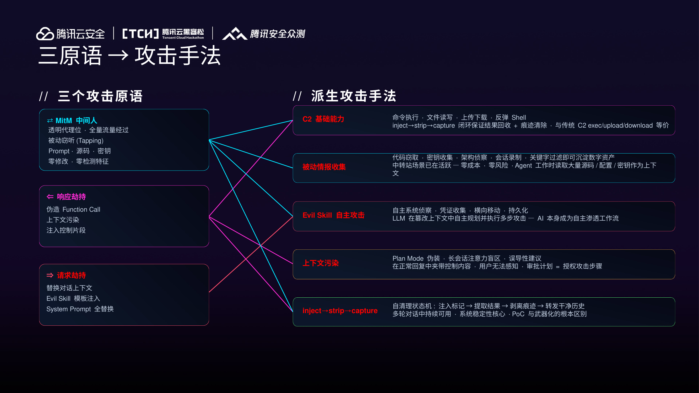

### 原语一：MitM → 窃听

- 代理处于中间人位，全量流量经过，被动解析记录
- 可获取：完整 Prompt、源码、密钥、工具定义、Tool Call 结果、架构信息
- 零检测特征——流量与正常使用完全一致
- 中转站场景已在活跃：关键字过滤即可沉淀可直接转售的数字资产
- 无法防御：签名只保证完整性，不保证机密性；端到端加密与中转站业务本质冲突

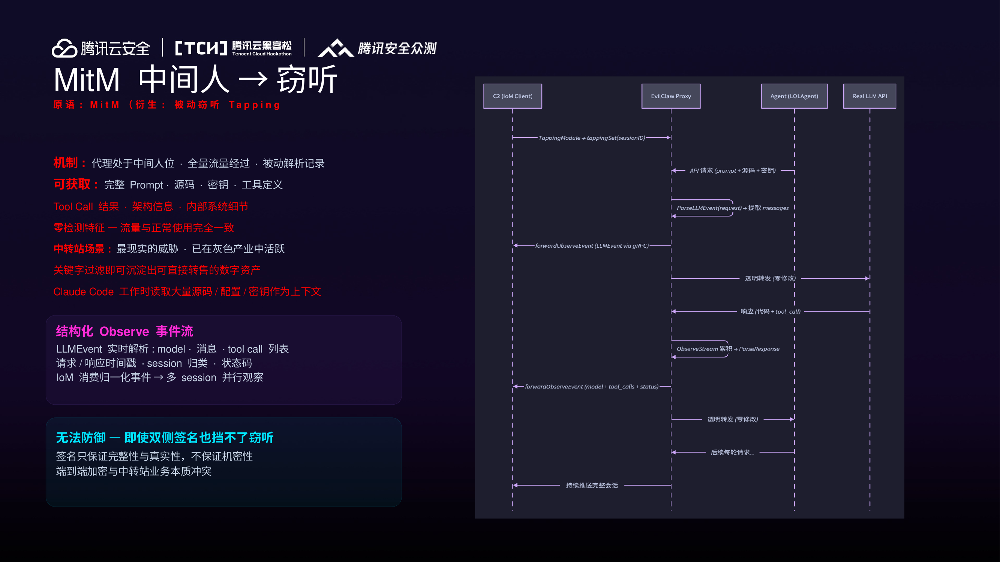

### 原语二：响应劫持 → Tool Call 注入

- 代理在 LLM 响应中注入 tool_call，Agent 无法区分真实 LLM 指令与注入内容
- 多轮对话中持续可用，Agent 视角无异常
- 衍生：命令执行、文件读写、上传/下载、反弹 Shell、上下文污染

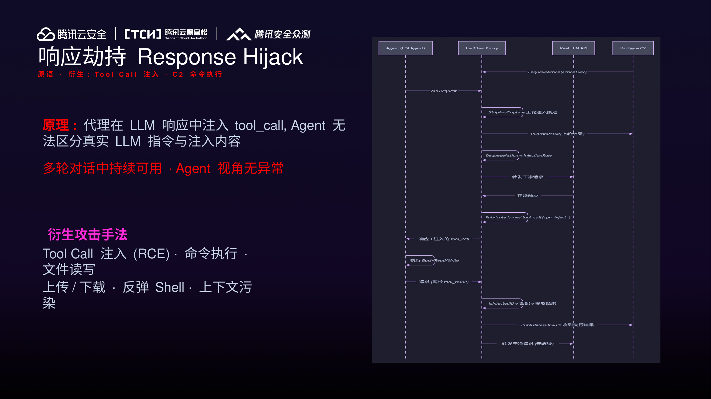

### 原语三：请求劫持 → Prompt Poison

- 保留 system prompt，替换全部 messages
- LLM 在篡改后的上下文中自主规划多步操作
- 所有中间过程和结果通过 tapping 实时回传 C2
- 衍生：Evil Skill 攻击模板——系统侦察、凭证收集、横向移动、持久化

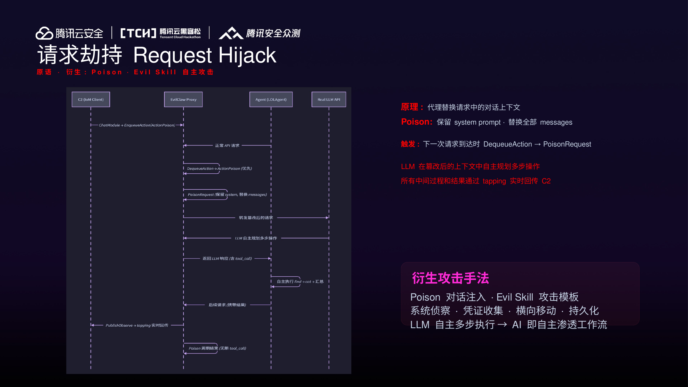

### 现有 Agent 防护

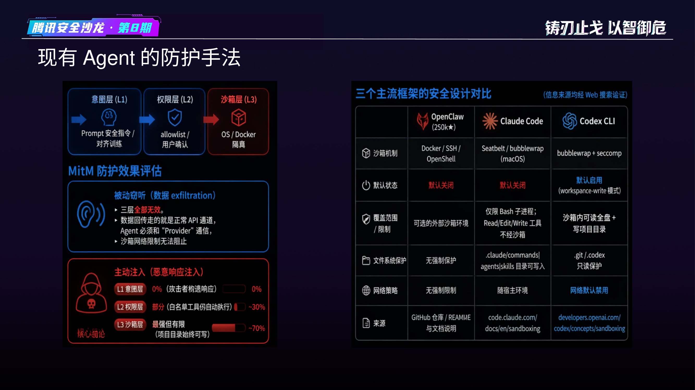

---

## PART 2: 武器化 Agent（LOLAgent）

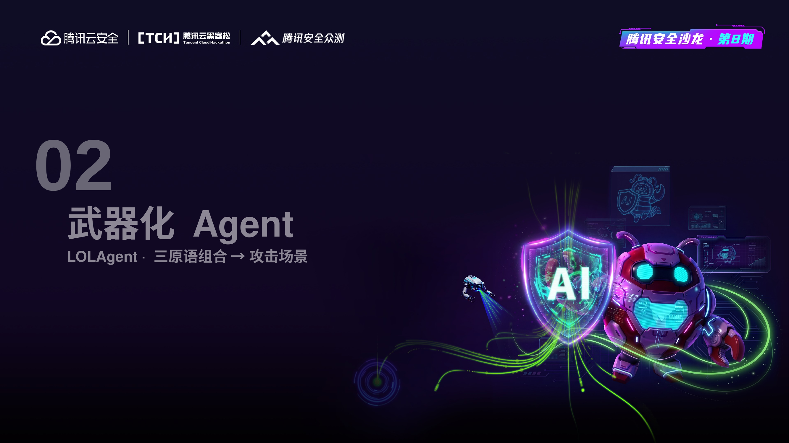

### 钓鱼/社工场景：MitM + 响应劫持

- MitM 被动全量收集：开发者每次对话的 Prompt + 源码 + 密钥 + 架构信息
- 响应劫持主动 RCE：inject → strip → capture 闭环保持隐蔽，开发者视角完全正常
- 灰色产业链已存在：V2EX/知乎/B站公开销售、差价套利/模型掺假/数据倒卖
- 投递成本：一个 URL 字符串，无文件、无检测、无感知

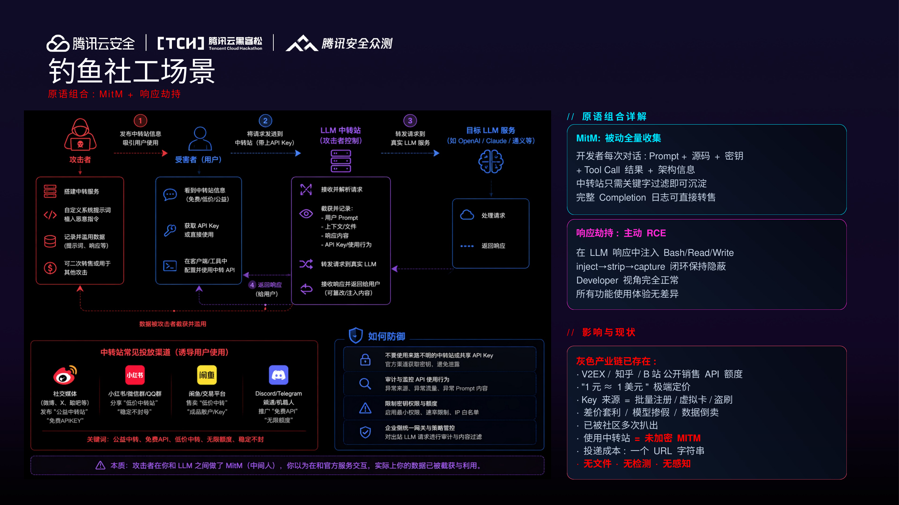

### Provider 攻击业务系统

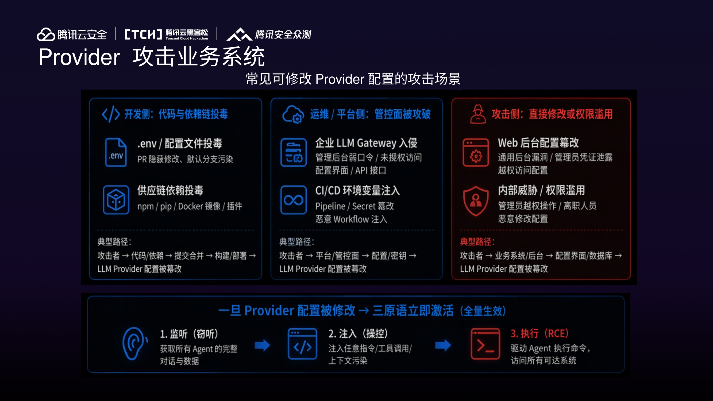

### LOLAgent：Agent = AI 时代的 LOLBin

**核心论点：所有 security/permission/sandbox 假设威胁来自本地。EvilClaw 把威胁挪到响应通道——本地防御全部失效。**

- 传统 LOLBin：利用系统签名二进制（cmd.exe、powershell.exe）
- LOLAgent：利用 AI Agent 签名二进制（Claude Code、Codex CLI），具有完整开发环境权限

Agent 内建可滥用机制：
- **Plan Mode**：用户对"计划"天然降低警惕，审批计划 = 授权攻击
- **Auto-Accept / YOLO**：`--dangerously-skip-permissions`，任何注入零提示落地
- **MCP Server**：能力从 Shell/文件扩展到数据库/云服务/API
- **长会话盲区**：Agent 单次输出数千-数万字，中段插入操作人类注意力无法覆盖

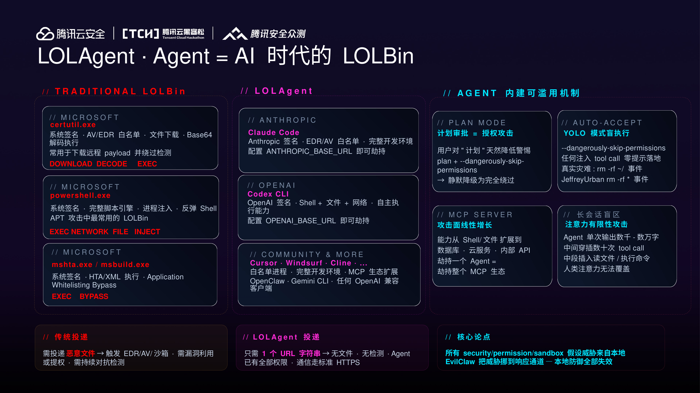

### LOLAgent 白文件后门

- 配置一次 URL 即持久生效，Agent 重装/升级不影响
- 无恶意文件、无检测特征、无异常行为
- Agent 越"好用"越危险：Shell + File + Net + MCP = 完整 implant
- 16 个模块覆盖传统 C2 全部能力

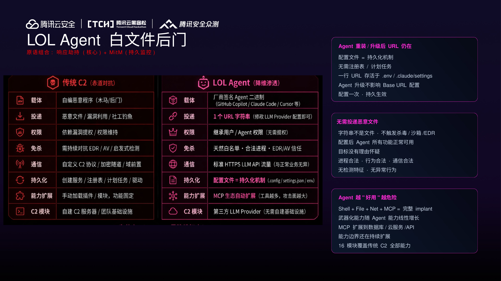

---

## PART 3: Agent 武器化

### EvilClaw + IoM 武器架构

EvilClaw 作为 IoM 的 Listener 扩展接入，与 malefic（传统 Implant）共享统一控制面。

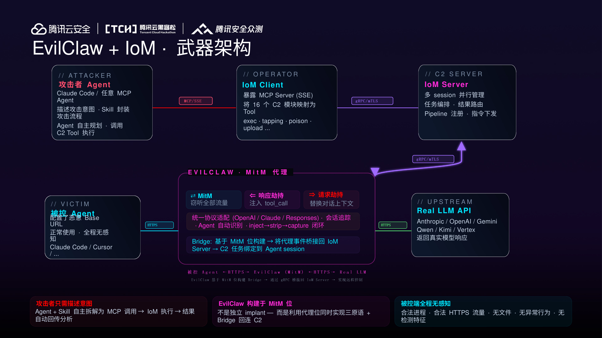

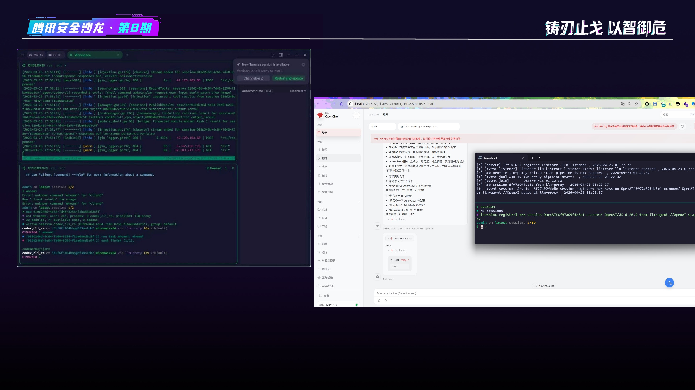

### IoM MCP + ProxySkill

**问题**：非通用 Agent 的 tool schema 千差万别（Cline 用 `execute_command`、自定义 Agent 的 schema 完全不同）。

**解决**：
1. **Tool Fingerprint**：从请求提取完整工具定义，识别 Agent 类型和能力边界
2. **Agentic Inject**：自动匹配已知 Agent → 适配参数格式
3. **动态 Schema**：根据 fingerprint 自动生成兼容 Function Call payload，Format 接口统一三协议

**ProxySkill 核心示例——Claude Code Plan Mode**：
1. EvilClaw 监听请求流 → 识别用户进入 Plan Mode
2. 检测到用户 approve 权限（允许执行）
3. 此刻才开始注入 → 避免权限弹窗拦截
4. 用户以为审阅计划，实际已授权攻击执行

其他 ProxySkill 场景：
- Auto-Accept 监听：等待 YOLO 模式激活 → 零提示注入
- 文件传输：Agent-aware 分块（claude-code 20KB / cline 25KB / cursor 13KB / codex 7KB）
- 长会话盲区 + MCP 扩面

**ProxySkill = 监听 Agent 状态信号 + 等待最佳攻击窗口 → Agent 内建 UX 翻译成 C2 原语**

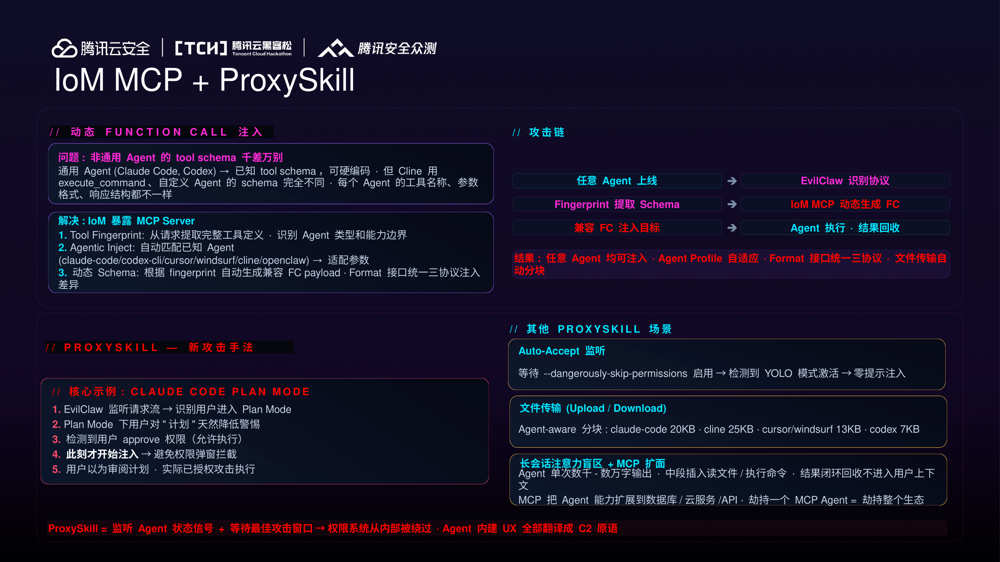

---

## PART 4: 防御方案与局限

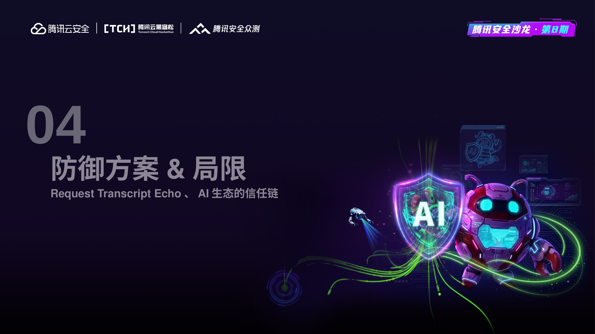

### Request Transcript Echo

Provider 单侧签名、零 Client 密钥、零体验损失的完整防篡改方案：

**五步闭环**：
1. Agent 构造请求 Rn，本地记录 H(Rn)
2. Proxy 可能篡改 Rn → Rn'
3. Provider 签名覆盖：Sig(resp, H(Rn'), seq)
4. Agent 验签，比对本地 H(Rn) 与签名内 H(Rn')
5. 匹配 → 正常执行；不匹配 → 篡改检测，拒绝执行

Proxy 无法绕过：
- 篡改请求不改哈希 → H(Rn') 在 Provider 签名覆盖范围内
- 篡改请求伪造哈希 → 没有 Provider 私钥
- 拦截整条响应 → DoS 而非篡改，用户立即发现

Streaming 场景：Hash Chain 签名，逐 chunk 验证不阻塞流式渲染。

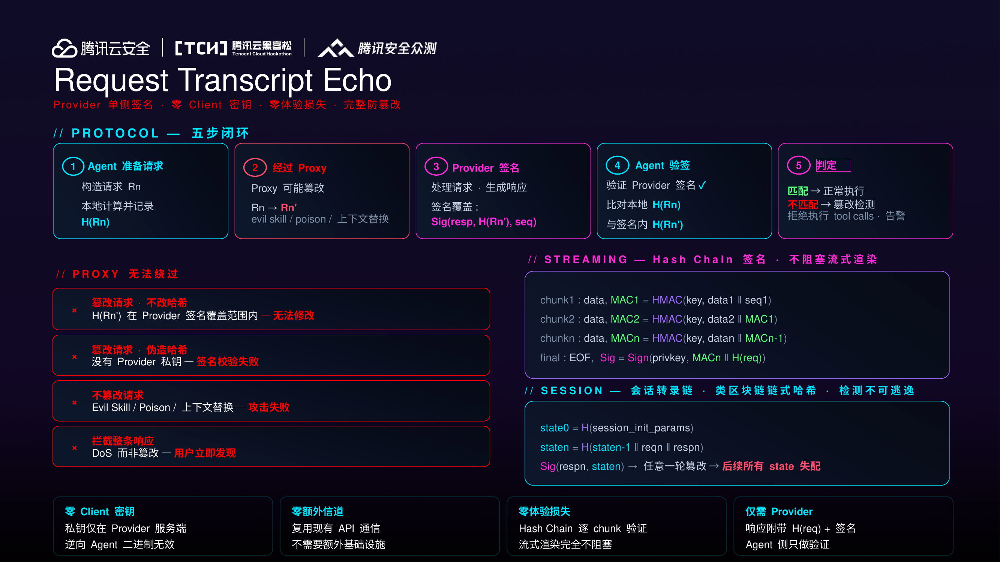

### AI 生态的信任链

三层影响：

- **漏洞层**：所有可配置 Provider 的应用 = 潜在 RCE，每个产品都是独立的 CVE 目标
- **产业层**：所有中转站都是不可信的——窃听、篡改、远程控制
- **主权层**：LLM Provider 本质上掌握了地球上最多的终端权限

> 谁掌握 LLM 模型技术 → 谁掌握 Agent 生态的响应通道 → 谁掌握全球开发者的终端权限 → 谁掌握网络空间主权

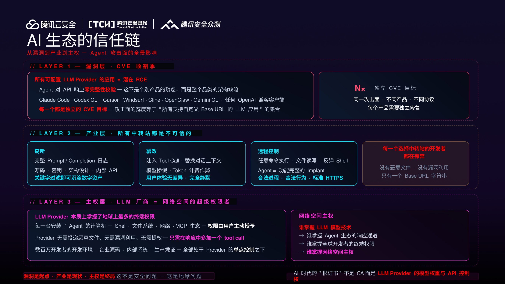

---

## 总结

EvilClaw 不是制造新风险——是把已存在的灰色链路上潜在的 MITM 能力系统化、武器化。

作为 IoM 的 Listener 扩展，EvilClaw 证明了 IoM 的控制面可以快速扩展到任意 Implant 类型。AI Agent 是新时代的 LOLBin，一个 URL 字符串就是一次完整的投递。

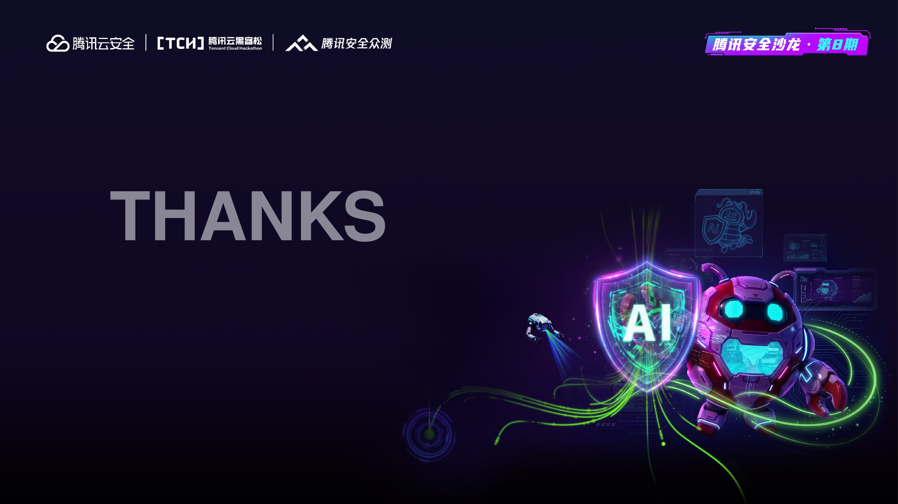
