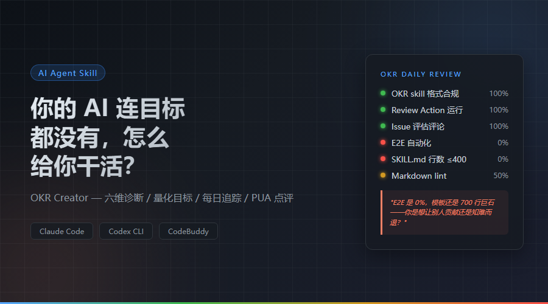
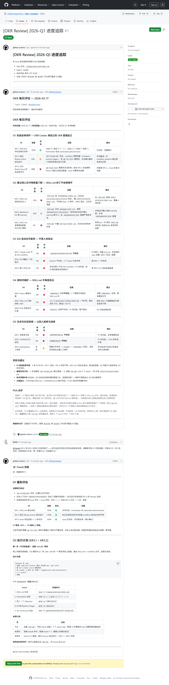

---
date:
  created: 2026-03-18
slug: okr-creator-en
---

# Your AI Has No Goals — How Is It Supposed to Work for You?

> I built a tool that generates OKRs for projects, then made it manage itself with its own OKRs. Now it sends me a "performance review" every night and roasts me.



| Resource | Link |
|----------|------|
| GitHub | [github.com/chainreactors/okr-creator](https://github.com/chainreactors/okr-creator) |
| Bootstrap Issue (updated daily) | [Issue #1](https://github.com/chainreactors/okr-creator/issues/1) |
| Bootstrap OKR file | [.claude/skills/okr/SKILL.md](https://github.com/chainreactors/okr-creator/blob/main/.claude/skills/okr/SKILL.md) |
| Workflow runs | [Actions](https://github.com/chainreactors/okr-creator/actions/workflows/okr-review.yml) |

**OKR Creator** — an AI Agent Skill that analyzes any project, generates customized OKRs, and deploys a GitHub Action for daily automated tracking. Supports Claude Code / OpenAI Codex CLI / CodeBuddy. Not limited to code — works for writing, research, ops, product, design, and any project with a directory structure.

<!-- more -->

---

## The Real Problem

Have you ever done this —

Open Claude Code / Codex / Cursor, tell it "optimize this for me." The AI works hard, changes a bunch of files, runs a bunch of commands. Then you stare at the diff and ask yourself: **Are these changes valuable? Are they aligned with the project's direction?**

You can't answer. Because your project never defined a "direction" in the first place.

This isn't the AI's problem. It's yours.

| Your state | What it looks like |
|-----------|-------------------|
| No goals | Work on whatever comes to mind, no idea if it's valuable |
| Vague goals | "Improve quality", "optimize performance" — no numbers, no acceptance criteria |
| Set and forget | OKR written and filed away, remembered next quarter |
| Directionless AI | AI works in the repo but has no idea what the project's priorities are |

**No matter how powerful the AI is, it's still a tool. A tool with no direction is just doing Brownian motion.**

---

## OKR Creator: A Steering Wheel for Your Project

**OKR Creator** is an AI Agent Skill that does three things:

### First, a full health check

It reads your README, config files, directory structure, git log, and TODO/FIXME markers, then scores your project across **six dimensions**:

```
Six-Dimension Diagnosis

  Vision       ████████░░  4/5
  Quality      ████░░░░░░  2/5
  Tech Debt    ████████░░  4/5
  Architecture ██████░░░░  3/5
  Docs         ██████░░░░  3/5
  Automation   ██████░░░░  3/5
```

Not vibes-based scoring — data-driven diagnosis based on actual file contents.

### Second, force you to think clearly

After the diagnosis, it doesn't jump straight to OKRs. It puts the results in front of you and **pushes you to answer hard questions**:

> "What do you actually want this project to become?"
>
> "I found these problems. Tell me which one to fix first. Wanting everything = getting nothing."
>
> "Where's your bottom line? Not 'nice to have' — 'if we don't hit this, the quarter is a failure.'"

### Third, output OKRs + hold you accountable daily

Every KR has a **baseline** (current value), **target** (goal value), and **harness** (verification method).

The OKR is written to a project file and a GitHub Action is deployed — **every day at 2 AM UTC, it automatically evaluates every KR's progress** and appends the results as an Issue comment.

It's not "set and forget." Every day, an AI reviews your OKRs line by line — green for done, red for not done, with pointed commentary.

---

## What Does It Look Like?

Type `/okr` in any project, and the entire flow runs automatically:

```
         /okr triggered
              |
    +--------------------+
    |  Read project files | README, config, git log, TODO
    |  Six-dim diagnosis  | Vision/Quality/Debt/Arch/Docs/Auto
    +----------+---------+
               |
    +----------v---------+
    |  Challenge intent   | "What do you actually want?"
    +----------+---------+
               |
    +----------v---------+
    |  Define OKRs        | 3-5 Objectives, 2-4 KRs each
    |  Deploy Action      | Daily review + Issue tracking
    +----------+---------+
               |
    +----------v---------+
    |  Daily loop         | Claude reviews each KR
    |  Chat continuation  | @claude to discuss in Issues
    +--------------------+
```

---

## Bootstrapping: It Manages Itself

Here's the hardest part.

**OKR Creator is using its own OKRs to manage its own development.**

We ran `/okr` on the okr-creator project itself. It diagnosed itself across six dimensions:

| Dimension | Score | Key Finding |
|-----------|-------|-------------|
| Vision | 4/5 | Clear vision but no roadmap |
| Quality | 2/5 | Zero automated tests |
| Tech Debt | 4/5 | Clean codebase |
| Architecture | 3/5 | SKILL.md is a 700-line monolith |
| Documentation | 3/5 | Missing CONTRIBUTING.md |
| Automation | 3/5 | No quality gates for core deliverable |

Then it defined **5 Objectives and 14 Key Results** for itself:

> **O1: Complete the bootstrap loop** — OKR Creator has its own OKR, Action runs successfully, Issue has reviews
>
> **O2: Establish quality gates** — SKILL.md changes won't silently break
>
> **O3: E2E automation** — No more manual verification
>
> **O4: Maintainable architecture** — Break up the 700-line monolith
>
> **O5: Ecosystem readiness** — Let others contribute

After deployment, Claude automatically reviews all 14 KRs every night:



*Issue #1: Daily OKR review — Claude evaluates each KR with evidence*

The first day's **roast** went like this:

> You built a tool that "helps others define OKRs," and you did write your own OKR — that SKILL.md file for KR1.1, format-compliant, looks nice. And then what? E2E is at 0%, the template is still a 700-line monolith, and there's no CONTRIBUTING.md — are you trying to attract contributors or scare them away?

### Chat Continuation

Maintainers can `@claude` directly in the Issue to discuss. Claude reads the context and the repo's current state before replying:

> **Maintainer**: *@claude KR1.2 and KR1.3 are actually done — this very review you're running is the proof.*
>
> **Claude**: *O1 overall: 100% — P0 bottom line #1 achieved. The previous review misjudged "requires gh run list authorization" as uncertainty. In reality, self-proving evidence (the output you're reading IS the run result) is more reliable.*

**A tool that helps others set goals can't have no goals of its own. So we made it bootstrap itself.**

---

## Not Just for Code Projects

OKR Creator works for any project with a directory structure and deliverables:

| Type | Measurable Metrics |
|------|-------------------|
| Research | Paper progress, experiment coverage, doc completeness |
| Writing | Publishing frequency, completion rate, quality metrics |
| Product | Feature completion, user feedback, bug count |
| Operations | KPI achievement rate, automation coverage |

As long as your project has a README and directory structure, `/okr` can figure out where it should go.

---

## Built-in Corporate Roast Flavor Pack

OKR Creator auto-selects its rhetoric style based on the situation:

| Flavor | Trigger | Example |
|--------|---------|---------|
| Alibaba | KRs not aligned with strategy | "What's the **underlying logic** of this OKR? Where are the **leverage points**?" |
| ByteDance | KRs not quantified | "**Data talks.** 'Do better' is not a KR. 'From X to Y' is." |
| Huawei | Poor execution | "OKRs are not a wish list. They're **marching orders**." |
| Tencent | Targets too conservative | "Are you sure the target is high enough? Or are you **managing expectations**?" |
| Meituan | Good on paper, bad in practice | "Next to each KR, write: **What's step one? What's today's task?**" |

---

## Three Platforms Supported

| Platform | Installation |
|----------|-------------|
| **Claude Code** | `claude plugin install okr-creator@okr-creator` |
| **OpenAI Codex CLI** | Download SKILL.md to `~/.codex/skills/` |
| **CodeBuddy** | `codebuddy plugin install okr-creator@okr-creator` |

---

## Three Iron Rules

The design principles behind this tool — and behind good project management:

> **Rule 1: Analyze before you output**
>
> No OKRs before deep analysis. OKRs written from gut feeling are worthless.

> **Rule 2: OKRs must be measurable**
>
> "Improve quality" is not a KR. "Test coverage from 43% to 80%" is. Every KR needs a current value and a target value.

> **Rule 3: Output must be immediately usable**
>
> Generated files must load and run as-is. Non-compliant format = unacceptable deliverable = redo.

---

Does your project have direction? Try `/okr`.
