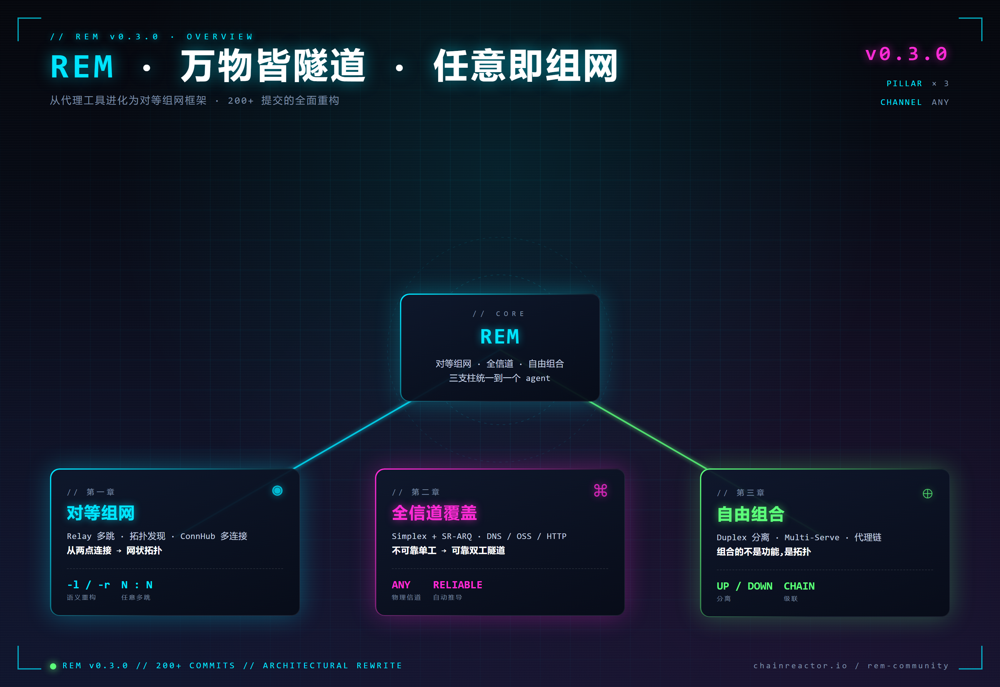
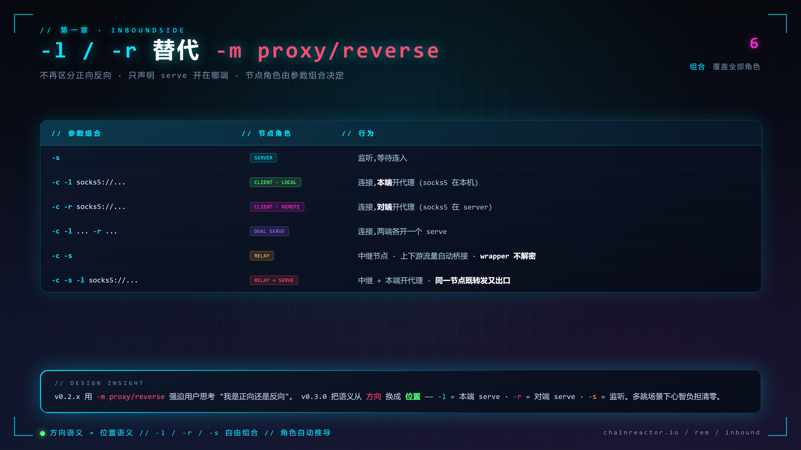
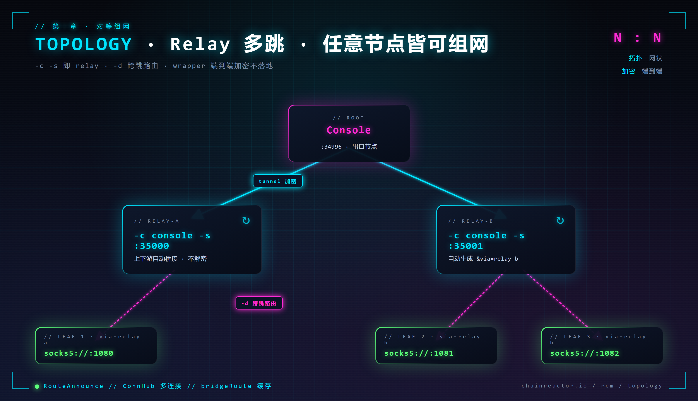
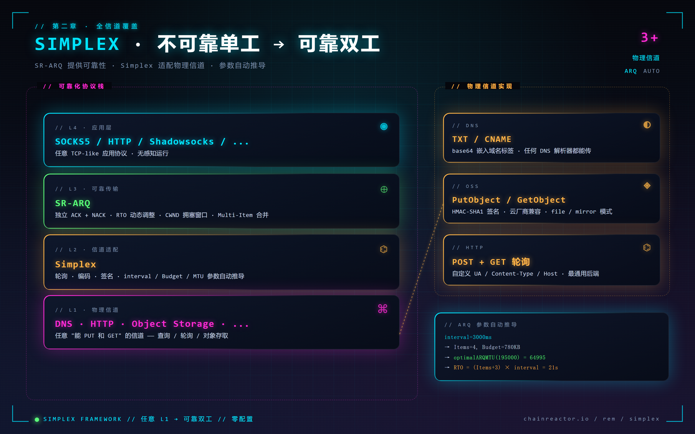
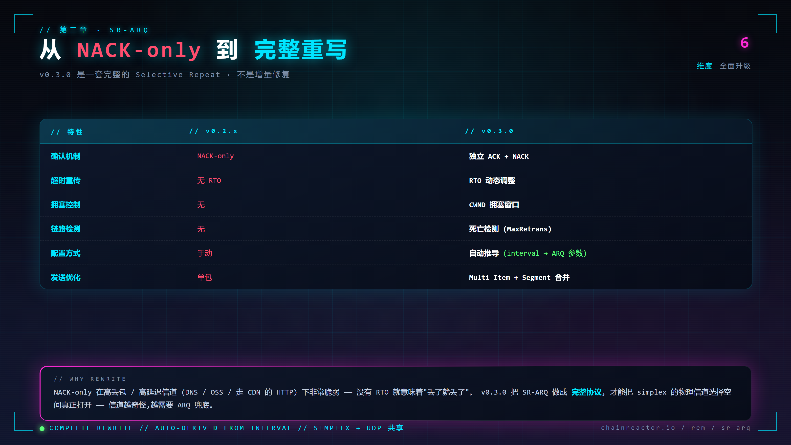
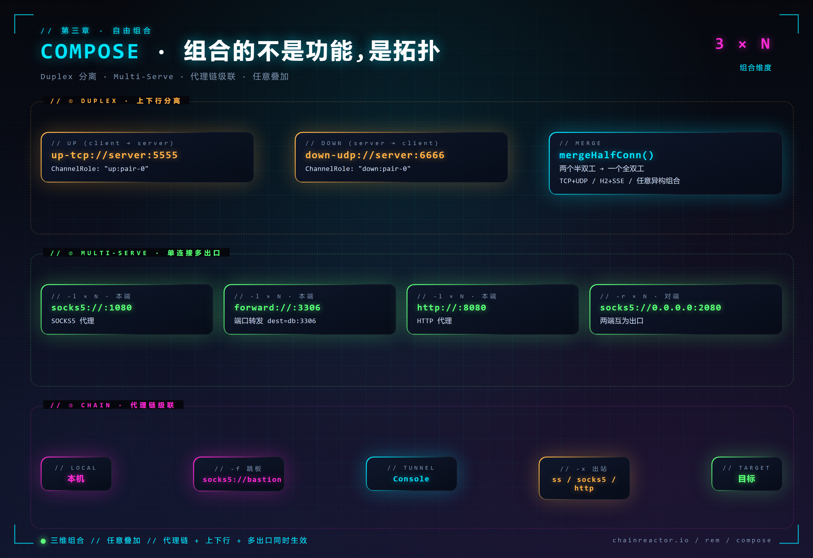

---
date:
  created: 2026-03-30
slug: rem_v0.3.0
---

## 前言

距离上一个版本 v0.2.4 过去了 10 个月，200+ 次提交。v0.3.0 不是一次功能更新，而是一次**重新定义 rem 是什么**的重构——从一个"点到点的代理工具"，进化为一个**对等组网框架**。

过去的代理工具总是把问题切成"正向 / 反向"、"客户端 / 服务端"、"代理 / 隧道"。这些语义在单点场景下还能用，但只要场景稍微复杂一点——多跳、非常规信道、上下行分离、代理链级联——这些二分法就会变成使用者的心智负担。v0.3.0 的核心是把这些二分法统统拿掉，换成**三个正交的维度**：

- **对等组网** —— 任意节点都可以是 relay / leaf / console，角色由参数组合推导，不需要预先规划
- **全信道覆盖** —— simplex 框架把 DNS 查询、对象存储、HTTP 轮询等不可靠单工信道升格为可靠隧道
- **自由组合** —— duplex 上下行分离、multi-serve、代理链级联，所有能力可以任意叠加

三个维度互相正交、任意组合，rem 的能力包络呈指数级扩张。

代码仓库: [https://github.com/chainreactors/rem-community](https://github.com/chainreactors/rem-community)

使用文档: [https://chainreactors.github.io/wiki/rem/usage/](https://chainreactors.github.io/wiki/rem/usage/)

<!-- more -->

!!! info "rem 是什么"
    rem 是 chainreactors 红队基础设施中的**网络层核心**——一个把 tunnel / proxy / 组网揉到一起的框架。既可以作为独立的代理工具使用，也可以通过 SDK / 动态库嵌入到 [IoM](https://github.com/chainreactors/malice-network) 等上层系统。

v0.3.0 之后，rem 变成了一套可以按需组装的网络基础设施：



---

## 一、对等组网 —— 从代理工具到网状组网

"正向 / 反向" 是代理工具的历史包袱。在单点部署下它还能凑合用，一旦进入多跳、级联、混合拓扑的场景，这个词本身就是 bug。v0.3.0 不再区分方向，只描述 serve **开在哪端**——节点角色由参数组合自动推导。

### InboundSide —— 从"方向语义"到"位置语义"

v0.2.x 的 `-m proxy` / `-m reverse` 要求用户先回答一个问题："我到底是正向还是反向？"在多跳网络里这个问题根本没有标准答案。v0.3.0 用 `-l`（本端 serve）和 `-r`（对端 serve）替代，语义从"方向"换成"位置"，心智负担清零：



六种参数组合覆盖所有节点角色。**不再需要在脑子里构造"正向 / 反向"的图像，只需要声明 serve 开在哪端。**

### Relay —— 任意节点皆可组网

组合出 relay 最惊艳的地方是：**它不是一个独立的模式，而是 `-c -s` 自然组合出的结果**。任意节点上同时声明"连上游 + 监听下游"，它就自动承担中继职责，上下游流量透明桥接，wrapper 加密保持端到端不在中继层解密。



```bash
# Console —— 根节点
./rem -s tcp://0.0.0.0:34996

# Relay-A —— 连上游 + 监听下游,自动成为中继
./rem -c tcp://console:34996 -s tcp://0.0.0.0:35000 -a relay-a

# Leaf-1 —— 连 Relay-A,流量从 Console 出去
./rem -c tcp://relay-a:35000 -l socks5://127.0.0.1:1080
```

relay 建立后会自动生成带 `&via=relay-a` 的 link，`-d` 参数还能跨多跳精确路由到指定节点：

```bash
./rem -c tcp://gateway:34996 -d "backend" -l socks5://127.0.0.1:1080
```

### 拓扑发现 —— 网络以 JSON 图暴露

每个 Agent 通过 `RouteAnnounce` 消息自动上报，整张网络以 JSON 图的形式可观测，包含节点角色、服务清单、流量统计、父子关系——既方便 operator 排障，也让自动化系统能读懂拓扑：

```json
{
  "nodes": [
    {"id": "relay-a", "type": "relay", "via": "console",
     "services": [{"protocol": "socks5", "address": "127.0.0.1:1080"}],
     "bytes_in": 1048576, "children": ["leaf-1"]}
  ],
  "edges": [
    {"from": "console", "to": "relay-a", "layer": "tunnel"}
  ]
}
```

### ConnHub —— 多连接管理

ConnHub 是 v0.3.0 全新的多连接抽象：同一个节点可以同时建立多条异构连接，统一由 `bridgeRoute` 路由缓存调度，支持连接级的精确路由、负载均衡和故障转移。

```bash
# 三条连接混合协议 + round-robin 负载均衡
./rem -c tcp://srv1:34996 -c tcp://srv2:34996 -c ws://srv3:8080/tunnel \
      --lb round-robin -l socks5://127.0.0.1:1080

# fallback 策略 —— 优先第一条,故障时自动切换
./rem -c tcp://primary:34996 -c udp://backup:34996 --lb fallback
```

**多协议混用 × 多策略调度**——这在 v0.2.x 是几条手动维护的连接，在 v0.3.0 是一个声明式的参数组合。

---

## 二、全信道覆盖 —— 把不可靠单工升格为可靠隧道

这是 v0.3.0 **最具技术挑战的部分**。

真实对抗环境里，出网渠道往往是高度受限的——只能查 DNS、只能调云厂商的 API、只能走 HTTP 轮询。这些信道的共同特点是**不可靠、单工、延迟高**。传统思路是为每种信道写一个定制化隧道，碎片化严重。v0.3.0 的做法是建立一个**通用的可靠化协议栈**，把 ARQ、窗口、分片、拥塞控制抽成独立一层，任何不可靠单工信道都能接入。



应用层（SOCKS5/HTTP/...）不需要知道底下跑的是 DNS 还是 OSS——simplex 把这层抽象彻底抹平。

### 参数自动推导

simplex 会根据 URL 参数自动推导最优 ARQ 配置，operator 不需要手工调参：

```
interval=3000ms → Items=4, Budget=780KB
→ optimalARQMTU(195000) = 64995
→ RTO = (Items+3) × interval = 21s
```

### SR-ARQ —— 完全重写而不是增量修复

v0.2.x 的 SR-ARQ 是一套 NACK-only 的简化实现，只能跑 UDP 隧道，跑到 simplex 场景就会完全失效。v0.3.0 是**从零重写**的完整 Selective Repeat——独立 ACK + NACK、RTO 动态调整、CWND 拥塞窗口、死亡检测、Multi-Item 合包：



这不是一次打补丁，是把可靠传输这件事**从玩具级做到了工业级**。

### 三种物理信道

**DNS Simplex** —— 通过 DNS TXT/CNAME 记录传输，base64 编码嵌入域名标签：

```bash
./rem -s "simplex+dns://0.0.0.0:5353/tunnel.example.com"
./rem -c "simplex+dns://8.8.8.8:53/tunnel.example.com" -l socks5://127.0.0.1:1080
```

**OSS Simplex** —— 通过阿里云 OSS 的 PutObject / GetObject 传输，HMAC-SHA1 签名，支持 file / mirror 模式。走云厂商 API 的好处是流量完全混在正常业务里，几乎没有识别特征：

```bash
./rem -s "simplex+oss:///rem?endpoint=oss-cn-hangzhou.aliyuncs.com&bucket=my-bucket&ak=...&sk=..."
./rem -c "simplex+oss:///rem?endpoint=...&bucket=...&ak=...&sk=..." -l socks5://127.0.0.1:1080
```

**HTTP Simplex** —— 最通用的后端，HTTP POST/GET 轮询，自定义 UA / Content-Type / Host，适配绝大部分 CDN 和反向代理：

```bash
./rem -s "simplex+http://0.0.0.0:8080/tunnel?interval=100&max=131072"
./rem -c "simplex+http://server:8080/tunnel?interval=100" -l socks5://127.0.0.1:1080
```

!!! tip "lolc2 —— 任意数据交换信道都能当隧道"
    只要目标环境存在任何一种可供双向读写的数据通道（云存储、笔记服务、消息队列、GitHub Issues……），按 simplex 协议接入就能作为代理隧道使用。参考 [https://lolc2.github.io/](https://lolc2.github.io/)。

### 新传输层

除了 simplex 框架，v0.3.0 还新增了四种 first-class 传输：

- **DNS Tunnel** —— 基于 KCP 的全双工 DNS 隧道（不同于 DNS Simplex，这是直接的 DNS 查询隧道，延迟更低）
- **StreamHTTP** —— SSE 下行 + POST 上行，专为 CDN / 反向代理场景设计，内置重放缓冲
- **HTTP/2** —— h2 多路复用，单 TCP 连接并发多流，h2c 明文 + h2s TLS 双模式
- **Memory** —— 进程内 `net.Pipe`，用于 C 库集成（`-buildmode c-shared`），零拷贝跨语言调用

```bash
./rem -s dns://0.0.0.0:53/tunnel.example.com         # DNS tunnel
./rem -s streamhttps://0.0.0.0:8443/tunnel           # StreamHTTP
./rem -s h2s://0.0.0.0:8443/tunnel                   # HTTP/2 TLS
```

从 simplex 的"把不可靠做成可靠"，到这四种新传输的"把常见协议压成隧道"——v0.3.0 的传输层目标只有一个：**把出网能力的上限推到所有物理可能**。

---

## 三、自由组合 —— 组合的不是功能，是拓扑

如果说前两章是在单个维度上把能力做深，这一章就是让不同维度**彼此正交、任意叠加**。



duplex、multi-serve、proxy-chain 这三件事在传统代理工具里通常是互斥的——你要么上下行合并、要么单信道、要么不挂代理。v0.3.0 把它们拆成三个独立的参数族，任意组合都能工作。

### Duplex —— 上下行分离

上传和下载可以走完全不同的信道。`up-` 标记上行（client→server），`down-` 标记下行（server→client），内部通过 `mergeHalfConn()` 把两个半双工连接合并为一个全双工连接：

```bash
# TCP 上行, UDP 下行 —— 规避对单一协议的检测
./rem -s up-tcp://0.0.0.0:5555 -s down-udp://0.0.0.0:6666
./rem -c up-tcp://server:5555 -c down-udp://server:6666 -l socks5://127.0.0.1:1080
```

Login 消息通过 `ChannelRole` 字段（`"up:pair-0"` / `"down:pair-0"`）完成方向配对。协议可以随便混搭：TCP+UDP、HTTP+WebSocket、StreamHTTP×2……**上下行独立定制特征**在红队场景下几乎是必杀技。

### Multi-Serve —— 一条连接开多个 serve

`-l` 和 `-r` 都支持重复指定，一条隧道上可以同时开启多个不同协议的 serve，各自独立工作：

```bash
# 本端同时开 SOCKS5 + 端口转发 + HTTP 代理
./rem -c tcp://server:34996 \
      -l socks5://127.0.0.1:1080 \
      -l forward://127.0.0.1:3306?dest=db:3306 \
      -l http://127.0.0.1:8080

# 两端同时开 SOCKS5,互为出口
./rem -c tcp://server:34996 -l socks5://127.0.0.1:1080 -r socks5://0.0.0.0:2080
```

### 代理链级联

`-x` 串联出站代理，`-f` 为 Console 连接指定代理，两者都支持重复指定按顺序级联。整条流量路径完全由命令行声明：

```bash
# 出站经过两层代理
./rem -c tcp://server:34996 -x socks5://proxy1:1080 -x http://proxy2:8080

# Console 连接走跳板
./rem -c tcp://server:34996 -f socks5://bastion:1080

# 混合 —— Shadowsocks 做出站代理
./rem -c tcp://server:34996 -x ss://aes-256-gcm:password@proxy:8388
```

流量路径一览：`本地 → -f 代理链 → Console → Tunnel → -x 代理链 → 目标`。

### Shadowsocks & Trojan —— 一等公民

rem 内置了完整的 Shadowsocks 和 Trojan serve，不是包装层而是原生实现，可以和代理链、multi-serve 联合使用：

```bash
./rem -c tcp://server:34996 -l ss://aes-256-gcm:password@127.0.0.1:8388
./rem -c tcp://server:34996 -l trojan://password@127.0.0.1:443
```

!!! note "自由组合的威力"
    **Duplex × Multi-Serve × Proxy-Chain × Relay**——四个维度每个 N 种选择，最终的拓扑空间是 **N⁴** 级别。v0.3.0 把这种组合自由度变成一行命令能表达的东西。

---

## 四、可靠性 —— 让 tunnel 经得住折腾

真实对抗环境里，网络不稳、server 重启、goroutine panic 是常态。一个可靠的 tunnel 框架不应该让 operator 手动处理这些场景。v0.3.0 在可靠性上做了四件事：

**Server 热重连** —— server 重启后通过 RST 消息主动通知 client，client 自动重建连接，bridge retry 保证 serve 层也能恢复，不需要手动拉起 client。

**指数退避重连** —— 默认无限重连，10 秒起始，上限 300 秒，每次 `interval×2`，±25% 随机抖动避免集群雪崩：

```bash
./rem -c "tcp://server:34996?retry=10&retry-interval=5&retry-max-interval=120"
```

**Agent Panic 恢复** —— 所有关键 goroutine 通过 `SafeGoWithRestart()` 包装，panic 后自动重建 agent 连接而不是整个进程崩溃。

**动态重配置** —— `Reconfigure` 协议消息支持运行时修改 tunnel 参数（如 simplex 轮询间隔），无需断开重连：

```
Agent → Reconfigure{interval: 5000} → Server
```

---

## 五、内部重写 —— 去 protobuf、去 hashicorp、上性能

除了架构层面的重构，v0.3.0 也把底层该啃的硬骨头都啃了。**所有外部依赖都是潜在的供应链风险、体积成本和性能瓶颈**——这一章是对依赖链的一次彻底清洗。

### Protobuf 移除

替换 protobuf codegen 为手写 binary marshal（varint + field tagging），wire 格式兼容。消除 `protoc` 构建依赖，二进制体积进一步缩小。

### Yamux 内置

替换 `hashicorp/yamux` 为内置 `x/yamux`，引入 `sync.Pool` 优化 stream 缓冲区。wire 协议兼容，操作无感。

### 性能优化

- **cio.Join** —— 64KB buffer pool，减少大文件传输场景下的 GC 压力
- **Token Bucket** —— `sync.Cond` 替代 1ms 自旋，CPU 占用显著下降
- **SOCKS5** —— `bufio.Reader` pool，减少 handshake 阶段的内存分配
- **HTTP Transport** —— server→client 投递路径重写，**3~5 倍性能提升**

### 流量统计

`cio.StatsConn` 透明包装 `net.Conn`，250ms 桶滑动窗口平滑采样，提供 `BytesIn/Out` + `RateInBps/RateOutBps` + `LastActive`。Agent 聚合子节点流量，拓扑图上每个节点都能看到实时吞吐。

### WireGuard 自举

SHA256(pubkey) 自动推导 tunnel IP（`100.64.x.y`）——无需手动分配 IP 段，直接上 WireGuard 就能组网。

### 构建系统

所有能力通过 `build.sh` 参数化，支持编译期内置默认值（适合嵌入部署）：

```bash
bash build.sh --full                                                            # 全功能
bash build.sh -buildmode c-shared                                               # 动态库
bash build.sh -buildmode c-archive                                              # 静态库
bash build.sh -c "tcp://server:34996" -l "socks5://127.0.0.1:1080" -q           # 编译期内置默认值
```

`rem --list` 列出所有已注册组件。URL query 参数可以配置一切：`tcp://host:port?tls&wrapper=aes&retry=5&lb=round-robin`——**声明式配置贯穿整个框架**。

---

## 破坏性变更

- `-m proxy` / `-m reverse` 已废弃，使用 `-l` / `-r` 替代（语义从"方向"换成"位置"）
- Yamux 从 `hashicorp/yamux` 替换为 `x/yamux`，wire 协议兼容
- Protobuf 替换为手写 marshal，wire 格式兼容

## 结语 —— 万物皆隧道 · 任意即组网

v0.3.0 是 rem 从**代理工具**蜕变为**组网框架**的关键一步。

- **对等组网**把"正向 / 反向 / 客户端 / 服务端"这一套上古语义彻底扔掉，节点角色由参数组合自行推导
- **全信道覆盖**让 DNS、对象存储、HTTP 轮询这些不可靠单工信道都能当隧道用，simplex + SR-ARQ 是通用的可靠化底座
- **自由组合**让 duplex、multi-serve、proxy-chain 这几个正交维度可以任意叠加，拓扑空间呈指数级扩张

这三件事加起来，rem 基本覆盖了所有 tunnel / proxy 场景——**从教科书上的反向代理到 lolc2 级别的偏门信道**。

rem 是 chainreactors 红队基础设施中的网络层核心，与 [IoM](https://github.com/chainreactors/malice-network) 深度集成，也可以独立使用。v0.3.0 之后，**网络侧的对抗能力不再是一堆独立工具的拼凑，而是一个统一框架的组合输出**。
