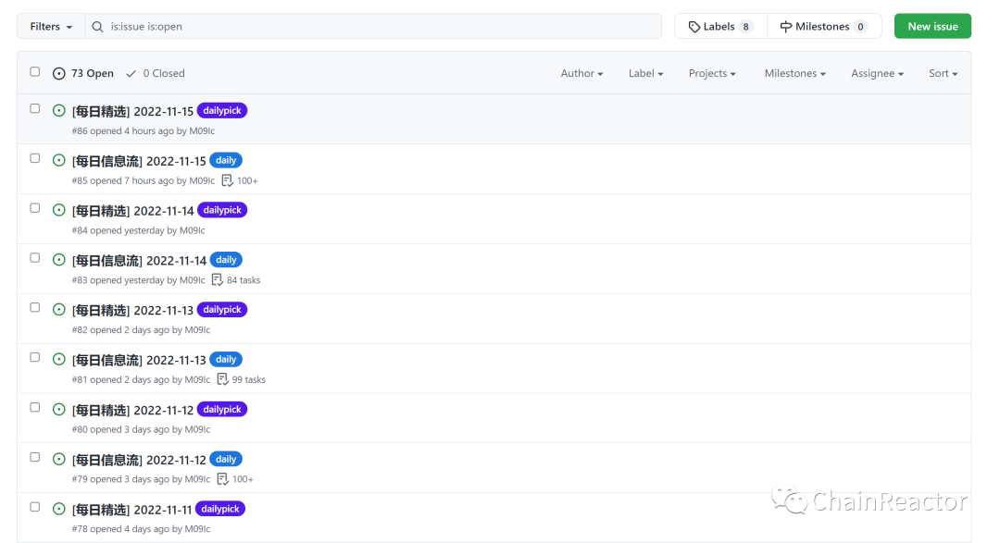

---
date:
  created: 2022-11-20
slug: picker-introduce
---

## 前言

在开始硬核的内容前, 先介绍一个空闲时写的小玩具. 基于github的rss协作管理工具.

repo: https://github.com/chainreactors/picker

## picker

在过去几年间, 大多数时间我都在使用irreader. http://irreader.fatecore.com/

使用体验还算不错, 但是也仅限于一个阅读器, 并不能保存文章到本地, 也不能进行一些复杂的推送和管理.

直到有一天我看到了 https://github.com/VulnTotal-Team/yarb , 才意识到, 其实github才是rss管理最好的工具.

为此, 我对yarb进行大刀阔斧的改动, 并使用github action 实现serverless的推送以及 issue与issue tag进行管理.

<!-- more -->

对于rss , 我认为最急迫的功能是:

1. 抓取数据并持久化保存
2. 精选与分类
3. 可协作
4. 可搜索

恰好, 这些功能, github都能很方便地实现

## 介绍

这个项目已经跑了一段时间, 还有一些需求没实现, 不过大致已经可用.

### 抓取

点到picker的仓库中, 就可以发现里面有非常多的issue

这些就是每天github action运行爬取的结果.

每天的所有文章会新建一个daily标签的issue, 内容是tasklist列表.

如果已读, 就点一下框框打个勾, 这是github的tasklist功能, 能自动修改md.

在issue页面还能看到今日未读的数量

### 精选与协作

如果文章值得协作小团体内的其他人阅读, 则可以把鼠标放到链接上过一会儿, 就能看到这个按钮`open convert to issue in current tab`.

单击,按钮就会创建一个issue,  然后github action 机器人就会被触发相关事件, 修改标题, 内容, 打赏tag, 推送等操作.

同时推送机器人也会进行推送到钉钉(当前只支持钉钉).

可以看到, 有pick与java标签,  其他pick标签是bot自动添加的, 而JAVA标签是我手动添加的.

这个标签是可以在issue中被搜索到的. 通过issue的搜索语法, 可以快速过滤出想要的文章.

而更关键的, issue可以对内容进行搜索, 这样就做到了在无服务器的情况下, 对文章标题进行持久化保存与分类.

只添加了几个github action, 就实现了较为复杂的功能, github天生对这种去中心化, 需要协作的问题上具有优势.

### 文章内容的持久化保存

这一块单纯使用github不太方便实现, 如果保存在repo中, 项目会变得复杂与臃肿, 可能还是需要一个爬虫配合issue列表进行爬取.

后续再想办法优雅的解决自动化文章离线保存的问题, 如果有相关解决办法, 请告诉我, 万分感谢.

### 其他

回想起第一次编写一个完整的项目(我的毕业设计)也是类似的需求, 当时拿着python手搓一个一个功能点, 而现在只需要几行yaml配置, 即可完成比之前磨了小半个月还复杂的功能. 能看到github对生产力的推动, 也是我打算实现一套开源的ASM的动力之一. 希望未来能通过几行yaml, 即可完成现在红队信息收集几天的结果.
