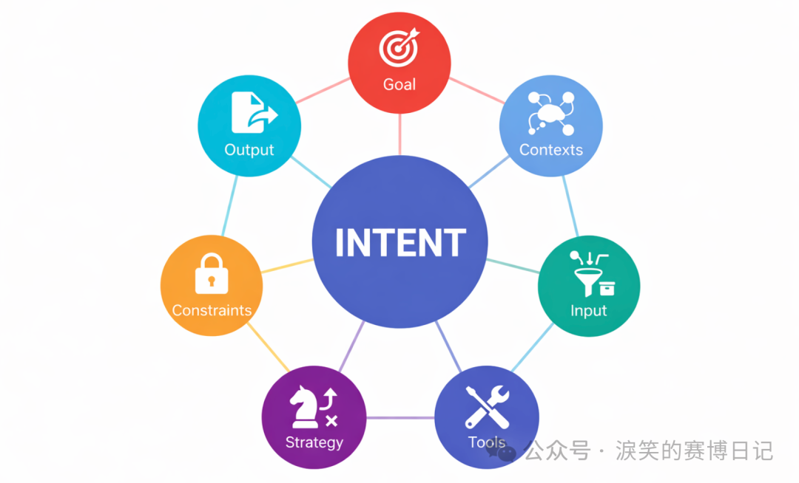
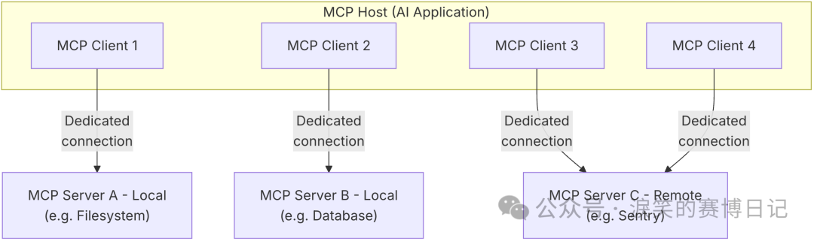
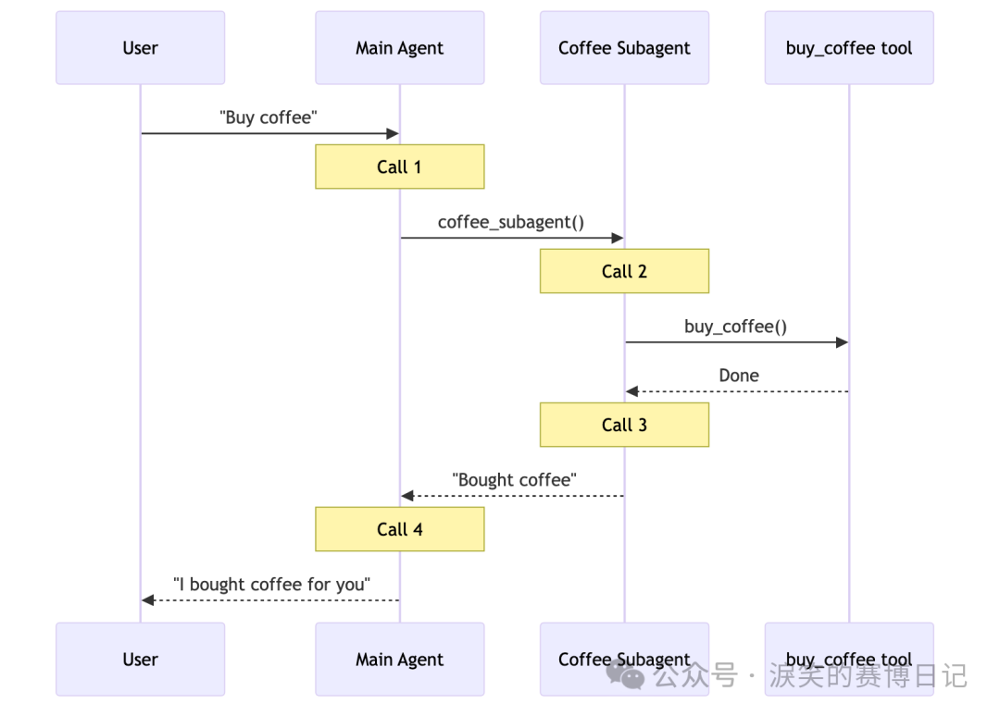
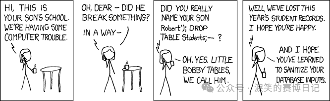

---
date:
  created: 2026-01-08
slug: qiling_intentlang_agent
title: IntentLang：以第一性原理与意图工程重建 AI Agent
---

## **[起零衍迹实验室]**{ style="color: #ff9f0a;" } IntentLang：以第一性原理与意图工程重建 AI Agent



项目地址: https://github.com/l3yx/intentlang

<!-- more -->

## 前言

一个月前，我发布了一篇文章：[《AI for 安全攻防：自动化渗透 Agent 的工程设计与实践》](https://mp.weixin.qq.com/s?__biz=Mzk2NDgwMTY5Nw==&mid=2247483942&idx=1&sn=fe419aab7e8c1ba530801571f23bc976&scene=21#wechat_redirect)，记录了我在 AI for CyberSecurity 方向的探索，虽然成果还不错，但是当时的思考和设计比较匆忙，部分理论也没有得到实践。其中介绍的最重要的两个概念：APG（Agent Pattern Graph）和 Meta-Tooling （让 AI 输出完整意图代码而非原子工具调用），只有后者运用到了参赛腾讯 AI 渗透挑战赛的项目中，目前已经开源： https://github.com/chainreactors/tinyctfer ，但该项目确实只是一个快速实现的雏形，急于开源也是为了响应赛事官方号召。

当时我和同伴提出了意图工程（即人类如何准确表达意图，AI 如何更好的理解和执行意图，也可以拓展到 AI 如何表达它的意图和我们怎么执行并提供反馈），在腾讯沙龙现场路演的时候我们也预测过以后会出现一门 AI Native Programming Language ，让各领域专家可以以一种形式化的方式表达自己的意图，即形式化沉淀自己的专家经验或者 SOP，当然 APG 已经朝这个方向迈出了一步，但我们不认为 APG 是终态，我对意图工程的理解和建设也刚刚开始。

在最近的这段时间里，我开始真正的思考和建设意图工程，也尝试回答我在意图工程中自己提出的问题，这篇文章以及文章标题中提到的 AI Agent 框架 IntentLang : https://github.com/l3yx/intentlang 就是答案，也正如标题所说，这是对当前主流 Agent 范式的一次彻底重构。MCP、Multi Agent 和 Function Calling 等设计都是非常优秀的工程实践，称它们为当今 AI Agent 生态的基石也不为过，但也正是这样，多数人将它们视为了唯一正解，但真就如此吗？

## AI Agent 的现状与隐痛

### Function Calling、MCP 和 Multi Agent

我们习惯从 “如何让 AI 调用工具” 出发去构建 Agent ，那 Function Calling 似乎已经成为了唯一选择，当前 LLM 厂商在工具调用能力上几乎都收敛到以 JSON Schema 为约束的结构化调用形式。（如果认为在 LLM 这一层的工具调用方式还包括 Claude Code Agent Skills 或 MCP 的话，那可能需要去了解一下 LLM API 的通信协议，以及 CC Skills，MCP 背后的原理，区分什么是模型侧调用协议，什么是系统侧能力封装。我在这里直接澄清一下：这些不是同一个维度的东西，**当前 LLM 工具调用的事实标准就是 JSON Based Function Calling / Tool Use** ，Skills 和 MCP 底层原理都基于此）

而后 **MCP（Model Context Protocol）** 在 Function Calling 的基础上进一步工程化这一过程，它通过标准化协议，将工具能力以 Server 的形式对外暴露，由 Client 负责调度，从而实现了工具与模型的解耦，工具生态也因此得以快速扩展。从工程视角看，MCP 无疑是一次重要的进步——它降低了接入成本，规范了交互边界，并为 Agent 生态提供了一种可复用、可组合的基础设施。



但是，也正是由于这种清晰的分层，带来一个容易被忽视的问题：**在当前主流 Agent 架构中，宿主程序与 AI 之间的协作方式，本质上是被接口化和回合制化的**。无论是 Function Calling，还是在其之上工程化的 MCP，都假设了一种固定的协作模型——宿主程序负责准备和执行环境，AI 负责在受限的接口之上做决策，二者通过结构化协议交换信息，而不是在同一执行流中共同工作。在这种模型下，AI 并不能直接参与宿主程序的执行过程。宿主程序中的对象、状态和控制流，对 AI 而言是不可见的；AI 只能通过 Schema 描述 “请求一次操作”，并在操作完成后拿到一份结果快照。这种协作方式在工程实现上往往进一步演化为进程级甚至主机级的隔离，例如 MCP Host 与 MCP Server 的拆分，但这只是实现形态上的差异，而非问题的本质。

其本质在于：**AI 始终被当作一个外部调用者，而不是程序的一部分**。它无法在执行过程中连续地操作同一个对象，也无法在宿主程序已经建立好的上下文中逐步推进任务。每一次交互都会将执行过程切断为 “调用—返回—分析” 的回合，AI 的判断只能建立在被压缩过的结果之上。当任务需要连续操作、状态依赖或动态试探时，这种接口化的协作模型便会暴露出明显的局限性。宿主程序与 AI 之间缺乏共享的执行现场，导致模型无法在操作过程中逐步形成对对象和环境的直觉理解，只能依赖显式反馈不断修正决策。这种模式在工程上是清晰且可控的，但在复杂任务中往往显得笨重而脆弱。

正是由于 AI 无法直接参与执行过程，宿主程序中的状态、对象与中间结果只能以显式数据的形式不断回传并重新注入上下文。这使得原本应当存在于运行时环境中的复杂性，被迫前移并堆叠在模型的上下文之中。当任务规模扩大、执行路径变长时，上下文很快成为新的瓶颈。

为缓解由此带来的上下文压力与决策复杂度，业界进一步引入了 **Multi-Agent** 架构。通过将任务拆分给多个角色各异的 Agent，在有限上下文内分别处理子问题，似乎可以绕开单一模型的长上下文瓶颈。然而从本质上看，这种方式并未解决语义缺失和状态割裂的问题，而只是**在接口化协作的前提下，将复杂决策拆分给多个角色各异的 Agent**。



上下文并未消失，只是被切分、复制，并在不同 Agent 之间反复传递；执行环境依然是外在的，模型依然无法真正 “置身其中”。

### 主流 AI Agent 开发框架与 IntentLang

如果从框架层面回看当前的 Agent 实践，无论是 LangChain、LangGraph、PydanticAI，还是 CrewAI，Agent 的能力边界通常都由一组工具、节点或角色来定义，任务被拆解为若干步骤，模型在运行时根据上下文选择调用哪一个工具、走向哪一条路径。无论表现形式是链式、图式，还是多角色协作，其决策核心依然围绕着 **“下一步调用什么”** 展开。

在这种范式下，Agent 的运行往往被理解为一系列离散调用的组合，难以形成可持续修正与演化的过程；而人类的意图，也通常只是一段自然语言描述，被写进 Prompt、分散在配置中，或隐含在控制流里，始终以附属品的形式存在，从未成为系统中的一等公民。

**IntentLang** 正是试图打破这一默认前提：**Agent 不再以工具为中心展开行为，而是围绕意图的表达、约束与计算来构建执行结构**——工具只是意图得以落地的手段，而非系统的起点。

## AI Agent 的两端形态

正如 [《AI for 安全攻防：自动化渗透 Agent 的工程设计与实践》](https://mp.weixin.qq.com/s?__biz=Mzk2NDgwMTY5Nw==&mid=2247483942&idx=1&sn=fe419aab7e8c1ba530801571f23bc976&scene=21#wechat_redirect) 文中所说，足够通用的 Agent 弱化了专家经验的显示建模，这引出了 **Agent 开发中的一个核心问题：平衡 Agent 的专用性与通用自主性**。一个极致通用的 Agent 理论上是一个通过自然语言交互可以自动完成任何工作的系统，不论是以命令行形式存在（Claude Code）还是网站服务存在（Manus）。而一个极致专用的 Agent 类似于一个自动化工具，只根据预设的执行路径工作，给定输入，然后等待结果就行。后者我们更多的称之为 AI Workflow 。

在 AI 自动化代替人工这个角度来看，两端的产物可能都不是我们最终想要的：足够通用的 Agent 不够专精，也不够可控；而固定流程的 Workflow 并不能自动化适应不同场景下的差异化需求。所以实际生产中，我们往往是这样使用两类工具的：

- 使用 Claude Code 这类通用 Agent，但通过详细复杂的提示词为其构建专用的 Subagent，或者构建一系列 Skills
- 使用 Dify，n8n 这类编排工具，针对专有场景编排出对应的 Workflow
- 使用 LangGraph，PydanticAI 等框架开发出专用 Agent 或者 Workflow

可以看到，在现实生产环境中，这两类往往同时存在，却又彼此割裂：一端是高度通用但难以约束的 Agent，另一端是高度确定但缺乏适应性的 Workflow。前者依赖模型能力和 Prompt 工程维持可用性，后者则依赖大量人工设计与维护，二者之间始终存在一个未被良好建模的中间层。

这个中间层，既不是一次性的自然语言指令，也不是完全固化的执行流程，而是一种**可以被反复解释、执行与修正的意图结构**。它应当能够承载专家在真实工作中的判断逻辑，然而在现有实践中，这一层往往被迫拆散：要么退化为 Prompt 中的经验性描述，随上下文一同漂移；要么被压缩进流程节点与分支条件中，一旦环境变化便需要人工重构。意图并未消失，只是失去了独立的表达形式。

在之前的文章中，我曾尝试用 **APG（Agent Pattern Graph）** 来建模这一中间层：通过 YAML 描述一种显式的图结构，其中每个节点代表一个相对独立的 “局部意图”，用于定义输入与输出、期望达成的目标以及对应的执行方式；而节点之间的边，则用于刻画意图在不同条件下的运行逻辑与转移关系。这些局部意图及其转移关系共同构成了一张完整的意图图谱，用以覆盖某一具体场景下的决策与执行过程，从而将人类专家经验或既有 SOP 以一种可被解析和复用的形式沉淀下来。

但在实践过程中我遇到了不少问题：

1. DAG 图无环，并不图灵完备，所以我需要把 APG 设计为一个简单有向图，但这样的设计下，YAML 的格式和编写，以及 APG Runtime 的设计都会变得非常复杂
2. 我自己作为 APG YAML 的第一个用户，使用体验并不好，编写 YAML，调试分析，添加节点，添加边都是比较麻烦的事情，尤其是在引入环的概念后
3. 编写 APG Runtime 的过程本质上是在写支持循环控制流和状态存储的图执行引擎，其实是在无意义的重复造轮子

但随即我想到了一个更简单、也更自然的解决方案，那就是**将 APG 的节点转换为 Python 中的函数或者其他可独立计算的单元，将节点之间的转移关系，直接交由 Python 语言本身的控制流来表达，即`if` ， `else` ， `for` 等条件控制语句**。而我也从设计 YAML 结构和图执行引擎转为了设计意图在 Python 语言中的表达和计算。

在这种方式下，图并未被抛弃，而是隐含在程序的执行路径之中；意图的组合与演化，不再依赖一套额外的图运行时，而是直接建立在宿主语言已被充分验证的执行模型之上。这就是 IntentLang ，又回归到了计算机中最适合表达执行逻辑，最适合程序员编写的形式——编程语言，但它绝不是另一个 LangGraph。

那么 IntentLang 可以承担前文说的 “可以被反复解释、执行与修正的意图结构” 这一中间层吗，我认为是可以的，IntentLang 在一定程度上是可以和 APG 等价转换的，所以以后将会有两种不同的使用方式：

1. 直接用 IntentLang 定义局部意图，然后用 Python 原本的控制流语句组织局部意图
2. 与 AI 交互，AI 实时生成 APG 可视化图，然后等价转换为 IntentLang 的 Python 代码

## 意图的建模与计算

### 人类意图

在真实的工作场景中，人类对人类表达意图，往往极其简练。有时甚至只需要一句目标描述，或者一个模糊的指向性任务。这并不是因为人类意图本身足够简单，而是因为**人类协作默认建立在大量隐式前提之上**。在人与人的协作中，双方通常共享相似的背景知识、行业语境和工具认知：知道哪些工具是可用的，知道结果大致应当以什么形式交付，也知道哪些约束是无需明说的。而且人类之间可以通过多轮、低成本的交流不断修正彼此的理解，许多信息并不是在一开始被明确表达出来，而是在协作过程中逐渐补全的。因此，在绝大多数情况下，我们并不会刻意思考 “意图究竟包含哪些要素”，更不会尝试对其进行形式化建模。

但当意图的执行对象从 “人” 转变为 “AI” 时，这一切隐含前提都会失效。AI 并不默认理解行业语境，也不存在对工具和产出形式的天然共识；不同用户表达意图的方式差异极大，同一句自然语言背后可能隐含着完全不同的期望。但是在自动化场景中，意图往往需要被稳定、可重复地执行，而不能依赖不断澄清与人工干预。现实中的 AI 使用方式，也印证了这一点：**人类对 AI 的意图描述，往往是散落在多轮 Prompt 之中的碎片**。目标、约束、上下文和期望输出被陆续补充、反复修正，最终在某一次模型输出中 “看起来好像对了”。然而，一旦试图将这一过程自动化、复用或迁移，这些碎片化的意图便立刻失去了可计算性。

因此，在 AI 自动化的语境下，问题不再是 “如何让模型理解一句话”，而是**如何将这些不确定、分散的意图碎片，收敛为一个稳定、明确、可被执行和验证的结构**。这也正是意图工程需要解决的核心问题之一：将原本依赖人类共识与沟通成本的隐式意图，转化为一种可被系统理解与计算的显式对象。

在反复的实践和调整后，最终我将人类意图定义为了七个彼此正交但又高度协同的元素：

- Goal：最终希望达成的目标
- Contexts：意图成立所依赖的背景信息与已知前提
- Tools：为意图执行提供的能力与工具
- Input：执行该意图所需的数据输入
- Strategy：对执行方式的建议或策略性描述
- Constraints：需要遵守的约束条件
- Output：结果的结构化定义

这七个要素显式地将 Intent 建模出来，**使意图成为系统中的一等公民**。对应 IntentLang 中定义意图的语法为：

```text
intent = (

Intent()

.goal(
"goal"
)

.ctxs([
"info"
])

.tools([func])

.input(i=(data, 
"desc"
))

.how(
"how"
)

.rules([
"rule"
])

.output(o=(int, 
"desc"
))

)
```

原本我设计让 `goal`，`input`，`output` 为必要要素，其他可选，但后面实际使用中，发现简单任务的 `input` 是可以隐含在 `goal` 里的，所以现在只有 `goal` 和 `output` 必填，其他都可选。然后我感觉链式调用很适合这种意图的构建，所以为 `Intent` 对象写了链式调用的构建方法。

### AI 意图

当人类给 AI 下达任务后，AI 需要调用工具才能与现实世界交互，AI 在多轮对话中表达的这种工具调用需求我就称之为 AI 的意图。但在 Function Calling 范式下，模型在每一轮对话中所能表达的，通常只是 “调用哪个函数、填什么参数”。复杂任务被迫拆解为大量原子步骤，模型需要通过多轮交互、反复试探，才能逐步逼近最终目标。**完整意图并不存在于某一轮输出中，而是分散在多次调用之间，既不可见，也不可复用**。

IntentLang 选择了一条不同的路径：不再要求 LLM 在 Schema 约束下反复做 “下一步调用什么” 的选择，而是直接让其在宿主语言中表达执行意图本身。也就是**完全抛弃 JSON Based Function Calling ，只让 LLM 直接输出 Python 代码，框架内会进行执行和反馈**。在这里，Python 代码并不只是 “工具调用的另一种形式”，而是 AI 当前意图状态的完整表达。每一轮由 LLM 生成的 Python 代码，都可以被视为一次**局部 AI 意图的显式化**：模型在这一刻对目标的理解、对环境的判断，以及对下一步行动的选择，都会体现在可执行代码中。代码被运行，执行结果以反馈的形式继续进入上下文，进一步影响下一轮的代码生成。

这种方式下，AI 的意图不再是隐含在上下文中的推测对象，而是以可执行、可验证、可回放的形式存在。相比 Function Calling，Python 代码天然支持控制流、状态演化与复杂逻辑表达，使得意图的连续演化成为可能。

### 意图的计算

这里意图的计算主要指人类意图。不过其实讲完人类与 AI 意图的定义，意图计算的答案也就显而易见了。具体来说，人类意图首先被结构化为前文所述的七个要素，然后会被转换为一种 XML 格式的中间形式，我称之为 Intent IR（Intermediate Representation），举个例子：

```text
def is_unlucky_number(num: float) -> bool:

"""check if a number is a unlucky number"""

return
 num == 
4

intent = (

Intent()

.goal(
"calculate the sum of lucky and unlucky numbers"
)

.ctxs([

"integers ending in 7 are lucky numbers"
,

])

.tools([

is_unlucky_number

])

.input(

numbers=([
123.2
, 
47
, 
123
, 
56
, 
456
, 
23
, 
17
, 
4
], 
"all numbers"
)

)

.how(
"judge one by one"
)

.rules([

"must carefully read the contexts and identify all the lucky and unlucky numbers"

])

.output(

result=(int, 
"result"
),

lucky_numbers=(list[int], 
"lucky numbers"
),

unlucky_numbers=(list[int], 
"unlucky numbers"
)

)

)
```

```text
<intent>

<goal>

calculate the sum of lucky and unlucky numbers

</goal>

<contexts>

[

"integers ending in 7 are lucky numbers"

]

</contexts>

<tools>

[

{

"type": "function",

"name": "is_unlucky_number",

"doc": "check if a number is a unlucky number",

"signature": "(num: float) -> bool",

"is_async": false

}

]

</tools>

<input_schema>

{

"properties": {

"numbers": {

"description": "all numbers",

"items": {},

"title": "Numbers",

"type": "array"

}

},

"required": [

"numbers"

],

"title": "_",

"type": "object"

}

</input_schema>

<how>

judge one by one

</how>

<rules>

[

"must carefully read the contexts and identify all the lucky and unlucky numbers"

]

</rules>

<output_schema>

{

"properties": {

"result": {

"description": "result",

"title": "Result",

"type": "integer"

},

"lucky_numbers": {

"description": "lucky numbers",

"items": {

"type": "integer"

},

"title": "Lucky Numbers",

"type": "array"

},

"unlucky_numbers": {

"description": "unlucky numbers",

"items": {

"type": "integer"

},

"title": "Unlucky Numbers",

"type": "array"

}

},

"required": [

"result",

"lucky_numbers",

"unlucky_numbers"

],

"title": "_",

"type": "object"

}

</output_schema>

</intent>
```

Intent IR 会作为 System Prompt 的一部分全部进入 LLM 上下文。同时框架会初始化一个 Python Runtime，将 `input` （包含数据的对象），`output`（一个 Python 类，表示输出数据的格式或规范）和 `tools` （包含工具函数的一个 SimpleNamespace 实例）注入进 Python 上下文。

在 Intent IR 中，`goal`、`contexts`、`how`、`rules` 这些元素，全部以原始文本的形式进入 LLM 上下文，它们并不直接参与计算，而是作为一种**高层语义约束**存在，用来限定 “应该做什么” ，“不能做什么” 和 “怎么做”。它们更接近人类在描述任务时所使用的语言：目标导向、经验性的、带有判断色彩。

与之相对的，`input` 并没有以真实数据的形式进入模型上下文，而是被转换为了 **Schema**。LLM 所能看到的，只是 “输入数据长什么样”，“输出结果应该符合什么结构”，而不是输入本身的内容。这一点是刻意为之的：**IntentLang 并不希望模型在上下文中直接 “消费数据”，而是要求它通过代码，在运行时显式地读取、判断和操作数据**。

这种设计，使 IntentLang 在结构上实现了**数据与指令彻底分离**。在传统 Prompt 模式下，数据往往直接混杂在自然语言中：模型既要 “理解问题”，又要 “消化数据”，两者在上下文中纠缠在一起，既难以复用，也难以控制。而在 IntentLang 中，数据始终是**运行时状态的一部分**，而非推理上下文的一部分，LLM 永远是通过 “写代码” 这一中介来间接操纵数据。

在这种模式下，人类意图并不是被一次性翻译为一段完整程序，而是被逐步计算出来的。单轮 AI 的意图是局部的、即时的；而跨越多轮执行后，最终稳定产出的结果，才对应于最初定义的那个人类意图。这也正是我所说的——**人类意图的计算过程，本质上是一个由结构化约束驱动、由运行时反馈闭环收敛的程序合成过程**。

## 数据与指令的彻底分离

数据与指令分离，我想这应该会是计算机里一个永恒的话题。我在刚开始学 Web 安全时，就悟到了所有注入类漏洞本质都是一样的：数据被作为了指令。



在安全领域中，数据被作为指令会造成漏洞。而在 AI Agent 工程，Prompt 工程中，数据被作为指令会导致上下文过长，Context Rot，Token 消耗大，模型注意力稀释等。在前文对 Intent IR 的构建和解释中，我其实已经强调了：**输入数据并不直接进入模型上下文，而是只以 Schema 的形式存在；真实数据只存在于运行时环境中，由代码显式读取与操作**。现在独立一小节再次解释这件事情是因为我觉得这个点足够重要却又很容易被人忽视。

在当前主流的 LLM 使用方式中，我们几乎默认了一种前提：只要模型能 “看到” 足够多的上下文，它就应该能完成推理。于是，当任务涉及长文档、日志、代码库或历史记录时，第一反应往往是扩充上下文窗口、做摘要、做分段检索，或者在 Prompt 中不断堆叠信息。然而实践反复表明，这条路径并不能线性地提升效果，反而会引入一种越来越明显的现象：**上下文越长，模型的注意力越分散，推理越不稳定**。

长文本本质上是数据，而不是指令；在很多场景下，它们并不要求被一次性理解，只需要在合适的时机被访问、被判断、被组合。但在 Prompt 驱动的范式下，数据和指令被强行揉进同一个上下文空间，模型既要理解 “要做什么”，又要在同一时间 “消化所有材料”，两者相互干扰，最终导致推理质量随长度退化。

IntentLang 对此给出的答案，并不是再想办法压缩上下文，而是**彻底改变数据进入模型上下文的方式**。在 Intent IR 中，`input` 永远只以 Schema 的形式出现，模型看到的只是 “数据的结构”，而不是数据本身。真实的数据被完整地保存在 Python Runtime 中，作为运行时状态存在。模型不再是一个被动接收长文本的阅读者，而是一个**拥有读写权限的执行者**。

回到 IntentLang 的整体设计，这一切并不是一个额外叠加的技巧，而是从 “意图建模” 阶段就已经埋下的伏笔：

- **意图负责约束方向，数据负责承载事实**
- **模型负责生成行动，运行时负责保存状态**

举个例子，以下代码是一个使用 IntentLang 对电影评价进行情感分类的场景，其中的 `classify_sentiment` 函数其实应该封装为一个 LLM 调用，但这里为了演示方便，我只 mock 了一下返回结果。

```text
def classify_sentiment(text: str) -> Literal["positive", "negative", "neutral"]:

"""Classify the sentiment of the input text."""

return
 random.choice([
"positive"
, 
"negative"
, 
"neutral"
])

intent = (

Intent()

.goal(
"sentiment categorization for each movie review"
)

.input(

movie_reviews=(

movie_reviews, 
"contains multiple reviews, one per line"
)

)

.output(

result=(

dict[int, str], 
"the key is the review index, and the value is the category"
)

)

.tools([

classify_sentiment

])

)
```

先看 AI 是如何生成代码解决这个场景的；以下是 IntentLang 框架实际运行记录（包括代码中的注释也是 LLM 生成的，运行结果会转换为 XML 格式反馈给 LLM ，以指导下一轮代码生成）：

```text
# After analyzing the Intent, break down the task into the following steps

# 1. Extract movie reviews from input and split them into individual reviews

# 2. Classify sentiment for each review using tools.classify_sentiment

# 3. Construct result dictionary with review index as key and sentiment as value

# 4. Assign OutputModel instance to output

# The purpose of this round is to extract and inspect the movie reviews from input

reviews_text = input.movie_reviews

reviews_list = reviews_text.strip().split(
'\n'
)

print(
f"Number of reviews detected: {len(reviews_list)}"
)

print(
f"Sample of first review: {reviews_list[0] if len(reviews_list) > 0 else 'No reviews'}"
)
```

```text
<feedback>

<prints>

Number of reviews detected: 5

Sample of first review: This movie has a gripping plot with constant twists—my adrenaline was through the roof, highly recommend!

</prints>

<error>

None

</error>

</feedback>
```

```text
# The purpose of this round is to classify sentiment for each review using tools.classify_sentiment

# and collect results in a dictionary with review index as key

result = {}

for
 i, review 
in
 enumerate(reviews_list):

sentiment = tools.classify_sentiment(review)

result[str(i)] = sentiment

print(
f"Sentiment classification completed for {len(result)} reviews"
)

print(
f"Sample result - Review 0: {result['0']}"
)
```

```text
<feedback>

<prints>

Sentiment classification completed for 5 reviews

Sample result - Review 0: positive

</prints>

<error>

None

</error>

</feedback>
```

```text
# The purpose of this round is to construct the final output using OutputModel

# and assign it to the output variable to complete the task

output = OutputModel(result=result)
```

```text
<feedback>

<prints>

</prints>

<error>

None

</error>

</feedback>
```

第一层参与意图计算的 LLM 在整个过程中，从未 “看到” 过完整的输入数据。`movie_reviews` 始终只是运行时环境中的一个变量，模型真正接触到的，是自己通过代码一步步取出来的局部片段，以及这些操作所产生的中间反馈。如果将这个例子中的 `movie_reviews` 替换为十万行日志、数百页文档，整体的交互模式并不会发生本质变化。变化的只是运行时数据的规模，而不是模型上下文的负担。它只需要在合适的阶段，生成合适的代码，对数据进行有目的的访问和处理。

## 同进程协作与嵌入式执行

在讨论完数据与指令的分离之后，回到另一个问题，**在现有主流 AI Agent 框架中，工具调用的本质是离散的、隔离的操作**。宿主程序与 AI 之间存在明确边界：每一次操作都是独立调用，模型只能看到调用结果，无法直接访问或连续操作同一个对象。这种设计方便工程管理、但也带来了局限：

- AI 与宿主程序无法在同一执行流中自然协作，每一次操作都必须通过接口、协议或序列化传输
- 对象或工具状态无法在连续步骤中保持，复杂任务通常被拆解为原子化调用

在这种模式下，AI 始终处于 “外部观察者” 的位置：无法直接参与执行环境，也无法对对象进行连续、深入的操作。即便框架提供函数注册功能，也只是提供了调用入口，无法在模型与程序之间建立对象级的连续控制权。 IntentLang 的设计则不同：**在同一进程、同一状态空间内，宿主程序代码与 AI 生成的 Python 代码共享对象和执行环境**。开发者可以先在宿主程序中完成前置初始化或复杂操作，例如启动浏览器、登录或加载数据，然后将控制权交给 AI，让其直接在当前对象上操作。AI 执行完操作后，宿主程序可以再次接手，对结果进行检查、修正或扩展。通过这种方式，IntentLang 实现了：

- 对已初始化对象的直接访问和修改
- AI 与宿主程序在同一控制流中交替执行，实现即时验证与修正
- 对象状态的连续性，无需跨调用序列化或状态传递

这种设计天然支持跨步骤、跨模块的状态共享。AI 可以在前一个意图执行中构造的数据结构，直接在后续意图中使用，而无需中间转换或重复初始化。对象的生命周期、上下文状态以及执行结果都保留在同一个运行时环境中，实现了真正意义上的 “意图连续性”，同时保持高可控性。

举一个 MCP 工具调用范式永远无法做到的实际案例：

```text
async

def test():

from
 playwright.async_api 
import
 async_playwright, Page

playwright = 
await
 async_playwright().start()

browser = 
await
 playwright.chromium.launch(headless=
False
)

context = 
await
 browser.new_context()

url = 
"https://l3yx.github.io/"

intent_a = (

Intent()

.goal(
"Open the url"
)

.input(

url=(url, 
""
),

)

.tools([

(context, 
"context"
, 
"An instance of Playwright's Context (asynchronous API)"
),

])

.output(

page=(Page, 
"An instance of playwright's Page"
)

)

)

page = (
await
 intent_a.run()).output.page

print(page)

intent_b = (

Intent()

.goal(
"Get webpage title"
)

.input(

page=(page, 
"An instance of playwright's Page"
)

)

.output(

title=(str, 
""
)

)

)

title = (
await
 intent_b.run()).output.title

print(title)

asyncio.run(test())

# <Page url='https://l3yx.github.io/'>

# l3yx's blog
```

我在代码中手动创建了一个 Playwright context 对象，然后定义 Intent A 操作 context 对象打开指定网页，返回 page 对象，然后在代码中继续使用了 page 对象，再定义 Intent B 获取 page 对象的网页 title，然后 print 获取到的 title。在这个示例中，**AI 的输入输出不再局限于字符串或者其他可序列化数据，为 AI 注册的工具也不再局限于函数，而是 Python 内存中的任意对象。真正打破了 AI 与程序的边界，让 AI 成为了程序的一部分。**

## IntentLang 的边界与代价

IntentLang 并不是在所有场景下都更优的通用解法，首先必须正视的一点是：**IntentLang 在单次意图执行的可控性上，确实不如严格受限的 Function Calling**。 在 JSON Schema 约束的 Function Calling 模式下，模型每一轮只能在预定义的函数集合中选择调用，并且参数结构完全受限，宿主程序可以在调用前后做非常细粒度的校验、拦截与审计。这种模式天然适合高安全边界、低容错的场景，例如金融交易指令、权限管理操作或强监管系统。在这些场景中，“模型能做什么” 必须被严格限定，而不是通过运行时反馈逐步纠偏。

相比之下，IntentLang 选择让模型直接生成可执行代码，并在同一运行时中执行，这意味着模型在单轮中拥有更大的表达自由度，但行为边界更多依赖运行时沙箱、权限模型和意图级约束。这是一个明确的取舍，IntentLang 用更强的表达能力与连续性，换取了单步可控性的降低。另外，这种方式也会带来严重的安全问题，赋予 AI 的权限和能力太大了，AI 有可能做出预期之外的破坏性操作，尤其是使用了不可信数据时会造成的 prompt 注入。所以我觉得**目前阶段还是需要在容器或者沙箱内部运行 IntentLang 代码**。

还有一点是**当前的 LLM 都为 JSON Based Function Calling 工具调用范式进行了专门的训练，LLM 可以轻易的从 prompt 中提取出函数调用信息，构造出满足条件的 JSON，LLM 调用协议中也有专门的字段来表示 Function Calling**，但并没有为 IntentLang 的 Code 执行范式进行训练，也没有在协议中对 LLM 的推理和 Code 进行区分，虽然目前表现来看多数情况下 LLM 可以输出我想要的结果（即纯净的 Python 代码，推理和思考过程可以放入代码注释），但是偶尔也会出现推理文本与 Code 混杂的情况，也有在输出中出现 MarkDown 的代码块符号的情况。我想或许模型可以朝着这个方向训练一下，不一定是 Python，因为 Python 在这个场景中本质也就是一种 DSL。我认为，**未来会出现原生支持某种 DSL 或代码级意图表达的模型，其表达和解决问题的能力会明显强于当前的 Function Calling 范式**。

## Keep It Simple, Stupid

我从接触 AI 应用开发到现在总共四个多月，这段时间里看了不少项目，也读了一些论文，确实学到了很多优秀的理念，看到很多创新的项目，它们都会潜移默化的成为我代码中的影子。但是还是有相当一部分项目要么是强行创新的旧物，要么就是概念复杂冗余的脆弱工程，不断的在 “旧机器” 上打补丁。

我一直认为深入本质的创新远远优于各种复杂设计的堆砌，而深入本质的创新往往核心要点简单而纯粹。

不过可能每个人都会有自己的茧房，IntentLang 其实也不过是把函数调用换成了代码执行，最后我也希望可以听取到更多客观的建议。引用一段最近看到的第一性原理解读作为结尾吧：

> 放下假设，回到本质，思考的最高境界不是模仿，而是重建，大多数人只会在旧答案里兜圈，只有少数人敢从零开始提问，当你不再问别人怎么做，而是问为什么要这样做时，就开始拥有改变世界的思维。真正的创新，不是更好的模仿，而是更深的理解，颠覆世界，从来不是天才的特权，而是敢于质疑常识的勇气。

项目地址: https://github.com/l3yx/intentlang

- Twitter: @leixiao_cn
- Blog: https://l3yx.github.io/
- GitHub: https://github.com/l3yx

