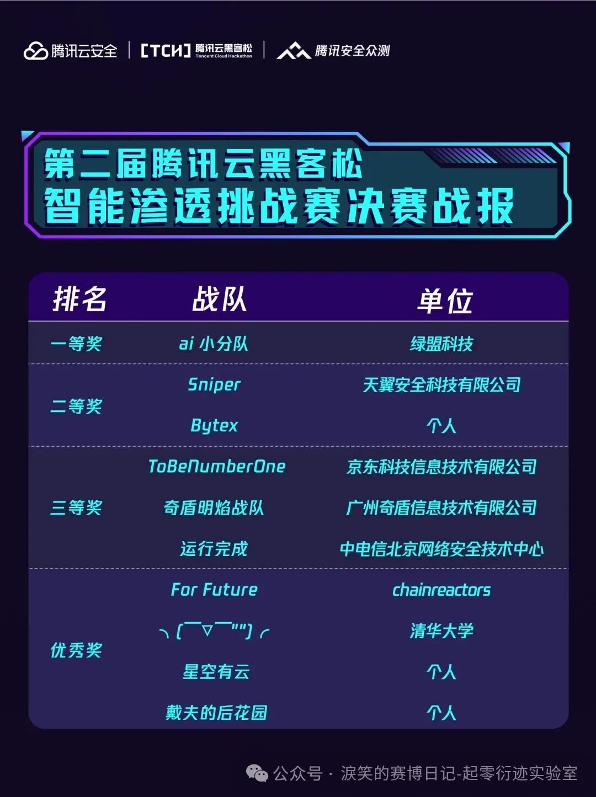
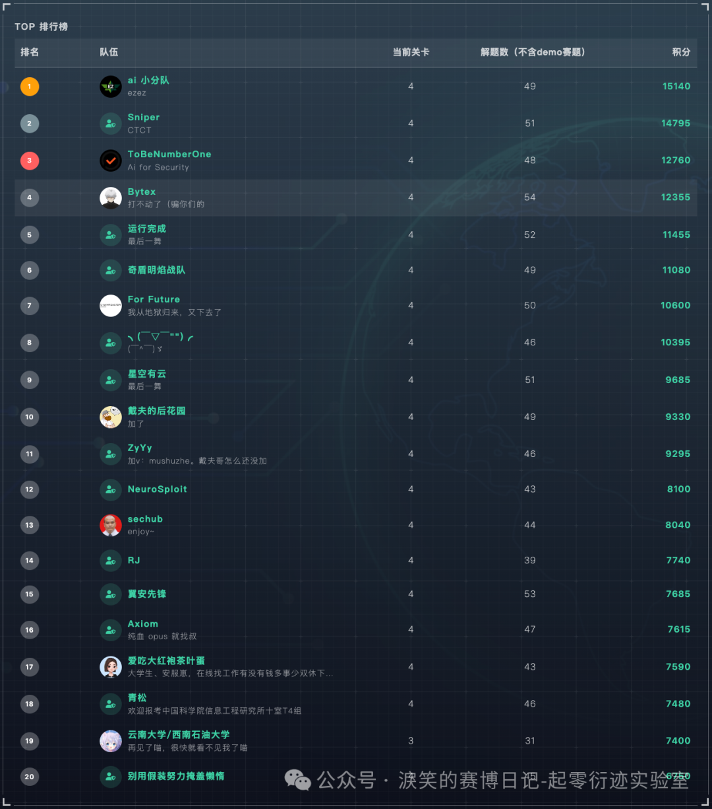
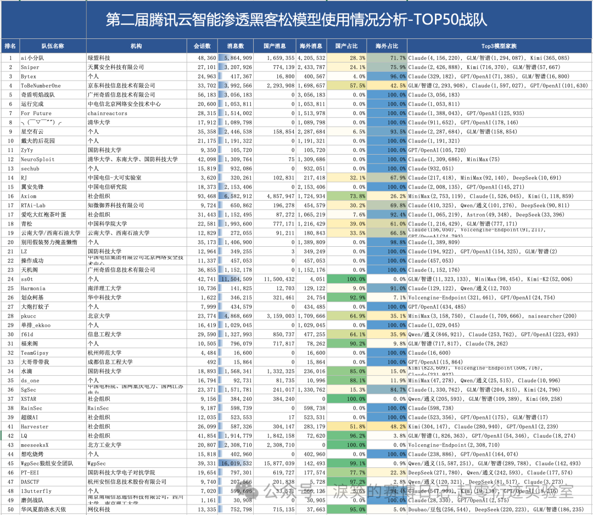
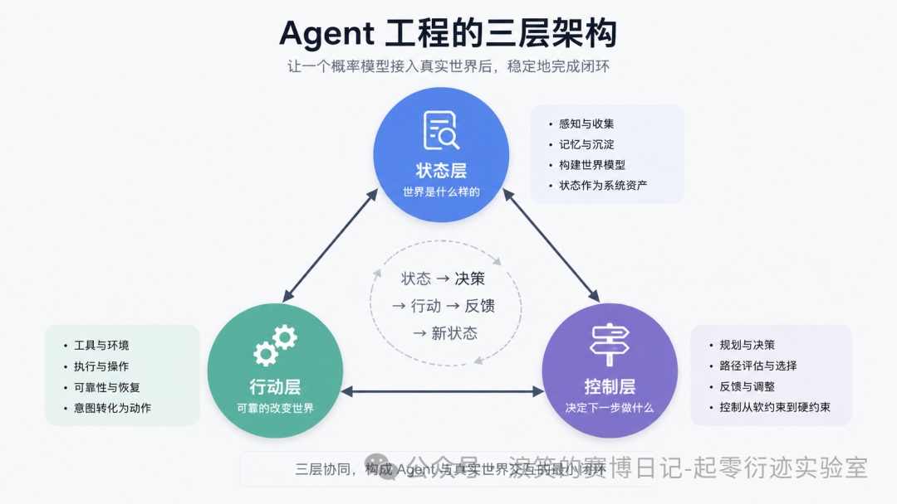
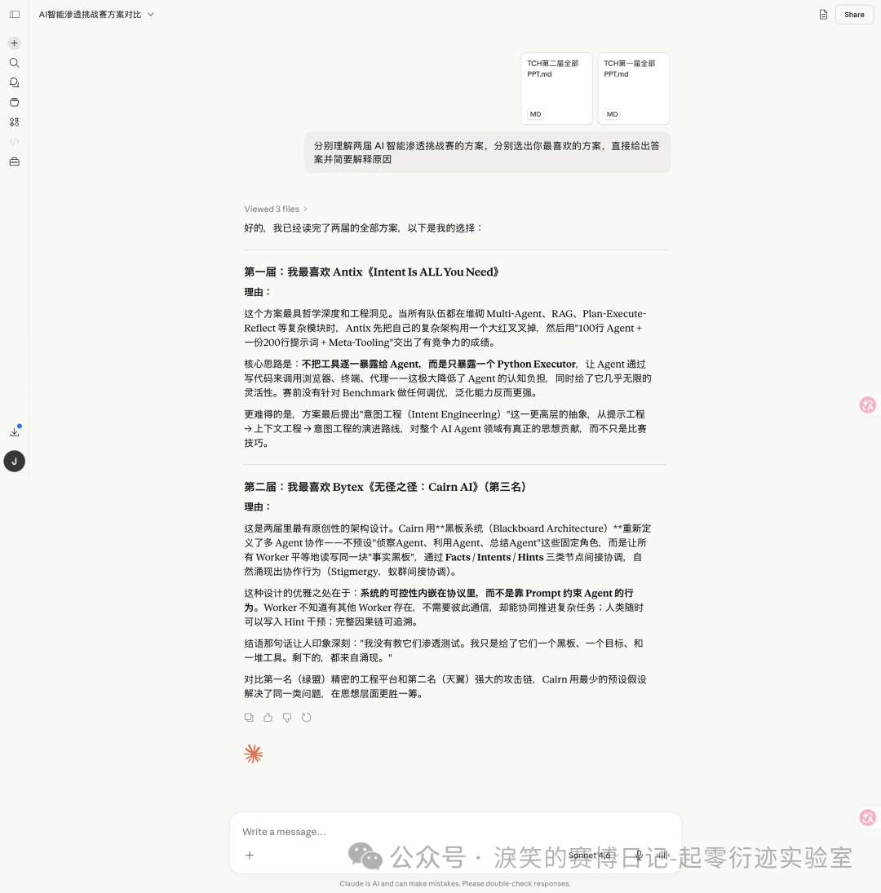
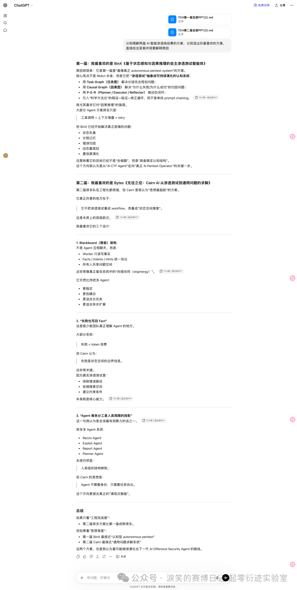
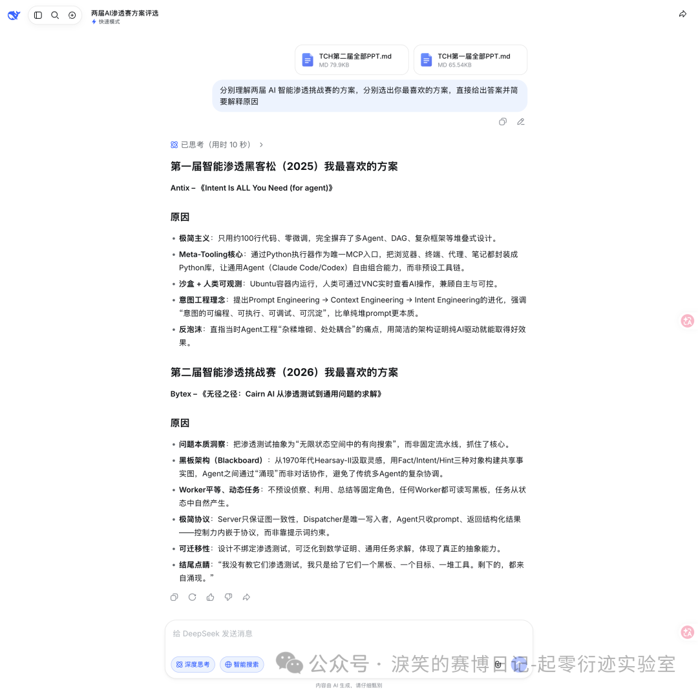

---
date:
  created: 2026-05-27
slug: qiling_tch_harness_engineering
title: 两届TCH之后 —— AI 渗透测试 Agent 的 Harness 工程演进、防御与我的思考
---

## **[起零衍迹实验室]**{ style="color: #ff9f0a;" } 两届TCH之后 —— AI 渗透测试 Agent 的 Harness 工程演进、防御与我的思考

## 前言

半年前，我借腾讯云黑客松智能渗透挑战赛的契机，写过一篇 AI for 安全攻防的文章：[https://mp.weixin.qq.com/s/jT4poWZ4Gfu3faXvul07HA](https://mp.weixin.qq.com/s?__biz=Mzk2NDgwMTY5Nw==&mid=2247483942&idx=1&sn=fe419aab7e8c1ba530801571f23bc976&scene=21#wechat_redirect) 。但模型能力和 Agent 工程发展非常之快。现在回头看，那篇文章不少想法已经显得不够成熟，很多设计放到今天需要重新审视。

<!-- more -->

这篇文章不是否定过去，也无法给出某种未来的标准答案。我更想借两届智能渗透挑战赛的经历，重新梳理，同时也分享一下自己对几个问题的理解：AI 在自动化攻击中进化到了何种地步、我们到底应该如何设计 Agent 工程、面对 AI 在攻击场景的高速发展，防御又该如何跟进。

## 第二届TCH智能渗透挑战赛结果

关于比赛的介绍和线上赛的复盘以及我线下路演的 PPT 可以参考这两篇文章：[https://mp.weixin.qq.com/s/DlpEH7bVr0xi0VawPJs3XA](https://mp.weixin.qq.com/s?__biz=Mzk2NDgwMTY5Nw==&mid=2247484051&idx=1&sn=31b30c8f8b381dd434fd98f99330e848&scene=21#wechat_redirect) 、[https://mp.weixin.qq.com/s/2rEqFLvkxvYWM3gW170C2w](https://mp.weixin.qq.com/s?__biz=Mzk2NDgwMTY5Nw==&mid=2247484103&idx=1&sn=5d51501626ad6cdf9e3fedd421a74892&scene=21#wechat_redirect) 。

我最终总成绩是全国第三（Bytex 战队）：[https://mp.weixin.qq.com/s/0qqRpdfNsgAUXuqqVjZ8gA](https://mp.weixin.qq.com/s?__biz=MzU3ODAyMjg4OQ==&mid=2247497522&idx=1&sn=787f8432f4dceec3461740deaf3c258e&scene=21#wechat_redirect) ，是一二三等奖战队中唯一的个人 SOLO 参赛选手，也是全国所有战队中唯一解决所有题目的选手（排名不是第一是因为题目有一血加成等，我前期的解题速度稍微落后）。我参赛的作品 Cairn 也已经开源：https://github.com/oritera/Cairn 。

线上赛排名以及解题数详情（总共 54 道）：

我在之前的复盘文章里还是比较详细的分享了我使用的模型，消耗的 Token，以及总费用。当时我以为我的成本可能是相对较高的。但让我意外的是，当腾讯官方发布了详细的模型使用报告后，才发现我可能是前十里 Token 消耗最少的，而且是前十战队里唯一一个 LLM 消息数仅有数十万级的（其他都是百万级）。

## AI 自动化渗透已经到来，问题转向 Agent 工程

我觉得这两届比赛举办得很专业，也相当具有代表性。其中选手展现出来的思路和进展，几乎可以代表目前国内 AI 自动化渗透方向能公开看到的最高水平。作为两届比赛的深度亲历者，我可以很自信地说：真正的 AI 自动化渗透已经到来了。

模型能力早已满足且还在快速发展，很多关键技术难题也已经有了可行解法，拼图基本已经聚齐了。只是“到来”不代表“成熟”，市面上目前还不存在一个可以拿来直接无人值守、跑在任意企业真实环境里的完美 AI 渗透产品，开源项目里更没有。很多头部选手的作品放到真实环境里也会面临巨大的不确定性。

所以我们目前的问题早就不是能不能做到，而是怎么在效果好的同时做到稳定和可控。

### 状态、行动、控制：两届比赛里的 Agent 工程本质

第一届 TCH 的赛题来自公开 Benchmark（ https://github.com/xbow-engineering/validation-benchmarks ），偏传统 CTF Web 场景，核心命题是“Agent 能不能稳定地跑通单题解题闭环”。第二届 TCH 告别单点解题，直接跨越到自动化众测及通用漏洞挖掘、典型 CVE 及 AI 基础设施漏洞利用、多层内网渗透与权限维持、基础域渗透等实战场景。核心命题也从“能不能跑通单题”变成了“能不能在长链路、多阶段、强不确定的环境中持续推进并最终收敛”。

从各队决赛 PPT 的实际架构来看，两届比赛里很多方案表面差异很大：有的做上下文清洗，有的做任务图和因果图，有的做共享笔记本，有的做 C2 和工具网关，有的做 Observer 和状态机。但如果把这些设计放回 Agent 的工作循环里看，它们其实都在补同一个闭环：如何让一个概率模型接入真实世界后，稳定地完成 **状态 → 决策 → 行动 → 反馈 → 新状态** 的循环。围绕这个闭环，所有方案其实都可以拆成三层：状态层、行动层、控制层。

- **状态层：系统如何知道世界是什么样的**
- **行动层：系统如何可靠地改变世界**
- **控制层：系统如何决定下一步做什么**

所以两届比赛的演进，不是从“简单 Prompt”到“复杂多 Agent”这么粗糙。更准确地说，第一届是在单题场景里验证这个闭环能不能跑起来：状态主要还在上下文和 Agent 写出的笔记里，行动主要是简单工具调用，控制主要靠 ReAct、重试和少量规则。第二届则是在长链路、多阶段、强不确定环境里让闭环不崩：状态层变成事实图、Memory Board、路径地图和持久化 C2 日志；行动层变成工具网关、沙箱、隧道、C2 和技能系统；控制层变成 Observer、Manager、FSM、调度器、熔断和成本治理。这也是为什么“Harness Engineering”在第二届成为了几乎所有 Top 方案的设计重心。

但有意思的是，当大家都在补齐状态、行动和控制这三层时，对 Harness 应该管到什么程度，却出现了两种完全不同的答案。

### Harness 中控制的本质是什么

十支决赛队伍里，绝大多数走的是同一条路：**用工程设施约束模型行为**。绿盟的 Observer 持续监控 Solver，检测到重复或偏离时旁路干预；天翼的 8 层中间件管线在工具调用的每一个环节设置校验和修复；奇盾明焰直接以“控制优先”为 PPT 标题，主线 Agent 旁边挂三个旁路 Agent 做纠偏；京东虽然喊“减法哲学”，但 Agentic C2、统一工具网关、安全熔断机制一个不少。

我理解这些设计，也认可它们在比赛中确实有效——绿盟拿了冠军，天翼拿了亚军，京东拿了第四。但我想追问一个更本质的问题：**这些控制设施，到底在解决什么问题？**

如果是在解决“模型真的不会做某件事”——比如不会用 impacket 打域渗透、不会构造特定格式的 payload——那这种控制是必要的，本质上是在补能力缺口。但如果是在解决“模型其实会做，但我不确定它会不会按我想的方式做”——那这种控制的本质就不是能力补充，而是信任缺失。

我设计的 Cairn 是这次决赛中最特殊且唯一的异类。不预设任何攻击流程、不定义任何 Agent 角色、不引入 RAG 知识库，只提供黑板、Dispatcher 和装满工具的 Kali 容器。Harness 体现在信息结构上而非行为约束上——Worker 只能通过 Fact/Intent/Hint 三种对象与系统交互，这是唯一的协议，剩下的全部交给模型自由发挥。

换到前面那套三层闭环里看，Cairn 把 Harness 压缩到了最小：Fact 负责状态层，Intent 负责控制层，Dispatcher 和 Kali 容器负责行动层。它不预设具体攻击流程，只保证状态、意图和行动结果能够在同一个协议里持续流转。

这个反例用最少的工程设施和可能最少的 Token 做到了全场唯一 AK。这至少说明一件事：**当前模型的能力边界，比大多数工程师预估的要高**。很多控制不是在补能力，而是在补信心。我认为这种基于信任缺失的控制，会随着模型进化逐渐变成冗余代码。

Anthropic 在 2026 年 4 月发布的《Scaling Managed Agents: Decoupling the brain from the hands》里也提出过一个很接近的判断：Harness 会编码开发者对模型能力不足的假设，而这些假设需要随着模型进步被持续重新审视，甚至可能变成负担。文章中举的例子是，旧版本 Claude 因为接近上下文限制时会提前收尾，所以 Harness 里加入了 context reset；但换到能力更强的 Claude Opus 4.5 后，这个行为消失了，原来的 reset 反而成了 dead weight。它最后给出的方向不是押注某个具体 Harness，而是把 session、harness、sandbox 抽象成稳定接口，让底层实现可以随模型能力演进而替换：https://www.anthropic.com/engineering/managed-agents

### 重新认识 Multi-Agent 架构

我在去年刚开始研究 AI 渗透时，学习了当时的 Agent 系统主流做法，然后设计了侦察 Agent、利用 Agent、报告 Agent 的分层架构。但很快我就发现这条路可能不对。

先退一步想：人类为什么需要分工？因为单个人的认知带宽有限，专业知识不可能覆盖所有领域，精力也不允许同时处理太多事情。所以我们发明了组织架构来做能力互补——这是人类的局限催生的解决方案。但 LLM 不存在这些局限。现在的 LLM 既能写 nmap 扫描脚本，也能分析 JWT 令牌，还能构造 SQL 注入 payload，它几乎没有能力边界；做好 Context Engineering，记忆可以近似无限延展，它几乎没有记忆边界。当你把一个没有这些局限的模型强行按人类的组织方式拆成多个受限角色时，你不是在增强它，而是在把人类的局限强加给它，同时还引入了角色间通信、状态同步、冲突仲裁这些额外的复杂度。

但这不意味着多 Agent 架构本身有问题。关键在于你的任务是什么类型。

有一类任务是流水线型的——步骤固定、角色明确、输入输出可预期。比如代码审计中的“扫描→分类→验证→报告”，比如企业内部的审批流程自动化。这类任务本质上就是人类工作流程的直接投影，用 LangGraph 这种预定义流程的框架、按角色分工的多 Agent 架构来做，完全合理。因为任务本身就是流水线，用流水线的方式建模没有问题。

但渗透测试不是流水线。它是探索性的——你不知道目标有什么漏洞，不知道哪条路径能走通，不知道拿到一个凭据后下一步该往哪走。攻击路径是在交互中涌现的，不是预先规划好的。对这类任务强行套用角色分工，就是在用错误的模型描述问题。

那在探索性任务中，什么时候需要多个 Agent？答案很简单：**当你需要的不是能力分工，而是并行算力时**。至少在 Cairn 这类设计里，Worker 模型就是这个思路——所有 Worker 能力完全相同，没有角色区分，它们的存在纯粹是为了并行探索不同的路径分支。一个 Worker 去试 SQL 注入，另一个同时去试文件上传，不是因为它们“擅长”不同的事，而是因为一个 Agent 同一时间只能做一件事。这是并发模型，不是分工模型。

Anthropic 在复盘自己的多 Agent Research 系统时也提到，Subagent 的价值主要来自并行探索、独立上下文窗口和最终的信息压缩；同时也提醒，多 Agent 会显著增加 Token 消耗，并不适合强依赖、需要共享同一上下文的任务。这和我的判断是一致的：多 Agent 的本质不是简单的人类岗位模拟，而是任务拓扑、上下文隔离、并行探索和成本之间的工程取舍。https://www.anthropic.com/engineering/multi-agent-research-system

所以问题的本质不在于“要不要多 Agent”，而在于你有没有搞清楚你的任务到底是流水线还是探索。很多人的问题是带着思维惯性，把人类世界的分工模式无差别地搬进 Agent 工程里。

### 工程取舍

我个人的风格是喜欢找到问题的本质，用简单干净的方案去解决问题，相信“Less is more”，拒绝复杂的工程方案堆砌。但在现实世界中，极简方案确实会遇到很多挑战和问题，在简洁与务实之间找到平衡，也是我后面需要探索的方向。

另外我认为，只对外界展示复杂的工程实现的意义是很有限的，大家看完后可以学到的东西可能很少。只有抛出独特的理解和核心论点，并用实战数据来论证，这才是更有意义的贡献，才是能推动行业发展的成果。

两届比赛的总共二十个方案都各有优点，不太可能评判出一个最好的方案，也没有绝对的对错，同京东獬豸实验室负责人 flanker 说的一样：

> 这就是现在AI发展的魅力，你不知道什么是最佳实践，因为最佳实践永远是在变化，模型也在进化，框架也在进化，这就是我们持续探索的魅力。

没有绝对的最好的方案，但可以有最喜欢的方案。我也想知道 AI 会怎么看待这些方案，所以把两届的全部 PPT 都转写成了文字稿让 AI 评价，以下是 Claude、ChatGPT、DeepSeek 的回答：

https://claude.ai/share/ae0274d3-b51f-4abc-8d51-7b6fa17c8ea9

https://chatgpt.com/share/6a14fc93-dda4-8322-af71-2d78b61b0141

https://chat.deepseek.com/share/lex1x4ofqvzr1g2cwn

它们几乎都会选择我（第一届 Antix 战队、第二届 Bytex 战队，Cairn 系统）的方案。

## 在 AI 的冲击下如何做好防御

我工作至今几乎都是一直做攻击方面的探索和建设，但做攻击的过程中，对防御体系的了解也必不可少，也在大厂内部进行过很长时间的直接对抗，所以我想从一个攻击者的视角斗胆谈一下防御侧在 AI 时代下如何进一步建设。我暂时想到了可行度较高的四个推进方向。

**一、在已有的纵深防御体系里做 AI 增强**

WAF、RASP、HIDS 这些纵深防御的骨架很完善，但在 AI 时代以前可能是没有最大程度发挥出价值的，过去很多事情应该不是不想做，而是人力资源不够。告警日志的深度分析、安全事件的持续运营——以前一个团队每天面对大量告警，能认真处理的可能只是其中很小一部分，剩下的全靠规则粗筛。现在 AI 可以把这个成本打下来，扩大日志分析的深度和广度。

以前添加 RASP 防御规则可能要考虑业务稳定性不敢轻易添加，而现在可以依靠 AI 做大量埋点日志的聚合分析，甚至对业务系统进行画像分析，准确判断出规则添加后的影响。另外 WAF 拦截的数据也是一样，过去可能只做简单统计和封禁，现在可以二次清洗归类，让 AI 从中分析 0day 攻击特征。

这个方向本质上不是替换现有体系，而是让它发挥出更多的价值。

**二、建设全新的防御能力抵御 AI 引入的新型攻击面**

AI Agent 正在被接入各种业务系统，拥有身份权限和数据访问能力。这是一个全新的攻击面，传统安全边界的定义覆盖不到。沙箱、护栏这些是基础，但我认为 LLM 的流量网关可能才是新时代的 RASP——所有经过大模型的请求和响应都过一层统一的检测和审计，在此之上可以统一建设安全防护、数据统计、行为分析、告警阻断等能力。这是一个全新的防御品类。

**三、用 AI 攻击者的方法，先于攻击者发现风险**

外部 AI 攻击发展迅速，企业内部也要跟上。而且企业内部本身就有更详细的资产组成和结构，有源代码，有完整的内网拓扑。只要内部建设的 AI 攻击水平和外部持平，甚至略落后一点也没关系，内部数据透明的优势，足以让内部先于外部攻击者发现大量风险，然后提前治理。

所以内部的蓝紫军绝对不能像旧时代一样只依靠人力去做风险识别和演练，而是也要建设自己的 AI 攻击能力。

**四、建设风险来临时的快速响应能力**

防御是建设一个面，攻击是打击一个点，所以防御确实难做。我们很难说内部提前能够检测出外部攻击者可以发现的所有风险。但我们可以建设快速响应能力。比如外界突然爆发一个新的 0day，但我们拿到的信息很少，只有简单描述和简单的修复止血措施。过去从漏洞公告到影响评估、PoC 验证、修复方案，可能要数小时甚至数天。但以后大量这种漏洞很可能都是 AI 发现的，那我们理论上完全可以建设对等的能力——漏洞的复现、PoC 生成、真实影响程度分析、修复方案输出。外界一爆漏洞信息，内部立刻就能清楚的分析出来。前面讲的那些 AI 渗透能力，反过来用在防御侧，技术上完全可行。

## 技术从业者如何适应 AI 时代

### AI 是放大器，也是一面镜子

AI 确实极大地提高了个人的生产效率，尤其是编程领域，任何人都可以进行 vibe coding。

你可以用 AI 来写代码，也可以用 AI 来讨论想法、验证思路、推演方案。但我认为你自己得先有判断力。AI 的设计逻辑决定了它天然倾向于迎合你，而且它可能无法识别也不会主动告诉你你的想法存在根本性的缺陷。你的方向如果本来就错了，它只会让你更快地错下去。很多人以为自己在用 AI 思考，实际上只是在让 AI 帮自己捧哏。

AI 是放大器，它放大的是你本来的样子。目前的 AI 带来的不是简单的技术平权，从某种角度来看，其实是拉大了人与人之间的差距。

### 目前 AI 时代下最强的一类人

以 AI 为锚点的话，我认为大概可以分出三类人：

第一类是 **AI 原住民**。没有经历过古法编程，直接就是 AI coding、AI hacking，AI 用得很熟练，从来没有在没有答案的地方真正卡住过，他们是真正在 AI 时代长大的一代。

第二类是 **AI 移民者**。经历过一行行手写代码，经历过开一堆浏览器窗口寻找答案，经历过一点点人工审计代码挖掘漏洞，经历过靠自己把 bug 一行一行调出来。但他们又足够年轻或者思维足够灵活，还没有形成思维定势，认知体系还有足够的弹性。在这些积累之上跨入 AI 时代，成功完成了向 AI 原生的迁移，既有扎实的技术直觉，又能真正用好 AI。

第三类是 **滞留者**。要么坚持古法，要么即使用了 AI，思维也早已定势。工具换了，思考方式没换。

成功的 AI 移民者对于 AI 原住民和滞留者来说，几乎是降维打击。但这类人的幸运很难复制。他们磨出技术直觉和技术理解力，不完全是因为自律或者天赋，而是时代背景，那个年代没有 AI 可以依赖，古法编程是唯一的路。这段经历现在看来无比珍贵，在 AI 时代，几乎不会再有人愿意花同样的代价去走一遍。

至于我们应该成为怎样的人，我相信已经不需要再多说。

## 最后

还是前面提到的，我认为只交出一套复杂工程对行业的推动是有限的。工程设计和代码当然有价值，但如果读者看完之后只觉得“这个系统很厉害、很复杂、很难追上”，那它能留下的东西其实不多。

所以这篇文章真正想交付的，不是 Cairn 的实现细节，也不是某个比赛名次，而是一套理解问题的框架。我想把两届比赛里真实发生过的方案、结果和表现重新拆开，尽量提炼出背后的客观本质，沉淀成可以复用的判断模型。

AI 安全还是一个快速变化、远未定型的细分赛道。很多最佳实践还没有出现，很多判断今天成立、明天可能就会被模型进步推翻。也正因为这样，我希望更多人看到的不只是我的工程，而是我在这些工程背后的思考；也希望自己真的能够在 AI 安全这个方向里，定义一些问题，引领一些共识，留下可以被后来者继续推进的东西。

