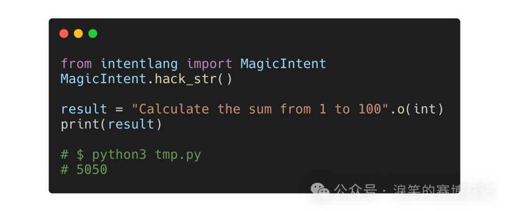
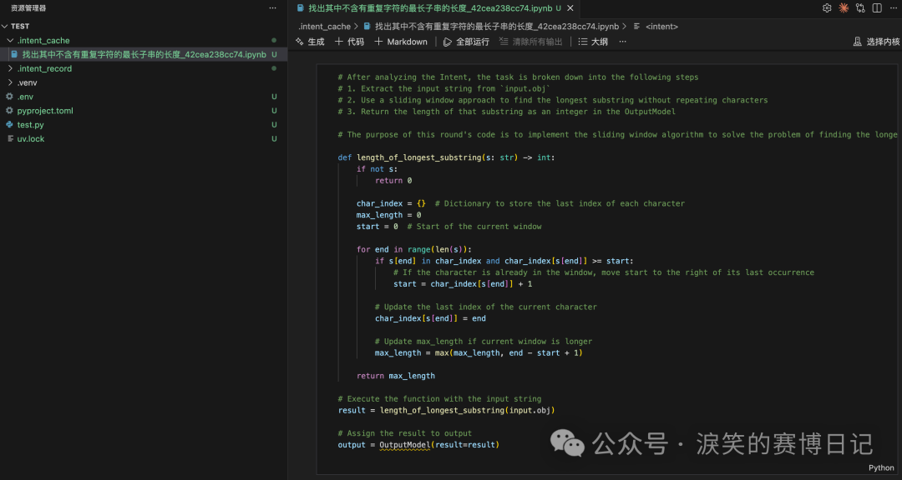

---
date:
  created: 2026-01-11
slug: qiling_cpython_str_hack
title: 为了创造 AI-native programming language, 我 hack 了 CPython 的 str
---

## **[起零衍迹实验室]**{ style="color: #ff9f0a;" } 为了创造 AI-native programming language, 我 hack 了 CPython 的 str



上一篇文章 [《IntentLang：以第一性原理与意图工程重建 AI Agent》](https://mp.weixin.qq.com/s?__biz=Mzk2NDgwMTY5Nw==&mid=2247483973&idx=1&sn=a8921c26fff94508c469e09ee382dfe5&scene=21#wechat_redirect) 刚发布没几天，就收到很多师傅的反馈说晦涩难懂。我重新审视了一下，确实文章直接以我个人的视角去描述了很多只有我自己在做 Agent 开发时遇到的痛点，另外我文中举的例子又太过简单，不足以描述我到底在用 IntentLang 解决什么样的问题。而且也用了 AI 进行润色，确实让文章比较抽象。

<!-- more -->

另外就是大多数人其实不关注什么是 LLM 的原始推理结果，什么是模型厂商在此之上对外提供的 API 协议封装，支持工具调用的模型究竟和普通模型有什么不一样，Function Calling 到底是一种模型能力、协议约定还是运行时机制，让 LLM 看起来 "拥有记忆" 的本质究竟是什么，在应用层又该如何实现。

但我还是不想放弃介绍 IntentLang，于是我想到了一个很酷，也很 Geek 和 Hacker 的方法：直接在语言层面 "hack" Python，让字符串本身成为一个可执行的 Intent，贯彻**人类意图就是一等公民**。

而这么做之后，IntentLang 也似乎向 ANPL（AI-native programming language）又更近了一步。

## Vibe Coding 与 Intent Coding

目前的 Vibe Coding 指的是开发者通过自然语言描述需求，驱动 AI 编程工具去生成代码，开发者只需要关注需求和方向，甚至可以不在意代码细节，专注于最终目标。

### Intent Coding

所以 Vibe Coding 是**自然语言驱动 AI 进行编程**，而 IntentLang 或者说 Intent Coding 是**以 AI 为基础的自然语言编程**。**自然语言编程不是生成代码，而是直接成为代码**。这篇文章我也不想再讲抽象的概念，直接给出代码示例：

```text
from
 intentlang 
import
 MagicIntent

MagicIntent.hack_str()

result = 
"计算1到100的和"
.o(int)

print(result)
```

```text
$
 python3 test.py

5050
```

是的，你没有看错，上述的代码是真实可运行的，你要做的仅仅是描述意图（自然语言的字符串就是意图），指定输出类型，然后就足够了，可以让开发者在 Python 世界里感受到 "言出法随"。

而且不仅如此，你还可以处理已有数据：

```text
from
 intentlang 
import
 MagicIntent

MagicIntent.hack_str()

data = {
"name"
: 
"leixiao"
, 
"age"
: 
26
, 
"city"
: 
"Hangzhou"
}

result = 
"转成一个结构清晰的表格"
.i(data).o(str)

print(result)
```

```text
$
 python3 test.py

| Key | Value |

|-----|-------|

| name | leixiao |

| age | 26 |

| city | Hangzhou |
```

通过自然语言控制条件分支：

```text
from
 intentlang 
import
 MagicIntent

MagicIntent.hack_str()

login_data = {
"login_failures"
: 
12
}

if

"这个用户是否应该被封禁？"
.i(login_data).o(bool).c(
"登陆失败次数超过10次的需要封建"
).r(
'先看一下登陆数据结构,不要猜测 key'
):

print(
"Yes"
)

else
:

print(
"No"
)
```

```text
$
 python3 test.py

Yes
```

还可以无中生有：

```text
import
 socket

from
 intentlang 
import
 MagicIntent

MagicIntent.hack_str()

sock: socket.socket = 
"创造一个 socket 对象,并向 example.com 发起 GET 请求"
.o(socket.socket).r(
"不要读取数据,不要关闭 socket"
)

print(sock)

print(sock.recv(
15
).decode())

sock.close()
```

```text
$
 python3 test.py

<socket.socket fd=10, family=AddressFamily.AF_INET, type=SocketKind.SOCK_STREAM, proto=0, laddr=('192.168.1.6', 58427), raddr=('104.18.27.120', 80)>

HTTP/1.1 200 OK
```

接力操作复杂对象：

```text
import
 socket

from
 intentlang 
import
 MagicIntent

MagicIntent.hack_str()

sock = socket.socket(socket.AF_INET, socket.SOCK_STREAM)

sock.connect((
'example.com'
, 
80
))

request = 
b"GET / HTTP/1.1\r\nHost: example.com\r\n\r\n"

"用 socket 对象发送这段数据请求, 不需要读取"
.i({
'sock'
: sock, 
'request'
: request})()

print(sock.recv(
15
).decode())

sock.close()
```

```text
$
 python3 test.py

HTTP/1.1 200 OK
```

最后再来做个算法题吧：

```text
from
 intentlang 
import
 MagicIntent

MagicIntent.hack_str()

s = 
"abcabcbb"

length = 
"找出其中不含有重复字符的最长子串的长度"
.i(s).o(int)

print(length)
```

```text
$
 python3 test.py

3
```

### Intent 的缓存与复用

前文的例子中，其实大多数意图都是固定的逻辑，也就是说意图被 AI 推理执行后，意图的执行过程是可以缓存的，下次再次执行同样的意图无需再次经过 AI 推理，直接复用上一次 AI 生成的代码即可。在 `MagicIntent` 中可以用 `MagicIntent.hack_str(cache=True)` 语句设置。

以算法的代码为例，会在当前目录下的 `.intent_cache` 目录生成缓存文件：



而且代码逻辑与输入的数据是解耦的，所以可以随意更换数据，之前的缓存代码依然可复用：

```text
from
 intentlang 
import
 MagicIntent

MagicIntent.hack_str(cache=
True
)

s = 
"abcabcbb"

length = 
"找出其中不含有重复字符的最长子串的长度"
.i(s).o(int)

print(length)

s = 
"bbbbb"

length = 
"找出其中不含有重复字符的最长子串的长度"
.i(s).o(int)

print(length)

s = 
"pwwkew"

length = 
"找出其中不含有重复字符的最长子串的长度"
.i(s).o(int)

print(length)
```

```text
$
 python3 test.py

3

1

3
```

`MagicIntent.hack_str(cache=True)` 会控制所有魔法意图（由 Python 字符串直接书写的意图）的缓存行为，如果要差异化控制每一个意图的缓存行为，或者有异步调用的需求，还是建议用 IntentLang 的 `Intent` 类，具体使用方法可以参考仓库 README： https://github.com/l3yx/intentlang#compilation-and-execution 。

## 黑客的语法糖

> A Geek Idea, Implemented in a Hacker Way.

其实以上把自然语言字符串本身变成一个可计算对象只算是 IntentLang 的一个 "语法糖"，以下两段代码是等价的：

```text
from
 intentlang 
import
 MagicIntent

MagicIntent.hack_str()

result = 
"计算1到100的和"
.o(int)

print(result)
```

```text
from
 intentlang 
import
 Intent

intent = Intent().goal(
"计算1到100的和"
).output(result=(int, 
""
))

result = intent.run_sync().output.result

print(result)
```

但后者远没有前者 Cool，也会被质疑 "这和其他 Agent 框架有什么区别？"。

然后这一小节本来还想讲一下我是如何 "hack" CPython 的 str 的，但想了下其实有了 AI 之后也没必要，大概提几个关键点吧：

- 我在代码层，修改了 CPython 类型对象的内部结构，为 str 插入了自定义的几个方法
- 在字符串上调用 `.i() .o() .c() ...` 这些方法其实是在构造一个 `MagicIntent` 对象
- `MagicIntent` 相当于一个 "Value Proxy"，本身不保存值，保存的是 `Intent` 对象
- 为 `MagicIntent` 重载了如 `__str__`， `__float__` ，`__add__`，`__getattr__` 等魔术方法
- 在代码中进行任何对 MagicIntent 的观察和计算的行为，都会最终触发 `Intent.compile(...).run_sync()`

完整的关键代码如下，如果对细节原理感兴趣的话可以拿这段代码问一下 AI ：

```text
import
 ctypes

import
 gc

from
 typing 
import
 Type, Callable, Tuple, Any

from
 intentlang 
import
 Intent

class MagicIntent:

_max_iterations: int = 
30

_cache: bool = 
False

_record: bool = 
True

def __init__(self, goal: str):

self.intent = Intent().goal(goal)

self._result: Any = 
None

self._executed: bool = 
False

def o(self, type: Type) -> "MagicIntent":

self.intent.output(result=(type, 
""
))

return
 self

...

def __call__(self) -> Any:

if
not
 self._executed:

if
not
 self.intent._output:

self.intent.output(result=(bool, 
"success"
))

self._result = self.intent.compile(

max_iterations=MagicIntent._max_iterations,

cache=MagicIntent._cache,

record=MagicIntent._record

).run_sync().output.result

self._executed = 
True

return
 self._result

def __bool__(self) -> bool:

return
 bool(self())

def __int__(self) -> int:

return
 int(self())

...

@classmethod

def hack_str(cls, max_iterations: int = 30, cache: bool = False, record: bool = True):

cls._max_iterations = max_iterations

cls._cache = cache

cls._record = record

def o(self, p) -> "MagicIntent":

magic_intent = cls(self)

magic_intent.o(p)

return
 magic_intent

def i(self, p) -> "MagicIntent":

magic_intent = cls(self)

magic_intent.i(p)

return
 magic_intent

...

referents = gc.get_referents(str.__dict__)

real_dict = next(obj 
for
 obj 
in
 referents 
if
 isinstance(obj, dict))

real_dict[
'o'
] = o

real_dict[
'i'
] = i

...

ctypes.pythonapi.PyType_Modified(ctypes.py_object(str))
```

