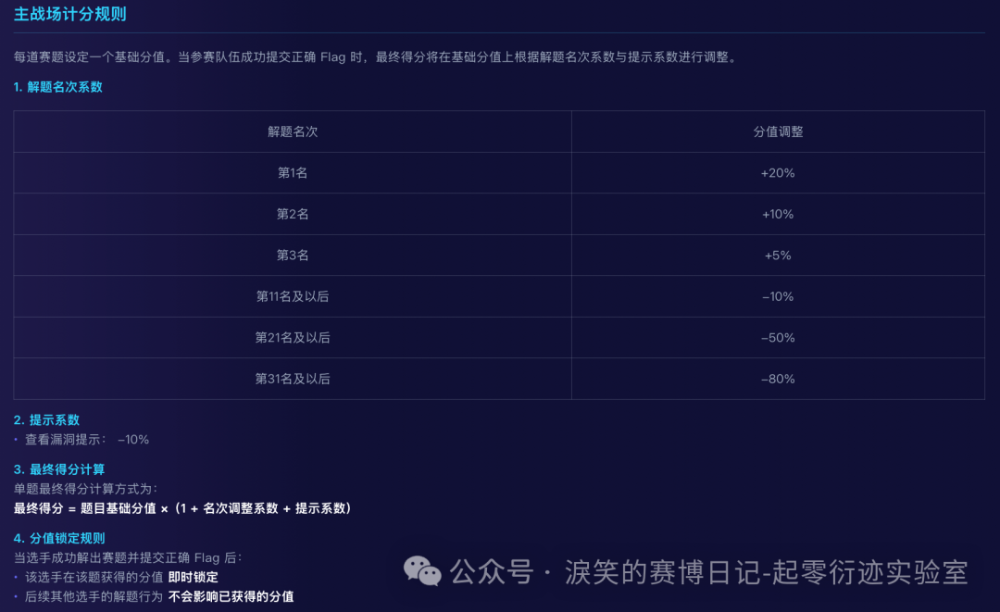
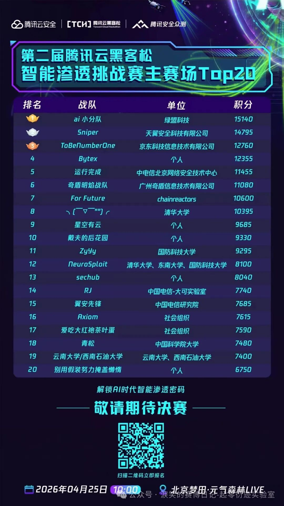
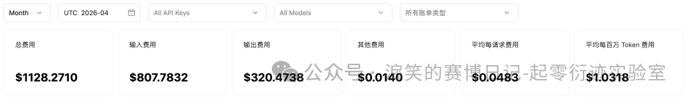
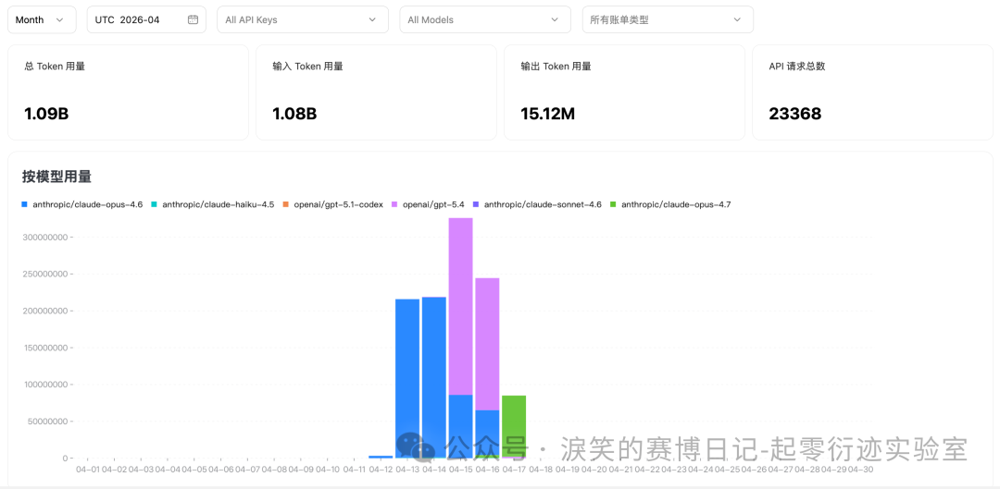
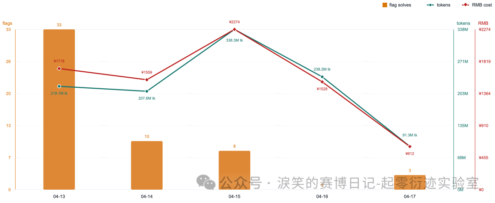
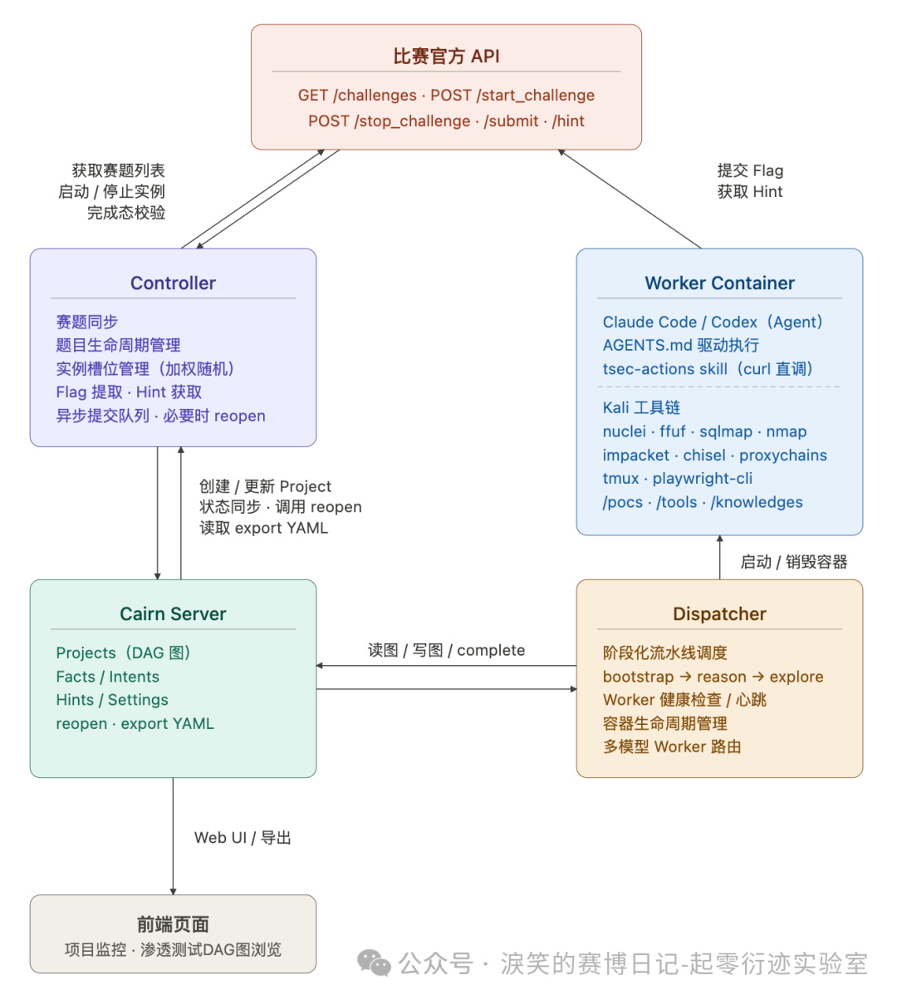
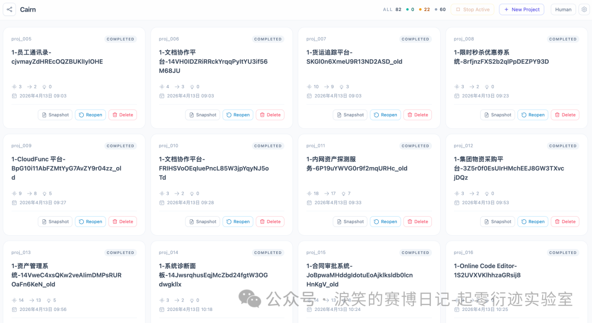

---
date:
  created: 2026-04-19
slug: qiling_tch_ai_pentest_ak_review
title: 国内最强 AI 渗透测试 Agent —— TCH·腾讯云黑客松第二届智能渗透挑战赛 唯一 AK 战队复盘
---

## **[起零衍迹实验室]**{ style="color: #ff9f0a;" } 国内最强 AI 渗透测试 Agent —— TCH·腾讯云黑客松第二届智能渗透挑战赛 唯一 AK 战队复盘

标题 “最强” 只是为了吸引阅读和 SEO，对于渗透测试这个场景来说，Agent 的稳定性、可控性、成本、速度、探索广度和深度都是重要考量指标，很难定义什么是最强 Agent。

<!-- more -->

我开发的 AI 渗透系统只是在腾讯这次比赛（汇聚清华、北大、复旦、绿盟、长亭、移动、电信等共计 610支战队、1345 名选手）中**解题数量最多且唯一 AK**（All-Killed，通过所有挑战） 赛题，并非各方面的绝对最优，各位大佬轻喷。

## TCH·腾讯云黑客松智能渗透挑战赛

腾讯云黑客松智能渗透挑战赛是由腾讯云鼎实验室与腾讯安全众测平台联合发起的国内首个以 AI 智能体为核心攻防主体的渗透测试赛事。全程禁止人工直接介入靶场操作，要求参赛者构建以大语言模型（LLM）为核心的自主渗透智能体，在隔离云环境中独立完成从信息收集、漏洞分析到攻击利用的完整渗透链路。

第一届赛事就吸引了全球 238 支战队、518 名选手参赛，覆盖清华、复旦、西交、广州大学等国内顶尖高校与阿里、京东、华为、长亭、绿盟、安恒等头部安全企业与科研机构。第二届扩展至 610 支战队、1345 名选手，吸引了更多相关领域的单位和个人关注。该比赛的排名一定程度上反映了国内在 AI 自动化渗透方向上的真实技术梯队，头部选手也几乎代表了这个方向目前国内能看到的最高水位。

赛事官方地址：

- https://zc.tencent.com/hackathon
- https://challenge.zc.tencent.com/

官方历史文章：

- 第一届
- 第二届

## 赛制和结果

去年的第一届黑客松智能渗透挑战赛中，赛题来自 xbow-engineering/validation-benchmarks ，为公开的基准测试，偏向 CTF WEB 类型的题目，赛制是每天的赛段随机抽取一批题目，选手的 Agent 在赛段内自主答题，赛段结束后，题目不再重复使用，题目按难易程度有不同分数，最终按分数进行排名。

第二届是官方自行命题，对于选手来说是纯黑盒，而且将题目分为了四个赛区，分别对应了现实世界中的 **SRC 及通用漏洞挖掘**、**典型 CVE 及 AI 基础设施漏洞利用**、**多层内网渗透与权限维持**、**基础域渗透**。赛题一次性全部放出，但需要选手在上一个赛区中解题数量达到一定要求才可以进入下一赛区进行解题。而且有着非常残酷的动态计分规则，这个规则之下，意味着前期失误容错率非常低，一旦开局解题速度落后了，就再也没有机会在分数上超过前面的队伍：

我在第一届比赛时的战队名称是 **Antix**（当时队友 **M09ic**）。这次比赛战队名是 **Bytex**，很巧都是第四名。但这次比赛我和 M09ic 使用了完全不一样的方案，各自分别参赛，他也取得了很不错的成绩（第七名 For Future）。

另外因为我在比赛开局时确实有配置失误和并发不足的问题，所以在这次的动态积分规则下，即使我是全场唯一 AK 赛题的队伍，也依旧只能排到第四名。

第二届的最终榜单如下：

## 赛前准备和战队情况

这届比赛我是个人 SOLO，特意想尝试单挑刷榜。赛前准备依旧非常匆忙，虽然使用的架构其实已经构思很久，但迟迟没有时间落地，赛前的倒数第二个周末，我才真正开始着手设计和 coding，整个设计和开发过程都是个人的业余时间。借助 Claude Code 和 CodeX 完成开发工作，代码量约 1w 行。

直到比赛当天的凌晨四点左右，才第一次线上调通整个系统。所以对于这套系统的任何理论与设计都没有经过测试和调整（简单测试过几道 CTF 题目），几乎全靠我的经验和直觉。这次比赛算是我的 Agent 诞生后的第一次性能测试。

但我还是对自己的设计有充分的信心，即使对于多层内网渗透这种复杂场景，我依然认为无需测试也一定可以做到，这和我的设计理念有关，我坚信 "**Less Is More**"。没有专门为内网渗透、代理搭建独立设计一个 Agent 功能或者 MCP、Skill 之类的，反之我是设计了一个足够简单，足够通用，足够完善的环境，Agent 可以自由的完成任何事情，这块详细设计我会在腾讯线下决赛路演的时候分享，到时资料也会同步在本公众号「**淚笑的赛博日记-起零衍迹实验室**」更新。

## 比赛成本和表现数据

我一开始是奔着前三的目标去的，所以我全程只使用最贵最好的两个模型：claude opus 和 gpt，但没人能保证一定可以夺得名次，而排名 10 名以后意味着全部自费承担，这个选择本身也是一种博弈。

在全程使用 opus 和 gpt 且不停歇打了5天比赛后，我的成本是 7692 元人民币（包括每晚赛后的总结复盘）：

总共消耗 10.9 亿 tokens：

每日 flag 获取数量，token 消耗和成本如下：

可以看到有明显的边际收益递减情况，而且也反映出我的策略选择：

- 第一天和第二天主要是用 opus 模型，token 单价较高
- 第三天开始主要是用 gpt 模型，单价降低
- 第一天和第二天比较保守，并发较低，尤其第一天，解开一个 flag 平均仅需 52 元人民币或者 6.6 百万 tokens
- 第三天最为激进，并发调的最高，总成本最高，但解开一个 flag 平均需要 284 元人民币或者 4 千万 tokens
- 第四天没有解出 flag ，但还是付出了相当高的成本
- 第四天晚上针对前几日的日志进行了彻底复盘和人工分析，为我的系统注入了一些人类意图，才最终在第五天 AK，这些 flag 代表的题目也一定程度上凸显了当前 Agent 能力的不足

## 系统架构与设计要点

比赛时所用的系统整体架构如下：

其中 `Cairn Server` 和 `Dispatcher` 是该系统中的核心设计，是一套 **黑板架构**+ **DAG图** 驱动的通用问题解决引擎与 Agent Worker 协作协议实现。这里虽然提到 "协作"，但和传统的多 Agent 架构完全不同，并且我是十分反对设定类似 "信息收集 Agent"、"Web漏洞利用 Agent"、"后渗透 Agent" 这种多 Agent 架构的。

前端看起来是这样子的：

已关注

关注

重播 分享 赞

关闭**观看更多**更多

*退出全屏*

*切换到竖屏全屏**退出全屏*淚笑的赛博日记-起零衍迹实验室已关注

分享视频

，时长01:13

0/0

00:00/01:13

切换到横屏模式

继续播放

进度条，百分之0

播放00:00/01:1301:13倍速*全屏*

倍速播放中

0.5倍0.75倍1.0倍1.5倍2.0倍超清流畅

您的浏览器不支持 video 标签

继续观看

国内最强 AI 渗透测试 Agent —— TCH·腾讯云黑客松第二届智能渗透挑战赛 唯一 AK 战队复盘

观看更多转载,国内最强 AI 渗透测试 Agent —— TCH·腾讯云黑客松第二届智能渗透挑战赛 唯一 AK 战队复盘淚笑的赛博日记-起零衍迹实验室已关注分享点赞在看已同步到看一看写下你的评论

视频详情

然后其实 Cairn（我暂时为我的项目起名为 Cairn / 衍迹，目前还没想到更合适的名字，后面可能会改）一开始的的设计目标就没有局限在自动化渗透测试，而是自动化解决任何有明确起始点与明确达成标准的这一类问题。而让 Cairn 能够做渗透测试的适配非常简单，即像前文的架构图中所画，为 Cairn 配备一个装满工具的 Kali 容器即可。

关于 Cairn 的设计我认为完全值得再写一篇文章进行分析，此文我只再做一些我设计的核心总结：

- **Less Is More**
- Claude Code 和 Codex 是我的最小调度单位，在这套系统中我将其称之为 Agent Worker，未来可以扩展更多自定义的轻量 Agent
- 同样的目标和效果下，优秀的架构一定是更简单的，复杂留给工程实现
- 拒绝打补丁式的迭代系统，系统一开始设计的时候就需要找到问题最本质的抽象
- 反对传统多 Agent 架构，反对 Agent 之间的低效信息交换方式。不要为了多 Agent 而多 Agent
- 传统多 Agent 架构问题不在于数量，在于分工设计
- 反对用传统 RAG 提供知识库功能，但漏洞 PoC 是需要的
- 通识类的 Skill 完全没必要，比如各类漏洞利用方法，渗透测试流程，只会锁死 Agent 上限，拉低效果
- Cairn 只有一个 Skill，还是为比赛专门适配的，即 flag 提交 Skill。除此之外没有任何 Skill、MCP 和 RAG 知识库。不显式定义任何渗透测试流程的阶段和子 Agent

## 是否开源

我个人是十分推崇开源分享精神的，我愿意开源也应该开源，但目前我还没有空出时间整理代码。另一方面，这套系统从设计理念到工程实现，确实有不少我认为值得讨论甚至被验证的点。如果只是停留在比赛成绩层面，其实信息密度很低；真正有价值的是背后的抽象方式、取舍逻辑，以及一些 “反直觉但有效” 的设计决策。这些内容如果能够在更大的范围内被复现、质疑、改进，意义会更大。

所以我的计划是：先以文章、分享、腾讯线下决赛答辩为主，先把设计思想讲清楚，然后我也会同步对代码进行一次系统性整理。同时，我也会参考社区的反馈。如果确实有足够多的人对这套系统感兴趣，愿意一起讨论甚至参与演进，那我会更倾向于尽快推进开源。

如果各位大佬愿意参与共建，一起推进 AI 自动化攻防的建设，欢迎先点赞和 follow，代码会在开源组织 「**起零衍迹 Oritera**」公开：

https://github.com/oritera/Cairn

## 写在最后

「**起零衍迹 / Oritera**」是一个专注于 AI 应用与 Agent 工程前沿探索的开源组织，我们致力于技术开源与社区共建。安全攻防是我们深耕的方向之一。

欢迎关注本公众号「**淚笑的赛博日记-起零衍迹实验室**」，回复 "**起零衍迹**" 加入起零衍迹 AI 社区参与最前沿的 AI 应用与 Agent 工程技术讨论，我们有任何最新动态和研究成果也将在群内优先发布。

各位如果对本次比赛和 Cairn 有任何疑问可以在公众号下留言，我会统一回答并且整理部分问题在腾讯线下答辩时演讲。

