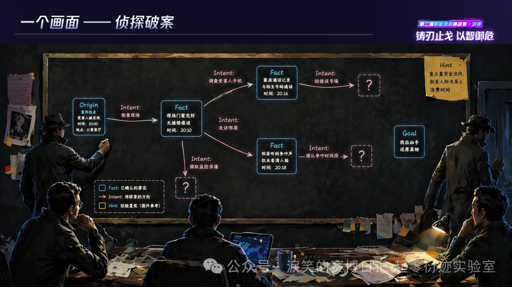
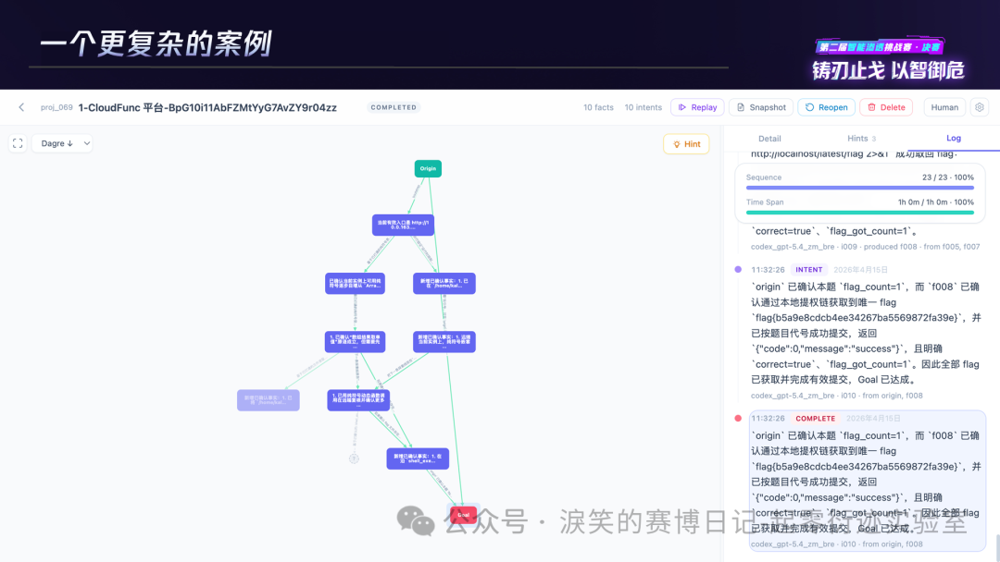
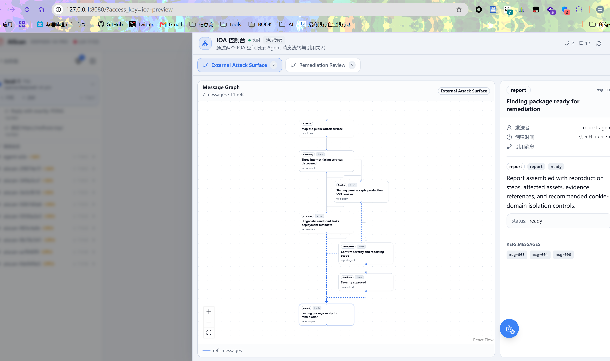

---
date:
  created: 2026-07-27
slug: graph-engineering-agent-engineering
title: 重新理解 Graph Engineering：Agent 工程到底发生了什么变化
---

过去几个月中，AI 工程界经历了 **概念的通货膨胀**。 从 harness engineering 被发明开始， 每个月都有新的词， environment engineering、 loop engineering 、 graph engineering，再加上更早之前的prompt engineering， context engineering。

已经让我不太认识engineering这个单词了。

**这些概念之间的边界在哪？它们解决的是不同问题，还是同一问题的不同侧面？**

但除了prompt和context， 后面的这些概念都没有定义，大多都是anthropic和openai的某一篇技术博客和x上的一个帖子， 主要是把口号喊出去了。

我们需要回到本质去重新思考这些engineering。

<!-- more -->

## 当我们在AI时代说Engineering的时候， 我们在说什么？

AI时代的Engineering有非常特殊的意义，所有的Engineering都是与Model 进行概率性的交互，不过**从早期的约束和限制性的工程，逐渐演变为了AI的辅助思考的机制**。

**模型的概率性行为行不再被视作风险， 而是创造力的来源**， 这也是我们在之前几届比赛中的设计出发点， 通过概率性行为去涌现出更加强大的能力。

现在需要回到一切发生之前去重新思考这个问题。  AI 时代的 Engineering 不再是微观层面的系统架构， 而是变成了设计某种结构， 让结构在过程中去构建我们需要的能力。

从Harness 开始的 Environment、Loop、Graph 都具有这个性质。 **通过找到某种结构， 然后让Agent作为其中的动力， 然后自然而然的涌现出超出预期的效果**。

而我曾经提到过一个等式

**Information + Feedback = Engineering**

 Information 对Agent来说就是 Context ， 而Feedback 就是 Harness、Environment、Loop、Graph 背后所隐藏的结构。 这个是控制论视角下的归纳：


| Engineering     | Information     | Feedback          |
| :-------------- | :-------------- | :---------------- |
| **Harness**     | 工具调用指令及其参数      | 工具执行返回的结果         |
| **Environment** | Agent 当前行为与环境状态 | 边界触碰、资源限制或沙箱约束的响应 |
| **Loop**        | 当前步骤的状态与中间产物    | 状态变化触发的下一步信号      |
| **Graph**       | 节点属性、边关系与当前拓扑   | 拓扑结构随执行发生的演化      |

而最新的Graph，是一个语义非常模糊的概念，以至于原作者说不清楚， 只能模糊的牵扯到Harness，Loop， 尝试通过类比来蒙混过关。 我看了三四篇文章， 又多是对本就含糊的原文让AI二次咀嚼， 实在不知道Graph Engineering在讲什么。


又恰好我们近一年的工作总是和Graph相关， 所以从我自己的角度尝试把这个概念给明确下来。


**真正让Cairn有效的机制是什么？**（选择题）

1. 基于DAG的黑板架构
2. Fact-Intent的链式推理机制
3. 两者都有效

不了解cairn是什么的朋友可以去阅读[淚笑的文章《无径之径》](起零衍迹实验室%20-%20无径之径：Cairn%20AI%20从渗透测试到通用问题的求解.md)。

## 从AI焦虑到结构主义

什么是结构主义，我让AI给了一个例子：

> **答法 A（实体主义）**：马是一块木头，雕刻成马头的形状，高约 4 厘米，重约 8 克。
>
> **答法 B（结构主义）**：马是一个走"日"字的东西。它是不是木头做的、雕成什么形状、甚至是不是一块实物（可以是一张纸片上写个"马"字），都无所谓。**只要它在棋盘上遵循那套走法规则、和其他棋子构成那套关系，它就是马。**

显然答法 B 才是对的。而且注意一个事实：如果明天全世界的棋子都用塑料做了，棋还是那盘棋；但如果你把马的走法改成走直线，哪怕棋子雕得再精美，它也不再是马了。

**结构主义就是把这个直觉推广到一切：一个东西"是什么"，不取决于它自身的材质和本质，而取决于它在整个系统里和其他东西的关系。**

**关系先于实体。结构决定性质。**

AI时代的重新发明了结构主义， 并且逐步形成了共识发明了各种新的结构。 可以总结出一个新的等式。

刚才提到的: Information + Feedback 并非唯一的视角。在结构注意视角下，我们的Engineering有完全不同的形态：

我们从结构主义的视角重新去看Engineering:

| Engineering     | 空间结构（共时性）             | 时间结构（历时性）           |
| :-------------- | :-------------------- | :------------------ |
| **Harness**     | 工具集合、调用接口、参数-结果的静态映射  | 调用 → 结果 → 再调用的因果序列  |
| **Environment** | 行为与边界的条件依赖拓扑、权限矩阵     | 行为 → 边界触发 → 修正的事件序列 |
| **Loop**        | 步骤间的先后与因果依赖、状态节点      | 状态迁移轨迹、迭代深度、收敛过程    |
| **Graph**       | 节点间的关联拓扑（DAG / 树 / 网） | 拓扑分叉、汇合、剪枝、版本演化     |

## 从 Graph 到 Structure

graph是AI时代的最Native的结构， 从LLM横空出世以来， Graph的出场率一直不低， 从LangChain/Graph, Dify(DAG) ,  Dynamic Workflow， GraphRAG， CoG（Think of Graph）等等。

以至于每次看到Graph 都像是回归到之前的时代， 我们从结构的角度触发重新审示Graph。

Graph 到底解决了什么问题？

这个问题就是  Graph Engineering 要做的事情， **Graph在不同的系统中有不同的结构， 并且任何一个细微的差别都会呈现出完全不同的效果** 。

### 图的结构

现在回到graph， 并非是我们加入了某种graph， agent就能更好的工作了， 不然LangGraph和Dify早就统一了agent世界。

真正的核心是  **适当的内容**在**适当的时间**插入到context， 而内容和时间点形成的路径，自然而然形成了graph。 如果我们从graph去理解这个机制， 很容易回到了langgraph的**调度驱动**的grpah中。


这里有两个关键概念： **历时性和共时性**。 不过不要被名词吓退， 实际上非常好理解。

**共时性(synchronic)= 冻结时间,看某一时刻系统内部的结构关系**

- 类比:对一个正在运行的系统做一次 `内存 dump` 或者 `config snapshot`,分析这一刻所有组件之间的关系、状态机当前处在哪个 state。

**历时性(diachronic)= 沿着时间轴,看系统是怎么演变过来的**

- 类比:`git log` / `git blame`,追溯一个函数是怎么从 v1 改到 v5 的,中间经历了哪些 commit、哪些人改的。


> TCH是腾讯云举办的智能体渗透赛，**让参赛者编写的“AI黑客”在虚拟战场上自主对抗、互相攻防，而人类只能在一旁观战的比赛**  。

而网络安全场景是**最复杂最困难agent工况**， 不像coding一样能通过阅读代码了解所有的信息， 甚至和coding相比， 底层的思维模式都不同， 我们无法通过多种方式去构建结果， 只有质量好坏区分， 大部分情况下， 都需要hacking的思维找到最关键的点去解决最困难的问题。

### **AI总结的两届TCH图相关的设计汇总**:

| 背景                      | 图类型                        | 关键设计/结构                                                                                         | 历时性结构                                                                               | 共时性结构                                            |
| ----------------------- | -------------------------- | ----------------------------------------------------------------------------------------------- | ----------------------------------------------------------------------------------- | ------------------------------------------------ |
| 广州大学方班                  | 任务 DAG + 因果证据图（双层复合图）      | Planner 维护任务 DAG 做拆解调度；Reflector 另建证据图记录支持/反驳/矛盾关系并计算置信度；两层图通过重规划互相触发，底层用 `networkx.DiGraph` 实现 | 任务状态按 pending → ready → in-progress → completed/failed 流转；新证据出现会修改假设置信度，进而触发剪枝和重新规划 | 任务层反映“此刻谁依赖谁”；认知层反映“此刻哪些证据支持或反驳哪个假设”             |
| 西安交通大学网络空间安全学院          | API 业务依赖图                  | 先探索页面与 API 塑造业务场景，显式抽取控制依赖、数据依赖、隐式依赖三类边，再交给分类漏洞 Agent 和 Fuzzer 按依赖顺序验证                          | 调用本身存在先后次序，但材料未说明依赖图是否会随探索过程持续更新或版本化                                                | 同一业务场景内，哪个调用依赖哪个前置条件（如登录令牌）、数据来自哪个上游             |
| 清华大学、东南大学、国防科技大学联合      | 角色状态机（FSM）                 | Apache Burr 管理 Lead/Recon/Exploit/ReMem 等角色的状态与合法迁移，只允许预定义跳转，避免越级或重复执行                          | 状态迁移按时间顺序防止跳步和重复；成功/失败经验跨任务持续累积，影响后续检索策略                                            | 当前所处状态决定此刻哪些角色和动作被允许执行                           |
| 绿盟科技                    | 输出关系图（Mermaid 可视化）         | 用 LangChain DeepAgents 做上下文压缩与渐进式知识加载，最终把请求-响应-潜在漏洞的关联渲染成 Mermaid 流程图供人阅读                       | —                                                                                   | 某一次侦察结果被整理成的静态关联快照                               |
| 涙笑                      | 共享状态空间黑板图                  | Origin/Goal/Fact/Intent/Hint 构成共享黑板，多个平等 Worker 以蚁群式间接协作并行读写，搜索路径在过程中涌现而非预先规划                   | Worker 不断写入新 Fact 和 Intent，图持续分叉、汇合；旧结构不被删除或覆盖，作为搜索历史和证据链保留以便审计                     | 某一时刻的黑板是全体 Worker 共享的“已知世界”，事实、候选行动、目标同时并存       |
| 京东科技安全团队                | 业务攻击面图谱（Attack Path Graph） | 用 ScenarioNode/API Node 建模页面与接口，边类型分为 `CONTAINS`、`USES_API`（结构归属）和 `NEXT_STEP`（业务次序）            | `NEXT_STEP` 边给出逻辑先后顺序，但材料未说明图版本如何演化、真实执行轨迹是否会写回图谱                                   | `CONTAINS`、`USES_API` 描述场景、页面、API 三者此刻的静态归属与调用拓扑 |
| 中国电信大可实验室               | 多路径竞争地图（Path Map）          | Orchestrator 把任务派发给 12 类领域 SubAgent，配合 Path Map 和双层漏斗记忆，让多条候选路径同时竞争、择优执行                        | 多路径竞争会动态改变任务分配，但节点/边具体如何增删、失效或版本化未披露                                                | 同一时刻并列展示多条候选路线，以及全局/子黑板中当下可用的领域知识                |
| **ChainReactors(本文作者)** | 语义驱动 FSM（自然语言状态机）          | 用 YAML 定义 start/explore/execute/done 等粗粒度状态，状态间转移条件用自然语言描述，由 LLM 现场解释语义边决定走向，取代上一届的硬编码 DAG      | 每一轮 LLM 根据当前结果解释语义边并选择下一状态，分支与循环由此逐步形成执行历史                                          | 当前状态加上尚未激活的语义边，共同构成“此刻有哪些可能走向”的空间                |
| 清华大学                    | 动态攻击路径树（Attack Tree）       | 单 Planner 统筹全局，按环境反馈动态更新节点状态和选择路径，严格保持树的单父节点和无环性以换取可解释性                                         | 每次工具执行的反馈把节点标记为成功或失败，驱动系统选择、回退或扩展下一条分支                                              | 某一时刻并列展示当前候选攻击步骤、子目标和备选分支                        |

本质是可以归为三种形态:

|类型|核心约束|材料中的例子|
|---|---|---|
|Tree(树)|每个非根节点只有一个父节点,无环|清华队攻击路径树|
|DAG(有向无环图)|有方向,不能绕回来,但一个节点可以有多个父节点(可汇合)|BinX 任务图(`networkx.DiGraph`)、Bytex/Cairn 黑板图|
|FSM(有限状态机)|状态数量有限,可以有环(能在状态间来回切换)|NeuroSploit、For Future、戴夫的后花园——三者拓扑相同,但边语义和用途完全不同|

DAG强调执行路径的轨迹， FSM强调 执行前的定义。从图的视角来看则是完全等价的， 而**从结构主义的视角， 因为其性质不同（共时性和历时性）， 即使相同的拓扑也有完全不同的效果**。

可以发现， 图实际上早就被多次引入重复发现。 而是否有效其中的关键点并非图， 而是图的结构（包括历时性和共时性的设计）。

## Graph Engineering = Stucture Engineering

我们刚才提到了 graph 本质是指的是一系列不同的结构， 不同的结构在各种场景用起到了完全不同的作用。 不能将graph看作是同一种东西。

而 **Graph Engineering 的本质是关注agent之间协作问题**， **协作问题的本质就是设计一个有效的共时性和历时性结构**。

### 从调度(Scheduling)到协调(**Coordination**)

我们在过去一年的实践中发现，  **大部分多agent架构都造成了负优化**。传统的多agent总是：

让多个Agent协作完成一个目标——"分析一个Web应用并找到漏洞"。

- Agent A：负责信息收集
- Agent B：负责漏洞验证
- Agent C：负责生成报告

也有研究成果指出了类似的问题。

[Hackers or Hallucinators? A Comprehensive Analysis of LLM-Based Automated Penetration Testing](https://arxiv.org/abs/2604.05719) 。

> kimi k3 总结：
>
> 1. 单 agent 在 Easy/Medium 任务上不劣于、甚至超过多数多 agent 框架，前三名实际单 agent 框架总分全部进前六。
> 2. 当前多 agent 框架的通病：角色边界模糊、功能冗余导致决策冲突、通信信息丢失、记忆碎片化。
> 3. 但多 agent 并非本质不行：全场最高分 CTFSOLVER 就是多 agent——赢法是并发探索（多个 solutioner 并行覆盖多条路径），本质是"多个独立单 agent 并行"，而非强耦合分工；LuaN1ao 则靠任务图 + 因果图实现共享结构化记忆。
> 4. 核心论断：架构选型（单 vs 多）不是关键，关键是任务边界划分、协作冲突控制、高质量记忆结构。

**问题出在哪？**

传统的多Agent有一个隐含的机制 --- **调度**。  调度隐含了主从、角色划分等关系， 包括已经失败的A2A协议， 其设计也隐含了类似的理念。

调度的初衷是LLM不够强大的时候， 通过工程去代替智能。 而这个理念被年初的opus4.6击碎了， 不需要人类去教AI下一步改怎么做， AI自己能找到正确的路径。 **调度反而成为限制**。

那么如果不需要调度， 如何设计适用于现代的agent工程？  答案实际上在上一届的TCH中已经给出了--- **协调** 。

Model 本身是无状态的， 加上了Context的Agent才会由状态。 只需要将**适当的内容**在**适当的时间**插入到context， 就能引导agent的方向。

具体就是指： 将**自然语言作为所有协调机制的动力**， 设计的特定的结构使得我们的自然语言再恰当的地方生效。

**当模型能够自己找到正确路径时，任何预设的调度逻辑都是对它能力的浪费。**

之前提到过 Information + Feedback 是类似控制论视角的结构， 那么协调就是另一个结构。这些不同的结构衍生出了完全不同的设计。并且就算**相同的结构， 也具备完全不同的性质**。

## 协调: **通过共享上下文来通讯 还是  基于通讯来共享上下文**


这个子标题不知道是否有人能快速的意识到， 这也是一个已经被发明了几十年的理念， 用于软件的并发相关的设计， 并且有多条技术路线各自独立发展。

之前有人提到graph engineering很像cairn。 这个确实没错， 但**同样一个黑板也会隐含了多种完全不同的结构**。

cairn 的 黑板本质上就是协调机制。 我们从cairn 入手， 去回到之前提出的问题， 如果说cairn的架构有效， 到底是什么起到了作用。

### 通过共享上下文来通讯

先简单介绍一下cairn核心设计之一 - **DAG 黑板**

我们先忽略Fact-Intent 这个链式推理的机制， 回到其 Node 和Edge组成的DAG（有向无环图）， 并且通过黑板共享给所有的Agent。

这是当时 淚笑 比赛的PPT中的几页：





在这里， 黑板起到了**协调**的作用， 多个agent之间不再需要有一个planner/scheduler， 在启动的时候agent的context中自动包含所有的高价值信息， 并且通过graph 呈现了信息的 **结构** 。

**agent通过fact和intent的传递机制呈现出了线性的历史（历时性）， 但是因为其fact之间的关联形成的图的拓扑结构（共时性）**。

cairn的精妙之处并非在于黑板架构，如果只是黑板架构， 和agent.md 没有本质区别。 而是通过 fact <-> intent  的巧妙的设计，通过引入最小的抽象去抓住了问题的本质。


这是一个经过实证有效的架构。那么看到这里先想想， 如果是你，尝试设计第二种图的结构，你能想到什么？

### 通讯来共享上下文

而我们在近期的文字中提到了好几次 [IoA 协议（Internet of Agent）](https://github.com/chainreactors/ioa)，借着 Graph Engineering 的热度，正式的解释一下ioa的设计。

**从actor 架构出发**

> _"Do not communicate by sharing memory; instead, share memory by communicating"_ **Rob Pike**
>
> 不要通过共享内存来通讯， 而是通过通讯来共享内存。  这是golang的**谚语**.  解决的是并发编程中的设计问题，例如回调地狱，线程安全，锁等问题。


通过并发去类比这个机制， 同样是解决共享并发的场景下的数据共享问题, **Channel（Go 的 Actor 式）**: 无锁，接收本身即为完成信号，逻辑像顺序执行

```go
ch := make(chan string)
// worker Actor：只负责产出并交出数据所有权
ch <- doWork()
// 收集者：像收信一样线性接收
for i := 0; i < 10; i++ {
    results = append(results, <-ch)
}
```

Actor 式把“保护共享数据”变成了“传递数据所有权”，代码自然线性。

**到ioa的设计**

ioa的设计起源于: 我发现 agent在有人类指挥的情况下，**只需要很简单的疑问、纠偏等输入**， 就能让长流程任务的质量和速度都有极大的提高。 而无人类指挥的agent，总是需要多次返工甚至交付完全不可用的结果（特别是codex）。

那么我们让一个agent作为协调者去监督（TCH2 for future 战队的设计之一）， agent的效率就有质的变化。

而进一步， 我希望让多个agent之间， 不再去显示的规划路径，同时去解决一个问题。 只需要设计一个传输协议， 并且提供 `ioa_read` 和 `ioa_write` 就可以拓展到任意个agent， 甚至 human - agent 的协作。




而agent发送的消息（message） ，**则会通过类似回帖的机制自然而然形成DAG(共时性)， 并且消息的时间也在历时性上形成了时间线**。 让新的agent/human 能随时review 这个任务中的所有关键信息。

再进一步，通过引入简单的hook， 约定等拓展机制， 我们可以拓展到几乎一切场景。

基于ioa， 我们使用设计了一些基本的协议。

1. checkpoint协议， 通过提示词中约定 如果有关键信息（类似cairn的fact）， 则写入到ioa。
2. handoff协议，通过提示词中约定当前的agent的scope(执行范围)，例如  agent/human 在执行 如果要fork（分叉出两个agent）、 fanout（生成多个subagent）等不同的 agent之间的任务
3. team协议， 通过提示词约定组队方式， 并且基于ioa的write的时候的广播机制， 机制实现agent小队
4. swarm协议, 通过提示词约定 人类主导下的多任务分配逻辑， 只需要人类写入一个ioa消息， 多agent之间自行拆解任务形成狼群。

我们通过自然语言就能去设计各种不同的多agent机制。 这也是结构的魅力， **我们设计了 read 和 write实现了一个结构， 这个结构具备多种性质能满足各种场景下的需求。**

就像是 cairn 通过 fact-intent 的循环实现了一个有趣的结构， 涌现出了DAG 与黑板。

ioa通过完全不同的设计， **涌现出了类似的拓扑**， 但是需要注意， 这个类似的拓扑结构 **完全不同的共识性和历时性 性质**。

回到 **通讯来共享上下文**

从这个视角出发， 我们应该将context当作是随时间流动的， prompt也不再是预定义的skill， 而是Agent动态生成的。

类似软件工程上的actor架构， 设计了一个**通讯机制**， 通过prompt的传输 改变 agent的上下文，实现共享特定的上下文，  达成控制agent决策的效果。

我们不需要再去任何形式的planner。 而是**将 prompt作为调度机制的载体**，调度器将对于agent完全不可见 ，整个运行过程agent完全不感知调度器的存在。

prompt在合适的时间输入，可以是其他的agent/human来传入，改变agent的下一步决策， 而将效果反馈在整个系统上。


### 小结

那么类似的结构还有哪些呢？

我将这个答案留到后续的开源工具中， 欢迎关注我们的 [GitHub](https://github.com/chainreactors)。


不知道读到这里能否感受到结构的魅力？遇到问题， **最简设计，最大涌现**


## 对未来的判断

不管是Loop Engineering 还是 Graph Engineering ，都将只是昙花一现。 对于AI 工程来说， 只需要关注两个点

1. Intent:  关注人类的意图表达、人机交互机制。 为了让AI更像人类顶级的专家， 而非机器。
2. Stucture: 关注工程背后的结构， 通过设计某种结构放大LLM的能力。 就例如Harness、Loop、Graph 以及更多的潜在结构，以及其中的共时性和历时性设计。

我从这两个方向思考与探索， 并且发现了很多有趣的东西。 可以做出一个激进的论断， 未来三年内会越来越频繁的出现各种结构，但AI工程会在  **Context， Intent， Structure的范畴**内演变。

**Agent = Context + Intent + Structure**
