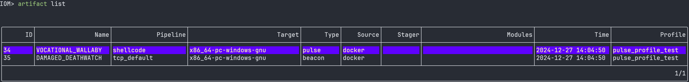

## Intro

IoM通过几个月的快速迭代, 已经具备了一个现代化C2的绝大部分功能. 

## v0.0.4  更新日志


### 自动化编译

在刚发布的v0.0.3中, 我们使用docker作为自动化编译的解决方案。 但是rust复杂的编译方案不得不准备每个target对应的编译环境。这导致了对CPU, 内存，硬盘都有巨大的占用， 并且我们目前只实现了基于linux的自动化安装。 

比起sliver或者CobaltStrike过于笨重, 这导致上手门槛极大提高。为此， 我们准备了更加轻量的解决方案。 

在v0.0.2中， 提供了使用两行gh命令实现的自动化编译， 在v0.0.4中，我们将github action的云编译接入到client/server中， 只需要申请一个github token， 即可实现对client/server无任何环境要求的自动化编译


#### 基于github action的快速编译
##### github相关配置

使用github action前，需要先在server所处服务器上对server二进制文件同一目录下的config.yaml进行配置。将malefic源码所在的github仓库名、github用户名github token以及workflow配置文件名填入。

```
server:
  grpc_port: 5004
  grpc_host: 0.0.0.0
  ip: 127.0.0.1
  audit: 1
  enable: true
  config:
    packet_length: 10485760
    certificate:
    certificate_key:
  notify:
    enable: false
    lark:
      enable: false
      webhook_url:
  github:
    repo:           				# malefic的仓库名
    owner:           				# github用户名 
    token:                          # github的token
    workflow: 				        # workflow的配置文件名（默认为generate.yml）
```


 若有多个用户使用服务器，也可以在client所处主机的~/.config/malice/malice.yaml下进行配置。当client端的github 配置填入之后，server会优先使用client提供的github配置，来启动工作流。

  ```
  resources: ""
  tmp: ""
  aliases: []
  extensions:[]
  mals:[]
  settings:
    tables: ""
    autoadult: false
    beacon_autoresults: false
    small_term_width: 0
    always_overflow: false
    vim_mode: false
    default_timeout: 0
    max_server_log_size: 10
    github_repo:                           # malefic的仓库名
    github_owner:                          # github用户名 
    github_token:                          # github的token 
    github_workflow_file: 			     # workflow的配置文件名（默认为generate.yml）
    opsec_threshold: ""
    vt_api_key: ""
  
  ```

##### 新建profile

进行github action编译之前，需要先确认是否存在profile。若没有，则需要新建一个profile来提供malefic编译时所需要的相关配置，artifact的通信address与pipeline绑定。

  

##### action build

使用action和子命令来进行编译，必须指定build target以及对应的profile。当workflow运行成功时，client会提示当前workflow的html_url，方便在网页端进行查看。当编译完成时，也会在client进行通知。


命令示例：

  ```
  action run --profile test --type beacon --target x86_64-pc-windows-msvc
  ```

  为了统一使用，action run的参数命令与docker build的参数基本一致。

##### artifact download

编译完成后，可以在使用artifact list命令，来查看所有的artifact，选中对应的artifact，进行下载。


#### pulse自动link

目前生成pulse，需要使用前置的beacon或bind。

docker和action生成pulse时，现在需要指定前置beacon或者bind的 `artifact_id` ，当 `artifact_id`为0并且使用的profile中pulse下的 `artifact_id` 也为0时，server会自动编译新的beacon转化成shellcode，并且和pulse绑定。

  ```
  # Github action
  action pulse --profile test --target x86_64-pc-windows-msvc --artifact-id 0
  
  # Docker build 
  build pulse --profile test --target x86_64-pc-windows-gnu --artifact-id 0
  ```




#### 自动化安装

原本的install.sh 会下载约13g的镜像， 然后生成几个g的编译中间文件。现在我们大大简化了对服务器的负担， 提供了新的allinone的编译镜像以及简化安装脚本。 

#### docker优化

添加了服务器端的docker编译队列，因为rust端对性能占用较大， 编译时会占用所有的CPU。现在添加了编译队列， 同时只会运行一个编译任务。 

#### allinone docker镜像

### artifact功能组

为了在提权脚本中更方便使用IoM, 就像CS能直接通过listener生成对应的shellcode一样. patch2将一系列shellcode与artifact操作的函数暴露出来了。

这一组api如下:
* artifact_payload ,对应CobaltStrike中的同名函数， 用于生成stageless的shellcode， 在IoM是SRDI后的beacon
* artifact_stager， 对应CobaltStrike中的同名函数， 用于生成stager的shellcode， 在IoM中式SRDI后的pulse
* donut_dll2shellcode, 基于godonut库与donut实现的dll转shellcode 
* donut_exe2shellcode, 基于godonut库与donut实现的exe转shellcode
* sgn_encode, shellcode sgn混淆
* srdi, 

#### gonut

### implant更新

#### 解决win7/windows 2008兼容性

#### 解决rust tls锁

#### inline_local

#### dllspanw

### 其他更新


#### 非交互式client


#### Other of others

* lua api文档格式重构， 现在更加清晰
* 将sgn与malefic-mutant在编译时内嵌， 减少使用时的步骤
* 优化`!`命令， 能更好得执行本地的命令， 而不需要退出程序