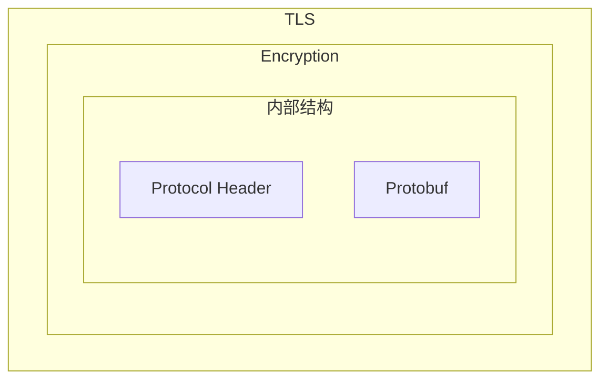

> IoM 设计系列主要闲话IoM的设计理念，技术选型， 对社区、环境、未来的思考等。 也许能给做同样事情的朋友带来一些不一样的想法。
> 与进阶系列不同的是， 设计系列不会有太多的代码，但这并不意味着信息量降低 :)

> 澄清一个误会， 很多朋友以为IoM几次更新公告中提到的功能只在 Professional版本中可以使用， 但实际上除了极少数功能外，95%以上的功能都在社区版中使用， 只是OPSEC略有不同。
## 背景

我们为什么想要自己实现一个C2 Framework, 其中有对CobaltStrike技术路线不够满意，又无奈与无法在开源社区中找到一个足够成熟的C2代替，更是计划用新的技术路线去尝试新的想法。 

也因此**IoM在技术选型上会相对激进,** 我们尝试采用golang(client/server/listener) + rust(implant) 作为基调， 并以此为基础尝试重新实现开源社区中存在的已有的一切技术（只代表大致路线，我们当然没有能力去实现所有技术）。

我们的server/client 采用了类似sliver类似的软件架构, grpc + repl(交互式命令行) , 在早期版本中(v0.0.1)， 也复用了不少sliver的代码， 但在后续的更新中源自sliver的几乎所有代码都已经被重构， 只还保留着有一些类似的软件架构。 

而在listener上， 我们一开始就将其从server中解耦出来， listener随着更新会越来越来自由，最终目的是在任何存在数据交换的地方构建(和rem的设计理念一致, 实际上也依赖rem实现)。

最关键的implant则选用了rust， 不得不说， **这个决定让我们踩了无数坑**。目前看来确实没有比rust更好的选择， 但这并不代表rust能完全胜任我们的需求。rust给我们带来的麻烦包括 编译环境， 编译， 链接， 生成的target，操作系统依赖， 兼容性等等问题。 这里面有非常多的问题不是我们使用上的问题， 多半自于rust自身的bug, 设计。 在解决这些问题的过程中， 我们将一部分内容整理成了IoM进阶系列， 也就是前几天发的 `PE Loader/RDI的TLS之殇`。而和这个问题差不多抽象的问题， 大概还有10个 *(当然也有办法绕过或者放弃一部分能力，但是这么做下去就变成就变得无趣了)。*

### 总览

目前的IoM的通讯架构

* client<->server 交互通过grpc实现
* server与listener则通过统一的数据包协议`Spite`(protobuf的message)交互. 
* listener与malefic(malefic只是implant的一个具体实现)通过parser将数据解析为`Spite`

简单来说就是listener上可以根据parser切换不同的implant协议。 client/server/listener之间的交互统一使用同一个protobuf 定义。 

对于拓展性来说， 主要在这四个地方进行拓展

* Client端插件脚本语言和Command
* Server端rpc
* Listener的Pipeline和Parser
* Implant端的module, kits, 3rd-module

在用户看来, 最终使用体验会CS的aggressor script相似， 也对能力更强的开发者保留了完整的SDK以及非常多可以二开的接口。 

**在本文发布时，已经实现本文提到的100%的内容，均可以在我们的github中找到**

## Client端

### 生态

CS早期版本中通过用户自发的开源形成了社区了, 在近几年添加了 https://cobalt-strike.github.io/community_kit/ 官方的社区插件索引. 

sliver则通过在官方统一维护了[armory武器库](https://github.com/sliverarmory/armory) , 但sliver提供的拓展能力很有限, 只能简单注册命令, 预设参数. 在支持的生态上也只有 bof, dll, CLR. 

在前人的工作上改进IoM的插件生态设计. 我们计划在多个维度提供不同领域的拓展能力. 

我们在[IoM的设计文档中提到过插件相关设计目标](https://chainreactors.github.io/wiki/IoM/design/#拓展能力) 

### mals

mals是主要的面向用户的拓展接口。 封装了全量的IoM的功能，理论上可以使用lua实现一个功能等价的cli的甚至gui。 

#### 语言无关的拓展性

IoM在最初的设计上想兼容sliver的armory(这个相对简单,已经实现), 以及cobaltstrike的`agressor_script`, 并在此基础上提供自己的插件生态规范, 提供语言无关的插件规范.

简单来说, 就是支持lua, go, python, java甚至是yaklang等等任意语言进行拓展.

(当然我们不打算也没有资源实现一套类似yaklang的VM, 只能通过在rpc上的规范实现多语言SDK)

在 https://github.com/chainreactors/mals 实现了中间结构体，能通过不同的语言暴露同一套SDK， 目前以lua为主要的拓展语言。

#### client

与CobaltStrike的agressor_script类似, 不论是Server的rpc, Listener的Parser, Implant的module, 都需要最终暴露在插件开发者手中. 

agressor_script 是基于sleep语言实现, sleep较强依赖于java. 并且也较为小众, 要不是CS估计很少有人了解它. IoM暂时不想背上已有的包袱, 先放开手脚大胆设计, 所以对agressor_script兼容的优先级在实现我们自己插件生态之后. 

IoM选择了lua与TCL作为第一阶段准备兼容的嵌入式脚本语言, lua/TCL脚本与`mal manifest`组成IoM插件包的单元, 在client端提供`mal`插件的.

只需要将所有的rpc包装为buildin函数, 注册到lua/TCL中, 然后提供一个包管理器, 用来管理加载顺序与依赖关系. 很简单就能实现一个自定义的脚本语言. 

但要和client的tui以及未来可能出现的gui交互, 还需要多做一步. 刚才是将rpc注册到lua/TCL中, 现在需要将用户脚本的指定规则的函数反向注册到client的命令, 或者gui的组件. 

最终效果就类似CS的`agressor_script`的表达力. 

当然, 这里面还有很多细节. 例如数据传输格式, 参数传输格式等 需要根据对应的脚本语言适配. 

**后续还将提供独立的mals客户端，类似一个脚本解释器，能之间通过mals支持的语言直接控制implant。**
#### 插件索引与插件仓库

在v0.0.3发布后, 经过了一段时间的迭代，现在已基本实现了计划中的一期工程。 

我们从CobaltStrike迁移了数百个不同的插件作为元能力, 这些插件将会随着v0.1.0同时发布

- community-lib ,工具库, 可以当作库被其他插件使用
    - [sharpblock](https://github.com/CCob/SharpBlock)
    - [No-Consolation](https://github.com/fortra/No-Consolation)
- community-common, 常用工具包
    - [OperatorsKit](https://github.com/REDMED-X/OperatorsKit)
    - [CS-Remote-OPs-BOF](https://github.com/trustedsec/CS-Remote-OPs-BOF)
    - [CS-Situational-Awareness-BOF](https://github.com/trustedsec/CS-Situational-Awareness-BOF)
    - chainreactor工具
    - misc 未分类的常用工具集合
    - ......
- community-elevate 提权工具包
- community-proxy 代理工具包
- community-move 横向移动工具包
- community-persistence 权限维持工具包

同时， 我们也在client上实现了全自动下载安装的功能，只需要在mals的索引中添加， 就能通过一行命令自动下载安装。 

例如:
`mals install community-common`

> 通过mal支持的lua/yaegi(golang)等脚本语言， 能代替client操作IoM的各种功能，并形成可复用的插件包
## Server端

### SDK

之前提到过, server与client的交互全都通过grpc提供的rpc. 

通过grpc+protobuf提供的中间层， 我们可以生成多语言的RPC代码。 这个RPC本身已经实现了SDK需要的90%的功能， 我们的client本质上也是基于自动生成的golang代码运作的， 我们的GUI则是自动生成的javascript代码运作的，我们甚至没有进行多少额外的工作就能实现多种语言的调用。

目前我们基于golang和javascript分别实现了TUI与GUI， 后续我们会将相关的代码封装为SDK， 提供基于grpc+protobuf实现的多语言SDK。 初步计划中， 我们会提供三种语言的SDK， 分别是:

- golang
- javascript
- python

对于其他语言，实际上只需要使用我们的 https://github.com/chainreactors/proto 仓库安装对应语言的插件生成代码即可。唯一的麻烦点就是自行编写grpc+MTLS的初始化认证流程。

SDK与mals不同的地方在于， mals经过了一层封装， 拥有更好的用户体验， 特别是在implant操作上的相关函数。 

而SDK是原始的rpc接口，代码即文档， 需要一定程度参考rpc的代码实现去调用。 

> 通过grpc支持的任意语言， 都能快速生成对应语言的SDK，并与IoM进行交互
## Listener

如果阅读过我们的设计的文档或者蓝图, 应该知道IoM一直将webshell列在计划中. 那IoM计划如何实现webshell呢?

实际上就是在Listener中做文章. 假设IoM尝试兼容冰蝎, 那么实际上就是需要一个冰蝎的动态数据生成器和解释器. 对于默认的implant(malefic)也是一样, 通过protobuf, 将message序列化成bytes, 将bytes解析为message. 

这里就可以将其变成抽象接口:

* parser 负责解析回传数据
* generator 将spite转为目标能理解的数据

我们还可以做得更多, 这个功能也是为了第三方C2留的. 

如果有大佬自己实现了一个C2, 但是出于工作量与时间的关系, cli/gui写得非常粗糙怎么办?

很简单, 可以完全不碰implant ,只需要在listener中添加一个parser与generator. 即可让IoM的server/listener/client三端的生态迁移到自定义C2中.

当然要实现无缝迁移还是需要一些基本的工作的. 例如支持Bof相关功能得implant原本就有对Bof的支持. 

### Pipeline

pipeline相当于传统的C2框架中的Listener。 IoM进一步细分了其内部实现， 我们将监听服务器整体作为listener， 每个listener上都可以运行多个pipeline， pipeline是与implant进行具体交互的组件的。

这里的交互指的是:

- beacon 模式下解析对应的心跳包并返回数据
- bind/webshell 模式下对目标服务器主动发包
- website 提供http服务用来分发文件或者水坑
- rem 提供代理，端口转发，流量中转等流量服务
- ...

pipeline比起Cobaltstrike的listener的设计更加灵活，并且拥有更丰富的功能。 

实际上listener提供了分布式层面的抽象， pipeline则是其具体实现， 两者相辅相成。

> 通过实现pipeline的基本控制rpc， 就可以接入不同形式的pipeline， 例如云函数, 代理, [LOLC2](https://lolc2.github.io/) 等等
### Parser

比pipeline更加细节的实现是parser， parser提供了具体协议实现的抽象。例如malefic默认的通讯协议是这样的:

通过修改parser， 我们可以实现一个自定义的传输协议格式。 更可以通过parser， 将其他C2框架接入到IoM中， 又或者将IoM作为其他C2框架的external listener。

> 通过定制不同的parser，去适配不同的C2 implant。 可以将协议完全不同的C2接入到IoM中， 也可以将IoM作为不同C2的redirecter
## Implant端

implant 端的拓展性是重中之重。 我们计划中将支持对编译，链接，功能，静态，动态，内存，流量等等方方面面进行重载，自定义，可拓展。

相关代码可以在github仓库中找到: https://github.com/chainreactors/malefic
### features
rust最强大的地方就在于提供了一个细粒度极高的条件编译的语法糖以及更强大的过程宏（编译时展开的宏）， 让我们可以更加简单的实现非常复杂的各自拓展功能。 

现在malefic的绝大部分拓展能力都是基于features构建的， 并提供了malefic-mutant将`config.yaml`转为配置好的cargo.toml。 

可以在 https://github.com/chainreactors/malefic/blob/master/malefic-modules/src/lib.rs 看到一个比较直观的例子。 我们通过feature实现了module的动态按需组装。

> 通过控制不同的features的组合，可以将IoM implant拆解为乐高积木， 编译时动态拼装
### kits

kit是官方提供的特定操作系统的工具包， 用来实现各自进阶功能， 并由我们来维护其opsec与稳定性。在每个版本发布时会通过 `.a/.lib` 发布对应的静态链接库, 也是**目前IoM中唯一不完全开源**的组成部分。 

目前我们只提供了win-kit , 其中包含了十数个 offensive security 的功能， 包括  BOF, CLR, indirect syscall, stack spoof等等.

> 这部分是由我们维护的底层基础设施，我们将会为不同的使用场景目标用户定制不同的kit,  免去C2开发中最为复杂的技术细节， 暴露直接可以调用的现成api
### module

详情可见: https://chainreactors.github.io/wiki/IoM/manual/implant/#dynamic-module

这是一个非常现代化的设计, 不需要的功能就不要打包进来, 不存在就无从查杀. 只在需要时加载需要的功能, 能在体积, 特征上做到最小化. 

这里的具体实现方案很多, 例如Havoc, 它是通过大量的BoF将大量基础功能转为插件, Sliver则是通过[自定义格式的extension](https://dominicbreuker.com/post/learning_sliver_c2_12_extensions/)实现了dll+bof.

而IoM中选择了更加opsec的方式, 通过headlessPE的方式, 动态加载模块, 就像正常加载DLL一样, 将按照接口规范编写的模块热加载进来. 甚至这个功能本身也是可以拆卸掉的, 可以选择只保留上传,下载和exec的mini implant, 甚至只保留loader implant的nano implant.

> 通过定制module， 就可以拓展implant的基础能力，并按需组装
#### 3rd-module

在v0.1.0版本中， 还添加了3rd module。3rd module是依赖于外部仓库实现的复杂的功能的模块， 已经实现的保留 keylogger，rem(流量/代理)， 计划中的还有rustdesk， hvnc，rdp等等。 为了防止大量引入的外部库污染本体， 所以将3rd module作为独立的crate使用， 可以在编译时静态链接， 也可以在本体上线后动态加载。 
### prelude

这是一种特殊的stager, 可以作为中间阶段的stager， 也可以作为dropper，也可以是一次性的implant。 

本质上是单线程按预配置顺序执行module的implant。我们可以在这一阶段实现反沙箱反调试，分阶段上线， 权限维持，自动化任务，预加载，密钥分发，下载， 上线等等工作。

通过yaml配置完后，能将yaml编译为二进制程序。面对这样复杂的场景， 在之前都需要重新编写一个loader/dropper， 而现在，我们只需要实现对应的module， 并通过yaml即可完成简单的按需生成中间阶段， 极大简化的原本的工作流程。 

> 通过编排module的执行流程， 可以实现非交互式的离线自动化流程, 嵌入到多阶段上线的任意步骤中
### Other

上面提到的这些都是只需要修改配置文件或者简单修改代码就可以实现的拓展, 但面对复杂的现实场景， 这远远不够。 对于能进阶的开发者，我们实际上预留了更多的接口， 可以简单替换几个函数， 即可重载malefic提供的绝大部分功能。 这部分留给愿意阅读代码的朋友

* 自定义加密方式
* 自定义传输层
* 自定义进程注入方式
* 替换异步运行时
* 自定义stager上线, 加密， 加载实现
* 添加server rpc接口
* 添加client command
* 添加mals function
* ......
## 联动

我们更希望形成一个进攻性安全的生态，而不是纯粹的武器。这也是我们留下如此多的拓展维度的原因。 
### With RedTeaming

IoM在最初设想中， 就是用来弥补CobaltStrike的遗憾， 所以在基本功能和参数上都是以CobaltStrike作为标准去实现的， CobaltStrike已经有的， 我们都尽可能实现了相似的功能， 并保留了相似的接口与用法。 甚至很多理应被淘汰的技术，因为CobaltStrike并没有删除， 也进行了重新实现。 目前来看， 在稳定性与用户体验上确实无法与CobltStrike对标， 但是在功能与OPSEC上已经与其相当甚至部分超越。 

所以v0.1.0版本发布后，IoM已经足够作为部分场景下的CobaltStrike的代替，能在一些ReadTeaming行动中出现了， 并且我们也进行了多次实战，发现了不少问题并不断改进自身。 

### With BAS

比起sliver， CoblatStrike， Havoc，还有nighthawk，brc4之类的框架， IoM最大的优势就是其丰富的可拓展接口。我们也希望成为BAS的基础设施， 提供post-exploit部分的元能力。 

> 近期调研了多家BAS产品，我发现某些厂商的BAS问题在于将playbook作为其核心能力与卖点，不少产品的基于流量重放或者固定的攻击脚本实现其核心能力。 直接导致了在对接ATT&CK时， 将TTP作为结果而不是过程。 在商业角度上不评论其优劣， 但在技术实现上是缺乏耐心的。

IoM的架构很适合作为BAS的基础能力的一部分，提供大量的元能力以及快速组合元能力。
### With ASM

在chainreactors的计划中，我们也有一个庞大的ASM的设计， 并且实现了一个demo。 其中一个核心设计就是将rem(流量代理)工具作为联通ASM与C2的桥梁，将EASM(主要关注外部资产)拓展为CAASM(主要关注内部资产)成为完整的ASM，当然这都是站在攻击模拟/自动化攻击视角的， 这样的实现方式并不一定适合甲方安全建设。

将IoM的implant作为CAASM的agent, 在目标内网进行自动化的探测，交互， 数据汇总。

### With  AI

AI已经完全融入了IoM开发的工作流中， 在长期的使用中能很轻易的发现， 要让AI从零去做某个事情， 往往需要大量的对话， 但是如果已经有一套相对成熟的框架， 让AI去填充内存， AI能完成得非常好。 而现在IoM提供了好几套可拓展的接口，以及一个开发框架。 当我尝试让AI去编写插件或者控制IoM完成任务时， AI表现出了超过大部分人类的能力。 

~~我们正在探索通过提供不同场景的prompt， 基于我们的vscode的GUI插件，直接控制IoM代替人类去完成任务。~~

在写这篇文章的过程中，诞生了一个极大简化AI agent实现的MCP协议。 我们发现不再需要通过prompt来教会AI， 可以直接通过MCP协议
## 小结

在IoM中, client/server/listener/implant 四端几乎是完全解耦的, 可以在任意一端插入用户自己编写的实现. 而不影响到其他组件的工作, 我们通过约定统一的规范来兼容尽可能多的生态与社区. 

在本文发布的同时, 也会尝试邀请一些开发者与IoM进行对接, 共同建设.

现在的IoM尝试实现代替CobaltStrike的准备，朝着这一目标前进。

CobaltStrike 留给用户可更改的接口很多:

* 基于sleep语言的Aggressive Script, 能通过脚本调用绝大部分implant的功能以及对ui的动态拓展;
* 通过profile实现的对流量特征已经部分动态特征的自定义
* arsenal kit中提供的sleepmask， artifact， udrl，resource 等对CS全局的功能替换， 实现自定义的OPSEC

要实现对CobaltStrike的完全替换， 不可避免得实现上诉所有功能。

这是个庞大的工程， 目前IoM能做到CS大部分拓展功能的等价替换， 但确实在不少细节上无法完全实现。 
