## 1. The Dilemma and Breakthrough in Automated Penetration Testing

### 1.1 The Problem: Linear Workflows Cannot Handle Dynamic Attacks

Most current AI Security Agents operate on a **"Todo-list"** model: breaking a target down into steps 1, 2, and 3, and executing them sequentially. Fundamentally, this is merely an AI-driven SOP (Standard Operating Procedure).

However, real-world hacker attacks are never linear:

-   **Uncertainty**: You might plan to scan port 80, only to find solely 443 open, necessitating an immediate strategy shift.
-   **Trial-and-Error & Backtracking**: If an exploit fails, an expert doesn't simply stop; they backtrack to the previous step to attempt a different payload or switch attack vectors.
-   **Complex Decision-Making**: The next action is strictly dependent on the specific result of the previous one (e.g., Is the server IIS or Nginx? Was the response a timeout or access denied?).

When facing such dynamic scenarios, current AI Agents often fail due to rigid adherence to a single path ("tunnel vision") or lose their direction, devolving into stochastic decision-making. **Linear execution logic cannot support graph-like hacker thinking.**

### 1.2 The Concept: Programmable and Executable Expert Experience

We propose a novel paradigm: **Using natural language as a "programming language" to construct attack logic.**

In this paradigm, we no longer write script code; instead, we author "intent." Our core philosophy is: **Experts articulate logic in human language, and AI understands and executes it via semantic capabilities.**

Based on this, we have built two core components:

**1. ATTACK Pattern Graph (APG)**: A **protocol** for describing attack logic. It is essentially a "**representation of expert experience**."

-   In an APG, experts do not write code but define **Nodes** (actions) and **Transition Conditions (Edges)** with a **specific structure** using natural language.
-   **Structured Nodes** represent **concrete actions** (e.g., "Scan," "Exploit"), while Edges represent **decision conditions** (e.g., "If a weak password is found").
-   By composing nodes and edges into an execution graph, we achieve the **programming of expert experience**.

**2. APG Runtime**: The **engine** that executes this flowchart. Its role is to control the execution of intent and provide observability and debuggability:

-   It loads APG files and handles operations like graph traversal and Prompt Compilation.
-   It manages the **Global Context**, ensuring the AI accurately recalls the IP address obtained in Step 1 even at Step 50 of an attack. The Global Context maintains only **facts**; node-internal context is not retained globally.
-   It connects underlying AI models with security tools, ensuring the flowchart is executed correctly and stably, while offering **observability and debugging** capabilities.

Through **APG (Representation of Expert Experience)** and **Runtime (Executor of Attack Experience)**, we realize a next-generation security testing framework that possesses both the logical rigor of human experts and the flexible adaptability of AI.

## 2. ATTACK Pattern Graph

### 2.1 Control Flow Graphs in the AI Era

#### 2.1.1 Evolution from Traditional CFG to APG

In traditional compilers, the **Control Flow Graph (CFG)** is a fundamental and powerful concept. It represents the execution flow of a program as a graph structure—**nodes are basic blocks** (sequences of instructions executed linearly), and **edges are control flows** (conditional branches, loops, function calls). CFGs rely on the assumption of **deterministic execution**: given the same input and state, the program always traverses the same path and produces the same output. This determinism allows compilers to perform optimizations like constant folding, dead code elimination, loop transformation, and register allocation.

In the AI era, Large Language Models (LLMs) introduce entirely new possibilities: given the same task description, AI can select different but equally effective execution strategies based on context; complex expert judgments can be expressed via natural language rather than algorithms; and global intent can be understood and maintained without being confined to local variables and stack frames. APG is a novel control flow representation evolved from the CFG against this backdrop.

#### 2.1.2 Formal Definition and Design Principles

The core design goal of the APG (ATTACK Pattern Graph) is to **explicate domain experts' tacit knowledge into a computable graph structure**. While traditional programming encodes algorithmic processes as instruction sequences, APG encodes expert decision patterns as state-transition graphs: **Nodes in the graph correspond to atomic actions in specific situations, and edges correspond to transition conditions based on situational assessment.**

This design redefines the meaning of control flow graphs at the semantic level. While edges in a traditional CFG represent deterministic jumps (based on Boolean predicates), edges in an APG represent decision logic expressed in natural language, interpreted and executed by AI models at runtime. This mixed semantics allows APG to retain the analyzability of graph structures while maintaining the expressive flexibility of natural language.

**Core Differences from Traditional Attack Modeling**

| Dimension | Attack Trees / Kill Chain / ATT&CK | PTES / OWASP | APG |
| :--- | :--- | :--- | :--- |
| **Purpose** | Threat Analysis / Knowledge Taxonomy | Testing Standards | AI Executable |
| **Audience** | Human Experts | Human Testers | AI Agents |
| **Format** | Tree/Phase/Matrix/Document | Checklist/Guide | Executable Flow Graph |
| **Knowledge Type** | Descriptive ("What is it") | Normative ("What should be done") | Procedural ("How & When to do") |
| **Execution Semantics** | Non-executable (Requires human interpretation) | Non-executable (Requires human implementation) | Directly executed by Runtime |

Traditional methods are **knowledge representations for human experts**—describing what an attack is or what should be tested, but requiring humans to translate understanding into action. APG is an **operational specification for AI Agents**—it not only describes "what to do" (Nodes) but explicitly encodes "under what circumstances to do it" (Edge conditions), externalizing expert decision logic into a graph structure that AI can execute without human mediation.

#### 2.1.3 Windows Post-Exploitation Privilege Escalation APG

To better understand the design and execution of APG, we introduce a recurring real-world case study: **Windows Post-Exploitation Privilege Escalation**. This scenario represents a typical decision flow in the post-exploitation phase, ranging from environmental reconnaissance to ultimately obtaining SYSTEM privileges. The diagram below illustrates the complete APG:

```mermaid
graph TB
    Start["Intent Node: Windows PrivEsc"] --> SysInfo["Op Node: Sys Info Collection<br/>systeminfo/whoami<br/>OS ver/Arch/Patches"]

    SysInfo --> AVEnum["Op Node: AV Enumeration<br/>tasklist/wmic process<br/>Identify AV/EDR"]

    AVEnum --> CheckAV{"Validation Node: AV Type Judgment"}

    CheckAV -->|Defender/None| PrivEnum["Op Node: Priv Enumeration<br/>whoami /all<br/>net user/localgroup"]
    CheckAV -->|360/Huorong etc.| AVBypass["Op Node: Domestic AV Bypass<br/>Whitelist paths<br/>Memory loading"]
    CheckAV -->|CrowdStrike/Carbon Black| EDRBypass["Op Node: EDR Bypass<br/>PPID Spoofing<br/>Syscall direct"]

    AVBypass --> PrivEnum
    EDRBypass --> PrivEnum

    PrivEnum --> CheckPriv{"Validation Node: Current Priv Level"}

    CheckPriv -->|SYSTEM/Admin| Success["Result Node: PrivEsc Complete"]
    CheckPriv -->|User| PatchCheck["Op Node: Patch Check<br/>systeminfo | findstr KB<br/>wmic qfe list"]

    PatchCheck --> OSVersion{"Validation Node: OS Version Judgment"}

    OSVersion -->|Win7/2008 R2| Win7Exploit["Op Node: Win7 Exploit<br/>MS16-032<br/>MS15-051"]
    OSVersion -->|Win10 1809-| Win10OldExploit["Op Node: Win10 Old Exploit<br/>CVE-2019-1388<br/>CVE-2019-1405"]
    OSVersion -->|Win10/11 Latest| ServiceEnum["Op Node: Service Enum<br/>sc query<br/>Check service perms"]

    Win7Exploit --> VerifyPriv["Op Node: Verify Result"]
    Win10OldExploit --> VerifyPriv

    ServiceEnum --> CheckService{"Validation Node: Service Config Assess"}

    CheckService -->|Weak Service Found| ServiceAbuse["Op Node: Service Abuse<br/>Unquoted Path<br/>Binary Replace<br/>DLL Hijack"]
    CheckService -->|Config Normal| TaskEnum["Op Node: Task Enum<br/>schtasks /query<br/>Check task perms"]

    ServiceAbuse --> VerifyPriv

    TaskEnum --> CheckTask{"Validation Node: Task Assessment"}

    CheckTask -->|Writable Task Found| TaskAbuse["Op Node: Task Abuse<br/>Replace Script<br/>Modify Path"]
    CheckTask -->|Config Normal| TokenEnum["Op Node: Token Enum<br/>List High Priv Process<br/>Check SeImpersonate"]

    TaskAbuse --> VerifyPriv

    TokenEnum --> CheckToken{"Validation Node: Token Priv Judgment"}

    CheckToken -->|Has SeImpersonate| PotatoExploit["Op Node: Potato Exploits<br/>JuicyPotato<br/>RoguePotato<br/>PrintSpoofer"]
    CheckToken -->|No Priv Token| AlwaysInstall["Op Node: Check AlwaysInstallElevated<br/>Reg Query<br/>MSI PrivEsc"]

    PotatoExploit --> VerifyPriv

    AlwaysInstall --> CheckAlways{"Validation Node: MSI Availability"}

    CheckAlways -->|Registry Enabled| MSIExploit["Op Node: MSI Exploit<br/>Generate Malicious MSI<br/>msiexec"]
    CheckAlways -->|Not Enabled| CredDump["Op Node: Credential Dump<br/>Browser Passwords<br/>Config Files<br/>Registry Creds"]

    MSIExploit --> VerifyPriv

    CredDump --> CheckCred{"Validation Node: Cred Validity"}

    CheckCred -->|Admin Creds Found| RunAsAdmin["Op Node: RunAs Admin<br/>runas<br/>psexec"]
    CheckCred -->|No Valid Creds| ServiceEnum

    RunAsAdmin --> VerifyPriv

    VerifyPriv --> CheckFinal{"Validation Node: Final Confirmation"}

    CheckFinal -->|SYSTEM Priv| Success
    CheckFinal -->|Failed| ServiceEnum

    style Start fill:#e3f2fd
    style CheckAV fill:#fff3e0
    style CheckPriv fill:#fff3e0
    style OSVersion fill:#fff3e0
    style CheckService fill:#fff3e0
    style CheckTask fill:#fff3e0
    style CheckToken fill:#fff3e0
    style CheckAlways fill:#fff3e0
    style CheckCred fill:#fff3e0
    style CheckFinal fill:#fff3e0
    style Success fill:#c8e6c9
```



This APG encodes the expert decision logic for Windows privilege escalation, containing a complete branching hierarchy: AV Type → Privilege Level → System Version → Service Config → Scheduled Tasks → Token Privileges → MSI Config → Credential Usage. Each Validation Node selects the corresponding escalation technique based on the specific situation.

The output of each node serves as input for the next, passed naturally via the Global Context Tree. The Runtime dynamically compiles these natural language descriptions into concrete AI instructions during execution, coordinating with the Global Context to achieve expert-level decision-making. **This case study will be referenced throughout the following sections** to demonstrate APG design, execution, and optimization.

### 2.2 Core Components of APG

#### 2.2.1 Nodes: Semantic Definition of Computational Units

Formally, an APG node is a tuple `N = (T, P, C)`, where:

- `T` is the Node Type (intent | operation | validation | result)
    
- `P` is the Prompt Template, defining the execution semantics of the node
    
- `C` represents Context Dependencies, declaring the prerequisite information required for execution
    

Unlike precise instructions in traditional programs, **APG nodes encapsulate expert behavioral patterns rather than algorithmic steps**. The essence of expert knowledge is situated action—faced with a specific service type, an expert doesn't execute an abstract "scan" algorithm but directly invokes domain tools (e.g., "Use gogo to scan common ports and identify service versions"). APG explicates these implicit operational routines via prompt templates.

The computational semantics of a node is **`prompt × context → output`**: each node receives the Global Context as input and generates structured output by invoking underlying AI capabilities through a specific prompt template. The output includes not only execution results but also path selection recommendations and quality assessment metadata, which update the Global Context and influence subsequent decision-making.

APG defines four node types, constituting layered execution semantics:

- **Intent Node**: The unique entry point of the graph, defining the initial state and goal constraints. Formally corresponds to function parameter passing and scope initialization.
    
- **Operation Node**: The computational unit executing concrete actions. Encodes expert operational paradigms via prompt + few-shot examples.
    
- **Validation Node**: A decision point for result verification and path selection. Similar to predicate evaluation in conditional branches but uses natural language to express judgment criteria.
    
- **Result Node**: The unique normal exit of the graph, corresponding to a function return. This node is reached only when the task is successfully completed.
    

Exceptions (path mismatches, execution failures) are not returned via the Result Node but trigger an exception mechanism (see Section 2.2.4). This ensures clear execution semantics: **reaching a Result Node implies success; triggering an exception implies a need for strategy adjustment or human intervention.**

#### 2.2.2 Edges: Mixed Semantics of Transition Conditions

Edges define the control flow topology of the APG. Formally, an edge is a tuple `E = (φ, v)`, where:

- `φ` is the Transition Condition, expressed in natural language.
    
- `v` is an optional Validation Function, used for strict constraint checking.
    

Unlike deterministic jumps based on Boolean predicates in traditional CFGs, **APG edges implement a mixed-semantics transition mechanism**. The primary part of the edge condition uses natural language (e.g., "If database error messages appear in the response"). This aligns with expert cognitive patterns, providing semantic judgment space for the AI model. Simultaneously, for critical hard constraints (e.g., "Target host must respond to ICMP"), programmatically enforceable validation functions ensure path reachability.

**The execution semantics of an edge is compile-time fusion**: Edges are not independent execution steps but are compiled into the prompt during node execution. Specifically, when the Runtime executes node N, it collects all outgoing edges `{E₁, E₂, ..., Eₖ}` and embeds their conditions `{φ₁, φ₂, ..., φₖ}` as "downstream path options" into N's execution prompt. While completing the node operation, the AI model selects the matching transition condition based on execution results and context. This design avoids the traditional three-stage separation of "Execute-Evaluate-Jump," achieving semantic fusion of decision and execution.

The mixed validation mechanism of edge conditions balances flexibility and reliability: natural language conditions offer adaptive judgment, while programmatic validation functions ensure the enforcement of critical constraints.

#### 2.2.3 SubGraph: Compositional Semantics and Modular Encapsulation

A SubGraph is the basic unit of composition in APG, a connected subgraph consisting of node sets and edge sets: `SG = (N, E, n_entry, n_exit)`, where:

- `N` is the set of Nodes
    
- `E` is the set of Edges
    
- `n_entry` is the unique Intent Node (Entry)
    
- `n_exit` is the set of Result Nodes (potentially multiple exits)
    

The design of SubGraphs is inspired by the combinator concept in functional programming, enabling modular encapsulation of expert experience. In cognitive science, expert problem-solving relies on **procedural memory** and **schema activation**—experts rapidly activate corresponding action sequences when facing specific situations. SubGraphs explicate this "Situation → Action Sequence" mapping via graph structures.

**APG is essentially a knowledge representation, not the knowledge itself.** SubGraphs transform tacit expert knowledge into explicit, computable graph structures, realizing three key properties: **Executability** (directly interpretable by Runtime); **Programmability** (supporting version control and progressive optimization).

SubGraph design follows strict structural constraints. First is the **Single Entry Constraint**: the Intent Node is the sole entry point, ensuring the subgraph is a Directed Acyclic Graph (DAG) with clear initialization semantics. Second is **Control Flow Encapsulation**: all external inputs (user prompts, config parameters, strategy adjustments) must be injected via the Intent Node; internal nodes are not allowed direct human interaction, guaranteeing execution independence. Finally, **Compositional Closure**: SubGraphs can connect via Intent Nodes to form larger composite graphs, but each subgraph maintains independent execution semantics.

The connection relationships of multiple SubGraph Intent Nodes constitute the **Attack Intent Graph**, representing the complete knowledge topology of a specific domain. This layered composition mechanism resembles modular design in software engineering—each SubGraph is a black box with a defined interface, allowing internal implementation to evolve independently without affecting other modules.

#### 2.2.4 Exception Handling Mechanism

The execution semantics of a SubGraph rely on edge condition matching: after a node executes, the Runtime transitions to an outgoing edge based on the output. However, in real attack scenarios, **Path Exhaustion** frequently occurs—a node executes successfully, but the output satisfies none of the predefined transition conditions. This is not a system error but an inherent feature of exploratory tasks: target defenses may exceed expectations, response patterns may not be covered by the APG, or network environments may change randomly.

When Path Exhaustion occurs, the node reports an **Exception** to the Runtime via a special return value. An exception is a structured object containing an execution summary, attempted path evaluations, and mismatch diagnostics.

The Runtime employs a layered exception handling strategy, attempting recovery in priority order:

1. **Local Backtracking**: Backtrack to the nearest Validation Node to re-evaluate path selection based on new information. This is the lowest-cost recovery strategy, suitable for scenarios requiring minor adjustments to judgment conditions.
    
2. **Path Finding**: If backtracking fails, invoke the Builtin Tool's `find_alternative_path` function to search for reachable alternative paths within the graph topology. The system attempts to find other viable routes to a Result Node from the current state.
    
3. **Dynamic Graph Extension**: If no suitable path is found, the system utilizes graph construction capabilities to dynamically add processing branches, extending the APG's coverage. This allows the APG to learn and adapt to new attack scenarios at runtime.
    
4. **Human-in-the-Loop**: When all automated methods fail, the system falls back to the nearest Intent Node and triggers a human intervention process. Experts can adjust the attack strategy, modify the APG definition, or provide additional context.
    

This layered strategy implements **progressive degradation**: the system first attempts automated recovery and requests human intervention only after exhausting all automatic options. This design allows APG to handle not only predefined scenarios but also possess a degree of **out-of-distribution generalization**.

### 2.3 Runtime: The Execution Engine of APG

#### 2.3.1 Runtime Architecture and Execution Model

**Comparison with Existing AI Penetration Testing Tools**

|**Dimension**|**HexStrike-AI**|**CAI**|**Strix**|**APG Runtime**|
|---|---|---|---|---|
|**Architecture**|Tool Integration|Planner-Executor|Multi-Agent|Graph Interpreter|
|**Execution Mode**|LLM Autonomous Tool Use|Linear Task List|Agent Scheduling|Graph Traversal + Dynamic Compilation|
|**Context Mgmt**|Global Tool Visibility|Planner/Executor Isolation|Inter-Agent Messaging|Structured Context Tree|
|**Expert Knowledge**|Implicit in Model|Planner Prompts|Agent Prompts|APG Graph Structure|
|**Adaptability**|Implicit Model Inference|Re-planning (High Cost)|Coordination Protocol|Exception-Driven Backtracking + Graph Extension|

The fundamental limitation of existing tools is the **lack of explicit encoding of expert decision logic**: HexStrike-AI relies on the model's implicit reasoning; CAI embeds expert knowledge in Planner prompts; Strix scatters knowledge across multiple Agent prompts. These methods are viable for simple scenarios (single site tests, CTF challenges) but lack systematicity and controllability when facing complex real-world attack chains.

**Runtime Design Positioning**

While APG defines the expert experience flow as a static graph structure, it cannot run directly on an AI model. **The Runtime serves as the interpreter and execution engine**, acting as the intermediary layer between the APG graph definition and underlying AI capabilities. Its core responsibilities include:

1. **Graph Traversal**: Maintains current execution state, deciding the next transition based on node outputs and edge conditions.
    
2. **Prompt Compilation**: Compiles node definitions and context into executable AI prompts.
    
3. **Context Management**: Maintains the global execution context, ensuring information continuity across nodes.
    
4. **Tool Orchestration**: Manages the tool ecosystem, injecting tool capabilities on demand.
    

代码段

```
graph TB
    subgraph "Intent Layer"
        APG[APG Definition<br/>YAML/DSL<br/>Describing Expert Experience]
    end

    subgraph "Execution Layer"
        Runtime[Runtime Engine<br/>Graph Traversal + Prompt Compilation + Context Mgmt]
    end

    subgraph "Capability Layer"
        Agent[General Agent Engineering<br/>pydantic ai / Claude Code<br/>AI Base Capabilities]
        LLM[Large Language Models]
    end

    APG --> Runtime
    Runtime --> Agent
    Agent --> LLM

    style APG fill:#e3f2fd
    style Runtime fill:#fff3e0
    style Agent fill:#e8f5e8
    style LLM fill:#fce4ec
```

**Tech Stack Selection Rationale**

The Runtime implementation uses **lightweight AI base libraries** (e.g., pydantic-ai) rather than high-level Agent frameworks (e.g., LangChain, LlamaIndex). This choice is based on the specificity of APG execution semantics—mixed semantics (structured graph traversal + natural language decision) require precise execution control, whereas the abstraction layers of high-level frameworks might become limiting. Specifically, APG requires triggering prompt compilation at specific graph traversal nodes rather than following a framework's predefined lifecycle; it requires customized global context tree management incompatible with generic framework context models. Furthermore, lightweight libraries minimize dependencies, reduce framework abstraction overhead, and allow direct control over the timing and method of underlying AI calls.

#### 2.3.2 DSL Parser: Structured Syntax Definition

The APG graph structure expresses directed relationships between nodes via tuples `(N_source, E_condition, N_target)`. To balance engineering feasibility and human readability, we selected **YAML as the Domain-Specific Language (DSL) for APG**. YAML offers:

- **Human Readability**: Declarative syntax, easy to understand and edit.
    
- **Structural Integrity**: Native support for nested data structures, capable of fully expressing graph topology.
    
- **Mature Toolchain**: No need for extra parser development; standard YAML libraries can be used.
    
- **Lightweight Storage**: Text format, no database dependency, supports version control.
    

The APG DSL syntax design follows the **Minimally Complete** principle:

**Node Definition Syntax**:

YAML

```
- id: <string>                      # Unique Identifier
  type: intent|operation|validation|result  # Node Type
  name: <string>                    # Readable Name
  prompt: <multiline-string>        # Prompt Template
  tools: [<tool-id>, ...]           # Callable Tools (Optional)
  output_schema: <json-schema>      # Output Structure Constraint (Optional)
```

**Edge Definition Syntax**:

YAML

```
- from: <node-id>                   # Source Node ID
  to: <node-id>                     # Target Node ID
  condition: <natural-language>     # Transition Condition (Natural Language)
```

Edge conditions use natural language (not Boolean expressions) and are dynamically compiled into prompts during Runtime execution, allowing the AI model to make semantic judgments based on context.

Returning to our Windows Post-Exploitation Privilege Escalation case, the APG YAML representation (core nodes version) is as follows:

YAML

```
# Windows Post-Exploitation PrivEsc APG
name: "windows_privilege_escalation"
description: "Complete decision flow for Windows system post-exploitation privilege escalation"

nodes:
  - id: start
    type: intent
    name: "Windows PrivEsc"
    prompt: |
      You are a senior penetration testing expert with an initial shell on a target Windows system.
      Mission: Escalate privileges to SYSTEM via reconnaissance, exploit, or misconfiguration abuse.

  - id: sys_info
    type: operation
    name: "System Info Collection"
    prompt: |
      Collect basic target info:
      1. systeminfo - OS version, architecture, patch list
      2. whoami /all - Current user, groups, privileges
      3. hostname
      Output: Structured system info
    tools: ["execute_command"]

  - id: av_enum
    type: operation
    name: "AV Enumeration"
    prompt: |
      Identify security defenses:
      1. tasklist | findstr /i "defender 360 huorong kaspersky"
      2. wmic process get name,executablepath | findstr /i "crowdstrike carbon"
      3. Get-MpComputerStatus (if PowerShell available)
      Output: AV type, version, status
    tools: ["execute_command"]

  - id: check_av
    type: validation
    name: "AV Type Judgment"
    prompt: |
      Judge defense level based on {av_info}:
      - Defender/None: Low resistance, standard tools okay
      - 360/Huorong (Domestic): Medium resistance, whitelist paths or memory loading required
      - CrowdStrike/Carbon Black: High resistance, EDR bypass required

  # ... [Intermediate nodes omitted for brevity, following the structure of the Mermaid graph] ...

  - id: potato_exploit
    type: operation
    name: "Potato Series Exploit"
    prompt: |
      Use Potato series exploits:
      1. Windows Server 2016+: RoguePotato/PrintSpoofer
      2. Windows 10: JuicyPotato (needs CLSID)
      3. Execute and get SYSTEM shell
    tools: ["upload_file", "execute_command"]

  # ... [More nodes] ...

edges:
  - from: start
    to: sys_info

  - from: sys_info
    to: av_enum

  - from: av_enum
    to: check_av

  - from: check_av
    to: priv_enum
    condition: "If Defender or No AV"

  - from: check_av
    to: av_bypass_domestic
    condition: "If 360/Huorong or other domestic AV"

  - from: check_av
    to: edr_bypass
    condition: "If CrowdStrike/Carbon Black or other EDR"

  # ... [Edges continue defining the flow] ...
```

When the Runtime loads the YAML, it **constructs a Directed Acyclic Graph (DAG) in memory**: nodes become vertices, and edges become directed connections. When executing a node, the Runtime **compiles the conditions of all outgoing edges from that node into the prompt**, enabling the AI to decide the path based on context and results.

#### 2.3.3 Tool Ecosystem

The Tool system adopts a **three-layer architecture**: Builtin Tool (Runtime inherent capabilities), ENV (Isolated Execution Space), and Tool SDK (Function Encapsulation). This layered design ensures core stability, supports flexible domain tool expansion, and guarantees security and controllability via isolation.

##### 2.3.3.1 Builtin Tool

Builtin Tools are **fundamental capabilities intrinsic to the Runtime**, requiring no external dependencies. They primarily include **APG Graph Operations** and **Basic Functions**. Graph operations provide query capabilities (get_neighbors, find_path, find_alternative_path) and construction capabilities (add nodes, modify edge conditions, adjust structure). When an attack path fails, the Runtime can call `find_alternative_path` or dynamically adjust the APG.

Basic functions resemble Claude Code's built-in capabilities, including context queries (get_context, query_history), file operations, and process management. These allow nodes to access global context and perform basic system calls without relying on an external ENV. The design principle is **minimal but complete**, containing only essentials for APG execution.

##### 2.3.3.2 Workspace: Execution Environment

**Runtime and Tool Isolation Principle**

The Tool system follows the principle of **Execution Environment Isolation**: The Runtime handles graph traversal and scheduling, while Tools execute concrete operations in an isolated sandbox. This brings multiple benefits:

- **Environment Purity**: Runtime state is unaffected by Tool side effects.
    
- **Fault Isolation**: Tool crashes do not cause Runtime state loss.
    
- **Rapid Recovery**: Tool environments can be quickly rebuilt or switched.
    
- **Concurrency**: Multiple Workspace instances support parallel tool execution.
    

Implementation-wise, we use **containerization**: Linux images provide standard security tools; Playwright handles web interaction; Terminal exposes Shell interfaces; and Python supports dynamic script execution.

##### 2.3.3.3 Tool SDK

Offensive security relies on numerous specialized tools (sqlmap, nuclei, masscan, etc.). Registering each as an independent MCP/Tool leads to **Context Pollution**: tool documentation crowds out task-relevant information.

The Tool SDK re-encapsulates all tools (MCP, HTTP, GRPC, Terminal) into a **Python API**.

We provide an `offensive-infra` Python package as a unified layer. Tool documentation is stored as files and **dynamically retrieved** by the Runtime based on the node's `tool` declaration. Only the documentation for tools required by the _current_ node is injected into the prompt. This **maximizes context efficiency**: at any moment, the context contains only the minimal toolset needed.

By using Python as a DSL to invoke tools, we drastically improve AI tool usage efficiency. A single interaction can orchestrate dozens of tools. We call this Python DSL-driven approach **Meta-tooling**.

|**Attack Phase**|**Tool Name**|**ATT&CK Mapping**|
|---|---|---|
|**Pre-Exploit**|gogo|T1046|
||fingers|T1592|
||spray|T1083|
|**Bridge**|rem|T1090|
||proxyclient|T1090.001|
|**Post-Exploit**|malice-network|T1071, T1573|
||malefic|Covers multiple|

#### 2.3.4 Global Context Management Mechanism

**Context Continuity Challenge**

Underlying Agent Runtimes (e.g., Claude Code) often use complex context management strategies (compression, summarization). However, **APG execution chains may span multiple underlying context compression cycles**. If critical information (OS version, Token privileges) is compressed away, subsequent nodes lose their decision basis.

To solve this, the Runtime implements an **independent Global Context Management Layer**, ensuring memory continuity across the entire APG flow, independent of the underlying AI runtime.

**Structured Context Design**

Global context uses **structured data** rather than free text. Each node returns output conforming to a predefined schema:

Python

```
NodeOutput = {
    "summary": str,          # Execution Summary
    "branch_decision": str,  # Path Choice
    "key_data": dict,        # Structured info for downstream nodes
    "metadata": dict         # Timestamp, NodeID, Quality Score
}
```

**Persistence and Serialization**

The Runtime **serializes each node's output into JSON Lines format**, appending to a file. This forms a **Global Context Tree**. This design enables:

1. **Checkpointing**: Save state at any node; resume after failure.
    
2. **History Tracing**: Audit execution history and AI decisions.
    
3. **Resumable Execution**: Pause and resume long-running tasks.
    
4. **Versioning**: Each execution creates an independent instance file.
    

#### 2.3.5 Prompt Compilation Mechanism

**Compiler-Perspective Prompt Generation**

Prompt Compilation is the Runtime's core responsibility, fusing the static APG definition with the dynamic context to generate executable prompts. This resembles code generation in compilers, but the target is **structured natural language instructions**.

**POML-Based Structured Prompt Templates**

We use **POML (Prompt Orchestration Markup Language)**, an XML-like language for prompt orchestration, providing structured organization, data binding, and separation of content from presentation.

The Runtime compiles nodes into structured prompts containing:

1. **Role**: AI Identity.
    
2. **Task**: Current node goal.
    
3. **Context**: Data from Global Context Tree.
    
4. **Instructions**: Detailed steps.
    
5. **Constraints**: Downstream branch conditions (compiled from Edges).
    
6. **Output Schema**: Format constraints.
    

**Example Compilation: Potato Exploit Node**

Input 1: APG Node Definition (Abstract)

Node: potato_exploit. Tools: upload_file, execute_command.

Input 2: Global Context (Extracted)

OS: Server 2019. User: IIS APPPOOL. Privs: SeImpersonate. AV: Defender Disabled.

**Output: Compiled Prompt (POML)**

XML

```
<poml>
  <role>
    You are a senior penetration testing expert...
  </role>

  <task>
    You are at the 'potato_exploit' node. Prerequisite 'SeImpersonate' confirmed.
    Task: Select and execute suitable Potato exploit based on system version.
  </task>

  <context>
    ## System Info
    - OS: Windows Server 2019 Standard (Build 17763)
    - Architecture: x64
    ## Privileges
    - User: IIS APPPOOL\DefaultAppPool
    - SeImpersonatePrivilege: Enabled
    ## History
    - [sys_info] Server 2019...
    - [av_enum] No AV detected...
  </context>

  <instructions>
    Based on Server 2019 and Token privs:
    1. Select Variant:
       - Server 2019 -> Prioritize RoguePotato or PrintSpoofer
    2. Upload Exploit:
       - Path: C:\Windows\Tasks\
    3. Execute:
       - cmd: PrintSpoofer.exe -i -c cmd
    4. Verify:
       - Expect: NT AUTHORITY\SYSTEM
  </instructions>

  <branches>
    Select downstream path based on result:
    - If SYSTEM acquired -> 'verify_priv'
    - If exploit fails -> 'always_install'
  </branches>

  <output-format>
    Return JSON...
  </output-format>
</poml>
```

This demonstrates how the Runtime fuses **concise node definitions** with **rich global context** into complete instructions. It doesn't blindly try all exploits but performs **precise matching** and **strategy selection** (Runtime Compilation Optimization).

### 2.4 Semantic Programs

Based on the core components and execution mechanisms, we formally define APG: **APG is a Domain-Specific Program for AI Execution.** It encodes expert decision knowledge into a computable graph structure interpreted by the Runtime.

**Procedural Characteristics**

1. **Deterministic Syntax**: YAML DSL.
    
2. **Execution Semantics**: Runtime graph traversal + compilation.
    
3. **I/O Interfaces**: Intent/Result nodes.
    
4. **Control Flow**: Sequence, Branching, Loops (cycles).
    

**Essential Differences from Traditional Programs**

|**Dimension**|**Traditional Program**|**APG**|
|---|---|---|
|**Substrate**|CPU Instruction Set|LLM|
|**Target**|Machine Code|Structured Natural Language Prompt|
|**Control Flow**|Deterministic (Boolean)|Probabilistic (Natural Language)|
|**Value**|Algorithmic Efficiency|Expert Experience Encoding Completeness|

A verified APG (like the Windows PrivEsc example) is akin to a battle-tested open-source library—encapsulating best practices, reusable, and updatable.

## 3. Summary and Outlook

### 3.1 Research Contributions

This paper introduces **APG** as a structured intermediate representation for attack patterns in the AI era, validating the hypothesis that **expert security decision logic can be formally expressed and directly interpreted by AI systems.**

**Contributions:**

1. **Theoretical**: Formal APG framework, mixed semantics execution model (Structured Control Flow + NL Decision).
    
2. **System**: Runtime engine implementation (Traversal, Compiler, Context, Tools).
    
3. **Practical**: Complete engineering path (YAML DSL, POML, RAG-based tools).
    

**APG** defines "What and When" (Pattern). **Runtime** implements "How" (Execution).

### 3.2 Limitations and Future Work

**Current Limitations**:

- **Lack of Empirical Validation**: Need large-scale testing in real-world scenarios.
    
- **Engineering Maturity**: Runtime is currently a prototype; needs optimization and error handling.
    

**Future Directions**:

- **Intelligence Enhancement**: ML for path exhaustion patterns; auto-generating APG from logs/descriptions.
    
- **Ecosystem**: APG Marketplace for sharing expert knowledge; Tool SDK expansion; Standardization of DSL.
    

### 3.3 Conclusion

**APG + Runtime constitutes an experimental framework for AI-driven security testing**, primarily validating that **structuring expert decision logic is feasible, and AI execution of this structure is reproducible.**

**APG represents a research direction**: shifting from writing precise scripts to describing expert decision patterns and constraints. The exploration of this field has just begun.