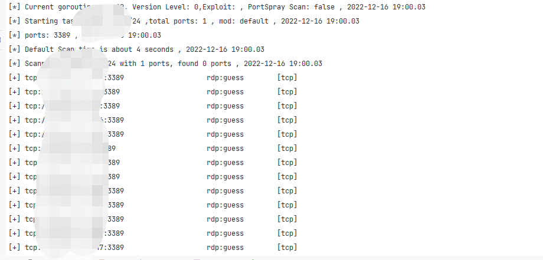

gogo 保留了大量可拓展接口, 例如指纹、poc/exp、工作流, 端口。

这些预设保存在`v2/templates`目录下, 以yaml的形式保存与编辑, 但在编译的时候会自动转为JSON并压缩打包到二进制文件中。

绝大部分插件都可以使现有的框架能完成, 如果有较为复杂的需求, 例如ms17010探测, 可以在`/v2/internal/plugin`中添加。

## 拓展端口
配置文件: `v2/templates/port.yaml`

端口配置最为简单, 不需要讲解就能理解。默认配置中有大量案例, 如果有新的默认端口预设, 可以提交issue或pr, 或者通过社交软件联系我。

值得一提的是, `name`与`tags` 都会被gogo作为`-p`参数下可选择的id, 例如db预设, 就是通过tags的方式给多组端口都加上了这个tag.。通过`-p db`即可选用所有的数据库默认端口。

一个完整的示例

```yaml
- name: top2
  ports:
    - '70'
    - 80-90
    - '443'
    - '1080'
    - 2000-2001
    - 3000-3001
    - '1443'
    - '4443'
    - '4430'
    - 5000-5001
    - '5601'
    - 6000-6003
    - 7000-7003
    - 9000-9003
    - 8080-8091
    - 8000-8020
    - '8820'
    - '6443'
    - '8443'
    - '9443'
    - '8787'
    - '7080'
    - '8070'
    - '7070'
    - '7443'
    - 9080-9083
    - '5555'
    - '6666'
    - '7777'
    - '9999'
    - '6868'
    - '8888'
    - '8889'
  type:
    - http
    - common
```

这样配置的端口可通过`-p top2` 或`-p http` 或`-p common`三种方式调用。

可以在指纹中的`default_port`字段填写port中配置的name或tag。

## 拓展workflow

配置文件: `v2/templates/workflows.yaml`

一个完整的示例, 

```yaml
- name: "192"         // 名字, 可通过--workflow调用的标识符
  description: "对192.168.1.1/16使用完整的启发式扫描" // 描述
  ip: 192.168.0.0/16  // 指定的ip
  iplist:             //指定的ip列表, 与ip二选一
    - 192.168.0.0/16 
  ports: top2,win,db  // 端口配置, 与命令行用法相同, 默认值 'top1'
  mod: s              // 模式, 与命令行用法相同, 默认值 'default'
  ping: true          // ping启发探测,等同于命令行的--ping 默认值 'false'
  no-scan: false      // 设置为true则只进行启发式扫描, 不会进行端口扫描. 默认值 'false', 等同于命令行--no
  ip-probe: default    // ip探针, 只可使用于--mod ss的场景下, 默认值 'default', 等同于命令行的--ipp default
  port-probe: default  // 端口探针, 只可使用于启发式扫描场景下, 默认值 'default', 等同于命令行的--sp default
  exploit: none       // 是否启用漏扫, 默认值 'none', 等同于命令行的-e 或 -E  
  verbose: 0          // 是否启用主动指纹识别, 默认值 '0', 等同于-v
  file: auto          // 输出文件位置, 默认值 'auto', 等同于-f
  path: .             // 输出文件路径, 默认值 '.', 等同于--path
  tags:               // 将多个name划分为组, 可通过--workflow tagname即可调用多个workflow
    - inter
```

如果没有填相应的值, 则采用默认值。


如果使用--workflow参数, 但只想改变某几个参数, 可直接使用--workflow workflowname的同时, 使用命令行参数进行覆盖, 命令行参数的优先级大于workflow.

## 拓展指纹

语法引擎详细文档: [fingers语法](https://chainreactors.github.io/wiki/libs/fingers/#_2)

完整说明:

```
- name: frame   # 指纹名字, 匹配到的时候输出的值
  default_port: # 指纹的默认端口, 加速匹配. tcp指纹如果匹配到第一个就会结束指纹匹配, http则会继续匹配, 所以默认端口对http没有特殊优化
    - '1111'
  protocol: http  # tcp/http, 默认为http
  rule:
   - version: v1.1.1 # 可不填, 默认为空, 表示无具体版本
     regexps: # 匹配的方式
        vuln: # 匹配到vuln的正则, 如果匹配到, 会输出framework为name的同时, 还会添加vuln为vuln的漏洞信息
          - version:(.*) # vuln只支持正则,  同时支持版本号匹配, 使用括号的正则分组. 只支持第一组
        regexp: # 匹配指纹正则
          - "finger.*test" 
       # 除了正则, 还支持其他类型的匹配, 包括以下方式
        header: # 仅http协议可用, 匹配header中包含的数据
          - string
        body: # 包含匹配, 非正则表达式
          - string
        md5: # 匹配body的md5hash
          - [md5]
        mmh3: # 匹配body的mmh3hash
          - [mmh3]

        # 只有上面规则中的至少一条命中才会执行version
        version: 
          - version:(.*)  # 某些情况下难以同时编写指纹的正则与关于版本的正则, 可以特地为version写一条正则

     favicon: # favicon的hash值, 仅http生效
        md5:
          - f7e3d97f404e71d302b3239eef48d5f2
        mmh3:
          - '516963061'
     level: 1      # 0代表不需要主动发包, 1代表需要额外主动发起请求. 如果当前level为0则不会发送数据, 但是依旧会进行被动的指纹匹配.
     send_data: "info\n" # 匹配指纹需要主动发送的数据
     vuln: frame_unauthorized # 如果regexps中的vuln命中, 则会输出漏洞名称. 某些漏洞也可以通过匹配关键字识别, 因此一些简单的poc使用指纹的方式实现, 复杂的poc请使用-e下的nuclei yaml配置
```


### HTTP指纹

**案例1**

在大多数情况下只需要匹配body中的内容。一个指纹插件最简配置可以简化为如下所示:

```
- name: tomcat
  rule:
    - regexps:
        body:
          - Apache Tomcat
```

这里的body为简单的strings.Contains函数, 判断http的body中是否存在某个字符串。

gogo中所有的指纹匹配都会忽略大小写。

**案例2**

而如果要提取版本号, 配置也不会复杂多少。

```
- name: tomcat
  rule:
    - regexps:
        regexp:
          - <h3>Apache Tomcat/(.*)</h3>
          - <title>Apache Tomcat/(.*)</title>
```

**案例3**

但是有些情况下, 版本号前后并没有可以用来匹配的关键字. 可以采用version字段去指定版本号。

例如：

```
- name: tomcat
  rule:
    - version: v8
      regexps:
        body:
          - <h3>Apache Tomcat/8</h3>
```

这样一来只需要匹配到特定的body, 在结果中也会出现版本号。

`[+] https://1.1.1.1:443                 tomcat:v8 [200] Apache Tomcat/8.5.56 `

**案例4**

而一些更为特殊的情况, 版本号与指纹不在同一处出现, 且版本号较多, 这样为一个指纹写十几条规则是很麻烦的事情, gogo也提供了便捷的方法.

看下面例子:

```
- name: tomcat
  rule:
    - regexps:
        regexp:
          - <h3>Apache Tomcat/8</h3>
       	version:
       	  - Tomcat/(.*)</h3>
```

可以通过regexps中的version规则去匹配精确的版本号。version正则将会在其他匹配生效后起作用, 如果其他规则命中了指纹且没发现版本号时, 就会使用version正则去提取。

这些提取版本号的方式可以按需使用, 大多数情况下前面两种即可解决99%的问题, 第三种以备不时之需。

**案例5**

假设情况再特殊一点, 例如, 需要通过主动发包命中某个路由, 且匹配到某些结果。一个很经典的例子就是nacos, 直接访问是像tomcat 404页面, 且header中无明显特征, 需要带上/nacos路径去访问才能获取对应的指纹。

看gogo中nacos指纹的配置

```
- name: nacos
  focus: true
  rule:
    - regexps:
        body:
          - console-ui/public/img/favicon.ico
      send_data: /nacos
```

其中, send_data为主动发包发送的URL, 在tcp指纹中则为socket发送的数据。

当`http://127.0.0.1/nacos`中存在`console-ui/public/img/favicon.ico`字符串, 则判断为命中指纹。

这个send_data可以在每个rule中配置一个, 假设某个框架不同版本需要主动发包的URL不同, 也可以通过一个插件解决。

这里还看到了focus字段, 这个字段是用来标记一些重点指纹, 默认添加了一下存在常见漏洞的指纹, 也可以根据自己的0day库自行配置。在输出时也会带有focus字样, 可以通过`--filter focus` 过滤出所有重要指纹。

**案例6**

而还有情况下, 某些漏洞或信息会直接的以被动的形式被发现, 不需要额外发包。所以还添加了一个漏洞指纹的功能。

例如gogo中真实配置的tomcat指纹为例：

```
- name: tomcat
  rule:
    - regexps:
        vuln:
          - Directory Listing For
        regexp:
          - <h3>Apache Tomcat/(.*)</h3>
          - <title>Apache Tomcat/(.*)</title>
        header:
          - Apache-Coyote
      favicon:
        md5:
          - 4644f2d45601037b8423d45e13194c93
      info: tomcat Directory traversal
```

regexps中配置了vuln字段, 这个字典如果命中, 则同时给目标添加上vuln输出, 也就是使用gogo经常看到的输出的末尾会添加`[ info: tomcat Directory traversa]` 

这里也有两种选择info/vuln, info为信息泄露、vuln为漏洞。当填写的是vuln, 则输出会改成`[ high: tomcat Directory traversa]` 

这里还有个favicon的配置, favicon支持mmh3或md5, 可以配置多条。

需要注意的是`favicon`与`send_data`字段都只用在命令行开启了`-v`(主动指纹识别)模式下才会生效。每个指纹只要命中了一条规则就会退出, 不会做重复无效匹配。

### TCP指纹

在gogo中的tcp指纹插件并不多, 加起来也只有20条左右。

在gogo的早期开发中, 一度想过将nmap的指纹全量移植, 但在实践中发现, server指纹有大量主动发包的行为, 并且绝大多数server实战中就算扫到了也没有漏洞去攻击. 为此, 我们想到了一种不需要扫描的指纹识别方式。

也就是经常在gogo中看到了指纹中的guess字段。



这个字段代表, 该指纹是从默认端口配置中猜测的, 而实际上, 需要主动发包扫描的大多数服务也不会更换默认端口. 在经过半年的体验以及一些微小的调整后, 我们认为目前的tcp指纹已经能覆盖99%的渗透测试场景. 如果有必要添加新的tcp指纹, 欢迎提交issue.

以这个rdp服务为例学习gogo中如何编写一个tcp指纹.

```
- name: rdp
  default_port:
    - rdp
  protocol: tcp
  rule:
    - regexps:
        regexp:
          - "^\x03\0\0"
      send_data: b64de|AwAAKiXgAAAAAABDb29raWU6IG1zdHNoYXNoPW5tYXANCgEACAADAAAA
```

指纹的`default_port`可以使用port.yaml中的配置.

port.yaml中的rdp:

```
- name: rdp
  ports:
    - '3389'
    - '13389'
    - '33899'
    - "33389"
```

非常方便的配置guess规则.


另外, rdp服务需要主动发包才能获取到待匹配的数据, 因此, 还需要配置send_data. 

而为了方便在yaml中配置二进制的发包数据, gogo添加了一些简单的装饰器. 分别为:

* b64en , base64编码
* b64de , base64解码
* hex, hex编码
* unhex, hex解码
* md5, 计算md5

在数据的开头添加`b64de|` 即可生效. 如果没有添加任何装饰器, 数据将以原样发送. 需要注意的是yaml解析后的二进制数据可能不是你看到的, **强烈建议二进制数据都使用base64或hex编码后使用**.


这条rdp实际上也是从nmap中移植的, nmap的指纹仓库在这里: https://github.com/nmap/nmap/blob/master/nmap-service-probes

如果熟悉nmap的指纹, 移植指纹并不是一件困难的事情, 甚至也已经有了完全移植nmap指纹库的项目, 不过gogo的tcp指纹(特别是需要主动发包的指纹)未来还是会保持在最小可用状态, 除非必要, 不会添加一些用不到的指纹. 


## 拓展POC
gogo的poc采用了nuclei的poc, 但删除了部分nuclei的语法. 例如dsl. 并且有部分较新的nuclei语法暂不支持. 

gogo 目前支持tcp(暂不支持tls tcp)与http协议的绝大部分nuclei poc

### gogo与nuclei编写poc的注意事项

nuclei 官方的poc编写教程 https://nuclei.projectdiscovery.io/templating-guide/

gogo常用于特殊环境下, 因此删除了许多nuclei原有的功能, 例如dsl, oast以及除了http与tcp协议之外的漏洞探测.

nuclei更新较快, 一般情况下gogo会落后nuclei最新版几个月, 所以建议只使用基本的规则, 编写最简的poc, 保证兼容性.

**明确删除并且后续不会添加的功能**

部分功能会以简化的形式重新加入到gogo中

1. oast与OOB,这类需要外带的功能, 可以通过探测接口是否存在做一个大致的匹配.
2. workflow, 通过chain简单代替
3. info中的大多数信息, 只保留最基本的信息, 并且不会输出, 建议只保留name, tag, severity三个字段
4. pipeline
5. Race conditions
6. 除了regex之外的extractor. 因为引入多个解析库容易会变得臃肿

**暂时不支持的功能, 但在计划表中的功能**

- [x] cookie reuse
- [x] http redirect
- [x] variables  （已支持自定义payloads, 功能类似variables）
- [x] Helper Functions (已支持完整的dsl引擎)

**nuclei中没有, 只能在gogo中使用的功能**

1. finger字段, 能绑定finger, 提供除了tag之外的绑定finger办法，允许写入多个finger

   ```
   id: poc-id
   finger: 
     - fingername1
     - fingername2
   ```

2. chain字段, 如果match成功后会执行的poc

   ```
   id: poc-id
   chain: 其他poc id
   ```

3. 通过命令行参数替换yaml中的payload, 后续将会支持从文件中读列表 

### 从nuclei templates 迁移poc

https://github.com/projectdiscovery/nuclei-templates

大部分poc仅需简单修改即可在gogo中使用.

**示例  迁移apollo-login poc 到gogo**

https://github.com/projectdiscovery/nuclei-templates/blob/d6636f9169920d3ccefc692bc1a6136e2deb9205/default-logins/apollo/apollo-default-login.yaml


这个poc需要进行一些删减和改动. 

1. 删除一些header信息, 并且根据gogo的指纹重新添加tags
2. 减少不必要的发包, apollo实际上只需要第一个signin的包即可确定是否成功
3. ~~dsl在gogo中已删除, 因为dsl不是必要功能, 大部分场景都能通过正则实现, dsl只是减少复杂场景的使用难度. 因此, 我们可以把这段dsl修改为匹配固定值~~ （已于v2.12.0版本中支持dsl）

**example 1 apollo login**

**step 1** 删除不必要的header, 仅保留如下信息, 并重新添加tags

需要注意的是, tags填写的是fingers中存在的指纹, 如果指纹没有识别到, 将不会自动使用poc. 需要-E poc id 强制指定

```
id: apollo-default-login

info:
  name: Apollo Default Login
  severity: high
  tags: apollo
```


**step2 and step3** 原本的poc中有两个包, 修改为一个. 最终成果

```
id: apollo-default-login

info:
  name: Apollo Default Login
  severity: high
  tags: apollo

requests:
  - raw:
      - |
        POST /signin HTTP/1.1
        Host: {{Hostname}}
        Content-Type: application/x-www-form-urlencoded
        Origin: {{BaseURL}}
        Referer: {{BaseURL}}/signin?
        
        username={{user}}&password={{pass}}&login-submit=Login
    attack: pitchfork
    payloads:
      user:
        - apollo
      pass:
        - admin
    matchers-condition: and
    matchers:
      - type: word
        part: header
        negative: true
        words:
          -  '?#/error'
        condition: and

      - type: status
        status:
          - 302
```

**example 2 tomcat default login**

gogo中移植修改完的tomcat-manager-login:

```
id: tomcat-manager-login
info:
  author: pdteam
  name: tomcat-manager-default-password
  severity: high
  tags: tomcat-manager
  zombie: tomcat
http:
  - raw:
      - |
        GET /manager/html HTTP/1.1
        Host: {{Hostname}}
        Authorization: Basic {{base64(username + ':' + password)}}
        User-Agent: Mozilla/5.0 (Windows NT 6.1; WOW64) AppleWebKit/537.36 (KHTML, like Gecko) Chrome/55.0
        Accept-Language: en-US,en;q=0.9
    attack: pitchfork
    stop-at-first-match: true
    matchers:
      - status:
          - 200
        type: status
      - type: word
        words:
          - Apache Tomcat
    extractors:
      - type: regex
        name: cookie
        internal: true
        part: header
        regex:
          - 'JSESSIONID\..*=([a-z0-9.]+)'
    matchers-condition: and
    payloads:
      username:
        - admin
        - root
        - tomcat
        - admin
      password:
        - admin
        - root
        - tomcat
        - 123456
```

### 测试

因为gogo为了缩减体积, 仅使用了标准json库, 所以需要先将yaml转为json

使用自带的脚本 `yaml2json.py`.

`python yaml2json.py apollo-login.yml -f apollo-login.json` 


指定ef文件加载poc

`gogo.exe -ef .\poc.json -ip 127.0.0.1 -e -p 80 -debug`

如果需要配合burp调试, 请使用proxifier代理, 代理gogo的流量到burp


### 提交

官方的poc仓库位于 https://github.com/chainreactors/gogo-templates/tree/master/nuclei

提交对应的pr, 将poc放到合适的文件夹下. 下次release就会自动编译到二进制文件中.

**成为Contributors**

如果不熟悉git使用, 直接将poc复现成功的截图与poc的yaml复制到issue中, 我会手动整理合并poc. 但这种方式可能不能在仓库的Contributors 中找到自己.


使用pull request就能成为repo的Contributors.

**pull request**

首先在github上点击fork, fork gogo-templates 到自己的账号下

然后 git clone fork之后的repo

将编写好的poc 放到gogo-templates/nuclei/对应的目录下.

在本地的文件夹下使用, git命令

`git add .`

`git commit -m "add [poc name]"`

`git push origin master`

这时候点开自己fork之后的repo, 就可以看到刚刚的提交.

然后点击pull request, 将本地的commit 提交至官方的仓库.

维护者看到pr或者issue后会review之后合并. 下个版本的gogo就能使用你提交的poc了.poc编写.md)

## go插件

每个端口探测生命周期有一个贯穿始终的result变量, 在dispatch中添加触发某个插件的逻辑, 并在插件的具体实现中修改result变量即可完成插件的编写. 

没有做过多的抽象, 希望最核心的可拓展能力还是以yaml的dsl为主. 

一个简单的例子, `v2/pkg/plugin/wmiScan.go`

```go
func wmiScan(result *pkg.Result) {
	result.Port = "135"
	target := result.GetTarget()
	conn, err := pkg.NewSocket("tcp", target, RunOpt.Delay)
	if err != nil {
		return
	}
	defer conn.Close()

	result.Open = true
	ret, err := conn.Request(data, 4096)
	if err != nil {
		return
	}

	off_ntlm := bytes.Index(ret, []byte("NTLMSSP"))
	if off_ntlm != -1 {
		result.Protocol = "wmi"
		result.Status = "WMI"
		tinfo := utils.ToStringMap(ntlmssp.NTLMInfo(ret[off_ntlm:]))
		result.AddNTLMInfo(tinfo, "wmi")
	}
}
```

没有做过多的包装, 只需要多result的一些属性做出修改, 即可完成一个简易的poc. 

大部分常见的特殊端口都已经覆盖, 如果额外的需求可以在新建issue. 更建议使用者协助我们维护[gogo-templates](https://github.com/chainreactors/gogo-templates) 仓库.


## 打造自己的gogo

之前提到了gogo在选用指纹, poc的时候都一些自己的取舍, 这些取舍是为了红队场景下做出的, 但如果在非红队场景下,  使用者可以自行打造一个独属于自己的gogo. 例如gogo中没有添加的各种oa poc; 更多的主动发包的指纹等等. 

只需要fork一份[gogo-templates](https://github.com/chainreactors/gogo-templates)仓库, 然后从各种第三方指纹仓库和nuclei poc库中移植自己想要的指纹与poc, 或者添加自己拥有的0day poc/指纹, 几天时间就能拥有一个更为强大的, 自己的gogo.

gogo只是一个引擎, gogo的能力绝大部分来自于gogo-templates中. 公开版本的gogo是一个面向内网的扫描器. 实际上gogo也能胜任外网的扫描任务. 
