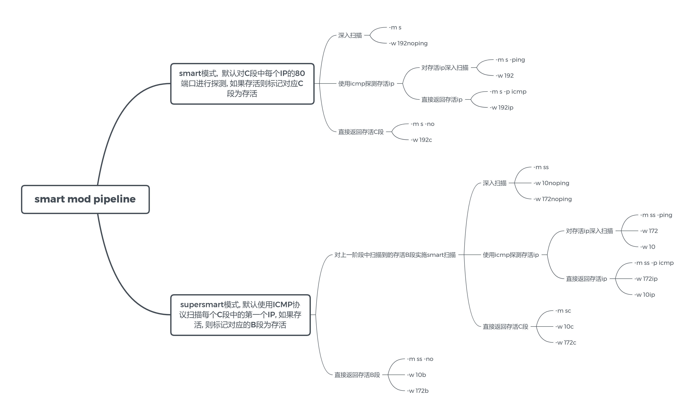

## Features
!!! example "Features."

    * 让红队的A段(或大于A段)扫描成为可能
    * 支持主动/被动指纹识别
    * 关键信息提取, 如title, cert 以及自定义提取信息的正则
    * 支持nuclei poc, 无害化的扫描, 每个添加的poc都经过人工审核
    * 自由组合的扫描逻辑, 高度可控的扫描行为
    * 超强的性能, 最快的速度, 尽可能小的内存与CPU占用.
    * 最小发包原则, 尽可能少地发包获取最多的信息
    * 支持丰富的DSL, 可以通过简单的配置自定义自己的gogo
    * 完善的输出与输出设计
    * 几乎不依赖第三方库, 纯原生go编写, 支持全功能全版本操作系统

## Usage

```
gogo -h
```

将展示完整的参数说明

```
Usage:
  gogo [OPTIONS]

Miscellaneous Options:
  -k, --key=                                        String, file encrypt key
      --version                                    Bool, show version
  -P, --print=[port|workflow|neutron|nuclei|extract]
                                                   String, show preset config; nuclei is a legacy alias
      --debug                                      Bool, show debug info
      --plugin-debug                               Bool, show plugin debug stack
      --proxy=                                     String, socks5 proxy url, e.g. socks5://127.0.0.1:11111

Input Options:
  -i, --ip=                                        IP/CIDR, support comma-split ip/cidr, e.g.
                                                   192.168.1.1/24,172.16.1.1/24
      --exclude=                                   IP/CIDR, exclude comma-split IP/CIDR
      --exclude-file=                              File, exclude IP/CIDR filename
  -p, --port=                                      Port, support comma-split preset('-P port' show all preset), range,
                                                   alias port, e.g. top2,mysql,12345,10000-10100,oxid,smb (default:
                                                   top1)
      --port-config=                               File, custom port config file
  -l, --list=                                      File, list of IP/CIDR
  -L                                               Bool, same as -l, input from stdin
  -j, --json=                                      File, previous results file e.g. -j 1.dat1 or list of colon-split
                                                   ip:port, e.g. 123.123.123.123:123
  -J                                               Bool, same as -j, input from stdin
      --filter-or                                  Bool, combine multiple --filter rules with OR
  -w, --workflow=                                  String, workflow name('-P workflow' show all workflow)
  -W                                               Bool, same as -w, input from stdin
  -F, --format=                                    File, to be formatted result file

Output Options:
  -f, --file=                                      String, output filename
      --path=                                      String, output file path
  -o, --output=                                    String, command-line output format (scan default: full;
                                                   -F default: color)
  -O, --file-output=                               String, file output format; default is inferred from filename
      --output-delimiter=                          String, output delimiter, default [TAB] (default: "\t")
      --af                                         Bool, auto choice filename
      --hf                                         Bool, auto choice hidden filename
  -C, --compress                                   Bool, disable compressed output
      --tee                                        Bool, keep console output
  -q, --quiet                                      Bool, close log output
      --no-guess                                   Bool, When formatting not output guess framework

Smart Options:
  -m, --mod=[s|ss|default|sc]                      String, smart mod (default: default)
      --ping                                       Bool, alive pre-scan
  -n, --no                                         Bool, only smart scan; skip the following default port scan
      --sp=                                        String, smart-port-probe, smart mod default: 80, supersmart mod
                                                   default: icmp (default: default)
      --ipp=                                       String, IP-probe, default: 1,254 (default: default)

Advance Options:
  -s, --spray                                      Bool, enable port-first spray generator. if ports number > 500,
                                                   auto enable
      --no-spray                                   Bool, force to close spray
  -E, --exploit-name=                              String, specify neutron template name/tag
      --ef=                                        String, load specified templates file
      --ff=                                        String, load specified finger file; repeatable
      --payload=                                   String, specify neutron payload; repeatable
      --attack-type=[sniper|clusterbomb|pitchfork] Neutron attack type
      --extract=                                   String, custom extractor regexp/preset; repeatable
      --opsec                                      Bool, skip templates marked as non-OPSEC
      --filter=                                    String, retain matching results for -F/-j; repeatable
      --output-filter=                             String, suppress matching scan results from output
      --scan-filter=                               String, stop deep scanning and suppress matching results

Configuration Options:
  -e, --exploit                                    Bool, enable neutron exploit scan
  -v, --verbose                                    Bool, enable active finger scan; repeat for level 2
  -t, --thread=                                    Int, concurrent thread number,linux default: 4000, windows default:
                                                   1000
  -d, --timeout=                                   Int, socket and http timeout (default: 2)
  -D, --ssl-timeout=                               Int, ssl and https timeout (default: 2)

Help Options:
  -h, --help                                       Show this help message
```

上面的参数表与当前 `v2/core/options.go` 同步；具体版本仍以本地二进制的 `gogo -h` 输出为准。多字符长参数必须使用双横线，例如 `--ipp`、`--sp`、`--ef`，不能写成 `-ipp`、`-sp`、`-ef`。

## QuickStart

**最简使用**

指定网段进行默认扫描, 并在命令行输出

`gogo -i 192.168.1.1/24 -p win,db,top2 `

<br>

**smart mod**

当目标范围的子网掩码小于24时, 建议启用 [smart mod](/gogo/concept/#b段的启发式扫描)

例如子网掩码为16, (如果输出结果较多, 建议开启--af输出到文件, 命令行只输出日志)

`gogo -i 192.168.1.1/16 --mod s -p top2,win,db --af`

`--af`的意思为自动生成文件, `--mod s`的意思为使用[smart mod](/gogo/concept/#b段的启发式扫描)进行扫描, `-p`的意思为指定端口, 可使用端口预设(`-P port` 查看所有的[端口预设](/gogo/start/#端口配置)).

这个命令有些复杂, 但不用担心, 可以使用workflow代替.如 `gogo --workflow 192`, 

<br>

**supersmart mod** 

当目标范围的子网掩码小于16, 建议启用[supersmart模式](/gogo/concept/#a段的启发式扫描)扫描, 例如:

`gogo -i 10.0.0.0/8 --mod ss --ping -p all --af`

或使用workflow简化为 `gogo --workflow 10`

当前 `10`、`172`、`192` 等内置 workflow 默认使用 `all` 端口预设。如需缩小范围，可在 workflow 后覆盖，例如 `gogo --workflow 10 -p top2,win,db`。

<br>

常用的配置已经被集成到workflow中, 如果需要自定义网段, 则是`gogo --workflow 10 -i 11.0.0.0/8`, 通过-i参数覆盖--workflow 10 中的ip字段. 

因为`--workflow 10`的语义可能造成混淆, 也可以使用语义化的通用workflow: `gogo --workflow ss -i 11.1.1.1/8`.

!!! note "注意"
	workflow 中的大多数预设参数优先级低于命令行输入，因此可以通过命令行覆盖；当前二进制实际支持的覆盖行为以 `gogo -h` 和运行结果为准。

使用`-P workflow`查看所有的[workflow预设](/gogo/start/#workflow), 更便捷的使用gogo.

**分析扫描结果**

如果指定了 `--af` 或 `--workflow`（内置 workflow 默认配置自动文件输出），默认结果是 deflate 压缩的 JSON Lines `.dat` 文件，需要使用 `-F` 格式化扫描结果。

`gogo -F result.dat`

也可以导出为json进行后续分析

`gogo -F result.dat -o json -f result.json`

## Input

最常用的输入就是命令行, 通过--ip 与-p参数配置任务.

但在实际情况中, 会有来自其他工具导入的目标, 有来自自身扫描结果的二次输入, 有需要过滤出特定数据的再次输入.  甚至有挂在云函数上的gogo版本.

因此, 目前支持非常多类型的输入. 包括

* `-i/--ip` 命令行输入
* `-l/--list` 从文件中读取ip列表,配合其他命令行参数, 同样会自动识别加密解密
* `-w/--workflow` workflow, 支持名字(逗号分割), base编码的json格式的workflow
* `-j` 从gogo上一次扫描结果中读取任务,配置其他参数后再次扫描
	* 之前结果的文件, 自动识别加密并解密, 也可以输入自行导出的json文件, 只需要保留ip,port, framework三个字段即可.
	* 启发式扫描结果的网段文件
	* ip:port[:framework] 按行分割的txt文本, framework可留空
* -L 从标准输入读, 功能同-l参数
* -J 从标准输入读, 功能同-j参数
* -W 从标准输入读的workflow json格式的文件

还因为stdin遇到`/00`被截断, 所以支持先通过base64再传入到gogo中, 例如`cat 1.json | base64 | gogo -J `

从stdin来的数据可能是base64编码过后也可能是明文的, gogo会自动判断. 

可以使用 `--exclude 192.168.1.1,192.168.2.0/24` 或 `--exclude-file exclude.txt` 排除目标。多个排除项使用逗号分隔；文件中每行一个 IP/CIDR。

### 端口配置

gogo支持非常灵活的[端口配置](https://github.com/chainreactors/gogo-templates/blob/master/port.yaml)

参看端口预设,参数 `-P port`

使用端口预设自由地配置端口: `-p top2,http,1-1000,65534`

一些常用的端口配置:

* `-p -`  等于`-p 1-65535`
* `-p all` port.yaml中的所有端口
* `-p common` 内网常用端口
* `-p top2,top3` 外网常见web端口

如需加载自定义端口预设文件，使用 `--port-config port.yaml`。自定义指纹文件使用可重复的 `--ff finger.yaml` 参数加载。

### workflow

在gogo2.0版本后, 引入了全新的命令行操作方式workflow, 大大简化了十几个参数对初学者造成的困扰.

可以自定义常用工作流, 或者使用预设的工作流. 参数为-w/--workflow.

使用下面的命令查看当前二进制内置的全部 workflow。预设会随模板更新，因此文档不再复制一份容易过期的静态列表。

```bash
gogo -P workflow
```

虽然已经采用workflow简化了使用者使用的难度, 但不代表能简化理解工作流原理的难度. 这张思维导图列出了一些常见的工作流工作逻辑.



workflow 的目标、扫描模式、探针、并发、输出和过滤等常用配置可以通过命令行覆盖，具体参数见 `gogo -h`。

例如:`gogo --workflow 10 -p 1-65535 -ev`

这样原来名字为10的workflow的端口被修改为1-65535, 并开启了主动指纹识别与主动漏洞扫描.

如果是需要对某个网段长期监控, 还可以自定义workflow.

预设的配置文件位于 `v2/templates/workflows.yaml`，可以仿照配置文件添加新的预设，并使用 `--workflow filename` 指定对应的预设。

如果在渗透的远程环境下, 可以使用yaml2json.py 见自定义预设转为base64编码字符串, 使用`--workflow 'b64de|[BASE64 string]'`执行.

## Output

实时扫描默认使用不带颜色的 `full` 格式，一行输出一个开放端口及其识别信息。需要着色时可指定 `-o color`；`-F` 格式化到终端时默认使用 `color`，如需关闭颜色则指定 `-o full`。

??? info "命令行输出样例"
    ```
    gogo -i 81.68.175.32/28 -p top2
    [*] Current goroutines: 1000, Version Level: 0,Exploit Target: none, PortSpray Scan: false ,2022-07-07 07:07.07
    [*] Starting task 81.68.175.32/28 ,total ports: 100 , mod: default ,2022-07-07 07:07.07
    [*] ports: 80,81,82,83,84,85,86,87,88,89,90,443,1080,2000,2001,3000,3001,4443,4430,5000,5001,5601,6000,6001,6002,6003,7000,7001,7002,7003,9000,9001,9002,9003,8080,8081,8082,8083,8084,8085,8086,8087,8088,8089,8090,8000,8001,8002,8003,8004,8005,8006,8007,8008,8009,8010,8011,8012,8013,8014,8015,8016,8017,8018,8019,8020,6443,8443,9443,8787,7080,8070,7070,7443,9080,9081,9082,9083,5555,6666,7777,9999,6868,8888,8889,9090,9091,8091,8099,8763,8848,8161,8060,8899,800,801,888,10000,10001,10080 ,2022-07-07 07:07.07
    [*] Scan task time is about 8 seconds ,2022-07-07 07:07.07
    [+] http://81.68.175.33:80      nginx/1.16.0            nginx                   bd37 [200] HTTP/1.1 200
    [+] http://81.68.175.32:80      nginx/1.18.0 (Ubuntu)           nginx                   8849 [200] Welcome to nginx!
    [+] http://81.68.175.34:80      nginx           宝塔||nginx                     f0fa [200] 没有找到站点
    [+] http://81.68.175.34:8888    nginx           nginx                   d41d [403] HTTP/1.1 403
    [+] http://81.68.175.34:3001    nginx           webpack||nginx                  4a9b [200] shop_mall
    [+] http://81.68.175.37:80      Microsoft-IIS/10.0              iis10                   c80f [200] HTTP/1.1 200             c0f6 [200] 安全入口校验失败
    [*] Alive sum: 5, Target sum : 1594 ,2022-07-07 07:07.07
    [*] Totally run: 4.0441884s ,2022-07-07 07:07.07
    ```

在没有配置输出文件的情况下，结果会输出到标准输出。如果指定 `-f filename` 或使用 `--af` 自动选择文件名，文件输出会默认关闭扫描结果的命令行输出，防止大量输出阻塞 WebShell 或 C2；日志仍会正常输出。自动文件通常使用 `.dat` 后缀，重名时才会追加数字。

如果想同时保留两个地方的输出, 也预留了可选项, 使用`--tee` 参数能在指定了-f的时候继续保留命令行输出. 

输出到文件的格式通过大写的 `-O` 指定。未指定 `-O` 时会根据 `-f` 的扩展名推断：`.json` 使用明文 JSON Lines，`.csv` 使用 CSV，`.txt` 使用 full 文本，`.dat` 或 `--af` 使用压缩 JSON Lines。`-o` 与 `-O` 分别控制终端和文件格式。

如果需要配合其他工具, 那就需要将日志输出关闭, 或者不输入到标准输入, 可使用`-q` 关闭所有日志输出.

`.dat`/`--af` 文件默认使用 deflate 压缩；指定 `-C` 可关闭压缩。`-C` 只控制压缩，不等同于加密；使用 `.json`、`.csv` 或 `.txt` 扩展名时默认就是明文输出。

!!! info "命令行输出的缺点"
	命令行输出有不少缺点, 当一个ip开放了多个端口, 请求响应的顺序无法控制, 会结果导致东一个西一个, 无法很好地关联起来; 乱序的输出是很难人工介入判断扫描是否存在漏报或者误报的, 因此更推荐使用输出到文件, 使用-F格式化排序并根据IP聚类数据.


!!! note "注意"
	`--af`、`--hf` 等自动生成的文件默认写到 gogo 二进制文件目录，可通过 `--path [path]` 修改目录。显式指定 `-f` 时，文件路径按 `-f` 原样使用；如需指定目录，请直接写成 `-f path/result.dat`。

### 输出到文件

在非交互场景下, 例如webshell中, 也提供了分析扫描进度的功能, 扫描进度会以日志的形式保存到`.sock.lock`文件中. 通过读取文件即可判断当前的扫描进度.

值得一提的是, 就算扫描任务没有结束, 也可以使用-F格式化已经扫描完成的部分. gogo并非实时写入, 每个C段或者缓冲区每超过4k便会同步到文件一次.

如果启用了启发式扫描, 则可能会输出多个文件. 则建议使用`--af`(auto-filename), 分别是

* 带default关键字的扫描结果
* 带ccidr关键字的存活的c段
* 带bcidr关键字的存活的b段
* 带alived关键字的存活的ip

!!! note "注意."
	如果使用在启发式扫描的时候 `-f filename`指定文件名, 则只会输出扫描结果, 网段信息和存活信息的文件不会生成 

### 格式化输出

输出文件需要 `-F`参数进行格式化, 用以进行后续的分析与处理. 

不论是base64, deflate算法压缩后的,还是明文的json. gogo会自动判断格式并解析.

使用: `-F/--format file`

-F file 会自动解析文件,并排序归类端口与ip. 输出比默认的命令行输出可读性更好的结果. 可以实际体验一下, 是一个比默认命令行输出更友好的格式. 

??? info "格式化输出样例"
    ```
    gogo  -F .\.81.68.175.32_28_all_default_json.dat1
    Scan Target: 81.68.175.32/28, Ports: all, Mod: default
    Exploit: none, Version level: 0

    [+] 81.68.175.32
            http://81.68.175.32:80  nginx/1.18.0 (Ubuntu)           nginx                   8849 [200] Welcome to nginx!
            tcp://81.68.175.32:22                   *ssh                     [tcp]
            tcp://81.68.175.32:389                                           [tcp]
    [+] 81.68.175.33
            tcp://81.68.175.33:3306                 *mysql                   [tcp]
            tcp://81.68.175.33:22                   *ssh                     [tcp]
            http://81.68.175.33:80  nginx/1.16.0            nginx                   bd37 [200] HTTP/1.1 200
    [+] 81.68.175.34
            tcp://81.68.175.34:3306                 mysql 5.6.50-log                         [tcp]
            tcp://81.68.175.34:21                   ftp                      [tcp]
            tcp://81.68.175.34:22                   *ssh                     [tcp]
            http://81.68.175.34:80  nginx           宝塔||nginx                     f0fa [200] 没有找到站点
            http://81.68.175.34:8888        nginx           nginx                   d41d [403] HTTP/1.1 403
            http://81.68.175.34:3001        nginx           webpack||nginx                  4a9b [200] shop_mall
    [+] 81.68.175.35
            http://81.68.175.35:47001       Microsoft-HTTPAPI/2.0           microsoft-httpapi                       e702 [404] Not Found
    [+] 81.68.175.36
            http://81.68.175.36:80  nginx   PHP     nginx                   babe [200] 风闻客栈24小时发卡中心 - 风闻客栈24小时发卡中心
            tcp://81.68.175.36:22                   *ssh                     [tcp]
    ...
    ...
    ```

`-F` 输出到终端时默认着色；如需无颜色文本，使用 `-o full`。

??? info "待格式化的json文件样例"
    ```json
    {
        "config": {
            "ip": "127.0.0.1/24",
            "ips": null,
            "ports": "top1",
            "json_file": "",
            "list_file": "",
            "threads": 4000,
            "mod": "default",
            "alive_spray": null,
            "port_spray": false,
            "exploit": "auto",
            "json_type": "scan",
            "version_level": 1
        },
        "data": [
        ...
        ]
    }
    ```
    这个json文件中是会带有任务的摘要信息. 每个端口的详细数据位于data字段中的数组. 

??? info "data中的result样例"
    这是data中每个元素的格式
    ```json
    {
        "ip": "127.0.0.1",
        "port": "80",
        "frameworks": {
            "nginx": {
                "name": "nginx",
                "froms": {
                    "0": true,
                    "3": true
                },
                "tags": [
                    "other"
                ]
            },
            "rabbitmq-manager": {
                "name": "rabbitmq-manager",
                "froms": {
                    "0": true,
                    "2": true
                },
                "tags": [
                    "cloud"
                ]
            }
        },
        "vulns": [
            {
                "name": "rabbitmq-login",
                "payload": {
                    "auth": "Z3Vlc3Q6Z3Vlc3Q="
                },
                "severity": 3
            }
        ],
        "protocol": "http",
        "status": "200",
        "language": "",
        "title": "RabbitMQ Management",
        "midware": "nginx/1.20.1"
    }
    ```

!!! note "注意."
	格式化输出时也支持`--af`, `-o`, `-f`等参数, 控制输出的格式以及控制输出的文件, 进行后续的分析.  

### 自定义输出格式

对于输出的格式, 命令行目前默认是full, 但是为了配合其他工具, 也提供了各种格式的输出, `-o ip`参数指定需要的字段, 也支持逗号分割的多个参数, `-o ip,port,title`. 以及一些特殊值, 例如`-o url,target`等.

在扫描时可以通过 `-o`（终端格式，默认为 full）与 `-O`（文件格式，未指定时根据文件扩展名推断）分别控制两类输出。

使用`-F`时, 只需要使用`-o`.

目前gogo支持非常多的输出格式. 例如result的各种字段:

* url , `protocol://ip:port` 
* target , `ip:port`
* ip,  IP
* port, 端口
* protocol, 协议
* status, 状态码, 支持别名stat
* host, 证书/主机名等字段
* midware, http中的`Server` header
* language, 语言
* os, 操作系统
* title, 标题
* frameworks, 别名frame, 指纹
* vulns, 别名vuln, 漏洞

可以自由组合, 例如`-o ip,url,title`, 默认会使用`tab`分割.

除了这些字段, 还存在一些特殊的输出格式. 如下:

* json, 输出为一个聚合 JSON 对象
* jsonlines, 别名 jl, 一行一个 JSON；扫描文件的默认数据格式
* full, 命令行的默认输出格式
* color, 带颜色的full输出
* csv, 输出为csv
* zombie, 导出为zombie的输入格式
* cs, 导出为cobaltstrike中target的格式.
* extract, 格式化extract结果

### 过滤器

当前过滤器分为三类，不能混用：

1. `--filter`：用于 `-F` 或 `-j`，保留匹配的历史结果，便于格式化、导出或再次扫描。
2. `--output-filter`：实时扫描完成后，隐藏匹配的结果，不输出到终端或结果文件。
3. `--scan-filter`：基础指纹识别后立即停止匹配目标的主动指纹和漏洞探测，同时隐藏该结果，可用于减少后续发包。

多个 `--filter` 默认按 AND 组合；添加 `--filter-or` 后按 OR 组合。三个过滤参数都可以重复指定。

当前filter支持的操作, `==` 全等匹配, `::` 模糊匹配, `!=` 不等于, `!:` 不包含

filter 的 key 与 `-o` 支持的 result 字段相同，但不支持 `-o` 中的特殊格式。

example:

`gogo -F 1.dat --filter frame::weblogic` 过滤weblogic框架

`gogo -F 1.dat --filter port==80` 过滤端口为80的结果

`gogo -F 1.dat --filter title!=` 过滤出标题不为空的结果

filter的特殊key:

* tag, 指纹的tag, 来自gogo-templates中的文件名, 仅支持`==` 与`!=`
* from, 指纹来源, 来自gogo中的不同插件识别到的指纹, ,仅支持`==` 与`!=`

example:

`gogo -F 1.dat --filter tag!=waf`  过滤出不存在waf的结果

`gogo -F 1.dat --filter tag==cloud`  过滤出存在云相关的结果

filter还支持一些特殊值. 

* `gogo -F 1.dat --filter focus` 存在finger中标记为focus的结果
* `gogo -F 1.dat --filter vuln` 存在至少一个vuln的结果

!!! note "注意."
	使用`-F 1.dat --filter`的时候也可以使用`-f`/`--af`对filter的结果再次输出. 

实时扫描过滤示例：

```bash
# 隐藏 nginx 结果，但仍完成正常扫描流程
gogo -i 192.168.1.0/24 --output-filter frame::nginx

# 识别到 nginx 后停止更深层探测，并隐藏该结果
gogo -i 192.168.1.0/24 --scan-filter frame::nginx -ev
```

### 提取器

gogo可以从返回内容中提取的特定的数据.

可以通过`--extract regexp`, 自定义正则表达式去提取数据. `--extract` 可以添加多个.

extract也存在一些常用的预设, 可以通过`--extract url`调用内置的预设

可通过`-P extract`查看所有预设.

!!! note "注意."
	默认的`gogo -F 1.dat`输出的extract结果仅为缩略报告. 如需查看完整的extract结果, 需要`gogo -F 1.dat -o extract`

## Advance Feature

### 端口Spray模式

任务生成器会以端口优先生成任务, 而非默认的ip优先.

`gogo -i 172.16.1.1/24 -p top2 -s`

在配置的端口数超过500时, 会自动开启. 防止过高的并发将几千个请求同时打在同一个设备上, 造成dos.  可以使用`--no-spray` 强制忽略掉这个优化. 

### 主动指纹识别

gogo的指纹识别通过 [fingers](https://github.com/chainreactors/fingers) 实现

当前包括数千条web指纹, 数百条favicon指纹以及数十条tcp指纹

默认情况下只进行被动指纹识别。如需主动指纹识别，添加一次 `-v` 启用 level 1；重复为 `-vv` 时启用 level 2，并增加 favicon/FingerprintHub 等更深层主动识别。主动探测会增加请求量和耗时。

`gogo -i 192.168.1.1/24 -p top2 -v `

指纹识别将会标注指纹来源, 有以下几种情况:

* active 通过主动发包获取
* ico 通过favicon获取
* 404 通过随机目录获取
* guess 只作用于tcp指纹, 根据服务默认端口号猜测

!!! danger "警告."
	tcp的主动指纹识别在最坏情况下, 必须要等待`超时时间上限*主动指纹数量(目前是10条)`. 所以请慎重开启-v功能, 内网的某些网络策略会导致开启了-v的情况下, 耗时急剧增加.

!!! note "注意."
	在开启了`--debug`的情况下, 将会输出该条指纹是命中了哪条配置. 

### 主动漏洞探测

gogo的漏洞探测功能通过[neutron](https://github.com/chainreactors/neutron)实现.

gogo并非漏扫工具,因此不会支持sql注入, xss之类的通用漏洞探测功能。

**目前gogo支持的所有漏洞: https://chainreactors.github.io/wiki/gogo/concept/#漏洞探测**

为了支持内网更好的自动化, 集成了nuclei的poc, 可以用来编写poc批量执行某些特定的扫描任务, 以及一些默认口令登录的poc

nuclei的中poc往往攻击性比较强, poc移植到gogo之前会进行一些修改和复现, 因此不打算一口气移植全部的nuclei poc

目前已集成的 POC 位于 `v2/templates/neutron`，另有 ms17-010、SMBGhost、SNMP 等协议专项探测。

nuclei poc将会根据指纹识别的情况自动调用, 而非一口气全打过去, 为了更好的探测漏洞, 建议同时开启`-v`主动指纹识别

使用:

`gogo -i 192.168.1.1/24 -p top2 -ev`

某些情况下, 可能会因为指纹没有正确匹配, 导致poc无法正确调用, 因此也提供了`-E` 参数强制指定poc的name、id或tag

例如`gogo -i 192.168.1.1 -p 7001 -E weblogic `, 将会调用所有带weblogic tag的poc. 

!!! note "注意."
	当前所有的workflow都没有添加`-v` 与`-e` , 如果有需要, 请在使用workflow时手动添加`-ev`

### 特殊端口支持

部分特殊端口以插件的形式支持, 而非默认的探测端口状态. 可以收集一些额外的信息.

* WMI,  `gogo -i 172.16.1.1/24 -p wmi`
* OXID, `gogo -i 172.16.1.1/24 -p oxid`
* NBTScan, `gogo -i 172.16.1.1/24 -p nbt`
* PING, `gogo -i 172.16.1.1/24 -p icmp`
* SNMP, `gogo -i 172.16.1.1/24 -p snmp`
* SMB, `gogo -i 172.16.1.1/24 -p smb`

可以任意组合使用, 例如:

`gogo -i 172.16.1.1/24 -p smb,wmi,oxid,nbt,icmp,80,443,top2`

!!! info "ICMP的权限"
	在 Linux 中，非 root 权限无法使用 ICMP。gogo 不会为每个 goroutine 调用外部 ping，而是输出警告并跳过 ICMP 探测；如果指定了 `--ping`，会跳过存活预扫描并直接进入端口扫描。
	Windows大多数情况下就算是普通用户权限也能使用icmp, 极少数情况下会发生权限不足的报错。
	不管是Windows还是Linux, 发生了相关的问题都会在命令行中输出相关的提示, 或者打开`--debug`查看每个请求的失败原因, 可以人工判断后调整扫描逻辑。


### debug

打开`--debug`可以看到每个请求的历史记录与错误原因, 端口状态, 插件发送的数据, 指纹的命中情况, 调用的poc等等详细数据, 用来研判gogo是否正常工作。

!!! note "plugin-debug"
	因为使用了ants库, 如果plugin中导致的报错会被捕获并跳过。所以如果plugin中的代码发生了错误, 需要`--plugin-debug`参数去展示报错堆栈, 否则只能看到报错原因, 难以debug。


### 启发式扫描

* `--mod s` , 根据端口探针, 喷洒存活的C段.  递归下降到default scan
* `--mod ss`,  根据ip探针, 喷洒存活的B段, 递归下降到`--mod s`
* `--mod sc` , 先进行`--mod ss`探测存活B段, 然后递归下降到`--mod s`, 并在default scan前退出, 用来探测A段中存活的C段.  是`--mod ss`的一个特例, 用作简化操作.
* `--ping`, 在递归下降到default scan, 插入icmp协议的ip存活探测, 递归下降到default scan
* `--no` 在启用启发式扫描时, 如果停止所有递归下降, 只会进行当前阶段的启发式扫描, 例如`-m ss`将不会下降为`-m s`
* `--ipp` ip probe, 控制在supersmart模式下每个C段需要探测的ip
* `--sp`  smart port probe, 控制在smart模式下每个ip的端口探针

启发式扫描需要合适的参数组合才能发挥最大的作用。

绝大多数常用的启发式扫描场景已经被封装到workflow中, 更建议在workflow中调用对应的扫描逻辑.。

如需了解每个细节和原理, 请见 [启发式扫描原理](/gogo/concept/#启发式扫描原理)

### OPSEC

gogo是面向红队的工具, 所以OPSEC也是其设计的核心理念.

`--opsec` 可以使得扫描时特征更小, 也会带来一定的能力损失. 

fingers的opsec
```
- name: swagger
  focus: true
  opsec: true
  rule:
    - regexps:
        vuln:
          - Swagger UI
      send_data: /swagger-ui.html
      info: swagger leak
```

neutron的opsec
```
id: shiro-default-key
opsec: true
info:
  name: brute Shiro key
  severity: critical
  tags: shiro
...
```

通过在templates中添加这两个配置项即可在`--opsec`时自动忽略


## Make

```bash
# download
git clone --recurse-submodules https://github.com/chainreactors/gogo
cd gogo/v2

# sync dependency
go mod tidy   

# generate template.go
go generate

# build（标准 CLI 构建必须启用 goregexp，与 release 构建保持一致）
go build -tags goregexp -o gogo .

# run from source
go run -tags goregexp . -F 1.json
```

`goregexp` 用于选择 Go 标准库正则后端，也是 release、nightly 和 TinyGo 构建采用的默认方案。手动编译时不要省略该 tag；否则在部分 Go/Windows 组合下可能进入 `go-re2`/WASM 路径，并在加载指纹规则时出现 `wasm error: invalid table access`。

`-tags` 是 `go` 命令的编译参数，不是 gogo 的运行参数：

```bash
# 从源码运行并解析结果
go run -tags goregexp . -F 1.json

# 编译后运行
./gogo -F 1.json

# Windows PowerShell
.\gogo.exe -F .\1.json
```

不要写成 `gogo run -tags goregexp -F 1.json`，否则 `-tags` 会被 gogo 解析为 `-t` 线程参数，并报 `strconv.ParseInt: parsing "ags"`。

## 注意事项
!!! danger "注意事项!"
    
    * (重要)因为并发过高, 可能对路由交换设备造成伤害, 例如, 某些家用路由设备面对高并发可能会死机、重启、过热等后果。因此在外网扫描的场景下**建议在阿里云、华为云等vps上使用** , 如果扫描国外资产, 建议在国外vps上使用。本地使用如果网络设备性能不佳会带来大量丢包。如果在内网扫描需要根据实际情况调整并发数。
    * 如果使用中发现疯狂报错, 大概率是io问题(例如多次扫描后io没有被正确释放, 或者配合proxifier以及类似代理工具使用报错), 可以通过重启电脑、虚拟机中使用、关闭代理工具解决, 如果依旧无法解决请联系我们。
    * upx压缩后体积大概在2m左右, 但是某些杀软可能会查杀upx壳, 在极少数情况下upx压缩完可能会无法运行, 请自行选择是否使用upx压缩, 默认发布的版本没有使用upx压缩。
    * 一般情况不建议在代理场景下使用, 如果一定要在代理场景下使用, 建议`-t`调整并发到合适的数量, 默认为4000并发, 极有可能打崩代理。
    * gogo本身并不具备任何攻击性, 也无法对任何漏洞进行利用, 因此也不会对应用造成损害, 但有可能因为高并发对网络环境造成阻塞, 请谨慎使用。
    * 不要过于相信gogo的指纹与漏洞结果, gogo是为了红队最快速探测设计的, 而不是最准确设计的. 
    * **使用gogo需先确保获得了授权, gogo反对一切非法的黑客行为**

### 使用场景并发推荐

默认的并发linux为4000, windows为1000, 为企业级网络环境下可用的并发。**弱网络环境(家庭, 基站等)可能会导致网络dos**。

建议根据不同环境,手动使用`-t`参数指定合适的并发数。

* 家用路由器(例如钓鱼, 物理, 本机扫描)时, 建议并发 100-500
* Linux 企业网络环境(例如外网突破web获取的点), 默认并发4000, 不需要手动修改
* Windows 企业网络环境, 默认并发1000, 不需要手动修改
* 高并发下udp协议漏报较多, 例如获取netbois信息时, 建议单独对udp协议以较低并发重新探测
* Web的正向代理(例如regeorg),建议并发 10-30
* 反向代理(例如frp), 建议并发10-100

如果如果发生大量漏报的情况, 大概率是网络环境发生的阻塞, 导致网络延迟上升超过默认的超时时间而产生的漏报.

因此也可以通过指定 `-d 5 `(tcp默认为2s, tls默认为两倍tcp超时时间, 即4s)来提高超时时间, 减少漏报。

未来也许会实现auto-tune, 自动调整并发速率。
