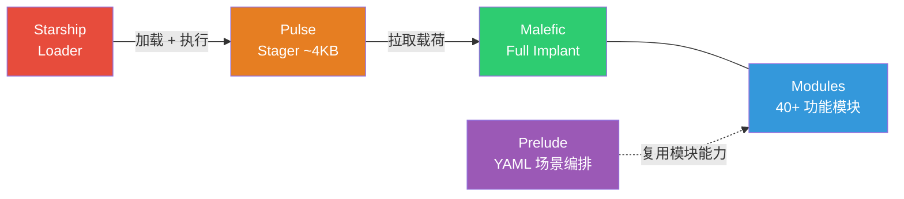
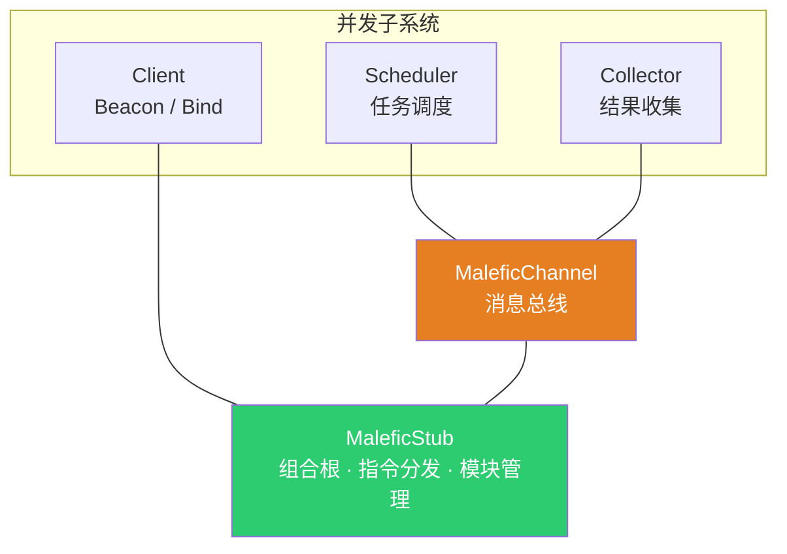
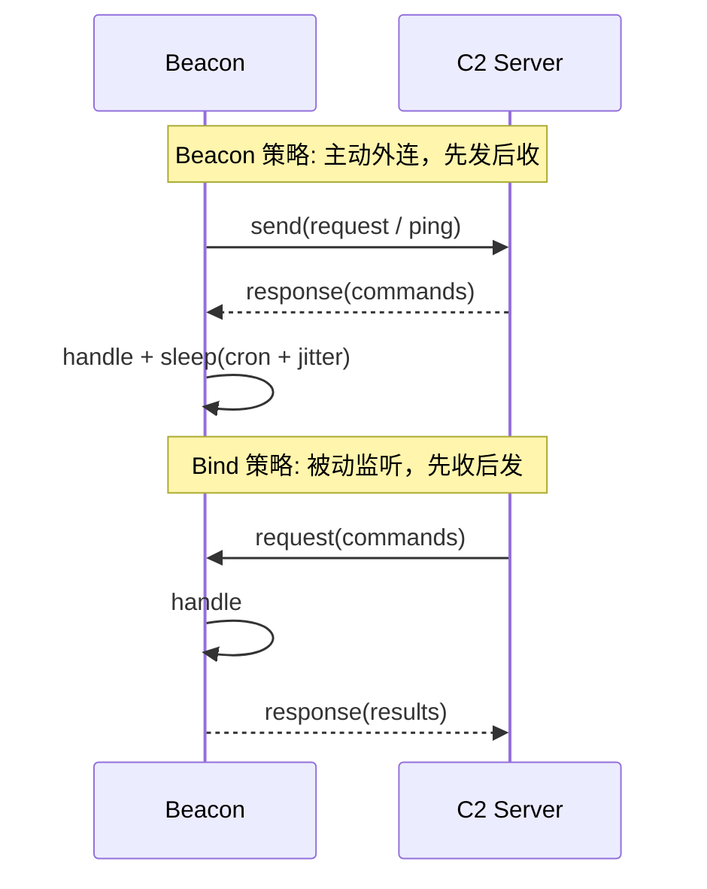
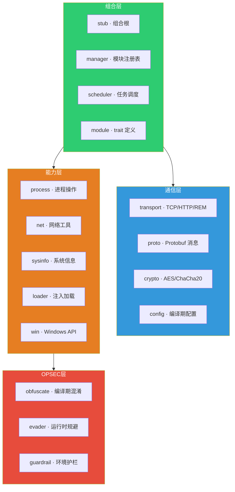
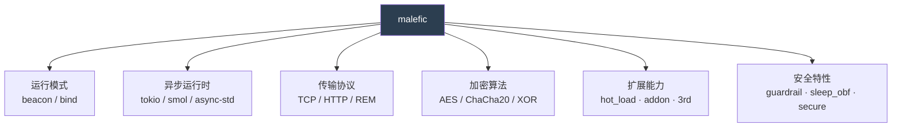
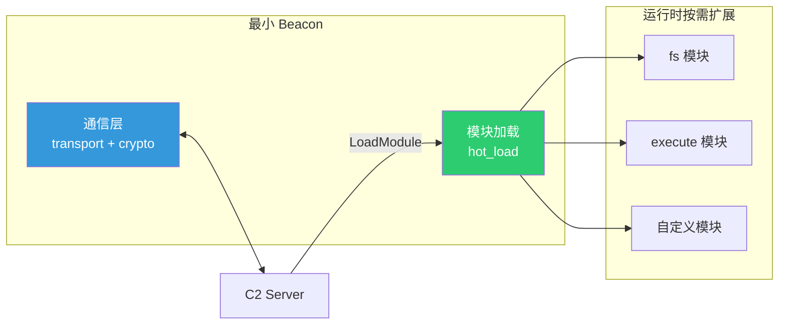
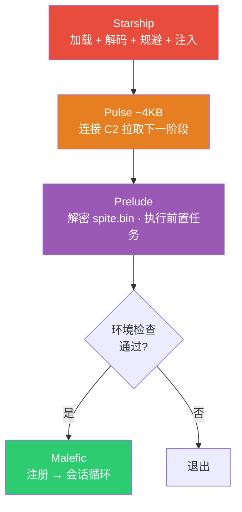
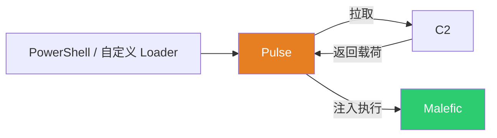

# 架构设计: 从 Starship 到 Malefic 的层层组装

## 为什么需要分层

传统的植入体设计往往将所有能力打包到一个单体二进制中 — 加载、通信、执行、持久化全部耦合在一起。这在简单场景下足够，但随着对抗升级，单体设计暴露出根本性的问题：

- **体积与隐蔽性的矛盾** ：功能越多，体积越大，静态特征越明显
- **投递灵活性不足** ：不同场景需要不同的投递方式，但单体无法裁剪
- **场景适配困难** ：面对不同的目标环境（不同杀软、不同权限、不同网络拓扑），需要不同的前置策略

malefic 的回答是 **分层组装** — 将植入体的生命周期拆分为多个独立阶段，每个阶段只解决一个问题，通过编译期 feature flags 实现零成本裁剪。这些阶段可以自由组合：可以全链路串联，也可以跳过中间阶段直接投递。



从左到右，体积递增、功能递丰；从右到左，OPSEC 要求递严。整个架构可以从三个层面理解：

- **投递链** (Starship → Pulse → Malefic)：解决"如何把载荷安全送达目标"
- **模块系统** (Modules)：解决"Agent 能做什么"
- **编排层** (Prelude)：解决"不同场景如何适配"

---

## Starship — Shellcode 加载框架 (Pro)

Starship 是 Professional 版本的投递链第一个环节，负责将 shellcode 加载到目标内存中执行。

### 流水线设计

Starship 内部采用四段流水线，每一段职责单一、通过 feature flag 独立选择实现：


这种设计源于一个现实问题：shellcode 加载面临 **组合爆炸** — 12 种编码方案 × 60+ 种执行技术 × 8 种规避模块，如果每种组合都写一个 loader，维护成本不可接受。通过将流水线拆分为独立的阶段，每个阶段通过 feature flag 选择实现，任意组合只需要在编译时指定 feature：

```bash
# AES 加密 + 间接系统调用 + 全部规避
cargo build --features enc_aes,indirect_syscall,evader_full
```

不需要的代码根本不会编译进最终二进制，从根本上减少静态特征。

### 编码与执行

**编码阶段** 提供 12 种方案，覆盖三种思路：对称加密（AES、ChaCha20、DES、RC4）、编码变换（Base64/45/58）、格式伪装（将 shellcode 伪装为 UUID/MAC/IPv4 列表，绕过基于熵值的检测）。密钥和额外参数在编译时从 `generated/` 目录读取。

**执行阶段** 提供 60+ 种注入技术，按原理分为：自注入（函数指针、Fiber、TLS 回调）、APC 注入（NtTestAlert、QueueUserAPC、ThreadlessAPC）、DLL 技术（DLL 重载、入口点劫持、Phantom DLL）、系统调用（直接/间接 syscall、Halo's Gate、Ninja Syscall）、异常处理（VEH + ROP、硬件断点）、Hook 技术（VMT hook、ROP trampoline）等。每种技术一个 feature，编译时选择恰好一种。

### 规避链

在执行 shellcode 之前，Starship 通过 `malefic-evader` 按固定顺序运行规避模块。这个顺序经过精心设计：

1. **anti_emu** — 先检测沙箱，如果在沙箱中就不暴露后续技术
2. **god_speed** — 从干净的 ntdll 恢复被 hook 的函数（挂起 cmd.exe 读取）
3. **api_untangle** — 从磁盘 ntdll 恢复被 hook 的 NT 函数前 8 字节
4. **etw_pass** — 绕过 ETW 追踪（patch NtTraceEvent / VEH+HWBP）
5. **cfg_patch** — 补丁 CFG 检查，为后续注入铺路
6. **normal_api** — 调用无害 API 制造行为噪声

先脱钩再绕过 ETW，先绕过 ETW 再绕过 CFG — 每一步都为下一步创造条件。如果 anti_emu 检测到沙箱，后续模块不会执行，避免在分析环境中暴露规避手段。

### 依赖隔离

Starship 作为 **独立 workspace** 存在，不在主 `Cargo.toml` 的 workspace members 中。这是一个有意为之的架构决策：loader 依赖的 crate（Windows FFI 绑定、编解码库、规避模块）应当与主体植入体完全隔离。如果 loader 和 implant 共享 workspace，任何一方的依赖变更都可能影响另一方的编译产物，这在对抗场景中是不可接受的。

> 详见 Starship 文档 (Pro)

---

## Pulse — 最小化 Stager

Pulse 是 Starship 加载的 shellcode 本身 — 一个约 4-8KB 的位置无关代码，负责连接 C2、拉取主体载荷并注入执行。

### 设计约束

Pulse 的核心约束是体积。shellcode 越小，能加载它的 loader 越多，注入成功率越高，静态特征也越少。

为了压缩体积，Pulse 做出了以下设计决策：

- **`#![no_std]`**：彻底移除 Rust 标准库。标准库会引入 libc 依赖、panic 处理、格式化输出等大量代码，这些对 stager 毫无用处
- **`#![no_main]`**：不使用 Rust 的常规入口点。入口是一段手写汇编，直接控制栈帧对齐和调用约定
- **无 panic handler** ：panic 处理器是一个空的死循环 — stager 如果出错，沉默退出比展开栈帧更安全
- **编译优化** ：`opt-level = "z"` + `lto = true` + `strip = true` + `panic = "abort"`，一切为体积服务

### 位置无关代码

作为 shellcode，Pulse 必须能在任意内存地址运行，不能依赖固定的加载基址。这通过 `global_asm!` 实现 RIP-relative 定位来解决：

```asm
stardust:           ; 入口点
    push rsi
    mov rsi, rsp
    and rsp, -16    ; 16 字节对齐
    sub rsp, 0x20   ; shadow space
    call entry       ; 调用 Rust 入口
    mov rsp, rsi
    pop rsi
    ret

RipStart:           ; 获取当前 RIP（代码基址）
    call 2f
    ret
2:  mov rax, [rsp]
    sub rax, 0x1b
    ret
```

`RipStart` 通过 `call` + 读取返回地址的技巧获取当前执行位置，所有数据引用都基于此相对偏移。这套模式（称为 stardust pattern）使得 Pulse 不需要重定位表，可以被 `memcpy` 到任意内存位置直接执行。

### 运行时 API 解析

没有标准库，也没有导入表 — Pulse 需要在运行时手动解析所有 Windows API：

```rust
pub unsafe extern "C" fn entry(args: *mut c_void) {
    let instance = Instance::new();   // 遍历 PEB → 定位 kernel32 → 解析 GetProcAddress
    instance.start(args);             // 用解析到的 API 完成网络通信 + 载荷注入
}
```

`Instance::new()` 遍历进程环境块（PEB）的模块链表，通过 API 名称哈希定位 `kernel32.dll`，从其导出表解析 `GetProcAddress` 和 `LoadLibraryA`，然后用它们加载网络通信所需的其他 API。整个过程不产生任何 IAT 条目。

### 与其他阶段的关系

Pulse 可以被任何 loader 加载 — Starship、第三方 loader、甚至内联到 PowerShell 脚本中。它的价值在于 **将投递和执行解耦** ：修改主体 beacon 不需要重新投递 stager，因为 Pulse 只是一个通用的下载执行器。同时 Pulse 也支持 DLL 入口点（`DllMain`），可以作为 DLL 被 `LoadLibrary` 加载。

> 详见 [Pulse 文档](/malefic/getting-started/components/pulse/)

---

## Malefic — 完整的 C2 植入体

Malefic 是投递链的最后一级，也是实际执行任务的主体。它是功能完整的 C2 Agent，支持文件操作、进程管理、网络通信、执行引擎等能力。

### 多形态入口

Malefic 编译为 `cdylib`（动态库）+ `rlib`（静态库），通过条件编译为每个平台提供原生的加载入口：

- **Windows** ：`DllMain`（LoadLibrary 自动触发）、`Run`/`RunBlocking`（rundll32 调用）
- **Linux** ：`.init_array` constructor（dlopen 自动触发）、`run` 导出符号（dlsym 调用）
- **macOS** ：`__DATA,__mod_init_func`（dlopen 自动触发）

所有入口最终调用同一个 `spawn_malefic_runtime()` — 在新线程中启动异步运行时。这意味着无论通过什么方式加载（注入、rundll32、dlopen），malefic 的行为完全一致。

### 消息总线架构

Malefic 内部采用 **基于消息的组装** — 运行时由三个并发子系统组成，它们不直接调用彼此，而是通过 `MaleficChannel`（一组 mpsc channel）传递消息：



为什么选择消息总线而不是直接函数调用？

- **故障隔离** ：模块执行出错不会传播到通信层，channel 天然隔离 panic
- **异步并行** ：多个模块任务可以同时执行，Scheduler 通过 channel 接收任务、通过 channel 返回结果，不需要锁
- **背压控制** ：当模块执行过快而网络发送较慢时，Collector 中的 channel 自然形成缓冲

三个子系统通过 `try_join!` 并发运行，任何一个退出都会触发整体退出。`MaleficChannel` 包含五条 channel，分别承载：数据推送（Stub → Collector）、数据请求（Stub → Collector）、聚合响应（Collector → Stub）、任务派发（Stub → Scheduler）、任务控制（Stub → Scheduler）。

### Beacon 与 Bind: Strategy 模式

Beacon（主动外连）和 Bind（被动监听）是两种截然不同的通信方向，但它们的会话管理逻辑几乎完全相同 — 都需要处理指令分发、结果收集、心跳维持、密钥交换、KeepAlive 升降级。

如果用 `if/else` 区分两种模式，这些通用逻辑会被复制两份。malefic 选择了 **Strategy 模式** ：`SessionLoop` 实现所有通用逻辑，通过 `SessionStrategy` trait 注入模式特定的行为：



Beacon 策略的 `heartbeat_iteration` 先准备并发送请求，再阻塞等待响应；Bind 策略的 `heartbeat_iteration` 先阻塞等待请求，处理后再发送响应。仅此一个方法的差异，其余全部复用。

如果需要新增通信模式（如基于 DNS 的被动通道），只需实现 `SessionStrategy` trait 的一个方法，不需要改动 SessionLoop 和 Stub 的代码。

### 双模式通信: Heartbeat 与 Duplex

传统的 beacon 只有心跳模式 — 每个周期一次请求-响应交互。但某些场景（如交互式 PTY 终端、实时命令流）需要全双工通信。

malefic 支持运行时在两种模式之间动态切换：

- **Heartbeat 模式** （默认）：严格的请求-响应，心跳间隔由 cron 表达式 + jitter 控制，适合低频隐蔽通信
- **Duplex 模式** （KeepAlive 触发）：全双工，`upgrade()` 启动后台读取任务将接收数据写入 channel，`try_receive()` 非阻塞轮询，10ms 间隔。适合需要实时交互的场景

服务端通过 `KeepAlive(enable=true)` 指令触发升级，`KeepAlive(enable=false)` 或连接异常时自动降级。大部分时间 beacon 在 Heartbeat 模式下低频通信，只有需要实时交互时才切换到 Duplex。

### 心跳调度

心跳间隔不是简单的固定秒数，而是通过 **cron 表达式 + jitter** 控制。cron 表达式提供灵活的调度能力（如 "工作时间每 5 秒，凌晨每 30 分钟"），jitter 在基础间隔上引入随机偏移，避免固定间隔产生可识别的流量模式。服务端可以通过 `Sleep` 指令在运行时动态更新调度策略。

### 密钥交换

启用 `secure` feature 后，传输层在对称加密之上叠加基于 age (X25519) 的非对称加密。密钥轮换采用三阶段状态机： **Idle → Pending → ResponseSent → Idle** 。

收到服务端的 KeyExchange 请求后，implant 生成新密钥对，将新公钥放入响应队列，但 **不立即切换密钥** — 旧密钥继续使用，确保当前通信不中断。只有当响应确认发送成功后，才在下一个循环中提升新密钥为活跃密钥并触发重连。如果响应发送失败，状态回退，旧密钥仍然有效。这个流程保证密钥切换不会导致通信中断。

### 两层路由

`MaleficStub` 是指令的分发中心，采用两层路由将 **控制面** 和 **数据面** 分离：

1. **内置指令** （`InternalModule`）— 控制 Agent 自身行为的指令，在 Stub 内直接处理，不经过 Scheduler。包括：生命周期管理（`Ping`/`Init`/`Sleep`/`Suicide`）、模块管理（`ListModule`/`RefreshModule`/`LoadModule`）、插件系统（`LoadAddon`/`ExecuteAddon`）、任务管理（`CancelTask`/`QueryTask`/`ListTask`）、通信控制（`Switch`/`KeyExchange`/`KeepAlive`）。这些指令需要即时响应，不应排队等待。

2. **功能模块** — 未匹配内置指令时，从 `MaleficManager` 查找已注册的模块，通过 `scheduler_task_sender` 派发到 Scheduler 异步执行。每个模块在独立的异步任务中运行，通过 input/output channel 与 Scheduler 通信，不阻塞主会话循环。

这种分离确保了即使有耗时模块（如大文件上传）在执行，`Sleep`、`Suicide` 等控制指令仍然能立即生效。

> 详见 [Malefic 文档](/malefic/getting-started/components/malefic/)

---

## 模块系统

malefic 的所有功能 — 从 `ls` 列目录到 `execute_assembly` 执行 .NET 程序集 — 都被抽象为统一的模块接口。模块系统管理模块的注册、查找、实例化和生命周期。

### Trait 体系

每个模块实现两个 trait：

- **`Module`**：提供元信息（名称）和工厂方法（`new_instance()` 创建独立实例）。之所以需要工厂方法，是因为同一个模块可能被并发调用多次（比如同时下载两个文件），每次调用需要独立的状态
- **`ModuleImpl`**：实现实际的执行逻辑。通过 `input channel` 接收请求参数，通过 `output channel` 发送中间结果，最终返回 `TaskResult`。channel 的设计使得模块可以流式输出（如实时命令执行的 stdout），而不是等全部完成才返回

### Bundle 注册

模块以 bundle 为单位注册，每个 bundle 是一个 `extern "C"` 函数，返回模块名到模块实例的 HashMap：

```rust
// 内置模块集
manager.register_bundle("origin", malefic_modules::register_modules);
// 第三方模块集（可选）
manager.register_bundle("3rd", malefic_3rd::register_3rd);
```

这条 `register_bundle()` 路径用于编译时静态链接模块。运行时热加载已经切换到 `rt_*` C ABI：模块 DLL 通过 `register_rt_modules!` 导出 `rt_abi_version`、`rt_module_count`、`rt_module_run` 等函数，manager 加载 DLL 后解析这些导出并包装成 `RtModuleProxy`。

对于 Scheduler 和 Stub 而言，无论模块来自编译时链接还是运行时加载，接口完全一致 — 它们只看到 `Module` trait。

### 四种模块来源

| 类型 | 注册时机 | 生命周期 | 典型用途 |
|------|----------|----------|----------|
| **内置模块** (`malefic-modules`) | 编译时 | 与进程同生命周期 | 基础能力：fs、sys、net、execute |
| **第三方模块** (`malefic-3rd`) | 编译时 | 与进程同生命周期 | 社区扩展：rem、curl、pty |
| **热加载模块** | 运行时 `LoadModule` | 可通过 `RefreshModule` 卸载 | 动态扩展：反射加载 DLL |
| **Addon** | 运行时 `LoadAddon` | 内存加密存储，按需解密 | 减少重复传输：shellcode、PE、脚本 |

**热加载** 的技术原理是：将模块 DLL 的字节流通过 `malefic-loader` 反射加载到当前进程内存中（解析 PE 头、映射 sections、处理重定位和导入表、执行 DllMain），然后解析 `rt_*` C ABI 导出，读取模块名并生成代理模块，合并到 Manager 中。整个过程不接触磁盘。当前热加载路径只在 Windows 下启用。

**Addon** 解决的是另一个问题：某些二进制数据（shellcode、PE 文件）可能需要多次使用，每次都从 C2 传输浪费带宽。Addon 机制将数据压缩加密后存储在内存中（AES + 逆序 IV），使用时解密执行，用完再加密回去。

### 基础设施层

22 个 workspace crate（`malefic-crates/*`）构成项目的基础设施，按职责分层：



每一层只依赖下层，不反向依赖。 **组合层** 负责将其他层粘合在一起（stub 是组合根，manager 管理模块，scheduler 调度任务）； **通信层** 处理所有与 C2 的交互（transport 抽象多种协议，proto 定义消息格式，crypto 提供加密）； **能力层** 封装操作系统交互（进程、网络、系统信息、内存加载、Windows 特有 API）； **OPSEC 层** 提供安全增强（编译期字符串加密和控制流混淆、运行时规避模块、环境护栏检测）。

替换某一层的实现（比如换传输协议、换加密算法）不需要修改其他层 — 只需切换 feature flag。这种分层也使得各 crate 可以被其他阶段复用：Starship 复用 `malefic-codec`（编解码）、`malefic-evader`（规避）和 `malefic-os-win`（Windows FFI）；Prelude 复用 `malefic-autorun`（自动运行引擎）。

> 模块详细列表见 [模块文档](/malefic/develop/modules/)

---

## Prelude — 基于 YAML 的场景编排

### 设计动机

前面介绍的模块系统为 malefic 提供了丰富的能力集 — 文件操作、进程管理、命令执行、BOF 加载、shellcode 注入等等。但在实际作战中，一个关键问题是： **不同的目标环境需要不同的前置策略** 。

某个目标部署了 CrowdStrike，另一个跑的是 Defender；某个环境需要先做持久化再拉起主体，另一个需要先检查域环境确认在目标网络内。如果每种场景都编译一个特化的二进制，维护成本会迅速失控。

Prelude 的解决方案是： **将已有的模块能力通过 YAML 编排成前置任务序列** 。操作者为不同场景编写不同的 YAML 编排文件，`malefic-mutant` 将其编译为加密的 `spite.bin`，运行时解密后按序执行。场景适配从"写代码"变为"写配置"。

### 编排即复用

Prelude 不引入新的执行能力 — 它的 YAML 直接引用 `malefic-modules` 中已有的模块。所有 malefic 能做的事，Prelude 都能编排。这意味着模块系统的每一次能力扩展，都自动成为 Prelude 可编排的新能力：

```yaml
# 场景: 杀软感知 — 先侦察再行动
- name: ps                        # 复用 sys::ps 模块，收集进程列表
  body: !Request
    name: ps

- name: av_detect                 # 复用 execute_bof 模块，加载探测 BOF
  depend_on: execute_bof
  body: !ExecuteBinary
    name: avdetect
    bin: !File "avdetect.x64.o"

- name: edr_bypass                # 根据探测结果，加载针对性绕过
  depend_on: execute_bof
  body: !ExecuteBinary
    name: bypass
    bin: !File "edr_bypass.x64.o"

- name: inject_beacon             # 一切就绪，注入主体
  body: !ExecuteShellcode
    bin: !File "beacon.bin"
```

YAML 中的 `!File` 是自定义 Tag — 编译时 `malefic-mutant` 会从 resources 目录读取文件内容，将二进制数据内嵌到 spite.bin 中。类似的还有 `!Base64` 和 `!Hex`，分别解码 Base64/十六进制字符串为字节序列。这使得 YAML 可以引用任意二进制资源，而不需要额外的文件分发机制。

`depend_on` 字段声明 Cargo feature 依赖 — `malefic-mutant` 解析 YAML 后会自动在 `Cargo.toml` 中启用对应的 feature。`third: true` 标记第三方模块，影响 feature 写入哪个 crate 的配置。

### 编译时密封


整个流程是 **编译时密封** 的。`malefic-mutant` 将 YAML 解析为 Protobuf 格式的 `Spites` 消息（与 C2 指令使用完全相同的消息格式），经过 zstd 压缩和 AES 加密后生成 `spite.bin`。加密密钥与 IV（密钥的逆序字节）在编译时确定。

运行时，`malefic-autorun` 执行逆向流程：解密 → 解压 → Protobuf 解码 → 得到任务列表。然后创建 `MaleficManager`（注册所有内置模块），通过 `Autorun` 引擎并发执行任务。并发度通过 semaphore 控制（默认 6），每个任务在独立的异步任务中运行。

因为 spite.bin 是加密的、嵌入在二进制中的，反向分析无法直接读取编排内容。这比将配置明文放在资源段中安全得多。

### 两种部署方式

Prelude 可以作为独立二进制部署（适合分阶段上线，前置策略可以独立替换），也可以通过 Beacon 的 autorun 功能直接内嵌到主体 beacon 中（适合 stageless 场景，减少中间环节）。两者复用完全相同的 `malefic-autorun` 引擎，区别仅在于 spite.bin 嵌入的位置。

此外，`external_spite` feature 允许运行时从磁盘加载 spite.bin 而非编译时嵌入，适合需要动态替换编排策略的场景。

> 详见 [Prelude 文档](/malefic/getting-started/components/prelude/)

---

## 编译期组装 — 极限裁剪

整个架构的"组装"发生在编译期。通过 feature flags，操作者可以精确控制最终二进制包含哪些能力：



Feature 通过依赖链逐层传播：顶层 `malefic` 的 feature 会级联到 `malefic-stub`、`malefic-transport`、`malefic-crypto` 等子 crate，确保所有层使用一致的配置。未启用的 feature 对应的代码不会编译，实现真正的零成本裁剪。

### 最小化 Beacon

这套 feature 体系可以做到很极端 — 编译出一个几乎"空"的 beacon，只保留通信能力和模块加载能力，不包含任何内置功能模块。



这个最小 beacon 上线时不携带任何功能代码 — 没有 `ls`，没有 `exec`，没有 `ps`，静态分析几乎看不到任何"恶意"行为的特征。它唯一能做的事就是与 C2 通信和加载模块。所有功能都在运行时按需通过 `LoadModule` 热加载，用完即卸。

传统 implant 的静态特征很大程度上来自它内置的功能代码 — 文件操作函数、进程枚举逻辑、注入代码等等。最小化 beacon 将这些代码从二进制中完全移除，只在需要时通过加密信道传输到内存中执行，用完卸载。

这也是为什么 malefic 选择 Rust 的原因之一 — Rust 的 feature flags + 条件编译 + 零成本抽象，天然适合这种"同一套代码，编译出截然不同的产物"的需求。

---

## OPSEC 对抗体系

malefic 的 OPSEC 按照植入体从源码到执行的生命周期，分为四个阶段。每个阶段的手段各自实现为独立的 crate 或 feature，可以单独启用或组合使用。


### 编译前: 基于配置的组装

在源码进入编译器之前，通过两层手段控制最终产物中包含的代码和特征。

**Feature flag 组装** ：Starship (Pro) 的 60+ 种执行技术、12 种编码方案、8 种规避模块各自是独立的 feature。编译时只选择需要的组合，其余代码不参与编译。Malefic 同理——可以裁剪到只保留通信和模块加载能力的最小 beacon，不携带任何功能模块的代码。这决定了最终二进制中 **有什么** 。

**Rust 过程宏混淆** (`malefic-obfuscate`, Pro)：在源码层面施加变换。`obfstr` 将字符串字面量（DLL 名、API 函数名、配置字符串）替换为编译期 AES 加密 + 运行时解密的形式，用完即清零。`#[junk]` 向函数体注入垃圾代码。`#[obfuscate]` 施加控制流变换。这些变换发生在源码被编译器处理之前，改变的是编译器 **看到什么** 。

### 编译时: OLLVM

代码进入编译器后，通过定制的 OLLVM 工具链施加第二层混淆。控制流平坦化将正常的分支结构变为 switch-case 状态机，指令替换用等价但更复杂的序列替代简单运算，虚假控制流插入看起来合理但不会执行的分支。经过 OLLVM 处理后，反汇编得到的控制流图不再反映原始逻辑。

配合符号剥离（`strip = true`）、链接时优化（`lto = "fat"`）、单编译单元（`codegen-units = 1`）和移除 unwind 表（`panic = "abort"`），最终产物中没有符号、没有明文字符串、控制流被平坦化。

编译前 + 编译时两步叠加的效果是：即使拿到二进制，静态分析也难以恢复原始逻辑。

### 静态时: 产物后处理

二进制编译完成后、落地到目标之前，还有一层后处理，降低文件层面的可检测性。

**SRDI** ：`malefic-srdi` 将 DLL 转换为位置无关的 shellcode，转换过程中剥离节表名称、导入描述符、资源目录等 PE 特征，使注入后的内存区域不呈现典型的 PE 结构。

**载荷加密与格式伪装** ：Starship 的 12 种编码方案在此阶段将 shellcode 加密。除对称加密（AES、ChaCha20、RC4、DES）外，还支持将 shellcode 编码为 UUID 列表、MAC 地址列表或 IPv4 地址列表。这类格式的熵值低于常规密文，可以绕过基于熵值的检测（部分安全产品会将高熵数据标记为可疑加密载荷）。

**签名与元数据** ：`malefic-mutant` 提供签名伪造、资源替换、PE 元数据修改等能力，使落地文件在文件属性层面不引起怀疑。

### 运行时: 内存中的对抗

植入体进入内存后，面对 EDR 的内存扫描、行为监控和调用栈检查：

**规避链** ：Starship 在执行 shellcode 前按固定顺序运行规避模块 — 沙箱检测 → ntdll 脱钩 → ETW bypass → CFG patch。顺序有依赖关系：先检测沙箱（避免在分析环境中暴露后续手段），脱钩需要在 ETW bypass 之前完成，CFG patch 需要在注入之前完成。

**Sleep 混淆 + 堆加密** ：beacon 在心跳等待期间，将自身代码段的内存保护属性从 RWX 改为 RW（不可执行），用 `SystemFunction040` 加密内存内容；同时通过 `RtlWalkHeap` 遍历进程的所有私有堆块，用 RDTSC 派生的密钥 XOR 加密。beacon 大部分时间处于 sleep 状态，这段时间内代码段和堆上的数据都是加密的。

**堆栈混淆** (Call Stack Spoofing)：每次系统调用前，通过 `malefic-win-kit` 构造伪造的调用栈帧。EDR 常通过检查调用栈判断系统调用是否来自合法代码。堆栈混淆使调用栈看起来来自正常的系统模块调用链。

**模块踩踏** (Module Stomping)：在内存中加载代码时，不分配新的可执行内存（`VirtualAlloc` + `RWX` 是常见检测信号），而是将代码写入已加载的合法 DLL 的 `.text` 段。从 EDR 的视角看，执行代码的内存区域属于一个合法的系统 DLL。

**间接系统调用** ：直接调用 NT API 会被 EDR 的 userland hook 拦截。malefic 通过 `malefic-win-kit` 实现间接系统调用（从 ntdll 的合法代码位置发起 syscall 指令）、Syscall Gate（动态解析 syscall 号）、Halo's Gate（通过相邻未被 hook 的函数推算 syscall 号）等方案，配合堆栈混淆绕过 userland 监控。

**环境护栏** (Guardrail)：在 beacon 注册之前检查目标环境（IP、用户名、主机名、域名）是否匹配预设条件，不匹配则退出，防止在非预期环境中运行。

### 解耦与可扩展

四个阶段的每一项手段都是独立的 crate 或 feature，可以单独启用、禁用或替换：

| 阶段 | 手段 | 实现位置 | 控制方式 |
|------|------|----------|----------|
| 编译前 | Feature 组装 | `Cargo.toml` | feature flags |
| 编译前 | Rust 混淆 (Pro) | `malefic-obfuscate` | `obf_strings` / `obf_junk` / `obf_flow` |
| 编译时 | OLLVM | 编译工具链 | 编译器选择 |
| 静态时 | 载荷加密 | `malefic-codec` | `enc_*` feature |
| 静态时 | SRDI | `malefic-srdi` | mutant 工具链 |
| 运行时 | 规避链 (Pro) | `malefic-evader` | `evader_*` feature |
| 运行时 | Sleep 混淆 | `malefic-win-kit` | `sleep_obf` feature |
| 运行时 | 堆栈混淆 | `malefic-win-kit` | BeaconGate 配置 |
| 运行时 | 模块踩踏 | `malefic-win-kit` | LoadPE 配置 |
| 运行时 | 间接系统调用 | `malefic-win-kit` | SyscallGate 配置 |
| 运行时 | 环境护栏 | `malefic-guardrail` | `guardrail` feature |

操作者根据目标环境的检测能力选择启用哪些层级。新的对抗技术可以作为独立 crate 或 feature 加入任一阶段，不需要修改现有代码。

> 详见混淆技术 (Pro)、[Win-Kit 文档](/malefic/getting-started/components/win-kit/)

---

## 典型部署链路

### 全链路多段上线



### 直接投递

跳过所有中间阶段，直接加载 malefic 动态库：


### Stager 模式



---

## 设计原则

1. **关注点分离** ：每个阶段只解决一个问题。Starship 只管加载，Pulse 只管拉取，Malefic 只管执行，Prelude 只管编排。
2. **编译期组装** ：能力集在编译期通过 feature flags 决定，不需要的代码不编译，零运行时开销。
3. **依赖隔离** ：Starship 独立于主 workspace，避免 loader 的依赖污染主体植入体。
4. **Trait 驱动** ：`Module`、`SessionStrategy`、`SessionIo` 等 trait 定义了清晰的抽象边界，实现松耦合。
5. **统一的模块接口** ：无论是编译时链接、运行时热加载、还是 Prelude 编排，所有模块都通过同一个 `Module` trait 和 bundle 注册机制工作。
6. **场景化编排** ：Prelude 通过 YAML 复用模块能力，场景适配不需要写代码，只需要写配置。
