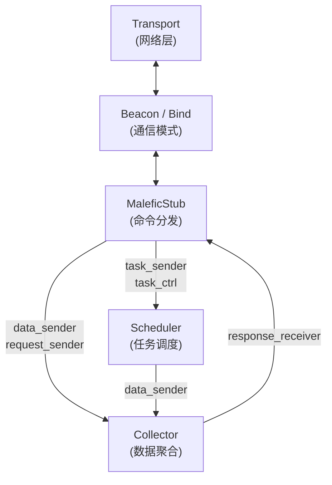
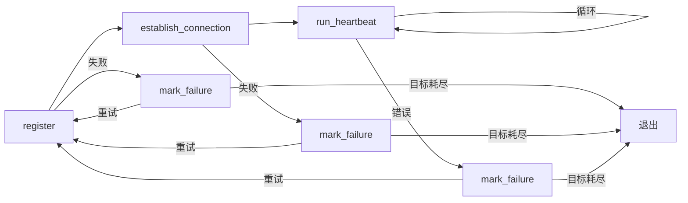
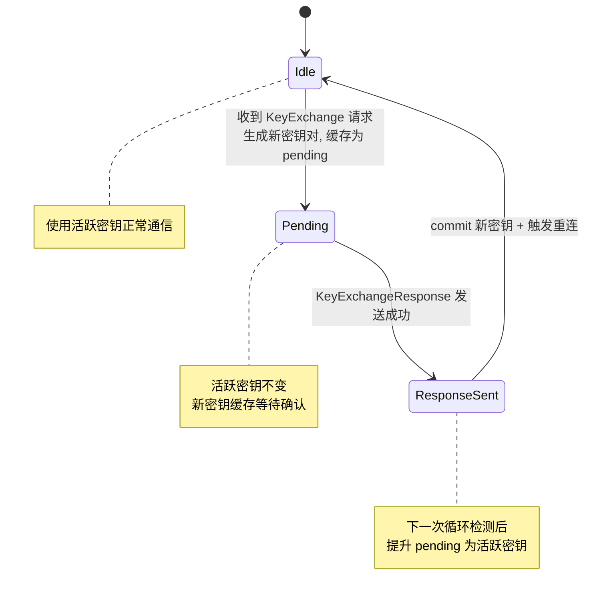
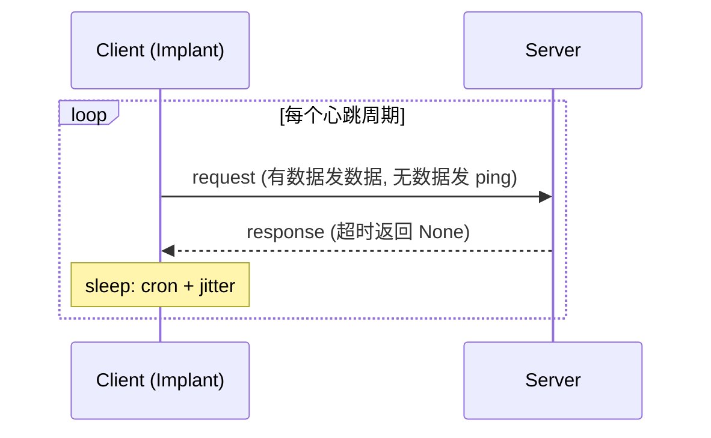
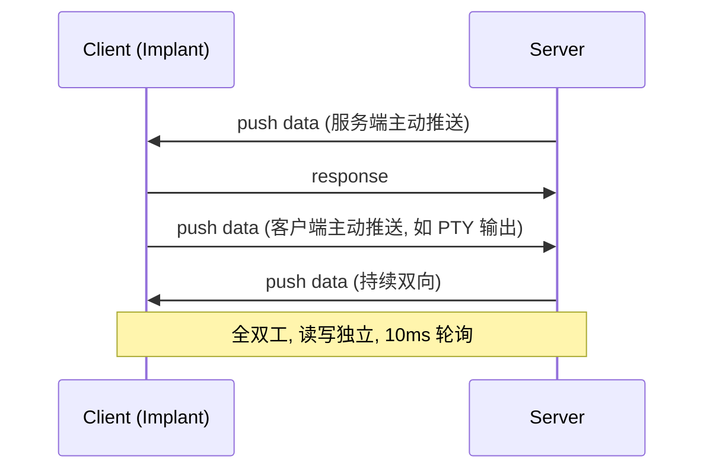
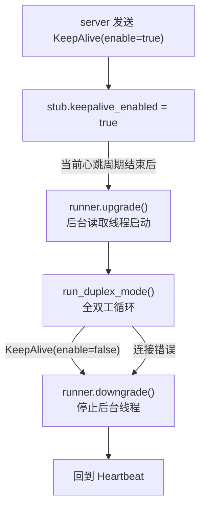
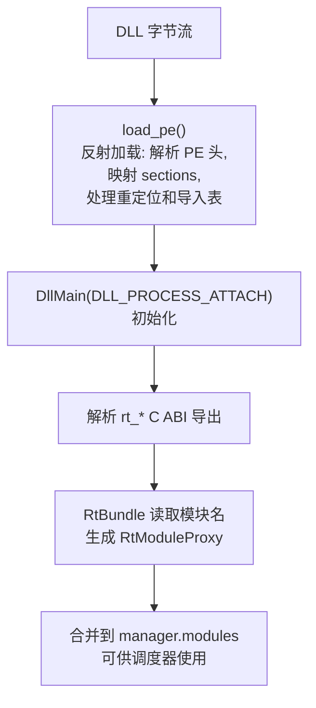
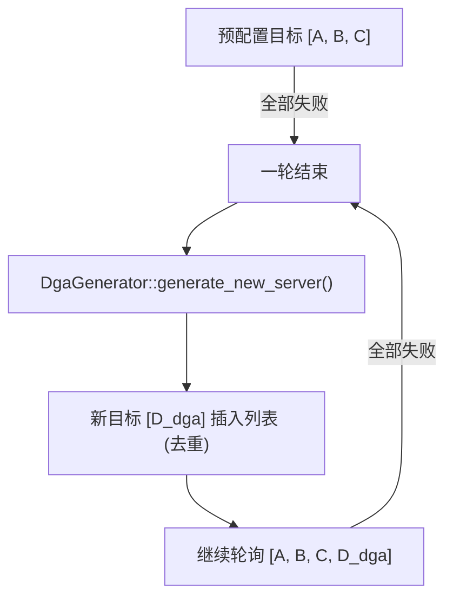
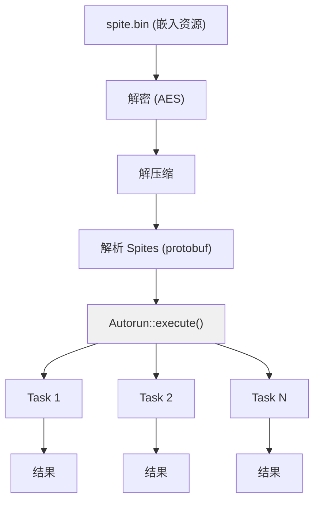

# Malefic

`malefic` 是 IoM implant 的主程序入口 crate, 负责组装所有子系统并驱动整个 implant 生命周期. 它同时提供 **可执行文件 (EXE)** 和 **动态库 (DLL/SO/dylib)** 两种产物形态, 支持 **Beacon** (主动回连) 和 **Bind** (被动监听) 两种工作模式.

## 文件结构

```
malefic/
├── build.rs              # 构建脚本 (YY-Thunks / RC 资源编译)
├── Cargo.toml            # 依赖与 Feature Flags
└── src/
    ├── main.rs           # EXE 入口
    ├── lib.rs            # DLL/SO 入口 (cdylib + rlib)
    ├── malefic.rs        # 核心编排: 运行时选择、组件组装、模式分发
    ├── beacon.rs         # Beacon 模式实现 (主动回连 + 心跳)
    ├── bind.rs           # Bind 模式实现 (被动监听)
    ├── stub.rs           # MaleficStub: 命令分发、内部模块处理、交互逻辑
    ├── meta.rs           # MetaConfig: 会话元数据、心跳调度、密钥管理
    ├── sys.rs            # 注册时的系统信息采集
    └── getrandom_compat.rs  # Linux glibc < 2.25 兼容层
```

---

## 入口机制

### EXE 入口 (`main.rs`)

标准可执行文件入口, 启动流程:

1. **反沙箱检测** (可选, `anti_sandbox` feature): 调用 `malefic-evader` 的 8 类环境评分 + 交互门控, 检测到沙箱或无人机交互则中止
2. **Autorun** (可选, `malefic-autorun` feature): 执行自动运行任务
3. **启动 Malefic** : 调用 `Malefic::run()` 进入主循环

```rust
// 发布构建时隐藏 Windows 控制台窗口
#![cfg_attr(not(debug_assertions), windows_subsystem = "windows")]

fn main() {
    block_on(async {
        // 1. 反沙箱 (可选)
        // 2. Autorun (可选)
        // 3. Malefic::run()
        Malefic::run(malefic_proto::get_sid()).await;
    });
}
```

### DLL/SO 入口 (`lib.rs`)

动态库入口, 提供多种加载方式以适配不同投递场景:

| 导出符号 | 平台 | 调用方式 | 行为 |
|---------|------|---------|------|
| `main()` | 全平台 | `extern "C"`, `#[no_mangle]` | **阻塞** 调用, 直到 `Malefic::run` 结束 |
| `Run()` | Windows | `extern "system"`, rundll32 兼容 | **非阻塞** , 在新线程中运行 |
| `RunBlocking()` | Windows | `extern "system"` | **阻塞** , 保持调用者存活 |
| `DllMain()` | Windows | DLL_PROCESS_ATTACH 自动触发 | **非阻塞** , LoadLibrary 时自动启动 |
| `run()` | Linux/macOS | `extern "C"`, dlsym 调用 | **非阻塞** , 在新线程中运行 |
| `.init_array` / `__mod_init_func` | Linux/macOS | 构造函数, dlopen 自动触发 | **非阻塞** , 加载时自动启动 |

典型使用场景:

- **rundll32 加载** : `rundll32 malefic.dll,Run`
- **LoadLibrary 注入** : 进程注入后自动通过 `DllMain` 触发
- **dlopen 加载** : Linux/macOS 共享库加载时自动通过 `.init_array` 触发
- **dlsym 显式调用** : `dlsym(handle, "run")` 手动触发

---

## 核心编排 (`malefic.rs`)

`Malefic` 是整个 implant 的编排器, 负责:

1. **运行时选择** : 根据 feature 创建异步运行时
2. **组件初始化** : 创建 Collector、Scheduler 和通信通道
3. **模式分发** : 根据 feature 选择 Beacon 或 Bind 模式
4. **并发运行** : 使用 `try_join!` 并发驱动 Scheduler、Collector 和 Client

### 异步运行时

通过 feature 选择运行时后端:

| Feature | 运行时 | 说明 |
|---------|--------|------|
| `runtime_tokio` | Tokio | 默认, 多线程 (8 worker + 32 blocking) |
| `runtime_smol` | smol | 轻量级 |
| `runtime_asyncstd` | async-std | async-std 生态 |
| *(无 runtime feature)* | 无 | 直接在 `block_on` 中运行 |

### MaleficChannel

组件间通信的通道集合:

```rust
pub struct MaleficChannel {
    data_sender,              // Stub -> Collector: 推送响应数据
    request_sender,           // Stub -> Collector: 请求待发送数据
    response_receiver,        // Collector -> Stub: 接收聚合后的数据
    scheduler_task_sender,    // Stub -> Scheduler: 提交模块任务
    scheduler_task_ctrl,      // Stub -> Scheduler: 任务控制 (取消/查询)
}
```

### 组件协作流程



---

## Beacon 模式 (`beacon.rs`)

Beacon 是 **主动回连** 模式, implant 周期性地连接服务端交换数据.

### 生命周期



### 阶段说明

1. **注册 (register)**
   - 可选 Guardrail 环境检查
   - 连接当前目标服务器
   - 发送注册信息 (系统信息、模块列表、Timer 配置、安全密钥)
   - 使用 `ServerManager` 管理多目标故障转移

2. **建立连接 (establish_connection)**
   - 通过 `Client` 连接服务器
   - 使用 `build_connection` 构建加密通道 (Cryptor + 可选 age 加密)

3. **心跳循环 (run_heartbeat)**
   - 准备请求数据 (有数据发送数据, 无数据发送 ping)
   - 发送请求、接收响应
   - 处理密钥交换重连
   - 检测 KeepAlive 升级 (Heartbeat -> Duplex)
   - 等待心跳间隔 (支持 sleep 混淆)

### 服务器故障转移

`ServerManager` 管理多个服务器配置, 当连接失败时:

- `mark_failure()`: 标记当前服务器失败, 自动切换到下一个
- 所有服务器都失败时返回 `false`, Beacon 退出
- `mark_success()`: 标记连接成功, 重置失败计数

### Sleep 混淆 (Windows)

启用 `sleep_obf` feature 时, 心跳等待期间使用 `malefic-os-win` 的混淆 sleep:

- 基于 Timer 的 sleep 混淆
- 支持 RWX 内存和堆内存的保护模式切换

---

## Bind 模式 (`bind.rs`)

Bind 是 **被动监听** 模式, implant 监听端口等待服务端连接.

### 生命周期

```
bind(addr) ──> accept ──> init ──> run_heartbeat ──> [循环]
                 │          │
                 │ 失败      │ 失败
                 ▼          ▼
              continue    continue (等待下一个连接)
```

### 与 Beacon 的区别

| 特性 | Beacon | Bind |
|------|--------|------|
| 连接方向 | implant -> server | server -> implant |
| 初始化 | implant 主动注册 | 接收 init 请求后返回注册信息 |
| 心跳控制 | implant 控制间隔 | server 控制间隔 |
| 服务器管理 | `ServerManager` 多目标 | 单地址监听 |
| instance_id | 由 `get_sid()` 生成 | 固定为 `[0; 4]`, 由 init 设置 |

### 初始化流程

Bind 的初始化与 Beacon 不同, 采用被动方式:

1. 接收客户端的 init 请求
2. 通过 `stub.handler()` 处理 init 数据 (设置 session ID 等)
3. 准备注册响应数据
4. 发送响应, 完成握手
5. 创建 Heartbeat 模式的 `ConnectionRunner`

---

## MaleficStub (`stub.rs`)

`MaleficStub` 是 implant 的核心命令分发器, 处理所有内部模块和外部模块的调度.

### 内部模块 (InternalModule) 处理

以下命令在 Stub 内直接处理, 不经过 Scheduler:

| 模块 | 功能 |
|------|------|
| `Ping` | 心跳回应 |
| `Init` | 设置 session ID, 返回注册信息 |
| `Sleep` | 更新心跳调度 (cron 表达式 + jitter) |
| `Suicide` | 延迟 10 秒后退出进程 |
| `Switch` | 更新目标 URL 列表 |
| `Clear` | 清除所有动态加载的模块 |
| `RefreshModule` | 重新加载模块列表 |
| `ListModule` | 列出当前模块 |
| `LoadModule` | 动态加载模块 (`hot_load` feature) |
| `LoadAddon` / `ListAddon` / `ExecuteAddon` / `RefreshAddon` | Addon 管理 (`addon` feature) |
| `CancelTask` / `QueryTask` / `ListTask` | 任务管理 |
| `KeyExchange` | 密钥交换 (`secure` feature) |
| `KeepAlive` | 启用/禁用 Duplex 模式 |

### 外部模块分发

未匹配 InternalModule 的命令通过 `scheduler_task_sender` 提交给 Scheduler:

```rust
// (是否异步, task_id, 模块实例, 请求体)
scheduler_task_sender.send((req.async, req.task_id, module.new_instance(), body))
```

### Heartbeat / Duplex 双模式

Stub 支持两种通信模式, 可在运行时动态切换:

**Heartbeat 模式** (默认):

- 请求-响应式, 每个心跳周期一次交互
- Beacon: 主动发送请求 -> 接收响应
- Bind: 被动接收请求 -> 发送响应
- 心跳间隔由 Cron 表达式 + Jitter 控制

**Duplex 模式** (KeepAlive 触发):

- 全双工, 持续双向通信
- 非阻塞接收 + 主动推送
- 适用于实时交互场景 (如 PTY)
- 退出 Duplex 后自动降级回 Heartbeat

切换流程:
```
server 发送 KeepAlive(enable=true)
    │
    ▼
Heartbeat ──upgrade()──> Duplex ──downgrade()──> Heartbeat
                           │
                    keepalive_enabled = false
                    或连接错误时退出
```

### 数据准备

- `prepare_spites()`: 从 Collector 获取待发送数据
- `prepare_request()`: 获取数据, 无数据时自动生成 ping
- `create_ping()`: 生成带时间戳 nonce 的 ping 消息

---

## MetaConfig (`meta.rs`)

`MetaConfig` 管理 implant 的会话元数据:

### 核心字段

| 字段 | 说明 |
|------|------|
| `uuid` | 4 字节会话 ID |
| `scheduler` | Cron 调度器, 控制心跳间隔 |
| `urls` | 目标服务器 URL 列表 |
| `private_key` | implant 私钥, 用于解密服务端数据 (`secure` feature) |
| `server_public_key` | 服务端公钥, 用于加密发送数据 (`secure` feature) |

### 心跳调度

心跳间隔通过 **Cron 表达式 + Jitter** 控制:

- `CRON`: 编译时配置的 cron 表达式 (如 `*/5 * * * * * *` 表示每 5 秒)
- `JITTER`: 抖动系数, 在基础间隔上引入随机偏移
- `new_heartbeat()`: 每次调用返回下一次心跳的等待时间 (毫秒)
- `update_schedule()`: 运行时通过 `Sleep` 命令动态更新

### 密钥交换 (`secure` feature)

基于 age 加密的密钥轮换机制, 采用三阶段状态机确保安全:

```
Idle ──> Pending ──> ResponseSent ──> Idle (keys committed)
```

1. **Pending** : 收到 KeyExchange 请求, 生成新密钥对, 缓存为 pending
2. **ResponseSent** : KeyExchange 响应已发送, 但旧密钥仍在使用
3. **Committed** : 确认响应已送达后, 切换到新密钥并触发重连

这种设计确保密钥切换的原子性: 如果响应发送失败, 旧密钥仍然有效.

---

## 连接构建

`build_connection()` 统一构建加密通道:

```rust
ConnectionBuilder::new(transport)
    .with_cryptor(get_cryptor())         // 对称加密 (AES/ChaCha20/XOR)
    .with_session_id(session_id)         // 4 字节会话标识
    .with_encrypt_key(encrypt_key)       // age 公钥加密 (可选)
    .with_decrypt_key(decrypt_key)       // age 私钥解密 (可选)
    .build()
```

加密分两层:

- **对称加密** (`Cryptor`): 使用编译时配置的 KEY, IV 为 KEY 的反转
- **非对称加密** (`secure` feature): 基于 age 的公钥加密, 支持运行时密钥轮换

---

## 构建系统 (`build.rs`)

### YY-Thunks 兼容

通过环境变量 `YY_THUNKS_TARGET_OS` 启用对旧版 Windows 的兼容:

- 链接 YY-Thunks 提供的兼容层 obj 文件
- 支持 x86 和 x86_64 架构
- 使 implant 能在旧版本 Windows 上运行

### RC 资源编译

编译 Windows 资源文件 (`resources/malefic.rc`):

- 嵌入版本信息、图标等 PE 资源
- 使用 `embed-resource` crate 在构建时编译

### getrandom 兼容 (`getrandom_compat.rs`)

针对 Linux glibc < 2.25 的兼容层:

- 当使用 zig 链接器交叉编译到旧版 glibc 时, `getrandom()` 弱符号无法解析
- 此模块提供强符号定义, 直接转发到 `syscall(SYS_getrandom, ...)`
- 仅在 `target_os = "linux"` + `target_env = "gnu"` 时编译

---

## Feature Flags

当前 feature 分为两层：`malefic` 入口 crate 控制工作模式、传输、加密和功能开关；`malefic-features` 统一传播 build type、edition 和 async runtime。`malefic-mutant generate` 会按 `implant.yaml` 和命令行参数重写对应 Cargo.toml 的 default features，因此不要把仓库检出时的 default features 当作最终 payload 配置。

`malefic/Cargo.toml` 仓库默认 feature 当前为 `addon`, `beacon`, `crypto_aes`, `hot_load`, `register_info`, `transport_tcp`, `malefic-autorun`。`malefic-features/Cargo.toml` 仓库默认 feature 当前为 `source`, `professional`, `runtime_tokio`；使用 `malefic-mutant generate -E community -s true` 时会按命令参数改写为对应 edition/build type/runtime。

### 工作模式

| Feature | 默认 | 说明 |
|---------|:----:|------|
| `beacon` | **是** | Beacon 模式, implant 主动回连服务端, 周期性心跳交换数据. 支持多目标故障转移、DGA 域名轮换. 详见 [Beacon 模式](#beacon-模式-beaconrs) |
| `bind` | 否 | Bind 模式, implant 监听端口等待服务端连接. 与 beacon 互斥. 详见 [Bind 模式](#bind-模式-bindrs) |

### 异步运行时

运行时决定了 implant 的异步任务调度方式, 三者互斥:

| Feature | 默认 | 说明 |
|---------|:----:|------|
| `runtime_tokio` | **是** | Tokio 多线程运行时 (8 worker + 32 blocking 线程). 功能最完整, 支持 Duplex 模式的 `tokio::time` 特性. 生态最成熟 |
| `runtime_smol` | 否 | smol 轻量级运行时. 体积更小, 适合资源受限环境 |
| `runtime_asyncstd` | 否 | async-std 运行时. 提供与标准库对称的异步 API |

!!! note "运行时传播"
    运行时 feature 由 `malefic-features` 传播到 `malefic-common` 等公共 runtime 入口。`implants.runtime` 决定 Mutant 写入 `runtime_tokio`、`runtime_smol` 或 `runtime_asyncstd`。

### 安全与规避

| Feature | 默认 | 说明 |
|---------|:----:|------|
| `secure` | 否 | 启用基于 age 的非对称加密. 注册时上报公钥, 支持运行时密钥轮换, 重连后使用新密钥对. 详见 [密钥交换与 age 加密](#密钥交换与-age-加密) |
| `anti_sandbox` | 否 | 启动时执行反沙箱检测 (仅 Windows). 8 类环境评分检测 (硬件/系统/时间/身份/活动/工件/调试/Hook) + 交互门控 (鼠标移动、键盘输入、窗口切换). 所有 API 使用 M 系列动态绑定. 详见 [反沙箱检测](#反沙箱检测-anti_sandbox) |
| `anti_vm` | 否 | 反虚拟机检测 (仅 Windows). 通过 CPUID 指令检测 Hypervisor 标志, 识别 VirtualBox/VMware/Hyper-V/QEMU/Xen 等虚拟化框架. 详见 [反虚拟机检测](#反虚拟机检测-anti_vm) |
| `guardrail` | 否 | 环境检测护栏. 启动时验证目标环境 (IP、用户名、主机名、域名) 是否在白名单内, 不匹配则立即退出. 详见 [Guardrail 环境护栏](#guardrail-环境护栏) |

### 传输协议

| Feature | 默认 | 说明 |
|---------|:----:|------|
| `transport_tcp` | **是** | TCP 传输. 最基础的传输协议 |
| `transport_http` | 否 | HTTP/HTTPS 传输. 可配置自定义 Header, 更容易穿透防火墙 |
| `transport_rem` | 否 | REM 协议传输. 基于 librem 的自定义加密传输协议 |
| `tls` | 否 | TLS 加密. 在 TCP 之上启用 TLS 加密层, 可配置 SNI |
| `mtls` | 否 | 双向 TLS (mutual TLS). 客户端和服务端互相验证证书 |
| `proxy` | 否 | 代理支持. 支持通过 HTTP/SOCKS 代理连接服务端 |
| `dga` | 否 | 域名生成算法 (DGA). 基于时间窗口和密钥的域名自动生成与轮换, 与 ServerManager 联动. 详见 [DGA 域名生成算法](#dga-域名生成算法) |

### 对称加密

传输层数据的对称加密算法, 传播到 `malefic-proto`:

| Feature | 默认 | 说明 |
|---------|:----:|------|
| `crypto_aes` | **是** | AES 加密. 使用编译时配置的 KEY, IV 为 KEY 的逆序字节 |
| `crypto_chacha20` | 否 | ChaCha20 加密. 在无硬件 AES 指令的平台上性能更好 |
| `crypto_xor` | 否 | XOR 加密. 最轻量, 适合体积敏感场景 |

### 功能扩展

| Feature | 默认 | 说明 |
|---------|:----:|------|
| `addon` | **是** | Addon 管理. 将二进制数据 (shellcode、PE 等) 压缩加密后存储在内存中, 减少重复传输. 详见 [Addon 内存加密存储](#addon-内存加密存储) |
| `hot_load` | **是** | 模块热加载. 运行时通过反射加载 DLL, 解析 `rt_*` C ABI 导出并动态扩展模块. 详见 [模块热加载](#模块热加载-hot-load) |
| `register_info` | **是** | 注册时采集完整系统信息 (OS、进程、用户、路径等). 关闭后仅上报编译期常量 (OS 名称和架构), 减少信息暴露 |
| `malefic-3rd` | 否 | 第三方模块支持. 启用 `malefic-manager` 的 3rd 模块注册能力, 允许加载独立编译的扩展模块 |

### 构建类型与 Edition

| Feature | 默认 | 说明 |
|---------|:----:|------|
| `source` | **是** | 由 `malefic-features` 传播的源码编译模式 |
| `prebuild` | 否 | 由 `malefic-features` 传播的预编译产物模式 |
| `community` | 否 | 社区版，由 `malefic-mutant generate -E community` 写入 |
| `professional` | **是** | 仓库默认 edition；`generate -E professional` 时显式写入 |

### 随机数后端

| Feature | 默认 | 说明 |
|---------|:----:|------|
| `random_getrandom` | 否 | 使用系统 `getrandom` 作为随机数后端. 默认使用 `nanorand` (纯 Rust, 无系统调用). 在需要密码学安全随机数的场景下启用 |

---

## 关键技术详解

### Guardrail 环境护栏

**Feature** : `guardrail` | **Crate** : `malefic-guardrail` | **平台** : 全平台

Guardrail 是运行前的环境验证机制, 确保 implant 只在授权目标上执行, 防止在分析环境或非目标机器上运行.

**检查维度:**

| 维度 | 配置项 | 说明 |
|------|--------|------|
| IP 地址 | `ips` | 目标机器的网络地址 |
| 用户名 | `usernames` | 目标用户账号 |
| 主机名 | `hostnames` | 目标机器名称 |
| 域名 | `domains` | 目标所在域 |

**匹配规则:**

- 支持通配符 `*` (匹配任意值)、字面量精确匹配和正则表达式
- 每个匹配的维度计 1 分 (共 4 个维度)
- `require_all=true`: 要求全部 4 个维度匹配
- `require_all=false`: 至少 1 个维度匹配即可

**触发时机:** Beacon 的 `register()` 和 Bind 的 `run()` 入口处, 检查失败直接 `exit(1)`.

---

### 反沙箱检测 (`anti_sandbox`)

**Feature** : `anti_sandbox` | **Crate** : `malefic-evader` | **平台** : Windows

在 `run_evaders()` 最早阶段执行, 先于任何网络通信. 采用 **8 类环境评分检测 + 交互门控** 双重策略, 核心针对 Chrome Safe Browsing 云端沙箱 (无真人交互、2-5 分钟执行时限、标准 VM 镜像). 所有 API 使用 M 系列动态绑定 (通过 malefic-win-kit).

**8 类检测项:**

| 检测类别 | 主要检测项 | 关键 API |
|---------|-----------|---------|
| 硬件异常 | CPU < 2 核, RAM < 4GB, 磁盘 < 60GB, 屏幕 ≤ 800x600, 无 USB 历史, VM NIC | MGlobalMemoryStatusEx, MGetDiskFreeSpaceExW, MGetSystemMetrics |
| 系统信息 | 25+ 可疑进程名, 14+ VM 注册表键, 进程数 < 20 | get_processes, RegistryKey |
| 时间异常 | Sleep 加速, Instant/SystemTime 不一致, RDTSC 异常, KUSD 时间偏差 | KUSD 0x7FFE0000, \_rdtsc |
| 身份异常 | 沙箱用户名/主机名, SystemProductName/Manufacturer/BIOS 注册表 | 环境变量, RegistryKey |
| 活动异常 | 开机 < 10min, 无输入 > 30s, 鼠标静止, 前台窗口不变, 桌面/Recent/Temp 文件少, 无浏览器 | MGetTickCount64, MGetLastInputInfo, MGetCursorPos, MGetForegroundWindow |
| 沙箱工件 | 13+ 沙箱 DLL, 沙箱注册表/文件/驱动 | MGetModuleHandleA |
| 调试检测 | PEB.BeingDebugged, NtGlobalFlag, ProcessDebugPort/Flags/ObjectHandle, 硬件断点, 堆标志, INT3 扫描 | inline asm (PEB), MNtQueryInformationProcess, MGetThreadContext |
| Hook 检测 | ntdll syscall stub 完整性, Wine 导出, SMBIOS VM 字符串, 电源状态, DLL 路径验证 | MGetProcAddress, MGetSystemFirmwareTable, MGetSystemPowerStatus |

**置信度阈值:** 累计 60+ 分判定为沙箱, 直接返回 false (中止执行).

**交互门控 (核心反 Chrome Safe Browsing):**

评分通过后进入交互门控 `wait_for_human()`, 使用 KUSD 计时 (免疫 Sleep hook/加速), 每 500ms 轮询:

| 条件 | 说明 |
|------|------|
| 鼠标移动 ≥ 3 个不同区域 | MGetCursorPos, 屏幕按 100px 网格划分 |
| 最近 10 秒内有键鼠输入 | MGetLastInputInfo |
| 前台窗口变化 ≥ 1 次 | MGetForegroundWindow |
| 系统开机 ≥ 5 分钟 | MGetTickCount64 |

全部满足返回 true, 超时 (默认 120 秒) 返回 false.

**入口函数:** `is_safe_to_proceed(timeout_secs)` = 环境评分 + 交互门控.

---

### 反虚拟机检测 (`anti_vm`)

**Feature** : `anti_vm` | **Crate** : `malefic-evader` | **平台** : Windows

通过底层指令检测虚拟化环境:

**主要检测 - CPUID Hypervisor 标志:**

- 执行 CPUID leaf 1, 检查 ECX 的 bit 31 (Hypervisor Present)
- 如果设置, 进一步执行 CPUID leaf 0x40000000 获取 Hypervisor ID 字符串

**识别的虚拟化框架:**

| Hypervisor ID | 框架 |
|--------------|------|
| `VBoxVBoxVBox` | VirtualBox |
| `VMwareVMware` | VMware |
| `Microsoft Hv` | Hyper-V |
| `TCGTCGTCGTCG` | QEMU/TCG |
| `XenVMMXenVMM` | Xen |

**备用检测 - CPU 时序分析:**

测量 CPUID 指令的执行周期数, 在虚拟机中 CPUID 会触发 VM Exit, 执行时间显著增加 (> 1000 cycles 判定为 VM).

---

### ServerManager 故障转移

**Crate** : `malefic-transport` | **文件** : `server_manager.rs`

ServerManager 管理多个目标服务器, 提供故障转移和 DGA 联动能力.

**故障转移机制:**

```
Target[0] ──失败N次──> Target[1] ──失败N次──> Target[2] ──...──> Target[0] (新一轮)
    │                      │                      │
  mark_success()        mark_success()         mark_success()
  (重置计数)            (重置计数)              (重置计数)
```

- **轮询** : 维护当前目标索引, 按顺序遍历
- **每目标失败计数** : 连续失败次数达到 `RETRY` 上限后切换到下一个目标
- **轮次追踪** : 完整遍历所有目标计为一轮, 达到 `MAX_CYCLES` 后终止 (-1 为无限轮次)
- **DGA 联动** : 启用 `dga` feature 时, 每完成一轮循环, 调用 `DgaGenerator::generate_new_server()` 生成新目标插入列表 (自动去重)

---

### Cron + Jitter 心跳调度

**Crate** : `malefic-cron` | **结构** : `Cronner`

心跳间隔采用 Cron 表达式 + 抖动的方式, 避免固定间隔的流量特征.

**调度算法:**

```
base_ms = next_cron_time - current_time        // 基础间隔
jitter_range = base_ms × jitter_percentage      // 抖动范围
random_offset = random(-jitter_range, +jitter_range)  // 随机偏移
final_interval = max(base_ms + random_offset, 1000ms) // 最终间隔, 最小 1 秒
```

**示例:**

| Cron 表达式 | Jitter | 基础间隔 | 实际范围 |
|------------|--------|---------|---------|
| `*/5 * * * * * *` | 0.0 | 5s | 固定 5s |
| `*/5 * * * * * *` | 0.2 | 5s | 4s - 6s |
| `0/30 * * * * *` | 0.1 | 30s | 27s - 33s |
| `0 */5 * * * *` | 0.3 | 5min | 3.5min - 6.5min |

**运行时更新:** 服务端通过 `Sleep` 命令下发新的 cron 表达式和 jitter 值, `MetaConfig::update_schedule()` 实时生效.

**默认回退:** 如果编译时配置的 cron 表达式解析失败, 回退到 `*/5 * * * * * *` (每 5 秒).

---

### 密钥交换与 age 加密

**Feature** : `secure` | **Crate** : `malefic-proto` | **算法** : age (X25519)

启用 `secure` feature 后, 传输层在对称加密之上叠加基于 age 的非对称加密, 支持运行时密钥轮换.

**加密层次:**

```
原始数据 ──> 对称加密 (AES/ChaCha20/XOR) ──> age 非对称加密 ──> 传输
```

- **对称加密** : 使用编译时 KEY + 逆序 IV, 加密所有传输数据
- **非对称加密** : implant 用服务端公钥加密发送数据, 服务端用 implant 公钥加密响应

**密钥轮换状态机:**

密钥交换采用三阶段状态机, 确保切换的原子性:



1. **Idle** : 使用当前活跃密钥正常通信
2. **Pending** : 收到服务端的 KeyExchange 请求后:
   - 生成新的 age 密钥对 (X25519)
   - 新密钥对缓存为 `pending_private_key` / `pending_server_public_key`
   - 构造 KeyExchangeResponse (包含新公钥), 放入发送队列
   - **活跃密钥不变** , 确保当前通信不受影响
3. **ResponseSent** : 响应发送成功后标记
4. **Commit** : 下一次循环检测到 ResponseSent 状态, 将 pending 密钥提升为活跃密钥, 并触发重连 (使用新密钥建立新连接)

**安全保证:** 如果 KeyExchangeResponse 发送失败, 状态停留在 Pending, 旧密钥仍然有效, 不会导致通信中断.

---

### Heartbeat / Duplex 双模式

**Crate** : `malefic-transport` | **结构** : `ConnectionRunner`

implant 支持两种通信模式, 由服务端通过 `KeepAlive` 命令在运行时动态切换.

**Heartbeat 模式** (默认):



- 严格的请求-响应模式, 每个心跳周期一次交互
- `receive()` 带超时阻塞等待
- 适合低频通信场景

**Duplex 模式** (KeepAlive 触发):



- 全双工通信, 读写独立
- `upgrade()`: 启动后台读取任务, 将 `reader.receive()` 持续写入 `mpsc` channel
- `try_receive()`: 非阻塞从 channel 读取, 无数据立即返回
- 10ms 轮询间隔避免忙等
- 适合实时交互场景 (PTY 终端、实时命令执行流)

**模式切换:**



**Duplex 循环内部逻辑:**

1. `try_receive()` 非阻塞检查是否有服务端请求
2. 如果有: handler 处理 -> prepare_spites 响应
3. 刷新 Stub 内积累的推送数据 (如 PTY 输出)
4. 如果无数据且超过心跳间隔: 发送 ping 保活
5. 检查密钥交换重连
6. 检查 keepalive_enabled 是否被关闭

---

### Sleep 混淆

**Feature** : `sleep_obf` | **Crate** : `malefic-os-win` | **平台** : Windows

在 Beacon 心跳等待期间, 将 implant 的内存加密并修改内存保护属性, 规避内存扫描.

**三种策略:**

| 策略 | API | 原理 |
|------|-----|------|
| **Timer** | `TpSetTimer` | 通过线程池定时器调度 7 步 CONTEXT 操作链 |
| **Wait** | `TpSetWait` / `TpAllocWait` | 通过等待对象调度操作链 |
| **Foliage** | `NtQueueApcThread` | 通过 APC (异步过程调用) 在挂起线程上排队执行 |

**7 步操作链 (以 Timer 为例):**

```
步骤 0: NtWaitForSingleObject     ──>  等待信号
步骤 1: VirtualProtect             ──>  PAGE_READWRITE (可写)
步骤 2: SystemFunction040          ──>  加密内存 (RTL encryption)
步骤 3: WaitForSingleObject        ──>  实际 sleep (等待超时)
步骤 4: SystemFunction041          ──>  解密内存
步骤 5: VirtualProtect             ──>  恢复原始保护属性
步骤 6: NtSetEvent                 ──>  发送完成信号
```

**内存保护模式** (`ObfMode`):

| 模式 | 说明 |
|------|------|
| `Rwx` | 恢复时设置为 `PAGE_EXECUTE_READWRITE` |
| `Heap` | 对整个私有堆进行 XOR 加密 (RDTSC 8 字节密钥), 通过 `RtlWalkHeap` 遍历所有已分配块 |
| `Rwx \| Heap` | 同时启用两者 |

**效果:** sleep 期间, implant 的代码段变为不可执行的加密数据, 堆上的字符串/配置也被加密, 内存扫描工具无法识别特征.

---

### 模块热加载 (Hot Load)

**Feature** : `hot_load` | **Crate** : `malefic-loader` + `malefic-manager` | **平台** : Windows

运行时将编译好的模块 DLL 反射加载到内存中, 无需写入磁盘.

**加载流程:**



**关键函数:**

- `malefic_loader::hot_modules::load_module(bins, bundle)`: PE 反射加载 + 入口点执行
- `malefic_runtime::host::RtVTable::resolve(...)`: 解析 `rt_abi_version`、`rt_module_count`、`rt_module_run` 等导出
- `malefic_runtime::host::RtBundle::try_new(...)`: 读取模块列表并生成 runtime proxy
- `MaleficManager::load_module(spite)`: 接收服务端请求, 调用加载流程

**与编译时模块的区别:**

- 编译时模块静态链接, 不可卸载
- 热加载模块动态注册, 可通过 `RefreshModule` 卸载
- 同名模块: 热加载模块覆盖编译时模块 (原模块仍在内存中)

---

### Addon 内存加密存储

**Feature** : `addon` | **Crate** : `malefic-manager` | **文件** : `addons.rs`

Addon 机制将二进制数据 (shellcode、PE、脚本等) 压缩加密后存储在内存中, 减少重复传输.

**存储流程:**

```
原始数据 ──> 压缩 ──> AES 加密 (KEY + 逆序 IV) ──> 内存存储 (HashMap)
```

**读取流程:**

```
内存存储 ──> AES 解密 ──> 解压缩 ──> 原始数据
```

**Addon 结构:**

```rust
MaleficAddon {
    name,               // 名称标识
    r#type,             // 类型 (shellcode/pe/script 等)
    depend,             // 依赖的执行模块名
    encrypted_content,  // 加密后的二进制内容
}
```

**执行流程:**

1. 服务端发送 `ExecuteAddon` 命令 (指定 addon 名称)
2. 从内存中取出并解密 addon 内容
3. 根据 addon 的 `depend` 字段查找对应的执行模块
4. 构造 `ExecuteBinary` body, 提交给 Scheduler 调度执行

**管理命令:**

| 命令 | 功能 |
|------|------|
| `LoadAddon` | 上传并加密存储 addon |
| `ListAddon` | 列出已存储的 addon |
| `ExecuteAddon` | 解密并执行指定 addon |
| `RefreshAddon` | 清除所有 addon |

---

### DGA 域名生成算法

**Feature** : `dga` | **Crate** : `malefic-dga`

DGA 基于时间窗口和密钥生成域名, 使 implant 在预配置服务器全部失效后仍能自动发现新的 C2 地址.

**生成算法:**

```
seed = f(year, month, day, hour_segment, DGA_KEY)
hash = SHA-256(seed)
prefix = encode(hash[0..8])   // 8 字节 -> 8 字符小写域名前缀
domain = prefix + "." + suffix // 拼接配置的域名后缀
```

**时间窗口:**

- 以 `DGA_INTERVAL_HOURS` (可配置) 为单位划分时间段
- 同一时间段内生成相同的域名, 段切换时域名轮换
- 服务端使用相同的密钥和算法即可预测 implant 将连接的域名

**与 ServerManager 联动:**



**自动适配:** 生成的 ServerConfig 会自动更新 TLS SNI 和 HTTP Host 头以匹配生成的域名.

---

### Autorun 自动运行

**Feature** : `malefic-autorun` | **Crate** : `malefic-autorun`

Autorun 在 implant 启动时自动执行预嵌入的任务列表, 用于初始化操作 (如权限维持、环境准备等).

**执行流程:**



- 并发执行, Semaphore 控制 (默认 pool size = 6)

**并发控制:**

- 使用 `Semaphore` 限制并发数 (默认 pool size = 6)
- 每个任务通过当前选择的 async runtime spawn 为独立 task
- 任务失败不影响其他任务

**触发位置:** `main.rs` 中, 在反沙箱检测之后、`Malefic::run()` 之前执行.

---

## 注册流程

implant 注册时发送以下信息:

```rust
Register {
    name,           // 编译时配置的名称
    proxy,          // 代理 URL
    module,         // 当前已加载的模块列表 (含 InternalModule)
    addons,         // 已加载的 addon 列表 (addon feature)
    sysinfo,        // 系统信息 (register_info feature)
    timer,          // 心跳调度配置 (cron 表达式 + jitter)
    secure,         // 安全配置 (公钥 + 加密类型, secure feature)
}
```

系统信息 (`sys.rs`) 包含:

- **OS 信息** : 名称、版本、Release、架构、用户名、主机名、语言、CLR 版本
- **进程信息** : 名称、PID、PPID、架构、所有者、路径、参数
- **运行信息** : 可执行文件路径、工作目录、是否具有特权

未启用 `register_info` 时仅返回编译期常量 (OS 名称和架构), 减少上线时的信息暴露.

---

## 相关文档

- [编译与配置手册](/malefic/getting-started/) - 完整的编译流程与 Mutant 工具
- [模块文档](/malefic/develop/modules/) - 内置模块与开发指南
- [Pulse 文档](/malefic/getting-started/components/pulse/) - 轻量级 shellcode stager
- [Prelude 文档](/malefic/getting-started/components/prelude/) - 多段上线中间阶段
- 混淆技术 (Pro) - 编译期混淆
- 宏系统 (Pro) - 过程宏与编译期混淆
- Starship 文档 (Pro) - Shellcode 加载框架
- [Win-Kit 文档](/malefic/getting-started/components/win-kit/) - Windows 功能库
- [3rd 模块](/malefic/develop/3rd-party/) - 第三方模块扩展
- [FFI 接口](/malefic/develop/ffi/) - Win-Kit 多语言调用
