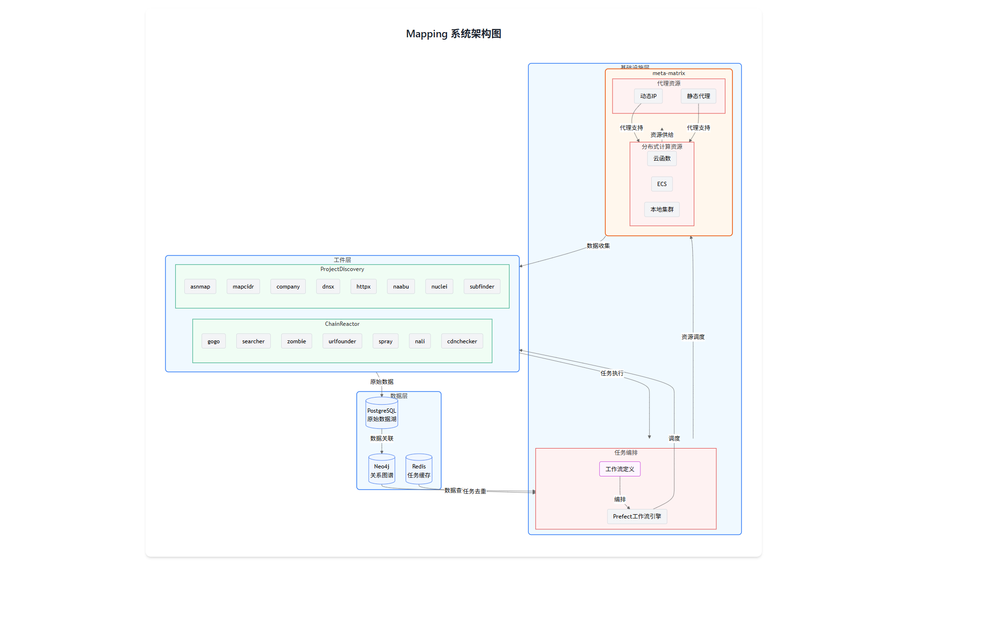

## 背景

在2024年ASM已经被广泛使用, 不论是各家乙方的ASM产品, 还是各家红队的自动化扫描器. 只要是之前在做扫描器的, 都试图在这个领域施展拳脚. 目前好用的ASM以商业化工具为主, 在开源世界并不存在真正意义上的ASM的(之后会解释这么说的原因)

### 开源世界

*ASM与资产发现工具存在一定的混淆, 这里提到的工具暂时不区分这两个概念*

* https://github.com/yogeshojha/rengine 有一个非常不错的UI, 能将许多知名工具联动起来, 用户体验不错, 但能力也仅限于工具串联
* https://github.com/Aabyss-Team/ARL  原仓库已删除, 这个是star较多的备份仓库. 不能分部署部署, 扫描用的工件也较老, 不能很好的适配现代的场景
* https://github.com/Autumn-27/ScopeSentry 非常优雅的UI, 但能力与ARL相似, 绝大多数能力来自工具链的串联. 并没有提供优先级排序的算法, 也没有提供数据之间的关联, 清晰, 标记等.

开源世界的ASM基本上都没有超越 **工具的串联运行** 这个思路 (实际上部分商业化产品也没好到哪里去).


## 架构

mapping最早开始于2022年, 那个时候ASM的概念刚刚诞生, projectdiscovery刚刚形成社区,  更多的还是各种自动化扫描器。而中间因为各种原因进行了多次重构和推迟，在2024年中旬完成了v0.0.1的demo， 但受限于精力，只完成了基础架构，还算不上一个可以实战的工具。 



架构分为三层

 - 工件层
- 基础设施层
- 数据层

### 工件层

mapping的v0.0.1版本主要关注外部攻击面, 第一批引入的工件有:

chainreactor

* gogo, 端口扫描, 指纹识别 
* searcher, 空间搜索引擎交叉爬虫
* zombie, 凭证爆破
* urlfounder, 被动url收集, 
* spray, http fuzzer
* nali, 解析ip归属
* company, 工商信息爬虫
* cdnchecker, 支持中国地区服务商，判断cdn, 云, 云waf

projectdiscovery:

* asnmap, 解析asn
* mapcidr, ip工具集合
* dnsx, dns信息收集
* httpx, http协议基本信息, 
* naabu, 端口预探测
* nuclei, 漏扫
* shuffledns, dns爆破
* subfinder, 子域名收集
* urlfinder, 被动url收集


这些工件基本覆盖绝大部分工作场景. ASM引擎本体不会与目标发生任何接触. 

### 基础设施层

基础设施层分为任务调度与分布式基础设施自动化部署两部分。 

工件层的所有工件都运行在分布式的基础设施上，可以被mapping自动化调度、创建、管理的基础设施包括。

- 云函数, (主要手段)，动态伸缩扩容，动态IP
- ECS, 作为云函数的补充， 绕过云函数的一些限制
- 本地+代理池

调度器基于prefect实现，通过workflow与task的抽象， 将多个工件编排成最小工作流单元。 

例如 ：

输入域名的工作流示例: 
domain workflow1
```
     -[subfinder]-> 
域名                  -> httpx+gogo -> nuclei
      -[searcher]->
```

domain workflow2
```
域名 -[icp]-> 公司信息 -company-> 域名(将结果执行domain workflow1)
```


每个workflow之间按照顺序执行， 不同workflow之间异步执行， 最大化扫描速度， 不会因为某个任务占用大量时间导致的阻塞.

中间每个工件都会有输入与输出，会保存并缓存所有的原始数据并异步进入数据层的处理中。 

### 数据层

数据层包括以下基础设施

- postgre ，作为数据湖，保留原始数据。 单个目标工件任务大概率不会超过10w，数据条目不会超过1000w。 postgre已经可以胜任， 如果要大规模部署可能还需要ELB或者更强的数据湖解决方案。
- neo4j， 图数据库， 数据关联，数据筛选， 数据溯源的核心， 所有的数据都会按照发现顺序在neo4j中关联。 
- redis， 数据缓存，防止同一个目标被不同工件发现导致的重复扫描。 

用户操作与数据展示:

- restful api， 用来添加、管理、查询任务。 但实际的任务调度会交给调度器自动分配
- repl cli ，交互式命令程序


## 误解

**误解1 如何自动化进行资产发现?**

最直观的理解就是把手动的繁琐操作自动做一遍, 那么在实现上就表现为把一堆手动经常用的工具编排成工作流(甚至更简单, 没有编排, 各跑一遍). 

这不怪产品经理, 不管是红队反馈给他们的需求又或是客户的需求都是这么描述的:

> "能不能帮红队会做的事情自动化实现, 并定期跑, 实时跑"

那么从ASM的角度出发, 应该怎么实现这个需求呢？

ASM能做到的, 应该是人工不愿意做的事情. 就比如在隐形资产收集上, 最常见的隐形资产是通过nginx反代的vhost/path. 

在ASM之前， 人工能做的是拿着一个字段去爆破一下path或者host, 很少会有人对每个web都这么做, 更少有人定制字典针对某个目标的所有web这么做.

ASM可以数据汇总分析的，可以根据目标的所有信息, 生成定制的字典, 对所有的web的path和host进行爆破.

**类似的场景还可以用在子域名, 弱口令, 供应链等等环节上.** 

对已有工具进行编排ASM最基本的能力, 不应该直接理解为ASM就是做这个的. 

**误解2 收集到的资产是攻击面么?**

把开源的优质工具都跑一遍, 或多或少总能收集到一堆信息, 可能是ip,url,domain...... 各种各样格式的. 

最常见的做法就是分类展示, 其中ip管ip一个几面, url管url一个界面. 然后告诉用户, 这里的数据都是攻击面, 确实没什么不对. 

但我很难想象, 这样的工具要如何去使用. 对着资产表除了瞪眼似乎也做不了更多的事? (~~某些入选Gather的ASM也在这么做, 建议找个接触过自攻防一线的当产品经理~~)

好在不是所有ASM都是这么实现的, 与ASM/VM(漏洞管理)伴生的概念叫做 VPT(漏洞优先级), 大体实现上就是根据CVSS, EPSS, CWE等各种漏洞的评估维度对漏洞进行管理, 决定是否需要修复与修复优先级. 
而对于攻击面来说, 发生漏洞之前, 并没有现成的各种参数去分类和排序攻击面. 那应该怎么做? 

这类问题, 大多数情况下, 就需要打标员对各种数据进行标记了. 事实也是如此, 如果要给各种各样的数据实现统一的关注优先级排序, 就需要非常多的前置知识. 例如这个攻击面是否有攻击者关注的信息(例如指纹, 供应链, 数据关联等).  

这些数据其实很难用传统的关系型数据库去描述, 我们在21年就意识到这一点, 在当时公开的蓝图中提到了neo4j 图数据库.  我们用图去分析资产间的关联, 并基于攻击点的关注点进行攻击面优先级排序. 

ASM是需要运营的, 特别是需要来自对抗一线的信息. 资产表不完全代表攻击面, 漏洞也不代表攻击面. ASM不是自动化漏扫, 自动化漏扫也不是ASM.

**误解3 如何使攻击面管理**

在最初始的需求中, 只是想自动化的模拟攻击者的思路, 进行自动化资产发现, 漏洞探测. 再是发现隐形资产, 数据分析并关联排序.  这都是ASM引擎需要实现的, 那ASM应该如何提供与用户的交互呢?

绝大多数ASM的产品形态上的交互逻辑非常简单.  提供了一个可配置的菜单描述任务输入, 然后等待任务执行完, 可以在资产表中查阅结果. 使用者是不能干涉引擎是如何进行的, 这可能和产品的目标用户有关, 商业化工具的使用者的想法是付费了就不想操心了.  但是对于攻防场景或SRC场景, 这么做似乎完全不能覆盖需求. 

例如红队关注点更多在指纹和供应链信息, SRC则可能是自己独一无二的tricks. 用户想根据自己的使用场景, 比如

* 通过一些外部信息源获得了新的信息, 如何与工作流交互? 
* 是否能控制某些工件独立运行?
* 是否可以根据已有信息去手动控制ASM执行新的任务? 
* 能否通过规则过滤一些误报?

更具体的场景例如:

* 在一场HW中, 新挖一个0day, 这个0day有特殊的路径和指纹, 原本无法识别. 现在需要先对全部目标的全部资产进行识别, 然后进行测试.
* 某个目标存在一个配置习惯, 例如nginx均存在一个错误配置, 如何对这个目标的全部资产进行一个检测?

在我见过的所有ASM中都无法实现. 毕竟目标用户群体不同, 有不一样的设计逻辑.  但对于对能力有真正要求的用户来说, 可能就要想办法自行实现了. 


## 设计

理想中的面向红队的ASM需要满足一下几个核心设计原则：

- 工件化与自动化编排
- 团队协作与高交互
- AI agent 驱动
- 分布式，多云协同
### 工件化

近些年来, 使用go/rust重写传统的安全工具是大势. go/rust已出色的并发性能与跨平台支持能让新手轻松写出比nmap性能更好的工具.  也有十几年来环境变化导致原有的工具很难适应现代化的使用场景. ~~现在应该没有人用nmap去跑web指纹吧?~~

当然重写的工具不一定是工件. 工件的字面意识隐含了标准化. 一个满足了某个细分领域绝大部分需求的工具才能被称之为工件. 这里projectdiscovery提供了一系列的最佳实践(~~虽然近期的更新有些功能过于膨胀~~). 我们也发布了一些在特定领域足以称之为工件的工具, [gogo](https://github.com/chainreactors/gogo)(端口扫描)/[zombie](https://github.com/chainreactors/zombie)(凭证爆破)/[spray](https://github.com/chainreactors/spray) (HTTP fuzz).

mapping的v0.0.1版本主要关注外部攻击面, 第一批引入的工件有:

* asnmap, 解析asn
* nali, 解析ip归属
* mapcidr, ip工具集合
* cdnchecker, 判断cdn, 云, 云waf
* company, 工商信息爬虫
* dnsx, dns信息收集
* gogo, 端口扫描, 指纹识别 
* httpx, http协议基本信息, 
* naabu, 端口预探测
* nuclei, 漏扫
* searcher, 空间搜索引擎交叉爬虫
* shuffledns, dns爆破
* spray, http fuzzer
* subfinder, 子域名收集
* urlfounder, 被动url收集, 
* zombie, 凭证爆破

这些工件基本覆盖绝大部分工作场景. ASM引擎本体不会与目标发生任何接触. 
### ETL 与 编排

#### 可编排

随着各类基础设施, 尤其是Cloud Native生态的蓬勃发展, 解决问题的方式从造轮子变成了将一堆轮子搭建起来. 

例如RPA(机器人自动化流程), SOAR(安全编排与自动化响应), BAS(入侵和攻击模拟), CI/CD(持续集成/持续部署)等等领域. 这些领域都有着相同的内核, 即可编排性, 即对应用的自动化配置, 管理, 调度.

同时也诞生了一些用于编排的现代化工作流引擎, 例如

* [argo workflow](https://github.com/argoproj/argo-workflows)   https://github.com/leveryd-asm/asm 和 https://trickest.com/news/introducing-new-workflow-execution-engine/ 就是基于这个工作流引擎实现的任务编排, argo还提供了图形化拖拽实现的编排). 
* [temporal](https://github.com/temporalio/temporal), 基于go实现的现代化工作流引擎, 性能应该是最好的之一
* [prefect](https://github.com/PrefectHQ/prefect) 与python语法特性融合得比较好的工作流引擎. mapping就采用了这个, 但实际上没用到prefect多少本身的特性, ASM场景对于工作流引擎来说是比较特殊的, 许多特性需要自行实现. 

要实现ASM的自动化/半自动化, 首先得将我们的基本组件编排起来. 使其不再是零散的工具, 而是互相有交互.
#### ETL

ETL(Extract-Transform-Load) 和反向ETL(Reverse Extract-Transform-Load). 是工作流引擎最常见的应用. ASM首先要实现工件的编排, 然后就需要将其抽象为一个一个ETL单元.  

编排主要关注artifact之间的执行工作流, 而ETL关注点在于数据流. ASM应该能提供接口满足各种各样的数据交互需求. 并且能够从数据中分析出新的信息. 

**静态的资产表是完全无法满足复杂需求的.** 

### 分布式与部署

分布式对于现代化工具来说是刻在骨子里的, 特别是ASM这类工具来说, 用代理池或者IP池都不能满足如此巨大的并发. 代理是一个很不稳定的因素, 会极大影响结果. 只有将原生的artifact(或者抽象为worker) 分布式部署, 才能实现各种复杂的调度. 

mapping从设计之初就依赖[meta-matrix](https://github.com/chainreactors/meta-matrix) 项目. 这是一个云函数框架, 能将二进制文件一键部署不同服务商不同地区的的云函数中去. 通过云函数的动态伸缩扩容实现ip池,资源池. terraform给我们提供了优雅的跨云服务商的IaaS基础能力. terragrunt则提供了多服务商的管理功能. 只需要一个回车, 就能将我们的工作节点部署到全世界各地. 


