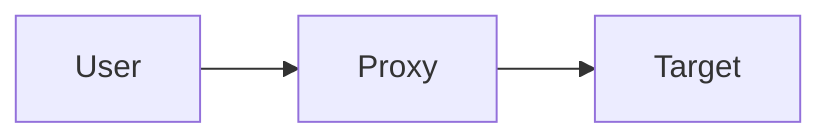
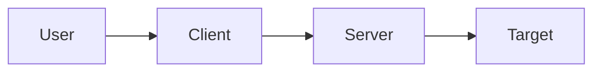
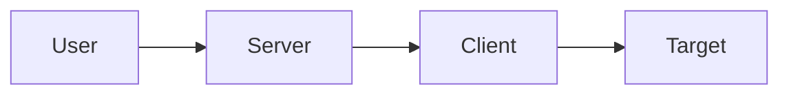
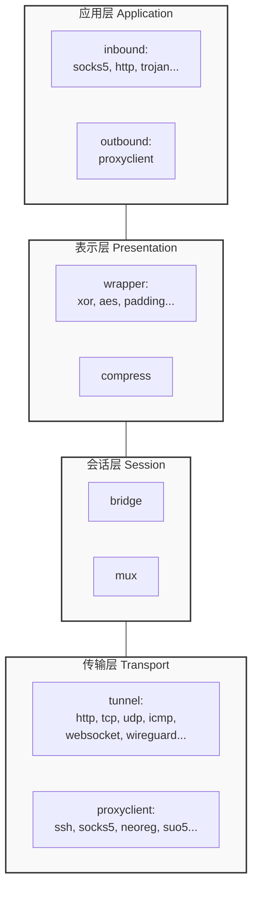
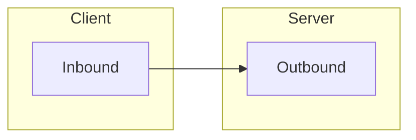
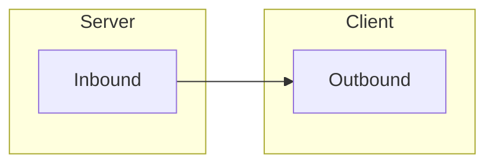

## 前置知识

### 代理

指将流量转发到目标的中间服务器。 在传统意义上， user -> proxy -> target.



但在 rem 中， 这种简单模式的代理是有一个别的名字 bind。 proxy 指的是 user -> client -> server -> target. 流量从 client 发起， 经过 server， 最后到 target。



让位于 client 网段的使用者， 可以访问到 server 网段的服务。

### 反向代理

反向代理表示流量 user -> server -> client -> target.



用来让位于 server 网段的服务， 可以访问到 client 网段的服务。

### 端口转发

端口转发有两种方向， 远程端口转发与本地端口转发（来自 ssh 的命名）

端口转发本质上是静态目标的代理， 远程端口转发表示

### ARQ

ARQ (Automatic Repeat reQuest) 是一种错误控制机制，用于确保数据在不可靠的传输媒介上可靠传输。当接收方检测到数据包错误时，会请求发送方重新发送数据包。

在 rem 中， 对于不可靠链接， 会使用基于 kcp 修改的 ARQ 协议使其变得相对可靠。

### URL 协议

rem 中的一切配置都基于 URL 协议。在早期版本， rem 需要通过接近 20 个参数分别描述传输层，会话层， 表示层， 应用层配置的各种细节。 现在将这些配置使用 URL 协议表示。

在 v0.1.0 之后所有的配置项都使用 url 协议表示。

例如 console 的配置示例：

```
tcp://nonenonenonenone:@127.0.0.1:34996?wrapper=lsJyUl5w5TTyTEH2wrMYkwfaNgNop3ry3pyRSKIpCriE8%2F%2FpkMfIgULLEAxv2LEoivHy2r61PIlZVYyirPVeG3bmND1hReHMFQGXwgL6Ui3JSgTKNZ3g%2BBc55AcCtf%2FRmtHZsvfyF5h0%2BEzYLqDeAvzqLmFhL1Ed0qKjpurSwC97oD3G8auhAxFp7AHqs29W19liQ25olc444pH8xZxEyS%2BMAzk%2FdqU5BcYgWHir5A5jL63DtBVmfGE0wRHvZuv7
```

## 基本概念

在 rem 中, 基于传输层之上重新抽象了整个网络交互的流程。

- 传输层, 对应 core/tunnel, 分为 listener 和 dialer, 可以实现自定义的任意传输层信道， 只需要实现对应的 golang 的接口即可。目前实现了，tcp, udp, icmp, websocket.
- 会话层, 实现了链接复用(mux)，会话管理.
- 加密混淆层(对应表示层)，对应 core/wrapper，对应的接口是 ReadWriteCloser, 只需要实现对应的 Read 和 Writer 接口， 即可实现对传输层流程的加密，混淆， 伪装。甚至可以实现上下行流量分别配置不同的 wrapper. 目前实现了 aes, xor, padding.
- 中转/代理层(对应表示层) (可选), 可以通过第三方代理/服务中转流量， 例如通过 ssh, socks5, neoreg, suo5 等任意具有流量功能的实现数据转发, 目前实现了 http/https, socks5/4, ssh, shadowsocks
- 应用层, 基于上面三层实现的信道, 可以被封装为不同的应用, 目前实现了 socks5, port forward, http 代理, shadowsocks, trojan

基于这样的抽象层级, 我们可以任意拓展 rem 的能力边界。 我们可以快速添加一个传输层协议， 或是加密混淆算法， 或是代理中转工具， 又或是最终面向用户的协议。

这是前所未有的潜力， 理论上不存在任何在流量上被检测的可能性。

### tunnel

tunnel 是 rem 中的一种概念， 表示一个虚拟的传输层。

可以是原本就可靠的 tcp，也可以是被 udp over kcp 这样的传统意义上的传输层。

也可以是 websocket+云函数/CDN， 或者 http+OSS 这样的被 rem 模拟出来的传输层。

rem 基于 tunnel 构建传输层， 并在这个传输层上构建上层应用。

rem 架构：



### wrapper

wrapper 用来对数据编码解码，加密解密， 混淆解混淆。 位于 OSI 模型中的表示层。

wrapper 在 tunnel 层面作用，例如当我们使用 xor， 将会直接作用于传输层，整个数据流都会使用 xor。

### inbound/outbound

inbound 和 outbound 表示 rem 中的数据流向。位于 OSI 模型中的应用层

inbound 表示用户交互端， outbound 表示对外请求端。

inbound 和 outbound 都可以分别配置不同的协议。 例如实现一个反向代理， 对用户暴露 socks5。就可以配置 inbound 为 socks5， outbound 为 raw。 关于 socks5 的协议的认证， 协议解析会在 inbound 中实现， outbound 只处理对外请求， 并转发数据。

神奇的地方在于也可以用另一种反向代理， inbound 配置 raw， outbound 配置 socks5。 这样所有的数据先传递到 outbound 端， 例如 socks5 版本交换，auth。

从这里能发现，协议交互部分在 inbound 实现会更加高效，可以少传递非常多的小数据包。

在 proxy 模式中， inbound 位于 client， outbound 位于 server。



在 reverse 模式中， inbound 位于 server， outbound 位于 client。


