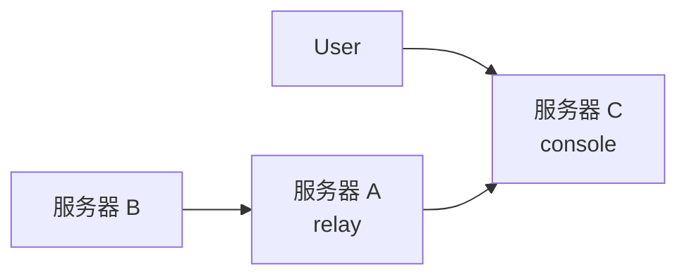

# rem v0.3.0 文档审计报告

## 一、重大变更（文档严重过时）

### 1.1 CLI 参数重构 ⚠️ **高优先级**

**问题**：文档中的核心参数已经过时

| 文档中的写法 | 实际 v0.3.0 | 说明 |
|------------|-----------|------|
| `-c [link]` | `-c <addr>` / `-s <addr>` | `-c` 现在是 client，`-s` 是 server |
| `-m reverse/proxy/bind` | `-b/--bind` | `-m` 已废弃（legacy flag），bind 是独立参数 |
| 未提及 | `-s` 和 `-c` 同时使用 | 触发 **relay mode**（中继模式） |

**影响范围**：
- `usage.md` 的所有 QuickStart 示例
- `usage.md` 的参数解释章节
- `concept.md` 中的命令示例

**修复建议**：
```bash
# 旧文档写法（已过时）
./rem -c [link]
./rem -c [link] -m proxy

# 新的正确写法
./rem -c <server_url>  # client 模式
./rem -s <listen_addr> # server 模式
./rem -b -l socks5://  # bind 单机模式
```

### 1.2 Relay Mode（中继模式）🆕 **完全缺失**

**发现**：代码中存在完整的 relay 功能，文档完全未提及

**功能描述**：
- 同时指定 `-s` 和 `-c` 时，启动透明 TCP 中继
- 上游连接到 console，下游监听本地端口
- 自动生成 relay link（带 `via` 参数）
- wrapper 加密端到端，relay 节点只转发原始字节

**使用场景**：
```bash
# 在中间跳板机上
./rem -c tcp://root-server:34996 -s tcp://0.0.0.0:12345
# 会输出 relay link，供更内层节点使用
```

**应添加文档位置**：`usage.md` 的"多级网络"章节

---

## 二、新增功能（未记录）

### 2.1 ConnHub 多通道 🆕

**发现**：支持多 console URL 和定向通道（up/down）

**特性**：
- 支持 `-c` 重复多次，指定多个 console
- 支持定向通道（uplink/downlink 分离）
- 通道配对机制（30s TTL）

**用途**：高级流量调度和负载均衡

### 2.2 FetchProxy MITM 🆕

**新增参数**：
- `--fetchproxy-mitm`: 启用服务端 HTTPS CONNECT MITM
- `--fetchproxy-ca`: CA 证书路径
- `--fetchproxy-key`: CA 私钥路径

**用途**：服务端解密 HTTPS 流量

### 2.3 Extra Serves 🆕

**功能**：支持多对 `-l` 和 `-r`
```bash
./rem -c [link] -l socks5://:1080 -r :8080 -l port://:3389 -r :9999
# 自动 fork 多个 serve
```

### 2.4 负载均衡 🆕

**参数**：
- `--lb <algorithm>`: 全局设置
- URL query: `?lb=random|fallback|round-robin`

**算法**：
- `random`: 随机选择
- `fallback`: 故障转移
- `round-robin`: 轮询

### 2.5 其他新参数

| 参数 | 功能 | 文档状态 |
|-----|------|---------|
| `--list` | 列出所有已注册组件 | ❌ 未记录 |
| `--retry-max-interval` | 最大重试间隔 | ❌ 未记录 |
| `-q/--quiet` | 安静模式 | ❌ 未记录 |

---

## 三、Pro 功能标记 🔒

### 3.1 需要 `advance` build tag 的功能

**加密/混淆**（Pro）：
- ✅ `age`: Age 加密 + AEAD
- ✅ `utls`: uTLS 指纹伪装
- ✅ `shadowtls`: ShadowTLS 混淆
  - query: `shadowtls=<addr>&shadowtls-password=<pass>`
- ✅ `reality`: REALITY 协议
  - query: `reality-dest`, `reality-key`, `reality-sni`, `reality-shortid`

**Community 版本支持**：
- ✅ `tls`: 标准 TLS
- ✅ `tlsintls`: TLS-in-TLS
- ✅ `compress`: 压缩

### 3.2 文档建议

在 `index.md` 的 "高级特性" 部分，明确标注：

```markdown
!!! example "Pro Features 🔒"

    需要 `advance` build tag 编译：
    
    * 🔒 Age 密钥交换
    * 🔒 uTLS 指纹伪装
    * 🔒 ShadowTLS 混淆
    * 🔒 REALITY 协议

Community 版本包含：

    * ✅ 标准 TLS/TLS-in-TLS
    * ✅ 流量压缩
    * ✅ 所有基础传输层
```

---

## 四、URL Query 参数（部分遗漏）

### 4.1 Console URL 支持的 query

| Query | 功能 | 文档状态 | 版本 |
|-------|------|---------|------|
| `wrapper=<base64>` | 加密混淆配置 | ✅ 已记录 | 全部 |
| `tls=true` | 启用 TLS | ✅ 已记录 | 全部 |
| `tlsintls=true` | TLS-in-TLS | ✅ 已记录 | 全部 |
| `compress=true` | 启用压缩 | ⚠️ 仅 changelog | 全部 |
| `age=true` | Age 加密 | ❌ 未记录 | Pro |
| `utls=true` | uTLS | ❌ 未记录 | Pro |
| `shadowtls=<addr>` | ShadowTLS | ❌ 未记录 | Pro |
| `reality-*` | REALITY 配置 | ❌ 未记录 | Pro |
| `via=<agentID>` | 中继来源标记 | ❌ 未记录 | 全部 |
| `retry=<num>` | 重试次数 | ⚠️ 部分记录 | 全部 |
| `retry-interval=<sec>` | 重试间隔 | ⚠️ 部分记录 | 全部 |
| `retry-max-interval=<sec>` | 最大间隔 | ❌ 未记录 | 全部 |
| `lb=<algorithm>` | 负载均衡 | ❌ 未记录 | 全部 |
| `client_id=<id>` | Simplex 客户端 ID | ❌ 未记录 | 全部 |

### 4.2 建议文档结构

在 `usage.md` 添加新章节：

```markdown
## URL Query 参数

### Console URL 通用参数

#### 加密与混淆
- `wrapper=<base64>`: 自定义加密混淆（不指定则随机生成）
- `tls=true`: 标准 TLS
- `tlsintls=true`: TLS-in-TLS
- `compress=true`: 启用流量压缩

#### 高级加密（需 Pro 版本）🔒
- `age=true`: Age 加密
- `utls=true`: uTLS 指纹伪装
- `shadowtls=<addr>&shadowtls-password=<pass>`: ShadowTLS
- `reality-dest=<addr>&reality-key=<hex>`: REALITY 协议

#### 连接控制
- `retry=<num>`: 最大重试次数（0=无限）
- `retry-interval=<sec>`: 重试间隔（默认 10）
- `retry-max-interval=<sec>`: 指数退避最大间隔（默认 300）
- `lb=random|fallback|round-robin`: 负载均衡算法
```

---

## 五、构建系统（文档不完整）

### 5.1 Build Tags

**发现**：代码使用了多个 build tag，但文档未说明

| Tag | 用途 | 影响 |
|-----|------|------|
| `advance` | Pro 功能 | age, utls, shadowtls, reality |
| `!advance` | Community | 仅标准 TLS |
| `tinygo` | 嵌入式/WASM | 精简版 |
| `!tinygo` | 标准构建 | 完整功能 |

### 5.2 建议更新 `usage.md` 的 Build 章节

```markdown
### 构建模式

#### Community 版本（默认）
```bash
./build.sh
```

#### Pro 版本
```bash
./build.sh --full -tags advance
```

#### TinyGo 版本（嵌入式）
```bash
# 需要 tinygo 工具链
tinygo build -target=wasm -tags=tinygo
```
```

---

## 六、示例代码更新

### 6.1 QuickStart 需要完全重写

**当前问题**：usage.md 第 6-23 行的示例仍使用旧语法

**建议修改**：

```markdown
## QuickStart

### 启动服务端
```bash
# 默认地址监听
./rem

# 或显式指定
./rem -s tcp://0.0.0.0:34996
```

### 客户端连接

#### 反向代理（默认，server 端监听）
```bash
./rem -c [link]
# 等价于
./rem -c [link] -r socks5://:10086
```

#### 正向代理（client 端监听）
```bash
./rem -c [link] -l socks5://:1080
```

#### 远程端口转发
```bash
./rem -c [link] -r port://:8080
```

#### 本地端口转发  
```bash
./rem -c [link] -l port://:8080
```

#### Bind 单机模式
```bash
./rem -b -l socks5://:1080
```
```

### 6.2 多级网络章节需要补充 Relay Mode

在"场景 2：级联"之后添加：

```markdown
#### 场景 2.5：Relay 模式（新）



**特点**：A 作为透明中继，不解密流量

1) 在 C 启动 console
```bash
./rem -s tcp://0.0.0.0:34996
```

2) 在 A 启动 relay（同时连上游，监听下游）
```bash
./rem -c tcp://[C_IP]:34996 -s tcp://0.0.0.0:12345
# 会输出 relay link
```

3) 在 B 使用 relay link 连接
```bash
./rem -c [relay_link]
```

!!! tip "Relay vs 级联"
    - Relay: A 只转发字节，加密端到端（C ↔ B）
    - 级联: A 解密重加密，需要两次握手
```

---

## 七、优先级建议

### P0（立即修复）
1. ✅ 更新 `usage.md` 的 CLI 参数说明（-s/-c 替代 -c/-m）
2. ✅ 修改所有 QuickStart 示例代码
3. ✅ 添加 Relay Mode 文档

### P1（重要补充）
4. ✅ 标记所有 Pro 功能（advance tag）
5. ✅ 添加 URL Query 参数完整列表
6. ✅ 补充新增参数说明（--lb, --fetchproxy-mitm 等）

### P2（优化完善）
7. ✅ 添加 Extra Serves 说明
8. ✅ 补充 ConnHub 高级用法
9. ✅ 更新 Build 文档（build tags）

---

## 八、快速修复模板

### 修改 usage.md 第 1-40 行

```markdown
## Usage

```
Usage: rem [options]

Server Mode:
  ./rem                           # 默认监听 tcp://0.0.0.0:34996
  ./rem -s tcp://0.0.0.0:12345   # 指定地址

Client Mode:
  ./rem -c <link>                 # 连接到 server
  ./rem -c <link> -l socks5://   # client 端监听代理
  ./rem -c <link> -r port://:80  # server 端转发端口

Relay Mode:
  ./rem -c <upstream> -s <listen> # 透明中继

Bind Mode:
  ./rem -b -l socks5://:1080     # 单机代理

Main Options:
  -s, --server <addr>        server listen address (repeatable)
  -c, --client <addr>        client connect address (repeatable)
  -l, --local <addr>         local address (repeatable)
  -r, --remote <addr>        remote address (repeatable)
  -a, --alias <name>         agent alias
  -d, --destination <id>     destination agent id (bridging)
  -x, --proxy <url>          outbound proxy chain (repeatable)
  -f, --forward <url>        forward proxy for console connection
  -b, --bind                 bind mode (standalone)
  -n, --connect-only         only connect, no serve

Config Options:
  -i, --ip <ip>              console external ip
      --lb <algo>            load balance: random/fallback/round-robin
      --sub <url>            subscribe url (default: http://0.0.0.0:29999)
      --no-sub               disable subscribe
      --fetchproxy-mitm      enable server HTTPS MITM
      --fetchproxy-ca        CA cert path
      --fetchproxy-key       CA key path

Misc Options:
  -k, --key <key>            encryption key
  -q, --quiet                quiet mode
      --debug                debug mode
      --detail               verbose mode
      --dump                 dump traffic
      --list                 list registered components
      --version              show version
  -h, --help                 show help
```
```

---

## 总结

文档与 v0.3.0 代码存在显著差异，主要问题：

1. **CLI 重构**：`-c`/`-m` 改为 `-s`/`-c`/`-b`，所有示例过时
2. **Relay Mode**：全新中继功能，文档完全缺失
3. **Pro 标记**：未区分 community vs advance 功能
4. **新增功能**：FetchProxy MITM、Extra Serves、负载均衡等未记录
5. **URL Query**：大量新参数未说明

**建议分批修复**，先处理 P0 的核心参数变更，再补充新功能文档。
