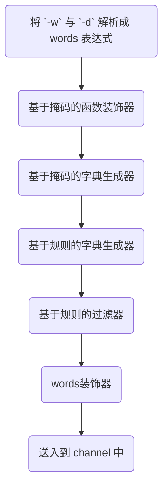
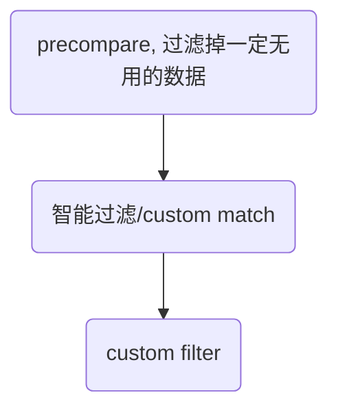

## Feature

!!! example "Features."

    - 超强的性能, 在本地测试极限性能的场景下, 能超过 ffuf 与 feroxbruster 的性能 50%以上.
    - 基于掩码的字典生成
    - 基于规则的字典生成
    - 动态智能过滤
    - 全量 gogo 的指纹识别
    - 自定义信息提取, 如 ip,js, title, hash 以及自定义的正则表达式
    - 自定义无效页面过滤策略
    - 自定义输出格式 \* \_nix 的命令行设计, 轻松与其他工具联动
    - 多角度的自动被 ban,被 waf 判断
    - 断点续传
    - 通用文件, 备份文件, 单个文件备份, 爬虫, 主动指纹识别的完美结合

## Usage

`spray -h`

完整的参数说明

```
Usage:
	./spray

Input Options:
      --resume=                     File, resume filename
  -c, --config=                     File, config filename
  -u, --url=                        Strings, input baseurl, e.g.: http://google.com
  -l, --list=                       File, input filename
  -p, --port=                       String, input port range, e.g.: 80,8080-8090,db
  -i, --cidr=                       String, input cidr, e.g.: 1.1.1.1/24
      --raw=                        File, input raw request filename
  -d, --dict=                       Files, Multi,dict files, e.g.: -d 1.txt -d 2.txt
  -D, --default                     Bool, use default dictionary
  -w, --word=                       String, word generate dsl, e.g.: -w test{?ld#4}
  -r, --rules=                      Files, rule files, e.g.: -r rule1.txt -r rule2.txt
      --append-rule=                Files, when found valid path , use append rule generator new word with current path
      --filter-rule=                String, filter rule, e.g.: --rule-filter '>8 <4'
      --append-file=                Files, when found valid path , use append file new word with current path
      --offset=                     Int, wordlist offset
      --limit=                      Int, wordlist limit, start with offset. e.g.: --offset 1000 --limit 100

Function Options:
  -e, --extension=                  String, add extensions (separated by commas), e.g.: -e jsp,jspx
      --force-extension             Bool, force add extensions
      --exclude-extension=          String, exclude extensions (separated by commas), e.g.: --exclude-extension jsp,jspx
      --remove-extension=           String, remove extensions (separated by commas), e.g.: --remove-extension jsp,jspx
  -U, --uppercase                   Bool, upper wordlist, e.g.: --uppercase
  -L, --lowercase                   Bool, lower wordlist, e.g.: --lowercase
      --prefix=                     Strings, add prefix, e.g.: --prefix aaa --prefix bbb
      --suffix=                     Strings, add suffix, e.g.: --suffix aaa --suffix bbb
      --replace=                    Strings, replace string, e.g.: --replace aaa:bbb --replace ccc:ddd
      --skip=                       String, skip word when generate. rule, e.g.: --skip aaa

Output Options:
      --match=                      String, custom match function, e.g.: --match 'current.Status != 200''
      --filter=                     String, custom filter function, e.g.: --filter 'current.Body contains "hello"'
      --fuzzy                       String, open fuzzy output
  -f, --file=                       String, output filename
      --fuzzy-file=                 String, fuzzy output filename
      --dump-file=                  String, dump all request, and write to filename
      --dump                        Bool, dump all request
      --auto-file                   Bool, auto generator output and fuzzy filename
  -F, --format=                     String, output format, e.g.: --format 1.json
  -j, --json                        Bool, output json
  -o, --probe=                      String, output format
  -q, --quiet                       Bool, Quiet
      --no-color                    Bool, no color
      --no-bar                      Bool, No progress bar
      --no-stat                     Bool, No stat file output

Plugin Options:
  -a, --advance                     Bool, enable all plugin
      --extract=                    Strings, extract response, e.g.: --extract js --extract ip --extract version:(.*?)
      --extract-config=             String, extract config filename
      --active                      Bool, enable active finger path
      --recon                       Bool, enable recon
      --bak                         Bool, enable bak found
      --file-bak                    Bool, enable valid result bak found, equal --append-rule rule/filebak.txt
      --common                      Bool, enable common file found
      --crawl                       Bool, enable crawl
      --crawl-depth=                Int, crawl depth (default: 3)

Finger Options:
      --finger                      Bool, enable active finger detect
      --update                      Bool, update finger database
      --finger-path=                String, 3rd finger config path (default: fingers)
      --finger-engine=              String, custom finger engine, e.g. --finger-engine ehole,goby (default: all)

Request Options:
  -x, --method=                     String, request method, e.g.: --method POST (default: GET)
      --header=                     Strings, custom headers, e.g.: --headers 'Auth: example_auth'
      --user-agent=                 String, custom user-agent, e.g.: --user-agent Custom
      --random-agent                Bool, use random with default user-agent
      --cookie=                     Strings, custom cookie
      --read-all                    Bool, read all response body
      --max-length=                 Int, max response body length (kb), -1 read-all, 0 not read body, default 100k,
                                    e.g. --max-length 1000 (default: 100)

Modify Options:
      --rate-limit=                 Int, request rate limit (rate/s), e.g.: --rate-limit 100 (default: 0)
      --force                       Bool, skip error break
      --no-scope                    Bool, no scope
      --scope=                      String, custom scope, e.g.: --scope *.example.com
      --recursive=                  String,custom recursive rule, e.g.: --recursive current.IsDir() (default:
                                    current.IsDir())
      --depth=                      Int, recursive depth (default: 0)
      --index=                      String, custom index path (default: /)
      --random=                     String, custom random path
      --check-period=               Int, check period when request (default: 200)
      --error-period=               Int, check period when error (default: 10)
      --error-threshold=            Int, break when the error exceeds the threshold (default: 20)
      --black-status=               Strings (comma split),custom black status (default: 400,410)
      --white-status=               Strings (comma split), custom white status (default: 200)
      --fuzzy-status=               Strings (comma split), custom fuzzy status (default: 500,501,502,503)
      --unique-status=              Strings (comma split), custom unique status (default: 403,200,404)
      --unique                      Bool, unique response
      --retry=                      Int, retry count (default: 0)
      --sim-distance=

Miscellaneous Options:
  -m, --mod=[path|host]             String, path/host spray (default: path)
  -C, --client=[fast|standard|auto] String, Client type (default: auto)
      --deadline=                   Int, deadline (seconds) (default: 999999)
  -T, --timeout=                    Int, timeout with request (seconds) (default: 5)
  -P, --pool=                       Int, Pool size (default: 5)
  -t, --thread=                     Int, number of threads per pool (default: 20)
      --debug                       Bool, output debug info
      --version                     Bool, show version
  -v                                Bool, log verbose level ,default 0, level1: -v level2 -vv
      --proxy=                      String, proxy address, e.g.: --proxy socks5://127.0.0.1:1080
      --init                        Bool, init config file

Help Options:
  -h, --help                        Show this help message
```

## QuickStart

当前有两种运行模式, 爆破模式和基本模式.  这两种模式会自动切换, 不需要用户手动指定。 

*所有需要基线进行智能过滤的功能都会打开爆破模式, 不需要上下文的功能会使用基本信息收集模式* 

### 基本信息探测

指定url进行探测

```
spray -u http://example.com -u http://test.com
```

通过文件批量指定url

```
spray -l 1.txt
```

最大能力的信息收集, 打开全部指纹引擎, 打开全部配置的extractor

```
spray -l 1.txt --finger --recon
```

端口扫描与网段扫描

可以实现类似gogo的配置, 但是是只能用来识别http协议

```
spray -i 1.1.1.1/24 -p top2
```

域名+端口的探测

```
spray -u example.com -p top2
```

### 爆破模式

!!! info "注意"
	基本信息探测中的用法都可以在爆破模式中集成, 但请注意爆破模式会消耗更多的时间


基本使用, 从字典中读取目录进行爆破

```
spray -u http://example.com -d wordlist1.txt -d wordlist2.txt
```

通过掩码生成字典进行爆破

```
spray -u http://example.com -w "/aaa/bbb{?l#4}/ccc"
```

通过规则生成字典爆破. 规则文件格式参考 hashcat 的字典生成规则

```
spray -u http://example.com -r rule.txt -d 1.txt
```

批量爆破

```
spray -l url.txt -r rule.txt -d 1.txt
```

断点续传

```
spray --resume stat.json
```


## 字典生成

### 基于掩码的字典生成

为了实现这个功能, 编写了一门名为 mask 的模板语言. 代码位于: [mask](https://github.com/chainreactors/words/tree/master/mask).

**简单使用:** 

`spray -u http://example.com -w '/{?l#3}/{?ud#3}`

含义为, `/全部三位小写字母/全部三位大写字母+数字`组成的字典.

#### 语法基本介绍

所有的 mask 生成器都需要通过`{}`包裹, 并且括号内的第一个字符必须为`?`, `$`其中之一.

`#`后的数字表示重复次数, 可留空, 例如`{?lu}` , 表示"全部小写字母+全部大写字母"组成的字典.

- `?` 表示普通的笛卡尔积. 例如`{?l#3}`表示生成三位小写字母的所有可能组合
- `$` 表示贪婪模式, 例如`{$l#3}`表示 3 位小写字母的所有可能组合+2 位小写字母的所有可能组合+1 位小写字母的所有可能组合

掩码的定义参考了 hashcat, 但是并不完全相同. 目前可用的关键字如下表:

```
"l": Lowercase,  // 26个小写字母
"u": Uppercase,  // 26个大写字母
"w": Letter,     // 52大写+小写字母
"d": Digit, // 数字0-9
"h": LowercaseHex, // 小写hex字符, 0-9 + a-f
"H": UppercaseHex, // 大写hex字符, 0-9 + A-F
"x": Hex,          // 大写+小写hex字符, 0-9 + a-f + A-F
"p": Punctuation,  // 特殊字符 !\"#$%&'()*+,-./:;<=>?@[\\]^_`{|}~
"P": Printable,    // 可见的ascii字符
"s": Whitespace,   // 空字符 \t\n\r\x0b\x0c
```

支持通过数字表示命令行输入的字典序号, 例如

```
spray -u http://example.com -w '/{?0u#2}/{?01}' -d word0.txt -d word1.txt
```

其中`{?0u#2}`表示 word0.txt 的所有内容+所有大写字母笛卡尔积两次, `{?01}` 表示 word0.txt + word1.txt 的所有内容.

**关于mask更多高级功能请见: https://chainreactors.github.io/wiki/libs/words/#20240521-updatec**

### 基于规则的字典生成

words 生成器的详细使用参见[words 文档](chainreactors.github.io/wiki/libs/words/#_3)

当前内置的 spray 规则如下:

- **自动生成权限绕过** [点击查看规则](https://github.com/chainreactors/gogo-templates/blob/master/rule/authbypass.rule)
- **自动生成文件/目录备份** [点击查看规则](https://github.com/chainreactors/gogo-templates/blob/master/rule/filebak.txt)

**简单使用**

```
spray -u http://example.com -d word.txt -r rule.txt
```

这行命令表示, 将`word.txt`中每一行都作为基础值与规则库`rule.txt`进行 rule 模板语言处理过后的笛卡尔积. 最终的字典总数量为 `word行数 * rule行数`.

**rule过滤器**

```
spray -u http://example.com -d word.txt --rule-filter ">15"
```

这行命令表示, 指定字典, 并过滤掉长度大于 15 的字典.

#### 轻量级递归

很多时候扫到了有效目录, 但如何进一步深入呢? 最简单的办法就是全量字典递归, 但实际上这样做效率低, 准确率也低.

正确的做法是根据场景选择合适的字典生成方式. 例如如果爆破到了新的目录, 则自动爆破备份文件, 爆破到了新的 api 则自动测试权限绕过.

`--append-rule` 提供了在发现有效目录时的进一步字典生成器

在 spray 中的用法:

- 根据有效 url 自动生成权限绕过字典. `spray -u http://example.com -d word.txt --append-rule authbypass`
- 根据有效 url 自动生成备份文件字典. `spray -u http://example.com -d word.txt --append-rule filebak`

例如发现`index.php`存在, 就会根据 rule 与`baseurl` 生成如`~index.php`,`.index.php`, `index.php.bak`等字典加入到队列中.

### 预配置的便捷用法

在使用基于掩码或基于规则的字段生成器时, 需要大量的手动配置和测试. 这很麻烦, 所以spray提供了一些预设快速实现一些常用配置. 

所有的预设实际上都是通过预先配置的[words](https://github.com/chainreactors/words) 实现.

通过words的掩码配置实现的: 

1. `--suffix` 在字典后面添加后缀, 可添加多个, 与原有的字典组成笛卡尔积
2. `--prefix` 在字典前面添加前缀, 可添加多个, 与原有的字典组成笛卡尔积
3. `-e`/`--extension` 添加拓展名, 逗号分割

通过words的function实现的: 

1. `-L`/`--lowercase` 将字典中的所有字母转换为小写
2. `-U`/`--uppercase` 将字典中的所有字母转换为大写
3. `--replace` 替换字典中的字符, 例如`--replace aaa=bbb` 将字典中的 a 替换为 b, 可以添加多个`--replace`
4. `--remove-extension` 删除字典中的文件扩展名, 逗号分割
5. `--exclude-extension` 排除字典中的文件扩展名, 逗号分割
6. `--skip` 跳过存在指定关键字的字典
7. `force-extension` 强制添加后缀名, 不论是否已经存在

**字典生成器的优先级**




## Input

支持三种不同类型的输入:

- `-u`/`--url ` , 从命令行中添加 url 作为任务.
- `-l`/`--list` , 从文件中选择多个 url 作为任务. 将会自动开启并发模式, 支持多个任务同时进行, 并每个任务都有自己的 keep-alive 的连接池
- `-c/--cidr` 输入指定网段, 例如 `spray -c 1.1.1.1/24`
- `-p/--port` 指定多个端口, 规则与 gogo 一致, 例如`spray -u http://example -p top2`
- `--default` 启用默认字典, 字典来自 [dirsearch](https://github.com/maurosoria/dirsearch/blob/master/db/dicc.txt)
- `--resume` , 选择 stat 文件断点续传

并且还有一些参数可以控制任务.

- `--offset` , 字典偏移
- `--limit`, 限制的字典数量
- `--deadline` 所有任务的最大时间限制, 超时了会保存当前进度的 stat 文件后退出
- `--check-only` 类似 httpx 的模式, 去掉了基准值仅根据 url 列表进行请求, 可以获取 http 基础信息, title, 指纹等. 类似 httpx, 将会自动关闭 keep-alive, 并进行了一些性能优化.
- `--force` 忽略掉被 ban 或被 waf 的判断, 强制跑完所有字典

### 速率限制

合理的速率配置能让 spray 的性能大大提升.

- 通过 `-p`/`--pool` 配置并行的任务数, 每个 url 都会分配到一个独立的 pool.
- 通过`-t`/ `--thread` 每个 pool 的并发数, 需要注意的是, thread 与每秒实际发包速率无关
- 通过`--rate-limit` 配置每个 pool 的每秒发包上限速度.
- 通过`--timeout` 配置每个请求的超时时间, 如果目标的 waf 会通过 drop packet 的方式响应, 适当调低 timeout 可以加快爆破速度.

### 爆破方式

通过`-m` 指定爆破方式, 默认为 path, 当前支持`path`, `host`两种模式

**path**

path 模式, 字典将会拼接到输入的 url 之后

**host**

host 模式, 字典将会替换 header 中的 host 字段

### client

当前 spray 采用了 net/http 与 fasthttp 作为备选的 client, 后续还将兼容支持 http2/http3 的 client.

因为 fasthttp 指定 host 时会进行一次 dns 解析, 导致出现报错, 因此, 在 path 爆破时将使用 fasthttp. 在 host 爆破时将使用 net/http.

fasthttp 的性能远高于 net/http, 因此不建议手动修改配置. 如果有相关的特殊需求, 可以通过`-c`/`--client` `auto`/`standard`/`fast`进行修改. 默认为 auto.

!!! info "使用 fasthttp 需要注意"
    如果目标使用了`chunked`, 那么 fasthttp 很可能无法正确获取解码后的 body, 需要使用`-c standard`切换成 go 自带的`net/http` . 我原本以为能找到一个 header 去在 client 关闭 chunk, 似乎并没有对应的方法.

### 请求自定义

`--header "HEADER: aaa"` 可添加自定义的 header 头, 可添加多个`--header`来添加多个 header

`--cookie "Session: sess"` 可添加自定义的 cookie, 可添加多个`--cookie`来添加多个 cookie

`--user-agent "Spray0.1.0"` 可添加指定的 UA

`--random-agent` 打开自动随机 UA 替换

`--raw file ` 类似 sqlmap 的`-r`参数 , 选择纯文本的请求模板, 后续的请求都会使用这个模板构造, todo

## Output

spray 默认输出到终端的格式是 human-like 文本. 并默认开启的 **title 获取** 与 **被动指纹识别** 功能.

??? info "命令行输出案例"
    `spray --no-bar -u http:/example.com  -w '/{?l}' -a --extract url`
	```
	[*] Parsed 26 words by /{?l} , 2023-01-04 11:16.30
    [*] Loaded 1 urls from cmd , 2023-01-04 11:16.30
    [*] Loaded 0 dictionaries and 0 decorators , 2023-01-04 11:16.30
    [+] [baseline.index] http:/example.com/ - 200 - 6326 - 70ms [解决方案，一查就有] [nginx]   , 2023-01-04 11:16.30
    [+] [baseline.random] http:/example.com/PgtrqWohCJJLckw - 404 - 169 - 30ms [404 Not Found] [nginx]   , 2023-01-04 11:16.30
    [+] http:/example.com/static/js/chunk-libs.89fc8520.js - 200 - 0 - 116ms [nginx]
    [+] http:/example.com/static/js/chunk-elementUI.80b6d1d0.js - 200 - 0 - 153ms [nginx]
    [+] http:/example.com/static/js/app.72fc17fc.js - 200 - 68582 - 170ms [nginx] [ url:17 items ][ crawl:109 items ]
      url:
            http://www.w3.org/2000/svg
            https://github.com/PanJiaChen/vue-admin-template/
            https://panjiachen.github.io/vue-element-admin-site/#/
      crawl:
            https://github.com/PanJiaChen/vue-admin-template/
            https://panjiachen.github.io/vue-element-admin-site/#/
            https://beian.miit.gov.cn
            /uploadFile/uploadFile
            /userInfo/userInfo
            /userAccount/userAccount
            /userDocument/userDocument
            /userMake/userMake
            /userVip/userVip
            /userInvite/userInvite
            /userCollection/userCollection
            /demand-form/demand-form
            /login
            /dashboard
            /login?redirect=
            /home
            /userMake
            /pay
            /pay/success
            /paySuccess
            /pay/success
            /PaySuccess
            /wxLogin
            /404
            /prod-api/api
    [+] http:/example.com/prod-api/api - 404 - 124 - 35ms [{\"timestamp\":] [focus:springboot]  [nginx] [ crawl:/api ]
      crawl:
            /api
    [*] [stat] http:/example.com took 0 s, request total: 125, finish: 26/26, found: 4, check: 0, failed: 0 , 2023-01-04 11:16.30
    [*] [stat] http:/example.com 404: 120, 200: 3, , 2023-01-04 11:16.30
	```


默认将会输出进度条, 但是进度条在 windows 的各种 terminal 下会有些输出 bug. 可以通过`--no-bar`单独关闭进度条.

默认的命令行输出是带颜色的, 可以通过`--no-color` 关闭着色.

如果需要将 spray 的结果传递给其他工具, 需要关闭各种日志输出, 着色, 进度条等无用输出. 可以添加`-q`/`--quiet`关闭非必要输出.

如果需要查看所有细节, 可以添加`--debug`. 不论结果是否有效, 输出每个响应的细节

### 输出流

除了默认配置下最直观的命令行输出, spray 支持一个自由的输出流配置.

- `-f/--file` 默认输出流, 指定有效结果的输出文件
- `--fuzzy-file` fuzzy 输出流, 指定被 fuzzy 过滤的结果输出文件
- `--dump-file` 全部请求的输出流, 指定每个发出的包与响应结果的输出文件

默认情况下, 被智能过滤中的模糊过滤掉的输出不会输出到命令行或者文件. 但模糊过滤的结果存在漏报/误报的可能, 因此很多时候还需要进行二次处理.

一些便捷化的参数:

- `--fuzzy` 打开命令行的模糊过滤结果输出.
- `--auto-file` 自动根据任务指定文件名
- `--dump `自动指定 dump 文件的文件名
- `--no-stat` 将不会自动创建`.stat` 文件
- `-j`/`--json` 标准输出中的输出格式启用json格式

### Probe

默认的 baseline 中还有许多数据默认状态下不会输出, 可以通过`--probe`参数去自定义想要输出的内容.

当前支持的 probe 有

- `url`
- `host`
- `title`
- `redirect`
- `md5`, body 的 MD5
- `simhash`, body 的 simhash
- `mmh3`, body 的 mmh3
- `stat`/`status`, 状态码
- `spend`, 耗费的时间, 单位毫秒
- `extract` 提取的结果
- `frame` 指纹, 默认开启[被动指纹识别](https://chainreactors.github.io/wiki/gogo/design/#_12),
- `cpe` , `cpe:2.3:a:microsoft:windows_10:1909:*:*:*:*:*:*:*****`
- `wfn` , `wfn:[part="a", vendor="microsoft", product="windows_10", version="1909"]`
- `uri`, `cpe:/a:microsoft:windows_10:1909`

通过`spray -o url,host,title,md5,frame` 即可自由组合 probe 控制输出内容

### 输出到文件

使用`-f` 指定输出文件名

默认输出到文件的格式为 json, 可以使用`-o full` 强制修改为和命令行一样的格式

??? info "json 输出格式案例"
    ```json
    {
        "number": 0,
        "url": "http://example/static/js/app.72fc17fc.js",
        "path": "//static/js/app.72fc17fc.js",
        "host": "",
        "body_length": 68582,
        "header_length": 255,
        "status": 200,
        "spend": 405,
        "title": "",
        "frameworks": [
            {
                "name": "nginx",
                "tags": [
                    "other"
                ]
            }
        ],
        "extracts": [
            {
                "name": "url",
                "extract_result": [
                    "http://www.w3.org/2000/svg",
                    "https://github.com/PanJiaChen/vue-admin-template/",
                    "http://www.w3.org/2000/svg",
                    "https://beian.miit.gov.cn",
                ]
            },
            {
                "name": "crawl",
                "extract_result": [
                    "https://github.com/PanJiaChen/vue-admin-template/",
                    "https://panjiachen.github.io/vue-element-admin-site/#/",
                    "https://beian.miit.gov.cn",
                    "/uploadFile/uploadFile",
                    "/userInfo/userInfo",
                    "/userAccount/userAccount",
                    "/userDocument/userDocument",
                    "/userMake/userMake",
                    "/userVip/userVip",
                    "/userInvite/userInvite",
                    "/userCollection/userCollection",
                    "/demand-form/demand-form",
                    "/login",
                ]
            }
        ],
        "error": "",
        "reason": "",
        "valid": true,
        "fuzzy": false,
        "source": 5,
        "depth": 1,
        "hashes": {
            "body-md5": "d7190390f194cd8a09cbdf132ee0bb6e",
            "header-md5": "19bf7ec8a759066bdf8bbc1a90804244",
            "raw-md5": "8c00b45ac0c33c51074270a47620318d",
            "body-simhash": "af63bd4c8601b7ae",
            "header-simhash": "9833941ee6ab8d6d",
            "raw-simhash": "af63bd4c8601b7ae",
            "body-mmh3": "2409784245"
        }
    }
    ```

除了`-f` 指定的文件名外, 还会根据任务类型生成`***.stat`的进度文件, 用来保存任务的状态与进度信息. 可以通过这个文件判断目标大致的状况.
??? info "stat 输出案例"
    ```json
    {
        "url": "http://101.132.126.181/",
        "counts": {
            "200": 3,
            "404": 104
        },
        "failed": 0,
        "req_total": 109,
        "check": 0,
        "found": 4,
        "filtered": 0,
        "fuzzy": 0,
        "wafed": 0,
        "end": 26,
        "offset": 0,
        "total": 26,
        "start_time": 1672802906,
        "end_time": 1672802907,
        "word_count": 26,
        "word": "/{?l}",
        "dictionaries": null,
        "rule_files": null,
        "rule_filter": ""
    }
    ```

spray 区分了不同类型的输出, 只有通过所有过滤器的结果才会输出到`-f`指定的文件中.

### extract/提取器

spray 有一个类似 gogo 的 extract 的功能. 用来从网页中提取特定数据.

可以通过`--extract regexp`, 自定义正则表达式去提取数据. `--extract` 可以添加多个.

extract 也存在一些常用的预设, `--extract ip`

- url
- ip
- mail
- idcard
- phone
- header
- body
- cookie
- response

## Advance Feature

### 自定义智能过滤

智能过滤的逻辑很难用几行文字描述, 可以见[智能过滤逻辑](/wiki/spray/detail/#_1)

可以通过控制状态码列表自定义一部分的智能过滤逻辑.

- `--black-status` 这个列表内的状态码将被直接过滤, 默认 400, 410
- `--white-status` 这个列表内的状态码将进入到标准的智能过滤逻辑, 默认 200
- `--fuzzy-status`这个列表内的状态码才有资格进入到模糊过滤的逻辑, 默认 403, 404, 500, 501, 502, 503
- `--waf-status` 这个列表的状态码与`black-status`类似, 但会标记为被 waf, 默认 493, 418

直接使用例如`--black-status 1020`将会覆盖原有的值, 可以使用`--black-status +1020`在原有的基础上新增, 或`--black-status !1024` 在原有的基础上去除.

!!! info "fuzzy all"
    `--fuzzy-status`参数存在特例`--fuzzy-status all` 启用所有状态码的 fuzzy 过滤, 用来应对一些特殊场景

### 自定义表达式过滤

智能过滤能最大程度保留 spray 内置的过滤策略. 但某些情况下, spray 内置的策略也不能满足需求, 就可以使用自定义过滤器代替 spray 内置的策略.

某些情况可能非常离谱, 比如 not found 页面返回 200, 并且每次 body 相似度都不高. 这种情况下, 就可以使用自定义过滤功能.

**spray 中使用了 [expr](https://github.com/antonmedv/expr) 作为表达式语言**, 应该是市面上公开的性能最强的脚本语言了.

expr 的语法介绍: https://expr.medv.io/docs/Language-Definition

expr 语法和 xray/github action 中差不多, spray 中绝大多数情况也用不到高级功能. 只需要了解最简单的等于/包含之类判断即可.

#### custom match

我们可以使用--match 定义我们需要的过滤规则, --match 自定义的过滤函数将会替换掉默认的智能过滤. 也就是说, 开启了--match, 智能过滤就自动关闭了, 如果不想关闭智能过滤, 也提供了其他解决办法.

下面是一个简单的例子, 假设某个网站所有的 404 页面都指向公益页面, 我们想去掉所有的带"公益"字样的页面:

```
spray -u http://example.com -d word1.txt --match 'current.Body not contains "公益"'
```

这里的 current 关键字表示当前的请求的 baseline. `current.Body`即为 baseline 结构体中的 Body 字段, baseline 结构体可以见 https://chainreactors.github.io/wiki/spray/detail/#baseline .

spray 获取的 baseline 也会被注册到将本语言中. `index` 表示 `index_baseline`, `random` 表示 `random_baseline`, `403bl` 表示如果第一个获取的状态码为 403 的请求. 如果之前没有 403, 则所有字段为空.

#### custom filter

如果匹配的结果依旧不满意, 可以加上`--filter` 对 match 的结果进行二次过滤, `--filter`的规则与 `--match` 一致.

如果没有自定义`--match` , `--filter`将会对智能过滤的结果进行二次过滤.

某个网站存在通配符目录下返回 405, 且 405 中存在一定的随机值, 智能过滤的规则被打破, 出现了几千个 405 状态码的有效结果. 这个时候就可以使用`--filter`去二次过滤智能过滤的结果.

````
spray -u http://example.com -d word1.txt --filter 'current.Status != 405'
````

!!! danger "--match 会覆盖智能过滤"
	`--match`与默认的智能过滤处于同一个阶段, 如果手动指定了`--match`则会关闭智能过滤采用用户指定的规则.
	`--filter` 可以与智能过滤同时生效, `--match`/智能过滤 后的结果将会送入`--filter` 中进行二次过滤





### 手动配置过滤器

假设一个功能为 api 的站点， 他通过全局的错误处理将返回值统一改成 200/405.

在 spray 中, 200 是白名单状态码, 会跳过 precompare, 直接到智能过滤的第二步, 开始内容的匹配. 如果内存中存在例如时间戳之类的随机数, 还会到第三步模糊过滤.

而 405 状态码则输出没有任何配置的状态码, 返回结果大概率会能到模糊过滤中, 如果 405 与 200 差异较小. 这种情况下就需要手动修改过滤规则了.

spray 中修改过滤规则有很多中方式, 以这个例子进行简单介绍不同方式之间的差异.

**方法 1: 添加参数`--black-status 405`**

这种方式较为暴力, 会在 precompare 阶段直接过滤掉, 跳过后续的阶段.

建议明确知道 405 状态码为无效页面的情况下使用. 果 405 页面的依旧有可能存在有价值的信息, 则不推荐使用这种方式.

**方法 2: 添加参数`--fuzzy-status 405`**

405 配置到 fuzzy-status 状态码列表中, 每次遇到 405 请求, 都会与 405baseline 进行对比.

这种方法是比较推荐的, 它只会微调智能过滤的逻辑, 随机目录的 405 状态码将会加入到基线中, 如果其他请求也遇到了几乎相同的 405 页面, 则可以认为是无效数据过滤掉.

可以保留智能过滤的全部功能, 并且不会有额外的性能损耗.

**方法 3: 使用表达式匹配`--match 'current.Status != 405'`**

这个表达式表示, 所有状态码不等于 405 的页面都会输出. 有些类似方法 1 中的 black-status, 但是方法 1 并不会对其他智能过滤的规则做出修改.

--match 将会重载默认的智能过滤的全部逻辑. 也就是说, 智能过滤的 123 阶段都会跳过, 取而代之的是这个表达式.

表达式的性能并不好, 并且配置起来也较为麻烦, 不推荐使用.

**方法 4: 使用表达式过滤`--filter 'current.Status == 405'`**

filter 一般来说是比 match 的更高优先级的选择.

--filter 与--match 的区别在于, --filter 作用于 compare(包括智能过滤与 match 表达式过滤)的下一阶段. 通过 compare 结果将会由--filter 进行二次过滤.

意味着, 如果仅设置了--filter, 那么智能过滤依旧生效, 并且可以过滤掉状态码为 405 的请求.

### unique 过滤器

配置这些复杂的过滤方式或多或少存在一些障碍. 有些网站的特例甚至多到一时半会没办法编写出合适的过滤策略.

为此添加了一种新的过滤器. 由 host+状态码+重定向 url+content-type+title+length 舍去个位与十位组成的 CRChash, 实现了一个简易的尽可能覆盖大多数场景的通用过滤器.

```
func UniqueHash(bl *Baseline) uint16 {
	return CRC16Hash([]byte(bl.Host + strconv.Itoa(bl.Status) + bl.RedirectURL + bl.ContentType + bl.Title + strconv.Itoa(bl.BodyLength/100*100)))
}
```

`spray -u http://example -d 1.txt --unique`

当然便捷的过滤器也会带来一些副作用, 因此所有被 unique 过滤的结果都会进入到 fuzzy 输出流中.

也可以通过`--unique-status 200` 指定特定状态码才启用 unique 过滤器

### 断点续传

spray 支持断点续传, 可以通过`--resume`参数指定断点文件. 通过断点文件中记录的数据恢复进度.

为了更好的支持断点续传, spray 监听了 ctrl+c 信号, 如果通过 ctrl+c 取消任务, 所有任务(包括已完成与没完成)的数据都会保存到 stat 结尾的文件中.

所以建议非必要情况不要使用 kill -9 结束 spray 进程.

另外, 如果使用`--resume`依旧没有完成任务, 只要是正常的退出信号, 都会重写当前的 stat 文件, 以更新进度到当前扫描, 随时可以再次读取 stat 文件继续扫描任务.

断点续传支持比命令行更自由的字典配置. 每个任务都可以拥有独立的-w/-r/-d 配置. 因此某些特殊情况下要进行批量操作, 可以通过脚本去构造对应的 stat 文件, 实现更加自由的任务配置.

### 递归

spray 并不鼓励使用递归, 因为 spray 的定位是批量从反代/cdn 中发现隐形资产. 不管是因为批量, 还是因为反代/cdn, 绝大多数的情况都用不到递归.

但为了兼容某些极为罕见的情况, spray 依旧保留了递归的功能.

默认递归为关闭状态, 可以使用`--depth 2`选择递归深度开启递归模式.

默认的递归规则为`current.IsDir()`, 即所有的目录(结尾为/的结果)都会被递归.

也可以通过`--recursive`手动选择递归规则, 规则与`filter/match`相同的 expr 表达式 . 例如`--recursive current.IsDir() && current.Status == 403`表示, 递归所有状态码为 403 的有效目录.

### 插件

#### 通用插件

`--finger` 打开全部的指纹引擎

`--recon` 打开敏感信息提取

### Brute插件

- `--crawl` 可以开启爬虫. 限定爬虫的深度为 3, 且只能作用于当前作用域, 需要更加自由配置的爬虫配置请使用那几个 headless 爬虫. 默认情况下爬虫只爬取自身作用域
  - `--scope *.example.com` 将允许爬虫爬到指定作用域
  - `--no-scope` 取消所有作用域限制
  - `--read-all` 默认情况下如果爬虫爬到的某些文件过大, 将只读取前 16k 数据, 导致爬虫失效. 可以添加该参数解除响应大小的限制

!!! tip "在基本信息探测时使用爬虫"
	--crawl 是无法在基本信息探测时使用, 因为需要基准值去过滤爬虫的结果. 但是可以只对当前页面做信息收集. 
	`--extract url,js` 即可打开爬虫对应的提取器, 收集url但不进行递归爬取


!!! danger "注意"
    crawl 的结果没有像 jsfinder 中一样拼接上 baseurl, 因为从 js 中提取出来的结果通常不是最终的结果, 直接去访问大概率是 404. 为了防止造成混淆, spray 的 crawl 结果将保持原样输出. 但在爬虫递归时, 还是会尝试拼接上 baseurl 进行探测. 爬虫递归时会进行自动去重判断.

- `--active` 可以开启类似[gogo 的主动指纹识别](/wiki/gogo/extension/#_2).

- `--bak` 会构造一个备份文件字典, 包含[fuzzuli](https://github.com/musana/fuzzuli)中的 regular 规则, 以及一些场景的备份文件字典
- `--file-bak` 作用于已经被判断有效的文件, 会根据有效值针对性的生成字典, 例如 vim 的备份等
- `--common` 一些 web 的常见[通用文件字典](https://github.com/chainreactors/gogo-templates/blob/master/keywords.yaml), 详情见链接中的`common_file`字段

`-a`/ `advance` 将同时上述开启所有功能, 并且功能之间还会交叉组合出一些惊喜.

如果还有类似的一些通用的 fuzz 手法, 欢迎提供 issue.

## TODO

1. [x] 模糊判断
2. [x] 断点续传
3. [x] 简易爬虫
4. [x] 支持 http2
5. [ ] auto-tune, 自动调整并发数量
6. [x] 可自定义的递归配置
7. [x] 参考[fuzzuli](https://github.com/musana/fuzzuli), 实现备份文件字典生成器
8. [x] 支持 socks/http 代理, 不建议使用, 优先级较低. 代理下的 keep-alive 会有严重的性能下降
9. [ ] 云函数化, chainreactors 工具链的通用分布式解决方案.
